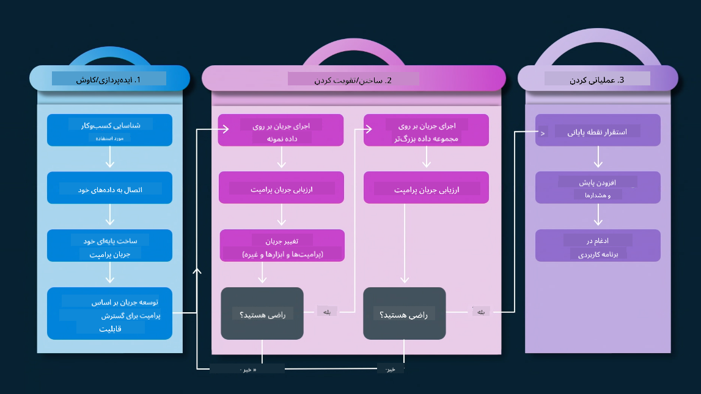
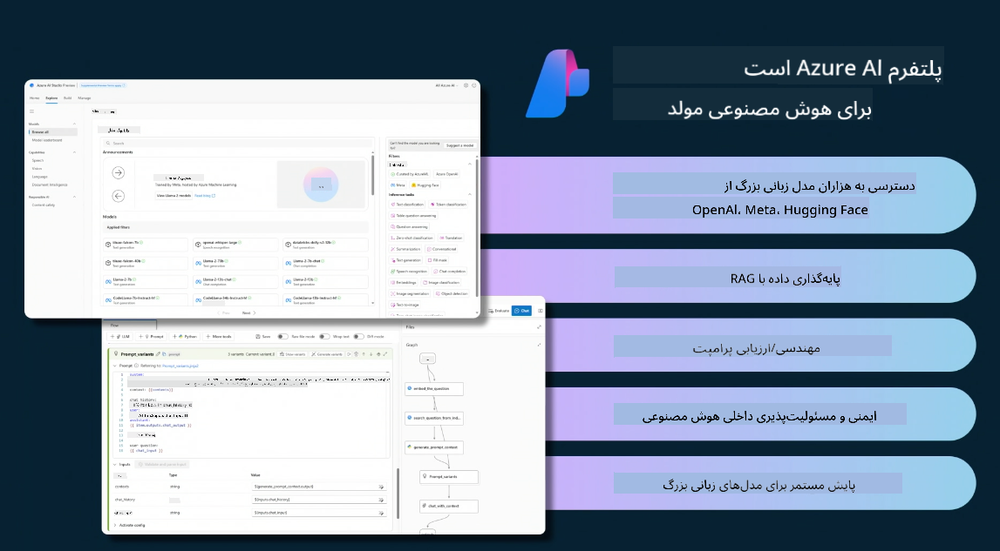

<!--
CO_OP_TRANSLATOR_METADATA:
{
  "original_hash": "b9d32511b27373a1b21b5789d4fda057",
  "translation_date": "2025-10-17T23:12:37+00:00",
  "source_file": "14-the-generative-ai-application-lifecycle/README.md",
  "language_code": "fa"
}
-->

# چرخه عمر برنامه‌های هوش مصنوعی مولد

یک سوال مهم برای همه برنامه‌های هوش مصنوعی، مرتبط بودن ویژگی‌های هوش مصنوعی است، زیرا هوش مصنوعی یک حوزه در حال تکامل سریع است. برای اطمینان از اینکه برنامه شما همچنان مرتبط، قابل اعتماد و قوی باقی می‌ماند، باید به طور مداوم آن را نظارت، ارزیابی و بهبود دهید. اینجاست که چرخه عمر هوش مصنوعی مولد وارد عمل می‌شود.

چرخه عمر هوش مصنوعی مولد یک چارچوب است که شما را در مراحل توسعه، استقرار و نگهداری یک برنامه هوش مصنوعی مولد راهنمایی می‌کند. این چرخه به شما کمک می‌کند اهداف خود را تعریف کنید، عملکرد خود را اندازه‌گیری کنید، چالش‌های خود را شناسایی کنید و راه‌حل‌های خود را اجرا کنید. همچنین به شما کمک می‌کند برنامه خود را با استانداردهای اخلاقی و قانونی حوزه کاری و ذینفعان خود هماهنگ کنید. با پیروی از چرخه عمر هوش مصنوعی مولد، می‌توانید اطمینان حاصل کنید که برنامه شما همیشه ارزش ارائه می‌دهد و کاربران شما را راضی نگه می‌دارد.

## مقدمه

در این فصل، شما:

- تغییر پارادایم از MLOps به LLMOps را درک خواهید کرد
- چرخه عمر LLM
- ابزارهای چرخه عمر
- معیاربندی و ارزیابی چرخه عمر

## درک تغییر پارادایم از MLOps به LLMOps

مدل‌های زبانی بزرگ (LLMs) یک ابزار جدید در مجموعه هوش مصنوعی هستند. این مدل‌ها در تحلیل و وظایف تولید برای برنامه‌ها بسیار قدرتمند هستند، اما این قدرت پیامدهایی در نحوه ساده‌سازی وظایف هوش مصنوعی و یادگیری ماشین کلاسیک دارد.

با این وجود، ما به یک پارادایم جدید نیاز داریم تا این ابزار را به صورت پویا و با انگیزه‌های صحیح تطبیق دهیم. می‌توان برنامه‌های قدیمی هوش مصنوعی را به عنوان "برنامه‌های ML" و برنامه‌های جدید هوش مصنوعی را به عنوان "برنامه‌های GenAI" یا فقط "برنامه‌های AI" دسته‌بندی کرد که نشان‌دهنده فناوری و تکنیک‌های اصلی مورد استفاده در آن زمان است. این تغییر روایت ما را به چندین روش تغییر می‌دهد، به مقایسه زیر توجه کنید.

توجه داشته باشید که در LLMOps، تمرکز بیشتری بر توسعه‌دهندگان برنامه داریم، با استفاده از ادغام‌ها به عنوان یک نقطه کلیدی، استفاده از "مدل‌ها به عنوان سرویس" و فکر کردن به نکات زیر برای معیارها:

- کیفیت: کیفیت پاسخ
- آسیب: هوش مصنوعی مسئولانه
- صداقت: پایه‌گذاری پاسخ (آیا منطقی است؟ آیا درست است؟)
- هزینه: بودجه راه‌حل
- تأخیر: میانگین زمان پاسخ‌دهی به توکن

## چرخه عمر LLM

ابتدا، برای درک چرخه عمر و تغییرات آن، به این اینفوگرافیک توجه کنید.

همانطور که مشاهده می‌کنید، این چرخه با چرخه‌های معمول MLOps متفاوت است. مدل‌های زبانی بزرگ نیازهای جدیدی دارند، مانند مهندسی پرامپت، تکنیک‌های مختلف برای بهبود کیفیت (Fine-Tuning، RAG، Meta-Prompts)، ارزیابی متفاوت و مسئولیت‌پذیری با هوش مصنوعی مسئولانه، و در نهایت معیارهای ارزیابی جدید (کیفیت، آسیب، صداقت، هزینه و تأخیر).

برای مثال، به نحوه ایده‌پردازی توجه کنید. استفاده از مهندسی پرامپت برای آزمایش مدل‌های مختلف LLM به منظور بررسی امکان‌پذیری فرضیه‌ها.

توجه داشته باشید که این فرآیند خطی نیست، بلکه حلقه‌های یکپارچه، تکراری و با یک چرخه کلی است.

چگونه می‌توانیم این مراحل را بررسی کنیم؟ بیایید جزئیات بیشتری را در مورد نحوه ساخت یک چرخه عمر بررسی کنیم.

این ممکن است کمی پیچیده به نظر برسد، ابتدا بر سه مرحله اصلی تمرکز کنیم.

1. ایده‌پردازی/کاوش: در این مرحله، بر اساس نیازهای کسب‌وکار خود کاوش می‌کنیم. نمونه‌سازی، ایجاد یک [PromptFlow](https://microsoft.github.io/promptflow/index.html?WT.mc_id=academic-105485-koreyst) و آزمایش کارایی فرضیه.
2. ساخت/تقویت: اجرا، در این مرحله، ارزیابی داده‌های بزرگ‌تر و اجرای تکنیک‌هایی مانند Fine-tuning و RAG برای بررسی استحکام راه‌حل آغاز می‌شود. اگر کارایی نداشته باشد، بازسازی، افزودن مراحل جدید به جریان یا بازسازی داده‌ها ممکن است کمک کند. پس از آزمایش جریان و مقیاس، اگر کارایی داشته باشد و معیارها بررسی شوند، آماده مرحله بعدی است.
3. عملیاتی‌سازی: ادغام، اکنون سیستم نظارت و هشدار را به سیستم اضافه کرده، استقرار و ادغام برنامه را در برنامه انجام می‌دهیم.

سپس، چرخه کلی مدیریت را داریم که بر امنیت، انطباق و حاکمیت تمرکز دارد.

تبریک می‌گوییم، اکنون برنامه هوش مصنوعی شما آماده اجرا و عملیاتی شدن است. برای تجربه عملی، به [دموی چت Contoso](https://nitya.github.io/contoso-chat/?WT.mc_id=academic-105485-koreys) نگاهی بیندازید.

حال، از چه ابزارهایی می‌توانیم استفاده کنیم؟

## ابزارهای چرخه عمر

برای ابزارها، مایکروسافت [پلتفرم Azure AI](https://azure.microsoft.com/solutions/ai/?WT.mc_id=academic-105485-koreys) و [PromptFlow](https://microsoft.github.io/promptflow/index.html?WT.mc_id=academic-105485-koreyst) را ارائه می‌دهد که چرخه شما را آسان‌تر و آماده اجرا می‌کند.

[پلتفرم Azure AI](https://azure.microsoft.com/solutions/ai/?WT.mc_id=academic-105485-koreys) به شما امکان استفاده از [AI Studio](https://ai.azure.com/?WT.mc_id=academic-105485-koreys) را می‌دهد. AI Studio یک پورتال وب است که به شما امکان می‌دهد مدل‌ها، نمونه‌ها و ابزارها را بررسی کنید. مدیریت منابع، جریان‌های توسعه UI و گزینه‌های SDK/CLI برای توسعه کد-محور را فراهم می‌کند.

Azure AI به شما امکان استفاده از منابع متعدد برای مدیریت عملیات، خدمات، پروژه‌ها، جستجوی برداری و نیازهای پایگاه داده را می‌دهد.

ساخت، از اثبات مفهوم (POC) تا برنامه‌های بزرگ مقیاس با PromptFlow:

- طراحی و ساخت برنامه‌ها از VS Code، با ابزارهای بصری و کاربردی
- آزمایش و تنظیم دقیق برنامه‌ها برای هوش مصنوعی با کیفیت، به راحتی.
- استفاده از Azure AI Studio برای ادغام و تکرار با ابر، انتشار و استقرار برای ادغام سریع.

## عالی! یادگیری خود را ادامه دهید!

شگفت‌انگیز است، اکنون بیشتر درباره نحوه ساختار یک برنامه برای استفاده از مفاهیم با [برنامه چت Contoso](https://nitya.github.io/contoso-chat/?WT.mc_id=academic-105485-koreyst) یاد بگیرید تا ببینید چگونه Cloud Advocacy این مفاهیم را در نمایش‌ها اضافه می‌کند. برای محتوای بیشتر، به [جلسه ویژه Ignite](https://www.youtube.com/watch?v=DdOylyrTOWg) نگاهی بیندازید!

اکنون، به درس ۱۵ بروید تا درک کنید که چگونه [تولید تقویت‌شده با بازیابی و پایگاه‌های داده برداری](../15-rag-and-vector-databases/README.md?WT.mc_id=academic-105485-koreyst) بر هوش مصنوعی مولد تأثیر می‌گذارد و برنامه‌های جذاب‌تری ایجاد می‌کند!

---

**سلب مسئولیت**:  
این سند با استفاده از سرویس ترجمه هوش مصنوعی [Co-op Translator](https://github.com/Azure/co-op-translator) ترجمه شده است. در حالی که ما تلاش می‌کنیم دقت را حفظ کنیم، لطفاً توجه داشته باشید که ترجمه‌های خودکار ممکن است شامل خطاها یا نادرستی‌ها باشند. سند اصلی به زبان اصلی آن باید به عنوان منبع معتبر در نظر گرفته شود. برای اطلاعات حیاتی، ترجمه حرفه‌ای انسانی توصیه می‌شود. ما مسئولیتی در قبال سوء تفاهم‌ها یا تفسیرهای نادرست ناشی از استفاده از این ترجمه نداریم.