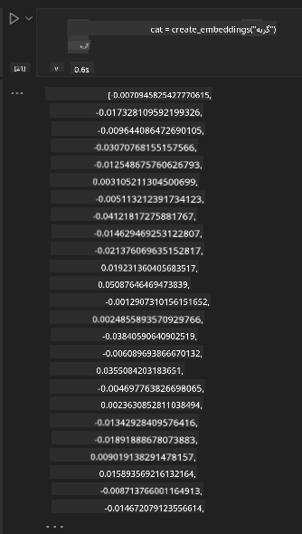

<!--
CO_OP_TRANSLATOR_METADATA:
{
  "original_hash": "e2861bbca91c0567ef32bc77fe054f9e",
  "translation_date": "2025-05-20T01:02:29+00:00",
  "source_file": "15-rag-and-vector-databases/README.md",
  "language_code": "fa"
}
-->
# تولید تقویت شده با بازیابی (RAG) و پایگاه‌های داده برداری

در درس برنامه‌های جستجو، به طور مختصر یاد گرفتیم که چگونه داده‌های خود را در مدل‌های زبانی بزرگ (LLM) ادغام کنیم. در این درس، به بررسی بیشتر مفاهیم پایه‌گذاری داده‌های خود در برنامه LLM، مکانیزم‌های فرآیند و روش‌های ذخیره‌سازی داده‌ها، از جمله جاسازی‌ها و متن، خواهیم پرداخت.

> **ویدئو به زودی می‌آید**

## مقدمه

در این درس به موارد زیر خواهیم پرداخت:

- مقدمه‌ای بر RAG، چیستی آن و دلیل استفاده از آن در هوش مصنوعی.

- فهمیدن پایگاه‌های داده برداری و ایجاد یکی برای برنامه خودمان.

- یک مثال عملی در مورد چگونگی ادغام RAG در یک برنامه.

## اهداف یادگیری

پس از اتمام این درس، قادر خواهید بود:

- توضیح اهمیت RAG در بازیابی و پردازش داده‌ها.

- راه‌اندازی برنامه RAG و پایه‌گذاری داده‌های خود به یک LLM

- ادغام موثر RAG و پایگاه‌های داده برداری در برنامه‌های LLM.

## سناریوی ما: تقویت LLM‌های ما با داده‌های خودمان

برای این درس، می‌خواهیم یادداشت‌های خود را به استارتاپ آموزشی اضافه کنیم، که به چت‌بات اجازه می‌دهد اطلاعات بیشتری درباره موضوعات مختلف بدست آورد. با استفاده از یادداشت‌هایی که داریم، یادگیرندگان می‌توانند بهتر مطالعه کنند و موضوعات مختلف را بفهمند، و این کار را برای مرور امتحانات خود آسان‌تر کنند. برای ایجاد سناریوی خود، از موارد زیر استفاده خواهیم کرد:

- `Azure OpenAI:`: LLM که برای ایجاد چت‌بات خود استفاده خواهیم کرد

- `AI for beginners' lesson on Neural Networks`: این داده‌ای است که LLM خود را بر آن پایه‌گذاری خواهیم کرد

- `Azure AI Search` و `Azure Cosmos DB:` پایگاه داده برداری برای ذخیره‌سازی داده‌ها و ایجاد یک شاخص جستجو

کاربران قادر خواهند بود آزمون‌های تمرینی از یادداشت‌های خود ایجاد کنند، کارت‌های فلش مرور و آن را به مرورهای مختصر خلاصه کنند. برای شروع، بیایید ببینیم RAG چیست و چگونه کار می‌کند:

## تولید تقویت شده با بازیابی (RAG)

یک چت‌بات مجهز به LLM درخواست‌های کاربر را برای تولید پاسخ‌ها پردازش می‌کند. این چت‌بات به گونه‌ای طراحی شده که تعاملی باشد و با کاربران در طیف وسیعی از موضوعات درگیر شود. با این حال، پاسخ‌های آن محدود به زمینه ارائه شده و داده‌های آموزشی پایه‌ای آن است. برای مثال، نقطه قطع دانش GPT-4 سپتامبر 2021 است، به این معنی که از رویدادهایی که پس از این دوره اتفاق افتاده‌اند بی‌اطلاع است. علاوه بر این، داده‌های استفاده شده برای آموزش LLMها شامل اطلاعات محرمانه مانند یادداشت‌های شخصی یا دفترچه راهنمای محصول یک شرکت نمی‌شود.

### چگونه RAGها کار می‌کنند

فرض کنید می‌خواهید یک چت‌بات که آزمون‌ها را از یادداشت‌های شما ایجاد می‌کند، راه‌اندازی کنید، به یک اتصال به پایگاه دانش نیاز خواهید داشت. اینجاست که RAG به کمک می‌آید. RAGها به صورت زیر عمل می‌کنند:

- **پایگاه دانش:** قبل از بازیابی، این اسناد باید وارد و پیش‌پردازش شوند، به طور معمول با تجزیه اسناد بزرگ به بخش‌های کوچکتر، تبدیل آنها به جاسازی‌های متنی و ذخیره‌سازی آنها در یک پایگاه داده.

- **پرسش کاربر:** کاربر سوالی می‌پرسد

- **بازیابی:** وقتی کاربر سوالی می‌پرسد، مدل جاسازی اطلاعات مرتبط را از پایگاه دانش ما بازیابی می‌کند تا زمینه بیشتری فراهم کند که در درخواست گنجانده خواهد شد.

- **تولید تقویت شده:** LLM پاسخ خود را بر اساس داده‌های بازیابی شده تقویت می‌کند. این امکان را فراهم می‌کند که پاسخ تولید شده نه تنها بر اساس داده‌های پیش‌آموزش بلکه همچنین اطلاعات مرتبط از زمینه اضافه شده باشد. داده‌های بازیابی شده برای تقویت پاسخ‌های LLM استفاده می‌شود. سپس LLM پاسخی به سوال کاربر ارائه می‌دهد.

معماری برای RAGها با استفاده از ترانسفورمرها که از دو بخش تشکیل شده‌اند: یک انکودر و یک دیکودر، پیاده‌سازی می‌شود. برای مثال، وقتی کاربر سوالی می‌پرسد، متن ورودی به بردارهایی که معنای کلمات را ثبت می‌کنند 'کدگذاری' می‌شود و بردارها به شاخص سند ما 'دیکد' می‌شوند و متن جدیدی بر اساس پرسش کاربر تولید می‌کند. LLM از هر دو مدل انکودر-دیکودر برای تولید خروجی استفاده می‌کند.

دو رویکرد در هنگام پیاده‌سازی RAG بر اساس مقاله پیشنهادی: [تولید تقویت شده با بازیابی برای وظایف پردازش زبان طبیعی (نرم‌افزار پردازش زبان طبیعی) دانش محور](https://arxiv.org/pdf/2005.11401.pdf?WT.mc_id=academic-105485-koreyst) وجود دارد:

- **_RAG-Sequence_** با استفاده از اسناد بازیابی شده برای پیش‌بینی بهترین پاسخ ممکن به پرسش کاربر

- **RAG-Token** با استفاده از اسناد برای تولید نشانه بعدی، سپس آنها را برای پاسخ به پرسش کاربر بازیابی می‌کند

### چرا از RAGها استفاده می‌کنید؟ 

- **غنای اطلاعات:** اطمینان از اینکه پاسخ‌های متنی به‌روز و فعلی هستند. بنابراین، عملکرد را در وظایف خاص حوزه با دسترسی به پایگاه دانش داخلی بهبود می‌بخشد.

- با استفاده از **داده‌های قابل تأیید** در پایگاه دانش برای ارائه زمینه به پرسش‌های کاربر، جعل را کاهش می‌دهد.

- از نظر هزینه **مقرون به صرفه** است زیرا از نظر اقتصادی نسبت به تنظیم دقیق یک LLM به صرفه‌تر است

## ایجاد یک پایگاه دانش

برنامه ما بر اساس داده‌های شخصی ما یعنی درس شبکه عصبی در برنامه درسی هوش مصنوعی برای مبتدیان است.

### پایگاه‌های داده برداری

یک پایگاه داده برداری، برخلاف پایگاه‌های داده سنتی، یک پایگاه داده تخصصی است که برای ذخیره‌سازی، مدیریت و جستجوی بردارهای جاسازی شده طراحی شده است. این پایگاه داده نمایش‌های عددی اسناد را ذخیره می‌کند. تجزیه داده‌ها به جاسازی‌های عددی، درک و پردازش داده‌ها را برای سیستم هوش مصنوعی ما آسان‌تر می‌کند.

ما جاسازی‌های خود را در پایگاه‌های داده برداری ذخیره می‌کنیم زیرا LLMها محدودیتی در تعداد نشانه‌هایی که به عنوان ورودی می‌پذیرند دارند. همانطور که نمی‌توانید تمام جاسازی‌ها را به یک LLM بدهید، باید آنها را به بخش‌هایی تقسیم کنیم و وقتی کاربر سوالی می‌پرسد، جاسازی‌هایی که بیشترین شباهت به سوال را دارند، همراه با درخواست بازگردانده می‌شوند. تقسیم به بخش‌ها همچنین هزینه‌ها را بر روی تعداد نشانه‌هایی که از یک LLM عبور می‌کنند کاهش می‌دهد.

برخی از پایگاه‌های داده برداری محبوب شامل Azure Cosmos DB، Clarifyai، Pinecone، Chromadb، ScaNN، Qdrant و DeepLake هستند. شما می‌توانید یک مدل Azure Cosmos DB با استفاده از Azure CLI با دستور زیر ایجاد کنید:

```bash
az login
az group create -n <resource-group-name> -l <location>
az cosmosdb create -n <cosmos-db-name> -r <resource-group-name>
az cosmosdb list-keys -n <cosmos-db-name> -g <resource-group-name>
```

### از متن به جاسازی‌ها

قبل از اینکه داده‌های خود را ذخیره کنیم، باید آن را به جاسازی‌های برداری تبدیل کنیم قبل از اینکه در پایگاه داده ذخیره شود. اگر با اسناد بزرگ یا متون بلند کار می‌کنید، می‌توانید آنها را بر اساس پرسش‌هایی که انتظار دارید تقسیم کنید. تقسیم می‌تواند در سطح جمله یا در سطح پاراگراف انجام شود. همانطور که تقسیم معانی را از کلمات اطراف آنها استخراج می‌کند، می‌توانید برخی زمینه‌های دیگر را به یک بخش اضافه کنید، به عنوان مثال با افزودن عنوان سند یا شامل کردن متنی قبل یا بعد از بخش. می‌توانید داده‌ها را به صورت زیر تقسیم کنید:

```python
def split_text(text, max_length, min_length):
    words = text.split()
    chunks = []
    current_chunk = []

    for word in words:
        current_chunk.append(word)
        if len(' '.join(current_chunk)) < max_length and len(' '.join(current_chunk)) > min_length:
            chunks.append(' '.join(current_chunk))
            current_chunk = []

    # If the last chunk didn't reach the minimum length, add it anyway
    if current_chunk:
        chunks.append(' '.join(current_chunk))

    return chunks
```

پس از تقسیم، می‌توانیم متن خود را با استفاده از مدل‌های جاسازی مختلف جاسازی کنیم. برخی مدل‌هایی که می‌توانید استفاده کنید شامل: word2vec، ada-002 توسط OpenAI، Azure Computer Vision و بسیاری دیگر. انتخاب مدلی که استفاده خواهید کرد به زبان‌هایی که استفاده می‌کنید، نوع محتوای کدگذاری شده (متن/تصاویر/صوت)، اندازه ورودی که می‌تواند کدگذاری کند و طول خروجی جاسازی بستگی دارد.

مثالی از متن جاسازی شده با استفاده از مدل `text-embedding-ada-002` OpenAI به شرح زیر است:


## بازیابی و جستجوی برداری

وقتی کاربر سوالی می‌پرسد، بازیابی‌کننده آن را با استفاده از انکودر پرسش به یک بردار تبدیل می‌کند، سپس در شاخص جستجوی سند ما برای بردارهای مرتبط در سند که به ورودی مربوط هستند جستجو می‌کند. پس از اتمام، هر دو بردار ورودی و بردارهای سند را به متن تبدیل کرده و از طریق LLM عبور می‌دهد.

### بازیابی

بازیابی زمانی اتفاق می‌افتد که سیستم سعی می‌کند به سرعت اسناد را از شاخص که معیارهای جستجو را برآورده می‌کنند پیدا کند. هدف بازیابی‌کننده این است که اسنادی را بدست آورد که برای ارائه زمینه و پایه‌گذاری LLM بر روی داده‌های شما استفاده خواهند شد.

چندین روش برای انجام جستجو در پایگاه داده ما وجود دارد مانند:

- **جستجوی کلیدواژه** - برای جستجوهای متنی استفاده می‌شود

- **جستجوی معنایی** - از معنای معنایی کلمات استفاده می‌کند

- **جستجوی برداری** - اسناد را از متن به نمایش‌های برداری با استفاده از مدل‌های جاسازی تبدیل می‌کند. بازیابی با جستجوی اسنادی که نمایش‌های برداری آنها نزدیک‌ترین به سوال کاربر است انجام خواهد شد.

- **ترکیبی** - ترکیبی از جستجوی کلیدواژه و برداری.

چالشی با بازیابی پیش می‌آید وقتی که هیچ پاسخ مشابهی به پرسش در پایگاه داده وجود ندارد، سیستم سپس بهترین اطلاعاتی که می‌تواند بدست آورد را بازمی‌گرداند، با این حال، می‌توانید از تاکتیک‌هایی مانند تنظیم حداکثر فاصله برای مرتبط بودن یا استفاده از جستجوی ترکیبی که هم کلیدواژه و هم جستجوی برداری را ترکیب می‌کند استفاده کنید. در این درس ما از جستجوی ترکیبی، ترکیبی از جستجوی برداری و کلیدواژه استفاده خواهیم کرد. ما داده‌های خود را به یک فریم‌داده با ستون‌هایی که شامل بخش‌ها و همچنین جاسازی‌ها هستند ذخیره خواهیم کرد.

### شباهت برداری

بازیابی‌کننده در پایگاه دانش برای جاسازی‌هایی که به هم نزدیک هستند جستجو خواهد کرد، نزدیک‌ترین همسایه، زیرا آنها متونی هستند که مشابه هستند. در سناریو کاربر سوالی می‌پرسد، ابتدا جاسازی می‌شود و سپس با جاسازی‌های مشابه مطابقت داده می‌شود. اندازه‌گیری معمولی که برای یافتن شباهت بردارهای مختلف استفاده می‌شود، شباهت کسینوسی است که بر اساس زاویه بین دو بردار است.

می‌توانیم شباهت را با استفاده از گزینه‌های دیگری که می‌توانیم استفاده کنیم مانند فاصله اقلیدسی که خط مستقیم بین نقاط انتهایی بردار است و حاصل‌ضرب نقطه‌ای که مجموع محصولات عناصر متناظر دو بردار را اندازه‌گیری می‌کند اندازه‌گیری کنیم.

### شاخص جستجو

در هنگام بازیابی، باید یک شاخص جستجو برای پایگاه دانش خود ایجاد کنیم قبل از اینکه جستجو را انجام دهیم. یک شاخص جاسازی‌های ما را ذخیره خواهد کرد و می‌تواند به سرعت نزدیک‌ترین بخش‌ها را حتی در یک پایگاه داده بزرگ بازیابی کند. می‌توانیم شاخص خود را به صورت محلی با استفاده از:

```python
from sklearn.neighbors import NearestNeighbors

embeddings = flattened_df['embeddings'].to_list()

# Create the search index
nbrs = NearestNeighbors(n_neighbors=5, algorithm='ball_tree').fit(embeddings)

# To query the index, you can use the kneighbors method
distances, indices = nbrs.kneighbors(embeddings)
```

### بازرتبه‌بندی

پس از اینکه پایگاه داده را جستجو کردید، ممکن است نیاز به مرتب‌سازی نتایج از مرتبط‌ترین داشته باشید. یک LLM بازرتبه‌بندی از یادگیری ماشین برای بهبود مرتبط بودن نتایج جستجو با مرتب‌سازی آنها از مرتبط‌ترین استفاده می‌کند. با استفاده از جستجوی هوش مصنوعی Azure، بازرتبه‌بندی به طور خودکار برای شما با استفاده از یک بازرتبه‌بندی معنایی انجام می‌شود. مثالی از چگونگی کار بازرتبه‌بندی با استفاده از نزدیک‌ترین همسایگان:

```python
# Find the most similar documents
distances, indices = nbrs.kneighbors([query_vector])

index = []
# Print the most similar documents
for i in range(3):
    index = indices[0][i]
    for index in indices[0]:
        print(flattened_df['chunks'].iloc[index])
        print(flattened_df['path'].iloc[index])
        print(flattened_df['distances'].iloc[index])
    else:
        print(f"Index {index} not found in DataFrame")
```

## جمع‌بندی همه چیز

آخرین مرحله اضافه کردن LLM خود به ترکیب برای دریافت پاسخ‌هایی است که بر اساس داده‌های ما پایه‌گذاری شده‌اند. می‌توانیم آن را به صورت زیر پیاده‌سازی کنیم:

```python
user_input = "what is a perceptron?"

def chatbot(user_input):
    # Convert the question to a query vector
    query_vector = create_embeddings(user_input)

    # Find the most similar documents
    distances, indices = nbrs.kneighbors([query_vector])

    # add documents to query  to provide context
    history = []
    for index in indices[0]:
        history.append(flattened_df['chunks'].iloc[index])

    # combine the history and the user input
    history.append(user_input)

    # create a message object
    messages=[
        {"role": "system", "content": "You are an AI assistant that helps with AI questions."},
        {"role": "user", "content": history[-1]}
    ]

    # use chat completion to generate a response
    response = openai.chat.completions.create(
        model="gpt-4",
        temperature=0.7,
        max_tokens=800,
        messages=messages
    )

    return response.choices[0].message

chatbot(user_input)
```

## ارزیابی برنامه ما

### معیارهای ارزیابی

- کیفیت پاسخ‌های ارائه شده که اطمینان حاصل شود طبیعی، روان و شبیه به انسان به نظر می‌رسند

- پایه‌گذاری داده‌ها: ارزیابی اینکه آیا پاسخ از اسناد ارائه شده آمده است

- مرتبط بودن: ارزیابی اینکه پاسخ با سوال پرسیده شده مطابقت دارد و مرتبط است

- روانی - آیا پاسخ از نظر دستوری منطقی است

## موارد استفاده از RAG (تولید تقویت شده با بازیابی) و پایگاه‌های داده برداری

موارد استفاده مختلفی وجود دارد که تماس‌های تابعی می‌تواند برنامه شما را بهبود بخشد مانند:

- پرسش و پاسخ: پایه‌گذاری داده‌های شرکت خود به یک چت که می‌تواند توسط کارمندان برای پرسیدن سوالات استفاده شود.

- سیستم‌های توصیه: جایی که می‌توانید سیستمی ایجاد کنید که بیشترین مقادیر مشابه را مطابقت دهد مانند فیلم‌ها، رستوران‌ها و بسیاری دیگر.

- خدمات چت‌بات: می‌توانید تاریخچه چت را ذخیره کنید و گفتگو را بر اساس داده‌های کاربر شخصی‌سازی کنید.

- جستجوی تصویر بر اساس جاسازی‌های برداری، مفید هنگام انجام تشخیص تصویر و تشخیص ناهنجاری.

## خلاصه

ما به حوزه‌های بنیادی RAG از اضافه کردن داده‌های خود به برنامه، پرسش کاربر و خروجی پرداخته‌ایم. برای ساده‌سازی ایجاد RAG، می‌توانید از چارچوب‌هایی مانند Semanti Kernel، Langchain یا Autogen استفاده کنید.

## تمرین

برای ادامه یادگیری تولید تقویت شده با بازیابی (RAG) می‌توانید بسازید:

- یک رابط کاربری برای برنامه با استفاده از چارچوب دلخواه خود بسازید

- از یک چارچوب، یا LangChain یا Semantic Kernel استفاده کنید و برنامه خود را بازسازی کنید.

تبریک می‌گوییم که درس را به پایان رساندید 👏.

## یادگیری در اینجا متوقف نمی‌شود، به سفر ادامه دهید

پس از اتمام این درس، مجموعه یادگیری هوش مصنوعی تولیدی ما را بررسی کنید تا به ارتقای دانش خود در زمینه هوش مصنوعی تولیدی ادامه دهید!

**سلب مسئولیت**:  
این سند با استفاده از سرویس ترجمه هوش مصنوعی [Co-op Translator](https://github.com/Azure/co-op-translator) ترجمه شده است. در حالی که ما برای دقت تلاش می‌کنیم، لطفاً توجه داشته باشید که ترجمه‌های خودکار ممکن است حاوی اشتباهات یا نادرستی‌ها باشند. سند اصلی به زبان اصلی آن باید به عنوان منبع معتبر در نظر گرفته شود. برای اطلاعات حیاتی، ترجمه حرفه‌ای انسانی توصیه می‌شود. ما مسئولیتی در قبال سوء تفاهم‌ها یا تفسیرهای نادرست ناشی از استفاده از این ترجمه نداریم.