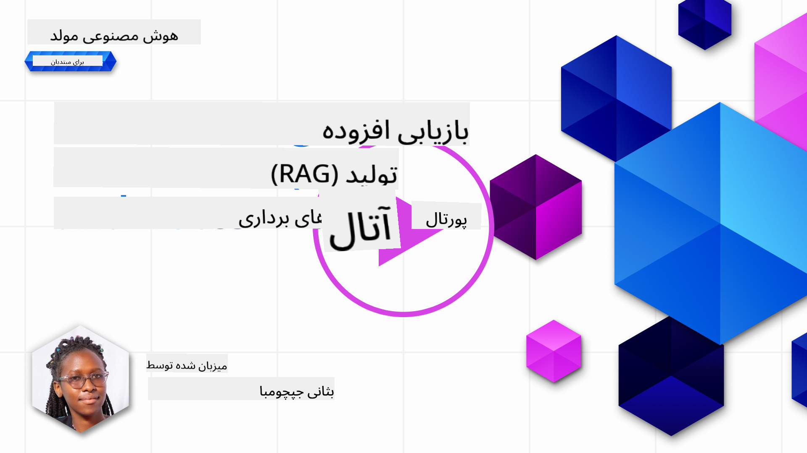
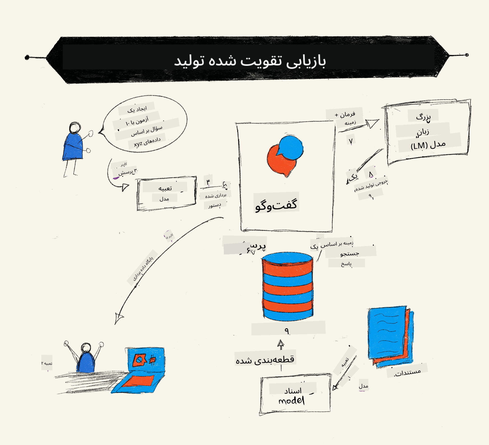
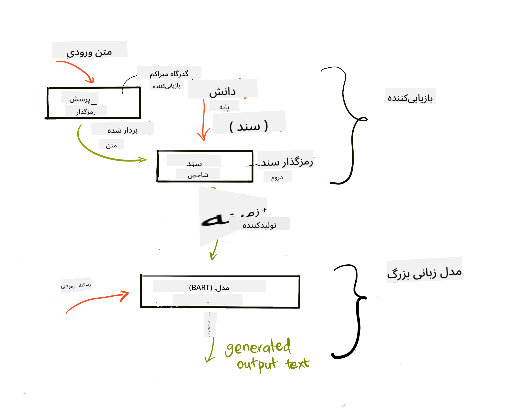
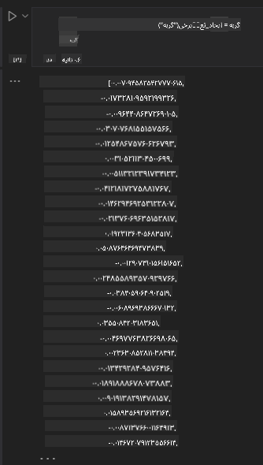

<!--
CO_OP_TRANSLATOR_METADATA:
{
  "original_hash": "e2861bbca91c0567ef32bc77fe054f9e",
  "translation_date": "2025-07-09T16:03:35+00:00",
  "source_file": "15-rag-and-vector-databases/README.md",
  "language_code": "fa"
}
-->
# تولید تقویت‌شده با بازیابی (RAG) و پایگاه‌های داده برداری

[](https://aka.ms/gen-ai-lesson15-gh?WT.mc_id=academic-105485-koreyst)

در درس برنامه‌های جستجو، به‌طور خلاصه یاد گرفتیم چگونه داده‌های خود را در مدل‌های زبان بزرگ (LLM) ادغام کنیم. در این درس، عمیق‌تر به مفاهیم پایه‌گذاری داده‌ها در برنامه LLM، مکانیزم‌های این فرایند و روش‌های ذخیره‌سازی داده‌ها، شامل تعبیه‌ها و متن، می‌پردازیم.

> **ویدئو به‌زودی منتشر می‌شود**

## مقدمه

در این درس موارد زیر را پوشش می‌دهیم:

- معرفی RAG، چیستی آن و دلیل استفاده از آن در هوش مصنوعی.

- آشنایی با پایگاه‌های داده برداری و ایجاد یکی برای برنامه خودمان.

- یک مثال عملی درباره نحوه ادغام RAG در یک برنامه.

## اهداف یادگیری

پس از اتمام این درس، قادر خواهید بود:

- اهمیت RAG در بازیابی و پردازش داده‌ها را توضیح دهید.

- برنامه RAG را راه‌اندازی کرده و داده‌های خود را به یک LLM متصل کنید.

- ادغام مؤثر RAG و پایگاه‌های داده برداری در برنامه‌های LLM.

## سناریوی ما: ارتقاء LLMهای خود با داده‌های خودمان

برای این درس، می‌خواهیم یادداشت‌های خود را به استارتاپ آموزشی اضافه کنیم تا چت‌بات بتواند اطلاعات بیشتری درباره موضوعات مختلف داشته باشد. با استفاده از این یادداشت‌ها، یادگیرندگان می‌توانند بهتر مطالعه کنند و موضوعات مختلف را بهتر درک کنند که مرور برای امتحاناتشان را آسان‌تر می‌کند. برای ایجاد این سناریو، از موارد زیر استفاده می‌کنیم:

- `Azure OpenAI:` مدل زبانی که برای ساخت چت‌بات استفاده می‌کنیم

- `درس هوش مصنوعی برای مبتدیان درباره شبکه‌های عصبی:` داده‌ای که LLM خود را بر اساس آن پایه‌گذاری می‌کنیم

- `Azure AI Search` و `Azure Cosmos DB:` پایگاه داده برداری برای ذخیره داده‌ها و ایجاد نمایه جستجو

کاربران قادر خواهند بود از یادداشت‌های خود آزمون‌های تمرینی بسازند، کارت‌های مرور ایجاد کنند و خلاصه‌های مختصر تهیه کنند. برای شروع، بیایید ببینیم RAG چیست و چگونه کار می‌کند:

## تولید تقویت‌شده با بازیابی (RAG)

یک چت‌بات مبتنی بر LLM، ورودی‌های کاربر را پردازش می‌کند تا پاسخ تولید کند. این چت‌بات به گونه‌ای طراحی شده که تعاملی باشد و با کاربران درباره موضوعات متنوع گفتگو کند. با این حال، پاسخ‌های آن محدود به زمینه ارائه شده و داده‌های آموزشی پایه آن است. برای مثال، دانش GPT-4 تا سپتامبر ۲۰۲۱ به‌روزرسانی شده است، یعنی از رویدادهای پس از آن تاریخ بی‌اطلاع است. همچنین، داده‌های استفاده شده برای آموزش LLMها شامل اطلاعات محرمانه مانند یادداشت‌های شخصی یا دفترچه راهنمای محصولات شرکت‌ها نیست.

### نحوه کار RAGها (تولید تقویت‌شده با بازیابی)



فرض کنید می‌خواهید چت‌باتی راه‌اندازی کنید که از یادداشت‌های شما آزمون بسازد، در این صورت نیاز به اتصال به پایگاه دانش دارید. اینجاست که RAG به کمک می‌آید. RAGها به این صورت عمل می‌کنند:

- **پایگاه دانش:** قبل از بازیابی، این اسناد باید وارد و پیش‌پردازش شوند، معمولاً با تقسیم اسناد بزرگ به بخش‌های کوچک‌تر، تبدیل آن‌ها به تعبیه‌های متنی و ذخیره در پایگاه داده.

- **پرسش کاربر:** کاربر سوالی می‌پرسد

- **بازیابی:** وقتی کاربر سوالی می‌پرسد، مدل تعبیه اطلاعات مرتبط را از پایگاه دانش بازیابی می‌کند تا زمینه بیشتری فراهم کند که در پرامپت وارد می‌شود.

- **تولید تقویت‌شده:** LLM پاسخ خود را بر اساس داده‌های بازیابی شده بهبود می‌بخشد. این امکان را می‌دهد که پاسخ نه تنها بر اساس داده‌های پیش‌آموزش باشد بلکه اطلاعات مرتبط از زمینه اضافه شده را نیز در بر گیرد. داده‌های بازیابی شده برای تقویت پاسخ‌های LLM استفاده می‌شوند. سپس LLM پاسخ سوال کاربر را ارائه می‌دهد.



معماری RAGها با استفاده از ترنسفورمرها شامل دو بخش است: انکودر و دیکودر. برای مثال، وقتی کاربر سوالی می‌پرسد، متن ورودی به بردارهایی تبدیل (انکد) می‌شود که معنای کلمات را در بر دارند و این بردارها به نمایه اسناد ما دیکد می‌شوند و متن جدیدی بر اساس پرسش کاربر تولید می‌کنند. LLM از مدل انکودر-دیکودر برای تولید خروجی استفاده می‌کند.

دو رویکرد برای پیاده‌سازی RAG طبق مقاله پیشنهادی: [Retrieval-Augmented Generation for Knowledge intensive NLP Tasks](https://arxiv.org/pdf/2005.11401.pdf?WT.mc_id=academic-105485-koreyst) عبارتند از:

- **_RAG-Sequence_** که از اسناد بازیابی شده برای پیش‌بینی بهترین پاسخ ممکن به سوال کاربر استفاده می‌کند

- **RAG-Token** که از اسناد برای تولید توکن بعدی استفاده می‌کند و سپس آن‌ها را برای پاسخ به سوال کاربر بازیابی می‌کند

### چرا از RAG استفاده کنیم؟

- **غنای اطلاعات:** اطمینان می‌دهد پاسخ‌های متنی به‌روز و جاری هستند. بنابراین عملکرد در وظایف خاص حوزه را با دسترسی به پایگاه دانش داخلی بهبود می‌بخشد.

- کاهش ساختگی بودن پاسخ‌ها با استفاده از **داده‌های قابل تأیید** در پایگاه دانش برای ارائه زمینه به سوالات کاربران.

- **صرفه‌جویی در هزینه:** چون نسبت به تنظیم دقیق (fine-tuning) یک LLM اقتصادی‌تر است.

## ایجاد پایگاه دانش

برنامه ما بر اساس داده‌های شخصی ما است، یعنی درس شبکه‌های عصبی در دوره هوش مصنوعی برای مبتدیان.

### پایگاه‌های داده برداری

یک پایگاه داده برداری، برخلاف پایگاه‌های داده سنتی، پایگاه داده‌ای تخصصی است که برای ذخیره، مدیریت و جستجوی بردارهای تعبیه شده طراحی شده است. این پایگاه داده نمایه‌های عددی اسناد را ذخیره می‌کند. تبدیل داده‌ها به تعبیه‌های عددی باعث می‌شود سیستم هوش مصنوعی ما بهتر داده‌ها را درک و پردازش کند.

ما تعبیه‌های خود را در پایگاه‌های داده برداری ذخیره می‌کنیم چون LLMها محدودیت تعداد توکن‌های ورودی دارند. از آنجا که نمی‌توان کل تعبیه‌ها را به LLM داد، باید آن‌ها را به بخش‌های کوچک تقسیم کنیم و وقتی کاربر سوالی می‌پرسد، تعبیه‌هایی که بیشترین شباهت به سوال دارند همراه با پرامپت بازگردانده می‌شوند. تقسیم‌بندی همچنین هزینه‌های مربوط به تعداد توکن‌های ورودی به LLM را کاهش می‌دهد.

برخی از پایگاه‌های داده برداری محبوب شامل Azure Cosmos DB، Clarifyai، Pinecone، Chromadb، ScaNN، Qdrant و DeepLake هستند. می‌توانید مدل Azure Cosmos DB را با استفاده از Azure CLI با دستور زیر ایجاد کنید:

```bash
az login
az group create -n <resource-group-name> -l <location>
az cosmosdb create -n <cosmos-db-name> -r <resource-group-name>
az cosmosdb list-keys -n <cosmos-db-name> -g <resource-group-name>
```

### از متن به تعبیه‌ها

قبل از ذخیره داده‌ها، باید آن‌ها را به تعبیه‌های برداری تبدیل کنیم. اگر با اسناد بزرگ یا متون طولانی کار می‌کنید، می‌توانید آن‌ها را بر اساس پرسش‌های مورد انتظار تقسیم کنید. تقسیم‌بندی می‌تواند در سطح جمله یا پاراگراف انجام شود. چون تقسیم‌بندی معانی را از کلمات اطراف استخراج می‌کند، می‌توانید زمینه‌های دیگری به بخش اضافه کنید، مثلاً عنوان سند یا متنی قبل یا بعد از بخش. می‌توانید داده‌ها را به این صورت تقسیم کنید:

```python
def split_text(text, max_length, min_length):
    words = text.split()
    chunks = []
    current_chunk = []

    for word in words:
        current_chunk.append(word)
        if len(' '.join(current_chunk)) < max_length and len(' '.join(current_chunk)) > min_length:
            chunks.append(' '.join(current_chunk))
            current_chunk = []

    # If the last chunk didn't reach the minimum length, add it anyway
    if current_chunk:
        chunks.append(' '.join(current_chunk))

    return chunks
```

پس از تقسیم‌بندی، می‌توانیم متن را با استفاده از مدل‌های مختلف تعبیه کنیم. برخی مدل‌هایی که می‌توانید استفاده کنید عبارتند از: word2vec، ada-002 از OpenAI، Azure Computer Vision و بسیاری دیگر. انتخاب مدل بستگی به زبان‌های مورد استفاده، نوع محتوای کدگذاری شده (متن/تصویر/صدا)، اندازه ورودی قابل کدگذاری و طول خروجی تعبیه دارد.

مثالی از متن تعبیه شده با مدل `text-embedding-ada-002` از OpenAI:



## بازیابی و جستجوی برداری

وقتی کاربر سوالی می‌پرسد، بازیاب آن را با استفاده از انکودر پرسش به بردار تبدیل می‌کند، سپس در نمایه جستجوی اسناد به دنبال بردارهای مرتبط می‌گردد. پس از آن، بردار ورودی و بردارهای اسناد را به متن تبدیل کرده و به LLM می‌فرستد.

### بازیابی

بازیابی زمانی اتفاق می‌افتد که سیستم سعی می‌کند سریعاً اسنادی را از نمایه پیدا کند که معیارهای جستجو را برآورده کنند. هدف بازیاب این است که اسنادی را بیابد که برای ارائه زمینه و پایه‌گذاری LLM روی داده‌های شما استفاده شوند.

روش‌های مختلفی برای جستجو در پایگاه داده وجود دارد، مانند:

- **جستجوی کلیدواژه** - برای جستجوی متنی

- **جستجوی معنایی** - استفاده از معنای کلمات

- **جستجوی برداری** - تبدیل اسناد از متن به بردار با استفاده از مدل‌های تعبیه. بازیابی با پرس‌وجوی اسنادی انجام می‌شود که بردارهایشان به سوال کاربر نزدیک‌تر است.

- **ترکیبی** - ترکیبی از جستجوی کلیدواژه و برداری.

چالشی که در بازیابی وجود دارد زمانی است که پاسخ مشابهی در پایگاه داده وجود ندارد، سیستم بهترین اطلاعات موجود را بازمی‌گرداند، اما می‌توانید با تنظیم حداکثر فاصله برای ارتباط یا استفاده از جستجوی ترکیبی که کلیدواژه و بردار را با هم دارد، این مشکل را کاهش دهید. در این درس از جستجوی ترکیبی استفاده می‌کنیم. داده‌ها را در یک دیتافریم با ستون‌هایی شامل بخش‌ها و تعبیه‌ها ذخیره می‌کنیم.

### شباهت برداری

بازیاب در پایگاه دانش به دنبال تعبیه‌هایی می‌گردد که به هم نزدیک هستند، نزدیک‌ترین همسایه، چون متن‌های مشابهی هستند. در سناریو، وقتی کاربر سوالی می‌پرسد، ابتدا تعبیه می‌شود و سپس با تعبیه‌های مشابه مطابقت داده می‌شود. معیار رایج برای اندازه‌گیری شباهت بردارها، شباهت کسینوسی است که بر اساس زاویه بین دو بردار است.

می‌توانیم از معیارهای دیگری مانند فاصله اقلیدسی (خط مستقیم بین نقاط انتهایی بردارها) و ضرب داخلی (مجموع حاصل‌ضرب عناصر متناظر دو بردار) نیز استفاده کنیم.

### نمایه جستجو

برای انجام بازیابی، باید قبل از جستجو نمایه‌ای برای پایگاه دانش بسازیم. نمایه تعبیه‌ها را ذخیره می‌کند و می‌تواند سریع‌ترین بخش‌های مشابه را حتی در پایگاه داده بزرگ بازیابی کند. می‌توانیم نمایه را به صورت محلی با دستور زیر ایجاد کنیم:

```python
from sklearn.neighbors import NearestNeighbors

embeddings = flattened_df['embeddings'].to_list()

# Create the search index
nbrs = NearestNeighbors(n_neighbors=5, algorithm='ball_tree').fit(embeddings)

# To query the index, you can use the kneighbors method
distances, indices = nbrs.kneighbors(embeddings)
```

### رتبه‌بندی مجدد

پس از پرس‌وجو در پایگاه داده، ممکن است نیاز باشد نتایج را از مرتبط‌ترین مرتب کنیم. یک LLM رتبه‌بندی مجدد با استفاده از یادگیری ماشین، مرتبط‌ترین نتایج جستجو را به ترتیب اولویت قرار می‌دهد. با استفاده از Azure AI Search، رتبه‌بندی مجدد به‌صورت خودکار با استفاده از رتبه‌بندی معنایی انجام می‌شود. نمونه‌ای از نحوه کار رتبه‌بندی مجدد با نزدیک‌ترین همسایه‌ها:

```python
# Find the most similar documents
distances, indices = nbrs.kneighbors([query_vector])

index = []
# Print the most similar documents
for i in range(3):
    index = indices[0][i]
    for index in indices[0]:
        print(flattened_df['chunks'].iloc[index])
        print(flattened_df['path'].iloc[index])
        print(flattened_df['distances'].iloc[index])
    else:
        print(f"Index {index} not found in DataFrame")
```

## جمع‌بندی همه چیز

آخرین مرحله افزودن LLM به این فرایند است تا پاسخ‌هایی که بر اساس داده‌های ما پایه‌گذاری شده‌اند دریافت کنیم. می‌توانیم آن را به صورت زیر پیاده‌سازی کنیم:

```python
user_input = "what is a perceptron?"

def chatbot(user_input):
    # Convert the question to a query vector
    query_vector = create_embeddings(user_input)

    # Find the most similar documents
    distances, indices = nbrs.kneighbors([query_vector])

    # add documents to query  to provide context
    history = []
    for index in indices[0]:
        history.append(flattened_df['chunks'].iloc[index])

    # combine the history and the user input
    history.append(user_input)

    # create a message object
    messages=[
        {"role": "system", "content": "You are an AI assistant that helps with AI questions."},
        {"role": "user", "content": history[-1]}
    ]

    # use chat completion to generate a response
    response = openai.chat.completions.create(
        model="gpt-4",
        temperature=0.7,
        max_tokens=800,
        messages=messages
    )

    return response.choices[0].message

chatbot(user_input)
```

## ارزیابی برنامه ما

### معیارهای ارزیابی

- کیفیت پاسخ‌ها: اطمینان از طبیعی، روان و انسانی بودن صدا

- پایه‌گذاری داده‌ها: ارزیابی اینکه آیا پاسخ از اسناد ارائه شده آمده است

- مرتبط بودن: ارزیابی اینکه پاسخ با سوال پرسیده شده مطابقت دارد و مرتبط است

- روانی: اینکه پاسخ از نظر گرامری منطقی باشد

## موارد استفاده از RAG و پایگاه‌های داده برداری

موارد استفاده متعددی وجود دارد که فراخوانی توابع می‌تواند برنامه شما را بهبود بخشد، مانند:

- پرسش و پاسخ: پایه‌گذاری داده‌های شرکت خود در چتی که کارکنان بتوانند سوال بپرسند.

- سیستم‌های پیشنهاددهی: جایی که می‌توانید سیستمی بسازید که بیشترین شباهت‌ها را مطابقت دهد، مثلاً فیلم‌ها، رستوران‌ها و غیره.

- خدمات چت‌بات: می‌توانید تاریخچه چت را ذخیره کرده و گفتگو را بر اساس داده‌های کاربر شخصی‌سازی کنید.

- جستجوی تصویر بر اساس تعبیه‌های برداری، مفید برای شناسایی تصویر و تشخیص ناهنجاری.

## خلاصه

ما مباحث پایه‌ای RAG را از افزودن داده‌ها به برنامه، پرسش کاربر و خروجی پوشش دادیم. برای ساده‌سازی ساخت RAG، می‌توانید از فریم‌ورک‌هایی مانند Semantic Kernel، Langchain یا Autogen استفاده کنید.

## تمرین

برای ادامه یادگیری تولید تقویت‌شده با بازیابی (RAG) می‌توانید:

- یک رابط کاربری برای برنامه با فریم‌ورک دلخواه خود بسازید

- از یک فریم‌ورک مانند LangChain یا Semantic Kernel استفاده کرده و برنامه خود را بازسازی کنید.

تبریک می‌گوییم که این درس را به پایان رساندید 👏.

## یادگیری اینجا متوقف نمی‌شود، سفر را ادامه دهید

پس از اتمام این درس، مجموعه [یادگیری هوش مصنوعی مولد](https://aka.ms/genai-collection?WT.mc_id=academic-105485-koreyst) ما را بررسی کنید تا دانش خود در زمینه هوش مصنوعی مولد را ارتقا دهید!

**سلب مسئولیت**:  
این سند با استفاده از سرویس ترجمه هوش مصنوعی [Co-op Translator](https://github.com/Azure/co-op-translator) ترجمه شده است. در حالی که ما در تلاش برای دقت هستیم، لطفاً توجه داشته باشید که ترجمه‌های خودکار ممکن است حاوی خطاها یا نادرستی‌هایی باشند. سند اصلی به زبان بومی خود باید به عنوان منبع معتبر در نظر گرفته شود. برای اطلاعات حیاتی، ترجمه حرفه‌ای انسانی توصیه می‌شود. ما مسئول هیچ گونه سوءتفاهم یا تفسیر نادرستی که از استفاده از این ترجمه ناشی شود، نیستیم.