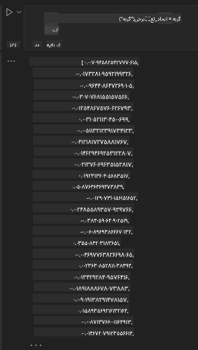

<!--
CO_OP_TRANSLATOR_METADATA:
{
  "original_hash": "e2861bbca91c0567ef32bc77fe054f9e",
  "translation_date": "2025-06-25T22:18:44+00:00",
  "source_file": "15-rag-and-vector-databases/README.md",
  "language_code": "fa"
}
-->
# تولید تقویت‌شده با بازیابی (RAG) و پایگاه‌های داده برداری

در درس برنامه‌های جستجو، به طور مختصر یاد گرفتیم که چگونه داده‌های خود را در مدل‌های زبانی بزرگ (LLMs) ادغام کنیم. در این درس، به مفاهیم پایه‌گذاری داده‌ها در برنامه LLM شما، مکانیک فرآیند و روش‌های ذخیره‌سازی داده‌ها، از جمله جاسازی‌ها و متن، خواهیم پرداخت.

> **ویدئو به زودی**

## مقدمه

در این درس موارد زیر را پوشش خواهیم داد:

- مقدمه‌ای بر RAG، چیست و چرا در هوش مصنوعی استفاده می‌شود.

- درک پایگاه‌های داده برداری و ایجاد یکی برای برنامه خود.

- مثال عملی در مورد چگونگی ادغام RAG در یک برنامه.

## اهداف یادگیری

پس از تکمیل این درس، شما قادر خواهید بود:

- اهمیت RAG در بازیابی و پردازش داده‌ها را توضیح دهید.

- برنامه RAG را راه‌اندازی کرده و داده‌های خود را به یک LLM پایه‌گذاری کنید.

- ادغام مؤثر RAG و پایگاه‌های داده برداری در برنامه‌های LLM.

## سناریوی ما: تقویت LLM‌ها با داده‌های خودمان

برای این درس، می‌خواهیم یادداشت‌های خود را به استارتاپ آموزشی اضافه کنیم، که به ربات چت امکان می‌دهد اطلاعات بیشتری در مورد موضوعات مختلف به دست آورد. با استفاده از یادداشت‌هایی که داریم، یادگیرندگان قادر خواهند بود بهتر مطالعه کنند و موضوعات مختلف را درک کنند، که باعث می‌شود برای امتحانات خود راحت‌تر مرور کنند. برای ایجاد سناریوی خود، از موارد زیر استفاده خواهیم کرد:

- `Azure OpenAI:` LLM که برای ایجاد ربات چت خود استفاده خواهیم کرد

- `AI for beginners' lesson on Neural Networks`: این داده‌ای خواهد بود که LLM خود را بر روی آن پایه‌گذاری می‌کنیم

- `Azure AI Search` و `Azure Cosmos DB:` پایگاه داده برداری برای ذخیره داده‌های خود و ایجاد یک شاخص جستجو

کاربران قادر خواهند بود از یادداشت‌های خود آزمون‌های تمرینی ایجاد کنند، کارت‌های فلش مرور و آن را به خلاصه‌های مختصر تبدیل کنند. برای شروع، بیایید ببینیم RAG چیست و چگونه کار می‌کند:

## تولید تقویت‌شده با بازیابی (RAG)

یک ربات چت مبتنی بر LLM درخواست‌های کاربر را پردازش می‌کند تا پاسخ‌هایی تولید کند. این طراحی شده است تا تعاملی باشد و با کاربران در موضوعات مختلف درگیر شود. با این حال، پاسخ‌های آن محدود به زمینه ارائه شده و داده‌های آموزشی بنیادی آن است. به عنوان مثال، محدودیت دانشی GPT-4 تا سپتامبر 2021 است، یعنی اطلاعاتی از رویدادهایی که پس از این دوره رخ داده‌اند ندارد. علاوه بر این، داده‌های مورد استفاده برای آموزش LLM‌ها اطلاعات محرمانه‌ای مانند یادداشت‌های شخصی یا راهنمای محصول یک شرکت را شامل نمی‌شود.

### چگونه RAG‌ها (تولید تقویت‌شده با بازیابی) کار می‌کنند

فرض کنید می‌خواهید یک ربات چت ایجاد کنید که از یادداشت‌های شما آزمون ایجاد کند، شما به اتصال به پایگاه دانش نیاز خواهید داشت. اینجا است که RAG به کمک می‌آید. RAG‌ها به این صورت عمل می‌کنند:

- **پایگاه دانش:** قبل از بازیابی، این اسناد باید وارد شده و پیش‌پردازش شوند، معمولاً با شکستن اسناد بزرگ به قطعات کوچکتر، تبدیل آنها به جاسازی‌های متنی و ذخیره آنها در پایگاه داده.

- **پرسش کاربر:** کاربر یک سؤال می‌پرسد

- **بازیابی:** هنگامی که کاربر یک سؤال می‌پرسد، مدل جاسازی اطلاعات مرتبط را از پایگاه دانش ما بازیابی می‌کند تا زمینه بیشتری فراهم کند که در درخواست گنجانده خواهد شد.

- **تولید تقویت‌شده:** LLM پاسخ خود را بر اساس داده‌های بازیابی شده تقویت می‌کند. این امکان را می‌دهد که پاسخ تولید شده نه تنها بر اساس داده‌های پیش‌آموزشی بلکه اطلاعات مرتبط از زمینه اضافه شده باشد. داده‌های بازیابی شده برای تقویت پاسخ‌های LLM استفاده می‌شود. سپس LLM پاسخی به پرسش کاربر بازمی‌گرداند.

معماری RAG‌ها با استفاده از ترانسفورمرها که شامل دو بخش: رمزگذار و رمزگشا است، پیاده‌سازی می‌شود. برای مثال، وقتی کاربر یک سؤال می‌پرسد، متن ورودی به بردارهایی که معنای کلمات را به تصویر می‌کشند، 'رمزگذاری' می‌شود و بردارها به شاخص سند ما 'رمزگشایی' می‌شوند و متن جدیدی بر اساس پرسش کاربر تولید می‌کنند. LLM از مدل رمزگذار-رمزگشا برای تولید خروجی استفاده می‌کند.

دو رویکرد هنگام پیاده‌سازی RAG بر اساس مقاله پیشنهادی: [تولید تقویت‌شده با بازیابی برای وظایف NLP (نرم‌افزار پردازش زبان طبیعی) دانش‌محور](https://arxiv.org/pdf/2005.11401.pdf?WT.mc_id=academic-105485-koreyst) عبارتند از:

- **_RAG-Sequence_** استفاده از اسناد بازیابی شده برای پیش‌بینی بهترین پاسخ ممکن به پرسش کاربر

- **RAG-Token** استفاده از اسناد برای تولید توکن بعدی، سپس آنها را بازیابی کرده تا به پرسش کاربر پاسخ دهند

### چرا از RAG‌ها استفاده می‌کنید؟ 

- **غنای اطلاعات:** اطمینان از اینکه پاسخ‌های متنی به‌روز و جاری هستند. بنابراین، عملکرد را در وظایف خاص دامنه با دسترسی به پایگاه دانش داخلی بهبود می‌بخشد.

- با استفاده از **داده‌های قابل تأیید** در پایگاه دانش، **تولید** را کاهش می‌دهد تا زمینه‌ای برای پرسش‌های کاربر فراهم کند.

- **اقتصادی است** زیرا نسبت به تنظیم دقیق یک LLM اقتصادی‌تر هستند

## ایجاد پایگاه دانش

برنامه ما بر اساس داده‌های شخصی ما یعنی درس شبکه عصبی در برنامه آموزشی هوش مصنوعی برای مبتدیان است.

### پایگاه‌های داده برداری

یک پایگاه داده برداری، برخلاف پایگاه‌های داده سنتی، یک پایگاه داده تخصصی است که برای ذخیره، مدیریت و جستجوی بردارهای جاسازی شده طراحی شده است. این پایگاه داده نمایش‌های عددی اسناد را ذخیره می‌کند. شکستن داده‌ها به جاسازی‌های عددی باعث می‌شود سیستم هوش مصنوعی ما داده‌ها را بهتر درک و پردازش کند.

ما جاسازی‌های خود را در پایگاه‌های داده برداری ذخیره می‌کنیم زیرا LLM‌ها محدودیتی در تعداد توکن‌هایی که به عنوان ورودی قبول می‌کنند دارند. همانطور که نمی‌توانید تمام جاسازی‌ها را به یک LLM منتقل کنید، باید آنها را به قطعات تقسیم کنیم و وقتی کاربر سؤال می‌پرسد، جاسازی‌هایی که بیشتر شبیه سؤال هستند، همراه با درخواست بازگردانده می‌شوند. تقسیم‌بندی همچنین هزینه‌ها را بر روی تعداد توکن‌هایی که از یک LLM عبور می‌کنند کاهش می‌دهد.

برخی از پایگاه‌های داده برداری محبوب شامل Azure Cosmos DB، Clarifyai، Pinecone، Chromadb، ScaNN، Qdrant و DeepLake هستند. شما می‌توانید مدل Azure Cosmos DB را با استفاده از Azure CLI با فرمان زیر ایجاد کنید:

```bash
az login
az group create -n <resource-group-name> -l <location>
az cosmosdb create -n <cosmos-db-name> -r <resource-group-name>
az cosmosdb list-keys -n <cosmos-db-name> -g <resource-group-name>
```

### از متن به جاسازی‌ها

قبل از ذخیره داده‌های خود، باید آن را به جاسازی‌های برداری تبدیل کنیم قبل از اینکه در پایگاه داده ذخیره شود. اگر با اسناد بزرگ یا متن‌های طولانی کار می‌کنید، می‌توانید آنها را بر اساس پرسش‌هایی که انتظار دارید تقسیم‌بندی کنید. تقسیم‌بندی می‌تواند در سطح جمله یا در سطح پاراگراف انجام شود. همانطور که تقسیم‌بندی معانی را از کلمات اطراف استخراج می‌کند، می‌توانید مقداری زمینه دیگر به یک قطعه اضافه کنید، برای مثال، با اضافه کردن عنوان سند یا شامل کردن مقداری متن قبل یا بعد از قطعه. شما می‌توانید داده‌ها را به صورت زیر تقسیم‌بندی کنید:

```python
def split_text(text, max_length, min_length):
    words = text.split()
    chunks = []
    current_chunk = []

    for word in words:
        current_chunk.append(word)
        if len(' '.join(current_chunk)) < max_length and len(' '.join(current_chunk)) > min_length:
            chunks.append(' '.join(current_chunk))
            current_chunk = []

    # If the last chunk didn't reach the minimum length, add it anyway
    if current_chunk:
        chunks.append(' '.join(current_chunk))

    return chunks
```

پس از تقسیم‌بندی، می‌توانیم متن خود را با استفاده از مدل‌های جاسازی مختلف جاسازی کنیم. برخی از مدل‌هایی که می‌توانید استفاده کنید عبارتند از: word2vec، ada-002 توسط OpenAI، Azure Computer Vision و بسیاری دیگر. انتخاب مدل برای استفاده بستگی به زبان‌هایی که استفاده می‌کنید، نوع محتوای رمزگذاری شده (متن/تصاویر/صدا)، اندازه ورودی که می‌تواند رمزگذاری کند و طول خروجی جاسازی دارد.

یک مثال از متن جاسازی شده با استفاده از مدل `text-embedding-ada-002` OpenAI:


## بازیابی و جستجوی برداری

وقتی کاربر یک سؤال می‌پرسد، بازیاب آن را با استفاده از رمزگذار پرسش به یک بردار تبدیل می‌کند، سپس در شاخص جستجوی سند ما برای بردارهای مرتبط در سند که به ورودی مربوط هستند جستجو می‌کند. پس از انجام، هر دو بردار ورودی و بردارهای سند را به متن تبدیل می‌کند و از طریق LLM عبور می‌دهد.

### بازیابی

بازیابی زمانی اتفاق می‌افتد که سیستم سعی می‌کند به سرعت اسناد را از شاخص پیدا کند که معیارهای جستجو را برآورده کنند. هدف بازیاب این است که اسنادی را به دست آورد که برای فراهم کردن زمینه و پایه‌گذاری LLM بر روی داده‌های شما استفاده شود.

روش‌های مختلفی برای انجام جستجو در پایگاه داده ما وجود دارد مانند:

- **جستجوی کلیدواژه** - برای جستجوهای متنی استفاده می‌شود

- **جستجوی معنایی** - از معنای معنایی کلمات استفاده می‌کند

- **جستجوی برداری** - اسناد را از متن به نمایش‌های برداری با استفاده از مدل‌های جاسازی تبدیل می‌کند. بازیابی با پرسش اسنادی انجام می‌شود که نمایش‌های برداری آنها نزدیک‌ترین به پرسش کاربر است.

- **ترکیبی** - ترکیبی از جستجوی کلیدواژه و برداری.

چالشی که با بازیابی وجود دارد زمانی است که هیچ پاسخ مشابهی به پرسش در پایگاه داده وجود ندارد، سیستم سپس بهترین اطلاعاتی که می‌تواند به دست آورد را بازمی‌گرداند، با این حال، می‌توانید از تاکتیک‌هایی مانند تنظیم حداکثر فاصله برای مرتبط بودن یا استفاده از جستجوی ترکیبی که هم کلیدواژه و هم جستجوی برداری را ترکیب می‌کند استفاده کنید. در این درس از جستجوی ترکیبی، ترکیبی از جستجوی برداری و کلیدواژه استفاده خواهیم کرد. داده‌های خود را در یک dataframe با ستون‌هایی که شامل قطعات و جاسازی‌ها هستند ذخیره خواهیم کرد.

### شباهت برداری

بازیاب در پایگاه دانش برای جاسازی‌هایی که به هم نزدیک هستند، نزدیک‌ترین همسایه، به عنوان متن‌هایی که مشابه هستند جستجو می‌کند. در سناریویی که کاربر یک پرسش می‌پرسد، ابتدا جاسازی می‌شود و سپس با جاسازی‌های مشابه مطابقت داده می‌شود. اندازه‌گیری رایجی که برای یافتن میزان شباهت بردارهای مختلف استفاده می‌شود شباهت کسینوسی است که بر اساس زاویه بین دو بردار است.

ما می‌توانیم شباهت را با استفاده از جایگزین‌های دیگری که می‌توانیم استفاده کنیم مانند فاصله اقلیدسی که خط مستقیم بین نقاط پایانی بردار است و ضرب نقطه‌ای که مجموع محصولات عناصر متناظر دو بردار را اندازه‌گیری می‌کند، اندازه‌گیری کنیم.

### شاخص جستجو

هنگام انجام بازیابی، ما نیاز داریم که قبل از انجام جستجو یک شاخص جستجو برای پایگاه دانش خود بسازیم. یک شاخص جاسازی‌های ما را ذخیره می‌کند و می‌تواند به سرعت مشابه‌ترین قطعات را حتی در یک پایگاه داده بزرگ بازیابی کند. ما می‌توانیم شاخص خود را به صورت محلی ایجاد کنیم با استفاده از:

```python
from sklearn.neighbors import NearestNeighbors

embeddings = flattened_df['embeddings'].to_list()

# Create the search index
nbrs = NearestNeighbors(n_neighbors=5, algorithm='ball_tree').fit(embeddings)

# To query the index, you can use the kneighbors method
distances, indices = nbrs.kneighbors(embeddings)
```

### مرتب‌سازی مجدد

هنگامی که پایگاه داده را پرسش کردید، ممکن است نیاز داشته باشید که نتایج را از مرتبط‌ترین مرتب کنید. یک LLM مرتب‌سازی مجدد از یادگیری ماشین استفاده می‌کند تا ارتباط نتایج جستجو را با مرتب‌سازی آنها از مرتبط‌ترین بهبود بخشد. با استفاده از جستجوی هوش مصنوعی Azure، مرتب‌سازی مجدد به طور خودکار برای شما انجام می‌شود با استفاده از مرتب‌کننده معنایی. یک مثال از چگونگی کارکرد مرتب‌سازی مجدد با استفاده از نزدیک‌ترین همسایه‌ها:

```python
# Find the most similar documents
distances, indices = nbrs.kneighbors([query_vector])

index = []
# Print the most similar documents
for i in range(3):
    index = indices[0][i]
    for index in indices[0]:
        print(flattened_df['chunks'].iloc[index])
        print(flattened_df['path'].iloc[index])
        print(flattened_df['distances'].iloc[index])
    else:
        print(f"Index {index} not found in DataFrame")
```

## گردآوری همه چیز

آخرین مرحله افزودن LLM خود به ترکیب است تا بتوانید پاسخ‌هایی که بر روی داده‌های ما پایه‌گذاری شده‌اند دریافت کنید. ما می‌توانیم آن را به صورت زیر پیاده‌سازی کنیم:

```python
user_input = "what is a perceptron?"

def chatbot(user_input):
    # Convert the question to a query vector
    query_vector = create_embeddings(user_input)

    # Find the most similar documents
    distances, indices = nbrs.kneighbors([query_vector])

    # add documents to query  to provide context
    history = []
    for index in indices[0]:
        history.append(flattened_df['chunks'].iloc[index])

    # combine the history and the user input
    history.append(user_input)

    # create a message object
    messages=[
        {"role": "system", "content": "You are an AI assistant that helps with AI questions."},
        {"role": "user", "content": history[-1]}
    ]

    # use chat completion to generate a response
    response = openai.chat.completions.create(
        model="gpt-4",
        temperature=0.7,
        max_tokens=800,
        messages=messages
    )

    return response.choices[0].message

chatbot(user_input)
```

## ارزیابی برنامه ما

### معیارهای ارزیابی

- کیفیت پاسخ‌های ارائه شده اطمینان حاصل شود که طبیعی، روان و انسانی به نظر می‌رسند

- پایه‌گذاری داده‌ها: ارزیابی اینکه آیا پاسخ از اسناد ارائه شده آمده است

- ارتباط: ارزیابی اینکه پاسخ با پرسش پرسیده شده مطابقت دارد و مرتبط است

- روانی - آیا پاسخ از نظر گرامری منطقی است

## موارد استفاده از استفاده از RAG (تولید تقویت‌شده با بازیابی) و پایگاه‌های داده برداری

موارد استفاده مختلفی وجود دارد که فراخوان‌های تابع می‌توانند برنامه شما را بهبود بخشند مانند:

- پرسش و پاسخ: پایه‌گذاری داده‌های شرکت خود به چتی که می‌تواند توسط کارمندان برای پرسش سؤال‌ها استفاده شود.

- سیستم‌های توصیه: جایی که می‌توانید سیستمی ایجاد کنید که بیشترین مقادیر مشابه را مطابقت دهد مانند فیلم‌ها، رستوران‌ها و بسیاری دیگر.

- خدمات ربات چت: می‌توانید تاریخچه چت را ذخیره کنید و مکالمه را بر اساس داده‌های کاربر شخصی‌سازی کنید.

- جستجوی تصویر بر اساس جاسازی‌های برداری، مفید هنگام انجام تشخیص تصویر و تشخیص ناهنجاری.

## خلاصه

ما مناطق اساسی RAG را از افزودن داده‌های خود به برنامه، پرسش کاربر و خروجی پوشش داده‌ایم. برای ساده‌سازی ایجاد RAG، می‌توانید از چارچوب‌هایی مانند Semanti Kernel، Langchain یا Autogen استفاده کنید.

## تکلیف

برای ادامه یادگیری تولید تقویت‌شده با بازیابی (RAG) می‌توانید بسازید:

- یک رابط کاربری برای برنامه با استفاده از چارچوب مورد نظر خود بسازید

- از یک چارچوب، یا LangChain یا Semantic Kernel استفاده کنید و برنامه خود را بازسازی کنید.

تبریک می‌گویم که درس را به پایان رساندید 👏.

## یادگیری در اینجا متوقف نمی‌شود، سفر را ادامه دهید

پس از تکمیل این درس، مجموعه [یادگیری هوش مصنوعی تولیدی](https://aka.ms/genai-collection?WT.mc_id=academic-105485-koreyst) ما را بررسی کنید تا به یادگیری خود در زمینه هوش مصنوعی تولیدی ادامه دهید!

**سلب مسئولیت**:  
این سند با استفاده از سرویس ترجمه هوش مصنوعی [Co-op Translator](https://github.com/Azure/co-op-translator) ترجمه شده است. در حالی که ما برای دقت تلاش می‌کنیم، لطفاً توجه داشته باشید که ترجمه‌های خودکار ممکن است حاوی اشتباهات یا نادرستی‌هایی باشند. سند اصلی به زبان بومی آن باید به عنوان منبع معتبر در نظر گرفته شود. برای اطلاعات حساس، ترجمه انسانی حرفه‌ای توصیه می‌شود. ما در قبال هرگونه سوءتفاهم یا تفسیر نادرست ناشی از استفاده از این ترجمه مسئولیتی نداریم.