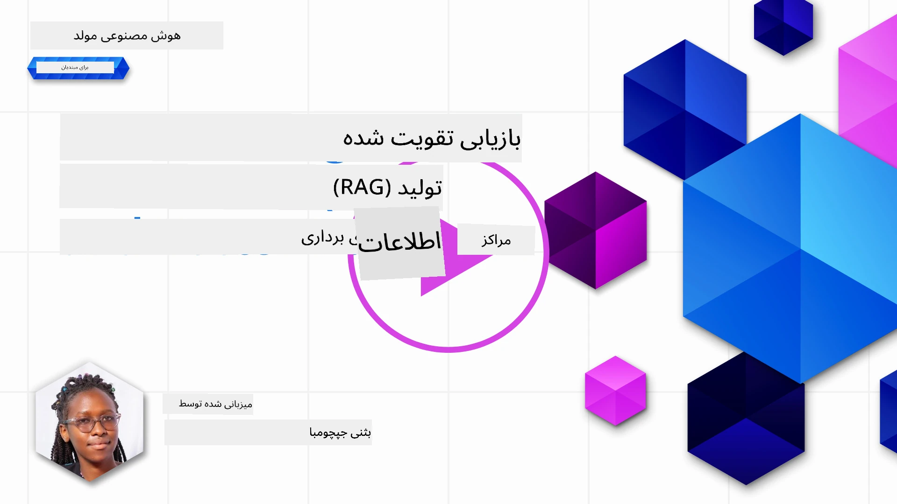
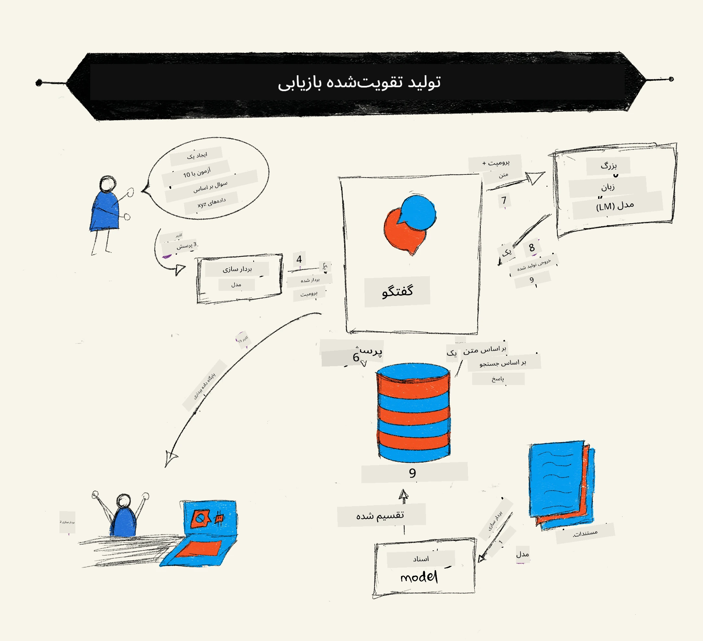
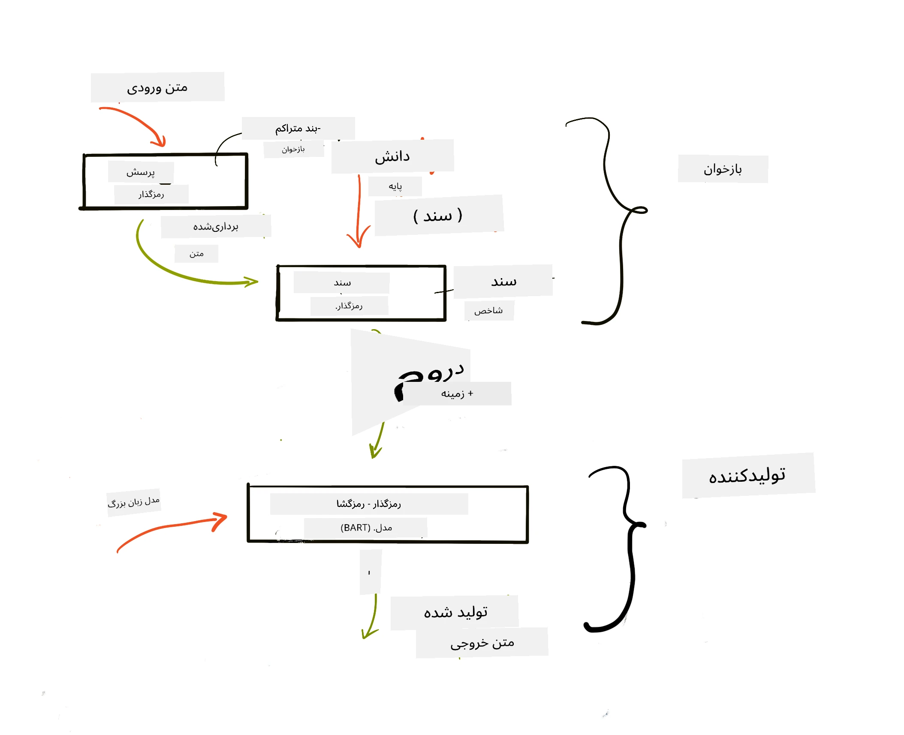
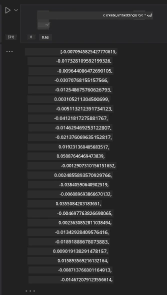

# تولید تقویت‌شده با بازیابی (RAG) و پایگاه‌های داده برداری

[](https://youtu.be/4l8zhHUBeyI?si=BmvDmL1fnHtgQYkL)

در درس برنامه‌های جستجو، به طور مختصر یاد گرفتیم چگونه داده‌های خود را در مدل‌های زبانی بزرگ (LLMها) ادغام کنیم. در این درس، بیشتر به مفاهیم پایه‌ای کردن داده‌ها در برنامه LLM خود، مکانیک فرآیند و روش‌های ذخیره داده‌ها، از جمله تعبیه‌ها و متن، می‌پردازیم.

> **ویدئو به زودی منتشر می‌شود**

## مقدمه

در این درس موارد زیر را پوشش خواهیم داد:

- معرفی RAG، چیستی آن و دلیل استفاده از آن در هوش مصنوعی (artificial intelligence).

- آشنایی با پایگاه‌های داده برداری و ساخت یکی برای برنامه خودمان.

- یک مثال عملی از نحوه ادغام RAG به درون یک برنامه.

## اهداف یادگیری

پس از اتمام این درس، قادر خواهید بود:

- اهمیت RAG در بازیابی و پردازش داده‌ها را توضیح دهید.

- راه‌اندازی برنامه RAG و پایه‌گذاری داده‌های خود در یک LLM

- ادغام موثر RAG و پایگاه‌های داده برداری در برنامه‌های LLM.

## سناریوی ما: بهبود LLMهای خود با داده‌های خودمان

برای این درس، می‌خواهیم یادداشت‌های خود را به یک استارتاپ آموزشی اضافه کنیم که اجازه می‌دهد چت‌بات اطلاعات بیشتری درباره موضوعات مختلف کسب کند. با استفاده از یادداشت‌هایی که داریم، دانش‌آموزان قادر خواهند بود بهتر مطالعه کنند و موضوعات مختلف را بفهمند که مرور برای امتحاناتشان را آسان‌تر می‌کند. برای ایجاد سناریوی خود، از موارد زیر استفاده می‌کنیم:

- `Azure OpenAI:` مدلی که برای ساخت چت‌بات خود استفاده خواهیم کرد

- `درس AI for beginners در مورد شبکه‌های عصبی`: این داده‌ای است که LLM ما براساس آن پایه‌گذاری خواهد شد

- `Azure AI Search` و `Azure Cosmos DB:` پایگاه داده برداری برای ذخیره داده‌ها و ساخت نمایه جستجو

کاربران قادر خواهند بود آزمون‌های تمرینی از یادداشت‌های خود بسازند، کارت‌های مرور بسازند و آن‌ها را به خلاصه‌های مختصر تبدیل کنند. برای شروع، بیایید ببینیم RAG چیست و چگونه کار می‌کند:

## تولید تقویت‌شده با بازیابی (RAG)

یک چت‌بات مبتنی بر LLM درخواست‌های کاربری را پردازش می‌کند تا پاسخ تولید کند. هدف آن تعاملی بودن و گفتگو با کاربران در موضوعات مختلف است. اما پاسخ‌های آن محدود به زمینه داده شده و داده‌های آموزشی پایه‌اش است. مثلاً آخرین دانش موجود در GPT-4 مربوط به سپتامبر ۲۰۲۱ است، یعنی دانش آن از رویدادهای پس از این زمان بی‌بهره است. همچنین داده‌های استفاده شده برای آموزش LLMها شامل اطلاعات محرمانه مانند یادداشت‌های شخصی یا دفترچه راهنمای محصولات یک شرکت نیست.

### نحوه کار RAG (تولید تقویت‌شده با بازیابی)



فرض کنید می‌خواهید چت‌باتی راه‌اندازی کنید که از یادداشت‌های شما آزمون بسازد، به اتصال به پایگاه دانش نیاز خواهید داشت. اینجاست که RAG به کمک می‌آید. RAGها به شرح زیر عمل می‌کنند:

- **پایگاه دانش:** قبل از بازیابی، این اسناد باید وارد و پیش‌پردازش شوند، که معمولاً شامل خرد کردن اسناد بزرگ به بخش‌های کوچکتر، تبدیل آن‌ها به تعبیه متن و ذخیره در پایگاه داده است.

- **پرس‌وجوی کاربر:** کاربر یک سوال می‌پرسد

- **بازیابی:** وقتی کاربر سوال می‌کند، مدل تعبیه اطلاعات مرتبط را از پایگاه دانش ما بازیابی می‌کند تا زمینه بیشتری ارائه دهد که در درخواست وارد می‌شود.

- **تولید تقویت‌شده:** LLM پاسخ خود را بر اساس داده‌های بازیابی شده بهبود می‌بخشد. این اجازه می‌دهد پاسخ نه فقط بر اساس داده‌های پیش‌آموزش باشد بلکه اطلاعات مرتبط از زمینه اضافی نیز وارد شود. داده‌های بازیابی شده برای تقویت پاسخ‌های LLM استفاده می‌شوند. سپس LLM پاسخ سوال کاربر را بازمی‌گرداند.



معماری RAG با استفاده از ترنسفورمرهایی متشکل از دو بخش: رمزگذار و رمزگشا پیاده‌سازی می‌شود. به عنوان مثال، وقتی کاربر سوالی می‌پرسد، متن ورودی به بردارهایی که معنی کلمات را در خود دارند "رمزگذاری" می‌شود و سپس این بردارها به نمایه اسناد ما "رمزگشایی" و متن جدیدی بر اساس سوال کاربر تولید می‌شود. LLM از مدل رمزگذار-رمزگشا برای تولید خروجی استفاده می‌کند.

دو روش برای پیاده‌سازی RAG طبق مقاله پیشنهاد شده: [Retrieval-Augmented Generation for Knowledge intensive NLP (natural language processing software) Tasks](https://arxiv.org/pdf/2005.11401.pdf?WT.mc_id=academic-105485-koreyst) وجود دارد:

- **_RAG-Sequence_** با استفاده از اسناد بازیابی شده برای پیش‌بینی بهترین پاسخ ممکن به سوال کاربر

- **RAG-Token** با استفاده از اسناد برای تولید توکن بعدی، سپس بازیابی آن‌ها برای پاسخ به سوال کاربر

### چرا باید از RAG استفاده کنید؟ 

- **غنای اطلاعات:** اطمینان می‌دهد پاسخ‌های متنی به‌روز و جاری باشند. بنابراین عملکرد را در وظایف خاص حوزه با دسترسی به پایگاه دانش داخلی بهبود می‌بخشد.

- کاهش ساختگی بودن با استفاده از **داده‌های قابل تأیید** در پایگاه دانش برای ارائه زمینه به سوالات کاربران.

- **اقتصادی بودن:** چون نسبت به تنظیم مجدد (fine-tuning) یک LLM هزینه کمتری دارد.

## ایجاد پایگاه دانش

برنامه ما بر مبنای داده‌های شخصی ما است، یعنی درس شبکه عصبی در برنامه AI For Beginners.

### پایگاه‌های داده برداری

پایگاه داده برداری، برخلاف پایگاه داده‌های سنتی، یک پایگاه تخصصی است که برای ذخیره، مدیریت و جستجوی بردارهای تعبیه‌شده طراحی شده است. این پایگاه داده نمایه‌های عددی اسناد را ذخیره می‌کند. تجزیه داده‌ها به تعبیه‌های عددی باعث می‌شود سیستم هوش مصنوعی ما راحت‌تر داده‌ها را بفهمد و پردازش کند.

ما تعبیه‌های خود را در پایگاه داده‌های برداری ذخیره می‌کنیم چون LLMها محدودیتی در تعداد توکن‌های ورودی دارند. از آنجا که نمی‌توانید تمام تعبیه‌ها را به یک LLM ارسال کنید، باید آنها را به بخش‌های کوچکتر تقسیم کنیم و وقتی کاربر سوالی می‌کند، تعبیه‌های نزدیک‌ترین به سوال همراه با درخواست بازگردانده می‌شوند. خرد کردن همچنین هزینه‌های تعداد توکن‌های ارسال شده به LLM را کاهش می‌دهد.

بعضی از پایگاه داده‌های برداری محبوب شامل Azure Cosmos DB، Clarifyai، Pinecone، Chromadb، ScaNN، Qdrant و DeepLake هستند. می‌توانید یک مدل Azure Cosmos DB با استفاده از Azure CLI با فرمان زیر ایجاد کنید:

```bash
az login
az group create -n <resource-group-name> -l <location>
az cosmosdb create -n <cosmos-db-name> -r <resource-group-name>
az cosmosdb list-keys -n <cosmos-db-name> -g <resource-group-name>
```

### تبدیل متن به تعبیه‌ها

قبل از ذخیره داده‌ها، باید آن‌ها را به تعبیه‌های برداری تبدیل کنیم. اگر با اسناد بزرگ یا متن‌های طولانی کار می‌کنید، می‌توانید آن‌ها را بر اساس پرسش‌هایی که انتظار دارید خرد کنید. خرد کردن می‌تواند در سطح جملات یا پاراگراف انجام شود. از آنجا که خرد کردن معانی را از کلمات اطراف استخراج می‌کند، می‌توانید زمینه دیگری به یک بخش اضافه کنید، مثلاً عنوان سند یا متنی قبل یا بعد از بخش. داده‌ها را می‌توان به صورت زیر خرد کرد:

```python
def split_text(text, max_length, min_length):
    words = text.split()
    chunks = []
    current_chunk = []

    for word in words:
        current_chunk.append(word)
        if len(' '.join(current_chunk)) < max_length and len(' '.join(current_chunk)) > min_length:
            chunks.append(' '.join(current_chunk))
            current_chunk = []

    # اگر بخش آخر به حداقل طول نرسیده بود، آن را به هر حال اضافه کن
    if current_chunk:
        chunks.append(' '.join(current_chunk))

    return chunks
```

پس از خرد کردن، می‌توانیم متن را با استفاده از مدل‌های مختلف تعبیه کنیم. برخی مدل‌هایی که می‌توانید استفاده کنید شامل: word2vec، ada-002 از OpenAI، Azure Computer Vision و بسیاری دیگر است. انتخاب مدل بستگی به زبان‌های مورد استفاده، نوع محتوای رمزگذاری شده (متن/تصاویر/صدا)، اندازه ورودی قابل رمزگذاری و طول خروجی تعبیه دارد.

مثالی از متن تعبیه شده با استفاده از مدل `text-embedding-ada-002` از OpenAI:


## بازیابی و جستجوی برداری

وقتی کاربر سوالی می‌پرسد، قسمت بازیابی آن را با استفاده از رمزگذار پرسش به بردار تبدیل می‌کند، سپس در نمایه جستجوی اسناد به دنبال بردارهای مرتبط می‌گردد. پس از آن، بردار ورودی و بردارهای سند را به متن تبدیل و به LLM ارسال می‌کند.

### بازیابی

بازیابی زمانی اتفاق می‌افتد که سیستم سعی می‌کند به سرعت اسنادی را از نمایه پیدا کند که معیارهای جستجو را برآورده کنند. هدف بازیابی، دریافت اسنادی است که برای ارائه زمینه و پایه‌گذاری LLM روی داده‌های شما استفاده می‌شوند.

چند روش برای جستجو در پایگاه داده داریم مانند:

- **جستجوی کلمه کلیدی** - برای جستجوهای متنی استفاده می‌شود

- **جستجوی برداری** - اسناد را از متن به بردار تبدیل می‌کند با استفاده از مدل‌های تعبیه، اجازه یک **جستجوی معنایی** با استفاده از مفهوم کلمات را می‌دهد. بازیابی با پرس‌وجوی اسنادی انجام می‌شود که بردارهایشان به سوال کاربر نزدیک‌تر است.

- **ترکیبی** - ترکیبی از جستجوی کلمه کلیدی و برداری.

یک چالش بازیابی وقتی است که پاسخی مشابه در پایگاه داده وجود نداشته باشد، سیستم بهترین اطلاعات ممکن را بازمی‌گرداند، اما می‌توانید با تنظیم فاصله حداکثر برای مرتبط بودن یا استفاده از جستجوی ترکیبی که کلمه کلیدی و بردار را با هم دارد، بهبود بخشید. در این درس از جستجوی ترکیبی استفاده می‌کنیم، ترکیبی از جستجوی برداری و کلمه کلیدی. داده‌ها را در یک داده‌فریم با ستون‌هایی که شامل بخش‌ها و تعبیه‌ها هستند ذخیره می‌کنیم.

### شباهت برداری

بازیابی در پایگاه دانش به دنبال تعبیه‌هایی است که به هم نزدیک‌ترند، به همسایه نزدیک‌ترین، چون متن‌هایی هستند که شبیه هم‌اند. در سناریو وقتی کاربر سوالی می‌پرسد، ابتدا تعبیه می‌شود سپس با تعبیه‌های مشابه مطابقت داده می‌شود. معیار معمول استفاده شده برای اندازه‌گیری شباهت بردارها، تشابه کسینوسی است که بر اساس زاویه بین دو بردار محاسبه می‌شود.

می‌توانیم برای اندازه‌گیری شباهت از جایگزین‌های دیگری مانند فاصله اقلیدسی که خط مستقیم بین نقاط پایانی بردار است یا ضرب داخلی که مجموع حاصل ضرب عناصر متناظر دو بردار را اندازه می‌گیرد، استفاده کنیم.

### نمایه جستجو

هنگام بازیابی، باید برای پایگاه دانش خود یک نمایه جستجو بسازیم قبل از انجام جستجو. نمایه تعبیه‌ها را ذخیره می‌کند و می‌تواند سریع‌ترین بخش‌های مشابه را حتی در پایگاه داده بزرگ بازیابی کند. می‌توانیم نمایه را به صورت محلی با فرمان زیر بسازیم:

```python
from sklearn.neighbors import NearestNeighbors

embeddings = flattened_df['embeddings'].to_list()

# ایجاد شاخص جستجو
nbrs = NearestNeighbors(n_neighbors=5, algorithm='ball_tree').fit(embeddings)

# برای پرس‌وجو از شاخص، می‌توانید از روش kneighbors استفاده کنید
distances, indices = nbrs.kneighbors(embeddings)
```

### رتبه‌بندی مجدد

پس از پرس‌وجوی پایگاه داده، ممکن است لازم باشد نتایج را از مرتبط‌ترین مرتب کنید. یک LLM رتبه‌بندی مجدد با استفاده از یادگیری ماشین، ارتباط نتایج جستجو را با مرتب کردن از مرتبط‌ترین بهبود می‌بخشد. با استفاده از Azure AI Search، رتبه‌بندی مجدد به صورت خودکار توسط رتبه‌بند معنایی انجام می‌شود. نمونه‌ای از نحوه کار رتبه‌بندی مجدد با نزدیک‌ترین همسایگان:

```python
# پیدا کردن اسناد بیشترین شباهت را دارند
distances, indices = nbrs.kneighbors([query_vector])

index = []
# چاپ اسناد بیشترین شباهت را دارند
for i in range(3):
    index = indices[0][i]
    for index in indices[0]:
        print(flattened_df['chunks'].iloc[index])
        print(flattened_df['path'].iloc[index])
        print(flattened_df['distances'].iloc[index])
    else:
        print(f"Index {index} not found in DataFrame")
```

## جمع‌بندی همه چیز

آخرین مرحله افزودن LLM خود به ترکیب است تا بتوان پاسخ‌هایی گرفت که بر اساس داده‌های ما پایه‌گذاری شده باشند. می‌توانیم به این صورت پیاده‌سازی کنیم:

```python
user_input = "what is a perceptron?"

def chatbot(user_input):
    # تبدیل سوال به یک بردار پرس و جو
    query_vector = create_embeddings(user_input)

    # یافتن مستندات مشابه‌ترین
    distances, indices = nbrs.kneighbors([query_vector])

    # افزودن مستندات به پرس و جو برای ارائه زمینه
    history = []
    for index in indices[0]:
        history.append(flattened_df['chunks'].iloc[index])

    # ترکیب تاریخچه و ورودی کاربر
    history.append(user_input)

    # ایجاد یک شی پیام
    messages=[
        {"role": "system", "content": "You are an AI assistant that helps with AI questions."},
        {"role": "user", "content": "\n\n".join(history) }
    ]

    # استفاده از API پاسخ‌ها برای تولید پاسخ
    response = client.responses.create(
        model="gpt-5-mini",
        max_output_tokens=800,
        input=messages,
        store=False,
    )

    return response.output_text

chatbot(user_input)
```

## ارزیابی برنامه ما

### معیارهای ارزیابی

- کیفیت پاسخ‌های ارائه شده با تضمین اینکه طبیعی، روان و انسانی به نظر برسند

- پایه‌گذاری داده‌ها: ارزیابی اینکه پاسخ از اسناد ارائه‌شده آمده است یا خیر

- ارتباط: ارزیابی اینکه پاسخ مرتبط و مطابق با سوال مطرح شده باشد

- روانی - اینکه پاسخ از نظر گرامری معنی داشته باشد

## موارد استفاده از RAG و پایگاه‌های داده برداری

موارد استفاده زیادی وجود دارد که تماس‌های تابع می‌توانند برنامه شما را بهبود بخشند، مانند:

- پرسش و پاسخ: پایه‌گذاری داده‌های شرکت خود روی چتی که توسط کارکنان برای پرسیدن سوالات استفاده می‌شود.

- سیستم‌های توصیه‌گر: جایی که می‌توانید سیستمی بسازید که بیشترین مقادیر مشابه را تطبیق دهد مثل فیلم‌ها، رستوران‌ها و غیره.

- خدمات چت‌بات: می‌توانید تاریخچه چت را ذخیره کرده و گفتگو را بر اساس داده‌های کاربر شخصی‌سازی کنید.

- جستجوی تصویر بر اساس تعبیه‌های برداری، مفید در شناسایی تصویر و تشخیص ناهنجاری.

## خلاصه

ما بخش‌های اساسی RAG را از افزودن داده‌ها به برنامه، پرس‌وجوی کاربر و خروجی پوشش دادیم. برای ساده‌سازی ساخت RAG، می‌توانید از چارچوب‌هایی مانند Semanti Kernel، Langchain یا Autogen استفاده کنید.

## تمرین

برای ادامه یادگیری تولید تقویت‌شده با بازیابی (RAG) می‌توانید بسازید:

- یک فرانت‌اند برای برنامه با چارچوب دلخواه خود بسازید

- از چارچوبی مثل LangChain یا Semantic Kernel استفاده کنید و برنامه خود را دوباره بسازید.

تبریک می‌گوییم بابت اتمام این درس 👏.

## یادگیری اینجا متوقف نمی‌شود، ادامه دهید

پس از اتمام این درس، مجموعه یادگیری [Generative AI](https://aka.ms/genai-collection?WT.mc_id=academic-105485-koreyst) ما را بررسی کنید تا دانش خود در زمینه هوش مصنوعی مولد را افزایش دهید!

---

<!-- CO-OP TRANSLATOR DISCLAIMER START -->
**سلب مسئولیت**:
این سند با استفاده از سرویس ترجمه هوش مصنوعی [Co-op Translator](https://github.com/Azure/co-op-translator) ترجمه شده است. در حالی که ما در تلاش برای دقت هستیم، لطفاً توجه داشته باشید که ترجمه‌های خودکار ممکن است شامل خطاها یا نادرستی‌هایی باشند. سند اصلی به زبان مادری خود باید به عنوان منبع معتبر در نظر گرفته شود. برای اطلاعات حیاتی، ترجمه حرفه‌ای انسانی توصیه می‌شود. ما در قبال هرگونه سوء تفاهم یا برداشت نادرست ناشی از استفاده از این ترجمه مسئولیتی نداریم.
<!-- CO-OP TRANSLATOR DISCLAIMER END -->