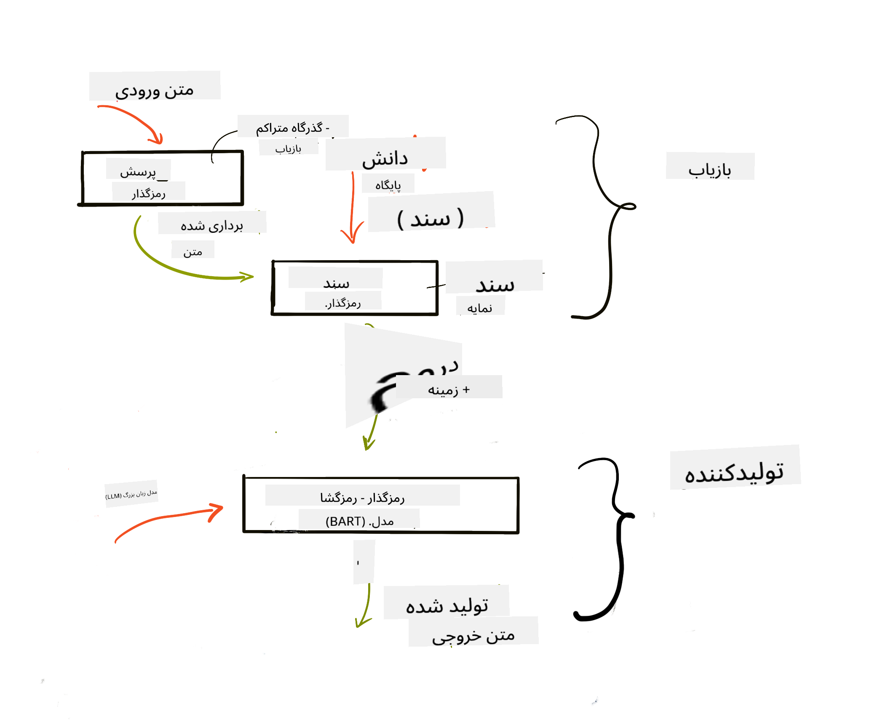
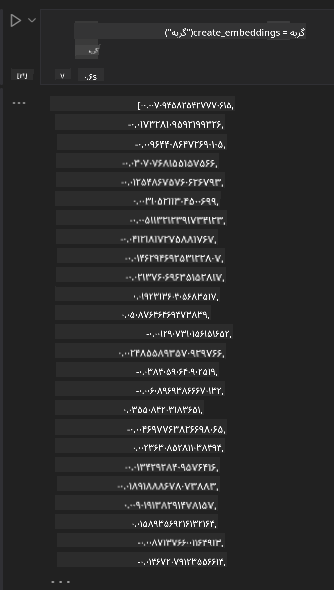

<!--
CO_OP_TRANSLATOR_METADATA:
{
  "original_hash": "b4b0266fbadbba7ded891b6485adc66d",
  "translation_date": "2025-10-17T23:10:10+00:00",
  "source_file": "15-rag-and-vector-databases/README.md",
  "language_code": "fa"
}
-->
# تولید تقویت‌شده با بازیابی (RAG) و پایگاه‌های داده برداری

[](https://youtu.be/4l8zhHUBeyI?si=BmvDmL1fnHtgQYkL)

در درس برنامه‌های جستجو، به طور مختصر یاد گرفتیم که چگونه داده‌های خود را در مدل‌های زبانی بزرگ (LLMs) ادغام کنیم. در این درس، به بررسی عمیق‌تر مفاهیم مرتبط با پایه‌گذاری داده‌های خود در برنامه LLM، مکانیزم‌های این فرآیند و روش‌های ذخیره‌سازی داده‌ها، از جمله تعبیه‌ها و متن، خواهیم پرداخت.

> **ویدیو به زودی منتشر می‌شود**

## مقدمه

در این درس به موضوعات زیر خواهیم پرداخت:

- معرفی RAG، اینکه چیست و چرا در هوش مصنوعی (AI) استفاده می‌شود.

- درک مفهوم پایگاه‌های داده برداری و ایجاد یکی برای برنامه خود.

- یک مثال عملی درباره چگونگی ادغام RAG در یک برنامه.

## اهداف یادگیری

پس از تکمیل این درس، شما قادر خواهید بود:

- اهمیت RAG در بازیابی و پردازش داده‌ها را توضیح دهید.

- برنامه RAG را راه‌اندازی کنید و داده‌های خود را به یک LLM پایه‌گذاری کنید.

- ادغام مؤثر RAG و پایگاه‌های داده برداری در برنامه‌های LLM.

## سناریوی ما: تقویت LLM‌ها با داده‌های خودمان

برای این درس، می‌خواهیم یادداشت‌های خود را به استارتاپ آموزشی اضافه کنیم، که به چت‌بات اجازه می‌دهد اطلاعات بیشتری درباره موضوعات مختلف ارائه دهد. با استفاده از یادداشت‌هایی که داریم، یادگیرندگان می‌توانند بهتر مطالعه کنند و موضوعات مختلف را درک کنند، و این کار را برای مرور امتحاناتشان آسان‌تر می‌کند. برای ایجاد این سناریو، از موارد زیر استفاده خواهیم کرد:

- `Azure OpenAI:` LLM که برای ایجاد چت‌بات استفاده خواهیم کرد.

- `درس هوش مصنوعی برای مبتدیان درباره شبکه‌های عصبی:` این داده‌هایی است که LLM خود را بر اساس آن پایه‌گذاری خواهیم کرد.

- `Azure AI Search` و `Azure Cosmos DB:` پایگاه داده برداری برای ذخیره داده‌های ما و ایجاد یک شاخص جستجو.

کاربران قادر خواهند بود از یادداشت‌های خود آزمون‌های تمرینی ایجاد کنند، کارت‌های فلش مرور بسازند و آن‌ها را به خلاصه‌های مختصر تبدیل کنند. برای شروع، بیایید ببینیم RAG چیست و چگونه کار می‌کند:

## تولید تقویت‌شده با بازیابی (RAG)

یک چت‌بات مبتنی بر LLM درخواست‌های کاربران را پردازش می‌کند تا پاسخ‌هایی تولید کند. این چت‌بات طراحی شده است تا تعاملی باشد و با کاربران در موضوعات مختلف ارتباط برقرار کند. با این حال، پاسخ‌های آن محدود به زمینه ارائه شده و داده‌های آموزشی پایه‌ای آن است. به عنوان مثال، اطلاعات GPT-4 تا سپتامبر 2021 به‌روز است، به این معنی که از رویدادهایی که پس از این دوره رخ داده‌اند، بی‌اطلاع است. علاوه بر این، داده‌هایی که برای آموزش LLM‌ها استفاده می‌شود، اطلاعات محرمانه مانند یادداشت‌های شخصی یا دفترچه راهنمای محصولات شرکت را شامل نمی‌شود.

### نحوه کار RAG‌ها (تولید تقویت‌شده با بازیابی)


فرض کنید می‌خواهید یک چت‌بات راه‌اندازی کنید که از یادداشت‌های شما آزمون ایجاد کند، در این صورت نیاز به اتصال به پایگاه دانش دارید. اینجاست که RAG به کمک می‌آید. RAG‌ها به این صورت عمل می‌کنند:

- **پایگاه دانش:** قبل از بازیابی، این اسناد باید وارد و پیش‌پردازش شوند، معمولاً با تقسیم اسناد بزرگ به بخش‌های کوچک‌تر، تبدیل آن‌ها به تعبیه‌های متنی و ذخیره آن‌ها در یک پایگاه داده.

- **پرسش کاربر:** کاربر یک سؤال می‌پرسد.

- **بازیابی:** هنگامی که کاربر یک سؤال می‌پرسد، مدل تعبیه اطلاعات مرتبط را از پایگاه دانش ما بازیابی می‌کند تا زمینه بیشتری فراهم کند که در درخواست گنجانده شود.

- **تولید تقویت‌شده:** LLM پاسخ خود را بر اساس داده‌های بازیابی‌شده تقویت می‌کند. این امکان را فراهم می‌کند که پاسخ تولید شده نه تنها بر اساس داده‌های پیش‌آموزش داده شده، بلکه بر اساس اطلاعات مرتبط از زمینه اضافه شده باشد. داده‌های بازیابی‌شده برای تقویت پاسخ‌های LLM استفاده می‌شود. سپس LLM پاسخی به سؤال کاربر ارائه می‌دهد.



معماری RAG‌ها با استفاده از ترانسفورمر‌ها پیاده‌سازی می‌شود که شامل دو بخش است: یک انکودر و یک دیکودر. به عنوان مثال، هنگامی که کاربر یک سؤال می‌پرسد، متن ورودی به بردارهایی تبدیل می‌شود که معنای کلمات را در بر می‌گیرند و سپس این بردارها به شاخص سند ما دیکود شده و متن جدیدی بر اساس پرسش کاربر تولید می‌شود. LLM از مدل انکودر-دیکودر برای تولید خروجی استفاده می‌کند.

دو رویکرد هنگام پیاده‌سازی RAG بر اساس مقاله پیشنهادی: [تولید تقویت‌شده با بازیابی برای وظایف NLP (پردازش زبان طبیعی) دانش‌محور](https://arxiv.org/pdf/2005.11401.pdf?WT.mc_id=academic-105485-koreyst) عبارتند از:

- **_RAG-Sequence_** استفاده از اسناد بازیابی‌شده برای پیش‌بینی بهترین پاسخ ممکن به پرسش کاربر.

- **RAG-Token** استفاده از اسناد برای تولید توکن بعدی، سپس بازیابی آن‌ها برای پاسخ به پرسش کاربر.

### چرا باید از RAG‌ها استفاده کنید؟ 

- **غنای اطلاعات:** اطمینان از اینکه پاسخ‌های متنی به‌روز و جاری هستند. بنابراین، عملکرد در وظایف خاص حوزه را با دسترسی به پایگاه دانش داخلی بهبود می‌بخشد.

- کاهش جعل با استفاده از **داده‌های قابل تأیید** در پایگاه دانش برای ارائه زمینه به پرسش‌های کاربران.

- **مقرون به صرفه بودن** زیرا نسبت به تنظیم دقیق یک LLM اقتصادی‌تر هستند.

## ایجاد یک پایگاه دانش

برنامه ما بر اساس داده‌های شخصی ما یعنی درس شبکه‌های عصبی در برنامه درسی هوش مصنوعی برای مبتدیان است.

### پایگاه‌های داده برداری

یک پایگاه داده برداری، برخلاف پایگاه‌های داده سنتی، یک پایگاه داده تخصصی است که برای ذخیره، مدیریت و جستجوی بردارهای تعبیه‌شده طراحی شده است. این پایگاه داده نمایش‌های عددی اسناد را ذخیره می‌کند. تبدیل داده‌ها به تعبیه‌های عددی باعث می‌شود سیستم هوش مصنوعی ما داده‌ها را بهتر درک و پردازش کند.

ما تعبیه‌های خود را در پایگاه‌های داده برداری ذخیره می‌کنیم زیرا LLM‌ها محدودیت تعداد توکن‌هایی که به عنوان ورودی قبول می‌کنند دارند. از آنجا که نمی‌توان تمام تعبیه‌ها را به یک LLM ارسال کرد، باید آن‌ها را به بخش‌هایی تقسیم کنیم و هنگامی که کاربر یک سؤال می‌پرسد، تعبیه‌هایی که بیشترین شباهت را به سؤال دارند همراه با درخواست بازگردانده می‌شوند. تقسیم‌بندی همچنین هزینه‌های مربوط به تعداد توکن‌های ارسال‌شده از طریق یک LLM را کاهش می‌دهد.

برخی از پایگاه‌های داده برداری محبوب شامل Azure Cosmos DB، Clarifyai، Pinecone، Chromadb، ScaNN، Qdrant و DeepLake هستند. شما می‌توانید یک مدل Azure Cosmos DB را با استفاده از Azure CLI با دستور زیر ایجاد کنید:

```bash
az login
az group create -n <resource-group-name> -l <location>
az cosmosdb create -n <cosmos-db-name> -r <resource-group-name>
az cosmosdb list-keys -n <cosmos-db-name> -g <resource-group-name>
```

### از متن به تعبیه‌ها

قبل از ذخیره داده‌های خود، باید آن‌ها را به تعبیه‌های برداری تبدیل کنیم تا در پایگاه داده ذخیره شوند. اگر با اسناد بزرگ یا متن‌های طولانی کار می‌کنید، می‌توانید آن‌ها را بر اساس پرسش‌هایی که انتظار دارید تقسیم کنید. تقسیم‌بندی می‌تواند در سطح جمله یا پاراگراف انجام شود. از آنجا که تقسیم‌بندی معانی را از کلمات اطراف استخراج می‌کند، می‌توانید برخی زمینه‌های دیگر را به یک بخش اضافه کنید، به عنوان مثال، با افزودن عنوان سند یا شامل کردن مقداری متن قبل یا بعد از بخش. می‌توانید داده‌ها را به صورت زیر تقسیم کنید:

```python
def split_text(text, max_length, min_length):
    words = text.split()
    chunks = []
    current_chunk = []

    for word in words:
        current_chunk.append(word)
        if len(' '.join(current_chunk)) < max_length and len(' '.join(current_chunk)) > min_length:
            chunks.append(' '.join(current_chunk))
            current_chunk = []

    # If the last chunk didn't reach the minimum length, add it anyway
    if current_chunk:
        chunks.append(' '.join(current_chunk))

    return chunks
```

پس از تقسیم‌بندی، می‌توانیم متن خود را با استفاده از مدل‌های مختلف تعبیه کنیم. برخی از مدل‌هایی که می‌توانید استفاده کنید شامل: word2vec، ada-002 توسط OpenAI، Azure Computer Vision و بسیاری دیگر. انتخاب مدل برای استفاده بستگی به زبان‌هایی که استفاده می‌کنید، نوع محتوای کدگذاری‌شده (متن/تصاویر/صوت)، اندازه ورودی که می‌تواند کدگذاری کند و طول خروجی تعبیه دارد.

یک مثال از متن تعبیه‌شده با استفاده از مدل `text-embedding-ada-002` OpenAI:


## بازیابی و جستجوی برداری

هنگامی که کاربر یک سؤال می‌پرسد، بازیاب آن را با استفاده از انکودر پرسش به یک بردار تبدیل می‌کند، سپس در شاخص جستجوی سند ما به دنبال بردارهای مرتبط در سند که به ورودی مربوط هستند، جستجو می‌کند. پس از انجام این کار، هم بردار ورودی و هم بردارهای سند را به متن تبدیل کرده و آن را از طریق LLM ارسال می‌کند.

### بازیابی

بازیابی زمانی اتفاق می‌افتد که سیستم سعی می‌کند به سرعت اسناد را از شاخص پیدا کند که معیارهای جستجو را برآورده می‌کنند. هدف بازیاب این است که اسنادی را پیدا کند که برای ارائه زمینه و پایه‌گذاری LLM بر اساس داده‌های شما استفاده شوند.

چندین روش برای انجام جستجو در پایگاه داده ما وجود دارد، مانند:

- **جستجوی کلمات کلیدی** - برای جستجوهای متنی استفاده می‌شود.

- **جستجوی معنایی** - از معنای کلمات استفاده می‌کند.

- **جستجوی برداری** - اسناد را از متن به نمایش‌های برداری با استفاده از مدل‌های تعبیه تبدیل می‌کند. بازیابی با جستجوی اسنادی انجام می‌شود که نمایش‌های برداری آن‌ها به پرسش کاربر نزدیک‌تر است.

- **ترکیبی** - ترکیبی از جستجوی کلمات کلیدی و جستجوی برداری.

یک چالش در بازیابی زمانی رخ می‌دهد که هیچ پاسخی مشابه با پرسش در پایگاه داده وجود نداشته باشد، سیستم در این صورت بهترین اطلاعاتی که می‌تواند پیدا کند را بازمی‌گرداند، با این حال، می‌توانید از تاکتیک‌هایی مانند تنظیم حداکثر فاصله برای مرتبط بودن یا استفاده از جستجوی ترکیبی که ترکیبی از جستجوی کلمات کلیدی و برداری است، استفاده کنید. در این درس از جستجوی ترکیبی استفاده خواهیم کرد، ترکیبی از جستجوی برداری و کلمات کلیدی. داده‌های خود را در یک دیتافریم با ستون‌هایی که شامل بخش‌ها و تعبیه‌ها هستند ذخیره خواهیم کرد.

### شباهت برداری

بازیاب پایگاه داده دانش را برای تعبیه‌هایی که به هم نزدیک هستند جستجو می‌کند، نزدیک‌ترین همسایه، زیرا آن‌ها متن‌هایی هستند که مشابه هستند. در سناریویی که کاربر یک پرسش می‌پرسد، ابتدا تعبیه می‌شود و سپس با تعبیه‌های مشابه مطابقت داده می‌شود. اندازه‌گیری رایج که برای یافتن شباهت بین بردارهای مختلف استفاده می‌شود، شباهت کسینوسی است که بر اساس زاویه بین دو بردار است.

ما می‌توانیم شباهت را با استفاده از گزینه‌های دیگر مانند فاصله اقلیدسی که خط مستقیم بین نقاط انتهایی بردار است و ضرب نقطه‌ای که مجموع حاصل‌ضرب عناصر متناظر دو بردار را اندازه‌گیری می‌کند، اندازه‌گیری کنیم.

### شاخص جستجو

هنگام انجام بازیابی، باید یک شاخص جستجو برای پایگاه دانش خود ایجاد کنیم قبل از اینکه جستجو را انجام دهیم. یک شاخص تعبیه‌های ما را ذخیره می‌کند و می‌تواند به سرعت بخش‌های مشابه را حتی در یک پایگاه داده بزرگ بازیابی کند. می‌توانیم شاخص خود را به صورت محلی با استفاده از:

```python
from sklearn.neighbors import NearestNeighbors

embeddings = flattened_df['embeddings'].to_list()

# Create the search index
nbrs = NearestNeighbors(n_neighbors=5, algorithm='ball_tree').fit(embeddings)

# To query the index, you can use the kneighbors method
distances, indices = nbrs.kneighbors(embeddings)
```

### رتبه‌بندی مجدد

پس از جستجو در پایگاه داده، ممکن است نیاز باشد نتایج را از مرتبط‌ترین به ترتیب مرتب کنید. یک LLM رتبه‌بندی مجدد از یادگیری ماشین برای بهبود مرتبط بودن نتایج جستجو با مرتب‌سازی آن‌ها از مرتبط‌ترین استفاده می‌کند. با استفاده از Azure AI Search، رتبه‌بندی مجدد به صورت خودکار برای شما انجام می‌شود با استفاده از یک رتبه‌بندی معنایی. یک مثال از نحوه کار رتبه‌بندی مجدد با استفاده از نزدیک‌ترین همسایه‌ها:

```python
# Find the most similar documents
distances, indices = nbrs.kneighbors([query_vector])

index = []
# Print the most similar documents
for i in range(3):
    index = indices[0][i]
    for index in indices[0]:
        print(flattened_df['chunks'].iloc[index])
        print(flattened_df['path'].iloc[index])
        print(flattened_df['distances'].iloc[index])
    else:
        print(f"Index {index} not found in DataFrame")
```

## جمع‌بندی همه چیز

آخرین مرحله اضافه کردن LLM ما به ترکیب است تا بتوانیم پاسخ‌هایی دریافت کنیم که بر اساس داده‌های ما پایه‌گذاری شده‌اند. می‌توانیم آن را به صورت زیر پیاده‌سازی کنیم:

```python
user_input = "what is a perceptron?"

def chatbot(user_input):
    # Convert the question to a query vector
    query_vector = create_embeddings(user_input)

    # Find the most similar documents
    distances, indices = nbrs.kneighbors([query_vector])

    # add documents to query  to provide context
    history = []
    for index in indices[0]:
        history.append(flattened_df['chunks'].iloc[index])

    # combine the history and the user input
    history.append(user_input)

    # create a message object
    messages=[
        {"role": "system", "content": "You are an AI assistant that helps with AI questions."},
        {"role": "user", "content": history[-1]}
    ]

    # use chat completion to generate a response
    response = openai.chat.completions.create(
        model="gpt-4",
        temperature=0.7,
        max_tokens=800,
        messages=messages
    )

    return response.choices[0].message

chatbot(user_input)
```

## ارزیابی برنامه ما

### معیارهای ارزیابی

- کیفیت پاسخ‌های ارائه‌شده، اطمینان از اینکه طبیعی، روان و شبیه انسان به نظر می‌رسند.

- پایه‌گذاری داده‌ها: ارزیابی اینکه آیا پاسخ از اسناد ارائه‌شده آمده است.

- مرتبط بودن: ارزیابی اینکه پاسخ با پرسش مطرح‌شده مطابقت دارد و مرتبط است.

- روانی - اینکه آیا پاسخ از نظر گرامری منطقی است.

## موارد استفاده از RAG (تولید تقویت‌شده با بازیابی) و پایگاه‌های داده برداری

موارد استفاده مختلفی وجود دارد که فراخوانی توابع می‌تواند برنامه شما را بهبود بخشد، مانند:

- پرسش و پاسخ: پایه‌گذاری داده‌های شرکت شما به یک چت که می‌تواند توسط کارکنان برای پرسش‌ها استفاده شود.

- سیستم‌های توصیه‌گر: جایی که می‌توانید سیستمی ایجاد کنید که مقادیر مشابه را مطابقت دهد، مانند فیلم‌ها، رستوران‌ها و بسیاری موارد دیگر.

- خدمات چت‌بات: می‌توانید تاریخچه چت را ذخیره کنید و مکالمه را بر اساس داده‌های کاربر شخصی‌سازی کنید.

- جستجوی تصویر بر اساس تعبیه‌های برداری، مفید هنگام انجام شناسایی تصویر و تشخیص ناهنجاری.

## خلاصه

ما زمینه‌های اساسی RAG را از اضافه کردن داده‌های خود به برنامه، پرسش کاربر و خروجی پوشش دادیم. برای ساده‌سازی ایجاد RAG، می‌توانید از چارچوب‌هایی مانند Semantic Kernel، Langchain یا Autogen استفاده کنید.

## تکلیف

برای ادامه یادگیری تولید تقویت‌شده با بازیابی (RAG) می‌توانید:

- یک رابط کاربری برای برنامه با استفاده از چارچوب دلخواه خود بسازید.

- از یک چارچوب، مانند LangChain یا Semantic Kernel، استفاده کنید و برنامه خود را بازسازی کنید.

تبریک می‌گوییم که این درس را به پایان رساندید 👏.

## یادگیری در اینجا متوقف نمی‌شود، سفر را ادامه دهید

پس از تکمیل این درس، مجموعه یادگیری [Generative AI Learning](https://aka.ms/genai-collection?WT.mc_id=academic-105485-koreyst) را بررسی کنید تا دانش خود در زمینه هوش مصنوعی تولیدی را ارتقا دهید!

---

**سلب مسئولیت**:  
این سند با استفاده از سرویس ترجمه هوش مصنوعی [Co-op Translator](https://github.com/Azure/co-op-translator) ترجمه شده است. در حالی که ما تلاش می‌کنیم دقت را حفظ کنیم، لطفاً توجه داشته باشید که ترجمه‌های خودکار ممکن است شامل خطاها یا نادرستی‌هایی باشند. سند اصلی به زبان اصلی آن باید به عنوان منبع معتبر در نظر گرفته شود. برای اطلاعات حیاتی، ترجمه حرفه‌ای انسانی توصیه می‌شود. ما مسئولیتی در قبال سوء تفاهم‌ها یا تفسیرهای نادرست ناشی از استفاده از این ترجمه نداریم.