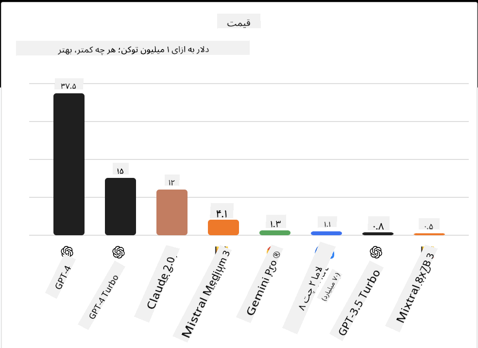
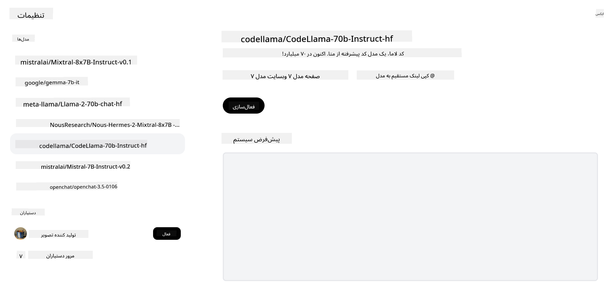
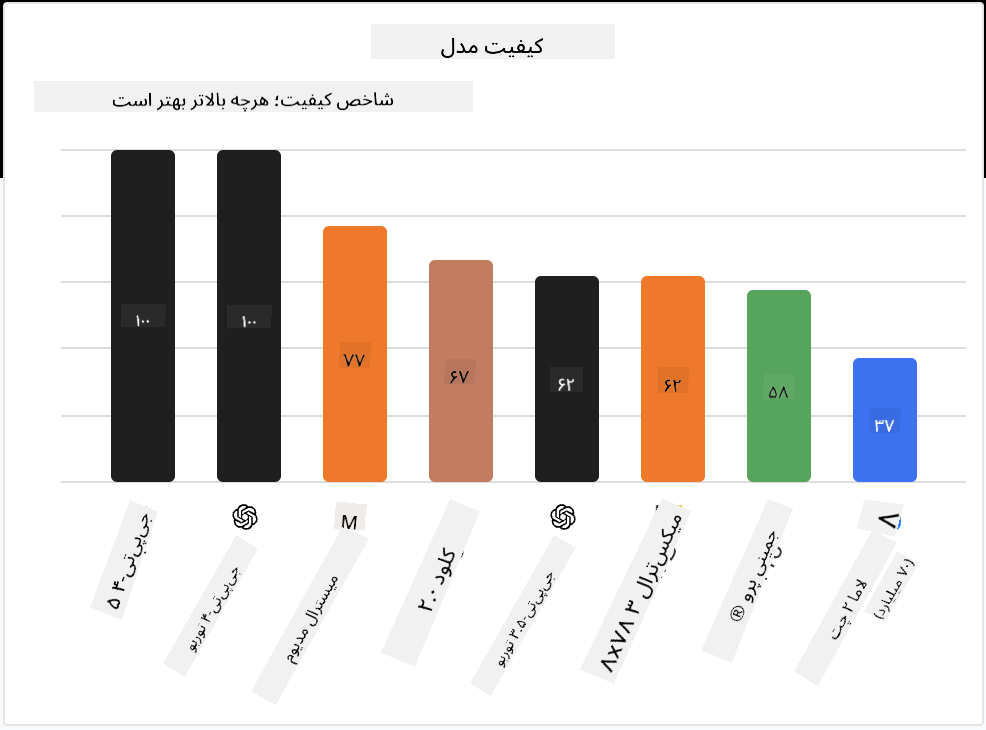

<!--
CO_OP_TRANSLATOR_METADATA:
{
  "original_hash": "0bba96e53ab841d99db731892a51fab8",
  "translation_date": "2025-05-20T06:47:22+00:00",
  "source_file": "16-open-source-models/README.md",
  "language_code": "fa"
}
-->

## مقدمه

دنیای مدل‌های متن‌باز LLM هیجان‌انگیز و به طور مداوم در حال تحول است. این درس هدف دارد که نگاهی عمیق به مدل‌های متن‌باز بیاندازد. اگر به دنبال اطلاعاتی درباره مقایسه مدل‌های اختصاصی با مدل‌های متن‌باز هستید، به درس ["کاوش و مقایسه LLMهای مختلف"](../02-exploring-and-comparing-different-llms/README.md?WT.mc_id=academic-105485-koreyst) بروید. این درس همچنین به موضوع تنظیم دقیق می‌پردازد اما توضیحی جامع‌تر در درس ["تنظیم دقیق LLMها"](../18-fine-tuning/README.md?WT.mc_id=academic-105485-koreyst) موجود است.

## اهداف یادگیری

- درک مدل‌های متن‌باز
- فهمیدن مزایای کار با مدل‌های متن‌باز
- کاوش مدل‌های موجود در Hugging Face و Azure AI Studio

## مدل‌های متن‌باز چیست؟

نرم‌افزار متن‌باز نقش مهمی در رشد فناوری در زمینه‌های مختلف ایفا کرده است. ابتکار متن‌باز (OSI) [10 معیار برای نرم‌افزار](https://web.archive.org/web/20241126001143/https://opensource.org/osd?WT.mc_id=academic-105485-koreyst) تعریف کرده است تا به عنوان متن‌باز طبقه‌بندی شود. کد منبع باید تحت مجوزی که توسط OSI تایید شده به صورت عمومی به اشتراک گذاشته شود.

در حالی که توسعه LLMها عناصر مشابهی با توسعه نرم‌افزار دارد، فرآیند دقیقاً یکسان نیست. این موضوع باعث بحث‌های زیادی در جامعه درباره تعریف متن‌باز در زمینه LLMها شده است. برای اینکه یک مدل با تعریف سنتی متن‌باز همخوانی داشته باشد، اطلاعات زیر باید به صورت عمومی در دسترس باشد:

- مجموعه داده‌هایی که برای آموزش مدل استفاده شده‌اند.
- وزن‌های کامل مدل به عنوان بخشی از آموزش.
- کد ارزیابی.
- کد تنظیم دقیق.
- وزن‌های کامل مدل و معیارهای آموزش.

در حال حاضر فقط تعداد کمی از مدل‌ها با این معیارها همخوانی دارند. مدل [OLMo ایجاد شده توسط موسسه Allen برای هوش مصنوعی (AllenAI)](https://huggingface.co/allenai/OLMo-7B?WT.mc_id=academic-105485-koreyst) یکی از این مدل‌ها است.

برای این درس، ما مدل‌ها را به عنوان "مدل‌های متن‌باز" معرفی خواهیم کرد، زیرا ممکن است در زمان نوشتن با معیارهای بالا همخوانی نداشته باشند.

## مزایای مدل‌های متن‌باز

**بسیار قابل تنظیم** - از آنجا که مدل‌های متن‌باز با اطلاعات آموزشی دقیق منتشر می‌شوند، محققان و توسعه‌دهندگان می‌توانند داخلی‌های مدل را تغییر دهند. این امکان را می‌دهد که مدل‌های بسیار تخصصی ایجاد شوند که برای یک وظیفه یا حوزه خاص تنظیم دقیق شده‌اند. برخی از مثال‌های این موضوع شامل تولید کد، عملیات ریاضی و زیست‌شناسی هستند.

**هزینه** - هزینه هر توکن برای استفاده و استقرار این مدل‌ها کمتر از مدل‌های اختصاصی است. هنگام ساخت برنامه‌های هوش مصنوعی مولد، باید عملکرد را در مقابل قیمت بررسی کنید تا ببینید چگونه این مدل‌ها بر روی مورد استفاده شما کار می‌کنند.

منبع: تحلیل مصنوعی

**انعطاف‌پذیری** - کار با مدل‌های متن‌باز به شما امکان می‌دهد در استفاده از مدل‌های مختلف یا ترکیب آنها انعطاف‌پذیر باشید. یک مثال از این موضوع دستیارهای [HuggingChat](https://huggingface.co/chat?WT.mc_id=academic-105485-koreyst) است که در آن کاربر می‌تواند مدل مورد استفاده را مستقیماً در رابط کاربری انتخاب کند:

## کاوش مدل‌های متن‌باز مختلف

### Llama 2

[LLama2](https://huggingface.co/meta-llama?WT.mc_id=academic-105485-koreyst) توسط Meta توسعه داده شده است و یک مدل متن‌باز است که برای برنامه‌های مبتنی بر چت بهینه شده است. این به دلیل روش تنظیم دقیق آن است که شامل مقدار زیادی دیالوگ و بازخورد انسانی بوده است. با این روش، مدل نتایج بیشتری تولید می‌کند که با انتظارات انسانی همخوانی دارد و تجربه کاربری بهتری ارائه می‌دهد.

برخی از مثال‌های نسخه‌های تنظیم دقیق شده Llama شامل [ژاپنی Llama](https://huggingface.co/elyza/ELYZA-japanese-Llama-2-7b?WT.mc_id=academic-105485-koreyst) که در ژاپنی تخصص دارد و [Llama Pro](https://huggingface.co/TencentARC/LLaMA-Pro-8B?WT.mc_id=academic-105485-koreyst) که نسخه‌ای بهبود یافته از مدل پایه است.

### Mistral

[Mistral](https://huggingface.co/mistralai?WT.mc_id=academic-105485-koreyst) یک مدل متن‌باز است که بر عملکرد بالا و کارایی تمرکز دارد. از رویکرد Mixture-of-Experts استفاده می‌کند که گروهی از مدل‌های تخصصی را به یک سیستم ترکیب می‌کند که بسته به ورودی، مدل‌های خاصی برای استفاده انتخاب می‌شوند. این باعث می‌شود محاسبات مؤثرتر باشند زیرا مدل‌ها فقط به ورودی‌هایی که در آنها تخصص دارند می‌پردازند.

برخی از مثال‌های نسخه‌های تنظیم دقیق شده Mistral شامل [BioMistral](https://huggingface.co/BioMistral/BioMistral-7B?text=Mon+nom+est+Thomas+et+mon+principal?WT.mc_id=academic-105485-koreyst) که بر حوزه پزشکی تمرکز دارد و [OpenMath Mistral](https://huggingface.co/nvidia/OpenMath-Mistral-7B-v0.1-hf?WT.mc_id=academic-105485-koreyst) که محاسبات ریاضی انجام می‌دهد.

### Falcon

[Falcon](https://huggingface.co/tiiuae?WT.mc_id=academic-105485-koreyst) یک LLM است که توسط مؤسسه نوآوری فناوری (**TII**) ایجاد شده است. Falcon-40B بر روی 40 میلیارد پارامتر آموزش داده شده است که نشان داده شده است بهتر از GPT-3 با بودجه محاسباتی کمتر عمل می‌کند. این به دلیل استفاده از الگوریتم FlashAttention و توجه چند پرسشی است که به آن امکان کاهش نیازهای حافظه در زمان استنتاج را می‌دهد. با این زمان استنتاج کاهش یافته، Falcon-40B برای برنامه‌های چت مناسب است.

برخی از مثال‌های نسخه‌های تنظیم دقیق شده Falcon شامل [OpenAssistant](https://huggingface.co/OpenAssistant/falcon-40b-sft-top1-560?WT.mc_id=academic-105485-koreyst) که یک دستیار ساخته شده بر روی مدل‌های متن‌باز است و [GPT4ALL](https://huggingface.co/nomic-ai/gpt4all-falcon?WT.mc_id=academic-105485-koreyst) که عملکرد بالاتری نسبت به مدل پایه ارائه می‌دهد.

## چگونه انتخاب کنیم

هیچ پاسخ واحدی برای انتخاب یک مدل متن‌باز وجود ندارد. یک مکان خوب برای شروع استفاده از ویژگی فیلتر بر اساس وظیفه Azure AI Studio است. این به شما کمک می‌کند تا بفهمید چه نوع وظایفی مدل برای آنها آموزش دیده است. Hugging Face همچنین یک رتبه‌بندی LLM را نگه می‌دارد که بهترین مدل‌های عملکردی را بر اساس معیارهای خاص نشان می‌دهد.

هنگام مقایسه LLMها در انواع مختلف، [تحلیل مصنوعی](https://artificialanalysis.ai/?WT.mc_id=academic-105485-koreyst) منبع عالی دیگری است:

منبع: تحلیل مصنوعی

اگر بر روی یک مورد استفاده خاص کار می‌کنید، جستجو برای نسخه‌های تنظیم دقیق شده که بر همان حوزه تمرکز دارند می‌تواند مؤثر باشد. آزمایش با مدل‌های متن‌باز متعدد برای دیدن اینکه چگونه بر اساس انتظارات شما و کاربران شما عمل می‌کنند، تمرین خوبی است.

## مراحل بعدی

بهترین قسمت درباره مدل‌های متن‌باز این است که می‌توانید به سرعت کار با آنها را شروع کنید. کاتالوگ مدل [Azure AI Studio](https://ai.azure.com?WT.mc_id=academic-105485-koreyst) را بررسی کنید که مجموعه‌ای خاص از Hugging Face با مدل‌هایی که در اینجا مورد بحث قرار گرفتند، دارد.

## یادگیری در اینجا متوقف نمی‌شود، به سفر ادامه دهید

پس از تکمیل این درس، مجموعه [یادگیری هوش مصنوعی مولد](https://aka.ms/genai-collection?WT.mc_id=academic-105485-koreyst) ما را بررسی کنید تا دانش خود را در زمینه هوش مصنوعی مولد ارتقا دهید!

**سلب مسئولیت**:  
این سند با استفاده از سرویس ترجمه هوش مصنوعی [Co-op Translator](https://github.com/Azure/co-op-translator) ترجمه شده است. در حالی که ما برای دقت تلاش می‌کنیم، لطفاً توجه داشته باشید که ترجمه‌های خودکار ممکن است شامل خطاها یا نادرستی‌ها باشند. سند اصلی به زبان اصلی آن باید به عنوان منبع معتبر در نظر گرفته شود. برای اطلاعات حیاتی، ترجمه انسانی حرفه‌ای توصیه می‌شود. ما مسئولیتی در قبال هرگونه سوء تفاهم یا تفسیر نادرست ناشی از استفاده از این ترجمه نداریم.