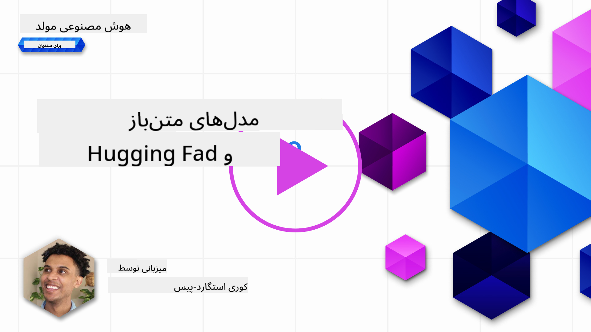
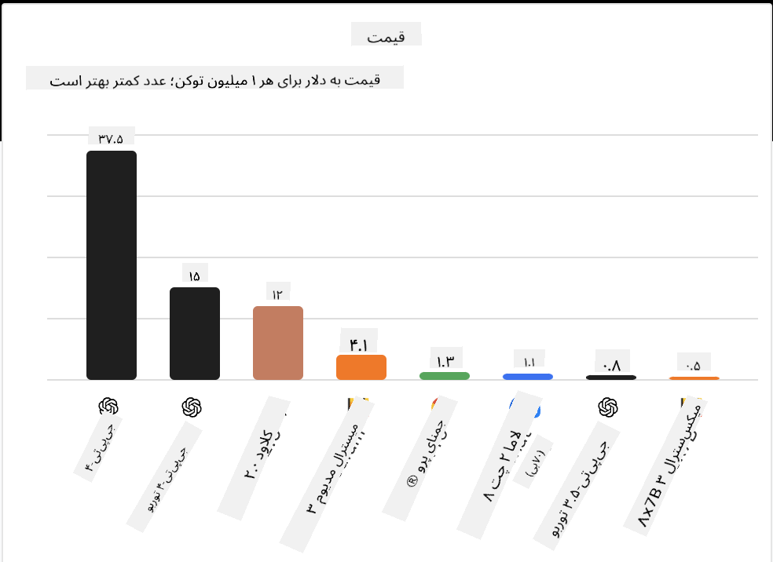

<!--
CO_OP_TRANSLATOR_METADATA:
{
  "original_hash": "0bba96e53ab841d99db731892a51fab8",
  "translation_date": "2025-07-09T17:04:17+00:00",
  "source_file": "16-open-source-models/README.md",
  "language_code": "fa"
}
-->

## مقدمه

دنیای مدل‌های زبان بزرگ متن‌باز هیجان‌انگیز و در حال تحول مداوم است. هدف این درس ارائه نگاهی عمیق به مدل‌های متن‌باز است. اگر به دنبال اطلاعاتی درباره مقایسه مدل‌های اختصاصی با مدل‌های متن‌باز هستید، به درس ["بررسی و مقایسه مدل‌های مختلف LLM"](../02-exploring-and-comparing-different-llms/README.md?WT.mc_id=academic-105485-koreyst) مراجعه کنید. این درس همچنین موضوع تنظیم دقیق (fine-tuning) را پوشش می‌دهد، اما توضیح مفصل‌تر آن را می‌توانید در درس ["تنظیم دقیق مدل‌های LLM"](../18-fine-tuning/README.md?WT.mc_id=academic-105485-koreyst) بیابید.

## اهداف یادگیری

- درک مدل‌های متن‌باز
- شناخت مزایای کار با مدل‌های متن‌باز
- آشنایی با مدل‌های متن‌باز موجود در Hugging Face و Azure AI Studio

## مدل‌های متن‌باز چیستند؟

نرم‌افزار متن‌باز نقش مهمی در رشد فناوری در حوزه‌های مختلف ایفا کرده است. سازمان Open Source Initiative (OSI) [ده معیار برای نرم‌افزار](https://web.archive.org/web/20241126001143/https://opensource.org/osd?WT.mc_id=academic-105485-koreyst) تعریف کرده است تا به عنوان متن‌باز شناخته شود. کد منبع باید تحت مجوزی که توسط OSI تأیید شده است، به‌صورت آزاد منتشر شود.

اگرچه توسعه مدل‌های زبان بزرگ شباهت‌هایی با توسعه نرم‌افزار دارد، اما فرآیند کاملاً یکسان نیست. این موضوع بحث‌های زیادی در جامعه درباره تعریف متن‌باز در زمینه LLMها ایجاد کرده است. برای اینکه یک مدل با تعریف سنتی متن‌باز هم‌راستا باشد، اطلاعات زیر باید به‌صورت عمومی در دسترس باشد:

- داده‌های استفاده شده برای آموزش مدل
- وزن‌های کامل مدل به عنوان بخشی از آموزش
- کد ارزیابی
- کد تنظیم دقیق
- وزن‌های کامل مدل و معیارهای آموزش

در حال حاضر تنها چند مدل وجود دارند که این معیارها را برآورده می‌کنند. مدل [OLMo ساخته شده توسط مؤسسه Allen برای هوش مصنوعی (AllenAI)](https://huggingface.co/allenai/OLMo-7B?WT.mc_id=academic-105485-koreyst) یکی از این مدل‌هاست.

در این درس، به این مدل‌ها به عنوان "مدل‌های متن‌باز" اشاره خواهیم کرد، چرا که ممکن است در زمان نگارش دقیقاً با معیارهای بالا مطابقت نداشته باشند.

## مزایای مدل‌های متن‌باز

**قابلیت سفارشی‌سازی بالا** - از آنجا که مدل‌های متن‌باز با اطلاعات دقیق آموزش منتشر می‌شوند، پژوهشگران و توسعه‌دهندگان می‌توانند ساختار داخلی مدل را تغییر دهند. این امکان ایجاد مدل‌های بسیار تخصصی که برای یک وظیفه یا حوزه خاص تنظیم شده‌اند را فراهم می‌کند. برخی از نمونه‌ها شامل تولید کد، عملیات ریاضی و زیست‌شناسی هستند.

**هزینه** - هزینه هر توکن برای استفاده و استقرار این مدل‌ها کمتر از مدل‌های اختصاصی است. هنگام ساخت برنامه‌های هوش مصنوعی مولد، باید عملکرد در مقابل قیمت را برای استفاده مورد نظر خود بررسی کنید.

  
منبع: Artificial Analysis

**انعطاف‌پذیری** - کار با مدل‌های متن‌باز به شما امکان می‌دهد در استفاده از مدل‌های مختلف یا ترکیب آن‌ها انعطاف‌پذیر باشید. نمونه‌ای از این موضوع [دستیارهای HuggingChat](https://huggingface.co/chat?WT.mc_id=academic-105485-koreyst) است که کاربر می‌تواند مدل مورد استفاده را مستقیماً در رابط کاربری انتخاب کند:

## بررسی مدل‌های متن‌باز مختلف

### Llama 2

[LLama2](https://huggingface.co/meta-llama?WT.mc_id=academic-105485-koreyst) که توسط Meta توسعه یافته، یک مدل متن‌باز بهینه‌شده برای برنامه‌های مبتنی بر گفتگو است. این به دلیل روش تنظیم دقیق آن است که شامل حجم زیادی از دیالوگ و بازخورد انسانی بوده است. با این روش، مدل نتایجی تولید می‌کند که بیشتر با انتظار انسان هم‌راستا است و تجربه کاربری بهتری ارائه می‌دهد.

برخی نسخه‌های تنظیم دقیق شده Llama شامل [Japanese Llama](https://huggingface.co/elyza/ELYZA-japanese-Llama-2-7b?WT.mc_id=academic-105485-koreyst) است که در زبان ژاپنی تخصص دارد و [Llama Pro](https://huggingface.co/TencentARC/LLaMA-Pro-8B?WT.mc_id=academic-105485-koreyst) که نسخه بهبود یافته مدل پایه است.

### Mistral

[Mistral](https://huggingface.co/mistralai?WT.mc_id=academic-105485-koreyst) یک مدل متن‌باز با تمرکز قوی بر عملکرد بالا و کارایی است. این مدل از رویکرد Mixture-of-Experts استفاده می‌کند که گروهی از مدل‌های تخصصی را در یک سیستم ترکیب می‌کند، به طوری که بسته به ورودی، مدل‌های خاصی برای استفاده انتخاب می‌شوند. این باعث می‌شود محاسبات مؤثرتر باشد چون مدل‌ها فقط به ورودی‌هایی که در آن تخصص دارند پاسخ می‌دهند.

برخی نسخه‌های تنظیم دقیق شده Mistral شامل [BioMistral](https://huggingface.co/BioMistral/BioMistral-7B?text=Mon+nom+est+Thomas+et+mon+principal?WT.mc_id=academic-105485-koreyst) است که بر حوزه پزشکی تمرکز دارد و [OpenMath Mistral](https://huggingface.co/nvidia/OpenMath-Mistral-7B-v0.1-hf?WT.mc_id=academic-105485-koreyst) که محاسبات ریاضی انجام می‌دهد.

### Falcon

[Falcon](https://huggingface.co/tiiuae?WT.mc_id=academic-105485-koreyst) یک مدل LLM است که توسط مؤسسه نوآوری فناوری (**TII**) ساخته شده است. Falcon-40B با ۴۰ میلیارد پارامتر آموزش دیده است و نشان داده شده که عملکرد بهتری نسبت به GPT-3 با بودجه محاسباتی کمتر دارد. این به دلیل استفاده از الگوریتم FlashAttention و توجه چندپرسشی است که به کاهش نیازهای حافظه در زمان استنتاج کمک می‌کند. با کاهش زمان استنتاج، Falcon-40B برای برنامه‌های گفتگو مناسب است.

برخی نسخه‌های تنظیم دقیق شده Falcon شامل [OpenAssistant](https://huggingface.co/OpenAssistant/falcon-40b-sft-top1-560?WT.mc_id=academic-105485-koreyst) است که یک دستیار ساخته شده بر پایه مدل‌های متن‌باز است و [GPT4ALL](https://huggingface.co/nomic-ai/gpt4all-falcon?WT.mc_id=academic-105485-koreyst) که عملکرد بالاتری نسبت به مدل پایه ارائه می‌دهد.

## چگونه انتخاب کنیم

پاسخ واحدی برای انتخاب یک مدل متن‌باز وجود ندارد. نقطه شروع خوب استفاده از ویژگی فیلتر بر اساس وظیفه در Azure AI Studio است. این به شما کمک می‌کند بفهمید مدل برای چه نوع وظایفی آموزش دیده است. Hugging Face همچنین یک جدول رده‌بندی LLM دارد که بهترین مدل‌ها را بر اساس معیارهای خاص نشان می‌دهد.

برای مقایسه مدل‌های LLM در انواع مختلف، [Artificial Analysis](https://artificialanalysis.ai/?WT.mc_id=academic-105485-koreyst) منبع بسیار خوبی است:

  
منبع: Artificial Analysis

اگر روی یک مورد استفاده خاص کار می‌کنید، جستجوی نسخه‌های تنظیم دقیق شده که بر همان حوزه تمرکز دارند می‌تواند مؤثر باشد. آزمایش چند مدل متن‌باز برای دیدن عملکرد آن‌ها بر اساس انتظارات شما و کاربران‌تان نیز روش خوبی است.

## گام‌های بعدی

بهترین بخش مدل‌های متن‌باز این است که می‌توانید خیلی سریع شروع به کار با آن‌ها کنید. کاتالوگ مدل‌های [Azure AI Studio](https://ai.azure.com?WT.mc_id=academic-105485-koreyst) را بررسی کنید که شامل مجموعه‌ای خاص از مدل‌های Hugging Face است که در اینجا درباره آن‌ها صحبت کردیم.

## یادگیری اینجا متوقف نمی‌شود، سفر را ادامه دهید

پس از اتمام این درس، مجموعه یادگیری [هوش مصنوعی مولد](https://aka.ms/genai-collection?WT.mc_id=academic-105485-koreyst) ما را بررسی کنید تا دانش خود در زمینه هوش مصنوعی مولد را ارتقا دهید!

**سلب مسئولیت**:  
این سند با استفاده از سرویس ترجمه هوش مصنوعی [Co-op Translator](https://github.com/Azure/co-op-translator) ترجمه شده است. در حالی که ما در تلاش برای دقت هستیم، لطفاً توجه داشته باشید که ترجمه‌های خودکار ممکن است حاوی خطاها یا نواقصی باشند. سند اصلی به زبان بومی خود باید به عنوان منبع معتبر در نظر گرفته شود. برای اطلاعات حیاتی، ترجمه حرفه‌ای انسانی توصیه می‌شود. ما مسئول هیچ گونه سوءتفاهم یا تفسیر نادرستی که از استفاده از این ترجمه ناشی شود، نیستیم.