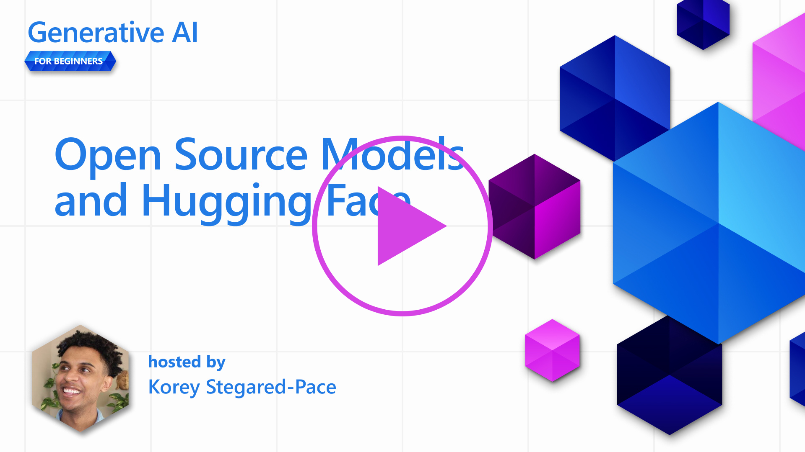
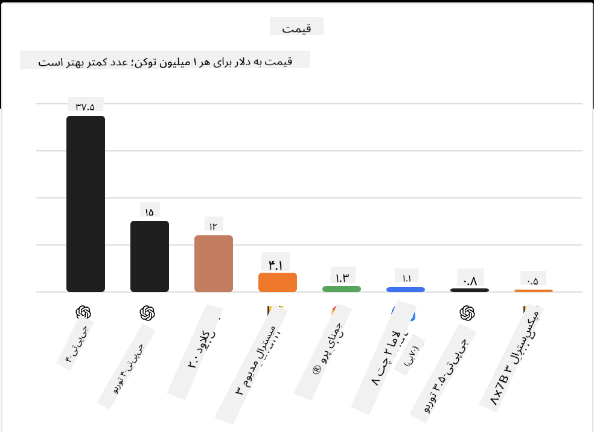
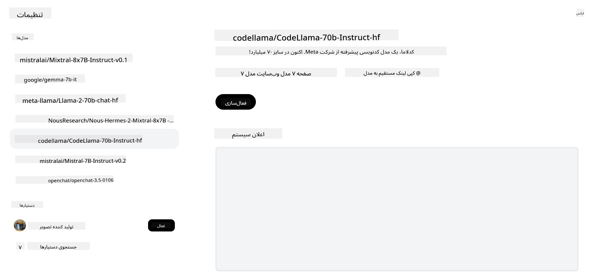

<!--
CO_OP_TRANSLATOR_METADATA:
{
  "original_hash": "0bba96e53ab841d99db731892a51fab8",
  "translation_date": "2025-06-25T23:48:57+00:00",
  "source_file": "16-open-source-models/README.md",
  "language_code": "fa"
}
-->

## مقدمه

دنیای مدل‌های متن‌باز LLM هیجان‌انگیز و همواره در حال تکامل است. این درس به بررسی دقیق مدل‌های متن‌باز می‌پردازد. اگر به دنبال اطلاعاتی درباره مقایسه مدل‌های اختصاصی با مدل‌های متن‌باز هستید، به درس ["بررسی و مقایسه LLMهای مختلف"](../02-exploring-and-comparing-different-llms/README.md?WT.mc_id=academic-105485-koreyst) مراجعه کنید. این درس همچنین به موضوع تنظیم دقیق می‌پردازد، اما توضیحات دقیق‌تر در درس ["تنظیم دقیق LLMها"](../18-fine-tuning/README.md?WT.mc_id=academic-105485-koreyst) قابل مشاهده است.

## اهداف یادگیری

- درک مدل‌های متن‌باز
- درک مزایای کار با مدل‌های متن‌باز
- بررسی مدل‌های متن‌باز موجود در Hugging Face و Azure AI Studio

## مدل‌های متن‌باز چیستند؟

نرم‌افزار متن‌باز نقش حیاتی در رشد فناوری در زمینه‌های مختلف ایفا کرده است. ابتکار متن‌باز (OSI) [۱۰ معیار برای نرم‌افزار](https://web.archive.org/web/20241126001143/https://opensource.org/osd?WT.mc_id=academic-105485-koreyst) تعریف کرده است تا به عنوان متن‌باز طبقه‌بندی شود. کد منبع باید تحت مجوزی که توسط OSI تأیید شده است، به‌طور آزادانه به اشتراک گذاشته شود.

در حالی که توسعه LLMها عناصر مشابهی با توسعه نرم‌افزار دارد، این فرآیند دقیقاً یکسان نیست. این موضوع در جامعه بحث‌های زیادی درباره تعریف متن‌باز در زمینه LLMها به وجود آورده است. برای اینکه یک مدل با تعریف سنتی متن‌باز همسو باشد، اطلاعات زیر باید به‌طور عمومی در دسترس باشد:

- مجموعه‌داده‌هایی که برای آموزش مدل استفاده شده‌اند.
- وزن‌های کامل مدل به عنوان بخشی از آموزش.
- کد ارزیابی.
- کد تنظیم دقیق.
- وزن‌های کامل مدل و معیارهای آموزش.

در حال حاضر تنها چند مدل وجود دارد که با این معیارها همخوانی دارند. [مدل OLMo که توسط مؤسسه آلن برای هوش مصنوعی (AllenAI) ایجاد شده است](https://huggingface.co/allenai/OLMo-7B?WT.mc_id=academic-105485-koreyst) یکی از این دسته‌بندی‌ها است.

برای این درس، از این به بعد به مدل‌ها به عنوان "مدل‌های باز" اشاره خواهیم کرد، زیرا ممکن است در زمان نوشتن با معیارهای فوق همخوانی نداشته باشند.

## مزایای مدل‌های باز

**بسیار قابل تنظیم** - از آنجایی که مدل‌های باز با اطلاعات آموزشی دقیق منتشر می‌شوند، محققان و توسعه‌دهندگان می‌توانند اجزای داخلی مدل را تغییر دهند. این امر امکان ایجاد مدل‌های بسیار تخصصی را فراهم می‌کند که برای یک وظیفه خاص یا حوزه مطالعه تنظیم شده‌اند. برخی از مثال‌های این کار شامل تولید کد، عملیات ریاضی و زیست‌شناسی است.

**هزینه** - هزینه هر توکن برای استفاده و استقرار این مدل‌ها کمتر از مدل‌های اختصاصی است. هنگام ساخت برنامه‌های هوش مصنوعی تولیدی، بررسی عملکرد در مقابل قیمت هنگام کار با این مدل‌ها برای کاربرد شما باید انجام شود.

  
منبع: تحلیل مصنوعی

**انعطاف‌پذیری** - کار با مدل‌های باز به شما امکان می‌دهد در استفاده از مدل‌های مختلف یا ترکیب آن‌ها انعطاف‌پذیر باشید. مثالی از این مورد [دستیارهای HuggingChat](https://huggingface.co/chat?WT.mc_id=academic-105485-koreyst) است که در آن کاربر می‌تواند مدل مورد استفاده را مستقیماً در رابط کاربری انتخاب کند:

## بررسی مدل‌های باز مختلف

### Llama 2

[LLama2](https://huggingface.co/meta-llama?WT.mc_id=academic-105485-koreyst) که توسط Meta توسعه یافته است، یک مدل باز است که برای برنامه‌های مبتنی بر گفتگو بهینه شده است. این به دلیل روش تنظیم دقیق آن است که شامل مقدار زیادی گفتگو و بازخورد انسانی بود. با این روش، مدل نتایجی تولید می‌کند که بیشتر با انتظارات انسانی همسو است و تجربه کاربری بهتری ارائه می‌دهد.

برخی از نسخه‌های تنظیم‌شده Llama شامل [Llama ژاپنی](https://huggingface.co/elyza/ELYZA-japanese-Llama-2-7b?WT.mc_id=academic-105485-koreyst) است که در زبان ژاپنی تخصص دارد و [Llama Pro](https://huggingface.co/TencentARC/LLaMA-Pro-8B?WT.mc_id=academic-105485-koreyst) که نسخه پیشرفته‌ای از مدل پایه است.

### Mistral

[Mistral](https://huggingface.co/mistralai?WT.mc_id=academic-105485-koreyst) یک مدل باز با تمرکز قوی بر عملکرد بالا و کارایی است. این مدل از روش Mixture-of-Experts استفاده می‌کند که گروهی از مدل‌های متخصص را در یک سیستم ترکیب می‌کند که بسته به ورودی، مدل‌های خاصی برای استفاده انتخاب می‌شوند. این کار محاسبات را موثرتر می‌کند زیرا مدل‌ها تنها به ورودی‌هایی که در آن‌ها تخصص دارند، می‌پردازند.

برخی از نسخه‌های تنظیم‌شده Mistral شامل [BioMistral](https://huggingface.co/BioMistral/BioMistral-7B?text=Mon+nom+est+Thomas+et+mon+principal?WT.mc_id=academic-105485-koreyst) است که بر حوزه پزشکی تمرکز دارد و [OpenMath Mistral](https://huggingface.co/nvidia/OpenMath-Mistral-7B-v0.1-hf?WT.mc_id=academic-105485-koreyst) که محاسبات ریاضی انجام می‌دهد.

### Falcon

[Falcon](https://huggingface.co/tiiuae?WT.mc_id=academic-105485-koreyst) یک LLM است که توسط مؤسسه نوآوری فناوری (**TII**) ایجاد شده است. Falcon-40B بر روی ۴۰ میلیارد پارامتر آموزش دیده است که نشان داده شده است با بودجه محاسباتی کمتری بهتر از GPT-3 عمل می‌کند. این به دلیل استفاده از الگوریتم FlashAttention و توجه چندگانه است که به آن امکان می‌دهد نیازهای حافظه را در زمان استنتاج کاهش دهد. با این زمان استنتاج کاهش‌یافته، Falcon-40B برای برنامه‌های چت مناسب است.

برخی از نسخه‌های تنظیم‌شده Falcon شامل [OpenAssistant](https://huggingface.co/OpenAssistant/falcon-40b-sft-top1-560?WT.mc_id=academic-105485-koreyst) است که یک دستیار ساخته‌شده بر روی مدل‌های باز است و [GPT4ALL](https://huggingface.co/nomic-ai/gpt4all-falcon?WT.mc_id=academic-105485-koreyst) که عملکرد بالاتری نسبت به مدل پایه دارد.

## چگونه انتخاب کنیم

هیچ پاسخ واحدی برای انتخاب یک مدل باز وجود ندارد. یک مکان خوب برای شروع، استفاده از ویژگی فیلتر بر اساس وظیفه در Azure AI Studio است. این کار به شما کمک می‌کند بفهمید مدل برای چه نوع وظایفی آموزش دیده است. Hugging Face همچنین یک تابلوی رده‌بندی LLM را نگهداری می‌کند که بهترین مدل‌های عملکردی را بر اساس معیارهای خاص نشان می‌دهد.

هنگام مقایسه LLMها در انواع مختلف، [تحلیل مصنوعی](https://artificialanalysis.ai/?WT.mc_id=academic-105485-koreyst) یک منبع عالی دیگر است:

  
منبع: تحلیل مصنوعی

اگر بر روی یک کاربرد خاص کار می‌کنید، جستجوی نسخه‌های تنظیم‌شده‌ای که بر روی همان حوزه تمرکز دارند می‌تواند مؤثر باشد. آزمایش با چندین مدل باز برای دیدن عملکرد آن‌ها مطابق با انتظارات شما و کاربران‌تان یک روش خوب دیگر است.

## گام‌های بعدی

بهترین بخش درباره مدل‌های باز این است که می‌توانید به سرعت با آن‌ها کار را شروع کنید. به [کاتالوگ مدل Azure AI Studio](https://ai.azure.com?WT.mc_id=academic-105485-koreyst) سر بزنید، که مجموعه خاصی از Hugging Face را با مدل‌هایی که در اینجا بحث کردیم، دارد.

## یادگیری در اینجا متوقف نمی‌شود، به مسیر ادامه دهید

پس از اتمام این درس، مجموعه [آموزش هوش مصنوعی تولیدی](https://aka.ms/genai-collection?WT.mc_id=academic-105485-koreyst) ما را بررسی کنید تا دانش خود در زمینه هوش مصنوعی تولیدی را ارتقا دهید!

**سلب مسئولیت**:  
این سند با استفاده از سرویس ترجمه هوش مصنوعی [Co-op Translator](https://github.com/Azure/co-op-translator) ترجمه شده است. در حالی که ما برای دقت تلاش می‌کنیم، لطفاً توجه داشته باشید که ترجمه‌های خودکار ممکن است حاوی خطاها یا نادقتی‌ها باشند. سند اصلی به زبان بومی خود باید به عنوان منبع معتبر در نظر گرفته شود. برای اطلاعات حیاتی، ترجمه انسانی حرفه‌ای توصیه می‌شود. ما مسئولیتی در قبال سوء تفاهم‌ها یا تفسیرهای نادرست ناشی از استفاده از این ترجمه نداریم.