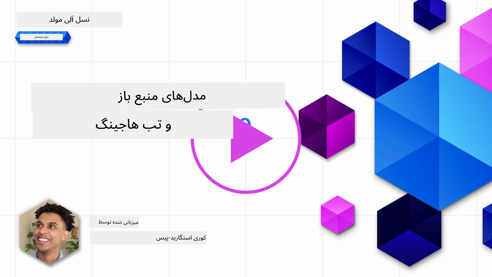
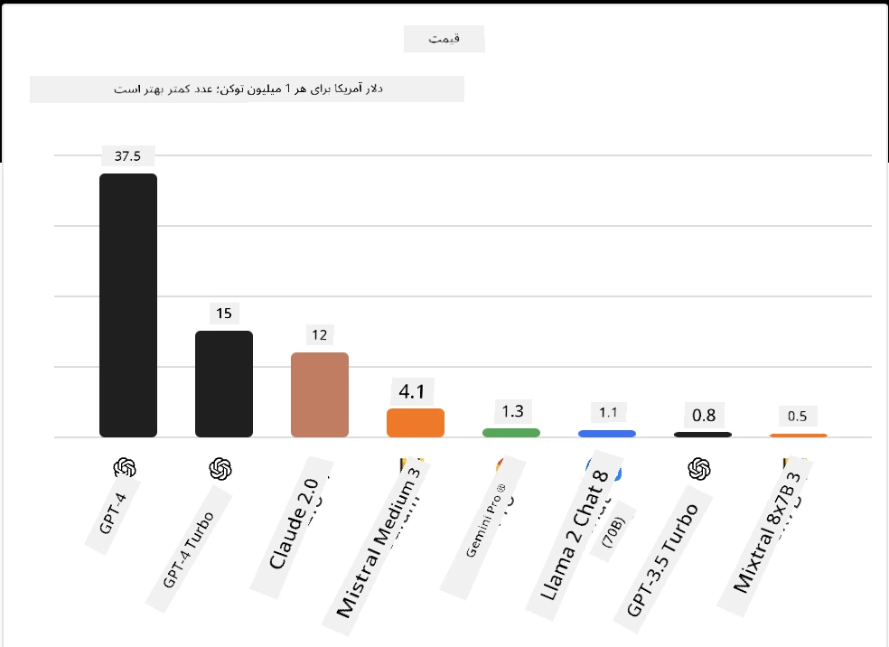
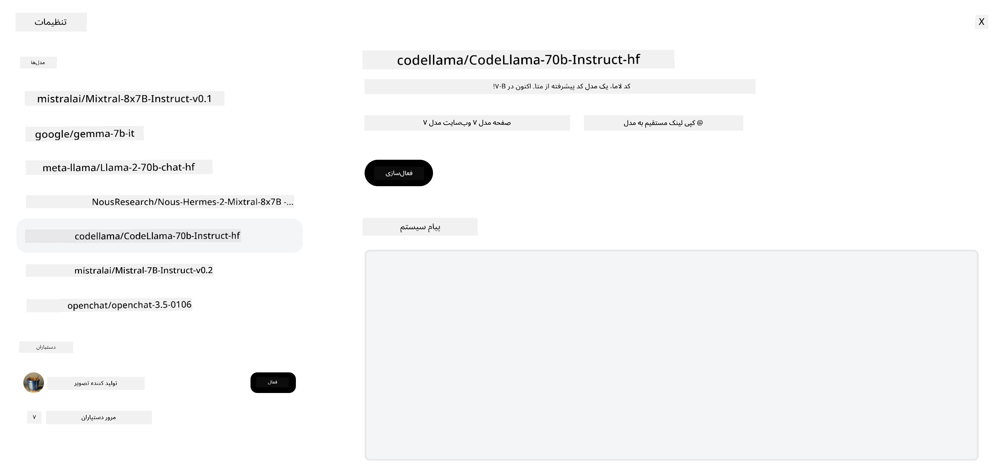
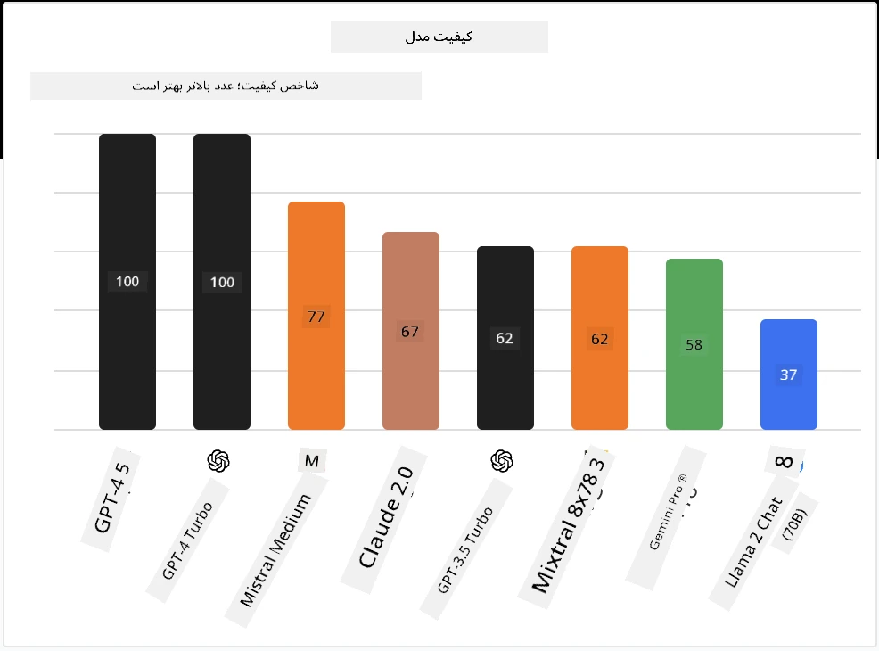

## مقدمه

دنیای مدل‌های زبانی بزرگ متن باز هیجان‌انگیز و دائما در حال پیشرفت است. هدف این درس ارائه نگاهی عمیق به مدل‌های متن باز است. اگر به دنبال اطلاعاتی درباره مقایسه مدل‌های اختصاصی با مدل‌های متن باز هستید، به درس ["بررسی و مقایسه مدل‌های مختلف LLM"](../02-exploring-and-comparing-different-llms/README.md?WT.mc_id=academic-105485-koreyst) مراجعه کنید. این درس همچنین موضوع ریزتنظیم را پوشش می‌دهد اما توضیح مفصل‌تر را می‌توانید در درس ["ریزتنظیم مدل‌های LLM"](../18-fine-tuning/README.md?WT.mc_id=academic-105485-koreyst) بیابید.

## اهداف یادگیری

- کسب درک مدل‌های متن باز
- شناخت مزایای کار با مدل‌های متن باز
- بررسی مدل‌های متن بازی که در Hugging Face و کاتالوگ مدل Microsoft Foundry موجود است

## مدل‌های متن باز چیستند؟

نرم‌افزار متن باز نقش مهمی در رشد فناوری در حوزه‌های مختلف داشته است. ابتکار متن باز (OSI) [۱۰ معیار را برای نرم‌افزار](https://web.archive.org/web/20241126001143/https://opensource.org/osd?WT.mc_id=academic-105485-koreyst) برای طبقه‌بندی به عنوان متن باز تعریف کرده است. کد منبع باید تحت مجوزی که توسط OSI تایید شده است، به صورت آشکار به اشتراک گذاشته شود.

اگرچه فرآیند توسعه مدل‌های زبانی بزرگ مشابه توسعه نرم‌افزار است، اما دقیقا یکسان نیست. این موضوع بحث‌های زیادی در جامعه پیرامون تعریف متن باز در زمینه LLMها به وجود آورده است. برای اینکه یک مدل مطابق تعریف سنتی متن باز باشد، اطلاعات زیر باید به‌صورت عمومی در دسترس قرار گیرد:

- مجموعه داده‌های استفاده شده برای آموزش مدل.
- وزن‌های کامل مدل به همراه آموزش.
- کد ارزیابی.
- کد ریزتنظیم.
- وزن کامل مدل و معیارهای آموزش.

در حال حاضر فقط تعداد کمی مدل این معیارها را دارند. مدل [OLMo که توسط مؤسسه آلن هوش مصنوعی (AllenAI) ساخته شده است](https://huggingface.co/allenai/OLMo-7B?WT.mc_id=academic-105485-koreyst) نمونه‌ای از این دسته است.

در این درس، به مدل‌ها به عنوان "مدل‌های متن باز" اشاره خواهیم کرد زیرا ممکن است در زمان نگارش این درس با معیارهای بالا کاملا مطابقت نداشته باشند.

## مزایای مدل‌های متن باز

**به شدت قابل سفارشی‌سازی** - چون مدل‌های متن باز همراه با اطلاعات دقیق آموزشی منتشر می‌شوند، پژوهشگران و توسعه‌دهندگان می‌توانند اجزای داخلی مدل را تغییر دهند. این امکان ایجاد مدل‌های بسیار تخصصی را فراهم می‌کند که به‌صورت ریزتنظیم شده برای یک وظیفه یا زمینه خاص هستند. برخی مثال‌ها شامل تولید کد، عملیات ریاضی و زیست‌شناسی است.

**هزینه** - هزینه استفاده و پیاده‌سازی این مدل‌ها به ازای هر توکن کمتر از مدل‌های اختصاصی است. هنگام ساخت برنامه‌های هوش مصنوعی مولد، بررسی عملکرد در مقابل قیمت هنگام کار با این مدل‌ها در مورد مورد استفاده خود باید انجام شود.

منبع: Artificial Analysis

**انعطاف‌پذیری** - کار با مدل‌های باز به شما این امکان را می‌دهد که در استفاده از مدل‌های مختلف یا ترکیب آنها انعطاف‌پذیر باشید. نمونه‌ای از این مورد [دستیاران HuggingChat](https://huggingface.co/chat?WT.mc_id=academic-105485-koreyst) است که کاربر می‌تواند مدل مورد استفاده را مستقیماً در رابط کاربری انتخاب کند:

## بررسی مدل‌های باز مختلف

### Llama 2

[LLama2](https://huggingface.co/meta-llama?WT.mc_id=academic-105485-koreyst) که توسط متا توسعه یافته، مدلی باز است که بهینه‌سازی شده برای برنامه‌های مبتنی بر چت است. این به دلیل روش تنظیم دقیق آن است که شامل مقدار زیادی گفت‌وگو و بازخورد انسانی بود. با این روش، مدل نتایجی تولید می‌کند که بیشتر با انتظار انسان هماهنگ است و تجربه کاربری بهتری فراهم می‌کند.

برخی از نمونه‌های نسخه‌های تنظیم دقیق‌شده Llama شامل [Llama ژاپنی](https://huggingface.co/elyza/ELYZA-japanese-Llama-2-7b?WT.mc_id=academic-105485-koreyst) است که در زبان ژاپنی تخصص دارد و [Llama Pro](https://huggingface.co/TencentARC/LLaMA-Pro-8B?WT.mc_id=academic-105485-koreyst) که نسخه بهبود یافته‌ای از مدل پایه است.

### Mistral

[Mistral](https://huggingface.co/mistralai?WT.mc_id=academic-105485-koreyst) مدلی باز با تمرکز قوی بر عملکرد بالا و کارایی است. این مدل از رویکرد Mixture-of-Experts استفاده می‌کند که گروهی از مدل‌های متخصص را به یک سیستم ترکیب می‌کند که بر اساس ورودی، مدل‌های خاصی برای استفاده انتخاب می‌شوند. این باعث می‌شود محاسبات موثرتر باشد زیرا مدل‌ها فقط به ورودی‌هایی که در آنها تخصص دارند می‌پردازند.

برخی از نمونه‌های نسخه‌های تنظیم دقیق‌شده Mistral شامل [BioMistral](https://huggingface.co/BioMistral/BioMistral-7B?text=Mon+nom+est+Thomas+et+mon+principal?WT.mc_id=academic-105485-koreyst) است که بر حوزه پزشکی متمرکز است و [OpenMath Mistral](https://huggingface.co/nvidia/OpenMath-Mistral-7B-v0.1-hf?WT.mc_id=academic-105485-koreyst) که محاسبات ریاضی انجام می‌دهد.

### Falcon

[Falcon](https://huggingface.co/tiiuae?WT.mc_id=academic-105485-koreyst) یک LLM ساخته شده توسط مؤسسه نوآوری فناوری (**TII**) است. Falcon-40B بر روی ۴۰ میلیارد پارامتر آموزش دیده است که نشان داده شده عملکرد بهتری نسبت به GPT-3 با بودجه محاسباتی کمتر دارد. این به دلیل استفاده از الگوریتم FlashAttention و توجه چند-درخواستی است که به آن اجازه می‌دهد نیازمندی‌های حافظه هنگام استنتاج را کاهش دهد. با این کاهش زمان استنتاج، Falcon-40B برای برنامه‌های چت مناسب است.

برخی نمونه‌ها از نسخه‌های تنظیم شده دقیق فالکون عبارتند از [OpenAssistant](https://huggingface.co/OpenAssistant/falcon-40b-sft-top1-560?WT.mc_id=academic-105485-koreyst)، دستیار ساخته شده بر اساس مدل‌های باز و [GPT4ALL](https://huggingface.co/nomic-ai/gpt4all-falcon?WT.mc_id=academic-105485-koreyst)، که عملکردی بهتر از مدل پایه ارائه می‌دهد.

## چگونه انتخاب کنیم

پاسخ واحدی برای انتخاب یک مدل باز وجود ندارد. یک نقطه شروع خوب استفاده از ویژگی فیلتر بر اساس وظیفه در کاتالوگ مدل Microsoft Foundry است. این به شما کمک می‌کند بفهمید مدل برای چه نوع وظایفی آموزش دیده است. Hugging Face همچنین یک جدول امتیازدهی LLM را نگهداری می‌کند که مدل‌های برتر را بر اساس معیارهای خاص نشان می‌دهد.

هنگام مقایسه LLMها در انواع مختلف، [Artificial Analysis](https://artificialanalysis.ai/?WT.mc_id=academic-105485-koreyst) منبع بسیار خوبی است:

منبع: Artificial Analysis

اگر روی یک مورد استفاده خاص کار می‌کنید، جستجوی نسخه‌های تنظیم شده دقیق که بر همان حوزه تمرکز دارند می‌تواند مؤثر باشد. آزمایش با چندین مدل باز برای دیدن نحوه عملکرد آنها بر اساس انتظارات شما و کاربران‌تان نیز روش خوبی است.

## مراحل بعدی

بهترین بخش در مورد مدل‌های باز این است که می‌توانید خیلی سریع شروع به کار با آن‌ها کنید. کاتالوگ مدل Microsoft Foundry را بررسی کنید که شامل یک مجموعه خاص از Hugging Face با مدل‌هایی است که در اینجا بررسی کردیم.

## یادگیری اینجا متوقف نمی‌شود، سفر را ادامه دهید

پس از اتمام این درس، مجموعه [یادگیری هوش مصنوعی مولد](https://aka.ms/genai-collection?WT.mc_id=academic-105485-koreyst) ما را بررسی کنید تا دانش هوش مصنوعی مولد خود را ارتقا دهید!

---

<!-- CO-OP TRANSLATOR DISCLAIMER START -->
**سلب مسئولیت**:
این سند با استفاده از سرویس ترجمه هوش مصنوعی [Co-op Translator](https://github.com/Azure/co-op-translator) ترجمه شده است. در حالی که ما در تلاش برای دقت هستیم، لطفاً توجه داشته باشید که ترجمه‌های خودکار ممکن است شامل خطاها یا نادرستی‌هایی باشند. سند اصلی به زبان مادری خود باید به عنوان منبع معتبر در نظر گرفته شود. برای اطلاعات حیاتی، ترجمه حرفه‌ای انسانی توصیه می‌شود. ما در قبال هرگونه سوء تفاهم یا برداشت نادرست ناشی از استفاده از این ترجمه مسئولیتی نداریم.
<!-- CO-OP TRANSLATOR DISCLAIMER END -->