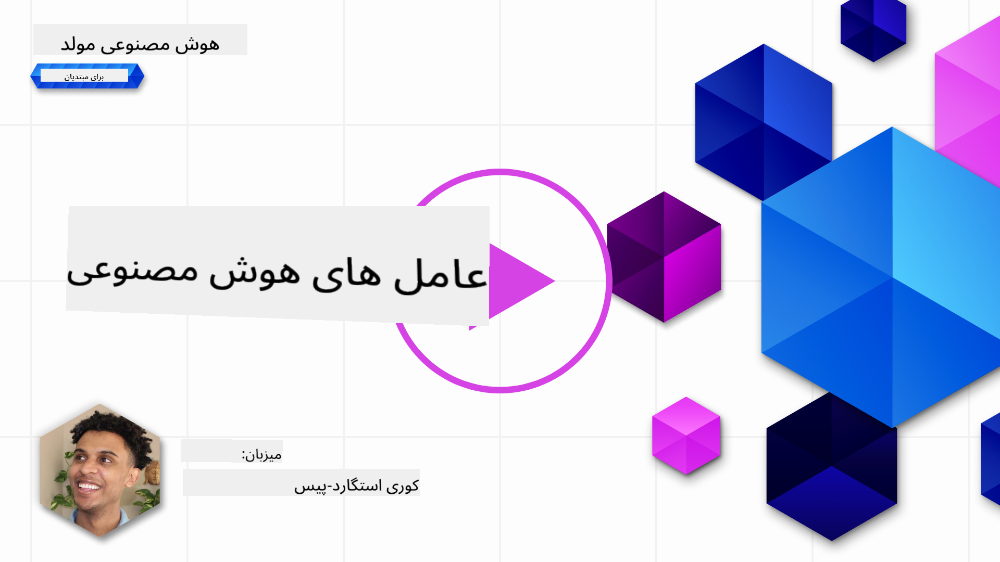
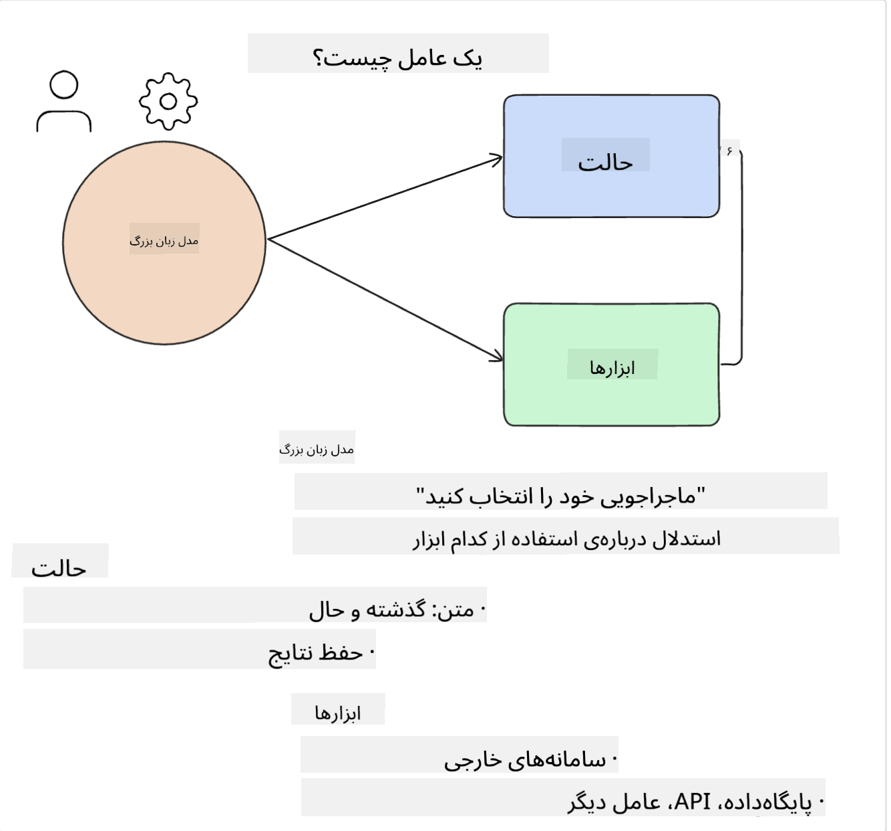
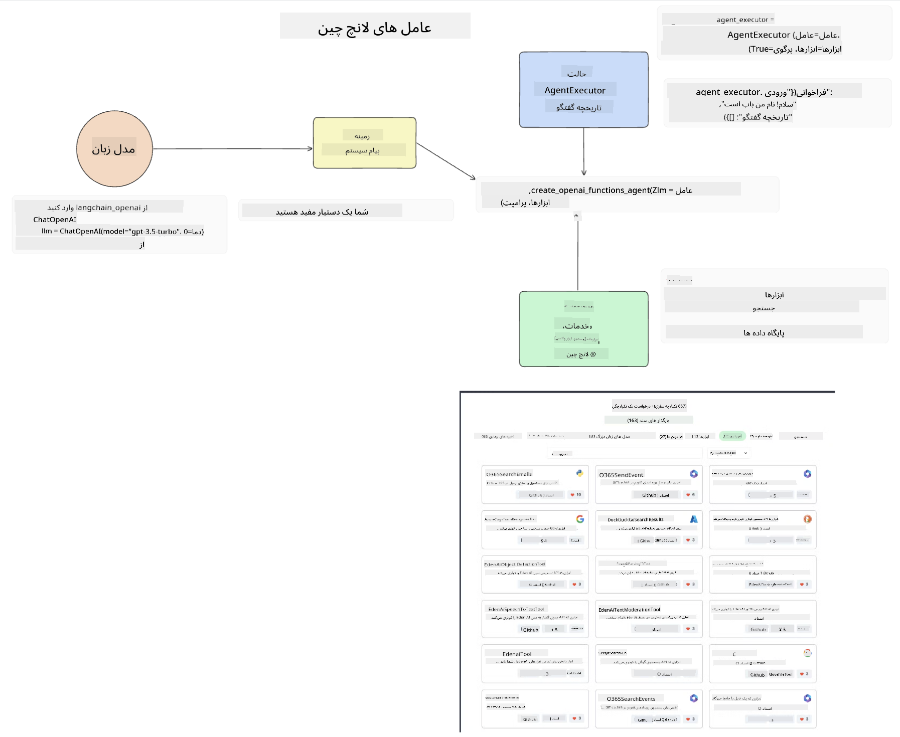
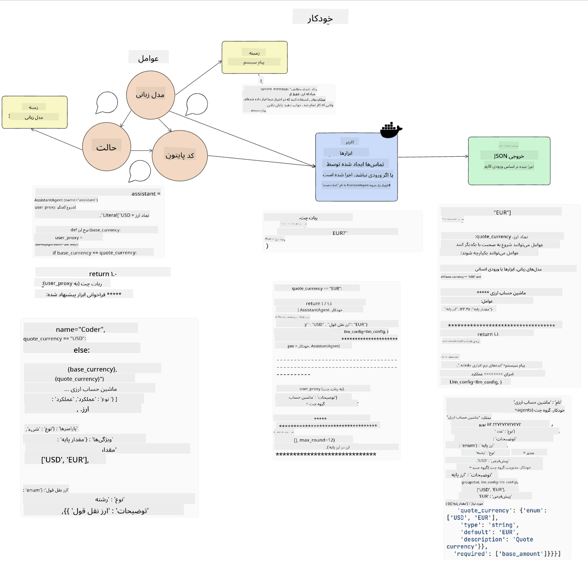
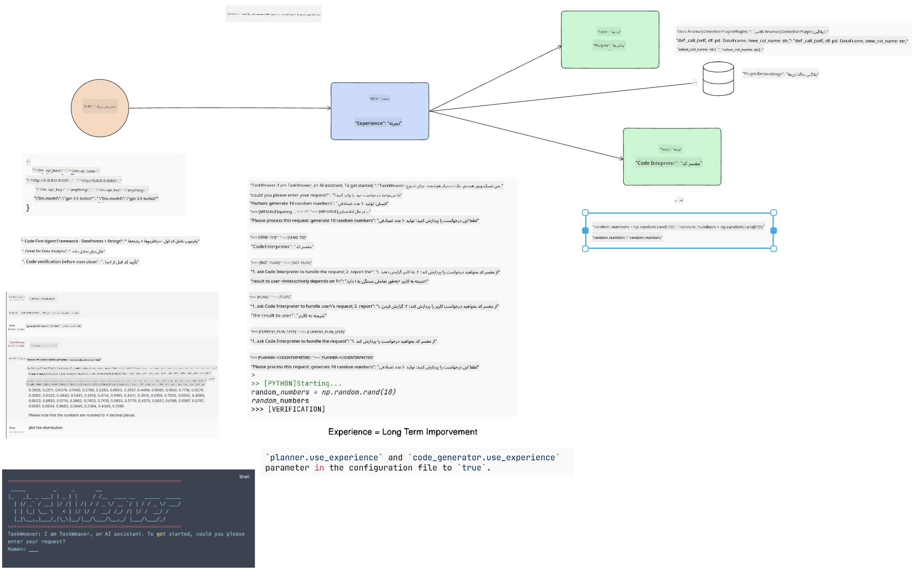

<!--
CO_OP_TRANSLATOR_METADATA:
{
  "original_hash": "11f03c81f190d9cbafd0f977dcbede6c",
  "translation_date": "2025-05-20T07:08:51+00:00",
  "source_file": "17-ai-agents/README.md",
  "language_code": "fa"
}
-->
[](https://aka.ms/gen-ai-lesson17-gh?WT.mc_id=academic-105485-koreyst)

## مقدمه

عوامل هوش مصنوعی نمایانگر یک توسعه هیجان‌انگیز در هوش مصنوعی مولد هستند که به مدل‌های زبانی بزرگ (LLMها) اجازه می‌دهند از دستیارها به عوامل قادر به انجام اقدامات تبدیل شوند. چارچوب‌های عامل هوش مصنوعی به توسعه‌دهندگان امکان می‌دهند برنامه‌هایی بسازند که به LLMها دسترسی به ابزارها و مدیریت حالت را فراهم کنند. این چارچوب‌ها همچنین قابلیت مشاهده را افزایش می‌دهند و به کاربران و توسعه‌دهندگان امکان می‌دهند اقدامات برنامه‌ریزی‌شده توسط LLMها را نظارت کنند، بنابراین مدیریت تجربه را بهبود می‌بخشند.

این درس به حوزه‌های زیر می‌پردازد:

- درک اینکه یک عامل هوش مصنوعی چیست - دقیقاً یک عامل هوش مصنوعی چیست؟
- بررسی چهار چارچوب مختلف عامل هوش مصنوعی - چه چیزی آن‌ها را منحصر به فرد می‌کند؟
- استفاده از این عوامل هوش مصنوعی در موارد استفاده مختلف - چه زمانی باید از عوامل هوش مصنوعی استفاده کنیم؟

## اهداف یادگیری

پس از گذراندن این درس، شما قادر خواهید بود:

- توضیح دهید که عوامل هوش مصنوعی چیستند و چگونه می‌توان از آن‌ها استفاده کرد.
- تفاوت‌های بین برخی از چارچوب‌های محبوب عامل هوش مصنوعی را بفهمید و چگونه با یکدیگر متفاوتند.
- بفهمید که عوامل هوش مصنوعی چگونه عمل می‌کنند تا بتوانید با آن‌ها برنامه‌هایی بسازید.

## عوامل هوش مصنوعی چیستند؟

عوامل هوش مصنوعی یک حوزه بسیار هیجان‌انگیز در دنیای هوش مصنوعی مولد هستند. با این هیجان، گاهی اوقات سردرگمی در اصطلاحات و کاربرد آن‌ها نیز وجود دارد. برای ساده‌سازی و شامل کردن اکثر ابزارهایی که به عوامل هوش مصنوعی اشاره دارند، ما از این تعریف استفاده خواهیم کرد:

عوامل هوش مصنوعی به مدل‌های زبانی بزرگ (LLMها) اجازه می‌دهند تا با دسترسی به یک **حالت** و **ابزارها** وظایف را انجام دهند.



بیایید این اصطلاحات را تعریف کنیم:

**مدل‌های زبانی بزرگ** - این مدل‌ها در طول این دوره به آن‌ها اشاره شده است، مانند GPT-3.5، GPT-4، Llama-2 و غیره.

**حالت** - این به زمینه‌ای اشاره دارد که LLM در آن کار می‌کند. LLM از زمینه اقدامات گذشته و زمینه فعلی استفاده می‌کند و تصمیم‌گیری‌های خود را برای اقدامات بعدی هدایت می‌کند. چارچوب‌های عامل هوش مصنوعی به توسعه‌دهندگان امکان می‌دهند این زمینه را به راحتی حفظ کنند.

**ابزارها** - برای تکمیل وظیفه‌ای که کاربر درخواست کرده و LLM برنامه‌ریزی کرده است، LLM نیاز به دسترسی به ابزارها دارد. برخی از نمونه‌های ابزارها می‌تواند یک پایگاه داده، یک API، یک برنامه خارجی یا حتی یک LLM دیگر باشد!

این تعاریف امیدواریم به شما درک خوبی از نحوه پیاده‌سازی آن‌ها بدهد. بیایید به بررسی چند چارچوب مختلف عامل هوش مصنوعی بپردازیم:

## عوامل LangChain

[عوامل LangChain](https://python.langchain.com/docs/how_to/#agents?WT.mc_id=academic-105485-koreyst) یک پیاده‌سازی از تعاریفی است که در بالا ارائه دادیم.

برای مدیریت **حالت**، از یک تابع داخلی به نام `AgentExecutor` استفاده می‌کند. این تابع `agent` تعریف‌شده و `tools` موجود را می‌پذیرد.

`Agent Executor` همچنین تاریخچه چت را ذخیره می‌کند تا زمینه چت را فراهم کند.



LangChain یک [کاتالوگ از ابزارها](https://integrations.langchain.com/tools?WT.mc_id=academic-105485-koreyst) ارائه می‌دهد که می‌تواند به برنامه شما وارد شود و LLM می‌تواند به آن‌ها دسترسی پیدا کند. این ابزارها توسط جامعه و تیم LangChain ساخته شده‌اند.

سپس می‌توانید این ابزارها را تعریف کرده و به `Agent Executor` منتقل کنید.

قابلیت مشاهده یکی دیگر از جنبه‌های مهم هنگام صحبت درباره عوامل هوش مصنوعی است. برای توسعه‌دهندگان برنامه مهم است که بفهمند کدام ابزار LLM استفاده می‌کند و چرا. برای این منظور، تیم LangChain LangSmith را توسعه داده است.

## AutoGen

چارچوب عامل هوش مصنوعی بعدی که درباره آن بحث خواهیم کرد [AutoGen](https://microsoft.github.io/autogen/?WT.mc_id=academic-105485-koreyst) است. تمرکز اصلی AutoGen بر مکالمات است. عوامل هم **قابل مکالمه** و هم **قابل تنظیم** هستند.

**قابل مکالمه -** LLMها می‌توانند یک مکالمه را با یک LLM دیگر شروع و ادامه دهند تا یک وظیفه را تکمیل کنند. این کار با ایجاد `AssistantAgents` و دادن یک پیام سیستم خاص به آن‌ها انجام می‌شود.

```python

autogen.AssistantAgent( name="Coder", llm_config=llm_config, ) pm = autogen.AssistantAgent( name="Product_manager", system_message="Creative in software product ideas.", llm_config=llm_config, )

```

**قابل تنظیم** - عوامل می‌توانند نه تنها به عنوان LLMها تعریف شوند، بلکه به عنوان یک کاربر یا ابزار نیز تعریف شوند. به عنوان یک توسعه‌دهنده، می‌توانید یک `UserProxyAgent` تعریف کنید که مسئول تعامل با کاربر برای بازخورد در تکمیل یک وظیفه است. این بازخورد می‌تواند ادامه اجرای وظیفه یا متوقف کردن آن را شامل شود.

```python
user_proxy = UserProxyAgent(name="user_proxy")
```

### حالت و ابزارها

برای تغییر و مدیریت حالت، یک عامل دستیار کد Python تولید می‌کند تا وظیفه را تکمیل کند.

در اینجا یک مثال از این فرآیند آمده است:



#### LLM تعریف‌شده با پیام سیستم

```python
system_message="For weather related tasks, only use the functions you have been provided with. Reply TERMINATE when the task is done."
```

این پیام‌های سیستم این LLM خاص را به عملکردهای مرتبط با وظیفه‌اش هدایت می‌کند. به یاد داشته باشید، با AutoGen می‌توانید چندین AssistantAgent تعریف‌شده با پیام‌های سیستم مختلف داشته باشید.

#### چت توسط کاربر آغاز می‌شود

```python
user_proxy.initiate_chat( chatbot, message="I am planning a trip to NYC next week, can you help me pick out what to wear? ", )

```

این پیام از user_proxy (انسان) چیزی است که فرآیند عامل را برای کاوش در عملکردهای ممکن که باید اجرا کند آغاز می‌کند.

#### عملکرد اجرا می‌شود

```bash
chatbot (to user_proxy):

***** Suggested tool Call: get_weather ***** Arguments: {"location":"New York City, NY","time_periond:"7","temperature_unit":"Celsius"} ******************************************************** --------------------------------------------------------------------------------

>>>>>>>> EXECUTING FUNCTION get_weather... user_proxy (to chatbot): ***** Response from calling function "get_weather" ***** 112.22727272727272 EUR ****************************************************************

```

پس از پردازش چت اولیه، عامل ابزار پیشنهادی برای فراخوانی را ارسال می‌کند. در این مورد، یک عملکرد به نام `get_weather`. Depending on your configuration, this function can be automatically executed and read by the Agent or can be executed based on user input.

You can find a list of [AutoGen code samples](https://microsoft.github.io/autogen/docs/Examples/?WT.mc_id=academic-105485-koreyst) to further explore how to get started building.

## Taskweaver

The next agent framework we will explore is [Taskweaver](https://microsoft.github.io/TaskWeaver/?WT.mc_id=academic-105485-koreyst). It is known as a "code-first" agent because instead of working strictly with `strings` , it can work with DataFrames in Python. This becomes extremely useful for data analysis and generation tasks. This can be things like creating graphs and charts or generating random numbers.

### State and Tools

To manage the state of the conversation, TaskWeaver uses the concept of a `Planner`. The `Planner` is a LLM that takes the request from the users and maps out the tasks that need to be completed to fulfill this request.

To complete the tasks the `Planner` is exposed to the collection of tools called `Plugins` است. این می‌تواند کلاس‌های Python یا یک مفسر کد عمومی باشد. این پلاگین‌ها به عنوان جاسازی‌ها ذخیره می‌شوند تا LLM بتواند بهتر به دنبال پلاگین صحیح بگردد.



در اینجا یک مثال از یک پلاگین برای مدیریت تشخیص ناهنجاری آمده است:

```python
class AnomalyDetectionPlugin(Plugin): def __call__(self, df: pd.DataFrame, time_col_name: str, value_col_name: str):
```

کد قبل از اجرا تأیید می‌شود. ویژگی دیگری برای مدیریت زمینه در Taskweaver `تجربه`. Experience allows for the context of a conversation to be stored over to the long term in a YAML file. This can be configured so that the LLM improves over time on certain tasks given that it is exposed to prior conversations.

## JARVIS

The last agent framework we will explore is [JARVIS](https://github.com/microsoft/JARVIS?tab=readme-ov-file?WT.mc_id=academic-105485-koreyst). What makes JARVIS unique is that it uses an LLM to manage the `state` مکالمه و `tools` مدل‌های هوش مصنوعی دیگر هستند. هر یک از مدل‌های هوش مصنوعی مدل‌های تخصصی هستند که وظایف خاصی مانند تشخیص اشیاء، رونویسی یا توضیحات تصویر را انجام می‌دهند.


LLM، که یک مدل چندمنظوره است، درخواست را از کاربر دریافت می‌کند و وظیفه خاص و هر گونه آرگومان/داده‌ای که برای تکمیل وظیفه نیاز است را شناسایی می‌کند.

```python
[{"task": "object-detection", "id": 0, "dep": [-1], "args": {"image": "e1.jpg" }}]
```

سپس LLM درخواست را به شکلی قالب‌بندی می‌کند که مدل هوش مصنوعی تخصصی بتواند آن را تفسیر کند، مانند JSON. هنگامی که مدل هوش مصنوعی پیش‌بینی خود را بر اساس وظیفه برمی‌گرداند، LLM پاسخ را دریافت می‌کند.

اگر چندین مدل برای تکمیل وظیفه مورد نیاز باشد، LLM پاسخ‌های آن مدل‌ها را نیز تفسیر می‌کند قبل از اینکه آن‌ها را با هم ترکیب کند تا پاسخ نهایی را به کاربر ارائه دهد.

مثال زیر نشان می‌دهد که چگونه این کار زمانی انجام می‌شود که یک کاربر درخواست توضیح و شمارش اشیاء در یک تصویر را می‌کند:

## تمرین

برای ادامه یادگیری خود در زمینه عوامل هوش مصنوعی، می‌توانید با AutoGen بسازید:

- یک برنامه که یک جلسه کاری با بخش‌های مختلف یک استارتاپ آموزشی را شبیه‌سازی کند.
- پیام‌های سیستمی ایجاد کنید که به LLMها در درک شخصیت‌ها و اولویت‌های مختلف راهنمایی کنند و به کاربر امکان ارائه یک ایده محصول جدید را بدهند.
- سپس LLM باید سؤالات پیگیری از هر بخش ایجاد کند تا ارائه و ایده محصول را بهبود بخشد.

## یادگیری به اینجا ختم نمی‌شود، به سفر ادامه دهید

پس از تکمیل این درس، به [مجموعه یادگیری هوش مصنوعی مولد ما](https://aka.ms/genai-collection?WT.mc_id=academic-105485-koreyst) نگاهی بیندازید تا به یادگیری دانش خود در زمینه هوش مصنوعی مولد ادامه دهید!

**سلب مسئولیت**:  
این سند با استفاده از سرویس ترجمه هوش مصنوعی [Co-op Translator](https://github.com/Azure/co-op-translator) ترجمه شده است. در حالی که ما برای دقت تلاش می‌کنیم، لطفاً توجه داشته باشید که ترجمه‌های خودکار ممکن است شامل اشتباهات یا نادرستی‌ها باشند. سند اصلی به زبان مادری باید به عنوان منبع معتبر در نظر گرفته شود. برای اطلاعات حیاتی، ترجمه انسانی حرفه‌ای توصیه می‌شود. ما مسئولیتی در قبال سوء تفاهم یا تفسیر نادرست ناشی از استفاده از این ترجمه نداریم.