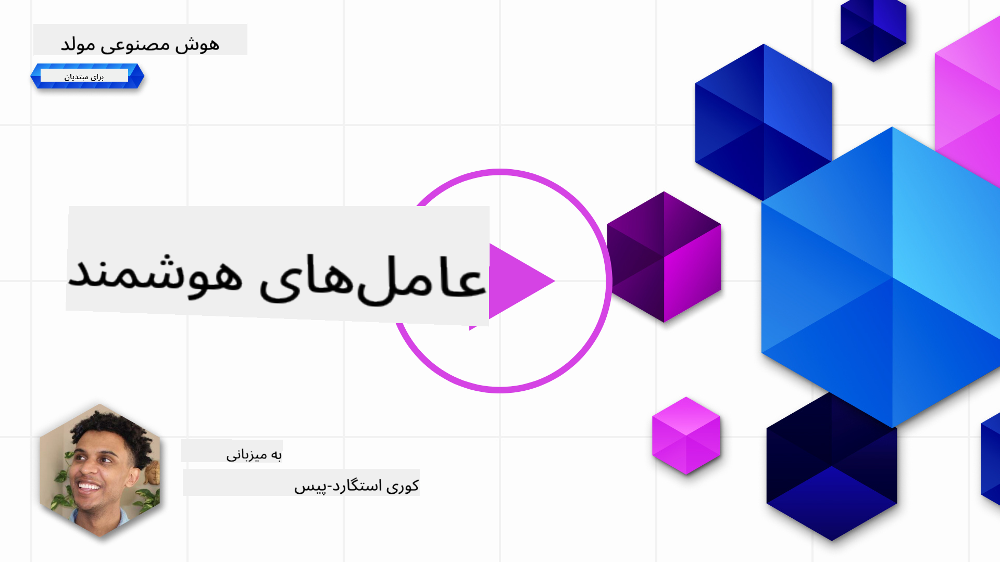
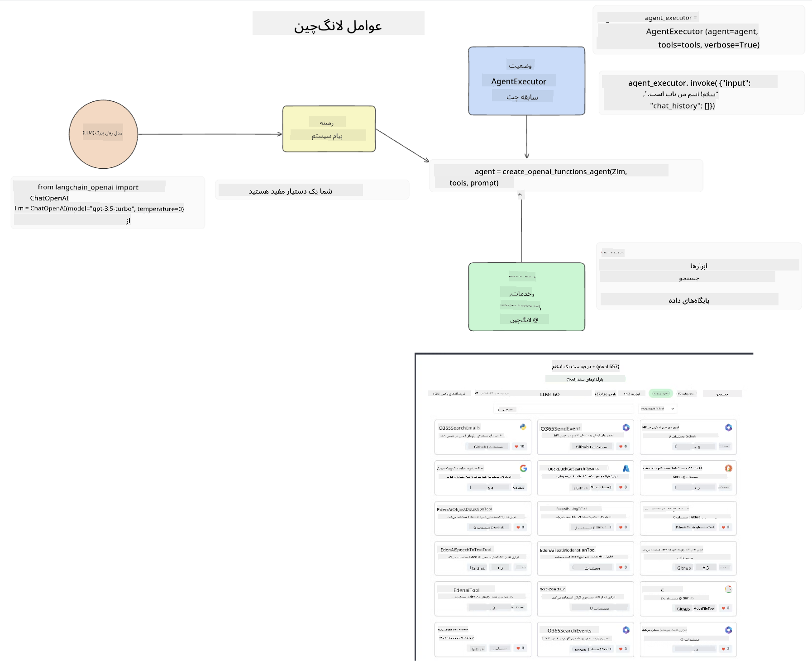
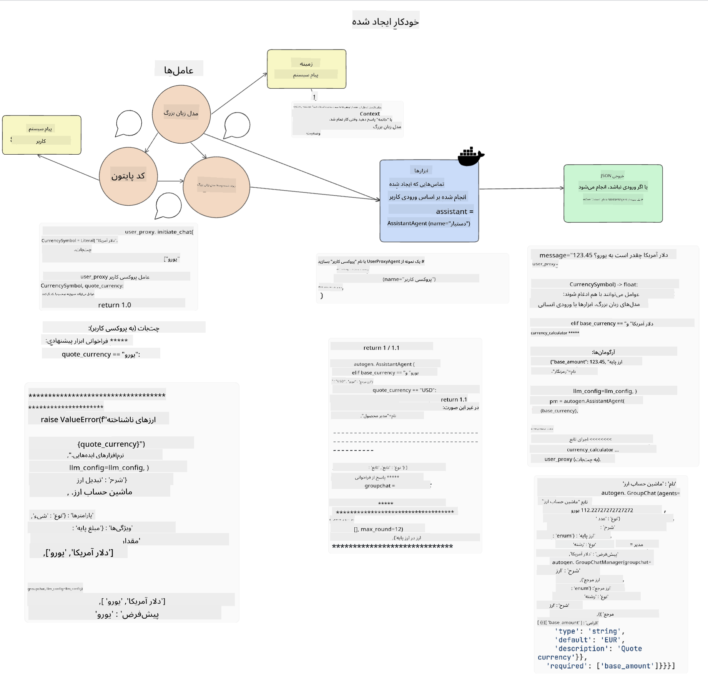
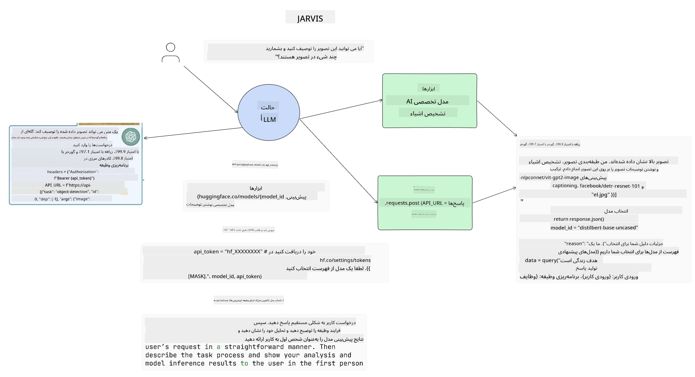

<!--
CO_OP_TRANSLATOR_METADATA:
{
  "original_hash": "11f03c81f190d9cbafd0f977dcbede6c",
  "translation_date": "2025-06-26T00:09:37+00:00",
  "source_file": "17-ai-agents/README.md",
  "language_code": "fa"
}
-->
[](https://aka.ms/gen-ai-lesson17-gh?WT.mc_id=academic-105485-koreyst)

## مقدمه

نماینده‌های هوش مصنوعی توسعه هیجان‌انگیزی در هوش مصنوعی مولد هستند که به مدل‌های زبانی بزرگ (LLMs) امکان می‌دهند از دستیارها به نماینده‌هایی تبدیل شوند که قادر به انجام اقدامات هستند. چارچوب‌های نماینده هوش مصنوعی به توسعه‌دهندگان امکان می‌دهند برنامه‌هایی ایجاد کنند که به LLM‌ها دسترسی به ابزارها و مدیریت حالت بدهند. این چارچوب‌ها همچنین دید را بهبود می‌بخشند، به کاربران و توسعه‌دهندگان اجازه می‌دهند اقدامات برنامه‌ریزی‌شده توسط LLM‌ها را نظارت کنند و به این ترتیب مدیریت تجربه را بهبود دهند.

درس به بررسی موارد زیر خواهد پرداخت:

- درک اینکه نماینده هوش مصنوعی چیست - نماینده هوش مصنوعی دقیقاً چیست؟
- بررسی چهار چارچوب مختلف نماینده هوش مصنوعی - چه چیزی آن‌ها را منحصر به فرد می‌کند؟
- اعمال این نماینده‌های هوش مصنوعی به موارد استفاده مختلف - چه زمانی باید از نماینده‌های هوش مصنوعی استفاده کنیم؟

## اهداف یادگیری

پس از گذراندن این درس، شما قادر خواهید بود:

- توضیح دهید که نماینده‌های هوش مصنوعی چه هستند و چگونه می‌توان از آن‌ها استفاده کرد.
- تفاوت‌های بین برخی از چارچوب‌های محبوب نماینده هوش مصنوعی را درک کنید و چگونه متفاوت هستند.
- درک کنید که نماینده‌های هوش مصنوعی چگونه عمل می‌کنند تا بتوانید با آن‌ها برنامه بسازید.

## نماینده‌های هوش مصنوعی چیستند؟

نماینده‌های هوش مصنوعی زمینه‌ای بسیار هیجان‌انگیز در دنیای هوش مصنوعی مولد هستند. با این هیجان گاهی اوقات سردرگمی از اصطلاحات و کاربردهای آن‌ها به وجود می‌آید. برای ساده نگه‌داشتن موضوع و شامل کردن بیشتر ابزارهایی که به نماینده‌های هوش مصنوعی اشاره دارند، از این تعریف استفاده خواهیم کرد:

نماینده‌های هوش مصنوعی به مدل‌های زبانی بزرگ (LLMs) اجازه می‌دهند با دسترسی به یک **حالت** و **ابزارها** وظایف را انجام دهند.


بیایید این اصطلاحات را تعریف کنیم:

**مدل‌های زبانی بزرگ** - این‌ها مدل‌هایی هستند که در طول این دوره به آن‌ها اشاره شده است مانند GPT-3.5، GPT-4، Llama-2 و غیره.

**حالت** - این به زمینه‌ای که LLM در آن کار می‌کند اشاره دارد. LLM از زمینه اقدامات گذشته و زمینه فعلی استفاده می‌کند تا تصمیم‌گیری‌های خود را برای اقدامات بعدی هدایت کند. چارچوب‌های نماینده هوش مصنوعی به توسعه‌دهندگان اجازه می‌دهند این زمینه را آسان‌تر حفظ کنند.

**ابزارها** - برای تکمیل وظیفه‌ای که کاربر درخواست کرده و LLM برنامه‌ریزی کرده است، LLM نیاز به دسترسی به ابزارها دارد. برخی از مثال‌های ابزارها می‌تواند یک پایگاه داده، یک API، یک برنامه خارجی یا حتی یک LLM دیگر باشد!

این تعاریف امیدوارم به شما پایه‌ای خوب برای پیشرفت در نظر داشته باشد وقتی که به بررسی نحوه پیاده‌سازی آن‌ها می‌پردازیم. بیایید چند چارچوب مختلف نماینده هوش مصنوعی را بررسی کنیم:

## نماینده‌های LangChain

[نماینده‌های LangChain](https://python.langchain.com/docs/how_to/#agents?WT.mc_id=academic-105485-koreyst) پیاده‌سازی تعاریفی است که در بالا ارائه دادیم.

برای مدیریت **حالت**، از یک تابع داخلی به نام `AgentExecutor` استفاده می‌کند. این تابع `agent` تعریف‌شده و `tools` موجود را می‌پذیرد.

`Agent Executor` همچنین تاریخچه چت را ذخیره می‌کند تا زمینه چت را فراهم کند.



LangChain یک [کاتالوگ ابزارها](https://integrations.langchain.com/tools?WT.mc_id=academic-105485-koreyst) ارائه می‌دهد که می‌توانند به برنامه شما وارد شوند که در آن LLM می‌تواند به آن‌ها دسترسی پیدا کند. این‌ها توسط جامعه و تیم LangChain ساخته شده‌اند.

سپس می‌توانید این ابزارها را تعریف کرده و به `Agent Executor` منتقل کنید.

دید یکی دیگر از جنبه‌های مهم هنگام صحبت در مورد نماینده‌های هوش مصنوعی است. مهم است که توسعه‌دهندگان برنامه درک کنند که کدام ابزار را LLM استفاده می‌کند و چرا. برای این منظور، تیم LangChain LangSmith را توسعه داده‌اند.

## AutoGen

چارچوب نماینده هوش مصنوعی بعدی که بررسی خواهیم کرد [AutoGen](https://microsoft.github.io/autogen/?WT.mc_id=academic-105485-koreyst) است. تمرکز اصلی AutoGen بر مکالمات است. نماینده‌ها هم **قابل مکالمه** و هم **قابل تنظیم** هستند.

**قابل مکالمه -** LLM‌ها می‌توانند مکالمه‌ای را با یک LLM دیگر شروع و ادامه دهند تا وظیفه‌ای را تکمیل کنند. این کار با ایجاد `AssistantAgents` و دادن پیام سیستم خاصی به آن‌ها انجام می‌شود.

```python

autogen.AssistantAgent( name="Coder", llm_config=llm_config, ) pm = autogen.AssistantAgent( name="Product_manager", system_message="Creative in software product ideas.", llm_config=llm_config, )

```

**قابل تنظیم** - نماینده‌ها می‌توانند نه تنها به عنوان LLM‌ها تعریف شوند بلکه به عنوان یک کاربر یا ابزار نیز باشند. به عنوان یک توسعه‌دهنده، می‌توانید یک `UserProxyAgent` تعریف کنید که مسئول تعامل با کاربر برای بازخورد در تکمیل وظیفه است. این بازخورد می‌تواند ادامه اجرای وظیفه یا توقف آن باشد.

```python
user_proxy = UserProxyAgent(name="user_proxy")
```

### حالت و ابزارها

برای تغییر و مدیریت حالت، یک نماینده دستیار کد پایتون تولید می‌کند تا وظیفه را تکمیل کند.

در اینجا یک مثال از فرآیند وجود دارد:



#### LLM با پیام سیستم تعریف شده است

```python
system_message="For weather related tasks, only use the functions you have been provided with. Reply TERMINATE when the task is done."
```

این پیام سیستم این LLM خاص را هدایت می‌کند که کدام توابع برای وظیفه آن مرتبط هستند. به یاد داشته باشید، با AutoGen می‌توانید چندین AssistantAgents تعریف‌شده با پیام‌های سیستم مختلف داشته باشید.

#### چت توسط کاربر آغاز می‌شود

```python
user_proxy.initiate_chat( chatbot, message="I am planning a trip to NYC next week, can you help me pick out what to wear? ", )

```

این پیام از user_proxy (انسان) چیزی است که فرآیند نماینده را برای بررسی توابع ممکن که باید اجرا کند آغاز می‌کند.

#### تابع اجرا می‌شود

```bash
chatbot (to user_proxy):

***** Suggested tool Call: get_weather ***** Arguments: {"location":"New York City, NY","time_periond:"7","temperature_unit":"Celsius"} ******************************************************** --------------------------------------------------------------------------------

>>>>>>>> EXECUTING FUNCTION get_weather... user_proxy (to chatbot): ***** Response from calling function "get_weather" ***** 112.22727272727272 EUR ****************************************************************

```

پس از پردازش چت اولیه، نماینده ابزار پیشنهادی را برای فراخوانی ارسال می‌کند. در این مورد، تابعی به نام `get_weather`. Depending on your configuration, this function can be automatically executed and read by the Agent or can be executed based on user input.

You can find a list of [AutoGen code samples](https://microsoft.github.io/autogen/docs/Examples/?WT.mc_id=academic-105485-koreyst) to further explore how to get started building.

## Taskweaver

The next agent framework we will explore is [Taskweaver](https://microsoft.github.io/TaskWeaver/?WT.mc_id=academic-105485-koreyst). It is known as a "code-first" agent because instead of working strictly with `strings` , it can work with DataFrames in Python. This becomes extremely useful for data analysis and generation tasks. This can be things like creating graphs and charts or generating random numbers.

### State and Tools

To manage the state of the conversation, TaskWeaver uses the concept of a `Planner`. The `Planner` is a LLM that takes the request from the users and maps out the tasks that need to be completed to fulfill this request.

To complete the tasks the `Planner` is exposed to the collection of tools called `Plugins` است. این می‌تواند کلاس‌های پایتون یا یک مفسر کد عمومی باشد. این پلاگین‌ها به صورت جاسازی‌شده ذخیره می‌شوند تا LLM بتواند بهتر به دنبال پلاگین صحیح بگردد.


در اینجا یک مثال از یک پلاگین برای مدیریت تشخیص ناهنجاری وجود دارد:

```python
class AnomalyDetectionPlugin(Plugin): def __call__(self, df: pd.DataFrame, time_col_name: str, value_col_name: str):
```

کد قبل از اجرا تأیید می‌شود. ویژگی دیگری برای مدیریت زمینه در Taskweaver `تجربه`. Experience allows for the context of a conversation to be stored over to the long term in a YAML file. This can be configured so that the LLM improves over time on certain tasks given that it is exposed to prior conversations.

## JARVIS

The last agent framework we will explore is [JARVIS](https://github.com/microsoft/JARVIS?tab=readme-ov-file?WT.mc_id=academic-105485-koreyst). What makes JARVIS unique is that it uses an LLM to manage the `حالت` مکالمه و `tools` مدل‌های هوش مصنوعی دیگر هستند. هر یک از مدل‌های هوش مصنوعی مدل‌های تخصصی هستند که وظایف خاصی مانند تشخیص اشیا، ترجمه یا توصیف تصویر را انجام می‌دهند.



LLM، که یک مدل عمومی است، درخواست را از کاربر دریافت می‌کند و وظیفه خاص و هر گونه آرگومان/داده‌ای که برای تکمیل وظیفه نیاز است را شناسایی می‌کند.

```python
[{"task": "object-detection", "id": 0, "dep": [-1], "args": {"image": "e1.jpg" }}]
```

سپس LLM درخواست را به شکلی که مدل هوش مصنوعی تخصصی بتواند تفسیر کند، مانند JSON، فرمت می‌کند. وقتی مدل هوش مصنوعی بر اساس وظیفه پیش‌بینی خود را بازگرداند، LLM پاسخ را دریافت می‌کند.

اگر چندین مدل برای تکمیل وظیفه لازم باشد، همچنین پاسخ آن مدل‌ها را قبل از ترکیب آن‌ها برای تولید پاسخ به کاربر تفسیر خواهد کرد.

مثال زیر نشان می‌دهد که این چگونه کار می‌کند وقتی که کاربر درخواست توصیف و شمارش اشیاء در یک تصویر را می‌کند:

## وظیفه

برای ادامه یادگیری نماینده‌های هوش مصنوعی می‌توانید با AutoGen بسازید:

- یک برنامه که یک جلسه کاری با بخش‌های مختلف یک استارتاپ آموزشی را شبیه‌سازی می‌کند.
- پیام‌های سیستم ایجاد کنید که LLM‌ها را در درک شخصیت‌ها و اولویت‌های مختلف هدایت کند و به کاربر امکان دهد ایده محصول جدیدی را ارائه کند.
- سپس LLM باید سوالات پیگیری از هر بخش برای تصحیح و بهبود ارائه و ایده محصول تولید کند.

## یادگیری اینجا متوقف نمی‌شود، به سفر ادامه دهید

پس از تکمیل این درس، مجموعه [یادگیری هوش مصنوعی مولد](https://aka.ms/genai-collection?WT.mc_id=academic-105485-koreyst) ما را بررسی کنید تا به ارتقاء دانش هوش مصنوعی مولد خود ادامه دهید!

**سلب مسئولیت**:  
این سند با استفاده از سرویس ترجمه هوش مصنوعی [Co-op Translator](https://github.com/Azure/co-op-translator) ترجمه شده است. در حالی که ما تلاش می‌کنیم تا دقت را حفظ کنیم، لطفاً توجه داشته باشید که ترجمه‌های خودکار ممکن است شامل خطاها یا نادرستی‌ها باشند. سند اصلی به زبان مادری آن باید به عنوان منبع معتبر در نظر گرفته شود. برای اطلاعات حیاتی، ترجمه حرفه‌ای انسانی توصیه می‌شود. ما مسئولیتی در قبال سوء تفاهم‌ها یا تفسیرهای نادرست ناشی از استفاده از این ترجمه نداریم.