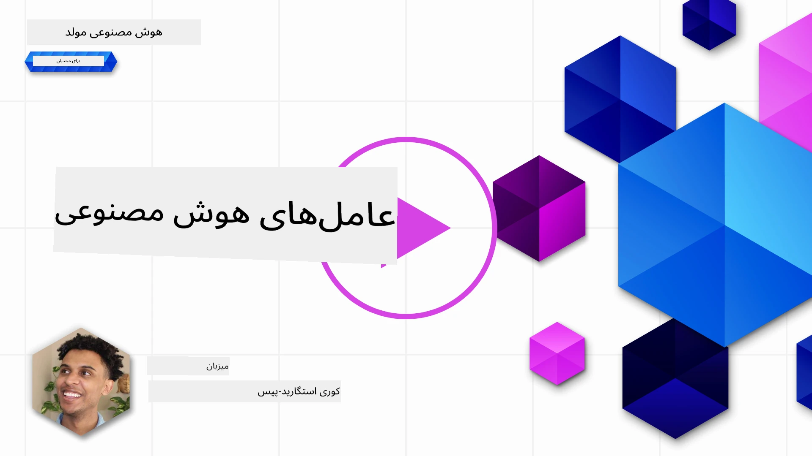
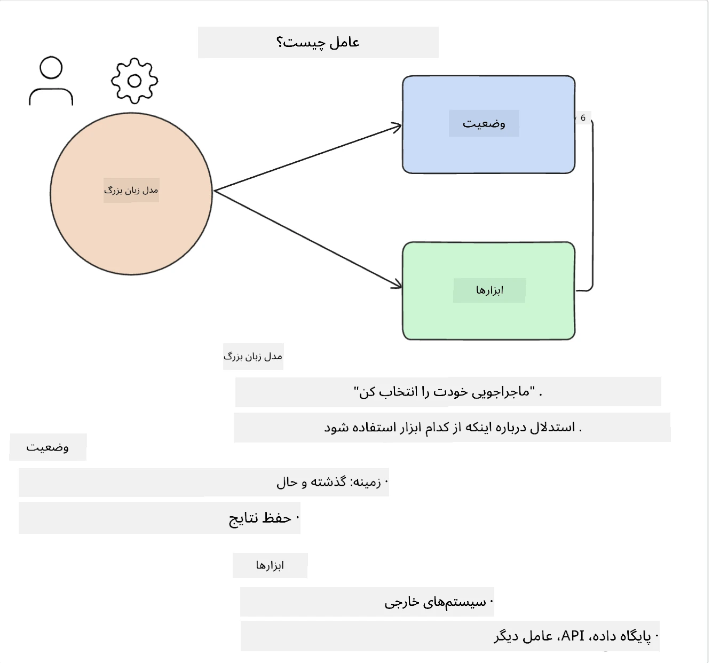
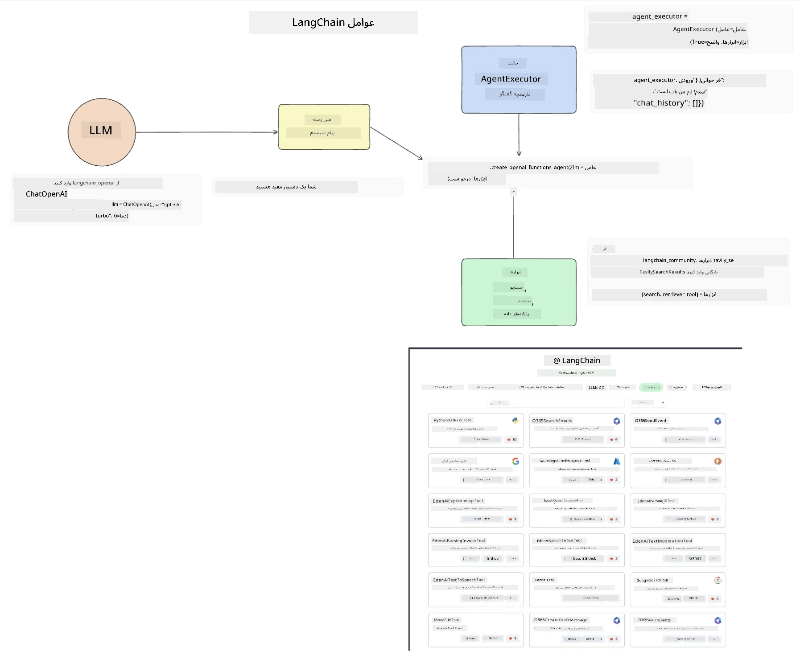
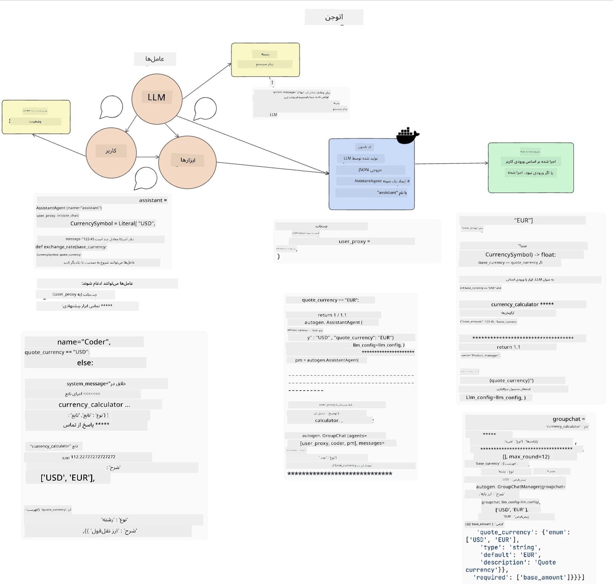
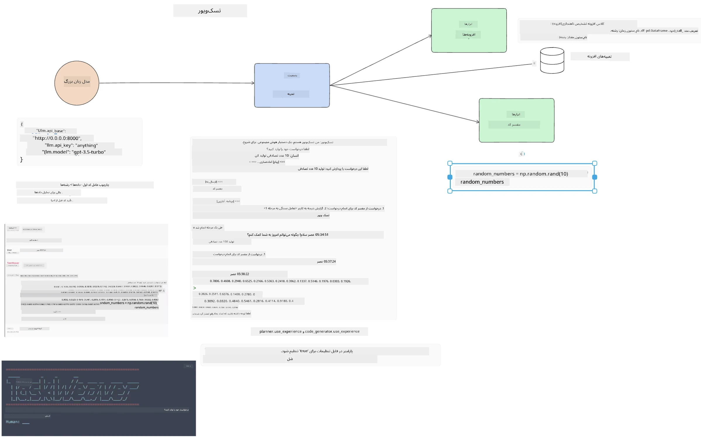
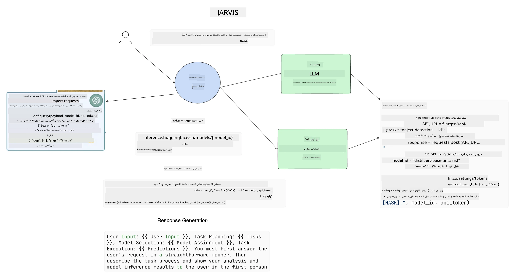

[](https://youtu.be/yAXVW-lUINc?si=bOtW9nL6jc3XJgOM)

## مقدمه

عامل‌های هوش مصنوعی نمایانگر یک پیشرفت هیجان‌انگیز در هوش مصنوعی مولد هستند که به مدل‌های زبان بزرگ (LLMها) امکان می‌دهد از دستیار به عامل‌هایی که قادر به انجام اقدامات هستند، تبدیل شوند. چارچوب‌های عامل‌های هوش مصنوعی به توسعه‌دهندگان اجازه می‌دهند برنامه‌هایی ایجاد کنند تا به LLMها دسترسی به ابزارها و مدیریت وضعیت بدهند. این چارچوب‌ها همچنین دیدپذیری را افزایش می‌دهند، به طوری که کاربران و توسعه‌دهندگان می‌توانند اقداماتی که توسط LLMها برنامه‌ریزی شده‌اند را نظارت کنند و در نتیجه مدیریت تجربه را بهبود بخشند.

درس شامل بخش‌های زیر خواهد بود:

- درک اینکه عامل هوش مصنوعی چیست - عامل هوش مصنوعی دقیقاً چیست؟
- بررسی چهار چارچوب مختلف عامل هوش مصنوعی - چه چیزی آن‌ها را منحصر به فرد می‌کند؟
- به کارگیری این عامل‌ها در موارد مختلف - چه زمانی باید از عامل‌های هوش مصنوعی استفاده کنیم؟

## اهداف یادگیری

پس از گذراندن این درس، شما قادر خواهید بود:

- توضیح دهید که عامل‌های هوش مصنوعی چیستند و چگونه می‌توان از آن‌ها استفاده کرد.
- تفاوت‌های بین برخی از چارچوب‌های محبوب عامل هوش مصنوعی را درک کنید و بدانید چگونه با هم تفاوت دارند.
- بفهمید عامل‌های هوش مصنوعی چگونه کار می‌کنند تا بتوانید برنامه‌هایی با آن‌ها بسازید.

## عامل‌های هوش مصنوعی چه هستند؟

عامل‌های هوش مصنوعی حوزه‌ای بسیار هیجان‌انگیز در دنیای هوش مصنوعی مولد هستند. با این هیجان گاهی اوقات سردرگمی در اصطلاحات و کاربرد آن‌ها وجود دارد. برای ساده نگه داشتن و شامل بیشتر ابزارهایی که به عامل‌های هوش مصنوعی اشاره می‌کنند، از این تعریف استفاده می‌کنیم:

عامل‌های هوش مصنوعی به مدل‌های زبان بزرگ (LLMها) اجازه می‌دهند با دادن دسترسی به **وضعیت** و **ابزارها**، وظایف را انجام دهند.



اجازه دهید این اصطلاحات را تعریف کنیم:

**مدل‌های زبان بزرگ** – مدل‌هایی هستند که در این دوره به آن‌ها اشاره شده است مثل GPT-3.5، GPT-4، Llama-2 و غیره.

**وضعیت** – اشاره به متن یا زمینه‌ای دارد که LLM در آن کار می‌کند. LLM از زمینه اقدامات گذشته و شرایط کنونی استفاده می‌کند تا تصمیمات اقدامات بعدی را هدایت کند. چارچوب‌های عامل هوش مصنوعی به توسعه‌دهندگان کمک می‌کنند این زمینه را آسان‌تر مدیریت کنند.

**ابزارها** – برای تکمیل وظیفه‌ای که کاربر درخواست کرده و LLM برنامه‌ریزی کرده است، لازم است LLM به ابزارهایی دسترسی داشته باشد. نمونه‌هایی از ابزارها می‌تواند پایگاه داده، یک API، یک برنامه خارجی یا حتی یک LLM دیگر باشد!

این تعاریف امیدواریم مبنای خوبی برای ادامه کار به شما بدهد وقتی به نحوه پیاده‌سازی آن‌ها نگاه می‌کنیم. اجازه دهید چند چارچوب عامل هوش مصنوعی مختلف را بررسی کنیم:

## عامل‌های LangChain

[عامل‌های LangChain](https://python.langchain.com/docs/how_to/#agents?WT.mc_id=academic-105485-koreyst) پیاده‌سازی تعاریف ارائه شده در بالا هستند.

برای مدیریت **وضعیت** از تابع داخلی به نام `AgentExecutor` استفاده می‌کند. این تابع `agent` تعریف شده و `tools` قابل دسترس را می‌پذیرد.

`AgentExecutor` همچنین تاریخچه چت را ذخیره می‌کند تا زمینه گفت‌وگو را فراهم نماید.



LangChain مجموعه‌ای از [ابزارها](https://integrations.langchain.com/tools?WT.mc_id=academic-105485-koreyst) را ارائه می‌دهد که می‌توانند به برنامه شما وارد شوند و LLM به آن‌ها دسترسی پیدا کند. این ابزارها توسط جامعه و تیم LangChain ساخته شده‌اند.

سپس می‌توانید این ابزارها را تعریف کرده و به `AgentExecutor` ارسال کنید.

دیدپذیری بخش مهم دیگری در مورد عامل‌های هوش مصنوعی است. برای توسعه‌دهندگان برنامه مهم است که بفهمند LLM از کدام ابزار استفاده می‌کند و چرا.. برای این منظور، تیم LangChain ابزار LangSmith را توسعه داده‌اند.

## AutoGen

چارچوب عامل بعدی که بحث می‌کنیم [AutoGen](https://microsoft.github.io/autogen/?WT.mc_id=academic-105485-koreyst) است. تمرکز اصلی AutoGen روی مکالمات است. عامل‌ها هم **قابل مکالمه** و هم **قابل شخصی‌سازی** هستند.

**قابل مکالمه -** LLMها می‌توانند مکالمه‌ای را با LLM دیگری شروع و ادامه دهند تا یک وظیفه را کامل کنند. این کار با ایجاد `AssistantAgents` و دادن یک پیام سیستمی خاص به آن‌ها انجام می‌شود.

```python

autogen.AssistantAgent( name="Coder", llm_config=llm_config, ) pm = autogen.AssistantAgent( name="Product_manager", system_message="Creative in software product ideas.", llm_config=llm_config, )

```

**قابل شخصی‌سازی** - عامل‌ها فقط می‌توانند به عنوان LLM تعریف نشوند، بلکه می‌توانند کاربر یا ابزار هم باشند. شما به عنوان توسعه‌دهنده می‌توانید `UserProxyAgent` را تعریف کنید که مسئول تعامل با کاربر برای دریافت بازخورد در تکمیل یک وظیفه است. این بازخورد می‌تواند ادامه اجرای وظیفه یا توقف آن باشد.

```python
user_proxy = UserProxyAgent(name="user_proxy")
```

### وضعیت و ابزارها

برای تغییر و مدیریت وضعیت، یک Agent دستیار کد پایتون تولید می‌کند تا وظیفه را تکمیل کند.

در اینجا یک نمونه از فرایند نشان داده شده است:



#### LLM با پیام سیستمی تعریف شده است

```python
system_message="For weather related tasks, only use the functions you have been provided with. Reply TERMINATE when the task is done."
```

این پیام سیستمی به این LLM خاص می‌گوید کدام توابع مرتبط با وظیفه‌اش هستند. به یاد داشته باشید، در AutoGen می‌توانید چندین AssistantAgent با پیام‌های سیستمی مختلف تعریف کنید.

#### چت توسط کاربر آغاز می‌شود

```python
user_proxy.initiate_chat( chatbot, message="I am planning a trip to NYC next week, can you help me pick out what to wear? ", )

```

این پیام از user_proxy (انسان) آغازگر روندی است که عامل باید توابع ممکن را برای اجرای وظیفه بررسی کند.

#### تابع اجرا می‌شود

```bash
chatbot (to user_proxy):

***** Suggested tool Call: get_weather ***** Arguments: {"location":"New York City, NY","time_periond:"7","temperature_unit":"Celsius"} ******************************************************** --------------------------------------------------------------------------------

>>>>>>>> EXECUTING FUNCTION get_weather... user_proxy (to chatbot): ***** Response from calling function "get_weather" ***** 112.22727272727272 EUR ****************************************************************

```

وقتی چت اولیه پردازش شد، عامل ابزاری را که باید فراخوانی شود پیشنهاد می‌دهد. در این مورد، تابعی به نام `get_weather` است. بسته به پیکربندی شما، این تابع می‌تواند به صورت خودکار اجرا و توسط عامل خوانده شود یا بر اساس ورودی کاربر اجرا شود.

شما می‌توانید فهرستی از [نمونه‌های کد AutoGen](https://microsoft.github.io/autogen/docs/Examples/?WT.mc_id=academic-105485-koreyst) را برای آشنایی بیشتر ببینید.

## Taskweaver

چارچوب عامل بعدی که بررسی می‌کنیم [Taskweaver](https://microsoft.github.io/TaskWeaver/?WT.mc_id=academic-105485-koreyst) است. این چارچوب به عنوان عامل «کد-محور» شناخته می‌شود زیرا به جای کار فقط با `رشته‌ها` ، می‌تواند با DataFrameها در پایتون کار کند. این برای تجزیه و تحلیل داده و وظایف تولید داده بسیار مفید است. مانند ایجاد نمودارها و گراف‌ها یا تولید اعداد تصادفی.

### وضعیت و ابزارها

برای مدیریت وضعیت گفتگو، TaskWeaver از مفهوم `Planner` استفاده می‌کند. `Planner` یک LLM است که درخواست کاربران را می‌گیرد و وظایفی که باید برای انجام این درخواست کامل شوند را برنامه‌ریزی می‌کند.

برای انجام وظایف، `Planner` به مجموعه ابزارهایی به نام `Plugins` دسترسی دارد. این می‌تواند کلاس‌های پایتون یا یک مفسر کد عمومی باشد. این افزونه‌ها به صورت embeddings ذخیره می‌شوند تا جستجوی بهتر برای افزونه صحیح توسط LLM ممکن شود.



در اینجا نمونه‌ای از افزونه برای تشخیص ناهنجاری آمده است:

```python
class AnomalyDetectionPlugin(Plugin): def __call__(self, df: pd.DataFrame, time_col_name: str, value_col_name: str):
```

کد قبل از اجرا صحت‌سنجی می‌شود. یکی دیگر از ویژگی‌های مدیریت متن در Taskweaver قابلیت `experience` است. تجربه اجازه می‌دهد متن گفتگو به صورت بلندمدت در یک فایل YAML ذخیره شود. این می‌تواند طوری پیکربندی شود که LLM در طول زمان در برخی وظایف بهتر شود، به شرطی که با گفتگوهای قبلی مواجه شده باشد.

## JARVIS

آخرین چارچوب عاملی که بررسی می‌کنیم [JARVIS](https://github.com/microsoft/JARVIS?tab=readme-ov-file&WT.mc_id=academic-105485-koreyst) است. چیزی که JARVIS را منحصر به فرد می‌کند این است که از یک LLM برای مدیریت `وضعیت` گفتگو استفاده می‌کند و `ابزارها` مدل‌های هوش مصنوعی دیگر هستند. هر کدام از این مدل‌های هوش مصنوعی، مدل‌های تخصصی هستند که وظایف خاصی مانند تشخیص اشیا، رونویسی یا توصیف تصاویر را انجام می‌دهند.



LLM که یک مدل عمومی است، درخواست کاربر را دریافت می‌کند و وظیفه مشخص و هر آرگومان/داده‌ای که برای انجام آن لازم است را شناسایی می‌کند.

```python
[{"task": "object-detection", "id": 0, "dep": [-1], "args": {"image": "e1.jpg" }}]
```

سپس LLM درخواست را به شکلی قالب‌بندی می‌کند که مدل AI تخصصی بتواند تفسیر کند، مانند JSON. هنگامی که مدل AI پیش‌بینی خود را بر اساس وظیفه بازگرداند، LLM پاسخ را دریافت می‌کند.

اگر برای انجام وظیفه چند مدل لازم باشد، LLM پاسخ آن مدل‌ها را نیز تفسیر می‌کند قبل از اینکه آن‌ها را به هم متصل کند و پاسخ نهایی را به کاربر ارائه دهد.

مثال زیر نشان می‌دهد هنگام درخواست توصیف و شمارش اشیا در یک تصویر، چگونه این فرایند کار می‌کند:

## تمرین

برای ادامه یادگیری درباره عامل‌های هوش مصنوعی می‌توانید با AutoGen بسازید:

- برنامه‌ای که جلسه‌ای شبیه‌سازی‌شده بین بخش‌های مختلف یک استارتاپ آموزشی را اجرا کند.
- پیام‌های سیستمی ایجاد کنید که به LLMها در درک شخصیت‌ها و اولویت‌های مختلف کمک کرده و به کاربر امکان ارائه ایده محصول جدید را بدهد.
- سپس LLM باید سوالات پیگیری از هر بخش را برای اصلاح و بهبود ارائه و ایده محصول تولید کند.

## یادگیری در اینجا متوقف نمی‌شود، سفر را ادامه دهید

پس از اتمام این درس، مجموعه [یادگیری هوش مصنوعی مولد ما](https://aka.ms/genai-collection?WT.mc_id=academic-105485-koreyst) را بررسی کنید تا دانش خود در هوش مصنوعی مولد را به سطح بالاتری ببرید!

---

<!-- CO-OP TRANSLATOR DISCLAIMER START -->
**سلب مسئولیت**:  
این سند با استفاده از سرویس ترجمه هوش مصنوعی [Co-op Translator](https://github.com/Azure/co-op-translator) ترجمه شده است. در حالی که ما در تلاش برای دقت هستیم، لطفاً توجه داشته باشید که ترجمه‌های خودکار ممکن است شامل اشتباهات یا نواقصی باشند. سند اصلی به زبان مادر خود باید به عنوان منبع معتبر در نظر گرفته شود. برای اطلاعات حیاتی، ترجمه حرفه‌ای انسانی توصیه می‌شود. ما مسئول هیچ گونه سوءتفاهم یا برداشت نادرستی که از استفاده از این ترجمه ناشی شود، نمی‌باشیم.
<!-- CO-OP TRANSLATOR DISCLAIMER END -->