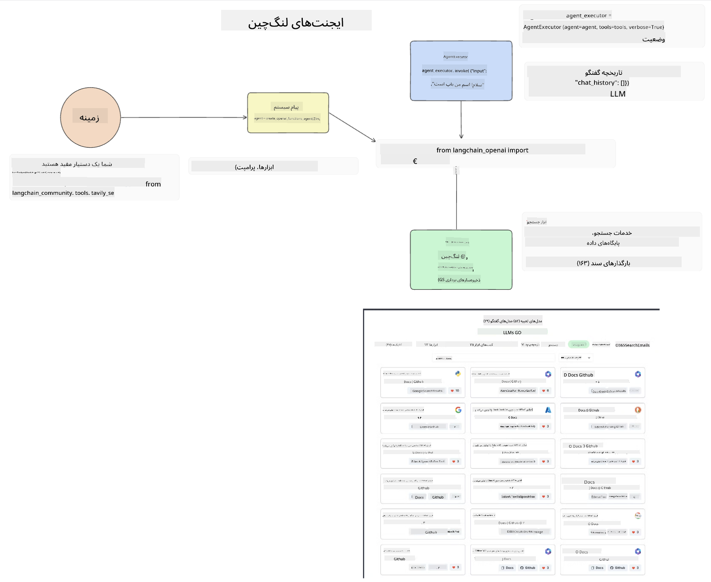
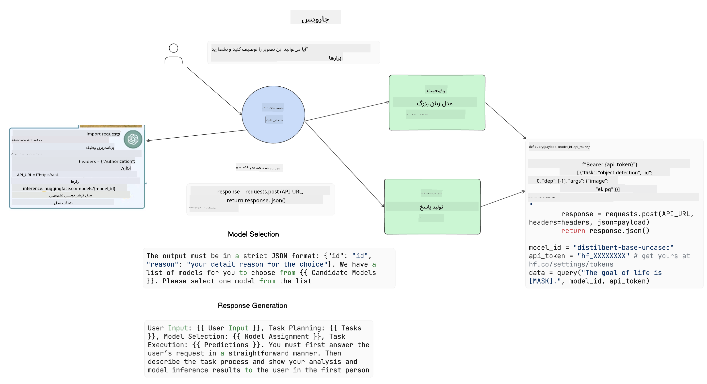

<!--
CO_OP_TRANSLATOR_METADATA:
{
  "original_hash": "11f03c81f190d9cbafd0f977dcbede6c",
  "translation_date": "2025-07-09T17:19:09+00:00",
  "source_file": "17-ai-agents/README.md",
  "language_code": "fa"
}
-->
[](https://aka.ms/gen-ai-lesson17-gh?WT.mc_id=academic-105485-koreyst)

## مقدمه

عامل‌های هوش مصنوعی (AI Agents) یک پیشرفت هیجان‌انگیز در حوزه هوش مصنوعی مولد هستند که به مدل‌های زبان بزرگ (LLMs) این امکان را می‌دهند تا از دستیاران ساده به عامل‌هایی تبدیل شوند که قادر به انجام اقدامات مستقل هستند. چارچوب‌های عامل هوش مصنوعی به توسعه‌دهندگان اجازه می‌دهند برنامه‌هایی بسازند که به مدل‌های زبان بزرگ دسترسی به ابزارها و مدیریت وضعیت بدهند. این چارچوب‌ها همچنین دید بهتری فراهم می‌کنند تا کاربران و توسعه‌دهندگان بتوانند اقدامات برنامه‌ریزی شده توسط مدل‌ها را رصد کنند و بدین ترتیب مدیریت تجربه بهبود یابد.

در این درس به موضوعات زیر پرداخته خواهد شد:

- درک اینکه عامل هوش مصنوعی چیست - دقیقاً عامل هوش مصنوعی به چه معناست؟
- بررسی چهار چارچوب مختلف عامل هوش مصنوعی - چه چیزی آن‌ها را متمایز می‌کند؟
- کاربرد این عامل‌ها در موارد استفاده مختلف - چه زمانی باید از عامل‌های هوش مصنوعی استفاده کنیم؟

## اهداف یادگیری

پس از گذراندن این درس، شما قادر خواهید بود:

- توضیح دهید عامل‌های هوش مصنوعی چیستند و چگونه می‌توان از آن‌ها استفاده کرد.
- تفاوت‌های بین برخی از چارچوب‌های محبوب عامل هوش مصنوعی را درک کنید و بدانید چگونه با هم تفاوت دارند.
- بفهمید عامل‌های هوش مصنوعی چگونه کار می‌کنند تا بتوانید برنامه‌هایی با استفاده از آن‌ها بسازید.

## عامل‌های هوش مصنوعی چیستند؟

عامل‌های هوش مصنوعی حوزه‌ای بسیار هیجان‌انگیز در دنیای هوش مصنوعی مولد هستند. این هیجان گاهی باعث سردرگمی در اصطلاحات و کاربردهای آن‌ها می‌شود. برای ساده‌سازی و پوشش بیشتر ابزارهایی که به عنوان عامل هوش مصنوعی شناخته می‌شوند، ما از این تعریف استفاده می‌کنیم:

عامل‌های هوش مصنوعی به مدل‌های زبان بزرگ (LLMs) اجازه می‌دهند با دسترسی به **وضعیت** و **ابزارها**، وظایف را انجام دهند.


اجازه دهید این اصطلاحات را تعریف کنیم:

**مدل‌های زبان بزرگ** - این‌ها مدل‌هایی هستند که در طول این دوره به آن‌ها اشاره شده است مانند GPT-3.5، GPT-4، Llama-2 و غیره.

**وضعیت** - به زمینه‌ای اشاره دارد که مدل زبان بزرگ در آن کار می‌کند. مدل از زمینه اقدامات گذشته و زمینه فعلی استفاده می‌کند تا تصمیم‌گیری برای اقدامات بعدی را هدایت کند. چارچوب‌های عامل هوش مصنوعی به توسعه‌دهندگان کمک می‌کنند تا این زمینه را راحت‌تر مدیریت کنند.

**ابزارها** - برای انجام وظیفه‌ای که کاربر درخواست کرده و مدل برنامه‌ریزی کرده است، مدل به ابزارهایی نیاز دارد. برخی نمونه‌های ابزار می‌توانند پایگاه داده، API، برنامه خارجی یا حتی یک مدل زبان بزرگ دیگر باشند!

امیدواریم این تعاریف پایه خوبی برای ادامه کار به شما بدهند تا ببینیم چگونه این‌ها پیاده‌سازی می‌شوند. بیایید چند چارچوب مختلف عامل هوش مصنوعی را بررسی کنیم:

## عامل‌های LangChain

[عامل‌های LangChain](https://python.langchain.com/docs/how_to/#agents?WT.mc_id=academic-105485-koreyst) پیاده‌سازی تعاریفی است که در بالا ارائه دادیم.

برای مدیریت **وضعیت**، از تابع داخلی به نام `AgentExecutor` استفاده می‌کند. این تابع `agent` تعریف شده و `tools` در دسترس را می‌پذیرد.

`AgentExecutor` همچنین تاریخچه چت را ذخیره می‌کند تا زمینه گفتگو را فراهم کند.



LangChain یک [فهرست ابزارها](https://integrations.langchain.com/tools?WT.mc_id=academic-105485-koreyst) ارائه می‌دهد که می‌توان آن‌ها را در برنامه خود وارد کرد و مدل زبان بزرگ به آن‌ها دسترسی پیدا کند. این ابزارها توسط جامعه و تیم LangChain ساخته شده‌اند.

سپس می‌توانید این ابزارها را تعریف کرده و به `AgentExecutor` ارسال کنید.

دیدپذیری یکی دیگر از جنبه‌های مهم هنگام صحبت درباره عامل‌های هوش مصنوعی است. برای توسعه‌دهندگان برنامه مهم است که بفهمند مدل از کدام ابزار استفاده می‌کند و چرا. برای این منظور، تیم LangChain ابزار LangSmith را توسعه داده است.

## AutoGen

چارچوب عامل هوش مصنوعی بعدی که بررسی می‌کنیم [AutoGen](https://microsoft.github.io/autogen/?WT.mc_id=academic-105485-koreyst) است. تمرکز اصلی AutoGen بر مکالمات است. عامل‌ها هم **قابل گفتگو** و هم **قابل سفارشی‌سازی** هستند.

**قابل گفتگو -** مدل‌های زبان بزرگ می‌توانند مکالمه‌ای را با مدل زبان بزرگ دیگر شروع و ادامه دهند تا یک وظیفه را انجام دهند. این کار با ایجاد `AssistantAgents` و دادن یک پیام سیستمی خاص به آن‌ها انجام می‌شود.

```python

autogen.AssistantAgent( name="Coder", llm_config=llm_config, ) pm = autogen.AssistantAgent( name="Product_manager", system_message="Creative in software product ideas.", llm_config=llm_config, )

```

**قابل سفارشی‌سازی** - عامل‌ها می‌توانند نه تنها به عنوان مدل زبان بزرگ بلکه به عنوان کاربر یا ابزار تعریف شوند. به عنوان توسعه‌دهنده، می‌توانید یک `UserProxyAgent` تعریف کنید که مسئول تعامل با کاربر برای دریافت بازخورد در انجام وظیفه است. این بازخورد می‌تواند اجرای وظیفه را ادامه دهد یا متوقف کند.

```python
user_proxy = UserProxyAgent(name="user_proxy")
```

### وضعیت و ابزارها

برای تغییر و مدیریت وضعیت، یک عامل دستیار کد پایتون تولید می‌کند تا وظیفه را انجام دهد.

در اینجا مثالی از این فرآیند آمده است:


#### مدل زبان بزرگ با پیام سیستمی تعریف شده

```python
system_message="For weather related tasks, only use the functions you have been provided with. Reply TERMINATE when the task is done."
```

این پیام سیستمی به این مدل خاص می‌گوید کدام توابع برای انجام وظیفه‌اش مرتبط هستند. به یاد داشته باشید، با AutoGen می‌توانید چندین `AssistantAgents` با پیام‌های سیستمی مختلف داشته باشید.

#### گفتگو توسط کاربر آغاز می‌شود

```python
user_proxy.initiate_chat( chatbot, message="I am planning a trip to NYC next week, can you help me pick out what to wear? ", )

```

این پیام از user_proxy (انسان) فرآیند عامل را برای بررسی توابع ممکن که باید اجرا شوند، شروع می‌کند.

#### تابع اجرا می‌شود

```bash
chatbot (to user_proxy):

***** Suggested tool Call: get_weather ***** Arguments: {"location":"New York City, NY","time_periond:"7","temperature_unit":"Celsius"} ******************************************************** --------------------------------------------------------------------------------

>>>>>>>> EXECUTING FUNCTION get_weather... user_proxy (to chatbot): ***** Response from calling function "get_weather" ***** 112.22727272727272 EUR ****************************************************************

```

پس از پردازش چت اولیه، عامل ابزار پیشنهادی برای فراخوانی را ارسال می‌کند. در این مورد، تابعی به نام `get_weather` است. بسته به پیکربندی شما، این تابع می‌تواند به صورت خودکار اجرا و توسط عامل خوانده شود یا بر اساس ورودی کاربر اجرا شود.

می‌توانید فهرستی از [نمونه‌های کد AutoGen](https://microsoft.github.io/autogen/docs/Examples/?WT.mc_id=academic-105485-koreyst) را برای آشنایی بیشتر با نحوه شروع ساخت برنامه‌ها مشاهده کنید.

## Taskweaver

چارچوب عامل بعدی که بررسی می‌کنیم [Taskweaver](https://microsoft.github.io/TaskWeaver/?WT.mc_id=academic-105485-koreyst) است. این چارچوب به عنوان یک عامل "کد-محور" شناخته می‌شود چون به جای کار کردن صرف با `strings`، می‌تواند با DataFrameها در پایتون کار کند. این ویژگی برای تحلیل داده و وظایف تولیدی بسیار مفید است. این می‌تواند شامل ایجاد نمودارها و گراف‌ها یا تولید اعداد تصادفی باشد.

### وضعیت و ابزارها

برای مدیریت وضعیت گفتگو، TaskWeaver از مفهوم `Planner` استفاده می‌کند. `Planner` یک مدل زبان بزرگ است که درخواست‌های کاربران را دریافت کرده و وظایفی که باید برای انجام آن درخواست تکمیل شوند را نقشه‌برداری می‌کند.

برای انجام وظایف، `Planner` به مجموعه‌ای از ابزارها به نام `Plugins` دسترسی دارد. این‌ها می‌توانند کلاس‌های پایتون یا مفسر کد عمومی باشند. این پلاگین‌ها به صورت embedding ذخیره می‌شوند تا مدل زبان بزرگ بتواند بهتر پلاگین مناسب را جستجو کند.


در اینجا مثالی از یک پلاگین برای تشخیص ناهنجاری آمده است:

```python
class AnomalyDetectionPlugin(Plugin): def __call__(self, df: pd.DataFrame, time_col_name: str, value_col_name: str):
```

کد قبل از اجرا بررسی می‌شود. ویژگی دیگر برای مدیریت زمینه در Taskweaver، `experience` است. تجربه اجازه می‌دهد زمینه یک گفتگو به صورت بلندمدت در یک فایل YAML ذخیره شود. این می‌تواند طوری پیکربندی شود که مدل زبان بزرگ با گذشت زمان در وظایف خاصی که در معرض گفتگوهای قبلی قرار گرفته، بهتر عمل کند.

## JARVIS

آخرین چارچوب عاملی که بررسی می‌کنیم [JARVIS](https://github.com/microsoft/JARVIS?tab=readme-ov-file?WT.mc_id=academic-105485-koreyst) است. ویژگی منحصر به فرد JARVIS این است که از یک مدل زبان بزرگ برای مدیریت `وضعیت` گفتگو استفاده می‌کند و `ابزارها` مدل‌های هوش مصنوعی دیگر هستند. هر یک از این مدل‌های هوش مصنوعی مدل‌های تخصصی هستند که وظایف خاصی مانند تشخیص اشیاء، رونویسی یا توصیف تصویر را انجام می‌دهند.



مدل زبان بزرگ، که یک مدل عمومی است، درخواست کاربر را دریافت کرده و وظیفه خاص و هر آرگومان/داده‌ای که برای انجام آن لازم است را شناسایی می‌کند.

```python
[{"task": "object-detection", "id": 0, "dep": [-1], "args": {"image": "e1.jpg" }}]
```

سپس مدل زبان بزرگ درخواست را به شکلی قالب‌بندی می‌کند که مدل تخصصی هوش مصنوعی بتواند آن را تفسیر کند، مانند JSON. پس از اینکه مدل هوش مصنوعی پیش‌بینی خود را بر اساس وظیفه بازگرداند، مدل زبان بزرگ پاسخ را دریافت می‌کند.

اگر برای انجام وظیفه به چند مدل نیاز باشد، مدل زبان بزرگ پاسخ آن‌ها را نیز تفسیر می‌کند و سپس آن‌ها را ترکیب کرده و پاسخ نهایی را به کاربر ارائه می‌دهد.

مثال زیر نشان می‌دهد که وقتی کاربر درخواست توصیف و شمارش اشیاء در یک تصویر را دارد، چگونه این فرآیند انجام می‌شود:

## تمرین

برای ادامه یادگیری عامل‌های هوش مصنوعی می‌توانید با AutoGen بسازید:

- برنامه‌ای که یک جلسه کاری شبیه‌سازی شده با بخش‌های مختلف یک استارتاپ آموزشی را اجرا کند.
- پیام‌های سیستمی ایجاد کنید که مدل‌های زبان بزرگ را در درک شخصیت‌ها و اولویت‌های مختلف راهنمایی کند و به کاربر امکان دهد ایده محصول جدیدی را ارائه دهد.
- سپس مدل زبان بزرگ باید سوالات پیگیری از هر بخش تولید کند تا ایده محصول و ارائه را بهبود بخشد.

## یادگیری اینجا متوقف نمی‌شود، سفر را ادامه دهید

پس از اتمام این درس، مجموعه [یادگیری هوش مصنوعی مولد](https://aka.ms/genai-collection?WT.mc_id=academic-105485-koreyst) ما را بررسی کنید تا دانش خود در زمینه هوش مصنوعی مولد را ارتقا دهید!

**سلب مسئولیت**:  
این سند با استفاده از سرویس ترجمه هوش مصنوعی [Co-op Translator](https://github.com/Azure/co-op-translator) ترجمه شده است. در حالی که ما در تلاش برای دقت هستیم، لطفاً توجه داشته باشید که ترجمه‌های خودکار ممکن است حاوی خطاها یا نواقصی باشند. سند اصلی به زبان بومی خود باید به عنوان منبع معتبر در نظر گرفته شود. برای اطلاعات حیاتی، ترجمه حرفه‌ای انسانی توصیه می‌شود. ما مسئول هیچ گونه سوءتفاهم یا تفسیر نادرستی که از استفاده این ترجمه ناشی شود، نیستیم.