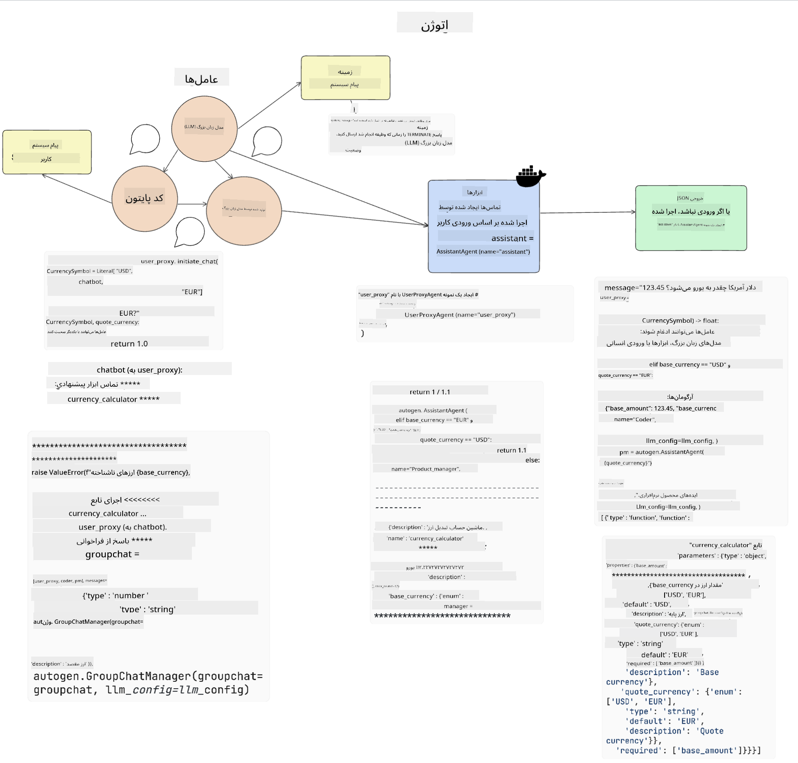

<!--
CO_OP_TRANSLATOR_METADATA:
{
  "original_hash": "8e8d1f6a63da606af7176a87ff8e92b6",
  "translation_date": "2025-10-17T23:15:40+00:00",
  "source_file": "17-ai-agents/README.md",
  "language_code": "fa"
}
-->
[](https://youtu.be/yAXVW-lUINc?si=bOtW9nL6jc3XJgOM)

## مقدمه

عامل‌های هوش مصنوعی یک پیشرفت هیجان‌انگیز در زمینه هوش مصنوعی تولیدی هستند که به مدل‌های زبانی بزرگ (LLMs) امکان می‌دهند از دستیاران به عامل‌هایی تبدیل شوند که قادر به انجام اقدامات هستند. چارچوب‌های عامل هوش مصنوعی به توسعه‌دهندگان این امکان را می‌دهند که برنامه‌هایی ایجاد کنند که به LLM‌ها دسترسی به ابزارها و مدیریت وضعیت را فراهم کنند. این چارچوب‌ها همچنین دید بیشتری ایجاد می‌کنند و به کاربران و توسعه‌دهندگان اجازه می‌دهند اقدامات برنامه‌ریزی‌شده توسط LLM‌ها را نظارت کنند و تجربه مدیریت را بهبود بخشند.

این درس به موضوعات زیر می‌پردازد:

- درک اینکه عامل هوش مصنوعی چیست - عامل هوش مصنوعی دقیقاً چیست؟
- بررسی چهار چارچوب مختلف عامل هوش مصنوعی - چه چیزی آن‌ها را منحصر به فرد می‌کند؟
- استفاده از این عامل‌های هوش مصنوعی در موارد کاربرد مختلف - چه زمانی باید از عامل‌های هوش مصنوعی استفاده کنیم؟

## اهداف یادگیری

پس از گذراندن این درس، شما قادر خواهید بود:

- توضیح دهید که عامل‌های هوش مصنوعی چه هستند و چگونه می‌توان از آن‌ها استفاده کرد.
- تفاوت‌های بین برخی از چارچوب‌های محبوب عامل هوش مصنوعی را درک کنید و بدانید چگونه با یکدیگر متفاوت هستند.
- بفهمید عامل‌های هوش مصنوعی چگونه کار می‌کنند تا بتوانید با آن‌ها برنامه بسازید.

## عامل‌های هوش مصنوعی چیستند؟

عامل‌های هوش مصنوعی یک حوزه بسیار هیجان‌انگیز در دنیای هوش مصنوعی تولیدی هستند. با این هیجان، گاهی اوقات سردرگمی در مورد اصطلاحات و کاربرد آن‌ها نیز به وجود می‌آید. برای ساده نگه داشتن موضوع و شامل کردن اکثر ابزارهایی که به عامل‌های هوش مصنوعی اشاره دارند، ما از این تعریف استفاده می‌کنیم:

عامل‌های هوش مصنوعی به مدل‌های زبانی بزرگ (LLMs) امکان می‌دهند وظایف را با دسترسی به **وضعیت** و **ابزارها** انجام دهند.


بیایید این اصطلاحات را تعریف کنیم:

**مدل‌های زبانی بزرگ** - این مدل‌ها در طول این دوره به آن‌ها اشاره شده است، مانند GPT-3.5، GPT-4، Llama-2 و غیره.

**وضعیت** - این به زمینه‌ای اشاره دارد که LLM در آن کار می‌کند. LLM از زمینه اقدامات گذشته و زمینه فعلی استفاده می‌کند و تصمیم‌گیری‌های بعدی خود را هدایت می‌کند. چارچوب‌های عامل هوش مصنوعی به توسعه‌دهندگان کمک می‌کنند این زمینه را راحت‌تر مدیریت کنند.

**ابزارها** - برای انجام وظیفه‌ای که کاربر درخواست کرده و LLM برنامه‌ریزی کرده است، LLM نیاز به دسترسی به ابزارها دارد. برخی از نمونه‌های ابزارها می‌توانند یک پایگاه داده، یک API، یک برنامه خارجی یا حتی یک LLM دیگر باشند!

این تعاریف امیدواریم به شما پایه‌ای خوب برای ادامه کار بدهند، همانطور که به بررسی نحوه پیاده‌سازی آن‌ها می‌پردازیم. بیایید چند چارچوب مختلف عامل هوش مصنوعی را بررسی کنیم:

## عامل‌های LangChain

[عامل‌های LangChain](https://python.langchain.com/docs/how_to/#agents?WT.mc_id=academic-105485-koreyst) یک پیاده‌سازی از تعاریفی است که در بالا ارائه شد.

برای مدیریت **وضعیت**، از یک تابع داخلی به نام `AgentExecutor` استفاده می‌کند. این تابع عامل تعریف‌شده و ابزارهای موجود برای آن را می‌پذیرد.

`AgentExecutor` همچنین تاریخچه چت را ذخیره می‌کند تا زمینه چت را فراهم کند.


LangChain یک [کاتالوگ ابزارها](https://integrations.langchain.com/tools?WT.mc_id=academic-105485-koreyst) ارائه می‌دهد که می‌توان آن‌ها را به برنامه شما وارد کرد تا LLM به آن‌ها دسترسی پیدا کند. این ابزارها توسط جامعه و تیم LangChain ساخته شده‌اند.

شما می‌توانید این ابزارها را تعریف کرده و به `AgentExecutor` منتقل کنید.

دیدپذیری جنبه مهم دیگری است که هنگام صحبت درباره عامل‌های هوش مصنوعی باید در نظر گرفت. برای توسعه‌دهندگان برنامه مهم است که بفهمند کدام ابزار توسط LLM استفاده می‌شود و چرا. برای این منظور، تیم LangChain ابزار LangSmith را توسعه داده است.

## AutoGen

چارچوب بعدی عامل هوش مصنوعی که بررسی خواهیم کرد [AutoGen](https://microsoft.github.io/autogen/?WT.mc_id=academic-105485-koreyst) است. تمرکز اصلی AutoGen بر مکالمات است. عامل‌ها هم **قابل مکالمه** و هم **قابل تنظیم** هستند.

**قابل مکالمه -** LLM‌ها می‌توانند یک مکالمه را با یک LLM دیگر شروع کرده و ادامه دهند تا یک وظیفه را انجام دهند. این کار با ایجاد `AssistantAgents` و دادن یک پیام سیستمی خاص به آن‌ها انجام می‌شود.

```python

autogen.AssistantAgent( name="Coder", llm_config=llm_config, ) pm = autogen.AssistantAgent( name="Product_manager", system_message="Creative in software product ideas.", llm_config=llm_config, )

```

**قابل تنظیم** - عامل‌ها می‌توانند نه تنها به عنوان LLM‌ها بلکه به عنوان یک کاربر یا ابزار تعریف شوند. به عنوان یک توسعه‌دهنده، شما می‌توانید یک `UserProxyAgent` تعریف کنید که مسئول تعامل با کاربر برای بازخورد در انجام وظیفه است. این بازخورد می‌تواند اجرای وظیفه را ادامه دهد یا متوقف کند.

```python
user_proxy = UserProxyAgent(name="user_proxy")
```

### وضعیت و ابزارها

برای تغییر و مدیریت وضعیت، یک عامل دستیار کد پایتون تولید می‌کند تا وظیفه را انجام دهد.

در اینجا یک مثال از فرآیند آورده شده است:



#### تعریف LLM با پیام سیستمی

```python
system_message="For weather related tasks, only use the functions you have been provided with. Reply TERMINATE when the task is done."
```

این پیام سیستمی این LLM خاص را هدایت می‌کند که کدام توابع برای وظیفه آن مرتبط هستند. به یاد داشته باشید، با AutoGen می‌توانید چندین AssistantAgents تعریف‌شده با پیام‌های سیستمی مختلف داشته باشید.

#### مکالمه توسط کاربر آغاز می‌شود

```python
user_proxy.initiate_chat( chatbot, message="I am planning a trip to NYC next week, can you help me pick out what to wear? ", )

```

این پیام از user_proxy (انسان) چیزی است که فرآیند عامل را برای بررسی توابع ممکن که باید اجرا شود آغاز می‌کند.

#### تابع اجرا می‌شود

```bash
chatbot (to user_proxy):

***** Suggested tool Call: get_weather ***** Arguments: {"location":"New York City, NY","time_periond:"7","temperature_unit":"Celsius"} ******************************************************** --------------------------------------------------------------------------------

>>>>>>>> EXECUTING FUNCTION get_weather... user_proxy (to chatbot): ***** Response from calling function "get_weather" ***** 112.22727272727272 EUR ****************************************************************

```

پس از پردازش مکالمه اولیه، عامل ابزار پیشنهادی برای فراخوانی را ارسال می‌کند. در این مورد، یک تابع به نام `get_weather` است. بسته به پیکربندی شما، این تابع می‌تواند به صورت خودکار اجرا شده و توسط عامل خوانده شود یا بر اساس ورودی کاربر اجرا شود.

شما می‌توانید لیستی از [نمونه‌های کد AutoGen](https://microsoft.github.io/autogen/docs/Examples/?WT.mc_id=academic-105485-koreyst) را پیدا کنید تا بیشتر با نحوه شروع ساخت آشنا شوید.

## Taskweaver

چارچوب بعدی عامل که بررسی خواهیم کرد [Taskweaver](https://microsoft.github.io/TaskWeaver/?WT.mc_id=academic-105485-koreyst) است. این چارچوب به عنوان یک عامل "کد-اول" شناخته می‌شود زیرا به جای کار با `strings`، می‌تواند با DataFrames در پایتون کار کند. این ویژگی برای وظایف تحلیل داده و تولید بسیار مفید است. این وظایف می‌توانند شامل ایجاد نمودارها و چارت‌ها یا تولید اعداد تصادفی باشند.

### وضعیت و ابزارها

برای مدیریت وضعیت مکالمه، TaskWeaver از مفهوم `Planner` استفاده می‌کند. `Planner` یک LLM است که درخواست کاربر را دریافت کرده و وظایفی که باید برای انجام این درخواست انجام شود را ترسیم می‌کند.

برای انجام وظایف، `Planner` به مجموعه‌ای از ابزارها به نام `Plugins` دسترسی دارد. این ابزارها می‌توانند کلاس‌های پایتون یا یک مفسر کد عمومی باشند. این پلاگین‌ها به صورت embeddings ذخیره می‌شوند تا LLM بتواند بهتر پلاگین مناسب را جستجو کند.


در اینجا یک مثال از یک پلاگین برای مدیریت تشخیص ناهنجاری آورده شده است:

```python
class AnomalyDetectionPlugin(Plugin): def __call__(self, df: pd.DataFrame, time_col_name: str, value_col_name: str):
```

کد قبل از اجرا تأیید می‌شود. ویژگی دیگری برای مدیریت زمینه در Taskweaver، `تجربه` است. تجربه اجازه می‌دهد زمینه یک مکالمه در طولانی‌مدت در یک فایل YAML ذخیره شود. این می‌تواند پیکربندی شود تا LLM در طول زمان در وظایف خاصی که در معرض مکالمات قبلی قرار گرفته است، بهبود یابد.

## JARVIS

آخرین چارچوب عاملی که بررسی خواهیم کرد [JARVIS](https://github.com/microsoft/JARVIS?tab=readme-ov-file?WT.mc_id=academic-105485-koreyst) است. چیزی که JARVIS را منحصر به فرد می‌کند این است که از یک LLM برای مدیریت `وضعیت` مکالمه استفاده می‌کند و `ابزارها` مدل‌های هوش مصنوعی دیگر هستند. هر یک از مدل‌های هوش مصنوعی مدل‌های تخصصی هستند که وظایف خاصی مانند تشخیص اشیاء، تبدیل متن به گفتار یا توضیح تصاویر را انجام می‌دهند.


LLM، به عنوان یک مدل عمومی، درخواست کاربر را دریافت کرده و وظیفه خاص و هر آرگومان/داده‌ای که برای انجام وظیفه لازم است را شناسایی می‌کند.

```python
[{"task": "object-detection", "id": 0, "dep": [-1], "args": {"image": "e1.jpg" }}]
```

سپس LLM درخواست را به شکلی که مدل هوش مصنوعی تخصصی بتواند تفسیر کند، مانند JSON، قالب‌بندی می‌کند. پس از اینکه مدل هوش مصنوعی پیش‌بینی خود را بر اساس وظیفه بازگرداند، LLM پاسخ را دریافت می‌کند.

اگر برای انجام وظیفه به چندین مدل نیاز باشد، LLM پاسخ‌های آن مدل‌ها را نیز تفسیر کرده و قبل از ارائه پاسخ نهایی به کاربر، آن‌ها را ترکیب می‌کند.

مثال زیر نشان می‌دهد که این فرآیند چگونه کار می‌کند وقتی کاربر درخواست توضیح و شمارش اشیاء در یک تصویر را دارد:

## تکلیف

برای ادامه یادگیری عامل‌های هوش مصنوعی می‌توانید با AutoGen بسازید:

- یک برنامه که یک جلسه کاری را با بخش‌های مختلف یک استارتاپ آموزشی شبیه‌سازی می‌کند.
- پیام‌های سیستمی ایجاد کنید که LLM‌ها را در درک شخصیت‌ها و اولویت‌های مختلف هدایت کند و به کاربر امکان دهد یک ایده محصول جدید را ارائه دهد.
- سپس LLM باید سوالات پیگیری از هر بخش ایجاد کند تا ارائه و ایده محصول را بهبود بخشد.

## یادگیری در اینجا متوقف نمی‌شود، سفر را ادامه دهید

پس از تکمیل این درس، مجموعه [یادگیری هوش مصنوعی تولیدی](https://aka.ms/genai-collection?WT.mc_id=academic-105485-koreyst) ما را بررسی کنید تا دانش خود را در زمینه هوش مصنوعی تولیدی ارتقا دهید!

---

**سلب مسئولیت**:  
این سند با استفاده از سرویس ترجمه هوش مصنوعی [Co-op Translator](https://github.com/Azure/co-op-translator) ترجمه شده است. در حالی که ما تلاش می‌کنیم دقت را حفظ کنیم، لطفاً توجه داشته باشید که ترجمه‌های خودکار ممکن است شامل خطاها یا نادرستی‌ها باشند. سند اصلی به زبان اصلی آن باید به عنوان منبع معتبر در نظر گرفته شود. برای اطلاعات حیاتی، ترجمه حرفه‌ای انسانی توصیه می‌شود. ما مسئولیتی در قبال سوء تفاهم‌ها یا تفسیرهای نادرست ناشی از استفاده از این ترجمه نداریم.