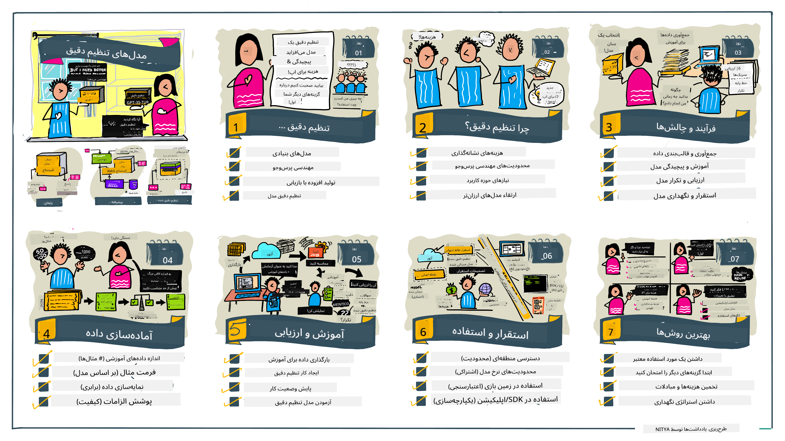

<!--
CO_OP_TRANSLATOR_METADATA:
{
  "original_hash": "68664f7e754a892ae1d8d5e2b7bd2081",
  "translation_date": "2025-07-09T17:35:58+00:00",
  "source_file": "18-fine-tuning/README.md",
  "language_code": "fa"
}
-->

# تنظیم دقیق مدل زبان بزرگ شما

استفاده از مدل‌های زبان بزرگ برای ساخت برنامه‌های هوش مصنوعی مولد، چالش‌های جدیدی به همراه دارد. یکی از مسائل کلیدی، تضمین کیفیت پاسخ‌ها (دقت و مرتبط بودن) در محتوای تولید شده توسط مدل برای درخواست کاربر است. در درس‌های قبلی، تکنیک‌هایی مانند مهندسی پرامپت و تولید تقویت‌شده با بازیابی را بررسی کردیم که سعی می‌کنند این مشکل را با _تغییر ورودی پرامپت_ به مدل موجود حل کنند.

در درس امروز، به تکنیک سوم یعنی **تنظیم دقیق** می‌پردازیم که تلاش می‌کند این چالش را با _آموزش مجدد خود مدل_ با داده‌های اضافی برطرف کند. بیایید به جزئیات بپردازیم.

## اهداف یادگیری

این درس مفهوم تنظیم دقیق برای مدل‌های زبان پیش‌آموزش‌دیده را معرفی می‌کند، مزایا و چالش‌های این رویکرد را بررسی می‌کند و راهنمایی‌هایی درباره زمان و نحوه استفاده از تنظیم دقیق برای بهبود عملکرد مدل‌های هوش مصنوعی مولد شما ارائه می‌دهد.

در پایان این درس، باید بتوانید به سوالات زیر پاسخ دهید:

- تنظیم دقیق برای مدل‌های زبان چیست؟
- چه زمانی و چرا تنظیم دقیق مفید است؟
- چگونه می‌توانم یک مدل پیش‌آموزش‌دیده را تنظیم دقیق کنم؟
- محدودیت‌های تنظیم دقیق چیست؟

آماده‌اید؟ بیایید شروع کنیم.

## راهنمای مصور

می‌خواهید قبل از شروع، تصویر کلی آنچه را که پوشش خواهیم داد ببینید؟ این راهنمای مصور را بررسی کنید که مسیر یادگیری این درس را از یادگیری مفاهیم اصلی و انگیزه تنظیم دقیق تا درک فرآیند و بهترین روش‌های اجرای تنظیم دقیق شرح می‌دهد. این موضوع جذابی برای کاوش است، پس فراموش نکنید صفحه [Resources](./RESOURCES.md?WT.mc_id=academic-105485-koreyst) را برای لینک‌های بیشتر که به یادگیری خودگردان شما کمک می‌کند، ببینید!

## تنظیم دقیق برای مدل‌های زبان چیست؟

به طور تعریف، مدل‌های زبان بزرگ بر روی حجم زیادی از متن از منابع متنوع از جمله اینترنت _پیش‌آموزش_ شده‌اند. همانطور که در درس‌های قبلی آموختیم، برای بهبود کیفیت پاسخ‌های مدل به سوالات کاربر ("پرامپت‌ها") به تکنیک‌هایی مانند _مهندسی پرامپت_ و _تولید تقویت‌شده با بازیابی_ نیاز داریم.

یک تکنیک محبوب مهندسی پرامپت، دادن راهنمایی بیشتر به مدل درباره آنچه در پاسخ انتظار می‌رود است، یا با ارائه _دستورالعمل‌ها_ (راهنمایی صریح) یا _دادن چند مثال_ (راهنمایی ضمنی). این روش به عنوان _یادگیری چندنمونه‌ای_ شناخته می‌شود اما دو محدودیت دارد:

- محدودیت تعداد توکن‌های مدل می‌تواند تعداد مثال‌هایی که می‌توانید بدهید را محدود کند و اثربخشی را کاهش دهد.
- هزینه توکن‌های مدل می‌تواند افزودن مثال به هر پرامپت را پرهزینه کند و انعطاف‌پذیری را محدود کند.

تنظیم دقیق یک روش رایج در سیستم‌های یادگیری ماشین است که در آن یک مدل پیش‌آموزش‌دیده را با داده‌های جدید آموزش مجدد می‌دهیم تا عملکرد آن را در یک وظیفه خاص بهبود دهیم. در زمینه مدل‌های زبان، می‌توانیم مدل پیش‌آموزش‌دیده را _با مجموعه‌ای منتخب از مثال‌ها برای یک وظیفه یا حوزه کاربردی خاص_ تنظیم دقیق کنیم تا یک **مدل سفارشی** ایجاد کنیم که ممکن است برای آن وظیفه یا حوزه خاص دقیق‌تر و مرتبط‌تر باشد. یک مزیت جانبی تنظیم دقیق این است که می‌تواند تعداد مثال‌های مورد نیاز برای یادگیری چندنمونه‌ای را کاهش دهد - که باعث کاهش مصرف توکن و هزینه‌های مرتبط می‌شود.

## چه زمانی و چرا باید مدل‌ها را تنظیم دقیق کنیم؟

در _این_ زمینه، وقتی درباره تنظیم دقیق صحبت می‌کنیم، منظورمان تنظیم دقیق **نظارت‌شده** است که در آن آموزش مجدد با **افزودن داده‌های جدید** انجام می‌شود که بخشی از مجموعه داده اصلی آموزش نبوده‌اند. این با رویکرد تنظیم دقیق بدون نظارت متفاوت است که در آن مدل روی داده‌های اصلی اما با ابرپارامترهای متفاوت آموزش مجدد می‌شود.

نکته کلیدی که باید به خاطر بسپارید این است که تنظیم دقیق یک تکنیک پیشرفته است که نیاز به سطحی از تخصص دارد تا نتایج مطلوب حاصل شود. اگر به درستی انجام نشود، ممکن است بهبودهای مورد انتظار را نداشته باشد و حتی عملکرد مدل را در حوزه هدف شما کاهش دهد.

پس، قبل از اینکه یاد بگیرید "چگونه" مدل‌های زبان را تنظیم دقیق کنید، باید بدانید "چرا" باید این مسیر را انتخاب کنید و "چه زمانی" فرآیند تنظیم دقیق را شروع کنید. با پرسیدن این سوالات از خود شروع کنید:

- **مورد استفاده**: مورد استفاده شما برای تنظیم دقیق چیست؟ کدام جنبه از مدل پیش‌آموزش‌دیده فعلی را می‌خواهید بهبود دهید؟
- **گزینه‌های جایگزین**: آیا _تکنیک‌های دیگری_ را برای رسیدن به نتایج مطلوب امتحان کرده‌اید؟ از آن‌ها برای ایجاد یک خط مبنا برای مقایسه استفاده کنید.
  - مهندسی پرامپت: تکنیک‌هایی مانند یادگیری چندنمونه‌ای با مثال‌های پاسخ‌های مرتبط را امتحان کنید. کیفیت پاسخ‌ها را ارزیابی کنید.
  - تولید تقویت‌شده با بازیابی: پرامپت‌ها را با نتایج جستجو در داده‌های خود تقویت کنید. کیفیت پاسخ‌ها را ارزیابی کنید.
- **هزینه‌ها**: آیا هزینه‌های تنظیم دقیق را شناسایی کرده‌اید؟
  - قابلیت تنظیم - آیا مدل پیش‌آموزش‌دیده برای تنظیم دقیق در دسترس است؟
  - تلاش - برای آماده‌سازی داده‌های آموزشی، ارزیابی و بهبود مدل.
  - محاسبات - برای اجرای کارهای تنظیم دقیق و استقرار مدل تنظیم شده
  - داده - دسترسی به مثال‌های با کیفیت کافی برای تاثیر تنظیم دقیق
- **مزایا**: آیا مزایای تنظیم دقیق را تایید کرده‌اید؟
  - کیفیت - آیا مدل تنظیم شده بهتر از خط مبنا عمل کرده است؟
  - هزینه - آیا با ساده‌سازی پرامپت‌ها مصرف توکن را کاهش می‌دهد؟
  - قابلیت توسعه - آیا می‌توانید مدل پایه را برای حوزه‌های جدید بازاستفاده کنید؟

با پاسخ به این سوالات، باید بتوانید تصمیم بگیرید که آیا تنظیم دقیق رویکرد مناسبی برای مورد استفاده شما است یا خیر. ایده‌آل این است که این رویکرد فقط زمانی معتبر است که مزایا بیشتر از هزینه‌ها باشد. پس از تصمیم به ادامه، وقت آن است که درباره _چگونگی_ تنظیم دقیق مدل پیش‌آموزش‌دیده فکر کنید.

می‌خواهید بینش بیشتری درباره فرآیند تصمیم‌گیری به دست آورید؟ ویدئوی [To fine-tune or not to fine-tune](https://www.youtube.com/watch?v=0Jo-z-MFxJs) را ببینید.

## چگونه می‌توانیم یک مدل پیش‌آموزش‌دیده را تنظیم دقیق کنیم؟

برای تنظیم دقیق یک مدل پیش‌آموزش‌دیده، به موارد زیر نیاز دارید:

- یک مدل پیش‌آموزش‌دیده برای تنظیم دقیق
- یک مجموعه داده برای استفاده در تنظیم دقیق
- یک محیط آموزشی برای اجرای کار تنظیم دقیق
- یک محیط میزبانی برای استقرار مدل تنظیم شده

## تنظیم دقیق در عمل

منابع زیر آموزش‌های گام به گام را ارائه می‌دهند تا شما را در یک مثال واقعی با استفاده از یک مدل انتخاب شده و مجموعه داده منتخب راهنمایی کنند. برای کار با این آموزش‌ها، به یک حساب کاربری در ارائه‌دهنده مربوطه و دسترسی به مدل‌ها و مجموعه داده‌های مرتبط نیاز دارید.

| ارائه‌دهنده | آموزش                                                                                                                                                                       | توضیحات                                                                                                                                                                                                                                                                                                                                                                                                                        |
| ------------ | ------------------------------------------------------------------------------------------------------------------------------------------------------------------------------ | ---------------------------------------------------------------------------------------------------------------------------------------------------------------------------------------------------------------------------------------------------------------------------------------------------------------------------------------------------------------------------------------------------------------------------------- |
| OpenAI       | [چگونه مدل‌های چت را تنظیم دقیق کنیم](https://github.com/openai/openai-cookbook/blob/main/examples/How_to_finetune_chat_models.ipynb?WT.mc_id=academic-105485-koreyst)                | یاد بگیرید چگونه یک `gpt-35-turbo` را برای یک حوزه خاص ("دستیار دستور پخت") با آماده‌سازی داده‌های آموزشی، اجرای کار تنظیم دقیق و استفاده از مدل تنظیم شده برای استنتاج، تنظیم دقیق کنید.                                                                                                                                                                                                                                              |
| Azure OpenAI | [آموزش تنظیم دقیق GPT 3.5 Turbo](https://learn.microsoft.com/azure/ai-services/openai/tutorials/fine-tune?tabs=python-new%2Ccommand-line?WT.mc_id=academic-105485-koreyst) | یاد بگیرید چگونه یک مدل `gpt-35-turbo-0613` را **در Azure** با مراحل ایجاد و بارگذاری داده‌های آموزشی، اجرای کار تنظیم دقیق، استقرار و استفاده از مدل جدید تنظیم دقیق شده، آموزش دهید.                                                                                                                                                                                                                                                                 |
| Hugging Face | [تنظیم دقیق مدل‌های زبان بزرگ با Hugging Face](https://www.philschmid.de/fine-tune-llms-in-2024-with-trl?WT.mc_id=academic-105485-koreyst)                                               | این پست وبلاگی شما را در تنظیم دقیق یک مدل _باز_ (مثلاً `CodeLlama 7B`) با استفاده از کتابخانه [transformers](https://huggingface.co/docs/transformers/index?WT.mc_id=academic-105485-koreyst) و [یادگیری تقویتی ترنسفورمر (TRL)](https://huggingface.co/docs/trl/index?WT.mc_id=academic-105485-koreyst) با استفاده از مجموعه داده‌های باز در Hugging Face راهنمایی می‌کند. |
|              |                                                                                                                                                                                |                                                                                                                                                                                                                                                                                                                                                                                                                                    |
| 🤗 AutoTrain | [تنظیم دقیق مدل‌های زبان بزرگ با AutoTrain](https://github.com/huggingface/autotrain-advanced/?WT.mc_id=academic-105485-koreyst)                                                         | AutoTrain (یا AutoTrain Advanced) یک کتابخانه پایتون توسعه یافته توسط Hugging Face است که امکان تنظیم دقیق برای وظایف مختلف از جمله تنظیم دقیق مدل‌های زبان بزرگ را فراهم می‌کند. AutoTrain یک راه‌حل بدون کد است و تنظیم دقیق می‌تواند در فضای ابری خودتان، در Hugging Face Spaces یا به صورت محلی انجام شود. این ابزار از رابط کاربری وب، خط فرمان و آموزش از طریق فایل‌های پیکربندی yaml پشتیبانی می‌کند.                                                                               |
|              |                                                                                                                                                                                |                                                                                                                                                                                                                                                                                                                                                                                                                                    |

## تمرین

یکی از آموزش‌های بالا را انتخاب کرده و آن را دنبال کنید. _ممکن است نسخه‌ای از این آموزش‌ها را در دفترچه‌های Jupyter در این مخزن به عنوان مرجع قرار دهیم. لطفاً برای دریافت آخرین نسخه‌ها مستقیماً از منابع اصلی استفاده کنید_.

## کار عالی! یادگیری خود را ادامه دهید.

پس از اتمام این درس، مجموعه [Generative AI Learning](https://aka.ms/genai-collection?WT.mc_id=academic-105485-koreyst) ما را بررسی کنید تا دانش خود در زمینه هوش مصنوعی مولد را ارتقا دهید!

تبریک می‌گوییم!! شما آخرین درس از سری v2 این دوره را به پایان رساندید! یادگیری و ساختن را متوقف نکنید. \*\*صفحه [RESOURCES](RESOURCES.md?WT.mc_id=academic-105485-koreyst) را برای فهرستی از پیشنهادات بیشتر فقط در همین موضوع ببینید.

سری درس‌های v1 ما نیز با تمرین‌ها و مفاهیم بیشتر به‌روزرسانی شده است. پس یک دقیقه وقت بگذارید و دانش خود را تازه کنید - و لطفاً [سوالات و بازخورد خود را به اشتراک بگذارید](https://github.com/microsoft/generative-ai-for-beginners/issues?WT.mc_id=academic-105485-koreyst) تا به ما در بهبود این درس‌ها برای جامعه کمک کنید.

**سلب مسئولیت**:  
این سند با استفاده از سرویس ترجمه هوش مصنوعی [Co-op Translator](https://github.com/Azure/co-op-translator) ترجمه شده است. در حالی که ما در تلاش برای دقت هستیم، لطفاً توجه داشته باشید که ترجمه‌های خودکار ممکن است حاوی خطاها یا نواقصی باشند. سند اصلی به زبان بومی خود باید به عنوان منبع معتبر در نظر گرفته شود. برای اطلاعات حیاتی، ترجمه حرفه‌ای انسانی توصیه می‌شود. ما مسئول هیچ گونه سوءتفاهم یا تفسیر نادرستی که از استفاده این ترجمه ناشی شود، نیستیم.