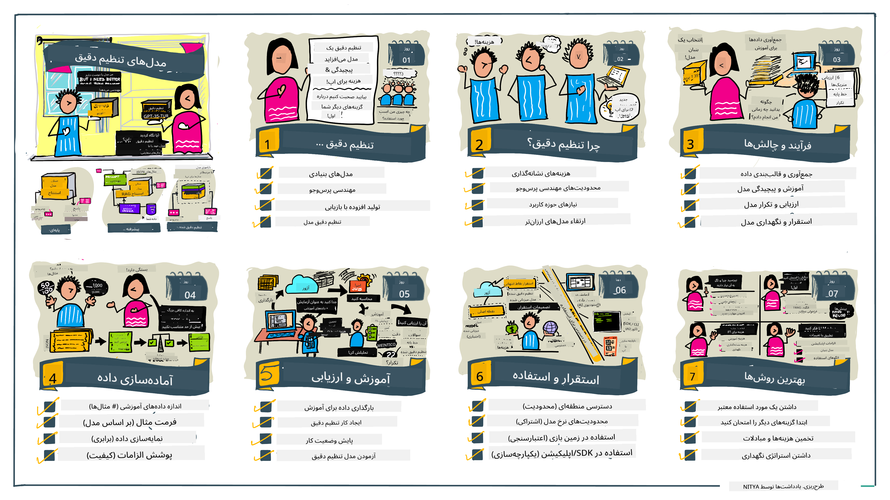

<!--
CO_OP_TRANSLATOR_METADATA:
{
  "original_hash": "68664f7e754a892ae1d8d5e2b7bd2081",
  "translation_date": "2025-06-26T00:31:45+00:00",
  "source_file": "18-fine-tuning/README.md",
  "language_code": "fa"
}
-->

# تنظیم دقیق مدل زبان بزرگ شما

استفاده از مدل‌های زبان بزرگ برای ساخت برنامه‌های هوش مصنوعی تولیدی با چالش‌های جدیدی همراه است. یکی از مسائل کلیدی اطمینان از کیفیت پاسخ‌ها (دقت و مرتبط بودن) در محتوای تولید شده توسط مدل برای درخواست کاربر است. در درس‌های قبلی، تکنیک‌هایی مانند مهندسی اعلان و تولید افزایش یافته با بازیابی را مورد بحث قرار دادیم که سعی می‌کنند مشکل را با _تغییر ورودی اعلان_ به مدل موجود حل کنند.

در درس امروز، ما تکنیک سومی به نام **تنظیم دقیق** را مورد بحث قرار می‌دهیم که سعی دارد با _بازآموزی خود مدل_ با داده‌های اضافی، به چالش پاسخ دهد. بیایید به جزئیات بپردازیم.

## اهداف یادگیری

این درس مفهوم تنظیم دقیق برای مدل‌های زبان پیش‌آموزش‌دیده را معرفی می‌کند، مزایا و چالش‌های این رویکرد را بررسی می‌کند و راهنمایی‌هایی در مورد زمان و چگونگی استفاده از تنظیم دقیق برای بهبود عملکرد مدل‌های هوش مصنوعی تولیدی شما ارائه می‌دهد.

تا پایان این درس، شما باید بتوانید به سوالات زیر پاسخ دهید:

- تنظیم دقیق برای مدل‌های زبان چیست؟
- تنظیم دقیق چه زمانی و چرا مفید است؟
- چگونه می‌توانم یک مدل پیش‌آموزش‌دیده را تنظیم دقیق کنم؟
- محدودیت‌های تنظیم دقیق چیست؟

آماده‌اید؟ بیایید شروع کنیم.

## راهنمای تصویری

آیا می‌خواهید تصویری کلی از آنچه که پوشش خواهیم داد قبل از شروع داشته باشید؟ این راهنمای تصویری را بررسی کنید که سفر یادگیری این درس را توصیف می‌کند - از یادگیری مفاهیم اصلی و انگیزه برای تنظیم دقیق، تا درک فرآیند و بهترین شیوه‌ها برای اجرای وظیفه تنظیم دقیق. این موضوعی جذاب برای کاوش است، بنابراین فراموش نکنید که صفحه [منابع](./RESOURCES.md?WT.mc_id=academic-105485-koreyst) را برای لینک‌های اضافی به منظور حمایت از سفر یادگیری خودتان بررسی کنید!

## تنظیم دقیق برای مدل‌های زبان چیست؟

به‌طور تعریف، مدل‌های زبان بزرگ بر روی مقادیر زیادی متن که از منابع متنوع از جمله اینترنت استخراج شده‌اند، _پیش‌آموزش‌دیده_ هستند. همانطور که در درس‌های قبلی آموخته‌ایم، ما به تکنیک‌هایی مانند _مهندسی اعلان_ و _تولید افزایش یافته با بازیابی_ نیاز داریم تا کیفیت پاسخ‌های مدل به سوالات کاربر ("اعلان‌ها") را بهبود بخشیم.

یکی از تکنیک‌های محبوب مهندسی اعلان شامل ارائه راهنمایی بیشتر به مدل درباره آنچه که در پاسخ انتظار می‌رود، یا با ارائه _دستورالعمل‌ها_ (راهنمایی صریح) یا _دادن چند نمونه_ (راهنمایی ضمنی) است. این به عنوان _یادگیری چند شات_ شناخته می‌شود، اما دو محدودیت دارد:

- محدودیت‌های توکن مدل می‌تواند تعداد نمونه‌هایی که می‌توانید بدهید را محدود کند و اثربخشی را محدود کند.
- هزینه‌های توکن مدل می‌تواند اضافه کردن نمونه‌ها به هر اعلان را گران کند و انعطاف‌پذیری را محدود کند.

تنظیم دقیق یک عمل رایج در سیستم‌های یادگیری ماشین است که در آن یک مدل پیش‌آموزش‌دیده را با داده‌های جدید بازآموزی می‌کنیم تا عملکرد آن را در یک وظیفه خاص بهبود بخشیم. در زمینه مدل‌های زبان، می‌توانیم مدل پیش‌آموزش‌دیده را _با مجموعه‌ای از نمونه‌های گزینش شده برای یک وظیفه یا حوزه کاربردی خاص_ تنظیم دقیق کنیم تا یک **مدل سفارشی** ایجاد کنیم که ممکن است برای آن وظیفه یا حوزه خاص دقیق‌تر و مرتبط‌تر باشد. یک مزیت جانبی تنظیم دقیق این است که می‌تواند تعداد نمونه‌های مورد نیاز برای یادگیری چند شات را کاهش دهد - کاهش استفاده از توکن و هزینه‌های مربوطه.

## چه زمانی و چرا باید مدل‌ها را تنظیم دقیق کنیم؟

در _این_ زمینه، وقتی درباره تنظیم دقیق صحبت می‌کنیم، منظورمان تنظیم دقیق **نظارت‌شده** است که بازآموزی با **افزودن داده‌های جدید** انجام می‌شود که بخشی از مجموعه داده آموزشی اصلی نبودند. این متفاوت از رویکرد تنظیم دقیق بدون نظارت است که مدل بر روی داده‌های اصلی بازآموزی می‌شود، اما با هایپرپارامترهای متفاوت.

نکته کلیدی که باید به یاد داشته باشید این است که تنظیم دقیق یک تکنیک پیشرفته است که برای دستیابی به نتایج مطلوب به سطح خاصی از تخصص نیاز دارد. اگر به‌درستی انجام نشود، ممکن است بهبودهای مورد انتظار را ارائه نکند و حتی ممکن است عملکرد مدل را برای حوزه هدف شما کاهش دهد.

بنابراین، قبل از اینکه یاد بگیرید "چگونه" مدل‌های زبان را تنظیم دقیق کنید، باید بدانید "چرا" باید این مسیر را طی کنید و "چه زمانی" فرآیند تنظیم دقیق را شروع کنید. با پرسیدن این سوالات از خود شروع کنید:

- **مورد استفاده**: مورد استفاده شما برای تنظیم دقیق چیست؟ چه جنبه‌ای از مدل پیش‌آموزش‌دیده فعلی را می‌خواهید بهبود دهید؟
- **جایگزین‌ها**: آیا _تکنیک‌های دیگر_ را برای دستیابی به نتایج مطلوب امتحان کرده‌اید؟ از آنها برای ایجاد یک خط پایه برای مقایسه استفاده کنید.
  - مهندسی اعلان: تکنیک‌هایی مانند اعلان چند شات با نمونه‌هایی از پاسخ‌های اعلان مرتبط را امتحان کنید. کیفیت پاسخ‌ها را ارزیابی کنید.
  - تولید افزایش یافته با بازیابی: اعلان‌ها را با نتایج جستجو در داده‌های خود افزایش دهید. کیفیت پاسخ‌ها را ارزیابی کنید.
- **هزینه‌ها**: آیا هزینه‌های تنظیم دقیق را شناسایی کرده‌اید؟
  - قابلیت تنظیم - آیا مدل پیش‌آموزش‌دیده برای تنظیم دقیق در دسترس است؟
  - تلاش - برای آماده‌سازی داده‌های آموزشی، ارزیابی و بهبود مدل.
  - محاسبات - برای اجرای کارهای تنظیم دقیق و استقرار مدل تنظیم دقیق شده.
  - داده - دسترسی به نمونه‌های با کیفیت کافی برای تأثیر تنظیم دقیق.
- **مزایا**: آیا مزایای تنظیم دقیق را تأیید کرده‌اید؟
  - کیفیت - آیا مدل تنظیم دقیق شده از خط پایه بهتر عمل کرده است؟
  - هزینه - آیا با ساده کردن اعلان‌ها، استفاده از توکن را کاهش می‌دهد؟
  - قابلیت توسعه - آیا می‌توانید مدل پایه را برای حوزه‌های جدید بازپروژه کنید؟

با پاسخ به این سوالات، باید بتوانید تصمیم بگیرید که آیا تنظیم دقیق رویکرد مناسبی برای مورد استفاده شما است یا خیر. ایده‌آل این است که رویکرد تنها در صورتی معتبر باشد که مزایا از هزینه‌ها بیشتر باشد. وقتی تصمیم به ادامه دادید، زمان آن است که درباره _چگونگی_ تنظیم دقیق مدل پیش‌آموزش‌دیده فکر کنید.

آیا می‌خواهید بینش بیشتری در مورد فرآیند تصمیم‌گیری کسب کنید؟ تماشا کنید [تنظیم دقیق یا عدم تنظیم دقیق](https://www.youtube.com/watch?v=0Jo-z-MFxJs)

## چگونه می‌توانیم یک مدل پیش‌آموزش‌دیده را تنظیم دقیق کنیم؟

برای تنظیم دقیق یک مدل پیش‌آموزش‌دیده، شما نیاز دارید به:

- یک مدل پیش‌آموزش‌دیده برای تنظیم دقیق
- یک مجموعه داده برای استفاده در تنظیم دقیق
- یک محیط آموزشی برای اجرای کار تنظیم دقیق
- یک محیط میزبانی برای استقرار مدل تنظیم دقیق شده

## تنظیم دقیق در عمل

منابع زیر آموزش‌های گام‌به‌گام ارائه می‌دهند تا شما را از طریق یک مثال واقعی با استفاده از یک مدل انتخابی و مجموعه داده گزینش شده راهنمایی کنند. برای کار با این آموزش‌ها، شما نیاز به یک حساب کاربری در ارائه‌دهنده خاص، همراه با دسترسی به مدل و مجموعه داده‌های مربوطه دارید.

| ارائه‌دهنده  | آموزش                                                                                                                                                                       | توضیحات                                                                                                                                                                                                                                                                                                                                                                                                                        |
| ------------ | ------------------------------------------------------------------------------------------------------------------------------------------------------------------------------ | ---------------------------------------------------------------------------------------------------------------------------------------------------------------------------------------------------------------------------------------------------------------------------------------------------------------------------------------------------------------------------------------------------------------------------------- |
| OpenAI       | [چگونه مدل‌های چت را تنظیم دقیق کنیم](https://github.com/openai/openai-cookbook/blob/main/examples/How_to_finetune_chat_models.ipynb?WT.mc_id=academic-105485-koreyst)                | یاد بگیرید چگونه یک `gpt-35-turbo` را برای یک حوزه خاص ("دستیار دستور غذا") با آماده‌سازی داده‌های آموزشی، اجرای کار تنظیم دقیق و استفاده از مدل تنظیم دقیق شده برای استنتاج تنظیم دقیق کنید.                                                                                                                                                                                                                                              |
| Azure OpenAI | [آموزش تنظیم دقیق GPT 3.5 Turbo](https://learn.microsoft.com/azure/ai-services/openai/tutorials/fine-tune?tabs=python-new%2Ccommand-line?WT.mc_id=academic-105485-koreyst) | یاد بگیرید چگونه یک `gpt-35-turbo-0613` را **در Azure** تنظیم دقیق کنید با انجام مراحل ایجاد و آپلود داده‌های آموزشی، اجرای کار تنظیم دقیق. مدل جدید را استقرار و استفاده کنید.                                                                                                                                                                                                                                                                 |
| Hugging Face | [تنظیم دقیق LLM‌ها با Hugging Face](https://www.philschmid.de/fine-tune-llms-in-2024-with-trl?WT.mc_id=academic-105485-koreyst)                                               | این پست وبلاگ شما را تنظیم دقیق یک _LLM باز_ (مثال: `CodeLlama 7B`) با استفاده از کتابخانه [transformers](https://huggingface.co/docs/transformers/index?WT.mc_id=academic-105485-koreyst) و [یادگیری تقویتی ترانسفورمر (TRL)](https://huggingface.co/docs/trl/index?WT.mc_id=academic-105485-koreyst]) با [مجموعه داده‌های باز](https://huggingface.co/docs/datasets/index?WT.mc_id=academic-105485-koreyst) بر روی Hugging Face راهنمایی می‌کند. |
|              |                                                                                                                                                                                |                                                                                                                                                                                                                                                                                                                                                                                                                                    |
| 🤗 AutoTrain | [تنظیم دقیق LLM‌ها با AutoTrain](https://github.com/huggingface/autotrain-advanced/?WT.mc_id=academic-105485-koreyst)                                                         | AutoTrain (یا AutoTrain Advanced) یک کتابخانه پایتون است که توسط Hugging Face توسعه یافته و اجازه تنظیم دقیق برای بسیاری از وظایف مختلف از جمله تنظیم دقیق LLM را می‌دهد. AutoTrain یک راه‌حل بدون کد است و تنظیم دقیق می‌تواند در ابر خودتان، در فضاهای Hugging Face یا محلی انجام شود. این از GUI مبتنی بر وب، CLI و آموزش از طریق فایل‌های پیکربندی yaml پشتیبانی می‌کند.                                                                               |
|              |                                                                                                                                                                                |                                                                                                                                                                                                                                                                                                                                                                                                                                    |

## وظیفه

یکی از آموزش‌های بالا را انتخاب کرده و آنها را مرور کنید. _ما ممکن است نسخه‌ای از این آموزش‌ها را در Jupyter Notebooks در این مخزن برای مرجع تنها بازتولید کنیم. لطفاً از منابع اصلی به طور مستقیم استفاده کنید تا آخرین نسخه‌ها را دریافت کنید_.

## کار عالی! ادامه یادگیری شما.

پس از تکمیل این درس، مجموعه [یادگیری هوش مصنوعی تولیدی](https://aka.ms/genai-collection?WT.mc_id=academic-105485-koreyst) ما را بررسی کنید تا به ارتقای دانش هوش مصنوعی تولیدی خود ادامه دهید!

تبریک می‌گویم!! شما درس نهایی از سری v2 این دوره را به پایان رسانده‌اید! یادگیری و ساخت را متوقف نکنید. \*\*صفحه [منابع](RESOURCES.md?WT.mc_id=academic-105485-koreyst) را برای لیستی از پیشنهادات اضافی برای همین موضوع بررسی کنید.

سری درس‌های v1 ما نیز با وظایف و مفاهیم بیشتری به‌روزرسانی شده است. بنابراین یک دقیقه وقت بگذارید تا دانش خود را تازه کنید - و لطفاً [سوالات و بازخورد خود را به اشتراک بگذارید](https://github.com/microsoft/generative-ai-for-beginners/issues?WT.mc_id=academic-105485-koreyst) تا به ما در بهبود این درس‌ها برای جامعه کمک کنید.

**سلب مسئولیت**:  
این سند با استفاده از سرویس ترجمه هوش مصنوعی [Co-op Translator](https://github.com/Azure/co-op-translator) ترجمه شده است. در حالی که ما برای دقت تلاش می‌کنیم، لطفاً توجه داشته باشید که ترجمه‌های خودکار ممکن است حاوی اشتباهات یا نادرستی‌هایی باشند. سند اصلی به زبان مادری آن باید به عنوان منبع معتبر در نظر گرفته شود. برای اطلاعات حیاتی، ترجمه حرفه‌ای انسانی توصیه می‌شود. ما هیچگونه مسئولیتی در قبال سوء تفاهم یا تفسیر نادرست ناشی از استفاده از این ترجمه را نمی‌پذیریم.