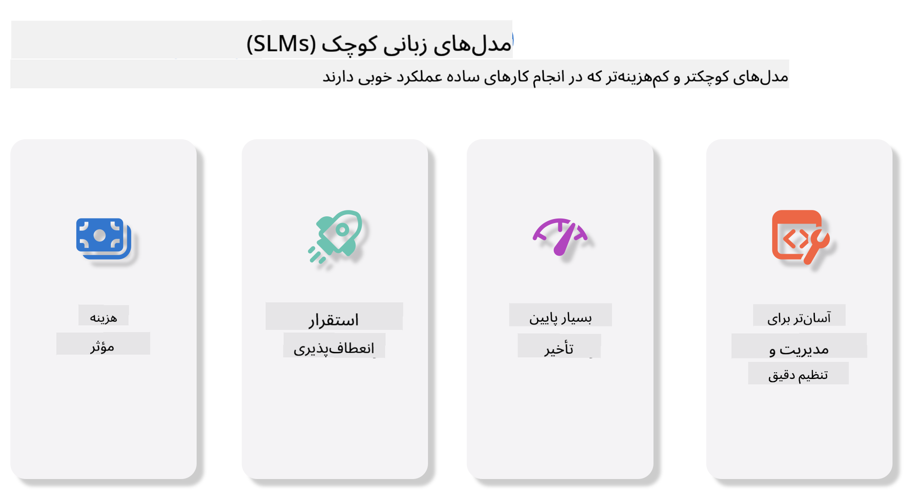
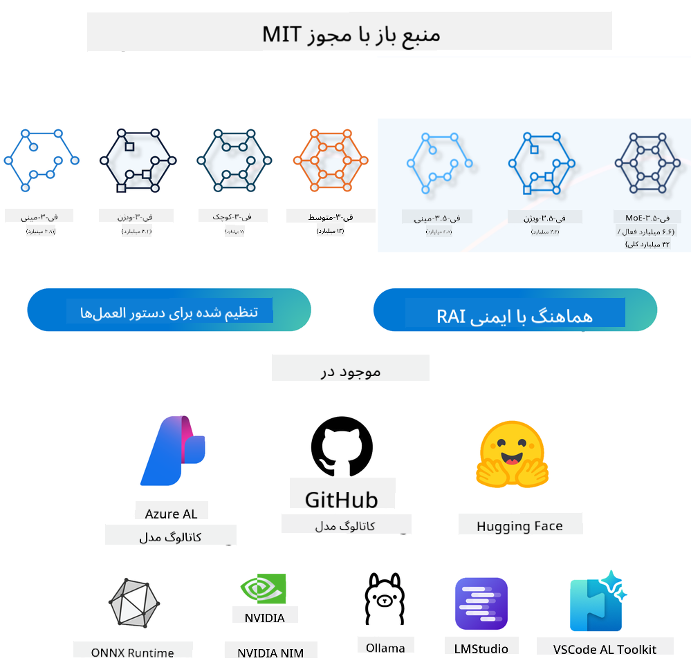
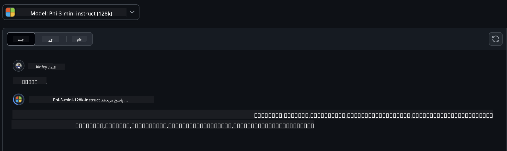
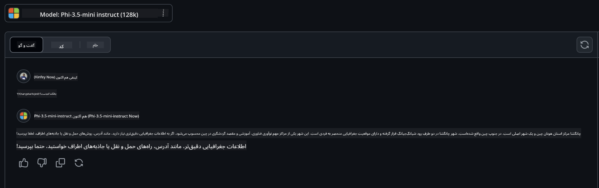

<!--
CO_OP_TRANSLATOR_METADATA:
{
  "original_hash": "124ad36cfe96f74038811b6e2bb93e9d",
  "translation_date": "2025-05-20T09:07:10+00:00",
  "source_file": "19-slm/README.md",
  "language_code": "fa"
}
-->
# مقدمه‌ای بر مدل‌های زبان کوچک برای هوش مصنوعی مولد برای مبتدیان
هوش مصنوعی مولد یک حوزه جذاب از هوش مصنوعی است که بر ایجاد سیستم‌هایی تمرکز دارد که قادر به تولید محتوای جدید هستند. این محتوا می‌تواند از متن و تصاویر تا موسیقی و حتی محیط‌های مجازی کامل باشد. یکی از هیجان‌انگیزترین کاربردهای هوش مصنوعی مولد در حوزه مدل‌های زبان است.

## مدل‌های زبان کوچک چیستند؟
مدل زبان کوچک (SLM) نمایانگر یک نوع کوچک‌تر از مدل زبان بزرگ (LLM) است که بسیاری از اصول معماری و تکنیک‌های LLMها را بهره‌برداری می‌کند، در حالی که اثر پای محاسباتی به طور قابل توجهی کاهش یافته است. SLMها زیرمجموعه‌ای از مدل‌های زبان هستند که برای تولید متن شبیه به انسان طراحی شده‌اند. برخلاف همتایان بزرگ‌ترشان مانند GPT-4، SLMها جمع و جورتر و کارآمدتر هستند، که آنها را برای کاربردهایی که منابع محاسباتی محدود هستند ایده‌آل می‌کند. با وجود اندازه کوچکترشان، آنها هنوز می‌توانند مجموعه‌ای از وظایف را انجام دهند. معمولاً، SLMها با فشرده‌سازی یا تقطیر LLMها ساخته می‌شوند، با هدف حفظ بخش قابل توجهی از عملکرد و قابلیت‌های زبانی مدل اصلی. این کاهش اندازه مدل، پیچیدگی کلی را کاهش می‌دهد، که SLMها را از نظر استفاده از حافظه و نیازهای محاسباتی کارآمدتر می‌کند. با وجود این بهینه‌سازی‌ها، SLMها هنوز می‌توانند طیف گسترده‌ای از وظایف پردازش زبان طبیعی (NLP) را انجام دهند:
- تولید متن: ایجاد جملات یا پاراگراف‌های منسجم و مرتبط با زمینه.
- تکمیل متن: پیش‌بینی و تکمیل جملات بر اساس یک نشانه داده شده.
- ترجمه: تبدیل متن از یک زبان به زبان دیگر.
- خلاصه‌سازی: فشرده‌سازی قطعات طولانی متن به خلاصه‌های کوتاه‌تر و قابل هضم‌تر.
با وجود برخی مصالحه‌ها در عملکرد یا عمق درک نسبت به همتایان بزرگ‌ترشان.

## مدل‌های زبان کوچک چگونه کار می‌کنند؟
SLMها بر اساس مقادیر زیادی از داده‌های متنی آموزش دیده‌اند. در طول آموزش، آنها الگوها و ساختارهای زبان را یاد می‌گیرند، که به آنها امکان می‌دهد متنی تولید کنند که هم از نظر دستوری صحیح و هم از نظر زمینه مناسب باشد. فرآیند آموزش شامل مراحل زیر است:
- جمع‌آوری داده: جمع‌آوری مجموعه داده‌های بزرگ از متن از منابع مختلف.
- پیش‌پردازش: پاکسازی و سازماندهی داده‌ها برای مناسب‌سازی آنها برای آموزش.
- آموزش: استفاده از الگوریتم‌های یادگیری ماشین برای آموزش مدل چگونه متن را درک و تولید کند.
- تنظیم دقیق: تنظیم مدل برای بهبود عملکرد آن در وظایف خاص.

توسعه SLMها با افزایش نیاز به مدل‌هایی که می‌توانند در محیط‌های محدود منابع، مانند دستگاه‌های موبایل یا پلتفرم‌های محاسباتی لبه، جایی که LLMهای کامل ممکن است به دلیل نیازهای سنگین منابع‌شان غیر عملی باشند، هماهنگ است. با تمرکز بر کارایی، SLMها عملکرد را با دسترسی متعادل می‌کنند، که امکان کاربرد گسترده‌تر در حوزه‌های مختلف را فراهم می‌کند.



## اهداف یادگیری
در این درس، امیدواریم دانش SLM را معرفی کنیم و آن را با Microsoft Phi-3 ترکیب کنیم تا سناریوهای مختلفی در محتواهای متنی، دید و MoE یاد بگیریم. تا پایان این درس، شما باید بتوانید به سوالات زیر پاسخ دهید:
- SLM چیست
- تفاوت SLM و LLM چیست
- خانواده Microsoft Phi-3/3.5 چیست
- چگونه خانواده Microsoft Phi-3/3.5 را استنتاج کنیم
آماده‌اید؟ بیایید شروع کنیم.

## تفاوت‌ها بین مدل‌های زبان بزرگ (LLMs) و مدل‌های زبان کوچک (SLMs)
هم LLMها و هم SLMها بر اصول بنیادی یادگیری ماشین احتمالی ساخته شده‌اند، که رویکردهای مشابهی را در طراحی معماری، روش‌های آموزش، فرآیندهای تولید داده و تکنیک‌های ارزیابی مدل دنبال می‌کنند. با این حال، چندین عامل کلیدی این دو نوع مدل را متمایز می‌کند.

## کاربردهای مدل‌های زبان کوچک
SLMها دارای طیف گسترده‌ای از کاربردها هستند، از جمله:
- چت‌بات‌ها: ارائه پشتیبانی مشتری و تعامل با کاربران به صورت مکالمه‌ای.
- ایجاد محتوا: کمک به نویسندگان با تولید ایده‌ها یا حتی نوشتن مقالات کامل.
- آموزش: کمک به دانش‌آموزان در وظایف نوشتاری یا یادگیری زبان‌های جدید.
- دسترسی‌پذیری: ایجاد ابزارهایی برای افراد دارای معلولیت، مانند سیستم‌های تبدیل متن به گفتار.

**اندازه**
یک تمایز اصلی بین LLMها و SLMها در مقیاس مدل‌ها نهفته است. LLMها، مانند ChatGPT (GPT-4)، می‌توانند شامل تقریباً 1.76 تریلیون پارامتر باشند، در حالی که SLMهای متن‌باز مانند Mistral 7B با پارامترهای به طور قابل توجهی کمتر طراحی شده‌اند—تقریباً 7 میلیارد. این تفاوت عمدتاً به دلیل تفاوت‌های در معماری مدل و فرآیندهای آموزش است. به عنوان مثال، ChatGPT از مکانیزم توجه به خود در چارچوب رمزگذار-رمزگشا استفاده می‌کند، در حالی که Mistral 7B از توجه پنجره لغزنده استفاده می‌کند، که امکان آموزش کارآمدتر در یک مدل فقط رمزگشا را فراهم می‌کند. این تفاوت معماری پیامدهای عمیقی برای پیچیدگی و عملکرد این مدل‌ها دارد.

**درک**
SLMها معمولاً برای عملکرد در حوزه‌های خاص بهینه‌سازی شده‌اند، که آنها را بسیار تخصصی اما بالقوه محدود در توانایی ارائه درک گسترده زمینه‌ای در چندین حوزه دانش می‌کند. در مقابل، LLMها هدف شبیه‌سازی هوش انسانی در سطح جامع‌تر را دارند. آموزش دیده بر مجموعه داده‌های گسترده و متنوع، LLMها برای عملکرد خوب در انواع مختلفی از حوزه‌ها طراحی شده‌اند، که انعطاف‌پذیری و سازگاری بیشتری را ارائه می‌دهند. در نتیجه، LLMها برای طیف گسترده‌تری از وظایف پایین‌دستی، مانند پردازش زبان طبیعی و برنامه‌نویسی، مناسب‌تر هستند.

**محاسبات**
آموزش و استقرار LLMها فرآیندهای منابع‌بر هستند، که اغلب به زیرساخت محاسباتی قابل توجهی نیاز دارند، از جمله خوشه‌های GPU بزرگ‌مقیاس. به عنوان مثال، آموزش یک مدل مانند ChatGPT از ابتدا ممکن است به هزاران GPU در طول دوره‌های طولانی نیاز داشته باشد. در مقابل، SLMها، با تعداد پارامترهای کوچکترشان، از نظر منابع محاسباتی قابل دسترس‌تر هستند. مدل‌هایی مانند Mistral 7B می‌توانند بر روی ماشین‌های محلی مجهز به قابلیت‌های GPU متوسط آموزش داده و اجرا شوند، هرچند آموزش هنوز به چندین ساعت در چندین GPU نیاز دارد.

**تعصب**
تعصب یک مسئله شناخته‌شده در LLMها است، عمدتاً به دلیل ماهیت داده‌های آموزشی. این مدل‌ها اغلب به داده‌های خام و آزاد موجود در اینترنت متکی هستند، که ممکن است برخی گروه‌ها را کمتر نمایندگی کنند یا نادرست نمایندگی کنند، برچسب‌گذاری نادرست معرفی کنند، یا تعصبات زبانی تحت تاثیر گویش، تغییرات جغرافیایی و قواعد دستوری را منعکس کنند. علاوه بر این، پیچیدگی معماری‌های LLM می‌تواند به طور غیرمستقیم تعصب را تشدید کند، که ممکن است بدون تنظیم دقیق دقیق به چشم نیاید. از سوی دیگر، SLMها، با آموزش بر مجموعه داده‌های محدود و خاص‌دامنه، ذاتاً کمتر به چنین تعصب‌هایی حساس هستند، هرچند از آنها مصون نیستند.

**استنتاج**
اندازه کاهش‌یافته SLMها به آنها یک مزیت قابل توجه از نظر سرعت استنتاج می‌دهد، که به آنها امکان می‌دهد خروجی‌ها را به طور کارآمد بر روی سخت‌افزار محلی تولید کنند بدون نیاز به پردازش موازی گسترده. در مقابل، LLMها، به دلیل اندازه و پیچیدگی‌شان، اغلب به منابع محاسباتی موازی قابل توجهی نیاز دارند تا زمان‌های استنتاج قابل قبول را به دست آورند. حضور کاربران همزمان متعدد زمان‌های پاسخ LLMها را بیشتر کند می‌کند، به ویژه زمانی که در مقیاس مستقر شوند.

به طور خلاصه، در حالی که هم LLMها و هم SLMها پایه‌ای مشترک در یادگیری ماشین دارند، آنها از نظر اندازه مدل، نیازهای منابع، درک زمینه‌ای، حساسیت به تعصب و سرعت استنتاج به طور قابل توجهی متفاوت هستند. این تفاوت‌ها منعکس‌کننده مناسب بودن آنها برای موارد استفاده مختلف است، با LLMها که همه‌کاره‌تر اما منابع‌بر هستند، و SLMها که کارایی خاص‌دامنه بیشتری با نیازهای محاسباتی کاهش‌یافته ارائه می‌دهند.

***توجه: در این فصل، ما SLM را با استفاده از Microsoft Phi-3 / 3.5 به عنوان مثال معرفی خواهیم کرد.***

## معرفی خانواده Phi-3 / Phi-3.5
خانواده Phi-3 / 3.5 عمدتاً هدف‌گیری سناریوهای کاربردی متن، دید، و عامل (MoE) دارد:

### Phi-3 / 3.5 Instruct
عمدتاً برای تولید متن، تکمیل چت، و استخراج اطلاعات محتوا، و غیره.

**Phi-3-mini**
مدل زبان 3.8B در Microsoft Azure AI Studio، Hugging Face، و Ollama در دسترس است. مدل‌های Phi-3 به طور قابل توجهی از مدل‌های زبان برابر و بزرگتر در معیارهای کلیدی بهتر عمل می‌کنند (اعداد معیار زیر را ببینید، اعداد بالاتر بهتر هستند). Phi-3-mini از مدل‌های دو برابر اندازه خود بهتر عمل می‌کند، در حالی که Phi-3-small و Phi-3-medium از مدل‌های بزرگتر، از جمله GPT-3.5، بهتر عمل می‌کنند.

**Phi-3-small & medium**
با فقط 7B پارامتر، Phi-3-small بر روی انواع معیارهای زبان، استدلال، کدنویسی، و ریاضی GPT-3.5T را شکست می‌دهد. Phi-3-medium با 14B پارامتر این روند را ادامه می‌دهد و از Gemini 1.0 Pro بهتر عمل می‌کند.

**Phi-3.5-mini**
ما می‌توانیم آن را به عنوان یک ارتقا از Phi-3-mini در نظر بگیریم. در حالی که پارامترها بدون تغییر باقی می‌مانند، توانایی پشتیبانی از چندین زبان (پشتیبانی از بیش از 20 زبان: عربی، چینی، چک، دانمارکی، هلندی، انگلیسی، فنلاندی، فرانسوی، آلمانی، عبری، مجاری، ایتالیایی، ژاپنی، کره‌ای، نروژی، لهستانی، پرتغالی، روسی، اسپانیایی، سوئدی، تایلندی، ترکی، اوکراینی) را بهبود می‌بخشد و پشتیبانی قوی‌تر از زمینه طولانی اضافه می‌کند. Phi-3.5-mini با 3.8B پارامتر از مدل‌های زبان با اندازه مشابه بهتر عمل می‌کند و با مدل‌های دو برابر اندازه خود همتراز است.

### Phi-3 / 3.5 Vision
ما می‌توانیم مدل Instruct Phi-3/3.5 را به عنوان توانایی Phi برای فهمیدن در نظر بگیریم، و Vision چیزی است که به Phi چشم می‌دهد تا جهان را بفهمد.

**Phi-3-Vision**
Phi-3-vision، با فقط 4.2B پارامتر، این روند را ادامه می‌دهد و از مدل‌های بزرگتر مانند Claude-3 Haiku و Gemini 1.0 Pro V در وظایف استدلال بصری عمومی، OCR، و وظایف فهم جدول و نمودار بهتر عمل می‌کند.

**Phi-3.5-Vision**
Phi-3.5-Vision نیز یک ارتقا از Phi-3-Vision است، که پشتیبانی از تصاویر متعدد را اضافه می‌کند. شما می‌توانید آن را به عنوان بهبود در دید در نظر بگیرید، نه تنها می‌توانید تصاویر را ببینید، بلکه ویدیوها را نیز. Phi-3.5-vision از مدل‌های بزرگتر مانند Claude-3.5 Sonnet و Gemini 1.5 Flash در وظایف فهم OCR، جدول و نمودار بهتر عمل می‌کند و در وظایف استدلال دانش بصری عمومی همتراز است. پشتیبانی از ورودی چندفریم، یعنی استدلال بر روی چندین تصویر ورودی انجام دهید.

### Phi-3.5-MoE
***مخلوطی از کارشناسان (MoE)*** به مدل‌ها اجازه می‌دهد با محاسبات بسیار کمتر پیش‌آموزش داده شوند، که به این معناست که می‌توانید مدل یا اندازه مجموعه داده را به طور چشمگیری با همان بودجه محاسباتی به عنوان یک مدل متراکم افزایش دهید. به طور خاص، یک مدل MoE باید در طول پیش‌آموزش بسیار سریع‌تر به همان کیفیت به عنوان همتای متراکم خود برسد. Phi-3.5-MoE شامل 16x3.8B ماژول‌های کارشناسی است. Phi-3.5-MoE با فقط 6.6B پارامتر فعال به سطح مشابهی از استدلال، فهم زبان، و ریاضی به عنوان مدل‌های بسیار بزرگتر می‌رسد.

ما می‌توانیم مدل خانواده Phi-3/3.5 را بر اساس سناریوهای مختلف استفاده کنیم. برخلاف LLM، می‌توانید Phi-3/3.5-mini یا Phi-3/3.5-Vision را بر روی دستگاه‌های لبه مستقر کنید.

## چگونه از مدل‌های خانواده Phi-3/3.5 استفاده کنیم
امیدواریم از Phi-3/3.5 در سناریوهای مختلف استفاده کنیم. بعدی، ما از Phi-3/3.5 بر اساس سناریوهای مختلف استفاده خواهیم کرد.



### تفاوت استنتاج
API ابری
**مدل‌های GitHub**
GitHub
مدل‌ها مستقیم‌ترین راه هستند. شما می‌توانید به سرعت به مدل Phi-3/3.5-Instruct از طریق GitHub Models دسترسی پیدا کنید. همراه با Azure AI Inference SDK / OpenAI SDK، شما می‌توانید از طریق کد به API دسترسی پیدا کنید تا فراخوانی Phi-3/3.5-Instruct را کامل کنید. شما همچنین می‌توانید اثرات مختلف را از طریق Playground آزمایش کنید. - دمو: مقایسه اثرات Phi-3-mini و Phi-3.5-mini در سناریوهای چینی   **Azure AI Studio** یا اگر می‌خواهیم از مدل‌های vision و MoE استفاده کنیم، می‌توانید از Azure AI Studio برای تکمیل فراخوانی استفاده کنید. اگر علاقه‌مند هستید، می‌توانید کتاب آشپزی Phi-3 را بخوانید تا یاد بگیرید چگونه Phi-3/3.5 Instruct, Vision, MoE را از طریق Azure AI Studio فراخوانی کنید [برای دیدن این لینک کلیک کنید](https://github.com/microsoft/Phi-3CookBook/blob/main/md/02.QuickStart/AzureAIStudio_QuickStart.md?WT.mc_id=academic-105485-koreyst) **NVIDIA NIM** علاوه بر راه‌حل‌های کاتالوگ مدل مبتنی بر ابر که توسط Azure و GitHub ارائه می‌شود، شما همچنین می‌توانید از [Nivida NIM](https://developer.nvidia.com/nim?WT.mc_id=academic-105485-koreyst) برای تکمیل فراخوانی‌های مرتبط استفاده کنید. شما می‌توانید به NIVIDA NIM مراجعه کنید تا فراخوانی‌های API خانواده Phi-3/3.5 را کامل کنید. NVIDIA NIM (NVIDIA Inference Microservices) مجموعه‌ای از میکروسرویس‌های استنتاج تسریع‌شده است که به توسعه‌دهندگان کمک می‌کند تا مدل‌های AI را به‌طور کارآمد در محیط‌های مختلف از جمله ابرها، مراکز داده و ورک‌استیشن‌ها مستقر کنند. در اینجا برخی از ویژگی‌های کلیدی NVIDIA NIM آورده شده است: - **سهولت در استقرار:** NIM اجازه می‌دهد تا مدل‌های AI با یک فرمان مستقر شوند، که این کار را برای ادغام در جریان‌های کاری موجود ساده می‌کند. - **عملکرد بهینه‌شده:** از موتورهای استنتاج پیش‌بهینه‌شده NVIDIA، مانند TensorRT و TensorRT-LLM، استفاده می‌کند تا اطمینان حاصل شود که تأخیر کم و توان بالا دارند. - **قابلیت مقیاس‌پذیری:** NIM از مقیاس‌پذیری خودکار بر روی Kubernetes پشتیبانی می‌کند و به آن امکان می‌دهد بارهای کاری متغیر را به‌طور مؤثر مدیریت کند. - **امنیت و کنترل:** سازمان‌ها می‌توانند کنترل داده‌ها و برنامه‌های خود را با میزبانی خودکار میکروسرویس‌های NIM بر روی زیرساخت مدیریت‌شده خود حفظ کنند. - **API‌های استاندارد:** NIM API‌های استاندارد صنعتی ارائه می‌دهد، که ساخت و ادغام برنامه‌های AI مانند چت‌بات‌ها، دستیارهای AI و بیشتر را آسان می‌کند. NIM بخشی از NVIDIA AI Enterprise است که هدف آن ساده‌سازی استقرار و عملیاتی کردن مدل‌های AI است، به‌طوری‌که آن‌ها به‌طور کارآمد بر روی GPUهای NVIDIA اجرا شوند. - دمو: استفاده از Nividia NIM برای فراخوانی Phi-3.5-Vision-API [[برای دیدن این لینک کلیک کنید](../../../19-slm/python/Phi-3-Vision-Nividia-NIM.ipynb)] ### استنتاج Phi-3/3.5 در محیط محلی استنتاج در ارتباط با Phi-3، یا هر مدل زبان مانند GPT-3، به فرآیند تولید پاسخ‌ها یا پیش‌بینی‌ها بر اساس ورودی که دریافت می‌کند اشاره دارد. هنگامی که شما یک دستور یا سؤال به Phi-3 ارائه می‌دهید، از شبکه عصبی آموزش‌دیده خود برای استنتاج پاسخ‌های محتمل و مرتبط استفاده می‌کند با تحلیل الگوها و روابط در داده‌هایی که بر روی آن‌ها آموزش دیده است. **Hugging Face Transformer** Hugging Face Transformers یک کتابخانه قدرتمند است که برای پردازش زبان طبیعی (NLP) و وظایف دیگر یادگیری ماشین طراحی شده است. در اینجا برخی نکات کلیدی درباره آن آورده شده است: 1. **مدل‌های پیش‌آموزش‌دیده:** هزاران مدل پیش‌آموزش‌دیده ارائه می‌دهد که می‌توانند برای وظایف مختلفی مانند طبقه‌بندی متن، تشخیص موجودیت نام‌گذاری شده، پاسخ به سوالات، خلاصه‌سازی، ترجمه و تولید متن استفاده شوند. 2. **سازگاری چارچوب:** کتابخانه از چندین چارچوب یادگیری عمیق، از جمله PyTorch، TensorFlow و JAX پشتیبانی می‌کند. این اجازه می‌دهد تا شما مدلی را در یک چارچوب آموزش دهید و در دیگری استفاده کنید. 3. **قابلیت‌های چندوجهی:** علاوه بر NLP، Hugging Face Transformers از وظایف در بینایی کامپیوتر (مانند طبقه‌بندی تصویر، تشخیص اشیا) و پردازش صوتی (مانند تشخیص گفتار، طبقه‌بندی صوتی) نیز پشتیبانی می‌کند. 4. **سهولت در استفاده:** کتابخانه API‌ها و ابزارهایی برای دانلود و تنظیم دقیق مدل‌ها به راحتی ارائه می‌دهد، که آن را برای مبتدیان و کارشناسان قابل دسترسی می‌کند. 5. **جامعه و منابع:** Hugging Face دارای جامعه‌ای پویا و مستندات گسترده، آموزش‌ها و راهنماهایی است که به کاربران کمک می‌کند شروع کنند و بیشترین بهره را از کتابخانه ببرند. [مستندات رسمی](https://huggingface.co/docs/transformers/index?WT.mc_id=academic-105485-koreyst) یا مخزن [GitHub آن‌ها](https://github.com/huggingface/transformers?WT.mc_id=academic-105485-koreyst). این روش معمول‌ترین است، اما همچنین به شتاب GPU نیاز دارد. بعد از همه، صحنه‌هایی مانند Vision و MoE به محاسبات زیادی نیاز دارند، که در صورت عدم کم‌کردن در CPU بسیار محدود خواهند بود. - دمو: استفاده از Transformer برای فراخوانی Phi-3.5-Instuct [برای دیدن این لینک کلیک کنید](../../../19-slm/python/phi35-instruct-demo.ipynb) - دمو: استفاده از Transformer برای فراخوانی Phi-3.5-Vision[برای دیدن این لینک کلیک کنید](../../../19-slm/python/phi35-vision-demo.ipynb) - دمو: استفاده از Transformer برای فراخوانی Phi-3.5-MoE[برای دیدن این لینک کلیک کنید](../../../19-slm/python/phi35_moe_demo.ipynb) **Ollama** [Ollama](https://ollama.com/?WT.mc_id=academic-105485-koreyst) یک پلتفرم طراحی شده است تا اجرای مدل‌های زبان بزرگ (LLMs) را به‌طور محلی بر روی ماشین شما آسان‌تر کند. از مدل‌های مختلفی مانند Llama 3.1، Phi 3، Mistral و Gemma 2، در میان دیگران پشتیبانی می‌کند. پلتفرم فرآیند را با بسته‌بندی وزن‌های مدل، پیکربندی و داده‌ها به یک بسته واحد ساده می‌کند، که آن را برای کاربران قابل دسترسی‌تر می‌کند تا مدل‌های خود را سفارشی و ایجاد کنند. Ollama برای macOS، Linux و Windows در دسترس است. این ابزار عالی است اگر به دنبال آزمایش یا استقرار LLMها بدون تکیه بر خدمات ابری هستید. Ollama مستقیم‌ترین راه است، شما فقط نیاز دارید تا بیانیه زیر را اجرا کنید. ```bash

ollama run phi3.5

``` **ONNX Runtime برای GenAI** [ONNX Runtime](https://github.com/microsoft/onnxruntime-genai?WT.mc_id=academic-105485-koreyst) یک شتاب‌دهنده یادگیری ماشین برای استنتاج و آموزش بین‌پلتفرمی است. ONNX Runtime برای Generative AI (GENAI) یک ابزار قدرتمند است که به شما کمک می‌کند مدل‌های AI مولد را به‌طور کارآمد در پلتفرم‌های مختلف اجرا کنید. ## ONNX Runtime چیست؟ ONNX Runtime یک پروژه منبع باز است که امکان استنتاج با عملکرد بالا مدل‌های یادگیری ماشین را فراهم می‌کند. از مدل‌ها در فرمت تبادل شبکه عصبی باز (ONNX) پشتیبانی می‌کند، که استانداردی برای نمایندگی مدل‌های یادگیری ماشین است. استنتاج ONNX Runtime می‌تواند تجربیات مشتری سریع‌تر و هزینه‌های کمتر را امکان‌پذیر کند، مدل‌هایی را از چارچوب‌های یادگیری عمیق مانند PyTorch و TensorFlow/Keras و همچنین کتابخانه‌های یادگیری ماشین کلاسیک مانند scikit-learn، LightGBM، XGBoost و غیره پشتیبانی کند. ONNX Runtime با سخت‌افزار، درایورها و سیستم‌عامل‌های مختلف سازگار است و عملکرد بهینه‌ای را با استفاده از شتاب‌دهنده‌های سخت‌افزاری در صورت امکان در کنار بهینه‌سازی‌ها و تبدیل‌های گراف ارائه می‌دهد. ## AI مولد چیست؟ AI مولد به سیستم‌های AI اشاره دارد که می‌توانند محتوای جدیدی مانند متن، تصاویر یا موسیقی بر اساس داده‌هایی که بر روی آن‌ها آموزش دیده‌اند تولید کنند. مثال‌ها شامل مدل‌های زبان مانند GPT-3 و مدل‌های تولید تصویر مانند Stable Diffusion هستند. کتابخانه ONNX Runtime برای GenAI حلقه AI مولد را برای مدل‌های ONNX ارائه می‌دهد، شامل استنتاج با ONNX Runtime، پردازش logits، جستجو و نمونه‌گیری، و مدیریت کش KV. ## ONNX Runtime برای GENAI ONNX Runtime برای GENAI قابلیت‌های ONNX Runtime را برای پشتیبانی از مدل‌های AI مولد گسترش می‌دهد. در اینجا برخی از ویژگی‌های کلیدی آورده شده است: - **پشتیبانی گسترده از پلتفرم:** بر روی پلتفرم‌های مختلف از جمله Windows، Linux، macOS، Android و iOS کار می‌کند. - **پشتیبانی از مدل:** از بسیاری از مدل‌های AI مولد محبوب مانند LLaMA، GPT-Neo، BLOOM و بیشتر پشتیبانی می‌کند. - **بهینه‌سازی عملکرد:** شامل بهینه‌سازی‌هایی برای شتاب‌دهنده‌های سخت‌افزاری مختلف مانند GPUهای NVIDIA، GPUهای AMD و بیشتر است. - **سهولت در استفاده:** API‌هایی برای ادغام آسان در برنامه‌ها ارائه می‌دهد، به شما اجازه می‌دهد تا با کمترین کد متن، تصاویر و محتوای دیگر تولید کنید. - کاربران می‌توانند یک روش generate() سطح بالا را فراخوانی کنند، یا هر تکرار مدل را در یک حلقه اجرا کنند، یک توکن در هر زمان تولید کنند، و به‌طور اختیاری پارامترهای تولید را درون حلقه به‌روز کنند. - زمان اجرا ONNX همچنین از جستجوی حریصانه/پرتو و نمونه‌گیری TopP، TopK برای تولید توالی‌های توکن و پردازش logits داخلی مانند جریمه‌های تکرار پشتیبانی می‌کند. شما همچنین می‌توانید به‌راحتی امتیازدهی سفارشی اضافه کنید. ## شروع به کار برای شروع با ONNX Runtime برای GENAI، می‌توانید این مراحل را دنبال کنید: ### نصب ONNX Runtime: ```Python
pip install onnxruntime
``` ### نصب افزونه‌های AI مولد: ```Python
pip install onnxruntime-genai
``` ### اجرای یک مدل: در اینجا یک مثال ساده در Python آمده است: ```Python
import onnxruntime_genai as og

model = og.Model('path_to_your_model.onnx')

tokenizer = og.Tokenizer(model)

input_text = "Hello, how are you?"

input_tokens = tokenizer.encode(input_text)

output_tokens = model.generate(input_tokens)

output_text = tokenizer.decode(output_tokens)

print(output_text) 
``` ### دمو: استفاده از ONNX Runtime GenAI برای فراخوانی Phi-3.5-Vision ```python

import onnxruntime_genai as og

model_path = './Your Phi-3.5-vision-instruct ONNX Path'

img_path = './Your Image Path'

model = og.Model(model_path)

processor = model.create_multimodal_processor()

tokenizer_stream = processor.create_stream()

text = "Your Prompt"

prompt = "<|user|>\n"

prompt += "<|image_1|>\n"

prompt += f"{text}<|end|>\n"

prompt += "<|assistant|>\n"

image = og.Images.open(img_path)

inputs = processor(prompt, images=image)

params = og.GeneratorParams(model)

params.set_inputs(inputs)

params.set_search_options(max_length=3072)

generator = og.Generator(model, params)

while not generator.is_done():

    generator.compute_logits()
    
    generator.generate_next_token()

    new_token = generator.get_next_tokens()[0]
    
    code += tokenizer_stream.decode(new_token)
    
    print(tokenizer_stream.decode(new_token), end='', flush=True)

``` **دیگران** علاوه بر روش‌های مرجع ONNX Runtime و Ollama، ما همچنین می‌توانیم مرجع مدل‌های کمی را بر اساس روش‌های مرجع مدل ارائه‌شده توسط تولیدکنندگان مختلف تکمیل کنیم. مانند چارچوب Apple MLX با Apple Metal، Qualcomm QNN با NPU، Intel OpenVINO با CPU/GPU و غیره. شما همچنین می‌توانید محتوای بیشتری از [کتاب آشپزی Phi-3](https://github.com/microsoft/phi-3cookbook?WT.mc_id=academic-105485-koreyst) دریافت کنید. ## بیشتر ما اصول خانواده Phi-3/3.5 را یاد گرفته‌ایم، اما برای یادگیری بیشتر درباره SLM به دانش بیشتری نیاز داریم. شما می‌توانید پاسخ‌ها را در کتاب آشپزی Phi-3 پیدا کنید. اگر می‌خواهید بیشتر یاد بگیرید، لطفاً به [کتاب آشپزی Phi-3](https://github.com/microsoft/phi-3cookbook?WT.mc_id=academic-105485-koreyst) مراجعه کنید.

**سلب مسئولیت**:  
این سند با استفاده از سرویس ترجمه هوش مصنوعی [Co-op Translator](https://github.com/Azure/co-op-translator) ترجمه شده است. در حالی که ما برای دقت تلاش می‌کنیم، لطفاً توجه داشته باشید که ترجمه‌های خودکار ممکن است حاوی خطاها یا نادرستی‌هایی باشند. سند اصلی به زبان مادری آن باید به عنوان منبع معتبر در نظر گرفته شود. برای اطلاعات حساس، ترجمه حرفه‌ای انسانی توصیه می‌شود. ما در قبال هرگونه سوءتفاهم یا تفسیر نادرست ناشی از استفاده از این ترجمه مسئولیتی نداریم.