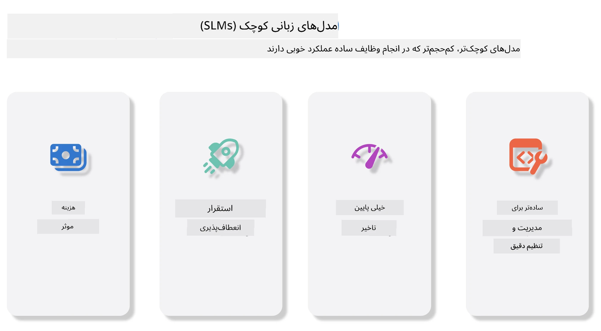
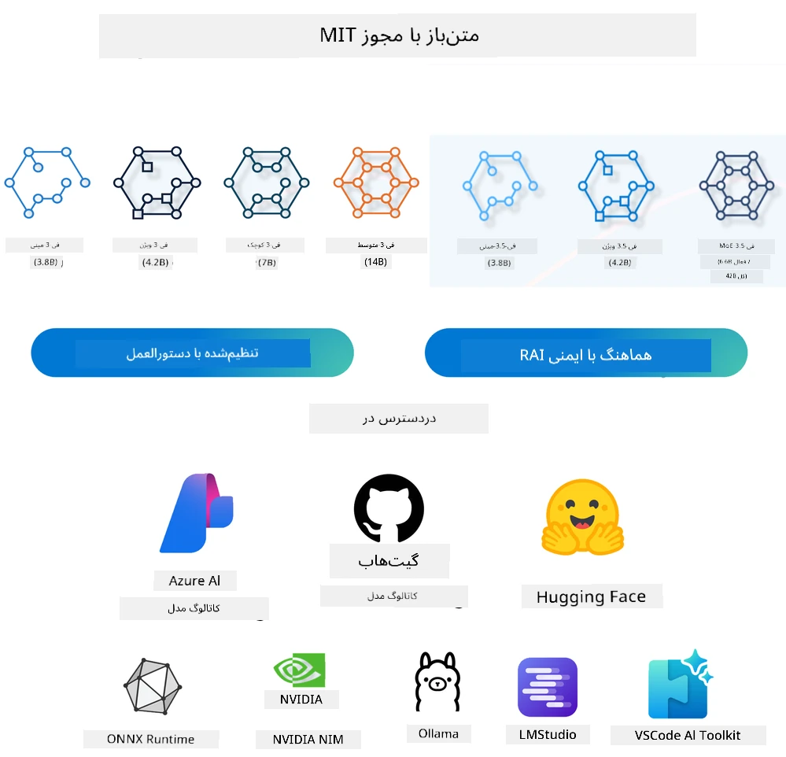
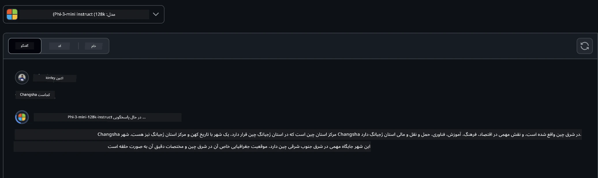
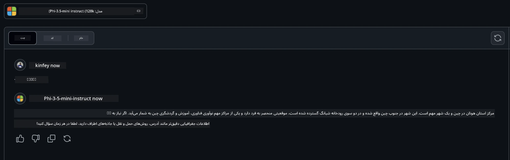

# مقدمه‌ای بر مدل‌های زبانی کوچک برای هوش مصنوعی مولد برای مبتدیان
هوش مصنوعی مولد حوزه‌ای جذاب از هوش مصنوعی است که بر ایجاد سیستم‌هایی تمرکز دارد که قادر به تولید محتوای جدید هستند. این محتوا می‌تواند از متن و تصویر تا موسیقی و حتی محیط‌های مجازی کامل متغیر باشد. یکی از هیجان‌انگیزترین کاربردهای هوش مصنوعی مولد در حوزه مدل‌های زبانی است.

## مدل‌های زبانی کوچک چیستند؟

یک مدل زبانی کوچک (SLM) نسخه‌ای کوچک‌شده از یک مدل زبانی بزرگ (LLM) است که بسیاری از اصول معماری و تکنیک‌های LLMها را به کار می‌گیرد، اما اندازه محاسباتی آنها به طور قابل توجهی کاهش یافته است.

SLMها زیرمجموعه‌ای از مدل‌های زبانی هستند که برای تولید متنی مشابه با زبان انسان طراحی شده‌اند. برخلاف نمونه‌های بزرگ‌تر مانند GPT-4، SLMها جمع‌وجورتر و کارآمدتر بوده و برای کاربردهایی که منابع محاسباتی محدود است، ایده‌آل هستند. با وجود اندازه کوچکتر، آنها قادر به انجام انواع وظایف مختلف هستند. معمولاً SLMها با فشرده‌سازی یا تقطیر LLMها ساخته می‌شوند تا بخش قابل توجهی از عملکرد و توانایی‌های زبانی مدل اصلی حفظ شود. این کاهش اندازه مدل، پیچیدگی کلی را کاهش می‌دهد و SLMها را از نظر مصرف حافظه و نیازهای محاسباتی کارآمدتر می‌کند. با وجود این بهینه‌سازی‌ها، SLMها هنوز می‌توانند طیف وسیعی از وظایف پردازش زبان طبیعی (NLP) را انجام دهند:

- تولید متن: ایجاد جملات یا پاراگراف‌های مرتبط و پیوسته.
- تکمیل متن: پیش‌بینی و کامل کردن جملات بر اساس نمونه داده شده.
- ترجمه: تبدیل متن از یک زبان به زبان دیگر.
- خلاصه‌سازی: کوتاه‌کردن متون طولانی به خلاصه‌های مختصر و قابل فهم.

به هر حال با برخی مصالحه‌ها در عملکرد یا عمق درک نسبت به نمونه‌های بزرگ‌تر.

## مدل‌های زبانی کوچک چگونه کار می‌کنند؟
SLMها با حجم زیادی از داده‌های متنی آموزش داده می‌شوند. در طی آموزش، آنها الگوها و ساختارهای زبان را یاد می‌گیرند که باعث می‌شود متنی هم از نظر دستور زبان صحیح و هم از نظر زمینه‌ای مناسب تولید کنند. فرایند آموزش شامل:

- گردآوری داده‌ها: جمع‌آوری مجموعه‌های بزرگی از متن از منابع مختلف.
- پیش‌پردازش: پاک‌سازی و سازماندهی داده‌ها برای مناسب‌سازی برای آموزش.
- آموزش: استفاده از الگوریتم‌های یادگیری ماشین برای آموزش مدل جهت درک و تولید متن.
- تنظیم دقیق: بهبود عملکرد مدل در وظایف خاص.

توسعه SLMها با نیاز فزاینده به مدل‌هایی هماهنگ است که می‌توانند در محیط‌های با منابع محدود مانند دستگاه‌های موبایل یا پلتفرم‌های محاسبات لبه اجرا شوند، جایی که مدل‌های کامل LLM ممکن است به دلیل نیازهای سنگین منابع عملی نباشند. با تمرکز بر کارایی، SLMها تعادل بین عملکرد و دسترسی را حفظ می‌کنند و امکان استفاده گسترده‌تر در حوزه‌های مختلف را فراهم می‌آورند.



## اهداف یادگیری

در این درس امیدواریم دانش SLM را معرفی کرده و آن را با Microsoft Phi-3 ترکیب کنیم تا سناریوهای مختلف در محتواهای متنی، بینایی و MoE را یاد بگیریم.

تا پایان این درس، باید بتوانید به سوالات زیر پاسخ دهید:

- SLM چیست؟
- تفاوت بین SLM و LLM چیست؟
- خانواده Microsoft Phi-3/3.5 چیست؟
- چگونه با خانواده Microsoft Phi-3/3.5 استنتاج انجام دهیم؟

آماده‌اید؟ بیایید شروع کنیم.

## تفاوت‌های بین مدل‌های زبانی بزرگ (LLMs) و مدل‌های زبانی کوچک (SLMs)

هر دو LLM و SLM بر اصول پایه‌ای یادگیری ماشین احتمالاتی ساخته شده‌اند و در طراحی معماری، متدولوژی‌های آموزش، فرایندهای تولید داده و تکنیک‌های ارزیابی مدل رویکردهای مشابهی دارند. اما چند عامل کلیدی این دو نوع مدل را متمایز می‌کنند.

## کاربردهای مدل‌های زبانی کوچک

SLMها در کاربردهای متنوعی استفاده می‌شوند، از جمله:

- چت‌بات‌ها: ارائه پشتیبانی مشتری و تعامل مکالمه‌ای با کاربران.
- تولید محتوا: کمک به نویسندگان در تولید ایده‌ها یا حتی پیش‌نویس کل مقالات.
- آموزش: یاری دانش‌آموزان در تکالیف نوشتاری یا یادگیری زبان‌های جدید.
- دسترسی‌پذیری: ایجاد ابزارهایی برای افراد دارای معلولیت، مانند سیستم‌های تبدیل متن به گفتار.

**اندازه**  
  
یک تفاوت اصلی بین LLMها و SLMها در مقیاس مدل‌ها است. مدل‌های LLM مانند ChatGPT (GPT-4) می‌توانند تقریباً ۱.۷۶ تریلیون پارامتر داشته باشند، در حالی که SLMهای منبع باز مانند Mistral 7B با پارامترهای بسیار کمتر، حدود ۷ میلیارد، طراحی شده‌اند. این تفاوت عمدتاً ناشی از تفاوت در معماری مدل و فرایندهای آموزشی است. به عنوان نمونه، ChatGPT از مکانیزم توجه خودکار در چارچوب رمزگذار-رمزگشا استفاده می‌کند، در حالی که Mistral 7B از توجه پنجره‌ای لغزنده بهره می‌برد که آموزش بهینه‌تری را در مدل فقط رمزگشا امکان‌پذیر می‌سازد. این تفاوت معماری تأثیرات عمیقی بر پیچیدگی و عملکرد مدل‌ها دارد.

**درک**

SLMها عموماً برای عملکرد در حوزه‌های خاص بهینه می‌شوند و به همین دلیل بسیار تخصصی هستند اما ممکن است در ارائه درک زمینه‌ای جامع در حوزه‌های مختلف دانش محدود باشند. در مقابل، LLMها هدف دارند هوش مشابه انسان را در سطح گسترده‌تری شبیه‌سازی کنند. این مدل‌ها که روی داده‌های عظیم و متنوع آموزش دیده‌اند، برای عملکرد خوب در حوزه‌های مختلف طراحی شده‌اند و انعطاف‌پذیری و تطبیق‌پذیری بیشتری دارند. بنابراین، LLMها برای طیف وسیع‌تری از وظایف پایین‌دستی همچون پردازش زبان طبیعی و برنامه‌نویسی مناسب‌ترند.

**محاسبات**

آموزش و استقرار LLMها فرایندی پرهزینه از نظر منابع است که اغلب نیاز به زیرساخت‌های محاسباتی بزرگ شامل خوشه‌های عظیم GPU دارد. برای مثال، آموزش یک مدل مانند ChatGPT از ابتدا ممکن است به هزاران GPU در دوره‌های طولانی نیاز داشته باشد. برعکس، SLMها با تعداد پارامتر کمتر، از نظر منابع محاسباتی در دسترس‌ترند. مدل‌هایی مانند Mistral 7B می‌توانند روی ماشین‌های محلی با GPUهای متوسط آموزش داده و اجرا شوند، هرچند آموزش همچنان چندین ساعت در چند GPU زمان می‌برد.

**تعصب**

تعصب یکی از مسائل شناخته شده در LLMها است، که عمدتاً به ماهیت داده‌های آموزشی مرتبط است. این مدل‌ها معمولاً بر داده‌های خام، آزاد و آنلاین وابسته هستند که ممکن است گروه‌های خاص را به طور نادرست یا کمتر نمایندگی کنند، برچسب‌گذاری نادرست داشته باشند یا سوگیری‌های زبانی ناشی از گویش‌ها، تفاوت‌های جغرافیایی و قواعد دستوری را منعکس کنند. علاوه بر این، پیچیدگی معماری LLMها می‌تواند باعث تشدید ناخواسته تعصب‌ها شود که ممکن است بدون تنظیم دقیق دقیق شناسایی نشود. در عوض، SLMها که بر داده‌های محدودتر و حوزه‌محور آموزش داده شده‌اند، به طور طبیعی کمتر آسیب‌پذیر به چنین تعصب‌هایی هستند، هرچند به طور کامل مصون نیستند.

**استنتاج**

کوچک بودن اندازه SLMها به آنها برتری قابل توجهی در سرعت استنتاج می‌بخشد و اجازه می‌دهد خروجی‌ها به شکل مؤثر روی سخت‌افزار محلی تولید شوند بدون نیاز به پردازش موازی گسترده. برعکس، LLMها به دلیل اندازه و پیچیدگی‌شان اغلب نیازمند منابع موازی محاسباتی زیاد برای رسیدن به زمان‌های منطقی استنتاج هستند. وجود کاربران همزمان متعدد نیز زمان پاسخگویی LLMها را به خصوص در مقیاس‌های بزرگ کاهش می‌دهد.

خلاصه اینکه در حالی که LLMها و SLMها هر دو بر پایه یادگیری ماشین بنا شده‌اند، در اندازه مدل، نیاز منابع، درک زمینه‌ای، آسیب‌پذیری نسبت به تعصب و سرعت استنتاج تفاوت قابل ملاحظه‌ای دارند. این تفاوت‌ها تناسب هر مدل را با استفاده‌های مختلف مشخص می‌کنند، طوری که LLMها انعطاف‌پذیرتر ولی پرمصرف و SLMها کارآمدتر و محدود به حوزه‌های خاص با نیازهای محاسباتی کمتر هستند.

***نکته: در این درس، ما SLM را با استفاده از Microsoft Phi-3 / 3.5 به عنوان مثال معرفی خواهیم کرد.***

## معرفی خانواده Phi-3 / Phi-3.5

خانواده Phi-3 / 3.5 عمدتاً برای سناریوهای کاربردی متن، بینایی و عامل (MoE) هدف‌گذاری شده است:

### Phi-3 / 3.5 Instruct

عمدتاً برای تولید متن، تکمیل چت و استخراج اطلاعات محتوا و غیره.

**Phi-3-mini**

مدل زبانی ۳.۸ میلیارد پارامتری که در Microsoft Azure AI Studio، Hugging Face و Ollama در دسترس است. مدل‌های Phi-3 به طور قابل توجهی در معیارهای کلیدی از مدل‌های هم اندازه و بزرگ‌تر بهتر عمل می‌کنند (اعداد معیار پایین‌تر، هرچه بالاتر بهتر). Phi-3-mini از مدل‌هایی دو برابر اندازه خود بهتر است، در حالی که Phi-3-small و Phi-3-medium از مدل‌های بزرگ‌تر از جمله GPT-3.5 بهتر عمل می‌کنند.

**Phi-3-small و medium**

با تنها ۷ میلیارد پارامتر، Phi-3-small در چندین معیار زبان، استدلال، کدنویسی و ریاضی از GPT-3.5T پیشی می‌گیرد.

Phi-3-medium با ۱۴ میلیارد پارامتر این روند را ادامه داده و از Gemini 1.0 Pro بهتر است.

**Phi-3.5-mini**

می‌توان آن را نسخه‌ی به‌روزشده Phi-3-mini در نظر گرفت. در حالی که تعداد پارامترها تغییری نکرده است، توانایی پشتیبانی از چندین زبان (بیش از ۲۰ زبان از جمله عربی، چینی، چک، دانمارکی، هلندی، انگلیسی، فنلاندی، فرانسوی، آلمانی، عبری، مجاری، ایتالیایی، ژاپنی، کره‌ای، نروژی، لهستانی، پرتغالی، روسی، اسپانیایی، سوئدی، تایلندی، ترکی، اوکراینی) و افزودن پشتیبانی قوی‌تر برای زمینه طولانی را تقویت کرده است.

Phi-3.5-mini با ۳.۸ میلیارد پارامتر از مدل‌های زبانی هم اندازه خود بهتر عمل می‌کند و با مدل‌هایی دو برابر اندازه خود برابری می‌کند.

### Phi-3 / 3.5 Vision

می‌توان مدل Instruct خانواده Phi-3/3.5 را توانایی درک Phi دانست و Vision چیزی است که به Phi چشم می‌دهد تا جهان را بفهمد.

**Phi-3-Vision**

Phi-3-vision، با تنها ۴.۲ میلیارد پارامتر، این روند را ادامه می‌دهد و در وظایف کلی استدلال بصری، OCR، و درک جداول و نمودارها از مدل‌های بزرگ‌تر مانند Claude-3 Haiku و Gemini 1.0 Pro V بهتر عمل می‌کند.

**Phi-3.5-Vision**

Phi-3.5-Vision نیز نسخه به‌روزشده Phi-3-Vision است که پشتیبانی از چندین تصویر را اضافه می‌کند. می‌توان آن را بهبود در بخش بینایی تلقی کرد؛ نه تنها می‌تواند تصاویر را ببیند، بلکه ویدئوها را نیز می‌بیند.

Phi-3.5-vision در وظایف OCR، درک جدول و نمودار از مدل‌های بزرگ‌تری مانند Claude-3.5 Sonnet و Gemini 1.5 Flash بهتر است و در وظایف استدلال دانشی بصری کلی در سطح یکسان عمل می‌کند. همچنین پشتیبانی از ورودی چند فریمی دارد، یعنی روی چندین تصویر ورودی استدلال انجام می‌دهد.

### Phi-3.5-MoE

***مخلوطی از متخصصان (MoE)*** امکان پیش‌آموزش مدل‌ها با مصرف محاسبات بسیار کمتر را می‌دهد، که به معنای افزایش چشمگیر مقیاس مدل یا اندازه داده با همان بودجه محاسباتی مدل چگال است. به ویژه، یک مدل MoE باید بتواند کیفیتی مشابه مدل چگال خود را سریع‌تر در آموزش بدست آورد.

Phi-3.5-MoE شامل ۱۶ ماژول تخصصی ۳.۸ میلیاردی است. Phi-3.5-MoE با تنها ۶.۶ میلیارد پارامتر فعال، در سطحی مشابه با مدل‌های بسیار بزرگ‌تر در حوزه‌های استدلال، درک زبان و ریاضی عمل می‌کند.

می‌توانیم مدل خانواده Phi-3/3.5 را بر اساس سناریوهای مختلف استفاده کنیم. بر خلاف LLM، می‌توانید Phi-3/3.5-mini یا Phi-3/3.5-Vision را روی دستگاه‌های لبه مستقر کنید.

## چگونه از مدل‌های خانواده Phi-3/3.5 استفاده کنیم

امیدواریم از Phi-3/3.5 در سناریوهای مختلف استفاده کنیم. در ادامه، استفاده از Phi-3/3.5 براساس سناریوهای متنوع را بررسی خواهیم کرد.



### استنتاج از طریق APIs ابری

**مدل‌های GitHub**

مدل‌های GitHub مستقیم‌ترین راه هستند. می‌توانید به سرعت به مدل Phi-3/3.5-Instruct از طریق مدل‌های GitHub دسترسی داشته باشید. این امکان با ترکیب کتابخانه Azure AI Inference SDK / OpenAI SDK فراهم است که از طریق کد می‌توانید به API دسترسی یابید و فراخوانی Phi-3/3.5-Instruct را انجام دهید. همچنین می‌توانید از طریق Playground اثرات مختلف را آزمایش کنید.

- دمو: مقایسه عملکرد Phi-3-mini و Phi-3.5-mini در سناریوهای چینی





**Azure AI Studio**

اگر بخواهیم از مدل‌های بینایی و MoE استفاده کنیم، می‌توانیم از Azure AI Studio برای انجام فراخوانی‌ها بهره ببریم. اگر علاقه‌مند هستید، می‌توانید کتابچه Phi-3 Cookbook را مطالعه کنید تا نحوه فراخوانی Phi-3/3.5 Instruct، Vision و MoE از طریق Azure AI Studio را بیاموزید [برای دسترسی اینجا کلیک کنید](https://github.com/microsoft/Phi-3CookBook/blob/main/md/02.QuickStart/AzureAIStudio_QuickStart.md?WT.mc_id=academic-105485-koreyst)

**NVIDIA NIM**

علاوه بر راه‌حل‌های کاتالوگ مدل بر پایه ابر که توسط Azure و GitHub ارائه شده‌اند، می‌توانید از [NVIDIA NIM](https://developer.nvidia.com/nim?WT.mc_id=academic-105485-koreyst) نیز برای انجام فراخوانی‌های مرتبط استفاده کنید. می‌توانید به NVIDIA NIM مراجعه کنید تا فراخوانی‌های API خانواده Phi-3/3.5 را انجام دهید. NVIDIA NIM (میکروسرویس‌های استنتاج انویدیا) مجموعه‌ای از میکروسرویس‌های استنتاج شتاب‌دهنده است که به توسعه‌دهندگان کمک می‌کند مدل‌های هوش مصنوعی را به طور موثر در محیط‌های مختلف از جمله ابر، مراکز داده و ایستگاه‌های کاری مستقر کنند.

در اینجا چند ویژگی کلیدی NVIDIA NIM آورده شده است:
- **سهولت استقرار:** NIM امکان استقرار مدل‌های هوش مصنوعی را با یک دستور واحد فراهم می‌کند و آن را برای ادغام در جریان‌های کاری موجود ساده می‌سازد.
- **کارایی بهینه:** این سیستم از موتورهای استنتاج پیش‌بهینه شده NVIDIA مانند TensorRT و TensorRT-LLM بهره می‌برد تا تأخیر پایین و توان عملیاتی بالا را تضمین کند.
- **قابلیت مقیاس‌پذیری:** NIM از مقیاس‌بندی خودکار در Kubernetes پشتیبانی می‌کند که امکان مدیریت مؤثر بارهای کاری متغیر را فراهم می‌کند.
- **امنیت و کنترل:** سازمان‌ها می‌توانند با میزبانی خود سرویس‌های خرد NIM روی زیرساخت‌های مدیریت شده خود، کنترل داده‌ها و برنامه‌هایشان را حفظ کنند.
- **رابط‌های برنامه‌نویسی استاندارد:** NIM رابط‌های برنامه‌نویسی صنعتی استاندارد ارائه می‌دهد، که ساخت و ادغام برنامه‌های هوش مصنوعی مانند چت‌بات‌ها، دستیارهای هوش مصنوعی و موارد دیگر را آسان می‌کند.

NIM بخشی از NVIDIA AI Enterprise است که هدف آن ساده‌سازی استقرار و عملیاتی کردن مدل‌های هوش مصنوعی و تضمین اجرای کارآمد آن‌ها روی کارت‌های گرافیک NVIDIA است.

- نمایش: استفاده از NVIDIA NIM برای فراخوانی Phi-3.5-Vision-API [[برای کلیک اینجا](./python/Phi-3-Vision-Nividia-NIM.ipynb?WT.mc_id=academic-105485-koreyst)]

### اجرای Phi-3/3.5 به صورت محلی
استنتاج در رابطه با Phi-3، یا هر مدل زبانی مانند GPT-3، به فرآیند تولید پاسخ‌ها یا پیش‌بینی‌ها بر اساس ورودی دریافتی اشاره دارد. وقتی پرامپت یا سوالی به Phi-3 می‌دهید، از شبکه عصبی آموزش دیده خود برای استنباط محتمل‌ترین و مرتبط‌ترین پاسخ با تحلیل الگوها و روابط داده‌های آموزش‌دیده استفاده می‌کند.

**Hugging Face Transformer**
کتابخانه Transformers از Hugging Face یک کتابخانه قدرتمند طراحی شده برای پردازش زبان طبیعی (NLP) و سایر وظایف یادگیری ماشین است. نکات کلیدی در مورد آن عبارتند از:

1. **مدل‌های پیش‌آموزش‌دیده**: هزاران مدل پیش‌آموزش‌دیده فراهم می‌کند که برای وظایفی مانند دسته‌بندی متن، شناسایی نهادهای نامدار، پاسخ به سوالات، خلاصه‌سازی، ترجمه و تولید متن قابل استفاده هستند.

2. **تطبیق‌پذیری چارچوب‌ها**: این کتابخانه از چند چارچوب یادگیری عمیق، از جمله PyTorch، TensorFlow و JAX پشتیبانی می‌کند. این امکان را می‌دهد که مدل را در یک چارچوب آموزش داده و در چارچوب دیگری استفاده کنید.

3. **قابلیت‌های چندرسانه‌ای**: علاوه بر NLP، Transformers از وظایف بینایی کامپیوتری (مانند دسته‌بندی تصویر، تشخیص شیء) و پردازش صوت (مانند تشخیص گفتار، دسته‌بندی صوت) نیز پشتیبانی می‌کند.

4. **سهولت استفاده**: APIها و ابزارهایی برای دانلود و بهینه‌سازی مدل‌ها فراهم می‌کند که آن را برای مبتدیان و متخصصان قابل دسترس می‌کند.

5. **جامعه و منابع**: Hugging Face دارای جامعه پویا و مستندات، آموزش‌ها و راهنماهای گسترده برای کمک به کاربران در شروع و بهره‌برداری کامل از کتابخانه است.
[مستندات رسمی](https://huggingface.co/docs/transformers/index?WT.mc_id=academic-105485-koreyst) یا مخزن [GitHub](https://github.com/huggingface/transformers?WT.mc_id=academic-105485-koreyst).

این رایج‌ترین روش است، اما همچنین نیازمند شتاب‌دهنده GPU است. به هرحال، سناریوهایی مانند Vision و MoE محاسبات زیادی نیاز دارند که روی CPU اگر کوانتیزه نشوند، بسیار کند خواهد بود.

- نمایش: استفاده از Transformer برای فراخوانی Phi-3.5-Instruct [برای کلیک اینجا](./python/phi35-instruct-demo.ipynb?WT.mc_id=academic-105485-koreyst)

- نمایش: استفاده از Transformer برای فراخوانی Phi-3.5-Vision [برای کلیک اینجا](./python/phi35-vision-demo.ipynb?WT.mc_id=academic-105485-koreyst)

- نمایش: استفاده از Transformer برای فراخوانی Phi-3.5-MoE [برای کلیک اینجا](./python/phi35_moe_demo.ipynb?WT.mc_id=academic-105485-koreyst)

**Ollama**
[Ollama](https://ollama.com/?WT.mc_id=academic-105485-koreyst) پلتفرمی است که جهت آسان‌تر کردن اجرای مدل‌های بزرگ زبانی (LLM) به صورت محلی روی دستگاه شما طراحی شده است. این پلتفرم از مدل‌های مختلفی مانند Llama 3.1، Phi 3، Mistral و Gemma 2 و غیره پشتیبانی می‌کند. Ollama فرآیند را با بسته‌بندی وزن‌های مدل، پیکربندی و داده‌ها در یک بسته واحد ساده می‌کند، که دسترسی کاربران برای سفارشی‌سازی و ساخت مدل‌های خود را تسهیل می‌کند. Ollama برای macOS، لینوکس و ویندوز در دسترس است. اگر می‌خواهید با LLMها آزمایش کنید یا آن‌ها را استقرار دهید بدون تکیه بر خدمات ابری، Ollama ابزار خوبی است. Ollama ساده‌ترین راه است، شما فقط باید دستور زیر را اجرا کنید.

```bash

ollama run phi3.5

```


**ONNX Runtime برای GenAI**

[ONNX Runtime](https://github.com/microsoft/onnxruntime-genai?WT.mc_id=academic-105485-koreyst) یک شتاب‌دهنده ماشین لرنینگ چند‌سکویی برای استنتاج و آموزش است. ONNX Runtime برای Generative AI (GENAI) ابزاری قدرتمند است که به شما کمک می‌کند مدل‌های هوش مصنوعی مولد را به صورت کارآمد در سکوهای مختلف اجرا کنید.

## ONNX Runtime چیست؟
ONNX Runtime یک پروژه متن‌باز است که اجرای با کارایی بالا مدل‌های یادگیری ماشین را ممکن می‌سازد. این سیستم از مدل‌ها با فرمت Open Neural Network Exchange (ONNX) پشتیبانی می‌کند که استانداردی برای نمایش مدل‌های یادگیری ماشین است. استنتاج ONNX Runtime می‌تواند تجربه مشتری سریع‌تر و هزینه‌های کمتری را فراهم کند. از مدل‌هایی که از چارچوب‌های یادگیری عمیق مانند PyTorch و TensorFlow/Keras پشتیبانی می‌کند همچنین از کتابخانه‌های کلاسیک یادگیری ماشین مانند scikit-learn، LightGBM، XGBoost و غیره نیز پشتیبانی دارد. ONNX Runtime با سخت‌افزار، درایورها و سیستم‌عامل‌های مختلف سازگار بوده و با بهره‌گیری از شتاب‌دهنده‌های سخت‌افزاری در صورت امکان به همراه بهینه‌سازی‌ها و تبدیلات گراف، عملکرد بهینه‌ای ارائه می‌دهد.

## هوش مصنوعی مولد چیست؟
هوش مصنوعی مولد به سیستم‌هایی گفته می‌شود که قادر به تولید محتوای جدید، مانند متن، تصویر یا موسیقی، بر مبنای داده‌های آموزش یافته هستند. نمونه‌هایی از آن مدل‌های زبانی مانند GPT-3 و مدل‌های تولید تصویر مانند Stable Diffusion هستند. کتابخانه ONNX Runtime برای GenAI حلقه هوش مصنوعی مولد را برای مدل‌های ONNX فراهم می‌کند، از جمله استنتاج با ONNX Runtime، پردازش لگیت‌ها، جستجو و نمونه‌گیری، و مدیریت کش KV.

## ONNX Runtime برای GENAI
ONNX Runtime برای GENAI قابلیت‌های ONNX Runtime را توسعه می‌دهد تا مدل‌های هوش مصنوعی مولد را پشتیبانی کند. برخی ویژگی‌های کلیدی شامل:

- **پشتیبانی گسترده از پلتفرم:** در سکوهای مختلفی از جمله ویندوز، لینوکس، مک‌اواس، اندروید و iOS کار می‌کند.
- **پشتیبانی از مدل:** مدل‌های محبوب هوش مصنوعی مولد مانند LLaMA، GPT-Neo، BLOOM و غیره پشتیبانی می‌شود.
- **بهینه‌سازی عملکرد:** شامل بهینه‌سازی‌هایی برای شتاب‌دهنده‌های سخت‌افزاری مختلف مانند GPUهای NVIDIA، GPUهای AMD و غیره.
- **سهولت استفاده:** APIهایی را برای ادغام آسان در برنامه‌ها فراهم می‌کند که امکان تولید متن، تصویر و محتوای دیگر را با کد کم میسر می‌سازد.
- کاربران می‌توانند متد generate() سطح بالا را فراخوانی کنند، یا هر تکرار مدل را در حلقه‌ای اجرا کنند که در هر مرحله یک توکن تولید کند و در صورت نیاز پارامترهای تولید را درون حلقه به‌روزرسانی کنند.
- ONNX Runtime همچنین از جستجوی greedy/beam و نمونه‌گیری TopP، TopK برای تولید توالی توکن‌ها و پردازش لگیت‌هایی مانند جریمه‌های تکرار پشتیبانی می‌کند. همچنین می‌توانید به آسانی امتیازدهی سفارشی اضافه کنید.

## شروع کار
برای شروع با ONNX Runtime برای GENAI می‌توانید این مراحل را دنبال کنید:

### نصب ONNX Runtime:
```Python
pip install onnxruntime
```
### نصب افزونه‌های هوش مصنوعی مولد:
```Python
pip install onnxruntime-genai
```

### اجرای مدل: در اینجا یک مثال ساده به زبان پایتون است:
```Python
import onnxruntime_genai as og

model = og.Model('path_to_your_model.onnx')

tokenizer = og.Tokenizer(model)

input_text = "Hello, how are you?"

input_tokens = tokenizer.encode(input_text)

output_tokens = model.generate(input_tokens)

output_text = tokenizer.decode(output_tokens)

print(output_text) 
```
### نمایش: استفاده از ONNX Runtime GenAI برای فراخوانی Phi-3.5-Vision

```python

import onnxruntime_genai as og

model_path = './Your Phi-3.5-vision-instruct ONNX Path'

img_path = './Your Image Path'

model = og.Model(model_path)

processor = model.create_multimodal_processor()

tokenizer_stream = processor.create_stream()

text = "Your Prompt"

prompt = "<|user|>\n"

prompt += "<|image_1|>\n"

prompt += f"{text}<|end|>\n"

prompt += "<|assistant|>\n"

image = og.Images.open(img_path)

inputs = processor(prompt, images=image)

params = og.GeneratorParams(model)

params.set_inputs(inputs)

params.set_search_options(max_length=3072)

generator = og.Generator(model, params)

while not generator.is_done():

    generator.compute_logits()
    
    generator.generate_next_token()

    new_token = generator.get_next_tokens()[0]
    
    output = tokenizer_stream.decode(new_token)
    
    print(tokenizer_stream.decode(new_token), end='', flush=True)

```


**سایر موارد**

علاوه بر ONNX Runtime و روش‌های مرجع Ollama، می‌توانیم مرجع مدل‌های کمّی را بر اساس روش‌های مرجع مدل ارائه‌شده توسط تولیدکنندگان مختلف تکمیل کنیم. مانند فریمورک Apple MLX با Apple Metal، Qualcomm QNN با NPU، Intel OpenVINO با CPU/GPU و غیره. همچنین می‌توانید محتوای بیشتری را از [Phi-3 Cookbook](https://github.com/microsoft/phi-3cookbook?WT.mc_id=academic-105485-koreyst) دریافت کنید.

## بیشتر

ما اصول خانواده Phi-3/3.5 را یاد گرفته‌ایم، اما برای یادگیری بیشتر در مورد SLM نیاز به دانش بیشتری داریم. پاسخ‌ها را می‌توانید در کتاب آشپزی Phi-3 بیابید. برای یادگیری بیشتر لطفاً به [Phi-3 Cookbook](https://github.com/microsoft/phi-3cookbook?WT.mc_id=academic-105485-koreyst) مراجعه کنید.

---

<!-- CO-OP TRANSLATOR DISCLAIMER START -->
**سلب مسئولیت**:
این سند به کمک سرویس ترجمه هوش مصنوعی [Co-op Translator](https://github.com/Azure/co-op-translator) ترجمه شده است. در حالی که ما در تلاش برای دقت هستیم، لطفاً توجه داشته باشید که ترجمه‌های خودکار ممکن است حاوی خطاها یا نادرستی‌هایی باشند. سند اصلی به زبان مبدا باید به عنوان منبع معتبر در نظر گرفته شود. برای اطلاعات حساس، توصیه می‌شود از ترجمه حرفه‌ای انسانی استفاده شود. ما مسئولیتی در قبال هرگونه سوء‌تفاهم یا تفسیر نادرست ناشی از استفاده از این ترجمه نداریم.
<!-- CO-OP TRANSLATOR DISCLAIMER END -->