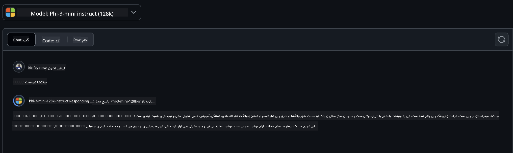
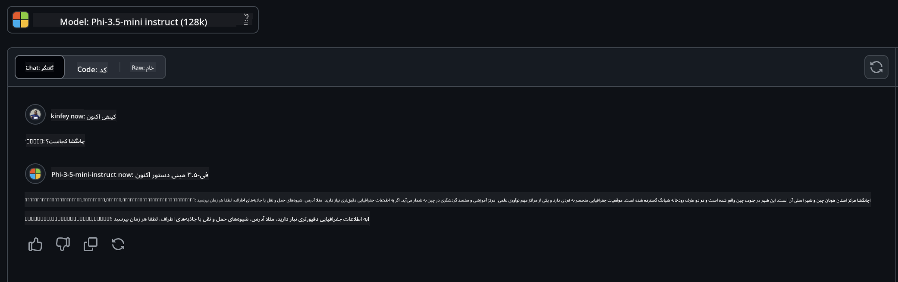

<!--
CO_OP_TRANSLATOR_METADATA:
{
  "original_hash": "124ad36cfe96f74038811b6e2bb93e9d",
  "translation_date": "2025-06-26T01:36:28+00:00",
  "source_file": "19-slm/README.md",
  "language_code": "fa"
}
-->
# مقدمه‌ای بر مدل‌های زبانی کوچک برای هوش مصنوعی مولد برای مبتدیان
هوش مصنوعی مولد یک حوزه جذاب از هوش مصنوعی است که بر ایجاد سیستم‌هایی تمرکز دارد که قادر به تولید محتوای جدید هستند. این محتوا می‌تواند از متن و تصاویر تا موسیقی و حتی محیط‌های مجازی کامل باشد. یکی از کاربردهای هیجان‌انگیز هوش مصنوعی مولد در حوزه مدل‌های زبانی است.
## مدل‌های زبانی کوچک چیستند؟
مدل زبانی کوچک (SLM) نمایانگر یک نوع کوچک‌تر از مدل زبانی بزرگ (LLM) است که بسیاری از اصول معماری و تکنیک‌های LLM‌ها را بهره‌برداری می‌کند، در حالی که ردپای محاسباتی به‌طور قابل توجهی کاهش یافته است. SLM‌ها یک زیرمجموعه از مدل‌های زبانی هستند که برای تولید متن شبیه به انسان طراحی شده‌اند. برخلاف نمونه‌های بزرگ‌تر خود، مانند GPT-4، SLM‌ها بیشتر فشرده و کارآمد هستند و برای کاربردهایی که منابع محاسباتی محدود هستند ایده‌آل هستند. با وجود اندازه کوچک‌تر، آن‌ها هنوز می‌توانند وظایف مختلفی را انجام دهند. معمولاً، SLM‌ها با فشرده‌سازی یا استخراج LLM‌ها ساخته می‌شوند، با هدف حفظ بخش قابل توجهی از عملکرد و قابلیت‌های زبانی مدل اصلی. این کاهش اندازه مدل پیچیدگی کلی را کاهش می‌دهد و SLM‌ها را از نظر استفاده از حافظه و نیازهای محاسباتی کارآمدتر می‌کند. با وجود این بهینه‌سازی‌ها، SLM‌ها هنوز می‌توانند طیف گسترده‌ای از وظایف پردازش زبان طبیعی (NLP) را انجام دهند:
- تولید متن: ایجاد جملات یا پاراگراف‌های هماهنگ و مرتبط با زمینه.
- تکمیل متن: پیش‌بینی و تکمیل جملات بر اساس یک پیام داده شده.
- ترجمه: تبدیل متن از یک زبان به زبان دیگر.
- خلاصه‌سازی: فشرده‌سازی قطعات طولانی متن به خلاصه‌های کوتاه‌تر و قابل هضم‌تر.
البته با برخی مبادلات در عملکرد یا عمق درک نسبت به نمونه‌های بزرگ‌تر خود.
## مدل‌های زبانی کوچک چگونه کار می‌کنند؟
SLM‌ها بر روی مقدار زیادی از داده‌های متنی آموزش داده می‌شوند. در طول آموزش، آن‌ها الگوها و ساختارهای زبان را یاد می‌گیرند و به آن‌ها اجازه می‌دهند متنی تولید کنند که از نظر گرامری صحیح و مناسب با زمینه باشد. فرآیند آموزش شامل مراحل زیر است:
- جمع‌آوری داده‌ها: جمع‌آوری مجموعه‌های داده بزرگ از متن از منابع مختلف.
- پیش‌پردازش: پاکسازی و سازماندهی داده‌ها برای مناسب‌سازی آن‌ها برای آموزش.
- آموزش: استفاده از الگوریتم‌های یادگیری ماشین برای آموزش مدل به نحوه درک و تولید متن.
- تنظیم دقیق: تنظیم مدل برای بهبود عملکرد آن در وظایف خاص.
توسعه SLM‌ها با نیاز فزاینده به مدل‌هایی که می‌توانند در محیط‌های محدود به منابع، مانند دستگاه‌های موبایل یا پلتفرم‌های محاسباتی لبه‌ای، که LLM‌های کامل ممکن است به دلیل نیازهای سنگین منابع غیرعملی باشند، هماهنگ است. با تمرکز بر کارایی، SLM‌ها عملکرد را با دسترسی متعادل می‌کنند و امکان کاربرد گسترده‌تر در حوزه‌های مختلف را فراهم می‌آورند.
## اهداف یادگیری
در این درس، امیدواریم دانش SLM را معرفی کنیم و آن را با Microsoft Phi-3 ترکیب کنیم تا سناریوهای مختلف در محتوای متن، دید و MoE را یاد بگیریم. تا پایان این درس، شما باید بتوانید به سوالات زیر پاسخ دهید:
- SLM چیست؟
- تفاوت SLM و LLM چیست؟
- خانواده Microsoft Phi-3/3.5 چیست؟
- چگونه استنتاج خانواده Microsoft Phi-3/3.5 را انجام دهیم؟
آماده‌اید؟ بیایید شروع کنیم.
## تفاوت‌های بین مدل‌های زبانی بزرگ (LLM) و مدل‌های زبانی کوچک (SLM)
هم LLM‌ها و هم SLM‌ها بر اساس اصول بنیادی یادگیری ماشین احتمالی ساخته شده‌اند و رویکردهای مشابهی در طراحی معماری، روش‌های آموزشی، فرآیندهای تولید داده و تکنیک‌های ارزیابی مدل دنبال می‌کنند. با این حال، چندین عامل کلیدی این دو نوع مدل را متمایز می‌کند.
## کاربردهای مدل‌های زبانی کوچک
SLM‌ها دارای کاربردهای گسترده‌ای هستند، از جمله:
- چت‌بات‌ها: ارائه پشتیبانی مشتری و تعامل با کاربران به صورت مکالمه‌ای.
- تولید محتوا: کمک به نویسندگان با تولید ایده‌ها یا حتی نوشتن مقالات کامل.
- آموزش: کمک به دانش‌آموزان در وظایف نوشتن یا یادگیری زبان‌های جدید.
- دسترسی‌پذیری: ایجاد ابزارهایی برای افراد با معلولیت‌ها، مانند سیستم‌های تبدیل متن به گفتار.
**اندازه**
تمایز اصلی بین LLM‌ها و SLM‌ها در مقیاس مدل‌ها نهفته است. LLM‌ها، مانند ChatGPT (GPT-4)، می‌توانند حدود 1.76 تریلیون پارامتر داشته باشند، در حالی که SLM‌های منبع باز مانند Mistral 7B با پارامترهای به‌طور قابل توجهی کمتر طراحی شده‌اند—تقریباً 7 میلیارد. این تفاوت عمدتاً به تفاوت‌های معماری مدل و فرآیندهای آموزشی مربوط می‌شود. برای مثال، ChatGPT از مکانیزم توجه خود در چارچوب رمزگذار-رمزگشا استفاده می‌کند، در حالی که Mistral 7B از توجه به پنجره لغزنده استفاده می‌کند که امکان آموزش کارآمدتر در مدل فقط رمزگشا را فراهم می‌آورد. این تفاوت معماری تأثیرات عمیقی بر پیچیدگی و عملکرد این مدل‌ها دارد.
**درک**
SLM‌ها معمولاً برای عملکرد در حوزه‌های خاص بهینه‌سازی شده‌اند، که آن‌ها را بسیار تخصصی می‌کند اما ممکن است در توانایی ارائه درک گسترده زمینه‌ای در سراسر حوزه‌های مختلف دانش محدود باشند. در مقابل، LLM‌ها به دنبال شبیه‌سازی هوش انسانی در سطح جامع‌تر هستند. بر روی مجموعه‌های داده بزرگ و متنوع آموزش داده شده‌اند، LLM‌ها برای عملکرد خوب در طیف گسترده‌ای از حوزه‌ها طراحی شده‌اند و تطبیق‌پذیری و سازگاری بیشتری را ارائه می‌دهند. به همین دلیل، LLM‌ها برای مجموعه گسترده‌تری از وظایف پایین‌دستی، مانند پردازش زبان طبیعی و برنامه‌نویسی، مناسب‌تر هستند.
**محاسبات**
آموزش و استقرار LLM‌ها فرآیندهای پرمنبع هستند که اغلب به زیرساخت‌های محاسباتی قابل توجهی نیاز دارند، از جمله خوشه‌های GPU بزرگ‌مقیاس. برای مثال، آموزش مدلی مانند ChatGPT از ابتدا ممکن است به هزاران GPU در طول دوره‌های طولانی نیاز داشته باشد. در مقابل، SLM‌ها، با شمار پارامترهای کمتر خود، از نظر منابع محاسباتی دسترسی‌پذیرتر هستند. مدل‌هایی مانند Mistral 7B می‌توانند بر روی ماشین‌های محلی با قابلیت‌های GPU متوسط آموزش داده شوند و اجرا شوند، هرچند آموزش هنوز به چندین ساعت در چندین GPU نیاز دارد.
**تعصب**
تعصب یک مسئله شناخته شده در LLM‌ها است، عمدتاً به دلیل ماهیت داده‌های آموزشی. این مدل‌ها اغلب به داده‌های خام و آزادانه در دسترس از اینترنت متکی هستند، که ممکن است گروه‌های خاصی را کمتر نمایندگی کنند یا نادرست نمایندگی کنند، برچسب‌گذاری نادرست را معرفی کنند یا تعصب‌های زبانی تحت تأثیر گویش، تغییرات جغرافیایی و قوانین گرامری را منعکس کنند. علاوه بر این، پیچیدگی معماری‌های LLM می‌تواند به‌طور ناخواسته تعصب را تشدید کند، که ممکن است بدون تنظیم دقیق دقیق ناشناخته باقی بماند. از سوی دیگر، SLM‌ها، که بر روی مجموعه‌های داده محدودتر و خاص حوزه آموزش داده می‌شوند، به‌طور ذاتی کمتر به چنین تعصب‌هایی حساس هستند، هرچند از آن‌ها مصون نیستند.
**استنتاج**
اندازه کاهش‌یافته SLM‌ها به آن‌ها یک مزیت قابل توجه از نظر سرعت استنتاج می‌دهد و به آن‌ها اجازه می‌دهد تا به‌طور کارآمد بر روی سخت‌افزار محلی بدون نیاز به پردازش موازی گسترده خروجی‌ها را تولید کنند. در مقابل، LLM‌ها، به دلیل اندازه و پیچیدگی خود، اغلب به منابع محاسباتی موازی قابل توجهی نیاز دارند تا زمان‌های استنتاج قابل قبول را به دست آورند. حضور کاربران همزمان متعدد زمان‌های پاسخ LLM‌ها را بیشتر کند می‌کند، به ویژه هنگامی که در مقیاس بزرگ مستقر می‌شوند.
در خلاصه، در حالی که هم LLM‌ها و هم SLM‌ها یک پایه اساسی در یادگیری ماشین دارند، آن‌ها از نظر اندازه مدل، نیازهای منابع، درک زمینه‌ای، حساسیت به تعصب و سرعت استنتاج به‌طور قابل توجهی متفاوت هستند. این تفاوت‌ها منعکس‌کننده مناسب بودن آن‌ها برای موارد استفاده مختلف است، با LLM‌ها که تطبیق‌پذیری بیشتری دارند اما منابع سنگین‌تر هستند، و SLM‌ها که کارایی خاص حوزه بیشتری را با نیازهای محاسباتی کاهش‌یافته ارائه می‌دهند.
## معرفی خانواده Phi-3 / Phi-3.5
خانواده Phi-3 / 3.5 عمدتاً هدف‌گذاری سناریوهای کاربردی متن، دید و عامل (MoE) را دارد:
### Phi-3 / 3.5 Instruct
عمدتاً برای تولید متن، تکمیل چت، و استخراج اطلاعات محتوا، و غیره.
**Phi-3-mini**
مدل زبان 3.8B در Microsoft Azure AI Studio، Hugging Face، و Ollama در دسترس است. مدل‌های Phi-3 به‌طور قابل توجهی مدل‌های زبانی با اندازه برابر و بزرگ‌تر را در معیارهای کلیدی بهتر می‌کنند (به اعداد معیار زیر نگاه کنید، اعداد بالاتر بهتر هستند). Phi-3-mini مدل‌هایی را که دو برابر اندازه آن هستند بهتر می‌کند، در حالی که Phi-3-small و Phi-3-medium مدل‌های بزرگ‌تر، از جمله GPT-3.5 را بهتر می‌کنند.
**Phi-3-small & medium**
با فقط 7B پارامتر، Phi-3-small GPT-3.5T را در انواع معیارهای زبان، استدلال، کدنویسی، و ریاضی شکست می‌دهد. Phi-3-medium با 14B پارامتر این روند را ادامه می‌دهد و Gemini 1.0 Pro را بهتر می‌کند.
**Phi-3.5-mini**
می‌توانیم آن را به‌عنوان ارتقاء Phi-3-mini در نظر بگیریم. در حالی که پارامترها تغییر نمی‌کنند، توانایی پشتیبانی از چندین زبان را بهبود می‌بخشد (پشتیبانی از 20+ زبان: عربی، چینی، چکی، دانمارکی، هلندی، انگلیسی، فنلاندی، فرانسوی، آلمانی، عبری، مجاری، ایتالیایی، ژاپنی، کره‌ای، نروژی، لهستانی، پرتغالی، روسی، اسپانیایی، سوئدی، تایلندی، ترکی، اوکراینی) و پشتیبانی قوی‌تر از زمینه طولانی را اضافه می‌کند. Phi-3.5-mini با 3.8B پارامتر مدل‌های زبانی با همان اندازه را بهتر می‌کند و با مدل‌هایی که دو برابر اندازه آن هستند برابر است.
### Phi-3 / 3.5 Vision
می‌توانیم مدل Instruct Phi-3/3.5 را به‌عنوان توانایی Phi برای درک در نظر بگیریم و Vision چیزی است که به Phi چشم‌ها می‌دهد تا جهان را درک کند.
**Phi-3-Vision**
Phi-3-vision، با فقط 4.2B پارامتر، این روند را ادامه می‌دهد و مدل‌های بزرگ‌تر مانند Claude-3 Haiku و Gemini 1.0 Pro V را در وظایف استدلال بصری عمومی، OCR، و وظایف درک جدول و نمودار بهتر می‌کند.
**Phi-3.5-Vision**
Phi-3.5-Vision نیز یک ارتقاء از Phi-3-Vision است و پشتیبانی از چندین تصویر را اضافه می‌کند. می‌توانید آن را به‌عنوان بهبود در دید در نظر بگیرید، نه تنها می‌توانید تصاویر را ببینید، بلکه ویدیوها را نیز می‌توانید ببینید. Phi-3.5-vision مدل‌های بزرگ‌تر مانند Claude-3.5 Sonnet و Gemini 1.5 Flash را در OCR، وظایف درک جدول و نمودار و در وظایف استدلال دانش بصری عمومی بهتر می‌کند. پشتیبانی از ورودی چندفریم، یعنی انجام استدلال بر روی تصاویر ورودی متعدد.
### Phi-3.5-MoE
***مخلوطی از متخصصان (MoE)*** به مدل‌ها اجازه می‌دهد با محاسبات بسیار کمتر پیش‌آموزش داده شوند، که به این معنی است که می‌توانید اندازه مدل یا مجموعه داده را به‌طور چشمگیری با همان بودجه محاسباتی به‌عنوان یک مدل متراکم افزایش دهید. به‌ویژه، یک مدل MoE باید کیفیت مشابهی را به‌عنوان همتای متراکم خود بسیار سریع‌تر در طول پیش‌آموزش به دست آورد. Phi-3.5-MoE شامل 16x3.8B ماژول‌های متخصص است. Phi-3.5-MoE با فقط 6.6B پارامتر فعال سطح مشابهی از استدلال، درک زبان، و ریاضی را به‌عنوان مدل‌های بسیار بزرگ‌تر به دست می‌آورد.
ما می‌توانیم از مدل خانواده Phi-3/3.5 بر اساس سناریوهای مختلف استفاده کنیم. برخلاف LLM، می‌توانید Phi-3/3.5-mini یا Phi-3/3.5-Vision را بر روی دستگاه‌های لبه‌ای مستقر کنید.
## چگونه از مدل‌های خانواده Phi-3/3.5 استفاده کنیم
امیدواریم از Phi-3/3.5 در سناریوهای مختلف استفاده کنیم. بعدی، ما از Phi-3/3.5 بر اساس سناریوهای مختلف استفاده خواهیم کرد.
مدل‌ها مستقیم‌ترین راه هستند. شما می‌توانید به سرعت از طریق GitHub Models به مدل Phi-3/3.5-Instruct دسترسی پیدا کنید. با ترکیب با Azure AI Inference SDK / OpenAI SDK، می‌توانید از طریق کد به API دسترسی پیدا کنید تا فراخوانی Phi-3/3.5-Instruct را تکمیل کنید. همچنین می‌توانید اثرات مختلف را از طریق Playground آزمایش کنید. - دمو: مقایسه اثرات Phi-3-mini و Phi-3.5-mini در سناریوهای چینی   **Azure AI Studio** یا اگر می‌خواهیم از مدل‌های vision و MoE استفاده کنیم، می‌توانید از Azure AI Studio برای تکمیل فراخوانی استفاده کنید. اگر علاقه‌مند هستید، می‌توانید کتاب آشپزی Phi-3 را بخوانید تا بیاموزید چگونه Phi-3/3.5 Instruct، Vision، MoE را از طریق Azure AI Studio فراخوانی کنید [برای خواندن بیشتر اینجا کلیک کنید](https://github.com/microsoft/Phi-3CookBook/blob/main/md/02.QuickStart/AzureAIStudio_QuickStart.md?WT.mc_id=academic-105485-koreyst) **NVIDIA NIM** علاوه بر راه‌حل‌های کاتالوگ مدل مبتنی بر ابر که توسط Azure و GitHub ارائه می‌شود، می‌توانید از [Nivida NIM](https://developer.nvidia.com/nim?WT.mc_id=academic-105485-koreyst) برای تکمیل فراخوانی‌های مرتبط استفاده کنید. می‌توانید به NIVIDA NIM مراجعه کنید تا فراخوانی‌های API خانواده Phi-3/3.5 را تکمیل کنید. NVIDIA NIM (NVIDIA Inference Microservices) مجموعه‌ای از میکروسرویس‌های استنتاج تسریع شده است که برای کمک به توسعه‌دهندگان در استقرار مدل‌های AI به صورت کارآمد در محیط‌های مختلف، از جمله ابرها، مراکز داده و ایستگاه‌های کاری طراحی شده است. در اینجا برخی از ویژگی‌های کلیدی NVIDIA NIM آورده شده است: - **سهولت استقرار:** NIM اجازه می‌دهد مدل‌های AI با یک فرمان استقرار یابند و ادغام آن در جریان‌های کاری موجود را ساده می‌کند. - **عملکرد بهینه‌سازی شده:** از موتورهای استنتاج پیش‌بهینه‌سازی شده NVIDIA مانند TensorRT و TensorRT-LLM استفاده می‌کند تا تاخیر کم و گذردهی بالا را تضمین کند. - **مقیاس‌پذیری:** NIM از مقیاس‌پذیری خودکار در Kubernetes پشتیبانی می‌کند و به آن امکان می‌دهد به صورت مؤثر با بارهای کاری متغیر برخورد کند. - **امنیت و کنترل:** سازمان‌ها می‌توانند با میزبانی خود از میکروسرویس‌های NIM در زیرساخت مدیریت شده خود، کنترل داده‌ها و برنامه‌های خود را حفظ کنند. - **APIهای استاندارد:** NIM APIهای استاندارد صنعتی ارائه می‌دهد که ساخت و ادغام برنامه‌های AI مانند چت‌بات‌ها، دستیارهای AI و موارد دیگر را آسان می‌کند. NIM بخشی از NVIDIA AI Enterprise است که هدف آن ساده‌سازی استقرار و عملیاتی‌سازی مدل‌های AI است و اطمینان می‌دهد که آنها به صورت کارآمد بر روی GPUهای NVIDIA اجرا می‌شوند. - دمو: استفاده از Nividia NIM برای فراخوانی Phi-3.5-Vision-API [[برای خواندن بیشتر اینجا کلیک کنید](../../../19-slm/python/Phi-3-Vision-Nividia-NIM.ipynb)] ### استنتاج Phi-3/3.5 در محیط محلی استنتاج در رابطه با Phi-3، یا هر مدل زبانی مانند GPT-3، به فرآیند تولید پاسخ‌ها یا پیش‌بینی‌ها بر اساس ورودی که دریافت می‌کند اشاره دارد. وقتی یک پرسش یا سوال به Phi-3 ارائه می‌دهید، از شبکه عصبی آموزش دیده خود برای استنتاج پاسخ‌های محتمل و مرتبط با تحلیل الگوها و روابط در داده‌هایی که بر روی آنها آموزش دیده استفاده می‌کند. **Hugging Face Transformer** Hugging Face Transformers یک کتابخانه قدرتمند طراحی شده برای پردازش زبان طبیعی (NLP) و سایر وظایف یادگیری ماشین است. در اینجا برخی از نکات کلیدی درباره آن آورده شده است: 1. **مدل‌های از پیش آموزش‌دیده:** هزاران مدل از پیش آموزش‌دیده را ارائه می‌دهد که می‌توانند برای وظایف مختلفی مانند طبقه‌بندی متن، تشخیص موجودیت‌های نام‌دار، پاسخ به سوالات، خلاصه‌سازی، ترجمه و تولید متن استفاده شوند. 2. **سازگاری با چارچوب‌ها:** این کتابخانه از چندین چارچوب یادگیری عمیق، از جمله PyTorch، TensorFlow و JAX پشتیبانی می‌کند. این امکان را می‌دهد که یک مدل را در یک چارچوب آموزش دهید و در دیگری استفاده کنید. 3. **قابلیت‌های چندوجهی:** علاوه بر NLP، Hugging Face Transformers از وظایف در بینایی کامپیوتری (مثلاً طبقه‌بندی تصویر، تشخیص اشیا) و پردازش صوتی (مثلاً تشخیص گفتار، طبقه‌بندی صوتی) نیز پشتیبانی می‌کند. 4. **سهولت استفاده:** این کتابخانه APIها و ابزارهایی را برای دانلود و تنظیم مدل‌ها به راحتی ارائه می‌دهد، و آن را برای مبتدیان و کارشناسان قابل دسترسی می‌کند. 5. **جامعه و منابع:** Hugging Face دارای جامعه‌ای پویا و مستندات گسترده، آموزش‌ها و راهنماهایی است که به کاربران کمک می‌کند شروع به کار کنند و بیشترین استفاده را از کتابخانه ببرند. [مستندات رسمی](https://huggingface.co/docs/transformers/index?WT.mc_id=academic-105485-koreyst) یا [مخزن GitHub آنها](https://github.com/huggingface/transformers?WT.mc_id=academic-105485-koreyst). این روش به طور گسترده استفاده می‌شود، اما همچنین نیاز به تسریع GPU دارد. در نهایت، صحنه‌هایی مانند Vision و MoE نیاز به محاسبات زیادی دارند که در صورت عدم کمیت، در CPU بسیار محدود خواهند بود. - دمو: استفاده از Transformer برای فراخوانی Phi-3.5-Instuct [برای خواندن بیشتر اینجا کلیک کنید](../../../19-slm/python/phi35-instruct-demo.ipynb) - دمو: استفاده از Transformer برای فراخوانی Phi-3.5-Vision[برای خواندن بیشتر اینجا کلیک کنید](../../../19-slm/python/phi35-vision-demo.ipynb) - دمو: استفاده از Transformer برای فراخوانی Phi-3.5-MoE[برای خواندن بیشتر اینجا کلیک کنید](../../../19-slm/python/phi35_moe_demo.ipynb) **Ollama** [Ollama](https://ollama.com/?WT.mc_id=academic-105485-koreyst) پلتفرمی است که برای آسان‌تر کردن اجرای مدل‌های زبان بزرگ (LLMs) به صورت محلی بر روی دستگاه شما طراحی شده است. از مدل‌های مختلفی مانند Llama 3.1، Phi 3، Mistral و Gemma 2 پشتیبانی می‌کند. این پلتفرم فرآیند را با بسته‌بندی وزن‌های مدل، پیکربندی و داده‌ها در یک بسته واحد ساده می‌کند و آن را برای کاربران قابل دسترسی‌تر می‌کند تا مدل‌های خود را سفارشی و ایجاد کنند. Ollama برای macOS، Linux و Windows در دسترس است. این ابزار عالی است اگر به دنبال آزمایش یا استقرار LLMها بدون تکیه بر خدمات ابری هستید. Ollama مستقیم‌ترین راه است، شما فقط نیاز به اجرای عبارت زیر دارید. ```bash

ollama run phi3.5

``` **ONNX Runtime برای GenAI** [ONNX Runtime](https://github.com/microsoft/onnxruntime-genai?WT.mc_id=academic-105485-koreyst) یک شتاب‌دهنده یادگیری ماشین برای استنتاج و آموزش چندپلتفرمی است. ONNX Runtime برای Generative AI (GENAI) یک ابزار قدرتمند است که به شما کمک می‌کند مدل‌های AI تولیدی را به صورت کارآمد در پلتفرم‌های مختلف اجرا کنید. ## ONNX Runtime چیست؟ ONNX Runtime یک پروژه منبع باز است که امکان استنتاج با عملکرد بالا از مدل‌های یادگیری ماشین را فراهم می‌کند. از مدل‌ها در فرمت Open Neural Network Exchange (ONNX) پشتیبانی می‌کند، که استانداردی برای نمایش مدل‌های یادگیری ماشین است. استنتاج ONNX Runtime می‌تواند تجربه‌های مشتری را سریع‌تر و هزینه‌ها را کاهش دهد، و از مدل‌های چارچوب‌های یادگیری عمیق مانند PyTorch و TensorFlow/Keras و همچنین کتابخانه‌های یادگیری ماشین کلاسیک مانند scikit-learn، LightGBM، XGBoost و غیره پشتیبانی می‌کند. ONNX Runtime با سخت‌افزار، درایورها و سیستم‌عامل‌های مختلف سازگار است و با استفاده از شتاب‌دهنده‌های سخت‌افزاری در صورت لزوم، همراه با بهینه‌سازی‌ها و تبدیل‌های گرافی، عملکرد بهینه را فراهم می‌کند. ## AI تولیدی چیست؟ AI تولیدی به سیستم‌های AI اشاره دارد که می‌توانند محتوای جدیدی مانند متن، تصاویر یا موسیقی را بر اساس داده‌هایی که بر روی آنها آموزش دیده‌اند تولید کنند. نمونه‌هایی شامل مدل‌های زبانی مانند GPT-3 و مدل‌های تولید تصویر مانند Stable Diffusion است. کتابخانه ONNX Runtime برای GenAI حلقه AI تولیدی را برای مدل‌های ONNX فراهم می‌کند، از جمله استنتاج با ONNX Runtime، پردازش logits، جستجو و نمونه‌گیری، و مدیریت کش KV. ## ONNX Runtime برای GENAI ONNX Runtime برای GENAI قابلیت‌های ONNX Runtime را برای پشتیبانی از مدل‌های AI تولیدی گسترش می‌دهد. در اینجا برخی از ویژگی‌های کلیدی آورده شده است: - **پشتیبانی گسترده از پلتفرم:** بر روی پلتفرم‌های مختلفی مانند Windows، Linux، macOS، Android و iOS کار می‌کند. - **پشتیبانی از مدل:** از بسیاری از مدل‌های AI تولیدی محبوب، مانند LLaMA، GPT-Neo، BLOOM و غیره پشتیبانی می‌کند. - **بهینه‌سازی عملکرد:** شامل بهینه‌سازی‌هایی برای شتاب‌دهنده‌های سخت‌افزاری مختلف مانند GPUهای NVIDIA، GPUهای AMD و غیره است. - **سهولت استفاده:** APIهایی برای ادغام آسان در برنامه‌ها ارائه می‌دهد، که به شما امکان می‌دهد متن، تصاویر و سایر محتوا را با کمترین کد تولید کنید. - کاربران می‌توانند یک متد تولید سطح بالا generate() را فراخوانی کنند، یا هر تکرار مدل را در یک حلقه اجرا کنند، یک توکن در یک زمان تولید کنند و به صورت اختیاری پارامترهای تولید را در داخل حلقه به‌روزرسانی کنند. - ONNX Runtime همچنین از جستجوی حریصانه/پرتو و نمونه‌گیری TopP، TopK برای تولید توالی‌های توکن و پردازش logits داخلی مانند جریمه‌های تکرار پشتیبانی می‌کند. شما همچنین می‌توانید به راحتی امتیازدهی سفارشی اضافه کنید. ## شروع کار برای شروع کار با ONNX Runtime برای GENAI، می‌توانید این مراحل را دنبال کنید: ### نصب ONNX Runtime: ```Python
pip install onnxruntime
``` ### نصب افزونه‌های AI تولیدی: ```Python
pip install onnxruntime-genai
``` ### اجرای یک مدل: در اینجا یک مثال ساده در پایتون آمده است: ```Python
import onnxruntime_genai as og

model = og.Model('path_to_your_model.onnx')

tokenizer = og.Tokenizer(model)

input_text = "Hello, how are you?"

input_tokens = tokenizer.encode(input_text)

output_tokens = model.generate(input_tokens)

output_text = tokenizer.decode(output_tokens)

print(output_text) 
``` ### دمو: استفاده از ONNX Runtime GenAI برای فراخوانی Phi-3.5-Vision ```python

import onnxruntime_genai as og

model_path = './Your Phi-3.5-vision-instruct ONNX Path'

img_path = './Your Image Path'

model = og.Model(model_path)

processor = model.create_multimodal_processor()

tokenizer_stream = processor.create_stream()

text = "Your Prompt"

prompt = "<|user|>\n"

prompt += "<|image_1|>\n"

prompt += f"{text}<|end|>\n"

prompt += "<|assistant|>\n"

image = og.Images.open(img_path)

inputs = processor(prompt, images=image)

params = og.GeneratorParams(model)

params.set_inputs(inputs)

params.set_search_options(max_length=3072)

generator = og.Generator(model, params)

while not generator.is_done():

    generator.compute_logits()
    
    generator.generate_next_token()

    new_token = generator.get_next_tokens()[0]
    
    code += tokenizer_stream.decode(new_token)
    
    print(tokenizer_stream.decode(new_token), end='', flush=True)

``` **دیگران** علاوه بر روش‌های مرجع ONNX Runtime و Ollama، می‌توانیم مرجع مدل‌های کمی را بر اساس روش‌های مرجع مدل ارائه شده توسط تولیدکنندگان مختلف تکمیل کنیم. مانند چارچوب Apple MLX با Apple Metal، Qualcomm QNN با NPU، Intel OpenVINO با CPU/GPU و غیره. شما همچنین می‌توانید محتوای بیشتری از [کتاب آشپزی Phi-3](https://github.com/microsoft/phi-3cookbook?WT.mc_id=academic-105485-koreyst) دریافت کنید. ## بیشتر ما اصول خانواده Phi-3/3.5 را یاد گرفته‌ایم، اما برای یادگیری بیشتر درباره SLM به دانش بیشتری نیاز داریم. شما می‌توانید پاسخ‌ها را در کتاب آشپزی Phi-3 پیدا کنید. اگر می‌خواهید بیشتر بیاموزید، لطفاً به [کتاب آشپزی Phi-3](https://github.com/microsoft/phi-3cookbook?WT.mc_id=academic-105485-koreyst) مراجعه کنید.

**سلب مسئولیت**:  
این سند با استفاده از سرویس ترجمه هوش مصنوعی [Co-op Translator](https://github.com/Azure/co-op-translator) ترجمه شده است. در حالی که ما برای دقت تلاش می‌کنیم، لطفاً توجه داشته باشید که ترجمه‌های خودکار ممکن است حاوی خطاها یا نادرستی‌ها باشند. سند اصلی به زبان مادری آن باید به عنوان منبع معتبر در نظر گرفته شود. برای اطلاعات حیاتی، ترجمه انسانی حرفه‌ای توصیه می‌شود. ما در قبال هرگونه سوء تفاهم یا تفسیر نادرست ناشی از استفاده از این ترجمه مسئولیتی نداریم.