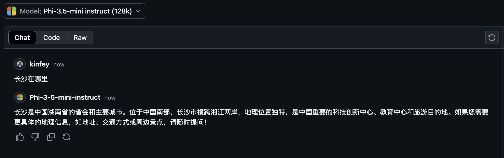

<!--
CO_OP_TRANSLATOR_METADATA:
{
  "original_hash": "124ad36cfe96f74038811b6e2bb93e9d",
  "translation_date": "2025-07-09T18:17:02+00:00",
  "source_file": "19-slm/README.md",
  "language_code": "fa"
}
-->
# مقدمه‌ای بر مدل‌های زبانی کوچک برای هوش مصنوعی مولد برای مبتدیان  
هوش مصنوعی مولد حوزه‌ای جذاب از هوش مصنوعی است که بر ایجاد سیستم‌هایی تمرکز دارد که قادر به تولید محتوای جدید باشند. این محتوا می‌تواند شامل متن، تصویر، موسیقی و حتی محیط‌های مجازی کامل باشد. یکی از هیجان‌انگیزترین کاربردهای هوش مصنوعی مولد، در حوزه مدل‌های زبانی است.

## مدل‌های زبانی کوچک چیستند؟  
مدل زبانی کوچک (SLM) نسخه‌ای کوچک‌تر و فشرده‌تر از مدل زبانی بزرگ (LLM) است که بسیاری از اصول معماری و تکنیک‌های LLM را به کار می‌گیرد، اما با مصرف محاسباتی بسیار کمتر.

SLMها زیرمجموعه‌ای از مدل‌های زبانی هستند که برای تولید متن شبیه به انسان طراحی شده‌اند. برخلاف نمونه‌های بزرگ‌تر مانند GPT-4، SLMها جمع‌وجورتر و کارآمدترند و برای کاربردهایی که منابع محاسباتی محدود است، ایده‌آل هستند. با وجود اندازه کوچکتر، آن‌ها قادر به انجام طیف وسیعی از وظایف هستند. معمولاً SLMها با فشرده‌سازی یا تقطیر LLMها ساخته می‌شوند تا بخش قابل توجهی از عملکرد و قابلیت‌های زبانی مدل اصلی حفظ شود. این کاهش اندازه مدل، پیچیدگی کلی را کم می‌کند و باعث می‌شود SLMها از نظر مصرف حافظه و نیازهای محاسباتی بهینه‌تر باشند. با وجود این بهینه‌سازی‌ها، SLMها می‌توانند طیف گسترده‌ای از وظایف پردازش زبان طبیعی (NLP) را انجام دهند:

- تولید متن: ایجاد جملات یا پاراگراف‌های منسجم و مرتبط با زمینه.
- تکمیل متن: پیش‌بینی و تکمیل جملات بر اساس یک متن اولیه.
- ترجمه: تبدیل متن از یک زبان به زبان دیگر.
- خلاصه‌سازی: کوتاه کردن متن‌های طولانی به خلاصه‌های قابل فهم‌تر.

البته با برخی مصالحه‌ها در عملکرد یا عمق درک نسبت به نمونه‌های بزرگ‌تر.

## مدل‌های زبانی کوچک چگونه کار می‌کنند؟  
SLMها بر روی حجم زیادی از داده‌های متنی آموزش می‌بینند. در طول آموزش، آن‌ها الگوها و ساختارهای زبان را یاد می‌گیرند تا بتوانند متنی تولید کنند که هم از نظر گرامری صحیح و هم از نظر زمینه‌ای مناسب باشد. فرایند آموزش شامل موارد زیر است:

- جمع‌آوری داده: گردآوری مجموعه‌های بزرگی از متن از منابع مختلف.
- پیش‌پردازش: پاک‌سازی و سازماندهی داده‌ها برای آماده‌سازی آموزش.
- آموزش: استفاده از الگوریتم‌های یادگیری ماشین برای آموزش مدل به درک و تولید متن.
- تنظیم دقیق: بهبود عملکرد مدل در وظایف خاص.

توسعه SLMها با نیاز روزافزون به مدل‌هایی که در محیط‌های با منابع محدود مانند دستگاه‌های موبایل یا پلتفرم‌های محاسبات لبه‌ای قابل استفاده باشند، همسو است؛ جایی که استفاده از LLMهای کامل به دلیل مصرف بالای منابع عملی نیست. با تمرکز بر کارایی، SLMها تعادلی بین عملکرد و دسترسی ایجاد می‌کنند و امکان کاربرد گسترده‌تر در حوزه‌های مختلف را فراهم می‌آورند.


## اهداف یادگیری  
در این درس، قصد داریم دانش مربوط به SLM را معرفی کنیم و آن را با Microsoft Phi-3 ترکیب کنیم تا سناریوهای مختلف در محتواهای متنی، بینایی و MoE را بیاموزیم.

در پایان این درس، باید قادر باشید به سوالات زیر پاسخ دهید:

- SLM چیست؟
- تفاوت SLM و LLM چیست؟
- خانواده Microsoft Phi-3/3.5 چیست؟
- چگونه می‌توان از خانواده Microsoft Phi-3/3.5 استنتاج گرفت؟

آماده‌اید؟ بیایید شروع کنیم.

## تفاوت‌های مدل‌های زبانی بزرگ (LLM) و مدل‌های زبانی کوچک (SLM)  
هر دو مدل LLM و SLM بر پایه اصول یادگیری ماشین احتمالاتی ساخته شده‌اند و رویکردهای مشابهی در طراحی معماری، روش‌های آموزش، فرایندهای تولید داده و ارزیابی مدل دارند. اما چند عامل کلیدی این دو نوع مدل را از هم متمایز می‌کند.

## کاربردهای مدل‌های زبانی کوچک  
SLMها کاربردهای گسترده‌ای دارند، از جمله:

- چت‌بات‌ها: ارائه پشتیبانی مشتری و تعامل با کاربران به صورت مکالمه‌ای.
- تولید محتوا: کمک به نویسندگان در تولید ایده‌ها یا حتی نوشتن مقالات کامل.
- آموزش: کمک به دانش‌آموزان در انجام تکالیف نوشتاری یا یادگیری زبان‌های جدید.
- دسترسی‌پذیری: ایجاد ابزارهایی برای افراد دارای معلولیت، مانند سیستم‌های تبدیل متن به گفتار.

**اندازه**  
یکی از تفاوت‌های اصلی بین LLM و SLM در مقیاس مدل‌ها است. LLMها مانند ChatGPT (GPT-4) می‌توانند حدود ۱.۷۶ تریلیون پارامتر داشته باشند، در حالی که SLMهای متن‌باز مانند Mistral 7B با پارامترهای بسیار کمتری طراحی شده‌اند—حدود ۷ میلیارد پارامتر. این اختلاف عمدتاً به تفاوت در معماری مدل و فرایندهای آموزش مربوط می‌شود. برای مثال، ChatGPT از مکانیزم توجه خودکار در چارچوب رمزگذار-رمزگشا استفاده می‌کند، در حالی که Mistral 7B از توجه پنجره‌ای لغزنده بهره می‌برد که آموزش کارآمدتری را در مدل‌های فقط رمزگشا ممکن می‌سازد. این تفاوت معماری تأثیر عمیقی بر پیچیدگی و عملکرد مدل‌ها دارد.

**درک**  
SLMها معمولاً برای عملکرد در حوزه‌های خاص بهینه شده‌اند و بنابراین تخصصی‌تر اما محدودتر در ارائه درک گسترده در زمینه‌های مختلف دانش هستند. در مقابل، LLMها هدفشان شبیه‌سازی هوش انسانی در سطح جامع‌تر است. آن‌ها بر روی مجموعه داده‌های بزرگ و متنوع آموزش دیده‌اند و برای عملکرد خوب در حوزه‌های مختلف طراحی شده‌اند، که انعطاف‌پذیری و سازگاری بیشتری فراهم می‌کند. بنابراین، LLMها برای طیف وسیع‌تری از وظایف پایین‌دستی مانند پردازش زبان طبیعی و برنامه‌نویسی مناسب‌ترند.

**محاسبات**  
آموزش و استقرار LLMها فرایندهای پرهزینه‌ای هستند که معمولاً به زیرساخت‌های محاسباتی گسترده، از جمله خوشه‌های بزرگ GPU نیاز دارند. برای مثال، آموزش مدلی مانند ChatGPT از ابتدا ممکن است به هزاران GPU در طول دوره‌های طولانی نیاز داشته باشد. در مقابل، SLMها با تعداد پارامترهای کمتر، از نظر منابع محاسباتی دسترسی‌پذیرترند. مدل‌هایی مانند Mistral 7B می‌توانند روی ماشین‌های محلی با GPUهای متوسط آموزش و اجرا شوند، هرچند آموزش هنوز چندین ساعت و روی چند GPU طول می‌کشد.

**تعصب**  
تعصب یکی از مشکلات شناخته‌شده در LLMها است که عمدتاً به ماهیت داده‌های آموزشی برمی‌گردد. این مدل‌ها اغلب بر داده‌های خام و آزاد اینترنتی تکیه دارند که ممکن است گروه‌های خاصی را کم‌نمایش دهند یا نادرست نشان دهند، برچسب‌گذاری اشتباه داشته باشند یا تعصبات زبانی ناشی از گویش، تفاوت‌های جغرافیایی و قواعد دستوری را منعکس کنند. علاوه بر این، پیچیدگی معماری LLMها می‌تواند به طور ناخواسته تعصب را تشدید کند که بدون تنظیم دقیق دقیق ممکن است نادیده گرفته شود. از سوی دیگر، SLMها که بر داده‌های محدودتر و حوزه‌محور آموزش دیده‌اند، به طور ذاتی کمتر در معرض چنین تعصباتی هستند، هرچند کاملاً مصون نیستند.

**استنتاج**  
اندازه کوچک‌تر SLMها به آن‌ها مزیت قابل توجهی در سرعت استنتاج می‌دهد و اجازه می‌دهد خروجی‌ها به طور کارآمد روی سخت‌افزار محلی تولید شوند بدون نیاز به پردازش موازی گسترده. در مقابل، LLMها به دلیل اندازه و پیچیدگی، اغلب به منابع محاسباتی موازی قابل توجهی برای دستیابی به زمان‌های استنتاج قابل قبول نیاز دارند. حضور کاربران همزمان متعدد نیز زمان پاسخ‌دهی LLMها را به ویژه در مقیاس بالا کاهش می‌دهد.

خلاصه اینکه، در حالی که هر دو مدل LLM و SLM بر پایه یادگیری ماشین ساخته شده‌اند، تفاوت‌های قابل توجهی در اندازه مدل، نیازهای منابع، درک زمینه‌ای، آسیب‌پذیری در برابر تعصب و سرعت استنتاج دارند. این تفاوت‌ها نشان‌دهنده تناسب آن‌ها برای کاربردهای مختلف است؛ LLMها چندمنظوره‌تر اما پرمصرف‌تر و SLMها کارآمدتر در حوزه‌های خاص با نیازهای محاسباتی کمتر هستند.

***توجه: در این فصل، SLM را با استفاده از Microsoft Phi-3 / 3.5 به عنوان مثال معرفی خواهیم کرد.***

## معرفی خانواده Phi-3 / Phi-3.5  
خانواده Phi-3 / 3.5 عمدتاً برای سناریوهای کاربردی متن، بینایی و Agent (MoE) طراحی شده‌اند:

### Phi-3 / 3.5 Instruct  
عمدتاً برای تولید متن، تکمیل چت و استخراج اطلاعات محتوا و غیره.

**Phi-3-mini**  
مدل زبانی ۳.۸ میلیارد پارامتری که در Microsoft Azure AI Studio، Hugging Face و Ollama در دسترس است. مدل‌های Phi-3 در معیارهای کلیدی به طور قابل توجهی از مدل‌های هم‌رده و بزرگ‌تر بهتر عمل می‌کنند (اعداد معیار را در ادامه ببینید، اعداد بالاتر بهترند). Phi-3-mini از مدل‌هایی با دو برابر اندازه خود بهتر است، در حالی که Phi-3-small و Phi-3-medium از مدل‌های بزرگ‌تر، از جمله GPT-3.5 پیشی می‌گیرند.

**Phi-3-small و medium**  
با تنها ۷ میلیارد پارامتر، Phi-3-small در معیارهای مختلف زبان، استدلال، کدنویسی و ریاضی از GPT-3.5T بهتر عمل می‌کند.

Phi-3-medium با ۱۴ میلیارد پارامتر این روند را ادامه می‌دهد و از Gemini 1.0 Pro پیشی می‌گیرد.

**Phi-3.5-mini**  
می‌توان آن را ارتقاء Phi-3-mini دانست. در حالی که تعداد پارامترها تغییر نکرده، توانایی پشتیبانی از چند زبان را بهبود می‌بخشد (پشتیبانی از بیش از ۲۰ زبان: عربی، چینی، چک، دانمارکی، هلندی، انگلیسی، فنلاندی، فرانسوی، آلمانی، عبری، مجاری، ایتالیایی، ژاپنی، کره‌ای، نروژی، لهستانی، پرتغالی، روسی، اسپانیایی، سوئدی، تایلندی، ترکی، اوکراینی) و پشتیبانی قوی‌تری از متن‌های طولانی اضافه می‌کند.

Phi-3.5-mini با ۳.۸ میلیارد پارامتر از مدل‌های هم‌رده بهتر است و با مدل‌هایی با دو برابر اندازه خود برابری می‌کند.

### Phi-3 / 3.5 Vision  
می‌توان مدل Instruct خانواده Phi-3/3.5 را توانایی درک Phi دانست و Vision همان چیزی است که به Phi چشم می‌دهد تا جهان را بفهمد.

**Phi-3-Vision**  
Phi-3-Vision با تنها ۴.۲ میلیارد پارامتر این روند را ادامه می‌دهد و در وظایف استدلال بصری عمومی، OCR و درک جداول و نمودارها از مدل‌های بزرگ‌تری مانند Claude-3 Haiku و Gemini 1.0 Pro V بهتر عمل می‌کند.

**Phi-3.5-Vision**  
Phi-3.5-Vision نیز ارتقاء Phi-3-Vision است و پشتیبانی از چند تصویر را اضافه می‌کند. می‌توان آن را بهبود در بینایی دانست؛ نه تنها تصاویر بلکه ویدیوها را نیز می‌بیند.

Phi-3.5-Vision در وظایف OCR، درک جداول و نمودارها از مدل‌های بزرگ‌تری مانند Claude-3.5 Sonnet و Gemini 1.5 Flash بهتر است و در استدلال دانش بصری عمومی هم‌رده آن‌هاست. پشتیبانی از ورودی چند فریمی، یعنی استدلال روی چند تصویر ورودی.

### Phi-3.5-MoE  
***Mixture of Experts (MoE)*** امکان آموزش مدل‌ها با محاسبات بسیار کمتر را فراهم می‌کند، که به معنی مقیاس‌پذیری چشمگیر مدل یا اندازه داده‌ها با همان بودجه محاسباتی مدل‌های متراکم است. به طور خاص، مدل MoE باید کیفیت مشابه مدل متراکم را در زمان آموزش بسیار کوتاه‌تری به دست آورد.

Phi-3.5-MoE شامل ۱۶ ماژول خبره ۳.۸ میلیارد پارامتری است. Phi-3.5-MoE با تنها ۶.۶ میلیارد پارامتر فعال، سطح مشابهی از استدلال، درک زبان و ریاضی را با مدل‌های بسیار بزرگ‌تر ارائه می‌دهد.

می‌توانیم از مدل خانواده Phi-3/3.5 بر اساس سناریوهای مختلف استفاده کنیم. برخلاف LLM، می‌توانید Phi-3/3.5-mini یا Phi-3/3.5-Vision را روی دستگاه‌های لبه‌ای مستقر کنید.

## نحوه استفاده از مدل‌های خانواده Phi-3/3.5  
امیدواریم بتوانیم از Phi-3/3.5 در سناریوهای مختلف استفاده کنیم. در ادامه، نحوه استفاده از Phi-3/3.5 بر اساس سناریوهای مختلف را بررسی خواهیم کرد.


### تفاوت استنتاج با API ابری  
**مدل‌های GitHub**  
مدل‌های GitHub ساده‌ترین راه هستند. می‌توانید به سرعت به مدل Phi-3/3.5-Instruct از طریق مدل‌های GitHub دسترسی پیدا کنید. با ترکیب Azure AI Inference SDK / OpenAI SDK، می‌توانید از طریق کد به API دسترسی داشته و فراخوانی Phi-3/3.5-Instruct را انجام دهید. همچنین می‌توانید اثرات مختلف را از طریق Playground آزمایش کنید.

- دمو: مقایسه عملکرد Phi-3-mini و Phi-3.5-mini در سناریوهای چینی




**Azure AI Studio**  
اگر بخواهیم از مدل‌های بینایی و MoE استفاده کنیم، می‌توانیم از Azure AI Studio برای فراخوانی استفاده کنیم. اگر علاقه‌مند هستید، می‌توانید کتابچه Phi-3 را بخوانید تا نحوه فراخوانی Phi-3/3.5 Instruct، Vision، MoE از طریق Azure AI Studio را بیاموزید [روی این لینک کلیک کنید](https://github.com/microsoft/Phi-3CookBook/blob/main/md/02.QuickStart/AzureAIStudio_QuickStart.md?WT.mc_id=academic-105485-koreyst)

**NVIDIA NIM**  
علاوه بر راه‌حل‌های کاتالوگ مدل مبتنی بر ابر ارائه شده توسط Azure و GitHub، می‌توانید از [NVIDIA NIM](https://developer.nvidia.com/nim?WT.mc_id=academic-105485-koreyst) نیز برای انجام فراخوانی‌های مرتبط استفاده کنید. می‌توانید به NVIDIA NIM مراجعه کنید تا فراخوانی‌های API خانواده Phi-3/3.5 را انجام دهید. NVIDIA NIM (NVIDIA Inference Microservices) مجموعه‌ای از میکروسرویس‌های استنتاج شتاب‌دهنده است که به توسعه‌دهندگان کمک می‌کند مدل‌های هوش مصنوعی را به طور کارآمد در محیط‌های مختلف از جمله ابر، مراکز داده و ایستگاه‌های کاری مستقر کنند.

برخی ویژگی‌های کلیدی NVIDIA NIM عبارتند از:

- **سهولت استقرار:** NIM امکان استقرار مدل‌های هوش مصنوعی را با یک فرمان فراهم می‌کند و ادغام آن در جریان‌های کاری موجود را ساده می‌سازد.
- **عملکرد بهینه:** از موتورهای استنتاج پیش‌بهینه‌شده NVIDIA مانند TensorRT و TensorRT-LLM بهره می‌برد تا تأخیر کم و توان عملیاتی بالا را تضمین کند.
- **مقیاس‌پذیری:** NIM از مقیاس خودکار در Kubernetes پشتیبانی می‌کند و قادر است بارهای کاری متغیر را به طور مؤثر مدیریت کند.
- **امنیت و کنترل:** سازمان‌ها می‌توانند با میزبانی خودکار میکروسرویس‌های NIM روی زیرساخت‌های مدیریت‌شده خود، کنترل کامل بر داده‌ها و برنامه‌هایشان داشته باشند.
- **رابط‌های برنامه‌نویسی استاندارد:** NIM رابط‌های برنامه‌نویسی استاندارد صنعتی را ارائه می‌دهد که ساخت و یکپارچه‌سازی برنامه‌های هوش مصنوعی مانند چت‌بات‌ها، دستیارهای هوش مصنوعی و غیره را آسان می‌کند.

NIM بخشی از NVIDIA AI Enterprise است که هدف آن ساده‌سازی استقرار و عملیاتی‌سازی مدل‌های هوش مصنوعی و اطمینان از اجرای بهینه آن‌ها روی کارت‌های گرافیک NVIDIA است.

- دمو: استفاده از Nvidia NIM برای فراخوانی Phi-3.5-Vision-API  [[برای مشاهده اینجا کلیک کنید](python/Phi-3-Vision-Nividia-NIM.ipynb)]


### استنتاج Phi-3/3.5 در محیط محلی
استنتاج در رابطه با Phi-3 یا هر مدل زبانی مانند GPT-3 به فرآیند تولید پاسخ‌ها یا پیش‌بینی‌ها بر اساس ورودی دریافتی اشاره دارد. وقتی یک پرسش یا درخواست به Phi-3 می‌دهید، این مدل با استفاده از شبکه عصبی آموزش‌دیده خود، با تحلیل الگوها و روابط موجود در داده‌های آموزشی، محتمل‌ترین و مرتبط‌ترین پاسخ را استنتاج می‌کند.

**Hugging Face Transformer**  
Hugging Face Transformers یک کتابخانه قدرتمند برای پردازش زبان طبیعی (NLP) و سایر وظایف یادگیری ماشین است. در ادامه نکات کلیدی درباره آن آمده است:

1. **مدل‌های از پیش آموزش‌دیده:** این کتابخانه هزاران مدل از پیش آموزش‌دیده را ارائه می‌دهد که می‌توانند برای وظایفی مانند طبقه‌بندی متن، شناسایی موجودیت‌های نام‌دار، پاسخ به سوالات، خلاصه‌سازی، ترجمه و تولید متن استفاده شوند.

2. **سازگاری با فریم‌ورک‌های مختلف:** این کتابخانه از چندین فریم‌ورک یادگیری عمیق مانند PyTorch، TensorFlow و JAX پشتیبانی می‌کند. این امکان را می‌دهد که مدلی را در یک فریم‌ورک آموزش داده و در فریم‌ورک دیگری استفاده کنید.

3. **قابلیت‌های چندرسانه‌ای:** علاوه بر NLP، Hugging Face Transformers از وظایف بینایی ماشین (مانند طبقه‌بندی تصویر، تشخیص اشیاء) و پردازش صوت (مانند تشخیص گفتار، طبقه‌بندی صوت) نیز پشتیبانی می‌کند.

4. **سهولت استفاده:** این کتابخانه APIها و ابزارهایی را برای دانلود و تنظیم دقیق مدل‌ها فراهم می‌کند که برای مبتدیان و متخصصان قابل دسترسی است.

5. **جامعه و منابع:** Hugging Face دارای جامعه فعال و مستندات، آموزش‌ها و راهنماهای گسترده‌ای است که به کاربران کمک می‌کند به‌راحتی شروع کنند و بیشترین بهره را از کتابخانه ببرند.  
[مستندات رسمی](https://huggingface.co/docs/transformers/index?WT.mc_id=academic-105485-koreyst) یا [مخزن گیت‌هاب](https://github.com/huggingface/transformers?WT.mc_id=academic-105485-koreyst).

این روش رایج‌ترین است، اما نیاز به شتاب‌دهنده GPU دارد. به‌خصوص در مواردی مانند Vision و MoE که محاسبات زیادی لازم است و در صورت عدم کوانتیزه شدن، روی CPU بسیار محدود خواهد بود.

- دمو: استفاده از Transformer برای فراخوانی Phi-3.5-Instuct [برای مشاهده اینجا کلیک کنید](python/phi35-instruct-demo.ipynb)

- دمو: استفاده از Transformer برای فراخوانی Phi-3.5-Vision [برای مشاهده اینجا کلیک کنید](python/phi35-vision-demo.ipynb)

- دمو: استفاده از Transformer برای فراخوانی Phi-3.5-MoE [برای مشاهده اینجا کلیک کنید](python/phi35_moe_demo.ipynb)

**Ollama**  
[Ollama](https://ollama.com/?WT.mc_id=academic-105485-koreyst) پلتفرمی است که اجرای مدل‌های زبانی بزرگ (LLM) را به‌صورت محلی روی دستگاه شما آسان‌تر می‌کند. این پلتفرم از مدل‌های مختلفی مانند Llama 3.1، Phi 3، Mistral و Gemma 2 پشتیبانی می‌کند. Ollama با بسته‌بندی وزن مدل، پیکربندی و داده‌ها در یک بسته واحد، فرآیند سفارشی‌سازی و ساخت مدل‌های شخصی را ساده می‌کند. این ابزار برای macOS، لینوکس و ویندوز در دسترس است و گزینه‌ای عالی برای آزمایش یا استقرار LLMها بدون نیاز به خدمات ابری است. Ollama ساده‌ترین روش است و تنها کافی است دستور زیر را اجرا کنید.

```bash

ollama run phi3.5

```


**ONNX Runtime برای GenAI**

[ONNX Runtime](https://github.com/microsoft/onnxruntime-genai?WT.mc_id=academic-105485-koreyst) یک شتاب‌دهنده یادگیری ماشین چندسکویی برای استنتاج و آموزش است. ONNX Runtime برای Generative AI (GENAI) ابزاری قدرتمند است که به شما کمک می‌کند مدل‌های هوش مصنوعی مولد را به‌صورت بهینه روی پلتفرم‌های مختلف اجرا کنید.

## ONNX Runtime چیست؟  
ONNX Runtime یک پروژه متن‌باز است که امکان استنتاج با کارایی بالا برای مدل‌های یادگیری ماشین را فراهم می‌کند. این ابزار از مدل‌های فرمت Open Neural Network Exchange (ONNX) پشتیبانی می‌کند که استانداردی برای نمایش مدل‌های یادگیری ماشین است. استنتاج با ONNX Runtime می‌تواند تجربه مشتری را سریع‌تر و هزینه‌ها را کاهش دهد و از مدل‌های فریم‌ورک‌های یادگیری عمیق مانند PyTorch و TensorFlow/Keras و همچنین کتابخانه‌های یادگیری ماشین کلاسیک مانند scikit-learn، LightGBM، XGBoost و غیره پشتیبانی می‌کند. ONNX Runtime با سخت‌افزار، درایورها و سیستم‌عامل‌های مختلف سازگار است و با بهره‌گیری از شتاب‌دهنده‌های سخت‌افزاری و بهینه‌سازی‌های گراف و تبدیل‌ها، عملکرد بهینه را ارائه می‌دهد.

## هوش مصنوعی مولد چیست؟  
هوش مصنوعی مولد به سیستم‌های هوش مصنوعی گفته می‌شود که قادر به تولید محتوای جدید مانند متن، تصویر یا موسیقی بر اساس داده‌های آموزش‌دیده هستند. نمونه‌هایی از آن مدل‌های زبانی مانند GPT-3 و مدل‌های تولید تصویر مانند Stable Diffusion هستند. کتابخانه ONNX Runtime برای GenAI حلقه تولید هوش مصنوعی مولد را برای مدل‌های ONNX فراهم می‌کند که شامل استنتاج با ONNX Runtime، پردازش لگیت‌ها، جستجو و نمونه‌گیری و مدیریت کش KV است.

## ONNX Runtime برای GENAI  
ONNX Runtime برای GENAI قابلیت‌های ONNX Runtime را برای پشتیبانی از مدل‌های هوش مصنوعی مولد گسترش می‌دهد. برخی ویژگی‌های کلیدی عبارتند از:

- **پشتیبانی گسترده از پلتفرم‌ها:** این ابزار روی پلتفرم‌های مختلفی از جمله ویندوز، لینوکس، macOS، اندروید و iOS کار می‌کند.
- **پشتیبانی از مدل‌ها:** از بسیاری از مدل‌های محبوب هوش مصنوعی مولد مانند LLaMA، GPT-Neo، BLOOM و غیره پشتیبانی می‌کند.
- **بهینه‌سازی عملکرد:** شامل بهینه‌سازی‌هایی برای شتاب‌دهنده‌های سخت‌افزاری مختلف مانند GPUهای NVIDIA، GPUهای AMD و غیره است.
- **سهولت استفاده:** APIهایی برای یکپارچه‌سازی آسان در برنامه‌ها فراهم می‌کند که امکان تولید متن، تصویر و سایر محتواها را با کمترین کد ممکن می‌دهد.
- کاربران می‌توانند متد generate() سطح بالا را فراخوانی کنند یا هر تکرار مدل را در یک حلقه اجرا کنند، به‌صورت مرحله‌ای یک توکن تولید کرده و در صورت نیاز پارامترهای تولید را درون حلقه به‌روزرسانی کنند.
- ONNX Runtime همچنین از جستجوی greedy/beam و نمونه‌گیری TopP، TopK برای تولید توکن‌ها و پردازش لگیت‌های داخلی مانند جریمه‌های تکرار پشتیبانی می‌کند. همچنین می‌توانید به‌راحتی امتیازدهی سفارشی اضافه کنید.

## شروع کار  
برای شروع با ONNX Runtime برای GENAI، می‌توانید مراحل زیر را دنبال کنید:

### نصب ONNX Runtime:  
```Python
pip install onnxruntime
```  
### نصب افزونه‌های هوش مصنوعی مولد:  
```Python
pip install onnxruntime-genai
```

### اجرای مدل: در اینجا یک مثال ساده به زبان پایتون آمده است:  
```Python
import onnxruntime_genai as og

model = og.Model('path_to_your_model.onnx')

tokenizer = og.Tokenizer(model)

input_text = "Hello, how are you?"

input_tokens = tokenizer.encode(input_text)

output_tokens = model.generate(input_tokens)

output_text = tokenizer.decode(output_tokens)

print(output_text) 
```  
### دمو: استفاده از ONNX Runtime GenAI برای فراخوانی Phi-3.5-Vision

```python

import onnxruntime_genai as og

model_path = './Your Phi-3.5-vision-instruct ONNX Path'

img_path = './Your Image Path'

model = og.Model(model_path)

processor = model.create_multimodal_processor()

tokenizer_stream = processor.create_stream()

text = "Your Prompt"

prompt = "<|user|>\n"

prompt += "<|image_1|>\n"

prompt += f"{text}<|end|>\n"

prompt += "<|assistant|>\n"

image = og.Images.open(img_path)

inputs = processor(prompt, images=image)

params = og.GeneratorParams(model)

params.set_inputs(inputs)

params.set_search_options(max_length=3072)

generator = og.Generator(model, params)

while not generator.is_done():

    generator.compute_logits()
    
    generator.generate_next_token()

    new_token = generator.get_next_tokens()[0]
    
    code += tokenizer_stream.decode(new_token)
    
    print(tokenizer_stream.decode(new_token), end='', flush=True)

```


**سایر موارد**

علاوه بر روش‌های مرجع ONNX Runtime و Ollama، می‌توانیم مرجع مدل‌های کوانتیزه را نیز بر اساس روش‌های مرجع مدل ارائه‌شده توسط تولیدکنندگان مختلف تکمیل کنیم. مانند فریم‌ورک Apple MLX با Apple Metal، Qualcomm QNN با NPU، Intel OpenVINO با CPU/GPU و غیره. همچنین می‌توانید محتوای بیشتری را از [Phi-3 Cookbook](https://github.com/microsoft/phi-3cookbook?WT.mc_id=academic-105485-koreyst) دریافت کنید.


## بیشتر

ما اصول خانواده Phi-3/3.5 را یاد گرفته‌ایم، اما برای یادگیری بیشتر درباره SLM به دانش بیشتری نیاز داریم. پاسخ‌ها را می‌توانید در Phi-3 Cookbook پیدا کنید. اگر می‌خواهید بیشتر بدانید، لطفاً به [Phi-3 Cookbook](https://github.com/microsoft/phi-3cookbook?WT.mc_id=academic-105485-koreyst) مراجعه کنید.

**سلب مسئولیت**:  
این سند با استفاده از سرویس ترجمه هوش مصنوعی [Co-op Translator](https://github.com/Azure/co-op-translator) ترجمه شده است. در حالی که ما در تلاش برای دقت هستیم، لطفاً توجه داشته باشید که ترجمه‌های خودکار ممکن است حاوی خطاها یا نواقصی باشند. سند اصلی به زبان بومی خود باید به عنوان منبع معتبر در نظر گرفته شود. برای اطلاعات حیاتی، ترجمه حرفه‌ای انسانی توصیه می‌شود. ما مسئول هیچ گونه سوءتفاهم یا تفسیر نادرستی که از استفاده این ترجمه ناشی شود، نیستیم.