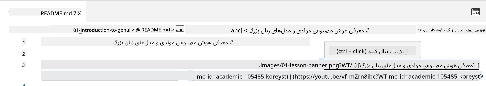
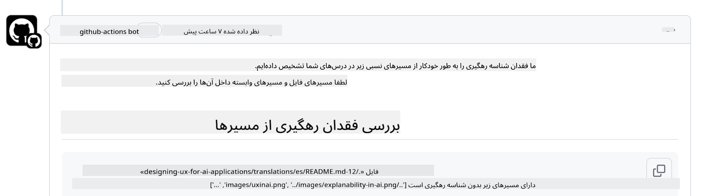
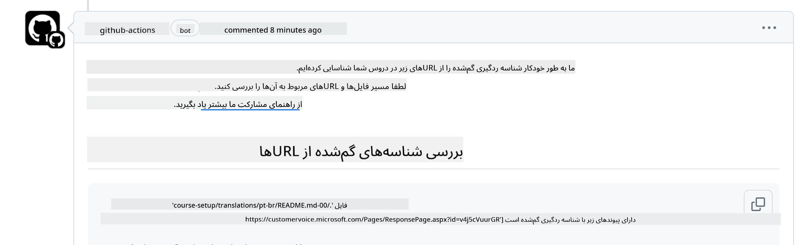
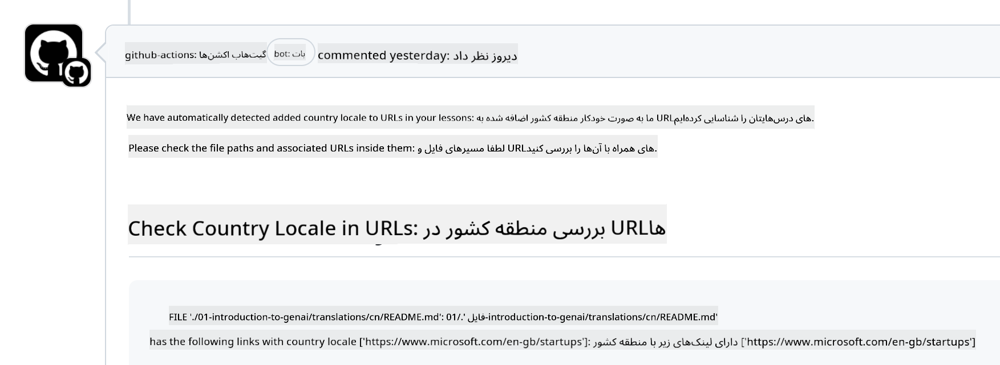

<!--
CO_OP_TRANSLATOR_METADATA:
{
  "original_hash": "57c41f2af71001a2cff9d8eb797cb843",
  "translation_date": "2025-05-19T11:10:09+00:00",
  "source_file": "CONTRIBUTING.md",
  "language_code": "fa"
}
-->
# مشارکت

این پروژه از مشارکت‌ها و پیشنهادها استقبال می‌کند. بیشتر مشارکت‌ها نیازمند این است که شما با توافقنامه مجوز مشارکت‌کننده (CLA) موافقت کنید و اعلام کنید که شما حق استفاده از مشارکت خود را به ما اعطا می‌کنید. برای جزئیات بیشتر، به <https://cla.microsoft.com> مراجعه کنید.

> مهم: هنگام ترجمه متن در این مخزن، لطفاً اطمینان حاصل کنید که از ترجمه ماشینی استفاده نکنید. ما ترجمه‌ها را از طریق جامعه بررسی خواهیم کرد، بنابراین لطفاً فقط برای ترجمه در زبان‌هایی که به آن‌ها مسلط هستید، داوطلب شوید.

وقتی یک درخواست کشش ارسال می‌کنید، یک CLA-bot به طور خودکار تعیین می‌کند که آیا شما نیاز به ارائه CLA دارید و درخواست کشش را به‌طور مناسب تزئین می‌کند (مثلاً برچسب، نظر). به سادگی دستورالعمل‌هایی را که توسط ربات ارائه شده‌اند دنبال کنید. شما فقط یک بار این کار را در تمامی مخزن‌ها که از CLA ما استفاده می‌کنند، انجام خواهید داد.

## کد رفتار

این پروژه [کد رفتار منبع باز مایکروسافت](https://opensource.microsoft.com/codeofconduct/?WT.mc_id=academic-105485-koreyst) را پذیرفته است.
برای اطلاعات بیشتر [سؤالات متداول کد رفتار](https://opensource.microsoft.com/codeofconduct/faq/?WT.mc_id=academic-105485-koreyst) را بخوانید یا با [opencode@microsoft.com](mailto:opencode@microsoft.com) تماس بگیرید تا هرگونه سوال یا نظر اضافی را مطرح کنید.

## سوال یا مشکل؟

لطفاً برای سوالات عمومی پشتیبانی، مسائل GitHub را باز نکنید زیرا لیست GitHub باید برای درخواست‌های ویژگی و گزارش‌های خطا استفاده شود. به این ترتیب ما می‌توانیم مسائل واقعی یا خطاها را از کد به‌طور آسان‌تر دنبال کنیم و بحث عمومی را از کد واقعی جدا نگه داریم.

## اشتباهات تایپی، مسائل، خطاها و مشارکت‌ها

هر زمان که تغییراتی را به مخزن هوش مصنوعی مولد برای مبتدیان ارسال می‌کنید، لطفاً این توصیه‌ها را دنبال کنید.

* همیشه قبل از انجام تغییرات خود، مخزن را به حساب خودتان فورک کنید
* تغییرات متعدد را در یک درخواست کشش ترکیب نکنید. به عنوان مثال، هرگونه اصلاح خطا و به‌روزرسانی مستندات را با استفاده از درخواست‌های کشش جداگانه ارسال کنید
* اگر درخواست کشش شما نشان‌دهنده تعارضات ادغام است، مطمئن شوید که لوکال اصلی خود را به آینه‌ای از آنچه در مخزن اصلی وجود دارد، به‌روز کنید قبل از انجام تغییرات خود
* اگر ترجمه‌ای ارسال می‌کنید، لطفاً یک درخواست کشش برای تمامی فایل‌های ترجمه شده ایجاد کنید زیرا ما ترجمه‌های جزئی محتوا را قبول نمی‌کنیم
* اگر اصلاح اشتباه تایپی یا مستندات ارسال می‌کنید، می‌توانید تغییرات را به یک درخواست کشش ترکیب کنید که مناسب باشد

## راهنمایی عمومی برای نوشتن

- اطمینان حاصل کنید که تمامی URL‌های شما در براکت‌های مربعی قرار گرفته‌اند و به دنبال آن‌ها یک پرانتز بدون فضای اضافی در اطراف یا داخل آن‌ها قرار دارد ``.
- اطمینان حاصل کنید که هر لینک نسبی (یعنی لینک‌ها به فایل‌ها و پوشه‌های دیگر در مخزن) با `./` شروع می‌شود که به یک فایل یا پوشه در دایرکتوری کاری فعلی اشاره دارد یا `../` که به یک فایل یا پوشه در دایرکتوری کاری والد اشاره دارد.
- اطمینان حاصل کنید که هر لینک نسبی (یعنی لینک‌ها به فایل‌ها و پوشه‌های دیگر در مخزن) دارای یک شناسه ردیابی (یعنی `?` یا `&` سپس `wt.mc_id=` یا `WT.mc_id=`) در انتهای آن است.
- اطمینان حاصل کنید که هر URL از دامنه‌های زیر _github.com, microsoft.com, visualstudio.com, aka.ms, و azure.com_ دارای یک شناسه ردیابی (یعنی `?` یا `&` سپس `wt.mc_id=` یا `WT.mc_id=`) در انتهای آن است.
- اطمینان حاصل کنید که لینک‌های شما دارای محلی خاص کشور نیستند (یعنی `/en-us/` یا `/en/`).
- اطمینان حاصل کنید که تمامی تصاویر در پوشه `./images` ذخیره شده‌اند.
- اطمینان حاصل کنید که تصاویر دارای نام‌های توصیفی با استفاده از کاراکترهای انگلیسی، اعداد و خط تیره در نام تصویر شما هستند.

## گردش کار GitHub

وقتی یک درخواست کشش ارسال می‌کنید، چهار گردش کار مختلف برای اعتبارسنجی قوانین قبلی فعال خواهد شد.
به سادگی دستورالعمل‌های فهرست شده در اینجا را دنبال کنید تا از چک‌های گردش کار عبور کنید.

- [بررسی مسیرهای نسبی شکسته](../..)
- [بررسی مسیرها دارای ردیابی](../..)
- [بررسی URL‌ها دارای ردیابی](../..)
- [بررسی URL‌ها بدون محلی](../..)

### بررسی مسیرهای نسبی شکسته

این گردش کار اطمینان حاصل می‌کند که هر مسیر نسبی در فایل‌های شما کار می‌کند.
این مخزن به صفحات GitHub مستقر شده است بنابراین شما باید بسیار مراقب باشید که لینک‌هایی که همه چیز را به هم می‌چسبانند، تایپ کنید تا کسی را به مکان اشتباه هدایت نکنید.

برای اطمینان از اینکه لینک‌های شما به‌درستی کار می‌کنند، به سادگی از VS code استفاده کنید تا بررسی کنید.

به عنوان مثال، وقتی بر روی هر لینکی در فایل‌های خود موس را نگه دارید، به شما پیشنهاد می‌شود که با فشار دادن **ctrl + click** لینک را دنبال کنید

اگر بر روی لینکی کلیک کنید و به‌صورت محلی کار نمی‌کند، مطمئناً گردش کار را فعال خواهد کرد و در GitHub کار نخواهد کرد.

برای رفع این مشکل، سعی کنید لینک را با کمک VS code تایپ کنید.

وقتی `./` یا `../` تایپ می‌کنید، VS code به شما پیشنهاد می‌دهد که از گزینه‌های موجود با توجه به آنچه تایپ کرده‌اید، انتخاب کنید.

مسیر را با کلیک بر روی فایل یا پوشه مورد نظر دنبال کنید و مطمئن خواهید شد که مسیر شما شکسته نیست.

وقتی مسیر نسبی صحیح را اضافه کردید، ذخیره کنید و تغییرات خود را فشار دهید، گردش کار دوباره فعال خواهد شد تا تغییرات شما را تأیید کند.
اگر چک را گذرانده‌اید، آماده ادامه هستید.

### بررسی مسیرها دارای ردیابی

این گردش کار اطمینان حاصل می‌کند که هر مسیر نسبی دارای ردیابی است.
این مخزن به صفحات GitHub مستقر شده است بنابراین ما نیاز داریم حرکت بین فایل‌ها و پوشه‌های مختلف را ردیابی کنیم.

برای اطمینان از اینکه مسیرهای نسبی شما دارای ردیابی هستند، به سادگی متن زیر `?wt.mc_id=` را در انتهای مسیر بررسی کنید.
اگر به مسیرهای نسبی شما اضافه شده باشد، این چک را خواهید گذراند.

در غیر این صورت، ممکن است خطای زیر را دریافت کنید.

برای رفع این مشکل، سعی کنید مسیر فایل را که گردش کار برجسته کرده است باز کنید و شناسه ردیابی را به انتهای مسیرهای نسبی اضافه کنید.

وقتی شناسه ردیابی را اضافه کردید، ذخیره کنید و تغییرات خود را فشار دهید، گردش کار دوباره فعال خواهد شد تا تغییرات شما را تأیید کند.
اگر چک را گذرانده‌اید، آماده ادامه هستید.

### بررسی URL‌ها دارای ردیابی

این گردش کار اطمینان حاصل می‌کند که هر URL وب دارای ردیابی است.
این مخزن برای همه قابل دسترسی است بنابراین شما باید مطمئن شوید که دسترسی را ردیابی کنید تا بدانید ترافیک از کجا می‌آید.

برای اطمینان از اینکه URL‌های شما دارای ردیابی هستند، به سادگی متن زیر `?wt.mc_id=` را در انتهای URL بررسی کنید.
اگر به URL‌های شما اضافه شده باشد، این چک را خواهید گذراند.

در غیر این صورت، ممکن است خطای زیر را دریافت کنید.

برای رفع این مشکل، سعی کنید مسیر فایل را که گردش کار برجسته کرده است باز کنید و شناسه ردیابی را به انتهای URL‌ها اضافه کنید.

وقتی شناسه ردیابی را اضافه کردید، ذخیره کنید و تغییرات خود را فشار دهید، گردش کار دوباره فعال خواهد شد تا تغییرات شما را تأیید کند.
اگر چک را گذرانده‌اید، آماده ادامه هستید.

### بررسی URL‌ها بدون محلی

این گردش کار اطمینان حاصل می‌کند که هر URL وب دارای محلی خاص کشور نیست.
این مخزن برای همه در سراسر جهان قابل دسترسی است بنابراین شما باید مطمئن شوید که محلی کشور خود را در URL‌ها قرار ندهید.

برای اطمینان از اینکه URL‌های شما دارای محلی کشور نیستند، به سادگی متن زیر `/en-us/` یا `/en/` یا هر محلی زبان دیگری را در هر نقطه از URL بررسی کنید.
اگر در URL‌های شما وجود ندارد، این چک را خواهید گذراند.

در غیر این صورت، ممکن است خطای زیر را دریافت کنید.

برای رفع این مشکل، سعی کنید مسیر فایل را که گردش کار برجسته کرده است باز کنید و محلی کشور را از URL‌ها حذف کنید.

وقتی محلی کشور را حذف کردید، ذخیره کنید و تغییرات خود را فشار دهید، گردش کار دوباره فعال خواهد شد تا تغییرات شما را تأیید کند.
اگر چک را گذرانده‌اید، آماده ادامه هستید.

تبریک! ما در اسرع وقت با بازخوردی درباره مشارکت شما به شما باز خواهیم گشت.

**سلب مسئولیت**:  
این سند با استفاده از سرویس ترجمه هوش مصنوعی [Co-op Translator](https://github.com/Azure/co-op-translator) ترجمه شده است. در حالی که ما برای دقت تلاش می‌کنیم، لطفاً توجه داشته باشید که ترجمه‌های خودکار ممکن است حاوی خطاها یا نادرستی‌ها باشند. سند اصلی به زبان مادری باید به عنوان منبع معتبر در نظر گرفته شود. برای اطلاعات حیاتی، ترجمه انسانی حرفه‌ای توصیه می‌شود. ما مسئولیتی در قبال سوء تفاهم‌ها یا تفسیرهای نادرست ناشی از استفاده از این ترجمه نداریم.