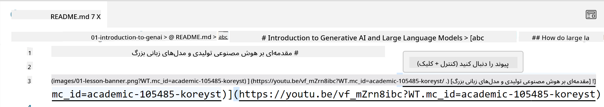
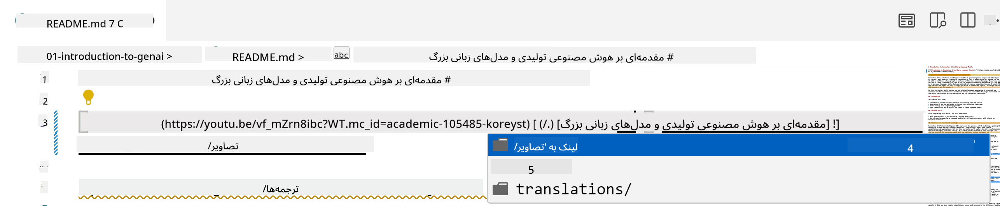
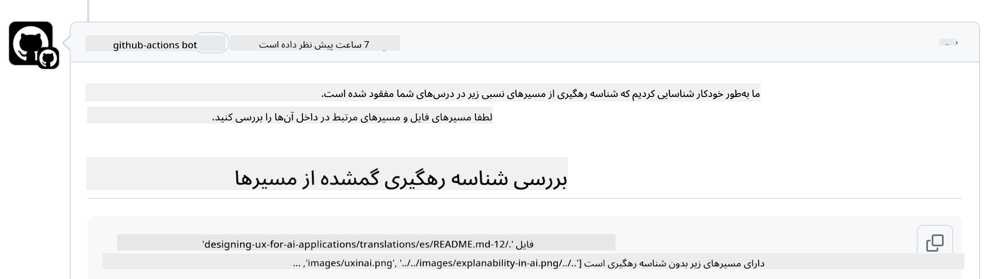
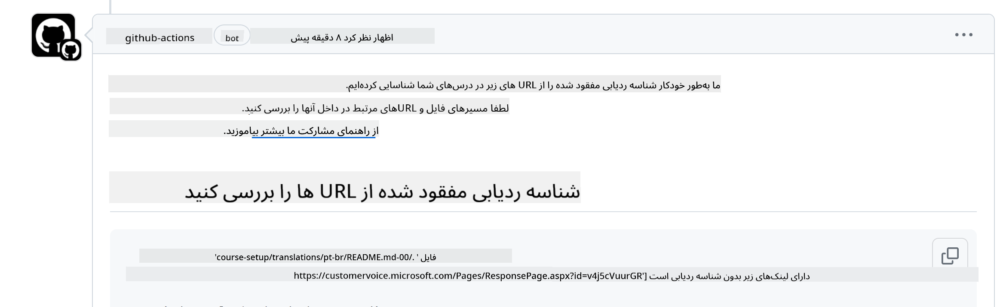
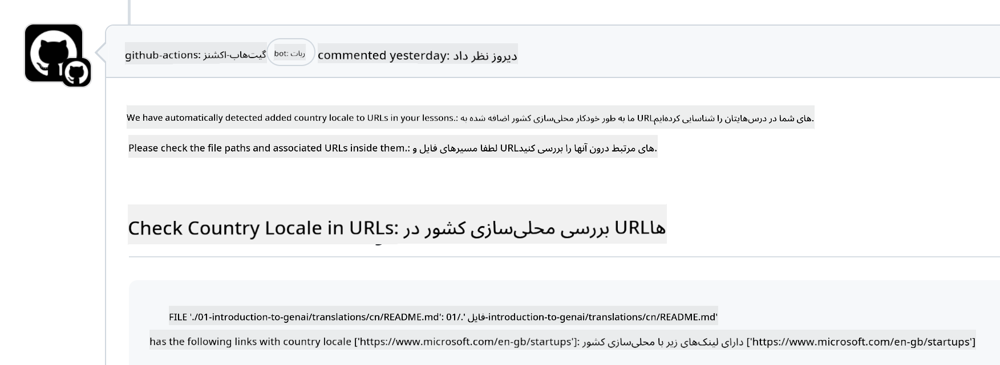

<!--
CO_OP_TRANSLATOR_METADATA:
{
  "original_hash": "57c41f2af71001a2cff9d8eb797cb843",
  "translation_date": "2025-06-25T07:00:56+00:00",
  "source_file": "CONTRIBUTING.md",
  "language_code": "fa"
}
-->
# مشارکت

این پروژه از مشارکت‌ها و پیشنهادات استقبال می‌کند. بیشتر مشارکت‌ها نیاز دارند که شما با توافق‌نامه مجوز مشارکت‌کننده (CLA) موافقت کنید و اعلام کنید که شما حق دارید و واقعاً به ما اجازه می‌دهید از مشارکت شما استفاده کنیم. برای جزئیات بیشتر، به <https://cla.microsoft.com> مراجعه کنید.

> مهم: هنگام ترجمه متن در این مخزن، لطفاً اطمینان حاصل کنید که از ترجمه ماشینی استفاده نکنید. ما ترجمه‌ها را از طریق جامعه تأیید خواهیم کرد، بنابراین فقط برای ترجمه در زبان‌هایی که در آن‌ها مهارت دارید، داوطلب شوید.

وقتی یک درخواست کشش ارسال می‌کنید، یک ربات CLA به‌طور خودکار تعیین می‌کند که آیا شما نیاز دارید یک CLA ارائه دهید و درخواست را به‌طور مناسب تزئین می‌کند (مثلاً برچسب، نظر). به سادگی دستورالعمل‌های ارائه‌شده توسط ربات را دنبال کنید. شما فقط نیاز دارید این کار را یک بار در تمام مخازنی که از CLA ما استفاده می‌کنند، انجام دهید.

## کد رفتار

این پروژه [کد رفتار منبع باز مایکروسافت](https://opensource.microsoft.com/codeofconduct/?WT.mc_id=academic-105485-koreyst) را پذیرفته است. برای اطلاعات بیشتر، [پرسش‌های متداول کد رفتار](https://opensource.microsoft.com/codeofconduct/faq/?WT.mc_id=academic-105485-koreyst) را بخوانید یا با [opencode@microsoft.com](mailto:opencode@microsoft.com) تماس بگیرید با هر گونه سؤال یا نظر اضافی.

## سؤال یا مشکل؟

لطفاً برای سوالات پشتیبانی عمومی مشکلات GitHub را باز نکنید زیرا لیست GitHub باید برای درخواست‌های ویژگی و گزارش اشکال استفاده شود. به این ترتیب می‌توانیم به‌راحتی مسائل واقعی یا اشکالات کد را پیگیری کنیم و بحث عمومی را از کد واقعی جدا نگه داریم.

## اشتباهات تایپی، مسائل، اشکالات و مشارکت‌ها

هر زمان که تغییراتی در مخزن هوش مصنوعی مولد برای مبتدیان ارسال می‌کنید، لطفاً این توصیه‌ها را دنبال کنید.

* همیشه مخزن را به حساب خودتان قبل از انجام تغییرات خود فورک کنید
* تغییرات متعدد را به یک درخواست کشش ترکیب نکنید. به عنوان مثال، هرگونه رفع اشکال و به‌روزرسانی مستندات را با استفاده از PR‌های جداگانه ارسال کنید
* اگر درخواست کشش شما نشان‌دهنده تضادهای ادغام است، مطمئن شوید که محلی اصلی خود را به‌روزرسانی کنید تا آینه‌ای از آنچه در مخزن اصلی است باشد قبل از انجام تغییرات خود
* اگر یک ترجمه ارسال می‌کنید، لطفاً یک PR برای تمام فایل‌های ترجمه‌شده ایجاد کنید زیرا ما ترجمه‌های جزئی برای محتوا را قبول نمی‌کنیم
* اگر یک اشتباه تایپی یا اصلاح مستندات ارسال می‌کنید، می‌توانید تغییرات را به یک PR ترکیب کنید که مناسب باشد

## راهنمایی عمومی برای نوشتن

- اطمینان حاصل کنید که تمام URLهای شما در کروشه قرار دارند و با پرانتز بدون فضای اضافی در اطراف یا داخل آن‌ها `` دنبال می‌شوند.
- اطمینان حاصل کنید که هر پیوند نسبی (یعنی پیوندها به سایر فایل‌ها و پوشه‌ها در مخزن) با `./` شروع می‌شود که به یک فایل یا پوشه در دایرکتوری کاری فعلی اشاره دارد یا `../` که به یک فایل یا پوشه در دایرکتوری کاری والد اشاره دارد.
- اطمینان حاصل کنید که هر پیوند نسبی (یعنی پیوندها به سایر فایل‌ها و پوشه‌ها در مخزن) یک شناسه پیگیری دارد (یعنی `?` یا `&` سپس `wt.mc_id=` یا `WT.mc_id=`) در انتهای آن.
- اطمینان حاصل کنید که هر URL از دامنه‌های _github.com، microsoft.com، visualstudio.com، aka.ms، و azure.com_ یک شناسه پیگیری دارد (یعنی `?` یا `&` سپس `wt.mc_id=` یا `WT.mc_id=`) در انتهای آن.
- اطمینان حاصل کنید که پیوندهای شما دارای مکان خاص کشور نیستند (یعنی `/en-us/` یا `/en/`).
- اطمینان حاصل کنید که تمام تصاویر در پوشه `./images` ذخیره شده‌اند.
- اطمینان حاصل کنید که تصاویر نام‌های توصیفی با استفاده از کاراکترهای انگلیسی، اعداد، و خط تیره در نام تصویر شما دارند.

## جریان‌های کاری GitHub

وقتی یک درخواست کشش ارسال می‌کنید، چهار جریان کاری مختلف برای اعتبارسنجی قوانین قبلی فعال خواهند شد. به سادگی دستورالعمل‌های ذکر شده در اینجا را دنبال کنید تا بررسی‌های جریان کاری را بگذرانید.

- [بررسی مسیرهای نسبی شکسته](../..)
- [بررسی مسیرها دارای پیگیری](../..)
- [بررسی URLها دارای پیگیری](../..)
- [بررسی URLها فاقد مکان](../..)

### بررسی مسیرهای نسبی شکسته

این جریان کاری اطمینان حاصل می‌کند که هر مسیر نسبی در فایل‌های شما کار می‌کند. این مخزن به صفحات GitHub مستقر شده است بنابراین باید بسیار مراقب باشید که هنگام تایپ پیوندها که همه چیز را به هم متصل می‌کند کسی را به جای اشتباهی هدایت نکنید.

برای اطمینان از اینکه پیوندهای شما به درستی کار می‌کنند، به سادگی از VS code برای بررسی آن استفاده کنید.

به عنوان مثال، هنگامی که بر روی هر پیوند در فایل‌های خود حرکت می‌کنید، به شما پیشنهاد می‌شود که با فشار دادن **ctrl + کلیک** پیوند را دنبال کنید.

اگر بر روی یک پیوند کلیک کنید و به صورت محلی کار نکند، به طور قطع جریان کاری را فعال می‌کند و در GitHub کار نخواهد کرد.

برای رفع این مشکل، سعی کنید پیوند را با کمک VS code تایپ کنید.

هنگامی که `./` یا `../` را تایپ می‌کنید، VS code به شما پیشنهاد می‌دهد که از گزینه‌های موجود بر اساس آنچه تایپ کرده‌اید انتخاب کنید.

با کلیک بر روی فایل یا پوشه مورد نظر مسیر را دنبال کنید و مطمئن شوید که مسیر شما شکسته نیست.

هنگامی که مسیر نسبی صحیح را اضافه کردید، ذخیره و تغییرات خود را فشار دهید، جریان کاری دوباره فعال خواهد شد تا تغییرات شما را تأیید کند. اگر بررسی را گذرانید، آماده هستید.

### بررسی مسیرها دارای پیگیری

این جریان کاری اطمینان حاصل می‌کند که هر مسیر نسبی دارای پیگیری است. این مخزن به صفحات GitHub مستقر شده است بنابراین باید حرکت بین فایل‌ها و پوشه‌های مختلف را پیگیری کنیم.

برای اطمینان از اینکه مسیرهای نسبی شما دارای پیگیری هستند، به سادگی متن زیر `?wt.mc_id=` را در انتهای مسیر بررسی کنید. اگر به مسیرهای نسبی شما افزوده شده باشد، این بررسی را خواهید گذراند.

در غیر این صورت، ممکن است خطای زیر را دریافت کنید.

برای رفع این مشکل، سعی کنید مسیر فایل که جریان کاری برجسته کرده است را باز کنید و شناسه پیگیری را به انتهای مسیرهای نسبی اضافه کنید.

هنگامی که شناسه پیگیری را اضافه کردید، ذخیره و تغییرات خود را فشار دهید، جریان کاری دوباره فعال خواهد شد تا تغییرات شما را تأیید کند. اگر بررسی را گذرانید، آماده هستید.

### بررسی URLها دارای پیگیری

این جریان کاری اطمینان حاصل می‌کند که هر URL وب دارای پیگیری است. این مخزن برای همه در دسترس است بنابراین باید مطمئن شوید که دسترسی را پیگیری کنید تا بدانید از کجا ترافیک می‌آید.

برای اطمینان از اینکه URLهای شما دارای پیگیری هستند، به سادگی متن زیر `?wt.mc_id=` را در انتهای URL بررسی کنید. اگر به URLهای شما افزوده شده باشد، این بررسی را خواهید گذراند.

در غیر این صورت، ممکن است خطای زیر را دریافت کنید.

برای رفع این مشکل، سعی کنید مسیر فایل که جریان کاری برجسته کرده است را باز کنید و شناسه پیگیری را به انتهای URLها اضافه کنید.

هنگامی که شناسه پیگیری را اضافه کردید، ذخیره و تغییرات خود را فشار دهید، جریان کاری دوباره فعال خواهد شد تا تغییرات شما را تأیید کند. اگر بررسی را گذرانید، آماده هستید.

### بررسی URLها فاقد مکان

این جریان کاری اطمینان حاصل می‌کند که هر URL وب دارای مکان خاص کشور نیست. این مخزن برای همه در سراسر جهان در دسترس است بنابراین باید مطمئن شوید که مکان کشور خود را در URLها وارد نکنید.

برای اطمینان از اینکه URLهای شما دارای مکان کشور نیستند، به سادگی متن زیر `/en-us/` یا `/en/` یا هر مکان زبان دیگری را در هر جایی از URL بررسی کنید. اگر در URLهای شما حضور نداشته باشد، این بررسی را خواهید گذراند.

در غیر این صورت، ممکن است خطای زیر را دریافت کنید.

برای رفع این مشکل، سعی کنید مسیر فایل که جریان کاری برجسته کرده است را باز کنید و مکان کشور را از URLها حذف کنید.

هنگامی که مکان کشور را حذف کردید، ذخیره و تغییرات خود را فشار دهید، جریان کاری دوباره فعال خواهد شد تا تغییرات شما را تأیید کند. اگر بررسی را گذرانید، آماده هستید.

تبریک می‌گوییم! ما به زودی با بازخورد درباره مشارکت شما با شما تماس خواهیم گرفت.

**سلب مسئولیت**:  
این سند با استفاده از سرویس ترجمه هوش مصنوعی [Co-op Translator](https://github.com/Azure/co-op-translator) ترجمه شده است. در حالی که ما برای دقت تلاش می‌کنیم، لطفاً توجه داشته باشید که ترجمه‌های خودکار ممکن است شامل خطاها یا نادرستی‌هایی باشند. سند اصلی به زبان بومی آن باید به عنوان منبع معتبر در نظر گرفته شود. برای اطلاعات حیاتی، ترجمه حرفه‌ای انسانی توصیه می‌شود. ما مسئولیتی در قبال سوءتفاهم‌ها یا تفسیرهای نادرست ناشی از استفاده از این ترجمه نداریم.