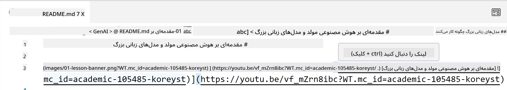
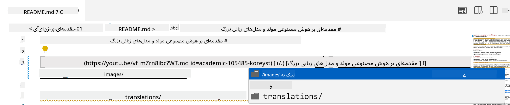
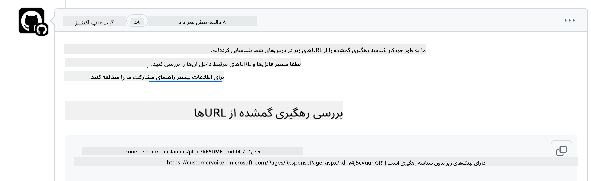
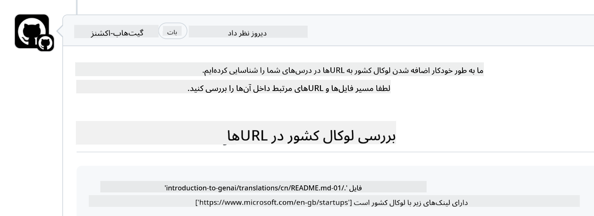

<!--
CO_OP_TRANSLATOR_METADATA:
{
  "original_hash": "57c41f2af71001a2cff9d8eb797cb843",
  "translation_date": "2025-07-09T05:48:54+00:00",
  "source_file": "CONTRIBUTING.md",
  "language_code": "fa"
}
-->
# مشارکت

این پروژه از مشارکت‌ها و پیشنهادات استقبال می‌کند. بیشتر مشارکت‌ها نیازمند آن است که شما با توافق‌نامه مجوز مشارکت‌کننده (CLA) موافقت کنید که اعلام می‌کند شما حق دارید و واقعاً این حق را به ما می‌دهید که از مشارکت شما استفاده کنیم. برای جزئیات بیشتر به <https://cla.microsoft.com> مراجعه کنید.

> مهم: هنگام ترجمه متن در این مخزن، لطفاً اطمینان حاصل کنید که از ترجمه ماشینی استفاده نمی‌کنید. ما ترجمه‌ها را از طریق جامعه بررسی خواهیم کرد، بنابراین فقط برای زبان‌هایی که به آن‌ها مسلط هستید داوطلب ترجمه شوید.

وقتی درخواست pull ارسال می‌کنید، یک ربات CLA به‌طور خودکار تعیین می‌کند که آیا نیاز به ارائه CLA دارید و درخواست pull را به‌طور مناسب علامت‌گذاری می‌کند (مثلاً برچسب، نظر). فقط کافی است دستورالعمل‌های ارائه شده توسط ربات را دنبال کنید. شما فقط یک بار در تمام مخازنی که از CLA ما استفاده می‌کنند باید این کار را انجام دهید.

## قوانین رفتاری

این پروژه قوانین رفتاری [Microsoft Open Source Code of Conduct](https://opensource.microsoft.com/codeofconduct/?WT.mc_id=academic-105485-koreyst) را پذیرفته است.
برای اطلاعات بیشتر، [سؤالات متداول قوانین رفتاری](https://opensource.microsoft.com/codeofconduct/faq/?WT.mc_id=academic-105485-koreyst) را مطالعه کنید یا برای هر سؤال یا نظر اضافی با [opencode@microsoft.com](mailto:opencode@microsoft.com) تماس بگیرید.

## سؤال یا مشکل؟

لطفاً برای سؤالات پشتیبانی عمومی، مسئله‌ای در GitHub باز نکنید، زیرا لیست GitHub باید برای درخواست ویژگی‌ها و گزارش باگ‌ها استفاده شود. این کار به ما کمک می‌کند تا مسائل یا باگ‌های واقعی کد را راحت‌تر پیگیری کنیم و بحث‌های عمومی را از کد جدا نگه داریم.

## اشتباهات تایپی، مشکلات، باگ‌ها و مشارکت‌ها

هر زمان که تغییراتی در مخزن Generative AI for Beginners ارسال می‌کنید، لطفاً این توصیه‌ها را دنبال کنید.

* همیشه قبل از اعمال تغییرات، مخزن را به حساب خود فورک کنید
* تغییرات متعدد را در یک درخواست pull ترکیب نکنید. به عنوان مثال، هر اصلاح باگ و به‌روزرسانی مستندات را با درخواست‌های جداگانه ارسال کنید
* اگر درخواست pull شما دارای تعارض ادغام است، مطمئن شوید که شاخه main محلی خود را به‌روزرسانی کرده‌اید تا دقیقاً با مخزن اصلی همگام باشد قبل از اعمال تغییرات
* اگر ترجمه ارسال می‌کنید، لطفاً یک درخواست pull برای همه فایل‌های ترجمه شده ایجاد کنید، زیرا ترجمه‌های جزئی را قبول نمی‌کنیم
* اگر اصلاح تایپی یا مستندات ارسال می‌کنید، می‌توانید تغییرات را در یک درخواست pull ترکیب کنید در صورتی که مناسب باشد

## راهنمای کلی برای نوشتن

- اطمینان حاصل کنید که همه URLهای شما در براکت‌های مربعی قرار دارند و بلافاصله پس از آن پرانتز بدون فاصله اضافی اطراف یا داخل آن‌ها قرار گرفته است ``.
- اطمینان حاصل کنید که هر لینک نسبی (یعنی لینک به فایل‌ها و پوشه‌های دیگر در مخزن) با `./` شروع می‌شود که به فایل یا پوشه‌ای در دایرکتوری کاری فعلی اشاره دارد یا با `../` که به فایل یا پوشه‌ای در دایرکتوری والد اشاره دارد.
- اطمینان حاصل کنید که هر لینک نسبی دارای شناسه ردیابی (یعنی `?` یا `&` سپس `wt.mc_id=` یا `WT.mc_id=`) در انتهای آن است.
- اطمینان حاصل کنید که هر URL از دامنه‌های _github.com, microsoft.com, visualstudio.com, aka.ms, و azure.com_ دارای شناسه ردیابی (یعنی `?` یا `&` سپس `wt.mc_id=` یا `WT.mc_id=`) در انتهای آن است.
- اطمینان حاصل کنید که لینک‌های شما شامل لوکال (محلی) خاص کشور نیستند (مثلاً `/en-us/` یا `/en/`).
- اطمینان حاصل کنید که همه تصاویر در پوشه `./images` ذخیره شده‌اند.
- اطمینان حاصل کنید که تصاویر نام‌های توصیفی با استفاده از حروف انگلیسی، اعداد و خط تیره دارند.

## گردش‌کارهای GitHub

وقتی درخواست pull ارسال می‌کنید، چهار گردش‌کار مختلف برای اعتبارسنجی قوانین قبلی فعال می‌شوند.
فقط دستورالعمل‌های ذکر شده در اینجا را دنبال کنید تا بررسی‌های گردش‌کار را بگذرانید.

- [بررسی مسیرهای نسبی شکسته](../..)
- [بررسی مسیرها دارای ردیابی](../..)
- [بررسی URLها دارای ردیابی](../..)
- [بررسی URLها بدون لوکال](../..)

### بررسی مسیرهای نسبی شکسته

این گردش‌کار اطمینان می‌دهد که هر مسیر نسبی در فایل‌های شما کار می‌کند.
این مخزن روی صفحات GitHub مستقر شده است، بنابراین باید هنگام تایپ لینک‌ها که همه چیز را به هم متصل می‌کنند، بسیار دقت کنید تا کسی به جای اشتباه هدایت نشود.

برای اطمینان از عملکرد صحیح لینک‌ها، به سادگی از VS code استفاده کنید.

برای مثال، وقتی روی هر لینکی در فایل‌های خود موس را نگه دارید، با فشار دادن **ctrl + click** به شما پیشنهاد دنبال کردن لینک داده می‌شود.

اگر روی لینکی کلیک کنید و در محیط محلی کار نکند، مطمئناً گردش‌کار فعال می‌شود و در GitHub نیز کار نخواهد کرد.

برای رفع این مشکل، سعی کنید لینک را با کمک VS code تایپ کنید.

وقتی `./` یا `../` را تایپ می‌کنید، VS code به شما گزینه‌هایی را بر اساس آنچه تایپ کرده‌اید پیشنهاد می‌دهد.

با کلیک روی فایل یا پوشه مورد نظر مسیر را دنبال کنید و مطمئن خواهید شد که مسیر شما شکسته نیست.

پس از افزودن مسیر نسبی صحیح، تغییرات را ذخیره و ارسال کنید، گردش‌کار دوباره فعال می‌شود تا تغییرات شما را بررسی کند.
اگر بررسی را گذراندید، آماده ادامه کار هستید.

### بررسی مسیرها دارای ردیابی

این گردش‌کار اطمینان می‌دهد که هر مسیر نسبی دارای ردیابی است.
این مخزن روی صفحات GitHub مستقر شده است، بنابراین باید حرکت بین فایل‌ها و پوشه‌های مختلف را ردیابی کنیم.

برای اطمینان از اینکه مسیرهای نسبی شما ردیابی دارند، به دنبال متن `?wt.mc_id=` در انتهای مسیر باشید.
اگر این متن به مسیرهای نسبی شما اضافه شده باشد، این بررسی را خواهید گذراند.

در غیر این صورت، ممکن است خطای زیر را دریافت کنید.

برای رفع این مشکل، فایل مسیر که گردش‌کار به آن اشاره کرده را باز کنید و شناسه ردیابی را به انتهای مسیرهای نسبی اضافه کنید.

پس از افزودن شناسه ردیابی، تغییرات را ذخیره و ارسال کنید، گردش‌کار دوباره فعال می‌شود تا تغییرات شما را بررسی کند.
اگر بررسی را گذراندید، آماده ادامه کار هستید.

### بررسی URLها دارای ردیابی

این گردش‌کار اطمینان می‌دهد که هر URL وب دارای ردیابی است.
این مخزن برای همه در دسترس است، بنابراین باید دسترسی را ردیابی کنیم تا بدانیم ترافیک از کجا می‌آید.

برای اطمینان از اینکه URLهای شما ردیابی دارند، به دنبال متن `?wt.mc_id=` در انتهای URL باشید.
اگر این متن به URLهای شما اضافه شده باشد، این بررسی را خواهید گذراند.

در غیر این صورت، ممکن است خطای زیر را دریافت کنید.

برای رفع این مشکل، فایل مسیر که گردش‌کار به آن اشاره کرده را باز کنید و شناسه ردیابی را به انتهای URLها اضافه کنید.

پس از افزودن شناسه ردیابی، تغییرات را ذخیره و ارسال کنید، گردش‌کار دوباره فعال می‌شود تا تغییرات شما را بررسی کند.
اگر بررسی را گذراندید، آماده ادامه کار هستید.

### بررسی URLها بدون لوکال

این گردش‌کار اطمینان می‌دهد که هیچ URL وب شامل لوکال (محلی) خاص کشور نیست.
این مخزن برای همه در سراسر جهان در دسترس است، بنابراین باید مطمئن شوید که لوکال کشور خود را در URLها وارد نکنید.

برای اطمینان از اینکه URLهای شما لوکال کشور ندارند، به دنبال متن‌های `/en-us/` یا `/en/` یا هر لوکال زبانی دیگری در هر جای URL باشید.
اگر این موارد در URLهای شما وجود نداشته باشد، این بررسی را خواهید گذراند.

در غیر این صورت، ممکن است خطای زیر را دریافت کنید.

برای رفع این مشکل، فایل مسیر که گردش‌کار به آن اشاره کرده را باز کنید و لوکال کشور را از URLها حذف کنید.

پس از حذف لوکال کشور، تغییرات را ذخیره و ارسال کنید، گردش‌کار دوباره فعال می‌شود تا تغییرات شما را بررسی کند.
اگر بررسی را گذراندید، آماده ادامه کار هستید.

تبریک! ما در اسرع وقت با بازخورد درباره مشارکت شما با شما تماس خواهیم گرفت.

**سلب مسئولیت**:  
این سند با استفاده از سرویس ترجمه هوش مصنوعی [Co-op Translator](https://github.com/Azure/co-op-translator) ترجمه شده است. در حالی که ما در تلاش برای دقت هستیم، لطفاً توجه داشته باشید که ترجمه‌های خودکار ممکن است حاوی خطاها یا نادرستی‌هایی باشند. سند اصلی به زبان بومی خود باید به عنوان منبع معتبر در نظر گرفته شود. برای اطلاعات حیاتی، ترجمه حرفه‌ای انسانی توصیه می‌شود. ما مسئول هیچ گونه سوءتفاهم یا تفسیر نادرستی که از استفاده این ترجمه ناشی شود، نیستیم.