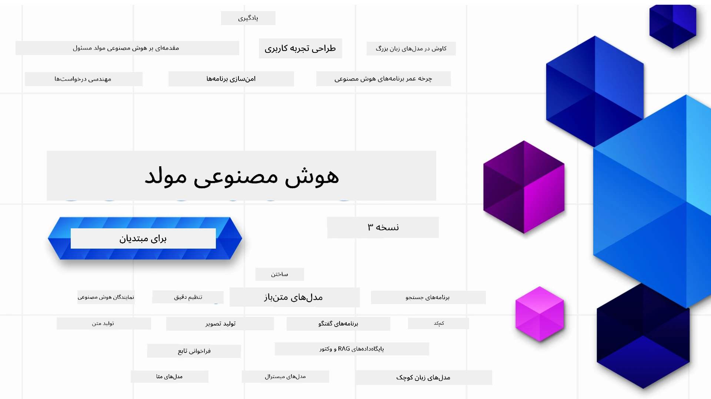

<!--
CO_OP_TRANSLATOR_METADATA:
{
  "original_hash": "054860715e642de31fa8e15c6d01f2b1",
  "translation_date": "2026-01-05T14:54:31+00:00",
  "source_file": "README.md",
  "language_code": "fa"
}
-->


### ۲۱ درس که همه چیز لازم برای شروع ساخت برنامه‌های هوش مصنوعی مولد را آموزش می‌دهد

[](https://github.com/microsoft/Generative-AI-For-Beginners/blob/master/LICENSE?WT.mc_id=academic-105485-koreyst)
[](https://GitHub.com/microsoft/Generative-AI-For-Beginners/graphs/contributors/?WT.mc_id=academic-105485-koreyst)
[](https://GitHub.com/microsoft/Generative-AI-For-Beginners/issues/?WT.mc_id=academic-105485-koreyst)
[](https://GitHub.com/microsoft/Generative-AI-For-Beginners/pulls/?WT.mc_id=academic-105485-koreyst)
[](http://makeapullrequest.com?WT.mc_id=academic-105485-koreyst)

[](https://GitHub.com/microsoft/Generative-AI-For-Beginners/watchers/?WT.mc_id=academic-105485-koreyst)
[](https://GitHub.com/microsoft/Generative-AI-For-Beginners/network/?WT.mc_id=academic-105485-koreyst)
[](https://GitHub.com/microsoft/Generative-AI-For-Beginners/stargazers/?WT.mc_id=academic-105485-koreyst)

[](https://discord.gg/nTYy5BXMWG)

### 🌐 پشتیبانی چندزبان

#### پشتیبانی شده از طریق GitHub Action (خودکار و همیشه به‌روز)

<!-- CO-OP TRANSLATOR LANGUAGES TABLE START -->
[عربی](../ar/README.md) | [بنگالی](../bn/README.md) | [بلغاری](../bg/README.md) | [برمه‌ای (میانمار)](../my/README.md) | [چینی (ساده شده)](../zh/README.md) | [چینی (سنتی، هنگ کنگ)](../hk/README.md) | [چینی (سنتی، ماکائو)](../mo/README.md) | [چینی (سنتی، تایوان)](../tw/README.md) | [کرواسی](../hr/README.md) | [چک](../cs/README.md) | [دانمارکی](../da/README.md) | [هلندی](../nl/README.md) | [استونی](../et/README.md) | [فنلاندی](../fi/README.md) | [فرانسوی](../fr/README.md) | [آلمانی](../de/README.md) | [یونانی](../el/README.md) | [عبری](../he/README.md) | [هندی](../hi/README.md) | [مجارستانی](../hu/README.md) | [اندونزیایی](../id/README.md) | [ایتالیایی](../it/README.md) | [ژاپنی](../ja/README.md) | [کانادا](../kn/README.md) | [کوریایی](../ko/README.md) | [لیتوانیایی](../lt/README.md) | [مالایی](../ms/README.md) | [مالایالام](../ml/README.md) | [مراتی](../mr/README.md) | [نپالی](../ne/README.md) | [پیدگین نیجریه‌ای](../pcm/README.md) | [نروژی](../no/README.md) | [فارسی (Farsi)](./README.md) | [لهستانی](../pl/README.md) | [پرتغالی (برزیل)](../br/README.md) | [پرتغالی (پرتغال)](../pt/README.md) | [پنجابی (Gurmukhi)](../pa/README.md) | [رومانیایی](../ro/README.md) | [روسی](../ru/README.md) | [صربی (سیریلیک)](../sr/README.md) | [اسلواکی](../sk/README.md) | [اسلوونیایی](../sl/README.md) | [اسپانیایی](../es/README.md) | [سواحیلی](../sw/README.md) | [سوئدی](../sv/README.md) | [تاگالوگ (فیلیپینی)](../tl/README.md) | [تامیل](../ta/README.md) | [تلگو](../te/README.md) | [تایلندی](../th/README.md) | [ترکی](../tr/README.md) | [اوکراینی](../uk/README.md) | [اردو](../ur/README.md) | [ویتنامی](../vi/README.md)

> **ترجیح می‌دهید به صورت محلی کلون کنید؟**

> این مخزن شامل بیش از ۵۰ ترجمه زبان است که حجم دانلود را به طور قابل توجهی افزایش می‌دهد. برای کلون کردن بدون ترجمه‌ها، از sparse checkout استفاده کنید:
> ```bash
> git clone --filter=blob:none --sparse https://github.com/microsoft/generative-ai-for-beginners.git
> cd generative-ai-for-beginners
> git sparse-checkout set --no-cone '/*' '!translations' '!translated_images'
> ```
> این به شما همه چیز لازم برای تکمیل دوره را با دانلود بسیار سریع‌تر می‌دهد.
<!-- CO-OP TRANSLATOR LANGUAGES TABLE END -->

# هوش مصنوعی مولد برای مبتدیان (نسخه ۳) - یک دوره آموزشی

اصول ساخت برنامه‌های هوش مصنوعی مولد را با دوره جامع ۲۱ درسی ما از مدافعان کلود مایکروسافت یاد بگیرید.

## 🌱 شروع کنید

این دوره شامل ۲۱ درس است. هر درس موضوع خود را پوشش می‌دهد پس هر جایی که خواستید شروع کنید!

درس‌ها یا درس‌های «یادگیری» هستند که یک مفهوم هوش مصنوعی مولد را توضیح می‌دهند یا درس‌های «ساخت» که یک مفهوم و نمونه کد در هر دو زبان **پایتون** و **تایپ‌اسکریپت** هنگام امکان آموزش می‌دهند.

برای توسعه‌دهندگان .NET، دوره [هوش مصنوعی مولد برای مبتدیان (.NET Edition)](https://github.com/microsoft/Generative-AI-for-beginners-dotnet?WT.mc_id=academic-105485-koreyst) را بررسی کنید!

هر درس همچنین شامل بخشی به نام «ادامه یادگیری» با ابزارهای یادگیری اضافی است.

## آنچه نیاز دارید
### برای اجرای کد این دوره، می‌توانید از یکی از موارد زیر استفاده کنید: 
 - [خدمات Azure OpenAI](https://aka.ms/genai-beginners/azure-open-ai?WT.mc_id=academic-105485-koreyst) - **درس‌ها:** "aoai-assignment"
 - [کاتالوگ مدل‌های گیت‌هاب مارکت‌پلیس](https://aka.ms/genai-beginners/gh-models?WT.mc_id=academic-105485-koreyst) - **درس‌ها:** "githubmodels"
 - [OpenAI API](https://aka.ms/genai-beginners/open-ai?WT.mc_id=academic-105485-koreyst) - **درس‌ها:** "oai-assignment"
   
- دانش پایه‌ای از پایتون یا تایپ‌اسکریپت مفید است - \*برای مبتدیان مطلق این دوره‌های [پایتون](https://aka.ms/genai-beginners/python?WT.mc_id=academic-105485-koreyst) و [تایپ‌اسکریپت](https://aka.ms/genai-beginners/typescript?WT.mc_id=academic-105485-koreyst) را بررسی کنید
- یک حساب کاربری گیت‌هاب برای [فورک کردن این مخزن کامل](https://aka.ms/genai-beginners/github?WT.mc_id=academic-105485-koreyst) به حساب شخصی گیت‌هاب خود

ما یک درس **[راه‌اندازی دوره](./00-course-setup/README.md?WT.mc_id=academic-105485-koreyst)** برای کمک به راه‌اندازی محیط توسعه شما ایجاد کرده‌ایم.

فراموش نکنید برای پیدا کردن راحت‌تر بعداً، به این مخزن [ستاره (🌟)](https://docs.github.com/en/get-started/exploring-projects-on-github/saving-repositories-with-stars?WT.mc_id=academic-105485-koreyst) بدهید.

## 🧠 آماده به استقرار؟

اگر به دنبال نمونه‌های کد پیشرفته‌تر هستید، مجموعه ما از [نمونه‌های کد هوش مصنوعی مولد](https://aka.ms/genai-beg-code?WT.mc_id=academic-105485-koreyst) را در هر دو زبان **پایتون** و **تایپ‌اسکریپت** مشاهده کنید.

## 🗣️ دیدار با سایر زبان‌آموزان، دریافت پشتیبانی

به سرور رسمی دیسکورد Azure AI Foundry ما بپیوندید [اینجا](https://aka.ms/genai-discord?WT.mc_id=academic-105485-koreyst) تا با سایر زبان‌آموزانی که این دوره را می‌گذرانند ملاقات و ارتباط برقرار کنید و پشتیبانی دریافت کنید.

سوال بپرسید یا بازخورد محصول را در [انجمن توسعه‌دهندگان Azure AI Foundry](https://aka.ms/azureaifoundry/forum) در گیت‌هاب به اشتراک بگذارید.

## 🚀 ساخت استارتاپ؟

برای شروع ساخت با اعتبارهای Azure از [مایکروسافت برای استارتاپ‌ها](https://www.microsoft.com/startups) بازدید کنید.

## 🙏 می‌خواهید کمک کنید؟

آیا پیشنهاد یا اشکال املایی یا کد پیدا کرده‌اید؟ [یک مسئله مطرح کنید](https://github.com/microsoft/generative-ai-for-beginners/issues?WT.mc_id=academic-105485-koreyst) یا [یک درخواست کشش ایجاد کنید](https://github.com/microsoft/generative-ai-for-beginners/pulls?WT.mc_id=academic-105485-koreyst)

## 📂 هر درس شامل:

- معرفی ویدیویی کوتاه به موضوع
- یک درس نوشته شده در فایل README
- نمونه کدهای پایتون و تایپ‌اسکریپت پشتیبانی‌کننده از Azure OpenAI و OpenAI API
- لینک‌هایی به منابع اضافی برای ادامه یادگیری شما

## 🗃️ درس‌ها

| #   | **لینک درس**                                                                                                                                | **توضیحات**                                                                                     | **ویدیو**                                                                 | **یادگیری اضافی**                                                                 |
| --- | -------------------------------------------------------------------------------------------------------------------------------------------- | ----------------------------------------------------------------------------------------------- | ------------------------------------------------------------------------- | ------------------------------------------------------------------------------ |
| ۰۰  | [راه‌اندازی دوره](./00-course-setup/README.md?WT.mc_id=academic-105485-koreyst)                                                             | **یادگیری:** چگونه محیط توسعه خود را راه‌اندازی کنیم                                         | ویدیو به زودی می‌آید                                                       | [بیشتر بدانید](https://aka.ms/genai-collection?WT.mc_id=academic-105485-koreyst) |
| ۰۱  | [مقدمه‌ای بر هوش مصنوعی مولد و مدل‌های زبان بزرگ (LLMs)](./01-introduction-to-genai/README.md?WT.mc_id=academic-105485-koreyst)              | **یادگیری:** درک اینکه هوش مصنوعی مولد چیست و مدل‌های زبان بزرگ چگونه کار می‌کنند             | [ویدیو](https://aka.ms/gen-ai-lesson-1-gh?WT.mc_id=academic-105485-koreyst) | [بیشتر بدانید](https://aka.ms/genai-collection?WT.mc_id=academic-105485-koreyst) |
| ۰۲  | [بررسی و مقایسه مدل‌های زبان بزرگ مختلف](./02-exploring-and-comparing-different-llms/README.md?WT.mc_id=academic-105485-koreyst)               | **یادگیری:** چگونه مدل مناسب برای مورد استفاده خود را انتخاب کنیم                             | [ویدیو](https://aka.ms/gen-ai-lesson2-gh?WT.mc_id=academic-105485-koreyst) | [بیشتر بدانید](https://aka.ms/genai-collection?WT.mc_id=academic-105485-koreyst) |
| ۰۳  | [استفاده مسئولانه از هوش مصنوعی مولد](./03-using-generative-ai-responsibly/README.md?WT.mc_id=academic-105485-koreyst)                       | **یادگیری:** چگونه برنامه‌های هوش مصنوعی مولد را به‌صورت مسئولانه بسازیم                      | [ویدیو](https://aka.ms/gen-ai-lesson3-gh?WT.mc_id=academic-105485-koreyst) | [بیشتر بدانید](https://aka.ms/genai-collection?WT.mc_id=academic-105485-koreyst) |
| ۰۴  | [مبانی مهندسی پرامپت را درک کنید](./04-prompt-engineering-fundamentals/README.md?WT.mc_id=academic-105485-koreyst)                           | **یادگیری:** بهترین شیوه‌های مهندسی پرامپت به صورت عملی                                      | [ویدیو](https://aka.ms/gen-ai-lesson4-gh?WT.mc_id=academic-105485-koreyst) | [بیشتر بدانید](https://aka.ms/genai-collection?WT.mc_id=academic-105485-koreyst) |
| ۰۵  | [ایجاد پرامپت‌های پیشرفته](./05-advanced-prompts/README.md?WT.mc_id=academic-105485-koreyst)                                                | **یاد بگیرید:** چگونه از تکنیک‌های مهندسی پرامپت استفاده کنید که نتیجه پرامپت‌هایتان را بهبود می‌بخشند. | [ویدئو](https://aka.ms/gen-ai-lesson5-gh?WT.mc_id=academic-105485-koreyst)  | [اطلاعات بیشتر](https://aka.ms/genai-collection?WT.mc_id=academic-105485-koreyst) |
| ۰۶  | [ساخت برنامه‌های تولید متن](./06-text-generation-apps/README.md?WT.mc_id=academic-105485-koreyst)                                | **بسازید:** یک برنامه تولید متن با استفاده از Azure OpenAI / OpenAI API                                | [ویدئو](https://aka.ms/gen-ai-lesson6-gh?WT.mc_id=academic-105485-koreyst)  | [اطلاعات بیشتر](https://aka.ms/genai-collection?WT.mc_id=academic-105485-koreyst) |
| ۰۷  | [ساخت برنامه‌های چت](./07-building-chat-applications/README.md?WT.mc_id=academic-105485-koreyst)                                     | **بسازید:** تکنیک‌هایی برای ساخت و یکپارچه‌سازی بهینه برنامه‌های چت.               | [ویدئو](https://aka.ms/gen-ai-lessons7-gh?WT.mc_id=academic-105485-koreyst) | [اطلاعات بیشتر](https://aka.ms/genai-collection?WT.mc_id=academic-105485-koreyst) |
| ۰۸  | [ساخت برنامه‌های جستجو با پایگاه‌های داده برداری](./08-building-search-applications/README.md?WT.mc_id=academic-105485-koreyst)                        | **بسازید:** یک برنامه جستجو که از جاسازی‌ها (Embeddings) برای جستجوی داده‌ها استفاده می‌کند.                        | [ویدئو](https://aka.ms/gen-ai-lesson8-gh?WT.mc_id=academic-105485-koreyst)  | [اطلاعات بیشتر](https://aka.ms/genai-collection?WT.mc_id=academic-105485-koreyst) |
| ۰۹  | [ساخت برنامه‌های تولید تصویر](./09-building-image-applications/README.md?WT.mc_id=academic-105485-koreyst)                        | **بسازید:** یک برنامه تولید تصویر                                                       | [ویدئو](https://aka.ms/gen-ai-lesson9-gh?WT.mc_id=academic-105485-koreyst)  | [اطلاعات بیشتر](https://aka.ms/genai-collection?WT.mc_id=academic-105485-koreyst) |
| ۱۰  | [ساخت برنامه‌های هوش مصنوعی کم‌کد](./10-building-low-code-ai-applications/README.md?WT.mc_id=academic-105485-koreyst)                       | **بسازید:** یک برنامه هوش مصنوعی مولد با استفاده از ابزارهای کم‌کد                                     | [ویدئو](https://aka.ms/gen-ai-lesson10-gh?WT.mc_id=academic-105485-koreyst) | [اطلاعات بیشتر](https://aka.ms/genai-collection?WT.mc_id=academic-105485-koreyst) |
| ۱۱  | [یکپارچه‌سازی برنامه‌های خارجی با فراخوانی تابع](./11-integrating-with-function-calling/README.md?WT.mc_id=academic-105485-koreyst) | **بسازید:** فراخوانی تابع چیست و کاربردهای آن برای برنامه‌ها                          | [ویدئو](https://aka.ms/gen-ai-lesson11-gh?WT.mc_id=academic-105485-koreyst) | [اطلاعات بیشتر](https://aka.ms/genai-collection?WT.mc_id=academic-105485-koreyst) |
| ۱۲  | [طراحی رابط کاربری برای برنامه‌های هوش مصنوعی](./12-designing-ux-for-ai-applications/README.md?WT.mc_id=academic-105485-koreyst)                         | **یاد بگیرید:** چگونه اصول طراحی UX را هنگام توسعه برنامه‌های هوش مصنوعی مولد اعمال کنید         | [ویدئو](https://aka.ms/gen-ai-lesson12-gh?WT.mc_id=academic-105485-koreyst) | [اطلاعات بیشتر](https://aka.ms/genai-collection?WT.mc_id=academic-105485-koreyst) |
| ۱۳  | [امنیت برنامه‌های هوش مصنوعی مولد شما](./13-securing-ai-applications/README.md?WT.mc_id=academic-105485-koreyst)                         | **یاد بگیرید:** تهدیدات و ریسک‌های سیستم‌های هوش مصنوعی و روش‌های محافظت از این سیستم‌ها.             | [ویدئو](https://aka.ms/gen-ai-lesson13-gh?WT.mc_id=academic-105485-koreyst) | [اطلاعات بیشتر](https://aka.ms/genai-collection?WT.mc_id=academic-105485-koreyst) |
| ۱۴  | [چرخه عمر برنامه هوش مصنوعی مولد](./14-the-generative-ai-application-lifecycle/README.md?WT.mc_id=academic-105485-koreyst)           | **یاد بگیرید:** ابزارها و معیارهای مدیریت چرخه عمر LLM و LLMOps                         | [ویدئو](https://aka.ms/gen-ai-lesson14-gh?WT.mc_id=academic-105485-koreyst) | [اطلاعات بیشتر](https://aka.ms/genai-collection?WT.mc_id=academic-105485-koreyst) |
| ۱۵  | [تولید تقویت‌شده بازیابی (RAG) و پایگاه‌های داده برداری](./15-rag-and-vector-databases/README.md?WT.mc_id=academic-105485-koreyst)        | **بسازید:** برنامه‌ای با استفاده از چارچوب RAG برای بازیابی جاسازی‌ها از پایگاه داده برداری  | [ویدئو](https://aka.ms/gen-ai-lesson15-gh?WT.mc_id=academic-105485-koreyst) | [اطلاعات بیشتر](https://aka.ms/genai-collection?WT.mc_id=academic-105485-koreyst) |
| ۱۶  | [مدل‌های متن باز و Hugging Face](./16-open-source-models/README.md?WT.mc_id=academic-105485-koreyst)                                    | **بسازید:** برنامه‌ای با استفاده از مدل‌های متن باز موجود در Hugging Face                    | [ویدئو](https://aka.ms/gen-ai-lesson16-gh?WT.mc_id=academic-105485-koreyst) | [اطلاعات بیشتر](https://aka.ms/genai-collection?WT.mc_id=academic-105485-koreyst) |
| ۱۷  | [عامل‌های هوش مصنوعی](./17-ai-agents/README.md?WT.mc_id=academic-105485-koreyst)                                                                       | **بسازید:** برنامه‌ای با استفاده از چارچوب عامل‌های هوش مصنوعی                                           | [ویدئو](https://aka.ms/gen-ai-lesson17-gh?WT.mc_id=academic-105485-koreyst) | [اطلاعات بیشتر](https://aka.ms/genai-collection?WT.mc_id=academic-105485-koreyst) |
| ۱۸  | [تنظیم دقیق LLM‌ها](./18-fine-tuning/README.md?WT.mc_id=academic-105485-koreyst)                                                              | **یاد بگیرید:** چیستی، چرایی و چگونگی تنظیم دقیق LLMها                                            | [ویدئو](https://aka.ms/gen-ai-lesson18-gh?WT.mc_id=academic-105485-koreyst) | [اطلاعات بیشتر](https://aka.ms/genai-collection?WT.mc_id=academic-105485-koreyst) |
| ۱۹  | [ساخت با SLMها](./19-slm/README.md?WT.mc_id=academic-105485-koreyst)                                                              | **یاد بگیرید:** مزایای ساخت با مدل‌های کوچک زبان                                            | ویدئو به‌زودی | [اطلاعات بیشتر](https://aka.ms/genai-collection?WT.mc_id=academic-105485-koreyst) |
| ۲۰  | [ساخت با مدل‌های میسترال](./20-mistral/README.md?WT.mc_id=academic-105485-koreyst)                                                              | **یاد بگیرید:** ویژگی‌ها و تفاوت‌های مدل‌های خانواده میسترال                                           | ویدئو به‌زودی | [اطلاعات بیشتر](https://aka.ms/genai-collection?WT.mc_id=academic-105485-koreyst) |
| ۲۱  | [ساخت با مدل‌های متا](./21-meta/README.md?WT.mc_id=academic-105485-koreyst)                                                              | **یاد بگیرید:** ویژگی‌ها و تفاوت‌های مدل‌های خانواده متا                                           | ویدئو به‌زودی | [اطلاعات بیشتر](https://aka.ms/genai-collection?WT.mc_id=academic-105485-koreyst) |

### 🌟 قدردانی ویژه

قدردانی ویژه از [**جان عزیز**](https://www.linkedin.com/in/john0isaac/) برای ایجاد تمام اکشن‌ها و روندهای گیت‌هاب

و [**برنهارد مرکله**](https://www.linkedin.com/in/bernhard-merkle-738b73/) برای ارائه مشارکت‌های کلیدی در هر درس به منظور بهبود تجربه یادگیرنده و کد.

## 🎒 دوره‌های دیگر

تیم ما دوره‌های دیگری هم تولید می‌کند! بررسی کنید:

<!-- CO-OP TRANSLATOR OTHER COURSES START -->
### LangChain
[](https://aka.ms/langchain4j-for-beginners)
[](https://aka.ms/langchainjs-for-beginners?WT.mc_id=m365-94501-dwahlin)

---

### Azure / Edge / MCP / Agents
[](https://github.com/microsoft/AZD-for-beginners?WT.mc_id=academic-105485-koreyst)
[](https://github.com/microsoft/edgeai-for-beginners?WT.mc_id=academic-105485-koreyst)
[](https://github.com/microsoft/mcp-for-beginners?WT.mc_id=academic-105485-koreyst)
[](https://github.com/microsoft/ai-agents-for-beginners?WT.mc_id=academic-105485-koreyst)

---
 
### سری هوش مصنوعی مولد
[](https://github.com/microsoft/generative-ai-for-beginners?WT.mc_id=academic-105485-koreyst)
[-9333EA?style=for-the-badge&labelColor=E5E7EB&color=9333EA)](https://github.com/microsoft/Generative-AI-for-beginners-dotnet?WT.mc_id=academic-105485-koreyst)
[-C084FC?style=for-the-badge&labelColor=E5E7EB&color=C084FC)](https://github.com/microsoft/generative-ai-for-beginners-java?WT.mc_id=academic-105485-koreyst)
[-E879F9?style=for-the-badge&labelColor=E5E7EB&color=E879F9)](https://github.com/microsoft/generative-ai-with-javascript?WT.mc_id=academic-105485-koreyst)

---
 
### یادگیری پایه
[](https://aka.ms/ml-beginners?WT.mc_id=academic-105485-koreyst)
[](https://aka.ms/datascience-beginners?WT.mc_id=academic-105485-koreyst)
[](https://aka.ms/ai-beginners?WT.mc_id=academic-105485-koreyst)
[](https://github.com/microsoft/Security-101?WT.mc_id=academic-96948-sayoung)
[](https://aka.ms/webdev-beginners?WT.mc_id=academic-105485-koreyst)
[](https://aka.ms/iot-beginners?WT.mc_id=academic-105485-koreyst)
[](https://github.com/microsoft/xr-development-for-beginners?WT.mc_id=academic-105485-koreyst)

---
 
### سری کوپایلوت
[](https://aka.ms/GitHubCopilotAI?WT.mc_id=academic-105485-koreyst)
[](https://github.com/microsoft/mastering-github-copilot-for-dotnet-csharp-developers?WT.mc_id=academic-105485-koreyst)
[](https://github.com/microsoft/CopilotAdventures?WT.mc_id=academic-105485-koreyst)
<!-- CO-OP TRANSLATOR OTHER COURSES END -->

## دریافت کمک

اگر در ساخت برنامه‌های هوش مصنوعی گیر کردید یا سوالی دارید، به همراه یادگیرندگان و توسعه‌دهندگان باتجربه در بحث‌های MCP بپیوندید. این یک جامعه حمایتی است که در آن سوالات پذیرفته می‌شوند و دانش به صورت آزادانه به اشتراک گذاشته می‌شود.

[](https://discord.gg/nTYy5BXMWG)

اگر بازخورد محصول یا خطایی هنگام ساخت دارید، به اینجا مراجعه کنید:

[](https://aka.ms/foundry/forum)

---

<!-- CO-OP TRANSLATOR DISCLAIMER START -->
**سلب مسئولیت**:  
این مدرک با استفاده از سرویس ترجمه هوش مصنوعی [Co-op Translator](https://github.com/Azure/co-op-translator) ترجمه شده است. در حالی که ما در تلاش برای دقت هستیم، لطفاً آگاه باشید که ترجمه‌های خودکار ممکن است حاوی خطاها یا نادرستی‌هایی باشند. سند اصلی به زبان بومی آن باید به عنوان منبع معتبر در نظر گرفته شود. برای اطلاعات حیاتی، ترجمه حرفه‌ای انسانی توصیه می‌شود. ما در قبال سوءتفاهم‌ها یا تفسیرهای نادرست ناشی از استفاده این ترجمه مسئولیتی نداریم.
<!-- CO-OP TRANSLATOR DISCLAIMER END -->