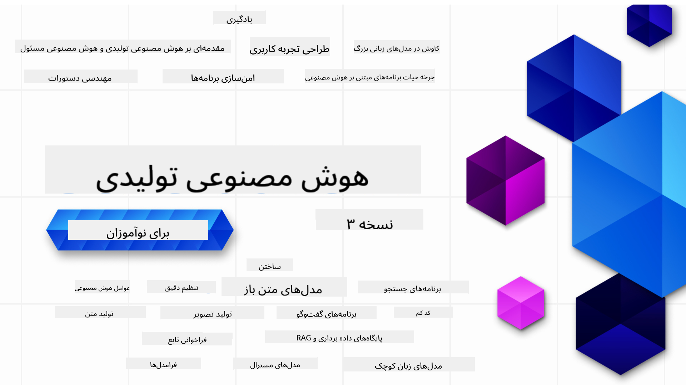

<!--
CO_OP_TRANSLATOR_METADATA:
{
  "original_hash": "5740c9b7fcb6919da1ea4df93475f331",
  "translation_date": "2025-07-09T06:19:32+00:00",
  "source_file": "README.md",
  "language_code": "fa"
}
-->

### ۲۱ درس که همه چیز لازم برای شروع ساخت برنامه‌های هوش مصنوعی مولد را به شما آموزش می‌دهد

### 🌐 پشتیبانی چندزبانه

#### پشتیبانی شده از طریق GitHub Action (خودکار و همیشه به‌روز)

[French](../fr/README.md) | [Spanish](../es/README.md) | [German](../de/README.md) | [Russian](../ru/README.md) | [Arabic](../ar/README.md) | [Persian (Farsi)](./README.md) | [Urdu](../ur/README.md) | [Chinese (Simplified)](../zh/README.md) | [Chinese (Traditional, Macau)](../mo/README.md) | [Chinese (Traditional, Hong Kong)](../hk/README.md) | [Chinese (Traditional, Taiwan)](../tw/README.md) | [Japanese](../ja/README.md) | [Korean](../ko/README.md) | [Hindi](../hi/README.md) | [Bengali](../bn/README.md) | [Marathi](../mr/README.md) | [Nepali](../ne/README.md) | [Punjabi (Gurmukhi)](../pa/README.md) | [Portuguese (Portugal)](../pt/README.md) | [Portuguese (Brazil)](../br/README.md) | [Italian](../it/README.md) | [Polish](../pl/README.md) | [Turkish](../tr/README.md) | [Greek](../el/README.md) | [Thai](../th/README.md) | [Swedish](../sv/README.md) | [Danish](../da/README.md) | [Norwegian](../no/README.md) | [Finnish](../fi/README.md) | [Dutch](../nl/README.md) | [Hebrew](../he/README.md) | [Vietnamese](../vi/README.md) | [Indonesian](../id/README.md) | [Malay](../ms/README.md) | [Tagalog (Filipino)](../tl/README.md) | [Swahili](../sw/README.md) | [Hungarian](../hu/README.md) | [Czech](../cs/README.md) | [Slovak](../sk/README.md) | [Romanian](../ro/README.md) | [Bulgarian](../bg/README.md) | [Serbian (Cyrillic)](../sr/README.md) | [Croatian](../hr/README.md) | [Slovenian](../sl/README.md) | [Ukrainian](../uk/README.md) | [Burmese (Myanmar)](../my/README.md)

# هوش مصنوعی مولد برای مبتدیان (نسخه ۳) - یک دوره آموزشی

با دوره جامع ۲۱ درسی ما از طرف Microsoft Cloud Advocates، اصول ساخت برنامه‌های هوش مصنوعی مولد را بیاموزید.

## 🌱 شروع کار

این دوره شامل ۲۱ درس است. هر درس موضوع خاص خود را پوشش می‌دهد، پس هر کجا که دوست دارید شروع کنید!

درس‌ها به دو دسته تقسیم شده‌اند: درس‌های «یادگیری» که مفاهیم هوش مصنوعی مولد را توضیح می‌دهند و درس‌های «ساخت» که علاوه بر توضیح مفهوم، نمونه کدهایی به زبان‌های **Python** و **TypeScript** ارائه می‌دهند، در صورت امکان.

برای توسعه‌دهندگان .NET، دوره [Generative AI for Beginners (.NET Edition)](https://github.com/microsoft/Generative-AI-for-beginners-dotnet?WT.mc_id=academic-105485-koreyst) را بررسی کنید!

هر درس همچنین بخشی به نام «ادامه یادگیری» دارد که ابزارهای آموزشی بیشتری را ارائه می‌دهد.

## آنچه نیاز دارید
### برای اجرای کدهای این دوره می‌توانید از یکی از موارد زیر استفاده کنید:
 - [Azure OpenAI Service](https://aka.ms/genai-beginners/azure-open-ai?WT.mc_id=academic-105485-koreyst) - **درس‌ها:** "aoai-assignment"
 - [GitHub Marketplace Model Catalog](https://aka.ms/genai-beginners/gh-models?WT.mc_id=academic-105485-koreyst) - **درس‌ها:** "githubmodels"
 - [OpenAI API](https://aka.ms/genai-beginners/open-ai?WT.mc_id=academic-105485-koreyst) - **درس‌ها:** "oai-assignment"
   
- دانش پایه‌ای از Python یا TypeScript مفید است - \*برای مبتدیان مطلق این دوره‌های [Python](https://aka.ms/genai-beginners/python?WT.mc_id=academic-105485-koreyst) و [TypeScript](https://aka.ms/genai-beginners/typescript?WT.mc_id=academic-105485-koreyst) را ببینید
- یک حساب GitHub برای [فورک کردن کل این مخزن](https://aka.ms/genai-beginners/github?WT.mc_id=academic-105485-koreyst) به حساب خودتان

ما یک درس **[راه‌اندازی دوره](./00-course-setup/README.md?WT.mc_id=academic-105485-koreyst)** ایجاد کرده‌ایم تا به شما در راه‌اندازی محیط توسعه کمک کند.

فراموش نکنید که این مخزن را [ستاره‌دار (🌟) کنید](https://docs.github.com/en/get-started/exploring-projects-on-github/saving-repositories-with-stars?WT.mc_id=academic-105485-koreyst) تا بعداً راحت‌تر پیدایش کنید.

## 🧠 آماده برای استقرار؟

اگر به دنبال نمونه‌های کد پیشرفته‌تر هستید، مجموعه [نمونه‌های کد هوش مصنوعی مولد](https://aka.ms/genai-beg-code?WT.mc_id=academic-105485-koreyst) ما را در هر دو زبان **Python** و **TypeScript** بررسی کنید.

## 🗣️ با دیگر یادگیرندگان آشنا شوید، پشتیبانی بگیرید

به [سرور رسمی Discord Azure AI Foundry](https://aka.ms/genai-discord?WT.mc_id=academic-105485-koreyst) بپیوندید تا با دیگر یادگیرندگانی که این دوره را می‌گذرانند آشنا شوید و پشتیبانی دریافت کنید.

سؤالات خود را بپرسید یا بازخورد محصول را در [انجمن توسعه‌دهندگان Azure AI Foundry](https://aka.ms/azureaifoundry/forum) در گیت‌هاب به اشتراک بگذارید.

## 🚀 در حال ساخت استارتاپ هستید؟

برای دریافت **اعتبار رایگان OpenAI** و تا سقف **۱۵۰ هزار دلار اعتبار Azure برای دسترسی به مدل‌های OpenAI از طریق Azure OpenAI Services**، در [Microsoft for Startups Founders Hub](https://aka.ms/genai-foundershub?WT.mc_id=academic-105485-koreyst) ثبت‌نام کنید.

## 🙏 می‌خواهید کمک کنید؟

اگر پیشنهادی دارید یا اشکالات املایی یا کد پیدا کرده‌اید، [یک Issue ثبت کنید](https://github.com/microsoft/generative-ai-for-beginners/issues?WT.mc_id=academic-105485-koreyst) یا [یک Pull Request ایجاد کنید](https://github.com/microsoft/generative-ai-for-beginners/pulls?WT.mc_id=academic-105485-koreyst).

## 📂 هر درس شامل:

- یک ویدئوی کوتاه معرفی موضوع
- درس مکتوب در فایل README
- نمونه کدهای Python و TypeScript که از Azure OpenAI و OpenAI API پشتیبانی می‌کنند
- لینک‌هایی به منابع اضافی برای ادامه یادگیری

## 🗃️ دروس

| #   | **لینک درس**                                                                                                                              | **توضیح**                                                                                 | **ویدئو**                                                                   | **یادگیری بیشتر**                                                             |
| --- | -------------------------------------------------------------------------------------------------------------------------------------------- | ----------------------------------------------------------------------------------------------- | --------------------------------------------------------------------------- | ------------------------------------------------------------------------------ |
| ۰۰  | [راه‌اندازی دوره](./00-course-setup/README.md?WT.mc_id=academic-105485-koreyst)                                                                 | **یادگیری:** چگونه محیط توسعه خود را راه‌اندازی کنیم                                            | ویدئو به زودی منتشر می‌شود                                                                 | [بیشتر بدانید](https://aka.ms/genai-collection?WT.mc_id=academic-105485-koreyst) |
| ۰۱  | [مقدمه‌ای بر هوش مصنوعی مولد و LLMها](./01-introduction-to-genai/README.md?WT.mc_id=academic-105485-koreyst)                              | **یادگیری:** درک اینکه هوش مصنوعی مولد چیست و مدل‌های زبان بزرگ (LLM) چگونه کار می‌کنند.       | [ویدئو](https://aka.ms/gen-ai-lesson-1-gh?WT.mc_id=academic-105485-koreyst) | [بیشتر بدانید](https://aka.ms/genai-collection?WT.mc_id=academic-105485-koreyst) |
| ۰۲  | [بررسی و مقایسه مدل‌های مختلف LLM](./02-exploring-and-comparing-different-llms/README.md?WT.mc_id=academic-105485-koreyst)             | **یادگیری:** چگونه مدل مناسب برای کاربرد خود را انتخاب کنیم                                      | [ویدئو](https://aka.ms/gen-ai-lesson2-gh?WT.mc_id=academic-105485-koreyst)  | [بیشتر بدانید](https://aka.ms/genai-collection?WT.mc_id=academic-105485-koreyst) |
| ۰۳  | [استفاده مسئولانه از هوش مصنوعی مولد](./03-using-generative-ai-responsibly/README.md?WT.mc_id=academic-105485-koreyst)                           | **یادگیری:** چگونه برنامه‌های هوش مصنوعی مولد را به صورت مسئولانه بسازیم                                  | [ویدئو](https://aka.ms/gen-ai-lesson3-gh?WT.mc_id=academic-105485-koreyst)  | [بیشتر بدانید](https://aka.ms/genai-collection?WT.mc_id=academic-105485-koreyst) |
| ۰۴  | [درک اصول مهندسی پرامپت](./04-prompt-engineering-fundamentals/README.md?WT.mc_id=academic-105485-koreyst)             | **یادگیری:** بهترین روش‌های مهندسی پرامپت به صورت عملی                                           | [ویدئو](https://aka.ms/gen-ai-lesson4-gh?WT.mc_id=academic-105485-koreyst)  | [بیشتر بدانید](https://aka.ms/genai-collection?WT.mc_id=academic-105485-koreyst) |
| ۰۵  | [ساخت پرامپت‌های پیشرفته](./05-advanced-prompts/README.md?WT.mc_id=academic-105485-koreyst)                                                | **یادگیری:** چگونه تکنیک‌های مهندسی پرامپت را به کار ببریم که نتایج پرامپت‌هایمان بهتر شود. | [ویدئو](https://aka.ms/gen-ai-lesson5-gh?WT.mc_id=academic-105485-koreyst)  | [بیشتر بدانید](https://aka.ms/genai-collection?WT.mc_id=academic-105485-koreyst) |
| ۰۶  | [ساخت برنامه‌های تولید متن](./06-text-generation-apps/README.md?WT.mc_id=academic-105485-koreyst)                                | **ساخت:** یک برنامه تولید متن با استفاده از Azure OpenAI / OpenAI API                                | [ویدئو](https://aka.ms/gen-ai-lesson6-gh?WT.mc_id=academic-105485-koreyst)  | [اطلاعات بیشتر](https://aka.ms/genai-collection?WT.mc_id=academic-105485-koreyst) |
| ۰۷  | [ساخت برنامه‌های چت](./07-building-chat-applications/README.md?WT.mc_id=academic-105485-koreyst)                                     | **ساخت:** تکنیک‌هایی برای ساخت و یکپارچه‌سازی بهینه برنامه‌های چت.               | [ویدئو](https://aka.ms/gen-ai-lessons7-gh?WT.mc_id=academic-105485-koreyst) | [اطلاعات بیشتر](https://aka.ms/genai-collection?WT.mc_id=academic-105485-koreyst) |
| ۰۸  | [ساخت برنامه‌های جستجو با پایگاه‌های داده برداری](./08-building-search-applications/README.md?WT.mc_id=academic-105485-koreyst)                        | **ساخت:** یک برنامه جستجو که از Embeddings برای جستجوی داده‌ها استفاده می‌کند.                        | [ویدئو](https://aka.ms/gen-ai-lesson8-gh?WT.mc_id=academic-105485-koreyst)  | [اطلاعات بیشتر](https://aka.ms/genai-collection?WT.mc_id=academic-105485-koreyst) |
| ۰۹  | [ساخت برنامه‌های تولید تصویر](./09-building-image-applications/README.md?WT.mc_id=academic-105485-koreyst)                        | **ساخت:** یک برنامه تولید تصویر                                                       | [ویدئو](https://aka.ms/gen-ai-lesson9-gh?WT.mc_id=academic-105485-koreyst)  | [اطلاعات بیشتر](https://aka.ms/genai-collection?WT.mc_id=academic-105485-koreyst) |
| ۱۰  | [ساخت برنامه‌های هوش مصنوعی کم‌کد](./10-building-low-code-ai-applications/README.md?WT.mc_id=academic-105485-koreyst)                       | **ساخت:** یک برنامه هوش مصنوعی مولد با استفاده از ابزارهای کم‌کد                                     | [ویدئو](https://aka.ms/gen-ai-lesson10-gh?WT.mc_id=academic-105485-koreyst) | [اطلاعات بیشتر](https://aka.ms/genai-collection?WT.mc_id=academic-105485-koreyst) |
| ۱۱  | [یکپارچه‌سازی برنامه‌های خارجی با Function Calling](./11-integrating-with-function-calling/README.md?WT.mc_id=academic-105485-koreyst) | **ساخت:** Function Calling چیست و کاربردهای آن در برنامه‌ها                          | [ویدئو](https://aka.ms/gen-ai-lesson11-gh?WT.mc_id=academic-105485-koreyst) | [اطلاعات بیشتر](https://aka.ms/genai-collection?WT.mc_id=academic-105485-koreyst) |
| ۱۲  | [طراحی UX برای برنامه‌های هوش مصنوعی](./12-designing-ux-for-ai-applications/README.md?WT.mc_id=academic-105485-koreyst)                         | **یادگیری:** چگونه اصول طراحی UX را هنگام توسعه برنامه‌های هوش مصنوعی مولد به کار ببریم         | [ویدئو](https://aka.ms/gen-ai-lesson12-gh?WT.mc_id=academic-105485-koreyst) | [اطلاعات بیشتر](https://aka.ms/genai-collection?WT.mc_id=academic-105485-koreyst) |
| ۱۳  | [امنیت برنامه‌های هوش مصنوعی مولد شما](./13-securing-ai-applications/README.md?WT.mc_id=academic-105485-koreyst)                         | **یادگیری:** تهدیدات و ریسک‌های سیستم‌های هوش مصنوعی و روش‌های ایمن‌سازی آن‌ها             | [ویدئو](https://aka.ms/gen-ai-lesson13-gh?WT.mc_id=academic-105485-koreyst) | [اطلاعات بیشتر](https://aka.ms/genai-collection?WT.mc_id=academic-105485-koreyst) |
| ۱۴  | [چرخه عمر برنامه‌های هوش مصنوعی مولد](./14-the-generative-ai-application-lifecycle/README.md?WT.mc_id=academic-105485-koreyst)           | **یادگیری:** ابزارها و معیارهای مدیریت چرخه عمر LLM و LLMOps                         | [ویدئو](https://aka.ms/gen-ai-lesson14-gh?WT.mc_id=academic-105485-koreyst) | [اطلاعات بیشتر](https://aka.ms/genai-collection?WT.mc_id=academic-105485-koreyst) |
| ۱۵  | [تولید افزوده بازیابی‌شده (RAG) و پایگاه‌های داده برداری](./15-rag-and-vector-databases/README.md?WT.mc_id=academic-105485-koreyst)        | **ساخت:** برنامه‌ای با استفاده از چارچوب RAG برای بازیابی embeddings از پایگاه‌های داده برداری  | [ویدئو](https://aka.ms/gen-ai-lesson15-gh?WT.mc_id=academic-105485-koreyst) | [اطلاعات بیشتر](https://aka.ms/genai-collection?WT.mc_id=academic-105485-koreyst) |
| ۱۶  | [مدل‌های متن‌باز و Hugging Face](./16-open-source-models/README.md?WT.mc_id=academic-105485-koreyst)                                    | **ساخت:** برنامه‌ای با استفاده از مدل‌های متن‌باز موجود در Hugging Face                    | [ویدئو](https://aka.ms/gen-ai-lesson16-gh?WT.mc_id=academic-105485-koreyst) | [اطلاعات بیشتر](https://aka.ms/genai-collection?WT.mc_id=academic-105485-koreyst) |
| ۱۷  | [عامل‌های هوش مصنوعی](./17-ai-agents/README.md?WT.mc_id=academic-105485-koreyst)                                                                       | **ساخت:** برنامه‌ای با استفاده از چارچوب عامل هوش مصنوعی                                           | [ویدئو](https://aka.ms/gen-ai-lesson17-gh?WT.mc_id=academic-105485-koreyst) | [اطلاعات بیشتر](https://aka.ms/genai-collection?WT.mc_id=academic-105485-koreyst) |
| ۱۸  | [تنظیم دقیق LLMها](./18-fine-tuning/README.md?WT.mc_id=academic-105485-koreyst)                                                              | **یادگیری:** چیستی، چرایی و چگونگی تنظیم دقیق LLMها                                            | [ویدئو](https://aka.ms/gen-ai-lesson18-gh?WT.mc_id=academic-105485-koreyst) | [اطلاعات بیشتر](https://aka.ms/genai-collection?WT.mc_id=academic-105485-koreyst) |
| ۱۹  | [ساخت با SLMها](./19-slm/README.md?WT.mc_id=academic-105485-koreyst)                                                              | **یادگیری:** مزایای ساخت با مدل‌های زبان کوچک                                            | ویدئو به زودی منتشر می‌شود | [اطلاعات بیشتر](https://aka.ms/genai-collection?WT.mc_id=academic-105485-koreyst) |
| ۲۰  | [ساخت با مدل‌های Mistral](./20-mistral/README.md?WT.mc_id=academic-105485-koreyst)                                                              | **یادگیری:** ویژگی‌ها و تفاوت‌های مدل‌های خانواده Mistral                                           | ویدئو به زودی منتشر می‌شود | [اطلاعات بیشتر](https://aka.ms/genai-collection?WT.mc_id=academic-105485-koreyst) |
| ۲۱  | [ساخت با مدل‌های Meta](./21-meta/README.md?WT.mc_id=academic-105485-koreyst)                                                              | **یادگیری:** ویژگی‌ها و تفاوت‌های مدل‌های خانواده Meta                                           | ویدئو به زودی منتشر می‌شود | [اطلاعات بیشتر](https://aka.ms/genai-collection?WT.mc_id=academic-105485-koreyst) |

### 🌟 تشکر ویژه

تشکر ویژه از [**John Aziz**](https://www.linkedin.com/in/john0isaac/) برای ایجاد تمام GitHub Actions و گردش‌های کاری

[**Bernhard Merkle**](https://www.linkedin.com/in/bernhard-merkle-738b73/) برای مشارکت‌های کلیدی در هر درس به منظور بهبود تجربه یادگیری و کدنویسی.

## 🎒 دوره‌های دیگر

تیم ما دوره‌های دیگری هم تولید می‌کند! نگاهی بیندازید به:

- [**جدید** پروتکل مدل کانتکست برای مبتدیان](https://github.com/microsoft/mcp-for-beginners?WT.mc_id=academic-105485-koreyst)
- [عامل‌های هوش مصنوعی برای مبتدیان](https://github.com/microsoft/ai-agents-for-beginners?WT.mc_id=academic-105485-koreyst)
- [هوش مصنوعی مولد برای مبتدیان با استفاده از .NET](https://github.com/microsoft/Generative-AI-for-beginners-dotnet?WT.mc_id=academic-105485-koreyst)
- [هوش مصنوعی مولد برای مبتدیان با استفاده از JavaScript](https://aka.ms/genai-js-course?WT.mc_id=academic-105485-koreyst)
- [یادگیری ماشین برای مبتدیان](https://aka.ms/ml-beginners?WT.mc_id=academic-105485-koreyst)
- [علم داده برای مبتدیان](https://aka.ms/datascience-beginners?WT.mc_id=academic-105485-koreyst)
- [هوش مصنوعی برای مبتدیان](https://aka.ms/ai-beginners?WT.mc_id=academic-105485-koreyst)
- [امنیت سایبری برای مبتدیان](https://github.com/microsoft/Security-101??WT.mc_id=academic-96948-sayoung)
- [توسعه وب برای مبتدیان](https://aka.ms/webdev-beginners?WT.mc_id=academic-105485-koreyst)
- [اینترنت اشیا برای مبتدیان](https://aka.ms/iot-beginners?WT.mc_id=academic-105485-koreyst)
- [توسعه XR برای مبتدیان](https://github.com/microsoft/xr-development-for-beginners?WT.mc_id=academic-105485-koreyst)
- [تسلط بر GitHub Copilot برای برنامه‌نویسی جفتی هوش مصنوعی](https://aka.ms/GitHubCopilotAI?WT.mc_id=academic-105485-koreyst)
- [تسلط بر GitHub Copilot برای توسعه‌دهندگان C#/.NET](https://github.com/microsoft/mastering-github-copilot-for-dotnet-csharp-developers?WT.mc_id=academic-105485-koreyst)
- [ماجراجویی انتخاب Copilot خودتان](https://github.com/microsoft/CopilotAdventures?WT.mc_id=academic-105485-koreyst)

**سلب مسئولیت**:  
این سند با استفاده از سرویس ترجمه هوش مصنوعی [Co-op Translator](https://github.com/Azure/co-op-translator) ترجمه شده است. در حالی که ما در تلاش برای دقت هستیم، لطفاً توجه داشته باشید که ترجمه‌های خودکار ممکن است حاوی خطاها یا نادرستی‌هایی باشند. سند اصلی به زبان بومی خود باید به عنوان منبع معتبر در نظر گرفته شود. برای اطلاعات حیاتی، ترجمه حرفه‌ای انسانی توصیه می‌شود. ما مسئول هیچ گونه سوءتفاهم یا تفسیر نادرستی که از استفاده این ترجمه ناشی شود، نیستیم.