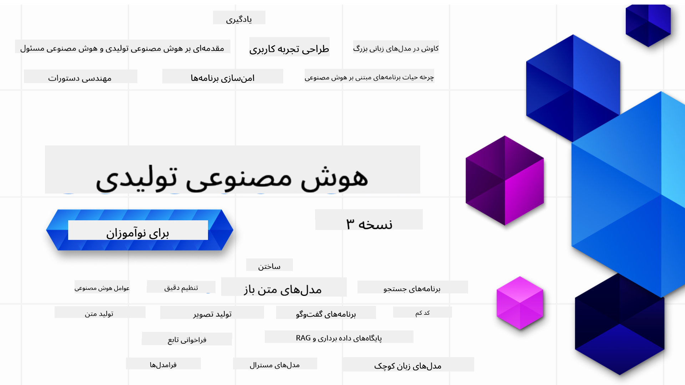

<!--
CO_OP_TRANSLATOR_METADATA:
{
  "original_hash": "6e3f4c8a4f323b8eab1cf11ded304b0f",
  "translation_date": "2025-06-25T07:32:11+00:00",
  "source_file": "README.md",
  "language_code": "fa"
}
-->

### ۲۱ درس که هر آنچه برای شروع ساخت برنامه‌های هوش مصنوعی مولد نیاز دارید به شما آموزش می‌دهد

### 🌐 پشتیبانی چندزبانه

#### پشتیبانی شده توسط GitHub Action (خودکار و همیشه به‌روز)
| [فرانسوی](../fr/README.md) | [اسپانیایی](../es/README.md) | [آلمانی](../de/README.md) | [روسی](../ru/README.md) | [عربی](../ar/README.md) | [فارسی](./README.md) | [اردو](../ur/README.md) | [چینی (ساده شده)](../zh/README.md) | [چینی (سنتی، ماکائو)](../mo/README.md) | [چینی (سنتی، هنگ کنگ)](../hk/README.md) | [چینی (سنتی، تایوان)](../tw/README.md) | [ژاپنی](../ja/README.md) | [کره‌ای](../ko/README.md) | [هندی](../hi/README.md) | [بنگالی](../bn/README.md) | [مراتی](../mr/README.md) | [نپالی](../ne/README.md) | [پنجابی (گورموکی)](../pa/README.md) | [پرتغالی (پرتغال)](../pt/README.md) | [پرتغالی (برزیل)](../br/README.md) | [ایتالیایی](../it/README.md) | [لهستانی](../pl/README.md) | [ترکی](../tr/README.md) | [یونانی](../el/README.md) | [تایلندی](../th/README.md) | [سوئدی](../sv/README.md) | [دانمارکی](../da/README.md) | [نروژی](../no/README.md) | [فنلاندی](../fi/README.md) | [هلندی](../nl/README.md) | [عبری](../he/README.md) | [ویتنامی](../vi/README.md) | [اندونزیایی](../id/README.md) | [مالایی](../ms/README.md) | [تاگالوگ (فیلیپینی)](../tl/README.md) | [سواحیلی](../sw/README.md) | [مجاری](../hu/README.md) | [چکی](../cs/README.md) | [اسلواکی](../sk/README.md) | [رومانیایی](../ro/README.md) | [بلغاری](../bg/README.md) | [صربی (سیریلیک)](../sr/README.md) | [کرواتی](../hr/README.md) | [اسلوونیایی](../sl/README.md)
# هوش مصنوعی تولیدی برای مبتدیان (نسخه 3) - یک دوره آموزشی

اصول ساخت برنامه‌های هوش مصنوعی تولیدی را با دوره جامع 21 درسی ما از کارشناسان ابر مایکروسافت بیاموزید.

## 🌱 شروع کنید

این دوره شامل 21 درس است. هر درس موضوع خاص خود را پوشش می‌دهد، بنابراین هر کجا که دوست دارید شروع کنید!

درس‌ها یا به عنوان "یادگیری" برای توضیح یک مفهوم هوش مصنوعی تولیدی یا به عنوان "ساخت" برای توضیح یک مفهوم و نمونه‌های کد در هر دو زبان **پایتون** و **تایپ‌اسکریپت** برچسب‌گذاری شده‌اند.

برای توسعه‌دهندگان .NET، نگاهی به [هوش مصنوعی تولیدی برای مبتدیان (نسخه .NET)](https://github.com/microsoft/Generative-AI-for-beginners-dotnet?WT.mc_id=academic-105485-koreyst) بیندازید!

هر درس همچنین شامل بخشی به نام "ادامه یادگیری" با ابزارهای آموزشی اضافی است.

## آنچه شما نیاز دارید
### برای اجرای کد این دوره، می‌توانید از یکی از موارد زیر استفاده کنید:
- [خدمات Azure OpenAI](https://aka.ms/genai-beginners/azure-open-ai?WT.mc_id=academic-105485-koreyst) - **درس‌ها:** "aoai-assignment"
- [کاتالوگ مدل بازار GitHub](https://aka.ms/genai-beginners/gh-models?WT.mc_id=academic-105485-koreyst) - **درس‌ها:** "githubmodels"
- [API OpenAI](https://aka.ms/genai-beginners/open-ai?WT.mc_id=academic-105485-koreyst) - **درس‌ها:** "oai-assignment"

- دانش پایه‌ای از پایتون یا تایپ‌اسکریپت مفید است - \*برای مبتدیان مطلق به این دوره‌های [پایتون](https://aka.ms/genai-beginners/python?WT.mc_id=academic-105485-koreyst) و [تایپ‌اسکریپت](https://aka.ms/genai-beginners/typescript?WT.mc_id=academic-105485-koreyst) نگاهی بیندازید
- یک حساب GitHub برای [فورک کردن این مخزن به طور کامل](https://aka.ms/genai-beginners/github?WT.mc_id=academic-105485-koreyst) به حساب GitHub خود

ما یک درس **[تنظیم دوره](./00-course-setup/README.md?WT.mc_id=academic-105485-koreyst)** ایجاد کرده‌ایم تا به شما در تنظیم محیط توسعه کمک کند.

فراموش نکنید که [این مخزن را ستاره‌دار (🌟) کنید](https://docs.github.com/en/get-started/exploring-projects-on-github/saving-repositories-with-stars?WT.mc_id=academic-105485-koreyst) تا بعداً به راحتی پیدا کنید.

## 🧠 آماده برای استقرار؟

اگر به دنبال نمونه‌های کد پیشرفته‌تر هستید، به مجموعه [نمونه‌های کد هوش مصنوعی تولیدی](https://aka.ms/genai-beg-code?WT.mc_id=academic-105485-koreyst) ما در هر دو زبان **پایتون** و **تایپ‌اسکریپت** نگاهی بیندازید.

## 🗣️ ملاقات با سایر یادگیرندگان، دریافت پشتیبانی

به سرور رسمی Discord ما [Azure AI Foundry](https://aka.ms/genai-discord?WT.mc_id=academic-105485-koreyst) بپیوندید تا با سایر یادگیرندگان این دوره ملاقات و شبکه‌سازی کنید و پشتیبانی دریافت کنید.

سوال بپرسید یا بازخورد محصول خود را در [فروم توسعه‌دهندگان Azure AI Foundry](https://aka.ms/azureaifoundry/forum) در گیت‌هاب به اشتراک بگذارید.

## 🚀 ساخت یک استارتاپ؟

برای [مرکز بنیان‌گذاران مایکروسافت برای استارتاپ‌ها](https://aka.ms/genai-foundershub?WT.mc_id=academic-105485-koreyst) ثبت‌نام کنید تا **اعتبار رایگان OpenAI** و تا **150 هزار دلار اعتبار Azure برای دسترسی به مدل‌های OpenAI از طریق خدمات Azure OpenAI** دریافت کنید.

## 🙏 می‌خواهید کمک کنید؟

آیا پیشنهاداتی دارید یا خطاهای املایی یا کد پیدا کرده‌اید؟ [یک مسئله ایجاد کنید](https://github.com/microsoft/generative-ai-for-beginners/issues?WT.mc_id=academic-105485-koreyst) یا [یک درخواست کشش ایجاد کنید](https://github.com/microsoft/generative-ai-for-beginners/pulls?WT.mc_id=academic-105485-koreyst)

## 📂 هر درس شامل:

- یک ویدیوی کوتاه معرفی به موضوع
- یک درس نوشته شده در README
- نمونه‌های کد پایتون و تایپ‌اسکریپت که از Azure OpenAI و OpenAI API پشتیبانی می‌کنند
- لینک‌های به منابع اضافی برای ادامه یادگیری شما

## 🗃️ درس‌ها

| #   | **لینک درس**                                                                                                                              | **توضیحات**                                                                                 | **ویدیو**                                                                   | **یادگیری اضافی**                                                             |
| --- | -------------------------------------------------------------------------------------------------------------------------------------------- | ----------------------------------------------------------------------------------------------- | --------------------------------------------------------------------------- | ------------------------------------------------------------------------------ |
| 00  | [تنظیم دوره](./00-course-setup/README.md?WT.mc_id=academic-105485-koreyst)                                                                 | **یادگیری:** چگونه محیط توسعه خود را تنظیم کنید                                            | ویدیو به زودی                                                                 | [بیشتر بیاموزید](https://aka.ms/genai-collection?WT.mc_id=academic-105485-koreyst) |
| 01  | [مقدمه‌ای بر هوش مصنوعی تولیدی و LLMها](./01-introduction-to-genai/README.md?WT.mc_id=academic-105485-koreyst)                              | **یادگیری:** درک اینکه هوش مصنوعی تولیدی چیست و چگونه مدل‌های زبان بزرگ (LLMها) کار می‌کنند.       | [ویدیو](https://aka.ms/gen-ai-lesson-1-gh?WT.mc_id=academic-105485-koreyst) | [بیشتر بیاموزید](https://aka.ms/genai-collection?WT.mc_id=academic-105485-koreyst) |
| 02  | [کاوش و مقایسه LLMهای مختلف](./02-exploring-and-comparing-different-llms/README.md?WT.mc_id=academic-105485-koreyst)             | **یادگیری:** چگونه مدل مناسب برای مورد استفاده خود را انتخاب کنید                                      | [ویدیو](https://aka.ms/gen-ai-lesson2-gh?WT.mc_id=academic-105485-koreyst)  | [بیشتر بیاموزید](https://aka.ms/genai-collection?WT.mc_id=academic-105485-koreyst) |
| 03  | [استفاده مسئولانه از هوش مصنوعی تولیدی](./03-using-generative-ai-responsibly/README.md?WT.mc_id=academic-105485-koreyst)                           | **یادگیری:** چگونه برنامه‌های هوش مصنوعی تولیدی را به صورت مسئولانه بسازید                                  | [ویدیو](https://aka.ms/gen-ai-lesson3-gh?WT.mc_id=academic-105485-koreyst)  | [بیشتر بیاموزید](https://aka.ms/genai-collection?WT.mc_id=academic-105485-koreyst) |
| 04  | [درک اصول مهندسی پرامپت](./04-prompt-engineering-fundamentals/README.md?WT.mc_id=academic-105485-koreyst)             | **یادگیری:** بهترین روش‌های مهندسی پرامپت به صورت عملی                                           | [ویدیو](https://aka.ms/gen-ai-lesson4-gh?WT.mc_id=academic-105485-koreyst)  | [بیشتر بیاموزید](https://aka.ms/genai-collection?WT.mc_id=academic-105485-koreyst) |
| 05  | [ایجاد درخواست‌های پیشرفته](./05-advanced-prompts/README.md?WT.mc_id=academic-105485-koreyst)                                                | **یادگیری:** چگونه تکنیک‌های مهندسی درخواست را به کار ببریم که نتیجه درخواست‌های شما را بهبود بخشد. | [ویدئو](https://aka.ms/gen-ai-lesson5-gh?WT.mc_id=academic-105485-koreyst)  | [بیشتر بدانید](https://aka.ms/genai-collection?WT.mc_id=academic-105485-koreyst) |
| 06  | [ساخت برنامه‌های تولید متن](./06-text-generation-apps/README.md?WT.mc_id=academic-105485-koreyst)                                | **ساخت:** یک برنامه تولید متن با استفاده از Azure OpenAI / OpenAI API                                | [ویدئو](https://aka.ms/gen-ai-lesson6-gh?WT.mc_id=academic-105485-koreyst)  | [بیشتر بدانید](https://aka.ms/genai-collection?WT.mc_id=academic-105485-koreyst) |
| 07  | [ساخت برنامه‌های گفتگو](./07-building-chat-applications/README.md?WT.mc_id=academic-105485-koreyst)                                     | **ساخت:** تکنیک‌هایی برای ساخت و ادغام کارآمد برنامه‌های گفتگو.               | [ویدئو](https://aka.ms/gen-ai-lessons7-gh?WT.mc_id=academic-105485-koreyst) | [بیشتر بدانید](https://aka.ms/genai-collection?WT.mc_id=academic-105485-koreyst) |
| 08  | [ساخت برنامه‌های جستجو با پایگاه داده‌های برداری](./08-building-search-applications/README.md?WT.mc_id=academic-105485-koreyst)                        | **ساخت:** یک برنامه جستجو که از Embeddings برای جستجوی داده‌ها استفاده می‌کند.                        | [ویدئو](https://aka.ms/gen-ai-lesson8-gh?WT.mc_id=academic-105485-koreyst)  | [بیشتر بدانید](https://aka.ms/genai-collection?WT.mc_id=academic-105485-koreyst) |
| 09  | [ساخت برنامه‌های تولید تصویر](./09-building-image-applications/README.md?WT.mc_id=academic-105485-koreyst)                        | **ساخت:** یک برنامه تولید تصویر                                                       | [ویدئو](https://aka.ms/gen-ai-lesson9-gh?WT.mc_id=academic-105485-koreyst)  | [بیشتر بدانید](https://aka.ms/genai-collection?WT.mc_id=academic-105485-koreyst) |
| 10  | [ساخت برنامه‌های هوش مصنوعی با کد کم](./10-building-low-code-ai-applications/README.md?WT.mc_id=academic-105485-koreyst)                       | **ساخت:** یک برنامه هوش مصنوعی تولیدی با استفاده از ابزارهای کد کم                                     | [ویدئو](https://aka.ms/gen-ai-lesson10-gh?WT.mc_id=academic-105485-koreyst) | [بیشتر بدانید](https://aka.ms/genai-collection?WT.mc_id=academic-105485-koreyst) |
| 11  | [ادغام برنامه‌های خارجی با فراخوانی تابع](./11-integrating-with-function-calling/README.md?WT.mc_id=academic-105485-koreyst) | **ساخت:** فراخوانی تابع چیست و موارد استفاده آن برای برنامه‌ها                          | [ویدئو](https://aka.ms/gen-ai-lesson11-gh?WT.mc_id=academic-105485-koreyst) | [بیشتر بدانید](https://aka.ms/genai-collection?WT.mc_id=academic-105485-koreyst) |
| 12  | [طراحی UX برای برنامه‌های هوش مصنوعی](./12-designing-ux-for-ai-applications/README.md?WT.mc_id=academic-105485-koreyst)                         | **یادگیری:** چگونه اصول طراحی UX را هنگام توسعه برنامه‌های هوش مصنوعی تولیدی به کار ببریم         | [ویدئو](https://aka.ms/gen-ai-lesson12-gh?WT.mc_id=academic-105485-koreyst) | [بیشتر بدانید](https://aka.ms/genai-collection?WT.mc_id=academic-105485-koreyst) |
| 13  | [امنیت برنامه‌های هوش مصنوعی تولیدی شما](./13-securing-ai-applications/README.md?WT.mc_id=academic-105485-koreyst)                         | **یادگیری:** تهدیدها و خطرات سیستم‌های هوش مصنوعی و روش‌های امن کردن این سیستم‌ها.             | [ویدئو](https://aka.ms/gen-ai-lesson13-gh?WT.mc_id=academic-105485-koreyst) | [بیشتر بدانید](https://aka.ms/genai-collection?WT.mc_id=academic-105485-koreyst) |
| 14  | [چرخه عمر برنامه‌های هوش مصنوعی تولیدی](./14-the-generative-ai-application-lifecycle/README.md?WT.mc_id=academic-105485-koreyst)           | **یادگیری:** ابزارها و معیارها برای مدیریت چرخه عمر LLM و LLMOps                         | [ویدئو](https://aka.ms/gen-ai-lesson14-gh?WT.mc_id=academic-105485-koreyst) | [بیشتر بدانید](https://aka.ms/genai-collection?WT.mc_id=academic-105485-koreyst) |
| 15  | [بازیابی تقویت‌شده با تولید (RAG) و پایگاه‌های داده برداری](./15-rag-and-vector-databases/README.md?WT.mc_id=academic-105485-koreyst)        | **بسازید:** یک برنامه با استفاده از چارچوب RAG برای بازیابی جاسازی‌ها از پایگاه‌های داده برداری  | [ویدیو](https://aka.ms/gen-ai-lesson15-gh?WT.mc_id=academic-105485-koreyst) | [بیشتر بیاموزید](https://aka.ms/genai-collection?WT.mc_id=academic-105485-koreyst) |
| 16  | [مدل‌های متن‌باز و Hugging Face](./16-open-source-models/README.md?WT.mc_id=academic-105485-koreyst)                                    | **بسازید:** یک برنامه با استفاده از مدل‌های متن‌باز موجود در Hugging Face                    | [ویدیو](https://aka.ms/gen-ai-lesson16-gh?WT.mc_id=academic-105485-koreyst) | [بیشتر بیاموزید](https://aka.ms/genai-collection?WT.mc_id=academic-105485-koreyst) |
| 17  | [عوامل هوش مصنوعی](./17-ai-agents/README.md?WT.mc_id=academic-105485-koreyst)                                                                       | **بسازید:** یک برنامه با استفاده از چارچوب عامل هوش مصنوعی                                           | [ویدیو](https://aka.ms/gen-ai-lesson17-gh?WT.mc_id=academic-105485-koreyst) | [بیشتر بیاموزید](https://aka.ms/genai-collection?WT.mc_id=academic-105485-koreyst) |
| 18  | [تنظیم دقیق مدل‌های زبان بزرگ (LLMs)](./18-fine-tuning/README.md?WT.mc_id=academic-105485-koreyst)                                                              | **بیاموزید:** چیستی، چرایی و چگونگی تنظیم دقیق مدل‌های زبان بزرگ                                            | [ویدیو](https://aka.ms/gen-ai-lesson18-gh?WT.mc_id=academic-105485-koreyst) | [بیشتر بیاموزید](https://aka.ms/genai-collection?WT.mc_id=academic-105485-koreyst) |
| 19  | [ساخت با مدل‌های زبان کوچک (SLMs)](./19-slm/README.md?WT.mc_id=academic-105485-koreyst)                                                              | **بیاموزید:** مزایای ساخت با مدل‌های زبان کوچک                                            | ویدیو به زودی | [بیشتر بیاموزید](https://aka.ms/genai-collection?WT.mc_id=academic-105485-koreyst) |
| 20  | [ساخت با مدل‌های Mistral](./20-mistral/README.md?WT.mc_id=academic-105485-koreyst)                                                              | **بیاموزید:** ویژگی‌ها و تفاوت‌های مدل‌های خانواده Mistral                                           | ویدیو به زودی | [بیشتر بیاموزید](https://aka.ms/genai-collection?WT.mc_id=academic-105485-koreyst) |
| 21  | [ساخت با مدل‌های Meta](./21-meta/README.md?WT.mc_id=academic-105485-koreyst)                                                              | **بیاموزید:** ویژگی‌ها و تفاوت‌های مدل‌های خانواده Meta                                           | ویدیو به زودی | [بیشتر بیاموزید](https://aka.ms/genai-collection?WT.mc_id=academic-105485-koreyst) |

### 🌟 تشکر ویژه

تشکر ویژه از [**جان عزیز**](https://www.linkedin.com/in/john0isaac/) برای ایجاد تمامی اقدامات و جریان‌های کاری GitHub

[**برنهارد مرکل**](https://www.linkedin.com/in/bernhard-merkle-738b73/) برای مشارکت‌های کلیدی در هر درس برای بهبود تجربه یادگیرنده و کد.

## 🎒 دوره‌های دیگر

تیم ما دوره‌های دیگری تولید می‌کند! نگاهی بیندازید به:

- [**جدید** پروتکل زمینه مدل برای مبتدیان](https://github.com/microsoft/mcp-for-beginners?WT.mc_id=academic-105485-koreyst)
- [عوامل هوش مصنوعی برای مبتدیان](https://github.com/microsoft/ai-agents-for-beginners?WT.mc_id=academic-105485-koreyst)
- [هوش مصنوعی مولد برای مبتدیان با استفاده از .NET](https://github.com/microsoft/Generative-AI-for-beginners-dotnet?WT.mc_id=academic-105485-koreyst)
- [هوش مصنوعی مولد برای مبتدیان با استفاده از جاوااسکریپت](https://aka.ms/genai-js-course?WT.mc_id=academic-105485-koreyst)
- [یادگیری ماشین برای مبتدیان](https://aka.ms/ml-beginners?WT.mc_id=academic-105485-koreyst)
- [علم داده برای مبتدیان](https://aka.ms/datascience-beginners?WT.mc_id=academic-105485-koreyst)
- [هوش مصنوعی برای مبتدیان](https://aka.ms/ai-beginners?WT.mc_id=academic-105485-koreyst)
- [امنیت سایبری برای مبتدیان](https://github.com/microsoft/Security-101??WT.mc_id=academic-96948-sayoung)
- [توسعه وب برای مبتدیان](https://aka.ms/webdev-beginners?WT.mc_id=academic-105485-koreyst)
- [اینترنت اشیا برای مبتدیان](https://aka.ms/iot-beginners?WT.mc_id=academic-105485-koreyst)
- [توسعه XR برای مبتدیان](https://github.com/microsoft/xr-development-for-beginners?WT.mc_id=academic-105485-koreyst)
- [استادی در GitHub Copilot برای برنامه‌نویسی جفتی هوش مصنوعی](https://aka.ms/GitHubCopilotAI?WT.mc_id=academic-105485-koreyst)
- [استادی در GitHub Copilot برای توسعه‌دهندگان C#/.NET](https://github.com/microsoft/mastering-github-copilot-for-dotnet-csharp-developers?WT.mc_id=academic-105485-koreyst)
- [ماجراجویی Copilot خود را انتخاب کنید](https://github.com/microsoft/CopilotAdventures?WT.mc_id=academic-105485-koreyst)

**سلب مسئولیت**:  
این سند با استفاده از سرویس ترجمه هوش مصنوعی [Co-op Translator](https://github.com/Azure/co-op-translator) ترجمه شده است. در حالی که ما به دقت تلاش می‌کنیم، لطفاً توجه داشته باشید که ترجمه‌های خودکار ممکن است شامل خطاها یا نادرستی‌ها باشد. سند اصلی به زبان بومی خود باید به عنوان منبع معتبر در نظر گرفته شود. برای اطلاعات حیاتی، ترجمه حرفه‌ای انسانی توصیه می‌شود. ما هیچ مسئولیتی در قبال سوءتفاهم‌ها یا تفسیرهای نادرست ناشی از استفاده از این ترجمه نداریم.