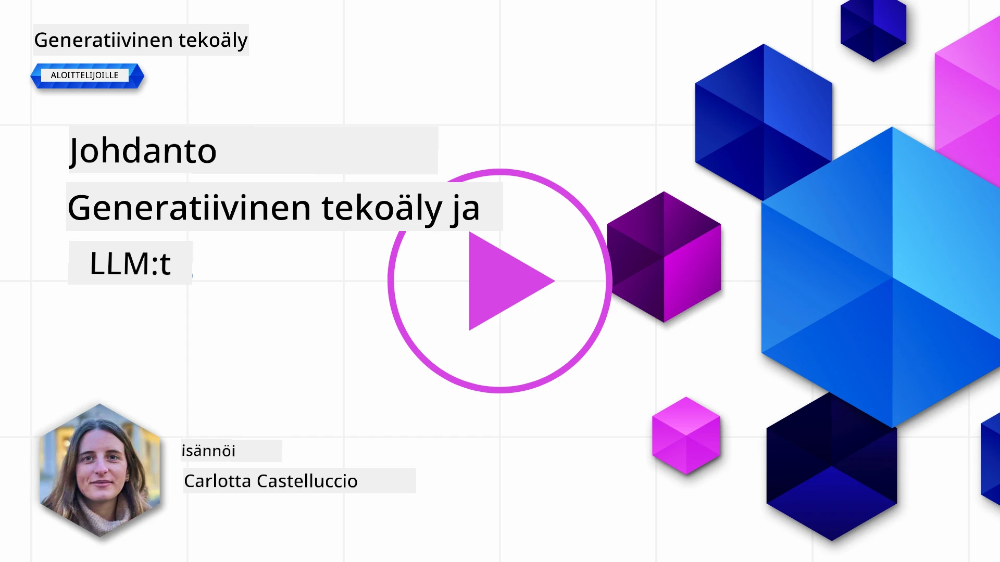
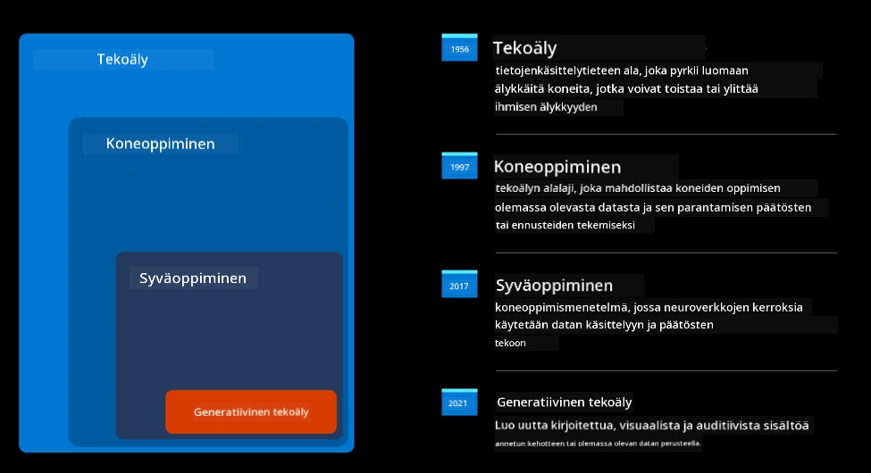
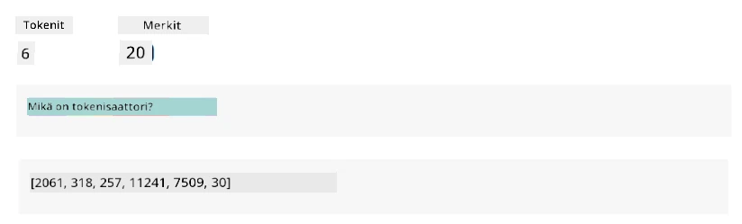
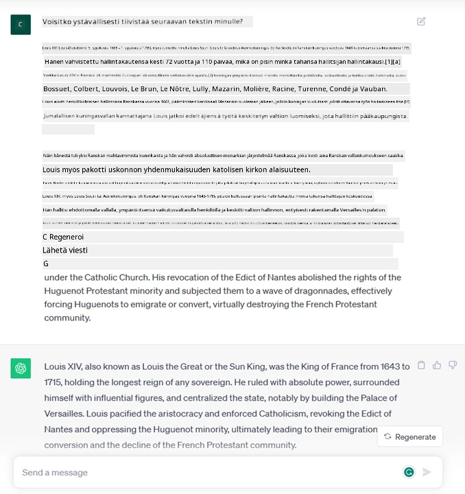
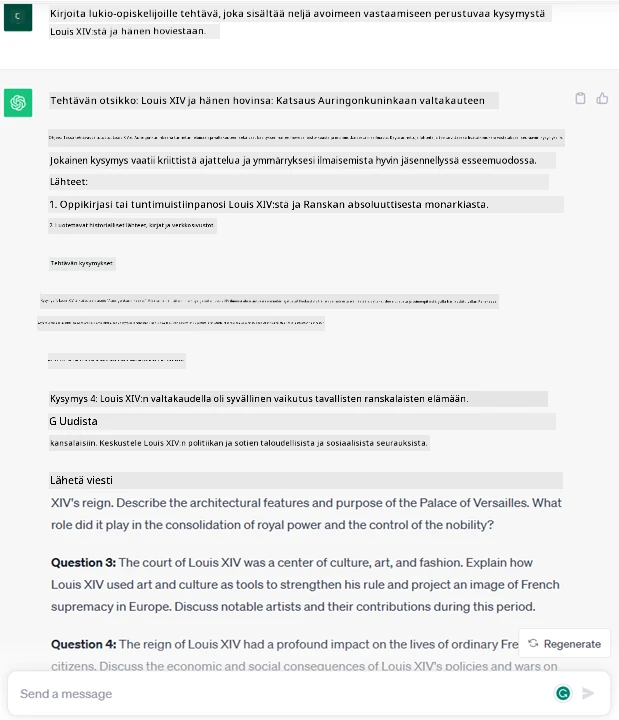
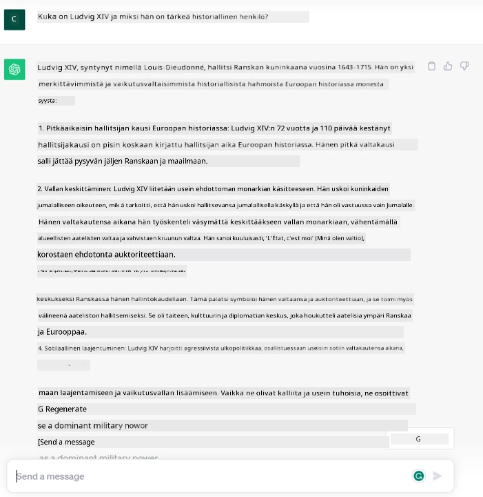
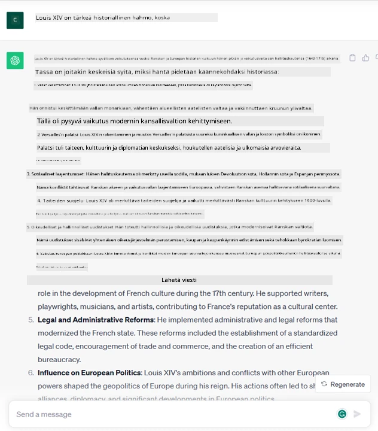
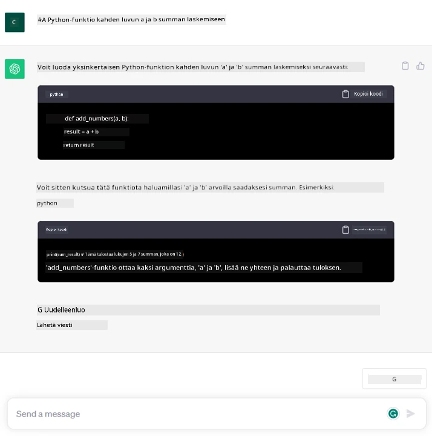

# Johdatus generatiiviseen tekoälyyn ja suuriin kielimalleihin

_(Napsauta yllä olevaa kuvaa katsellaksesi tämän oppitunnin videon)_

Generatiivinen tekoäly on tekoälyä, joka pystyy luomaan tekstiä, kuvia ja muita sisältötyyppejä. Se tekee teknologiasta hienon, koska se demokratisoi tekoälyn; kuka tahansa voi käyttää sitä pelkällä tekstikehotteella, luonnollisella kielellä kirjoitetulla lauseella. Sinun ei tarvitse oppia kieliä kuten Java tai SQL saadaksesi aikaan jotain merkityksellistä, tarvitset vain oman kielen, sanot mitä haluat ja saat ehdotuksen tekoälymallilta. Sovellukset ja vaikutukset ovat valtavia: kirjoitat tai ymmärrät raportteja, kirjoitat sovelluksia ja paljon muuta, kaikki sekunneissa.

Tässä opetussuunnitelmassa tutkimme, kuinka startup-yrityksemme hyödyntää generatiivista tekoälyä avataksesi uusia tilanteita koulutuksen maailmassa ja miten ratkaisemme väistämättömät haasteet sovelluksen yhteiskunnallisista vaikutuksista ja teknologian rajoituksista.

## Johdanto

Tämä oppitunti kattaa:

- Liiketoimintatilanneen esittelyn: startup-ideamme ja missiomme.
- Generatiivinen tekoäly ja miten päädyimme nykyiseen teknologiseen maisemaan.
- Suurten kielimallien sisäinen toiminta.
- Suurten kielimallien pääominaisuudet ja käytännön käyttötapaukset.

## Oppimistavoitteet

Oppitunnin suorittamisen jälkeen ymmärrät:

- Mitä generatiivinen tekoäly on ja miten suuret kielimallit toimivat.
- Kuinka voit hyödyntää suuria kielimalleja eri käyttötapauksiin, painottaen koulutusskenaarioita.

## Skenaario: koulutusstartup-yrityksemme

Generatiivinen tekoäly (AI) edustaa tekoälyteknologian huippua, rikkoen aiemmin mahdottomiksi katsottuja rajoja. Generatiivisilla tekoälymalleilla on useita kykyjä ja sovelluksia, mutta tässä opetussuunnitelmassa tarkastelemme, kuinka se mullistaa koulutusta kuvitteellisen startup-yrityksen kautta. Tätä startup-yritystä kutsumme _meidän startuppiksemme_. Startuppimme toimii koulutusalalla kunnianhimoisella missiona,

> _parantaa oppimisen saavutettavuutta maailmanlaajuisesti, varmistaen tasa-arvoisen pääsyn koulutukseen ja tarjoamalla jokaiselle oppijalle heidän tarpeidensa mukaiset henkilökohtaiset oppimiskokemukset_.

Startup-tiimimme on tietoinen siitä, etteivät tavoitteemme ole saavutettavissa ilman yhdestä modernin ajan tehokkaimmasta työkalusta – Suurista kielimalleista (LLM).

Generatiivisen tekoälyn odotetaan mullistavan nykyisen oppimis- ja opetustavan, tarjoten opiskelijoille virtuaalisia opettajia 24 tuntia vuorokaudessa, jotka tarjoavat valtavasti tietoa ja esimerkkejä, ja opettajien kykenevän käyttämään innovatiivisia työkaluja oppilaiden arviointiin ja palautteen antamiseen.

Aloitetaan määrittelemällä joitakin peruskäsitteitä ja termistöä, joita käytämme läpi opetussuunnitelman.

## Miten Generatiivinen tekoäly kehittyi?

Huolimatta siitä poikkeuksellisesta _hypestä_, jota viime aikojen generatiivisten tekoälymallien julkistus on aiheuttanut, tämä teknologia on ollut kehityksessä vuosikymmeniä, ensimmäisten tutkimuspyrkimysten ajoittuessa 1960-luvulle. Nykyään tekoälyllä on ihmisen kognitiokykyjä, kuten keskustelukykyä, joita esittelevät esimerkiksi [OpenAI ChatGPT](https://openai.com/chatgpt) tai [Microsoft Copilot](https://copilot.microsoft.com/?WT.mc_id=academic-105485-koreyst), joka käyttää GPT-mallia myös keskustelupohjaisessa verkkohakukokemuksessa.

Aluksi tekoälyn prototyypit olivat kirjoitettuja chattibotteja, jotka perustuivat asiantuntijaryhmältä koostettuun tietokantaan, joka oli esitetty tietokoneessa. Tietokannassa olevat vastaukset laukaistiin avainsanojen perusteella käyttäjän tekstisyötteessä.
Kuitenkin kävi pian ilmi, että tällainen lähestymistapa, jossa käytettiin kirjoitettuja chattibotteja, ei skaalautunut hyvin.

### Tilastollinen lähestymistapa tekoälyyn: koneoppiminen

Käännekohta tuli 1990-luvulla, kun sovellettiin tilastollista lähestymistapaa teksti-analyysiin. Tämä johti uusien algoritmien kehittämiseen – koneoppimiseen – joka kykenee oppimaan kuvioita datasta ilman että sitä ohjelmoidaan eksplisiittisesti. Tämä lähestymistapa sallii koneiden simuloida ihmisen kielen ymmärtämistä: tilastollinen malli koulutetaan tekstin ja siihen liittyvien tunnisteiden pareilla, mikä mahdollistaa mallin luokitella tuntemattoman syötteen ennalta määrätyllä tunnisteella, joka edustaa viestin tarkoitusta.

### Neuroverkot ja nykyaikaiset virtuaaliassistentit

Viime vuosina laitteiston teknologinen kehittyminen, joka on kykenevä käsittelemään suurempia tietomääriä ja monimutkaisempia laskutoimituksia, on kannustanut tekoälytutkimukseen, johtanut kehittyneisiin koneoppimisalgoritmeihin, tunnetaan myös neuroverkkoina tai syväoppimisalgoritmeina.

Neuroverkot (erityisesti toistuvat neuroverkot – RNN:t) paransivat merkittävästi luonnollisen kielen käsittelyä, mahdollistaen tekstin merkityksen esittämisen merkityksellisemmällä tavalla, arvostaen sanan kontekstia lauseessa.

Tämä on teknologia, joka käynnisti virtuaaliassistentit uuden vuosituhannen ensimmäisellä vuosikymmenellä, erittäin taitavia tulkitsemaan ihmiskieltä, tunnistamaan tarpeen ja suorittamaan toimenpiteen tarpeen tyydyttämiseksi – kuten vastaamalla ennalta määrätyllä skriptillä tai käyttämällä kolmannen osapuolen palvelua.

### Nykyhetki, generatiivinen tekoäly

Näin siis päädyimme tämän päivän generatiiviseen tekoälyyn, jota voidaan pitää syväoppimisen alalajina.

Vuosisatojen tutkimuksen jälkeen tekoälyn alalla uusi malliarkkitehtuuri – kutsutaan _Transformeriksi_ – ylitti RNN:n rajat, pystyäkseen vastaanottamaan paljon pidempiä tekstisekvenssejä syötteenä. Transformerit perustuvat huomio-mekanismiin, joka mahdollistaa mallin antaa eri painotuksia vastaanottamilleen syötteille, ‘kiinnittäen enemmän huomiota’ siihen kohtaan, missä keskittyy eniten relevanttia tietoa, riippumatta niiden järjestyksestä tekstisekvenssissä.

Useimmat uudemmat generatiiviset tekoälymallit – tunnetaan myös nimellä Suuret kielimallit (LLM), koska ne käsittelevät tekstisyötteitä ja -tulosteita – perustuvat tällä arkkitehtuurilla. Mielenkiintoista näissä malleissa – jotka on koulutettu valtavalla määrällä tunnistamatonta dataa monista lähteistä kuten kirjoista, artikkeleista ja verkkosivustoista – on, että ne voidaan sovittaa monenlaisiin tehtäviin ja ne pystyvät tuottamaan kieliopillisesti oikein tekstiä luovuuden kaltaisella ilmeellä. Joten ne eivät ainoastaan parantaneet koneen kykyä ‘ymmärtää’ syötteen tekstiä, vaan mahdollistivat sen kyvyn luoda alkuperäinen vastaus ihmiskielellä.

## Miten suuret kielimallit toimivat?

Seuraavassa luvussa tutkimme eri tyyppisiä generatiivisia tekoälymalleja, mutta tarkastellaan nyt suurten kielimallien toimintaa keskittyen OpenAI:n GPT (Generative Pre-trained Transformer) malleihin.

- **Tokenisaattori, teksti numeroiksi**: Suuret kielimallit vastaanottavat tekstin syötteenä ja tuottavat tekstin tulosteena. Koska ne ovat tilastollisia malleja, ne toimivat paljon paremmin numeroiden kanssa kuin tekstisekvenssien kanssa. Siksi jokainen syöte käsitellään tokenisaattorin avulla ennen varsinaista mallin käyttöä. Token on tekstinpala – koostuen muuttuvasta määrästä merkkejä, joten tokenisaattorin päätehtävä on jakaa syöte tokenien taulukoksi. Sitten jokainen token yhdistetään token-indeksiin, joka on alkuperäisen tekstipalan kokonaislukukoodaus.

- **Tulosten tokenien ennustaminen**: Kun annetaan n tokenia syötteeksi (maksimi n vaihtelee mallista toiseen), malli pystyy ennustamaan yhden tokenin tulosteen. Tämä token sisällytetään seuraavan silmukan syötteeseen laajenevassa ikkunamallissa, mahdollistaen paremman käyttökokemuksen, jossa saa yhden (tai useamman) lauseen vastauksen. Tämä selittää, miksi jos olet koskaan käyttänyt ChatGPT:tä, olet saattanut huomata sen joskus pysähtyvän keskellä lausetta.

- **Valintaprosessi, todennäköisyysjakauma**: Malli valitsee tulostokenin sen todennäköisyyden mukaan esiintyä nykyisen tekstisekvenssin jälkeen. Malli ennustaa todennäköisyysjakauman kaikista mahdollisista ‘seuraavista tokeneista’, laskettuna koulutuksen perusteella. Kuitenkaan ei aina valita suurimman todennäköisyyden tokenia lopullisesta jakaumasta. Valintaan lisätään satunnaisuutta, jolloin malli toimii epädeterministisesti – emme saa täsmälleen samaa tulosta samalle syötteelle. Tämä satunnaisuuden aste on tarkoitettu simuloimaan luovaa ajattelua ja sitä voidaan säätää mallin lämpötilaparametrilla.

## Miten startupimme voi hyödyntää suuria kielimalleja?

Nyt kun ymmärrämme paremmin suuren kielimallin sisäisen toiminnan, katsotaan käytännön esimerkkejä tavallisimmista tehtävistä, jotka ne suorittavat hyvin, liiketoimintamme näkökulmasta.
Sanoimme, että suuren kielimallin pääkyky on _tekstin luominen alusta alkaen, tekstisyötteen perusteella, luonnollisella kielellä kirjoitettuna_.

Mutta millaista tekstisyötettä ja -tulosta?
Suuren kielimallin syöte tunnetaan nimellä prompt, ja tulos completion, termi joka viittaa mallin mekanismiin luoda seuraava token nykyisen syötteen täydentämiseksi. Sukellamme syvälle siihen, mitä prompt tarkoittaa ja miten sen suunnittelee saadakseen mallista parhaan hyödyn. Nyt sanotaan vain, että prompt voi sisältää:

- **Ohjeen**, jossa määritellään, millaista mallilta odotettua tulosta halutaan. Tämä ohje sisältää joskus esimerkkejä tai lisätietoja.

  1. Artikkelin, kirjan, tuotearvostelujen jne. tiivistelmä sekä oivallusten poiminta jäsentämättömästä datasta.
    
    
  
  2. Luova ideointi ja artikkelin, esseen, tehtävän tms. suunnittelu.
      
     

- **Kysymyksen**, joka esitetään keskustelun muodossa agentin kanssa.
  
  

- Palan **tekstiä, jota täydennetään**, joka implisiittisesti on pyyntö kirjoitusavusta.
  
  

- Palan **koodia** sekä pyyntö selittää ja dokumentoida sitä, tai kommentti, jossa pyydetään generoitavaksi koodinpätkä tietyn tehtävän suorittamiseksi.
  
  

Yllä olevat esimerkit ovat melko yksinkertaisia eivätkä pyri olemaan kattava demonstraatio suurten kielimallien kyvyistä. Ne on tarkoitettu näyttämään generatiivisen tekoälyn potentiaalia, erityisesti, mutta ei ainoastaan, koulutuskonteksteissa.

Lisäksi generatiivisen tekoälyn tuloste ei ole täydellinen ja joskus mallin luovuus voi kääntyä sitä vastaan, tuloksena teksti joka voi ihmisestä vaikuttaa todellisuuden mystifikaatiolta tai loukkaavalta. Generatiivinen tekoäly ei ole älykäs – ainakaan laajemmassa älykkyyden määritelmässä, joka sisältää kriittisen ja luovan päättelyn tai tunneälyn; se ei ole deterministinen eikä luotettava, sillä virheelliset viittaukset, sisällöt ja väitteet voivat esiintyä yhdessä oikean tiedon kanssa ja esitetään vakuuttavasti ja itsevarmasti. Seuraavissa oppitunneissa käsittelemme kaikkia näitä rajoituksia ja katsomme, mitä voimme tehdä niiden lieventämiseksi.

## Tehtävä

Tehtäväsi on lukea lisää [generatiivisesta tekoälystä](https://en.wikipedia.org/wiki/Generative_artificial_intelligence?WT.mc_id=academic-105485-koreyst) ja yrittää tunnistaa alue, johon lisäisit generatiivisen tekoälyn tänään, mutta jossa sitä ei vielä ole. Miten vaikutus eroaisi "vanhan tavan" tekemiseen, voitko tehdä jotain, mitä et ennen pystynyt, vai oletko nopeampi? Kirjoita 300 sanan tiivistelmä unelmatekoälystartupistasi ja sisällytä otsikot kuten "Ongelma", "Miten käyttäisin tekoälyä", "Vaikutus" ja vaihtoehtoisesti myös liiketoimintasuunnitelma.

Jos teet tämän tehtävän, saatat olla valmis hakemaan Microsoftin kasvuyritysohjelmaan, [Microsoft for Startups Founders Hubiin](https://www.microsoft.com/startups?WT.mc_id=academic-105485-koreyst), jossa tarjoamme krediittejä sekä Azuren, OpenAI:n, mentoroinnin että paljon muun käyttöön, tutustu!

## Tiedon tarkistus

Mikä seuraavista on totta suurista kielimalleista?

1. Saat joka kerta täsmälleen saman vastauksen.
1. Se tekee asiat täydellisesti, on erinomainen laskemaan, tuottamaan toimivan koodin jne.
1. Vastaus voi vaihdella, vaikka käytät samaa promptia. Se on myös erinomainen antamaan ensimmäisen luonnoksen jostakin, olipa se tekstiä tai koodia. Mutta tuloksia pitää parantaa.

Vastaus: 3, suuri kielimalli on epädeterministinen, vastaus vaihtelee, mutta voit säätää sen vaihtelua lämpötila-asetuksella. Sinun ei myöskään pitäisi odottaa sen tekevän asioita täydellisesti; se on täällä tekemässä raskastöitä, mikä usein tarkoittaa, että saat hyvän ensimmäisen version jostakin, jota tarvitsee parantaa vähitellen.

## Hienoa työtä! Jatka matkaa

Oppitunnin suorittamisen jälkeen tutustu [Generatiivisen tekoälyn oppimiskokoelmaamme](https://aka.ms/genai-collection?WT.mc_id=academic-105485-koreyst) jatkaaksesi generatiivisen tekoälyn tuntemuksesi kehittämistä!

Siirry kohtaan Oppitunti 2, jossa tarkastelemme, miten [tutkia ja vertailla erilaisia LLM-tyyppejä](../02-exploring-and-comparing-different-llms/README.md?WT.mc_id=academic-105485-koreyst)!

---

<!-- CO-OP TRANSLATOR DISCLAIMER START -->
**Vastuuvapauslauseke**:
Tämä asiakirja on käännetty käyttämällä tekoälypohjaista käännöspalvelua [Co-op Translator](https://github.com/Azure/co-op-translator). Vaikka pyrimme tarkkuuteen, otathan huomioon, että automaattiset käännökset saattavat sisältää virheitä tai epätarkkuuksia. Alkuperäinen asiakirja sen alkuperäiskielellä on virallinen lähde. Tärkeissä asioissa suositellaan ammattimaista ihmiskäännöstä. Emme ole vastuussa tämän käännöksen käytöstä aiheutuvista väärinymmärryksistä tai tulkinnoista.
<!-- CO-OP TRANSLATOR DISCLAIMER END -->