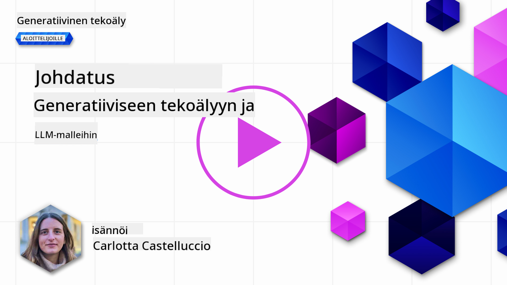
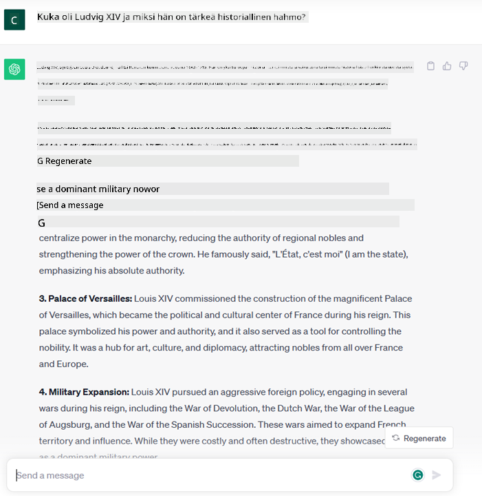
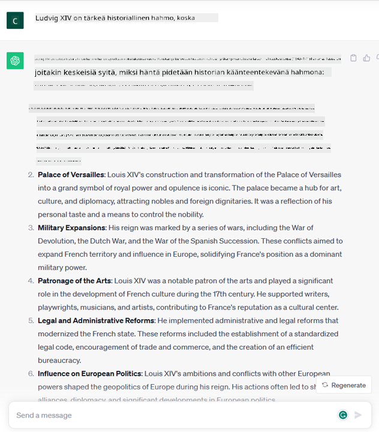
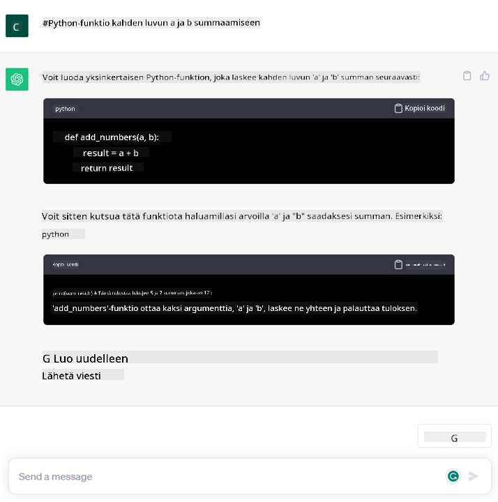

<!--
CO_OP_TRANSLATOR_METADATA:
{
  "original_hash": "bfb7901bdbece1ba3e9f35c400ca33e8",
  "translation_date": "2025-10-17T19:46:26+00:00",
  "source_file": "01-introduction-to-genai/README.md",
  "language_code": "fi"
}
-->
# Johdatus generatiiviseen tekoälyyn ja suuriin kielimalleihin

_(Klikkaa yllä olevaa kuvaa nähdäksesi tämän oppitunnin videon)_

Generatiivinen tekoäly on tekoälyä, joka pystyy tuottamaan tekstiä, kuvia ja muita sisältötyyppejä. Sen tekee hämmästyttäväksi teknologiaksi se, että se demokratisoi tekoälyn käyttöä – kuka tahansa voi käyttää sitä pelkällä tekstikehotteella, luonnollisella kielellä kirjoitetulla lauseella. Sinun ei tarvitse oppia ohjelmointikieliä kuten Javaa tai SQL:ää saavuttaaksesi jotain merkittävää; riittää, että käytät omaa kieltäsi, kerrot mitä haluat, ja tekoälymalli antaa sinulle ehdotuksen. Sovelluskohteet ja vaikutukset ovat valtavat: voit kirjoittaa tai ymmärtää raportteja, luoda sovelluksia ja paljon muuta sekunneissa.

Tässä oppimateriaalissa tutkimme, kuinka startupimme hyödyntää generatiivista tekoälyä avatakseen uusia mahdollisuuksia koulutuksen maailmassa ja kuinka käsittelemme sen soveltamiseen liittyviä sosiaalisia haasteita sekä teknologian rajoituksia.

## Johdanto

Tämä oppitunti kattaa:

- Liiketoimintaskenaarion esittelyn: startup-ideamme ja missiomme.
- Generatiivinen tekoäly ja nykyisen teknologiaympäristön kehitys.
- Suuren kielimallin toimintaperiaatteet.
- Suurten kielimallien pääominaisuudet ja käytännön sovelluskohteet.

## Oppimistavoitteet

Tämän oppitunnin jälkeen ymmärrät:

- Mitä generatiivinen tekoäly on ja kuinka suuret kielimallit toimivat.
- Kuinka voit hyödyntää suuria kielimalleja eri käyttötarkoituksiin, erityisesti koulutukseen liittyvissä skenaarioissa.

## Skenaario: koulutukseen keskittyvä startupimme

Generatiivinen tekoäly edustaa tekoälyteknologian huippua, rikkoen rajoja, joita aiemmin pidettiin mahdottomina. Generatiivisilla tekoälymalleilla on lukuisia ominaisuuksia ja sovelluskohteita, mutta tässä oppimateriaalissa tutkimme, kuinka se mullistaa koulutuksen kuvitteellisen startupin kautta. Kutsumme tätä startupia nimellä _startupimme_. Startupimme toimii koulutusalalla kunnianhimoisella missiolla:

> _parantaa oppimisen saavutettavuutta maailmanlaajuisesti, varmistaa tasapuolinen pääsy koulutukseen ja tarjota jokaiselle oppijalle yksilöllisiä oppimiskokemuksia heidän tarpeidensa mukaan_.

Startupimme tiimi tiedostaa, että emme voi saavuttaa tätä tavoitetta ilman modernin ajan tehokkaimpia työkaluja – suuria kielimalleja (LLM).

Generatiivisen tekoälyn odotetaan mullistavan tapaa, jolla opimme ja opetamme nykyään. Opiskelijoilla on käytettävissään virtuaaliset opettajat 24 tuntia vuorokaudessa, jotka tarjoavat valtavia määriä tietoa ja esimerkkejä, ja opettajat voivat hyödyntää innovatiivisia työkaluja arvioidakseen oppilaitaan ja antaakseen palautetta.

Aloitetaan määrittelemällä joitakin peruskäsitteitä ja terminologiaa, joita käytämme oppimateriaalin aikana.

## Miten generatiivinen tekoäly syntyi?

Vaikka generatiivisten tekoälymallien julkistaminen on viime aikoina aiheuttanut valtavaa _hypetystä_, tämä teknologia on ollut kehitteillä vuosikymmeniä, ja ensimmäiset tutkimukset juontavat juurensa 1960-luvulle. Olemme nyt pisteessä, jossa tekoälyllä on ihmisen kognitiivisia kykyjä, kuten keskustelu, kuten esimerkiksi [OpenAI ChatGPT](https://openai.com/chatgpt) tai [Bing Chat](https://www.microsoft.com/edge/features/bing-chat?WT.mc_id=academic-105485-koreyst), joka käyttää GPT-mallia verkkohakuihin Bing-keskusteluissa.

Palataan hieman taaksepäin: tekoälyn ensimmäiset prototyypit koostuivat kirjoituskoneella toimivista chatbot-ohjelmista, jotka perustuivat asiantuntijoilta kerättyyn tietopohjaan ja tietokoneeseen tallennettuihin tietoihin. Tietopohjan vastaukset aktivoituivat syötetekstissä esiintyvien avainsanojen perusteella. Pian kuitenkin kävi selväksi, että tällainen lähestymistapa ei ollut skaalautuva.

### Tilastollinen lähestymistapa tekoälyyn: koneoppiminen

Merkittävä käännekohta saavutettiin 1990-luvulla, kun tilastollista lähestymistapaa alettiin soveltaa tekstianalyysiin. Tämä johti uusien algoritmien kehittämiseen – tunnetaan nimellä koneoppiminen – jotka pystyivät oppimaan kaavoja datasta ilman, että niitä ohjelmoitiin eksplisiittisesti. Tämä lähestymistapa mahdollisti koneiden simuloida ihmisen kielen ymmärtämistä: tilastollinen malli koulutettiin tekstin ja sen merkityksen yhdistelmillä, jolloin malli pystyi luokittelemaan tuntemattoman syötetekstin ennalta määritellyllä merkityksellä.

### Neuroverkot ja modernit virtuaaliassistentit

Viime vuosina laitteistojen teknologinen kehitys, joka mahdollistaa suurempien datamäärien ja monimutkaisempien laskelmien käsittelyn, on edistänyt tekoälytutkimusta ja johtanut kehittyneiden koneoppimisalgoritmien, kuten neuroverkkojen tai syväoppimisalgoritmien, kehittämiseen.

Neuroverkot (erityisesti toistuvat neuroverkot – RNN:t) paransivat merkittävästi luonnollisen kielen käsittelyä, mahdollistaen tekstin merkityksen esittämisen merkityksellisemmällä tavalla, huomioiden sanan kontekstin lauseessa.

Tämä teknologia mahdollisti virtuaaliassistenttien syntymisen 2000-luvun ensimmäisellä vuosikymmenellä. Nämä assistentit olivat erittäin taitavia tulkitsemaan ihmisen kieltä, tunnistamaan tarpeen ja suorittamaan toimenpiteen sen tyydyttämiseksi – kuten vastaamaan ennalta määritellyllä skriptillä tai käyttämään kolmannen osapuolen palvelua.

### Nykyhetki, generatiivinen tekoäly

Näin olemme päätyneet nykyiseen generatiiviseen tekoälyyn, joka voidaan nähdä syväoppimisen alalajina.

Vuosikymmenten tekoälytutkimuksen jälkeen uusi mallirakenne – nimeltään _Transformer_ – ylitti RNN-mallien rajoitukset, sillä se pystyy käsittelemään paljon pidempiä tekstijonoja syötteenä. Transformerit perustuvat huomiointimekanismiin, joka mahdollistaa mallin antamaan eri painoarvoja vastaanottamilleen syötteille, 'kiinnittäen enemmän huomiota' kohtiin, joissa olennaisin tieto on keskittynyt, riippumatta niiden järjestyksestä tekstijonossa.

Useimmat viimeaikaiset generatiiviset tekoälymallit – tunnetaan myös nimellä suuret kielimallit (LLM:t), koska ne toimivat tekstisyötteiden ja -tulosteiden kanssa – perustuvat juuri tähän arkkitehtuuriin. Näitä malleja on koulutettu valtavilla määrillä monimuotoista, merkitsemätöntä dataa, kuten kirjoja, artikkeleita ja verkkosivustoja, ja ne voidaan mukauttaa monenlaisiin tehtäviin. Ne pystyvät tuottamaan kieliopillisesti oikeaa tekstiä, joka vaikuttaa luovalta. Ne eivät ainoastaan parantaneet koneiden kykyä 'ymmärtää' syötetekstiä, vaan myös mahdollistivat niiden kyvyn tuottaa alkuperäisiä vastauksia ihmiskielellä.

## Kuinka suuret kielimallit toimivat?

Seuraavassa luvussa tutkimme erilaisia generatiivisia tekoälymalleja, mutta tarkastellaan ensin, kuinka suuret kielimallit toimivat, keskittyen erityisesti OpenAI GPT (Generative Pre-trained Transformer) -malleihin.

- **Tokenisaattori, tekstistä numeroiksi**: Suuret kielimallit vastaanottavat tekstin syötteenä ja tuottavat tekstin tulosteena. Koska ne ovat tilastollisia malleja, ne toimivat paljon paremmin numeroiden kuin tekstijonojen kanssa. Siksi jokainen mallille annettu syöte käsitellään tokenisaattorilla ennen kuin se käytetään ydinosassa. Token on tekstin osa – koostuen vaihtelevasta määrästä merkkejä, joten tokenisaattorin päätehtävä on jakaa syöte tokenien taulukoksi. Sitten jokainen token yhdistetään token-indeksiin, joka on alkuperäisen tekstiosan kokonaislukukoodaus.

- **Tulostokenien ennustaminen**: Kun mallille annetaan n tokenia syötteenä (maksimi n vaihtelee mallista riippuen), se pystyy ennustamaan yhden tokenin tulosteena. Tämä token lisätään seuraavan iteraation syötteeseen, muodostaen laajenevan ikkunan, joka mahdollistaa paremman käyttäjäkokemuksen, kun vastauksena saadaan yksi (tai useampi) lause. Tämä selittää, miksi, jos olet koskaan käyttänyt ChatGPT:tä, olet saattanut huomata, että joskus se näyttää pysähtyvän kesken lauseen.

- **Valintaprosessi, todennäköisyysjakauma**: Malli valitsee tulostokenin sen todennäköisyyden perusteella, että se esiintyy nykyisen tekstijonon jälkeen. Tämä johtuu siitä, että malli ennustaa todennäköisyysjakauman kaikille mahdollisille 'seuraaville tokeneille', joka lasketaan sen koulutuksen perusteella. Kuitenkin, tokenia, jolla on korkein todennäköisyys, ei aina valita tuloksena olevasta jakaumasta. Valintaan lisätään tietty määrä satunnaisuutta, jotta malli toimisi ei-deterministisesti – emme saa täsmälleen samaa tulosta samalle syötteelle. Tämä satunnaisuuden aste lisätään simuloimaan luovaa ajattelua, ja sitä voidaan säätää mallin parametreilla, kuten lämpötilalla.

## Kuinka startupimme voi hyödyntää suuria kielimalleja?

Nyt kun ymmärrämme paremmin suuren kielimallin toimintaperiaatteet, tarkastellaan joitakin käytännön esimerkkejä yleisimmistä tehtävistä, joita ne voivat suorittaa hyvin, keskittyen liiketoimintaskenaarioomme.
Kuten mainitsimme, suuren kielimallin pääominaisuus on _tuottaa tekstiä tyhjästä, lähtien tekstisyötteestä, joka on kirjoitettu luonnollisella kielellä_.

Mutta millainen tekstisyöte ja -tuloste?
Suuren kielimallin syötettä kutsutaan kehotteeksi (prompt), kun taas tulostetta kutsutaan täydennykseksi (completion), termi, joka viittaa mallin mekanismiin tuottaa seuraava token nykyisen syötteen täydentämiseksi. Tarkastelemme tarkemmin, mitä kehotteet ovat ja kuinka ne suunnitellaan, jotta mallista saadaan paras mahdollinen hyöty. Mutta toistaiseksi sanottakoon, että kehotteeseen voi sisältyä:

- **Ohje**, joka määrittää, millaista tulostetta mallilta odotetaan. Tämä ohje voi joskus sisältää esimerkkejä tai lisätietoja.

  1. Artikkelin, kirjan, tuotearvostelujen ja muun tiivistäminen sekä oivallusten poimiminen jäsentämättömästä datasta.
    
    
  
  2. Luova ideointi ja artikkelin, esseen, tehtävän tai muun suunnittelu.
      
     

- **Kysymys**, joka esitetään keskustelun muodossa agentille.
  
  

- **Tekstin osa täydennettäväksi**, joka implisiittisesti pyytää kirjoitusapua.
  
  

- **Koodinpätkä**, johon liittyy pyyntö selittää ja dokumentoida se, tai kommentti, joka pyytää luomaan koodinpätkän tietyn tehtävän suorittamiseksi.
  
  

Yllä olevat esimerkit ovat melko yksinkertaisia eivätkä ole tarkoitettu kattavaksi esittelyksi suurten kielimallien kyvyistä. Niiden tarkoituksena on osoittaa generatiivisen tekoälyn käyttömahdollisuuksia, erityisesti mutta ei rajoittuen koulutuskonteksteihin.

Lisäksi generatiivisen tekoälymallin tuotos ei ole täydellinen, ja joskus mallin luovuus voi kääntyä sitä vastaan, jolloin tulos on sanojen yhdistelmä, jonka ihmiskäyttäjä voi tulkita todellisuuden vääristymäksi tai loukkaavaksi. Generatiivinen tekoäly ei ole älykäs – ainakaan laajemmassa älykkyyden määritelmässä, joka sisältää kriittisen ja luovan ajattelun tai tunneälyn; se ei ole deterministinen, eikä se ole luotettava, koska virheelliset viittaukset, sisältö ja väitteet voivat yhdistyä oikeaan tietoon ja esittää ne vakuuttavalla ja itsevarmalla tavalla. Seuraavissa oppitunneissa käsittelemme näitä rajoituksia ja näemme, mitä voimme tehdä niiden lieventämiseksi.

## Tehtävä

Tehtäväsi on lukea lisää [generatiivisesta tekoälystä](https://en.wikipedia.org/wiki/Generative_artificial_intelligence?WT.mc_id=academic-105485-koreyst) ja yrittää tunnistaa alue, jossa lisäisit generatiivista tekoälyä nykyään, mutta jossa sitä ei vielä ole. Miten vaikutus eroaisi "vanhan tavan" tekemisestä, voisitko tehdä jotain, mitä et ennen voinut, vai olisitko nopeampi? Kirjoita 300 sanan yhteenveto siitä, miltä unelmiesi tekoäly-startup näyttäisi, ja sisällytä otsikot kuten "Ongelma", "Kuinka käyttäisin tekoälyä", "Vaikutus" ja halutessasi liiketoimintasuunnitelma.

Jos teet tämän tehtävän, saatat jopa olla valmis hakemaan Microsoftin inkubaattoriin, [Microsoft for Startups Founders Hub](https://www.microsoft.com/startups?WT.mc_id=academic-105485-koreyst), jossa tarjoamme krediittejä Azureen, OpenAI:hin, mentorointiin ja paljon muuta – tutustu siihen!

## Tietotesti

Mikä pitää paikkansa suurista kielimalleista?

1. Saat täsmälleen saman vastauksen joka kerta.
1. Se tekee asiat täydellisesti, on loistava laskemaan numeroita, tuottamaan toimivaa koodia jne.
1. Vastaus voi vaihdella, vaikka käytät samaa kehotetta. Se on myös loistava antamaan sinulle ensimmäisen luonnoksen jostain, olipa kyseessä teksti tai koodi. Mutta sinun täytyy parantaa tuloksia.

V: 3, LLM ei ole deterministinen, vastaus vaihtelee, mutta sen vaihtelua voi hallita lämpötila-asetuksella. Sinun ei myöskään pitäisi odottaa sen tekevän asioita täydellisesti – se on täällä tekemässä raskasta työtä puolestasi, mikä usein tarkoittaa, että saat hyvän ensimmäisen yrityksen, jota sinun täytyy parantaa asteittain.

## Hienoa työtä! Jatka matkaasi

Tämän oppitunnin jälkeen tutustu [Generatiivisen tekoälyn oppimiskokoelmaan](https://aka.ms/genai-collection?WT.mc_id=academic-105485-koreyst) jatkaaksesi generatiivisen tekoälyn tietämyksesi kehittämistä!
Siirry oppituntiin 2, jossa tarkastelemme, kuinka [tutkia ja vertailla erilaisia LLM-tyyppejä](../02-exploring-and-comparing-different-llms/README.md?WT.mc_id=academic-105485-koreyst)!

---

**Vastuuvapauslauseke**:  
Tämä asiakirja on käännetty käyttämällä tekoälypohjaista käännöspalvelua [Co-op Translator](https://github.com/Azure/co-op-translator). Vaikka pyrimme tarkkuuteen, huomioithan, että automaattiset käännökset voivat sisältää virheitä tai epätarkkuuksia. Alkuperäinen asiakirja sen alkuperäisellä kielellä tulisi pitää ensisijaisena lähteenä. Kriittisen tiedon osalta suositellaan ammattimaista ihmiskäännöstä. Emme ole vastuussa väärinkäsityksistä tai virhetulkinnoista, jotka johtuvat tämän käännöksen käytöstä.