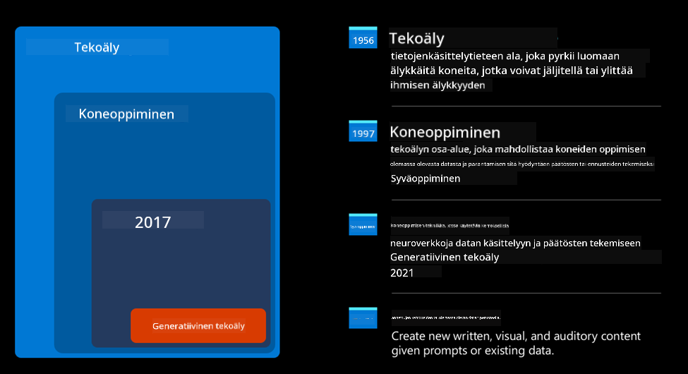
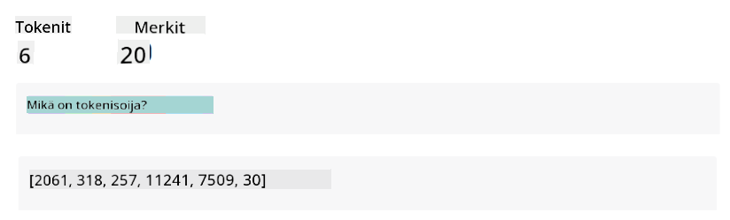
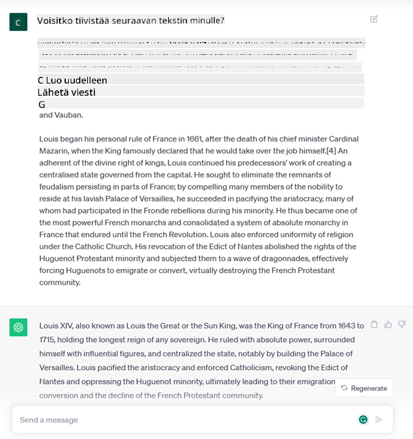
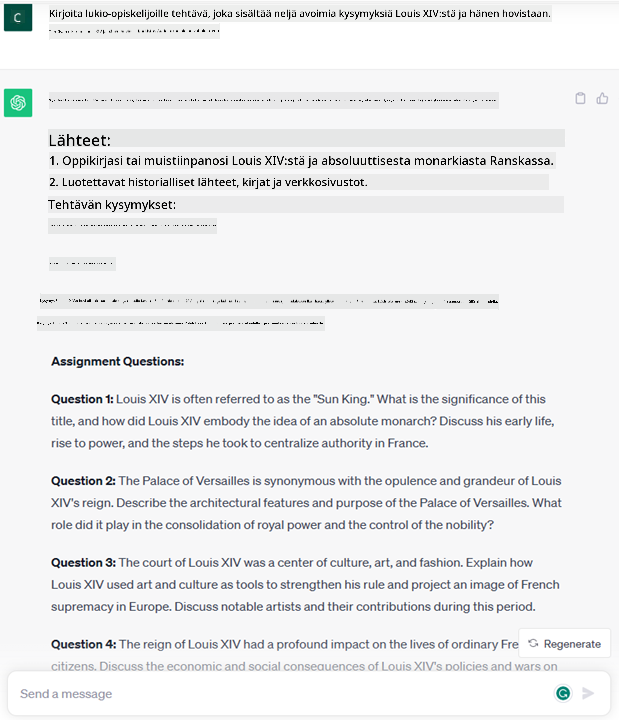

<!--
CO_OP_TRANSLATOR_METADATA:
{
  "original_hash": "f53ba0fa49164f9323043f1c6b11f2b1",
  "translation_date": "2025-07-09T07:55:47+00:00",
  "source_file": "01-introduction-to-genai/README.md",
  "language_code": "fi"
}
-->
# Johdanto generatiiviseen tekoälyyn ja suuriin kielimalleihin

_(Klikkaa yllä olevaa kuvaa nähdäksesi tämän oppitunnin videon)_

Generatiivinen tekoäly on tekoälyä, joka pystyy tuottamaan tekstiä, kuvia ja muita sisältötyyppejä. Sen hienous piilee siinä, että se demokratisoi tekoälyn: kuka tahansa voi käyttää sitä pelkällä tekstikehotteella, luonnollisella kielellä kirjoitetulla lauseella. Sinun ei tarvitse opetella Javaa tai SQL:ää saadaksesi aikaan jotain merkityksellistä, riittää kun käytät omaa kieltäsi, kerrot mitä haluat, ja tekoälymalli ehdottaa vastauksen. Sovellukset ja vaikutukset ovat valtavat: voit kirjoittaa tai ymmärtää raportteja, laatia hakemuksia ja paljon muuta, kaikki sekunneissa.

Tässä opetussuunnitelmassa tutustumme siihen, miten startup-yrityksemme hyödyntää generatiivista tekoälyä avaamaan uusia mahdollisuuksia koulutusalalla ja miten käsittelemme väistämättömiä haasteita, jotka liittyvät sen sosiaalisiin vaikutuksiin ja teknologian rajoituksiin.

## Johdanto

Tässä oppitunnissa käsitellään:

- Liiketoimintaskenaarion esittely: startup-ideamme ja missiomme.
- Generatiivinen tekoäly ja miten päädyimme nykyiseen teknologiseen tilanteeseen.
- Suuren kielimallin toimintaperiaate.
- Suurten kielimallien keskeiset ominaisuudet ja käytännön käyttötapaukset.

## Oppimistavoitteet

Oppitunnin jälkeen ymmärrät:

- Mitä generatiivinen tekoäly on ja miten suuret kielimallit toimivat.
- Miten voit hyödyntää suuria kielimalleja eri käyttötarkoituksissa, erityisesti koulutusskenaarioissa.

## Skenaario: koulutukseen keskittyvä startup-yrityksemme

Generatiivinen tekoäly edustaa tekoälyn huippua, rikkoen rajoja, jotka aiemmin nähtiin mahdottomina. Generatiivisilla tekoälymalleilla on monia kykyjä ja sovelluksia, mutta tässä opetussuunnitelmassa tarkastelemme, miten se mullistaa koulutuksen kuvitteellisen startupin kautta. Tätä startupia kutsumme _startupiksemme_. Startup-yrityksemme toimii koulutusalalla kunnianhimoisella missiolla

> _parantaa oppimisen saavutettavuutta maailmanlaajuisesti, varmistaa tasa-arvoinen pääsy koulutukseen ja tarjota jokaiselle oppijalle heidän tarpeidensa mukaisia henkilökohtaisia oppimiskokemuksia_.

Startup-tiimimme tietää, ettei tätä tavoitetta saavuteta ilman yhden nykyaikaisen tehokkaimman työkalun – suurten kielimallien (LLM) – hyödyntämistä.

Generatiivisen tekoälyn odotetaan mullistavan nykyisen oppimisen ja opetuksen tavat, kun opiskelijoilla on käytössään virtuaaliset opettajat ympäri vuorokauden, jotka tarjoavat valtavasti tietoa ja esimerkkejä, ja opettajat voivat hyödyntää innovatiivisia työkaluja arvioidakseen oppilaitaan ja antaakseen palautetta.

Aloitetaan määrittelemällä joitakin peruskäsitteitä ja termistöä, joita käytämme koko opetussuunnitelman ajan.

## Miten generatiivinen tekoäly syntyi?

Huolimatta viimeaikaisesta valtavasta _hype:stä_, joka on syntynyt generatiivisten tekoälymallien julkistuksen myötä, tämä teknologia on ollut kehityksessä vuosikymmeniä, ja ensimmäiset tutkimusyritykset juontavat juurensa 1960-luvulle. Olemme nyt pisteessä, jossa tekoälyllä on ihmisen kognitiivisia kykyjä, kuten keskustelu, kuten esimerkiksi [OpenAI ChatGPT](https://openai.com/chatgpt) tai [Bing Chat](https://www.microsoft.com/edge/features/bing-chat?WT.mc_id=academic-105485-koreyst) osoittavat, joka käyttää GPT-mallia myös Bingin verkkohakukeskusteluissa.

Palataan hieman taaksepäin: tekoälyn ensimmäiset prototyypit koostuivat kirjoitetuista chatboteista, jotka perustuivat asiantuntijaryhmän tietokantaan, joka oli tallennettu tietokoneelle. Vastaukset tietokannassa aktivoituivat avainsanojen perusteella syötteessä.
Kuitenkin pian kävi ilmi, että tällainen lähestymistapa, kirjoitetut chatbotit, ei skaalautunut hyvin.

### Tilastollinen lähestymistapa tekoälyyn: koneoppiminen

Käännekohta tapahtui 1990-luvulla, kun tekstin analysointiin otettiin käyttöön tilastollinen lähestymistapa. Tämä johti uusien algoritmien kehitykseen – koneoppimiseen – jotka pystyvät oppimaan malleja datasta ilman erillistä ohjelmointia. Tämä lähestymistapa mahdollistaa koneiden simuloida ihmisen kielen ymmärtämistä: tilastollinen malli koulutetaan tekstin ja siihen liitettyjen tunnisteiden parilla, jolloin malli pystyy luokittelemaan tuntemattoman syötteen ennalta määritellyllä tunnisteella, joka kuvaa viestin tarkoitusta.

### Neuroverkot ja nykyaikaiset virtuaaliavustajat

Viime vuosina laitteistojen teknologinen kehitys, joka pystyy käsittelemään suurempia tietomääriä ja monimutkaisempia laskutoimituksia, on edistänyt tekoälytutkimusta ja johtanut edistyneisiin koneoppimisalgoritmeihin, joita kutsutaan neuroverkoiksi tai syväoppimisalgoritmeiksi.

Neuroverkot (erityisesti toistuvat neuroverkot – RNN:t) ovat merkittävästi parantaneet luonnollisen kielen käsittelyä, mahdollistaen tekstin merkityksen esittämisen merkityksellisemmin, arvostaen sanan kontekstia lauseessa.

Tämä teknologia oli pohjana virtuaaliavustajille, jotka syntyivät uuden vuosituhannen ensimmäisellä vuosikymmenellä, ja jotka ovat erittäin taitavia tulkitsemaan ihmiskieltä, tunnistamaan tarpeen ja suorittamaan toiminnon sen tyydyttämiseksi – kuten vastaamaan ennalta määritellyllä skriptillä tai käyttämään kolmannen osapuolen palvelua.

### Nykyhetki, generatiivinen tekoäly

Näin päädyimme nykyiseen generatiiviseen tekoälyyn, jota voidaan pitää syväoppimisen alalajina.

Kymmenien vuosien tekoälytutkimuksen jälkeen uusi malliarkkitehtuuri – nimeltään _Transformer_ – voitti RNN:ien rajoitukset, pystyen käsittelemään paljon pidempiä tekstijaksoja syötteenä. Transformerit perustuvat huomio-mekanismiin, joka antaa mallille mahdollisuuden painottaa eri syötteitä eri tavoin, ‘kiinnittäen enemmän huomiota’ niihin kohtiin, joissa olennaisin tieto on keskittynyt, riippumatta niiden järjestyksestä tekstissä.

Suurin osa viimeaikaisista generatiivisista tekoälymalleista – joita kutsutaan myös suuriksi kielimalleiksi (LLM), koska ne käsittelevät tekstisyötteitä ja -tuotoksia – perustuu tähän arkkitehtuuriin. Näissä malleissa on mielenkiintoista se, että ne on koulutettu valtavalla määrällä merkitsemätöntä dataa eri lähteistä, kuten kirjoista, artikkeleista ja verkkosivustoilta, ja ne voidaan sovittaa monenlaisiin tehtäviin sekä tuottaa kieliopillisesti oikeaa tekstiä, jossa on ripaus luovuutta. Näin ne eivät ainoastaan parantaneet koneen kykyä ‘ymmärtää’ syötettyä tekstiä, vaan myös kykyä luoda alkuperäinen vastaus ihmiskielellä.

## Miten suuret kielimallit toimivat?

Seuraavassa luvussa tutustumme erilaisiin generatiivisen tekoälyn malleihin, mutta nyt katsotaan, miten suuret kielimallit toimivat, keskittyen OpenAI:n GPT (Generative Pre-trained Transformer) -malleihin.

- **Tokenisaattori, teksti numeroiksi**: Suuret kielimallit saavat syötteenä tekstiä ja tuottavat tekstin ulostulona. Koska ne ovat tilastollisia malleja, ne toimivat paljon paremmin numeroiden kuin tekstijaksojen kanssa. Siksi jokainen syöte käsitellään tokenisaattorilla ennen mallin ydinosaa. Tokeni on tekstin osa – joka koostuu vaihtelevasta määrästä merkkejä, joten tokenisaattorin päätehtävä on jakaa syöte tokenien taulukoksi. Jokainen token yhdistetään tokenin indeksiin, joka on alkuperäisen tekstin kokonaislukukoodaus.

- **Ulostulotokenien ennustaminen**: Kun syötteenä on n tokenia (maksimi n vaihtelee mallista toiseen), malli pystyy ennustamaan yhden tokenin ulostuloksi. Tämä token lisätään seuraavan iteraation syötteeseen laajenevan ikkunan mallilla, mahdollistaen paremman käyttökokemuksen, jossa saa yhden (tai useamman) lauseen vastauksen. Tämä selittää, miksi jos olet joskus käyttänyt ChatGPT:tä, olet saattanut huomata, että se joskus vaikuttaa pysähtyvän kesken lauseen.

- **Valintaprosessi, todennäköisyysjakauma**: Ulostulotoken valitaan mallin ennustaman todennäköisyyden perusteella sen esiintymiselle nykyisen tekstijakson jälkeen. Malli ennustaa todennäköisyysjakauman kaikista mahdollisista ‘seuraavista tokeneista’, jotka on laskettu koulutuksen perusteella. Kuitenkaan aina ei valita todennäköisintä tokenia jakaumasta. Valintaan lisätään satunnaisuutta, jolloin malli toimii epädeterministisesti – samaan syötteeseen ei aina saada täsmälleen samaa vastausta. Tätä satunnaisuuden astetta lisätään simuloimaan luovan ajattelun prosessia, ja sitä voidaan säätää mallin parametrilla nimeltä temperature.

## Miten startupimme voi hyödyntää suuria kielimalleja?

Nyt kun ymmärrämme paremmin suuren kielimallin toimintaperiaatteen, katsotaan joitakin käytännön esimerkkejä yleisimmistä tehtävistä, joissa ne suoriutuvat hyvin, ottaen huomioon liiketoimintaskenaarion.
Sanoimme, että suuren kielimallin pääominaisuus on _tekstin tuottaminen alusta alkaen, lähtien luonnollisella kielellä kirjoitetusta tekstisyötteestä_.

Mutta millaista tekstisyötettä ja -tuotosta?
Suuren kielimallin syötettä kutsutaan promptiksi, ja ulostuloa completioniksi, joka viittaa mallin mekanismiin tuottaa seuraava token täydentämään nykyistä syötettä. Sukellamme syvemmälle siihen, mitä prompt on ja miten sitä suunnitellaan, jotta mallista saadaan paras hyöty. Mutta toistaiseksi sanotaan, että prompt voi sisältää:

- **Ohjeen**, joka määrittelee, millaista ulostuloa mallilta odotetaan. Tämä ohje voi sisältää esimerkkejä tai lisätietoja.

  1. Artikkelin, kirjan, tuotearvostelujen ym. tiivistämisen sekä oivallusten poimimisen jäsentämättömästä datasta.
    
    
  
  2. Luovan ideoinnin ja artikkelin, esseen, tehtävän tai muun suunnittelun.
      
     

- **Kysymyksen**, esitettynä keskustelun muodossa agentin kanssa.
  
  

- **Tekstin pätkän täydentämisen**, joka implisiittisesti on kirjoitusapupyyntö.
  
  

- **Koodinpätkän** yhdessä pyynnön kanssa selittää ja dokumentoida sitä, tai kommentin, jossa pyydetään generoimaan tiettyä tehtävää suorittava koodinpätkä.
  
  

Yllä olevat esimerkit ovat melko yksinkertaisia eivätkä kata kaikkia suurten kielimallien kykyjä. Ne on tarkoitettu osoittamaan generatiivisen tekoälyn potentiaalia, erityisesti mutta ei ainoastaan koulutuskonteksteissa.

Lisäksi generatiivisen tekoälyn tuotos ei ole täydellinen, ja joskus mallin luovuus voi kääntyä sitä vastaan, jolloin tuloksena on yhdistelmä sanoja, jonka ihminen voi tulkita todellisuuden mystifioinniksi tai se voi olla loukkaava. Generatiivinen tekoäly ei ole älykäs – ainakaan laajemmassa älykkyyden määritelmässä, joka sisältää kriittisen ja luovan päättelyn tai tunneälyn; se ei ole deterministinen eikä luotettava, koska virheelliset viittaukset, sisällöt ja väitteet voivat sekoittua oikeaan tietoon ja esitetään vakuuttavasti ja itsevarmasti. Seuraavissa oppitunneissa käsittelemme näitä rajoituksia ja katsomme, mitä voimme tehdä niiden lieventämiseksi.

## Tehtävä

Tehtäväsi on lukea lisää [generatiivisesta tekoälystä](https://en.wikipedia.org/wiki/Generative_artificial_intelligence?WT.mc_id=academic-105485-koreyst) ja yrittää tunnistaa alue, johon lisäisit generatiivista tekoälyä tänään, jos sitä ei vielä ole. Miten vaikutus eroaisi “vanhasta tavasta” tehdä asioita, voisitko tehdä jotain, mitä et ennen pystynyt, vai olisitko nopeampi? Kirjoita 300 sanan tiivistelmä siitä, millainen unelmiesi tekoälystartup olisi, ja sisällytä otsikot kuten "Ongelma", "Miten käyttäisin tekoälyä", "Vaikutus" ja halutessasi liiketoimintasuunnitelma.

Jos teet tämän tehtävän, saatat olla valmis hakemaan Microsoftin kiihdyttämöön, [Microsoft for Startups Founders Hub](https://www.microsoft.com/startups?WT.mc_id=academic-105485-koreyst), jossa tarjoamme krediittejä sekä Azureen, OpenAI:hin, mentorointiin ja paljon muuhun – tutustu!

## Tietovisa

Mikä seuraavista pitää paikkansa suurista kielimalleista?

1. Saat aina täsmälleen saman vastauksen.
1. Se tekee asiat täydellisesti, on erinomainen laskemaan, tuottamaan toimivaa koodia jne.
1. Vastaus voi vaihdella, vaikka käyttäisit samaa promptia. Se on myös hyvä antamaan sinulle ensimmäisen luonnoksen jostakin, oli se sitten tekstiä tai koodia. Mutta tuloksia täytyy parantaa.

Vastaus: 3, LLM on epädeterministinen, vastaus vaihtelee, mutta voit hallita vaihtelua lämpötila-asetuksella. Et myöskään voi odottaa sen tekevän asiat täydellisesti, se on täällä tekemässä raskaan työn puolestasi, mikä usein tarkoittaa, että saat hyvän ensimmäisen yrityksen, jota sinun täytyy asteittain parantaa.

## Hienoa työtä! Jatka matkaa

Oppitunnin jälkeen tutustu [Generative AI Learning -kokoelmaamme](https://aka.ms/genai-collection?WT.mc_id=academic-105485-koreyst) jatkaaksesi generatiivisen tekoälyn osaamisesi kehittämistä!
Siirry Oppitunnille 2, jossa tarkastelemme, miten [tutkia ja vertailla eri LLM-tyyppejä](../02-exploring-and-comparing-different-llms/README.md?WT.mc_id=academic-105485-koreyst)!

**Vastuuvapauslauseke**:  
Tämä asiakirja on käännetty käyttämällä tekoälypohjaista käännöspalvelua [Co-op Translator](https://github.com/Azure/co-op-translator). Vaikka pyrimme tarkkuuteen, huomioithan, että automaattikäännöksissä saattaa esiintyä virheitä tai epätarkkuuksia. Alkuperäistä asiakirjaa sen alkuperäiskielellä tulee pitää virallisena lähteenä. Tärkeissä asioissa suositellaan ammattimaista ihmiskäännöstä. Emme ole vastuussa tämän käännöksen käytöstä aiheutuvista väärinymmärryksistä tai tulkinnoista.