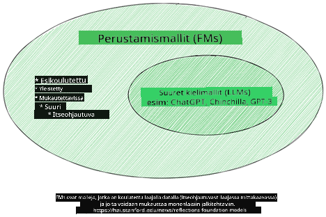
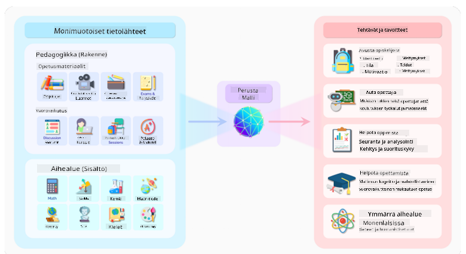
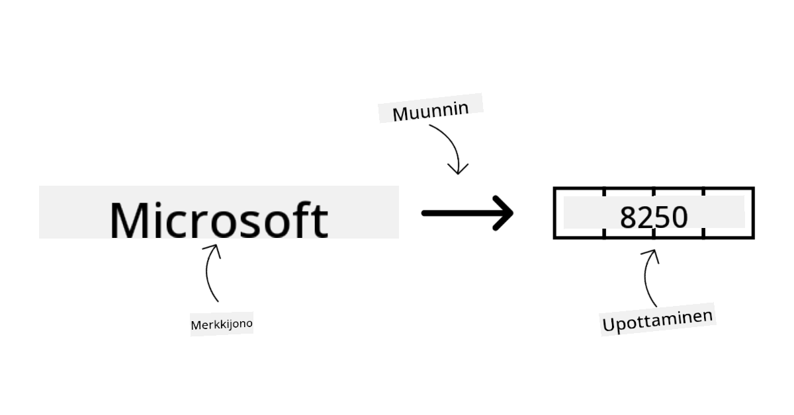
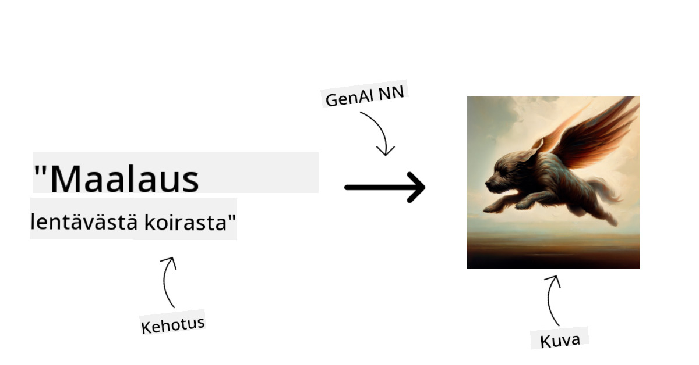
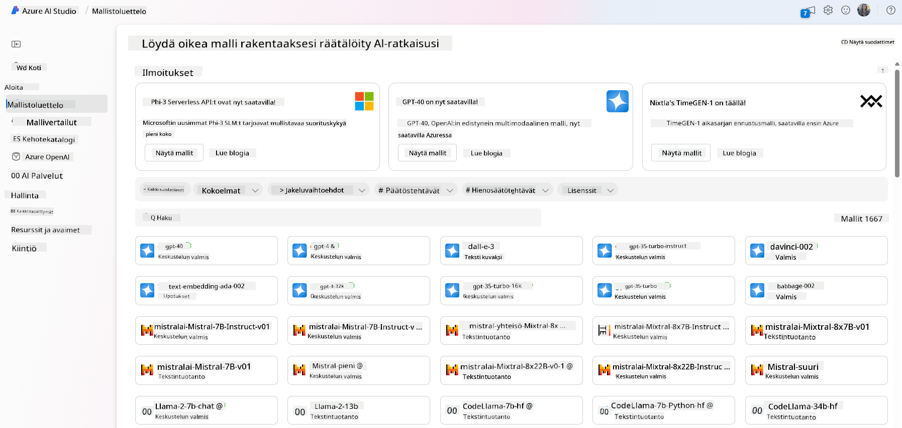
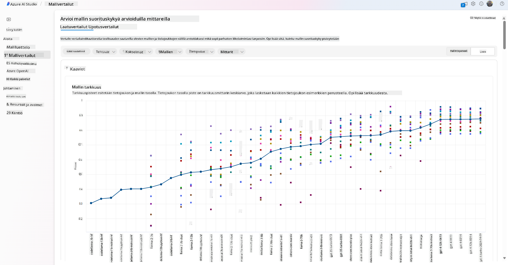
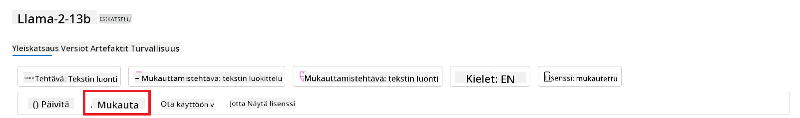
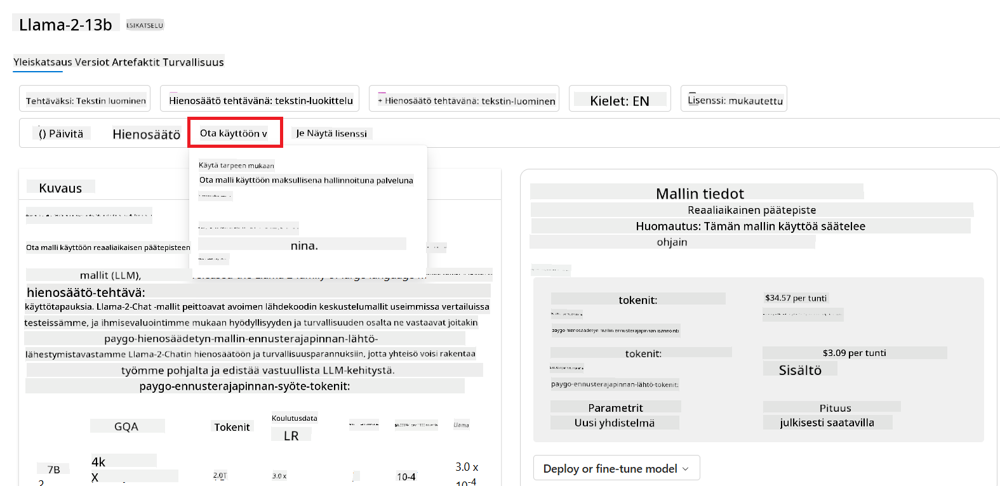
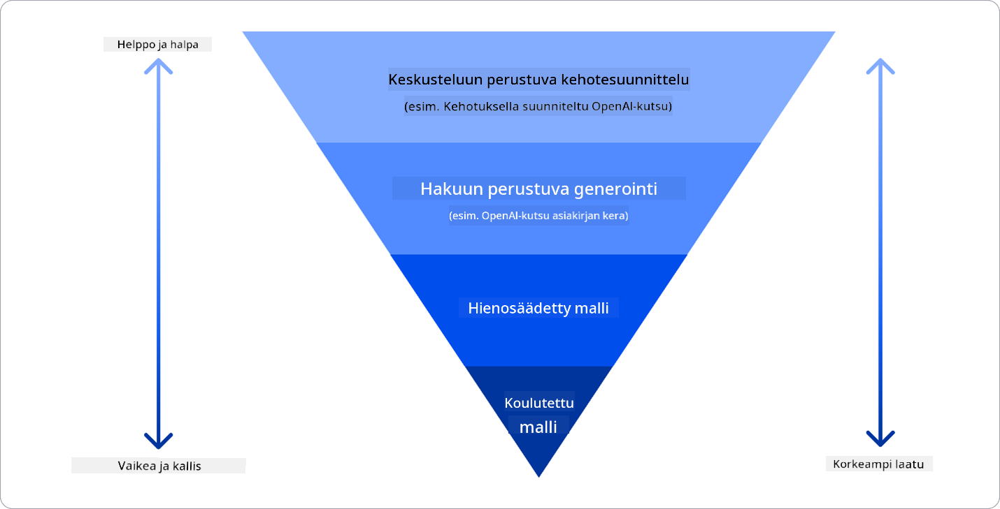

<!--
CO_OP_TRANSLATOR_METADATA:
{
  "original_hash": "e2f686f2eb794941761252ac5e8e090b",
  "translation_date": "2025-05-19T14:08:04+00:00",
  "source_file": "02-exploring-and-comparing-different-llms/README.md",
  "language_code": "fi"
}
-->
# Eri laajojen kielimallien tutkiminen ja vertailu

> _Napsauta yllä olevaa kuvaa nähdäksesi tämän oppitunnin videon_

Edellisessä oppitunnissa näimme, kuinka Generatiivinen AI muuttaa teknologian maisemaa, kuinka laajat kielimallit (LLM:t) toimivat ja kuinka yritys - kuten startupimme - voi soveltaa niitä omiin käyttötapauksiinsa ja kasvaa! Tässä luvussa vertailemme ja vastakkainasettelemme erilaisia laajoja kielimalleja (LLM:t) ymmärtääksemme niiden hyvät ja huonot puolet.

Seuraava askel startupimme matkalla on tutkia nykyistä LLM-maailmaa ja ymmärtää, mitkä ovat sopivia käyttötapaukseemme.

## Johdanto

Tämä oppitunti käsittelee:

- Erilaisia LLM-tyyppejä nykyisessä maisemassa.
- Erilaisten mallien testaamista, iterointia ja vertailua Azure-ympäristössä.
- Kuinka ottaa LLM käyttöön.

## Oppimistavoitteet

Tämän oppitunnin jälkeen osaat:

- Valita oikean mallin käyttötapaukseesi.
- Ymmärtää, kuinka testata, iterointia ja parantaa mallisi suorituskykyä.
- Tietää, kuinka yritykset ottavat malleja käyttöön.

## Ymmärrä erilaiset LLM-tyypit

LLM:t voidaan luokitella eri tavoin niiden arkkitehtuurin, koulutusdatan ja käyttötapauksen perusteella. Näiden erojen ymmärtäminen auttaa startupiamme valitsemaan oikean mallin tilanteeseen ja ymmärtämään, kuinka testata, iterointia ja parantaa suorituskykyä.

LLM-malleja on monenlaisia, ja mallin valinta riippuu siitä, mihin aiot niitä käyttää, datastasi, kuinka paljon olet valmis maksamaan ja muista tekijöistä.

Riippuen siitä, aiotko käyttää malleja tekstin, äänen, videon, kuvan generointiin ja niin edelleen, saatat valita erilaisen mallityypin.

- **Äänen ja puheen tunnistus**. Tätä tarkoitusta varten Whisper-tyyppiset mallit ovat erinomainen valinta, koska ne ovat yleiskäyttöisiä ja tarkoitettu puheen tunnistukseen. Ne on koulutettu monipuolisella äänellä ja pystyvät monikieliseen puheen tunnistukseen. Lue lisää [Whisper-tyyppisistä malleista täällä](https://platform.openai.com/docs/models/whisper?WT.mc_id=academic-105485-koreyst).

- **Kuvagenerointi**. Kuvagenerointiin DALL-E ja Midjourney ovat kaksi hyvin tunnettua vaihtoehtoa. DALL-E on saatavilla Azure OpenAI:ssa. [Lue lisää DALL-E:stä täällä](https://platform.openai.com/docs/models/dall-e?WT.mc_id=academic-105485-koreyst) ja myös tämän kurssin luvussa 9.

- **Tekstigenerointi**. Useimmat mallit on koulutettu tekstigenerointiin, ja sinulla on laaja valikoima vaihtoehtoja GPT-3.5:stä GPT-4:ään. Ne ovat eri hintaisia, ja GPT-4 on kallein. Kannattaa tutustua [Azure OpenAI -leikkikenttään](https://oai.azure.com/portal/playground?WT.mc_id=academic-105485-koreyst) arvioidaksesi, mitkä mallit sopivat parhaiten tarpeisiisi kykyjen ja kustannusten suhteen.

- **Monimodaalisuus**. Jos haluat käsitellä useita datatyyppejä syötteessä ja tulosteessa, saatat haluta tutustua malleihin kuten [gpt-4 turbo with vision tai gpt-4o](https://learn.microsoft.com/azure/ai-services/openai/concepts/models#gpt-4-and-gpt-4-turbo-models?WT.mc_id=academic-105485-koreyst) - OpenAI:n uusimmat julkaisut - jotka pystyvät yhdistämään luonnollisen kielen käsittelyn visuaaliseen ymmärrykseen, mahdollistavat vuorovaikutuksen monimodaalisten käyttöliittymien kautta.

Mallin valinta tarkoittaa, että saat joitain peruskykyjä, jotka eivät kuitenkaan välttämättä riitä. Usein sinulla on yrityskohtaisia tietoja, jotka sinun jollain tavalla täytyy kertoa LLM:lle. On muutamia eri vaihtoehtoja lähestyä tätä, lisää siitä tulevissa osioissa.

### Perusmallit vs. LLM:t

Perusmalli-termi [keksittiin Stanfordin tutkijoiden toimesta](https://arxiv.org/abs/2108.07258?WT.mc_id=academic-105485-koreyst) ja määriteltiin AI-malliksi, joka täyttää joitakin kriteerejä, kuten:

- **Ne on koulutettu käyttämällä ohjaamatonta oppimista tai itseohjautuvaa oppimista**, eli ne on koulutettu merkitsemättömällä monimodaalisella datalla, eikä niiden koulutusprosessi vaadi ihmisen annotointia tai datan merkitsemistä.
- **Ne ovat erittäin suuria malleja**, perustuen erittäin syviin neuroverkkoihin, jotka on koulutettu miljardeilla parametreilla.
- **Ne on yleensä tarkoitettu toimimaan muiden mallien 'perustana'**, eli niitä voidaan käyttää lähtökohtana muiden mallien rakentamiseen, mikä voidaan tehdä hienosäätämällä.

Kuvan lähde: [Essential Guide to Foundation Models and Large Language Models | by Babar M Bhatti | Medium
](https://thebabar.medium.com/essential-guide-to-foundation-models-and-large-language-models-27dab58f7404)

Tämän erottelun selventämiseksi otetaan ChatGPT esimerkkinä. Ensimmäisen version ChatGPT:stä rakentamiseksi käytettiin mallia nimeltä GPT-3.5 perusmallina. Tämä tarkoittaa, että OpenAI käytti joitakin chat-spesifisiä tietoja luodakseen GPT-3.5:n viritetyn version, joka oli erikoistunut toimimaan hyvin keskusteluskenaarioissa, kuten chatbotit.

Kuvan lähde: [2108.07258.pdf (arxiv.org)](https://arxiv.org/pdf/2108.07258.pdf?WT.mc_id=academic-105485-koreyst)

### Avoimen lähdekoodin vs. Oikeudelliset mallit

Toinen tapa luokitella LLM:t on, ovatko ne avoimen lähdekoodin vai oikeudellisia.

Avoimen lähdekoodin mallit ovat malleja, jotka ovat julkisesti saatavilla ja joita kuka tahansa voi käyttää. Ne ovat usein saatavilla yrityksen tai tutkimusyhteisön toimesta, joka on ne luonut. Näitä malleja saa tarkastella, muokata ja räätälöidä erilaisiin LLM-käyttötapauksiin. Ne eivät kuitenkaan ole aina optimoitu tuotantokäyttöön, eivätkä välttämättä ole yhtä suorituskykyisiä kuin oikeudelliset mallit. Lisäksi rahoitus avoimen lähdekoodin malleille voi olla rajallista, eikä niitä välttämättä ylläpidetä pitkällä aikavälillä tai päivitetä uusimmalla tutkimuksella. Suosittuja avoimen lähdekoodin malleja ovat esimerkiksi [Alpaca](https://crfm.stanford.edu/2023/03/13/alpaca.html?WT.mc_id=academic-105485-koreyst), [Bloom](https://huggingface.co/bigscience/bloom) ja [LLaMA](https://llama.meta.com).

Oikeudelliset mallit ovat malleja, jotka ovat yrityksen omistamia, eikä niitä ole saatavilla julkisesti. Nämä mallit ovat usein optimoitu tuotantokäyttöön. Niitä ei kuitenkaan saa tarkastella, muokata tai räätälöidä eri käyttötapauksiin. Lisäksi ne eivät ole aina saatavilla ilmaiseksi, ja niiden käyttö saattaa vaatia tilauksen tai maksun. Käyttäjillä ei myöskään ole kontrollia datasta, jota käytetään mallin kouluttamiseen, mikä tarkoittaa, että heidän tulisi luottaa mallin omistajaan datan yksityisyyden ja vastuullisen AI:n käytön varmistamisessa. Suosittuja oikeudellisia malleja ovat esimerkiksi [OpenAI-mallit](https://platform.openai.com/docs/models/overview?WT.mc_id=academic-105485-koreyst), [Google Bard](https://sapling.ai/llm/bard?WT.mc_id=academic-105485-koreyst) tai [Claude 2](https://www.anthropic.com/index/claude-2?WT.mc_id=academic-105485-koreyst).

### Upottaminen vs. Kuvagenerointi vs. Teksti- ja koodigenerointi

LLM:t voidaan myös luokitella niiden tuottaman tuloksen perusteella.

Upottaminen on joukko malleja, jotka voivat muuntaa tekstin numeeriseen muotoon, jota kutsutaan upottamiseksi, ja joka on syötetyn tekstin numeerinen esitys. Upottaminen helpottaa koneiden ymmärtää sanojen tai lauseiden välisiä suhteita ja niitä voidaan käyttää syötteinä muille malleille, kuten luokittelumalleille tai klusterointimalleille, joilla on parempi suorituskyky numeerisella datalla. Upotusmalleja käytetään usein siirto-oppimisessa, jossa malli rakennetaan korvaavalle tehtävälle, jolle on runsaasti dataa, ja sitten mallin painoja (upotuksia) käytetään uudelleen muille jälkikäteen tehtäville. Esimerkki tästä kategoriasta on [OpenAI-upotukset](https://platform.openai.com/docs/models/embeddings?WT.mc_id=academic-105485-koreyst).

Kuvagenerointimallit ovat malleja, jotka tuottavat kuvia. Näitä malleja käytetään usein kuvan muokkaukseen, kuvan synteesiin ja kuvan kääntämiseen. Kuvagenerointimallit koulutetaan usein suurilla kuvadatasetillä, kuten [LAION-5B](https://laion.ai/blog/laion-5b/?WT.mc_id=academic-105485-koreyst), ja niitä voidaan käyttää uusien kuvien luomiseen tai olemassa olevien kuvien muokkaamiseen sisämaalauksen, superresoluution ja väritystekniikoiden avulla. Esimerkkejä ovat [DALL-E-3](https://openai.com/dall-e-3?WT.mc_id=academic-105485-koreyst) ja [Stable Diffusion -mallit](https://github.com/Stability-AI/StableDiffusion?WT.mc_id=academic-105485-koreyst).

Teksti- ja koodigenerointimallit ovat malleja, jotka tuottavat tekstiä tai koodia. Näitä malleja käytetään usein tekstin tiivistämiseen, kääntämiseen ja kysymyksiin vastaamiseen. Tekstigenerointimallit koulutetaan usein suurilla tekstidatasetillä, kuten [BookCorpus](https://www.cv-foundation.org/openaccess/content_iccv_2015/html/Zhu_Aligning_Books_and_ICCV_2015_paper.html?WT.mc_id=academic-105485-koreyst), ja niitä voidaan käyttää uuden tekstin tuottamiseen tai kysymyksiin vastaamiseen. Koodigenerointimallit, kuten [CodeParrot](https://huggingface.co/codeparrot?WT.mc_id=academic-105485-koreyst), koulutetaan usein suurilla koodidatasetillä, kuten GitHub, ja niitä voidaan käyttää uuden koodin tuottamiseen tai olemassa olevan koodin virheiden korjaamiseen.

### Kooderi-dekooderi vs. Vain dekooderi

Puhutaan eri tyyppisistä LLM-arkkitehtuureista, käytetään analogiaa.

Kuvittele, että esimiehesi antoi sinulle tehtävän laatia visailu opiskelijoille. Sinulla on kaksi kollegaa; yksi vastaa sisällön luomisesta ja toinen niiden tarkistamisesta.

Sisällöntuottaja on kuin vain dekooderimalli, hän voi katsoa aihetta ja nähdä, mitä olet jo kirjoittanut, ja sitten hän voi kirjoittaa kurssin sen perusteella. He ovat erittäin hyviä kirjoittamaan mukaansatempaavaa ja informatiivista sisältöä, mutta eivät kovin hyviä ymmärtämään aihetta ja oppimistavoitteita. Jotkut dekooderimallien esimerkit ovat GPT-perheen mallit, kuten GPT-3.

Tarkistaja on kuin vain kooderimalli, hän katsoo kirjoitettua kurssia ja vastauksia, huomaten niiden välisen suhteen ja ymmärtäen kontekstin, mutta ei ole hyvä sisällön tuottamisessa. Kooderimallin esimerkki olisi BERT.

Kuvittele, että voisimme saada myös jonkun, joka voisi luoda ja tarkistaa visailun, tämä on kooderi-dekooderimalli. Joitakin esimerkkejä olisivat BART ja T5.

### Palvelu vs. Malli

Puhutaan nyt erosta palvelun ja mallin välillä. Palvelu on tuote, jota tarjoaa pilvipalveluntarjoaja, ja se on usein yhdistelmä malleja, dataa ja muita komponentteja. Malli on palvelun ydinosa, ja se on usein perusmalli, kuten LLM.

Palvelut ovat usein optimoitu tuotantokäyttöön ja ovat usein helpompia käyttää kuin mallit, graafisen käyttöliittymän kautta. Palvelut eivät kuitenkaan ole aina saatavilla ilmaiseksi, ja niiden käyttö saattaa vaatia tilauksen tai maksun, vastineeksi palvelun omistajan laitteiden ja resurssien hyödyntämisestä, kulujen optimoinnista ja skaalautuvuuden helpottamisesta. Esimerkki palvelusta on [Azure OpenAI Service](https://learn.microsoft.com/azure/ai-services/openai/overview?WT.mc_id=academic-105485-koreyst), joka tarjoaa maksa-käytön-mukaan -hinnoittelusuunnitelman, eli käyttäjät veloitetaan suhteessa siihen, kuinka paljon he käyttävät palvelua. Lisäksi Azure OpenAI Service tarjoaa yritystason turvallisuutta ja vastuullisen AI-kehyksen mallien kykyjen päälle.

Mallit ovat vain neuroverkko, parametreilla, painoilla ja muilla. Mahdollistaen yrityksille paikallisen käytön, mutta vaatisi laitteiden ostamista, rakenteen rakentamista skaalautuvuuden mahdollistamiseksi ja lisenssin ostamista tai avoimen lähdekoodin mallin käyttöä. Malli kuten LLaMA on saatavilla käytettäväksi, vaatii laskentatehoa mallin käyttämiseen.

## Kuinka testata ja iterointia eri mallien kanssa suorituskyvyn ymmärtämiseksi Azure-ympäristössä

Kun tiimimme on tutkinut nykyistä LLM-maailmaa ja tunnistanut hyviä ehdokkaita skenaarioihinsa, seuraava askel on testata niitä datalla ja työkuormalla. Tämä on iteratiivinen prosessi, joka tehdään kokeiluilla ja mittauksilla.
Useimmat aiemmissa kappaleissa mainitsemamme mallit (OpenAI-mallit, avoimen lähdekoodin mallit kuten Llama2, ja Hugging Face -muuntimet) ovat saatavilla [mallikatalogissa](https://learn.microsoft.com/azure/ai-studio/how-to/model-catalog-overview?WT.mc_id=academic-105485-koreyst) [Azure AI Studiosta](https://ai.azure.com/?WT.mc_id=academic-105485-koreyst).

[Azure AI Studio](https://learn.microsoft.com/azure/ai-studio/what-is-ai-studio?WT.mc_id=academic-105485-koreyst) on pilvialusta, joka on suunniteltu kehittäjille generatiivisten AI-sovellusten rakentamiseen ja koko kehityssyklin hallintaan - kokeilusta arviointiin - yhdistämällä kaikki Azure AI -palvelut yhdeksi keskukseksi kätevällä graafisella käyttöliittymällä. Mallikatalogi Azure AI Studiossa mahdollistaa käyttäjän:

- Löytää kiinnostavan perusmallin katalogista - joko oikeudellinen tai avoimen lähdekoodin, suodattamalla tehtävän, lisenssin tai nimen mukaan. Parantaakseen hakumahdollisuuksia, mallit on järjestetty kokoelmiin, kuten Azure OpenAI -kokoelma, Hugging Face -kokoelma ja muita.

- Tarkistaa mallikortin, joka sisältää yksityiskohtaisen kuvauksen aiotusta käytöstä ja koulutusdatasta, koodinäytteitä ja arviointituloksia sisäisestä arviointikirjastosta.

 -paneelin kautta.

- Hienosäädä mallia mukautetulla koulutusdatalla parantaaksesi mallin suorituskykyä tietyssä työkuormassa hyödyntämällä Azure AI Studion kokeilu- ja seurantakykyjä.

- Ota käyttöön alkuperäinen esikoulutettu malli tai hienosäädetty versio etä reaaliaikaisessa päättelyssä - hallinnoitu laskenta - tai serverittömässä api-päätepisteessä - [maksa käytön mukaan](https://learn.microsoft.com/azure/ai-studio/how-to/model-catalog-overview#model-deployment-managed-compute-and-serverless-api-pay-as-you-go?WT.mc_id=academic-105485-koreyst) - jotta sovellukset voivat käyttää sitä.

> [!NOTE]
> Kaikkia katalogin malleja ei tällä hetkellä ole saatavilla hienosäätöön ja/tai maksa käytön mukaan -käyttöönottoon. Tarkista mallikortti saadaksesi lisätietoja mallin kyvyistä ja rajoituksista.

## LLM-tulosten parantaminen

Olemme tutkineet startup-tiimimme kanssa erilaisia LLM:itä ja pilvialustaa (Azure Machine Learning), joka mahdollistaa erilaisten mallien vertailun, niiden arvioinnin testidatalla, suorituskyvyn parantamisen ja niiden käyttöönoton päättelypisteissä.

Mutta milloin heidän pitäisi harkita mallin hienosäätöä sen sijaan, että käyttäisivät esikoulutettua mallia? Onko muita lähestymistapoja mallin suorituskyvyn parantamiseksi tietyissä työkuormissa?

On useita lähestymistapoja, joita yritys voi käyttää saadakseen tarvitsemansa tulokset LLM:stä. Voit valita erilaisia malleja, joilla on eri koulutustasoja, kun otat LLM:n käyttöön tuotannossa, eri monimutkaisuus-, kustannus- ja laatutasoilla. Tässä on joitakin erilaisia lähestymistapoja:

- **Kehotteen suunnittelu kontekstin kanssa**. Ajatuksena on antaa riittävästi kontekstia kehotettaessa, jotta saat tarvittavat vastaukset.

- **Hakupohjainen generointi, RAG**. Tietosi saattaa olla esimerkiksi tietokannassa tai verkkopäätepisteessä, varmistaaksesi, että tämä data tai sen alijoukko sisältyy kehotuksen aikana, voit hakea asiaankuuluvat tiedot ja tehdä niistä osan käyttäjän kehotetta.

- **Hienosäädetty malli**. Tässä olet kouluttanut mallia edelleen omalla datallasi, mikä tekee mallista tarkemman ja responsiivisemman tarpeisiisi, mutta saattaa olla kallista.

Kuvan lähde: [Four Ways that Enterprises Deploy LLMs | Fiddler AI Blog](https://www.fiddler.ai/blog/four-ways-that-enterprises-deploy-llms?WT.mc_id=academic-105485-koreyst)

### Kehotteen suunnittelu kontekstin kanssa

Esikoulutetut LLM:t toimivat erittäin hyvin yleisissä luonnollisen kielen tehtävissä, jopa lyhyellä kehotteella, kuten lauseen täydentämisellä tai kysymyksellä – niin kutsutulla "zero-shot" oppimisella.

Kuitenkin mitä enemmän käyttäjä voi kehystää kyselynsä yksityiskohtaisella pyynnöllä ja esimerkeillä – Kontekstilla – sitä tarkempi ja lähempänä käyttäjän odotuksia vastaus tulee olemaan. Tässä tapauksessa puhumme "one-shot" oppimisesta, jos kehotteessa on vain yksi esimerkki, ja "few-shot" oppimisesta, jos siinä on useita esimerkkejä.
Kehotteen suunnittelu kontekstin kanssa on kustannustehokkain tapa aloittaa.

### Hakupohjainen generointi (RAG)

LLM:illä on rajoitus, että ne voivat käyttää vain dataa, joka on käytetty niiden koulutuksen aikana vastauksen tuottamiseen. Tämä tarkoittaa, että ne eivät tiedä mitään tosiasioista, jotka ovat tapahtuneet koulutusprosessin jälkeen, eivätkä ne voi käyttää ei-julkista tietoa (kuten yrityksen dataa).
Tätä voidaan kiertää RAG:in avulla, tekniikka, joka laajentaa kehotetta ulkoisella datalla dokumenttien palasina, ottaen huomioon kehotteen pituusrajat. Tätä tukevat Vektoritietokantatyökalut (kuten [Azure Vector Search](https://learn.microsoft.com/azure/search/vector-search-overview?WT.mc_id=academic-105485-koreyst)), jotka hakevat hyödylliset palaset erilaisista ennalta määritellyistä datalähteistä ja lisäävät ne kehotteen kontekstiin.

Tämä tekniikka on erittäin hyödyllinen, kun yrityksellä ei ole tarpeeksi dataa, aikaa tai resursseja hienosäätää LLM:ää, mutta haluaa silti parantaa suorituskykyä tietyssä työkuormassa ja vähentää mystifikaation riskejä, eli todellisuuden vääristymistä tai haitallista sisältöä.

### Hienosäädetty malli

Hienosäätö on prosessi, joka hyödyntää siirto-oppimista "mukauttamaan" mallin alavirran tehtävään tai ratkaisemaan tietty ongelma. Eroaa few-shot oppimisesta ja RAG:ista siinä, että se tuottaa uuden mallin, jossa on päivitetyt painot ja vinoumat. Se vaatii joukon koulutusesimerkkejä, jotka koostuvat yhdestä syötteestä (kehotteesta) ja siihen liittyvästä ulostulosta (täydentämisestä).
Tämä olisi suositeltu lähestymistapa, jos:

- **Käyttää hienosäädettyjä malleja**. Yritys haluaa käyttää hienosäädettyjä vähemmän kykeneviä malleja (kuten upotusmalleja) sen sijaan, että käyttäisi suorituskykyisiä malleja, mikä johtaa kustannustehokkaampaan ja nopeampaan ratkaisuun.

- **Huomioi viive**. Viive on tärkeä tietyssä käyttötapauksessa, joten ei ole mahdollista käyttää erittäin pitkiä kehotteita tai esimerkkien määrää, jotka mallin pitäisi oppia, ei sovi kehotteen pituusrajaan.

- **Pysyä ajan tasalla**. Yrityksellä on paljon korkealaatuista dataa ja totuudenmukaisia merkintöjä sekä resurssit ylläpitää tätä dataa ajan tasalla.

### Koulutettu malli

LLM:n kouluttaminen alusta alkaen on epäilemättä vaikein ja monimutkaisin lähestymistapa, joka vaatii valtavia määriä dataa, taitavia resursseja ja sopivaa laskentatehoa. Tätä vaihtoehtoa tulisi harkita vain skenaariossa, jossa yrityksellä on alakohtainen käyttötapaus ja suuri määrä alakeskeistä dataa.

## Tietotesti

Mikä voisi olla hyvä lähestymistapa LLM:n täydentämistulosten parantamiseen?

1. Kehotteen suunnittelu kontekstin kanssa
1. RAG
1. Hienosäädetty malli

A:3, jos sinulla on aikaa ja resursseja sekä korkealaatuista dataa, hienosäätö on parempi vaihtoehto pysyä ajan tasalla. Kuitenkin, jos tarkastelet asioiden parantamista ja sinulla ei ole aikaa, kannattaa harkita ensin RAG:ia.

## 🚀 Haaste

Lue lisää siitä, kuinka voit [käyttää RAG:ia](https://learn.microsoft.com/azure/search/retrieval-augmented-generation-overview?WT.mc_id=academic-105485-koreyst) yrityksellesi.

## Hienoa työtä, jatka oppimistasi

Kun olet suorittanut tämän oppitunnin, tutustu [Generative AI Learning -kokoelmaan](https://aka.ms/genai-collection?WT.mc_id=academic-105485-koreyst) jatkaaksesi Generative AI -tietämyksesi kehittämistä!

Siirry oppituntiin 3, jossa tarkastelemme, kuinka [rakentaa Generative AI:ta vastuullisesti](../03-using-generative-ai-responsibly/README.md?WT.mc_id=academic-105485-koreyst)!

**Vastuuvapauslauseke**:  
Tämä asiakirja on käännetty käyttämällä tekoälyyn perustuvaa käännöspalvelua [Co-op Translator](https://github.com/Azure/co-op-translator). Vaikka pyrimme tarkkuuteen, on hyvä huomioida, että automaattiset käännökset voivat sisältää virheitä tai epätarkkuuksia. Alkuperäistä asiakirjaa sen alkuperäisellä kielellä tulisi pitää ensisijaisena lähteenä. Kriittisen tiedon kohdalla suositellaan ammattimaista ihmiskääntäjää. Emme ole vastuussa väärinkäsityksistä tai virhetulkinnoista, jotka johtuvat tämän käännöksen käytöstä.