<!--
CO_OP_TRANSLATOR_METADATA:
{
  "original_hash": "e2f686f2eb794941761252ac5e8e090b",
  "translation_date": "2025-07-09T08:30:42+00:00",
  "source_file": "02-exploring-and-comparing-different-llms/README.md",
  "language_code": "fi"
}
-->
# Eri LLM-mallien tutkiminen ja vertailu

[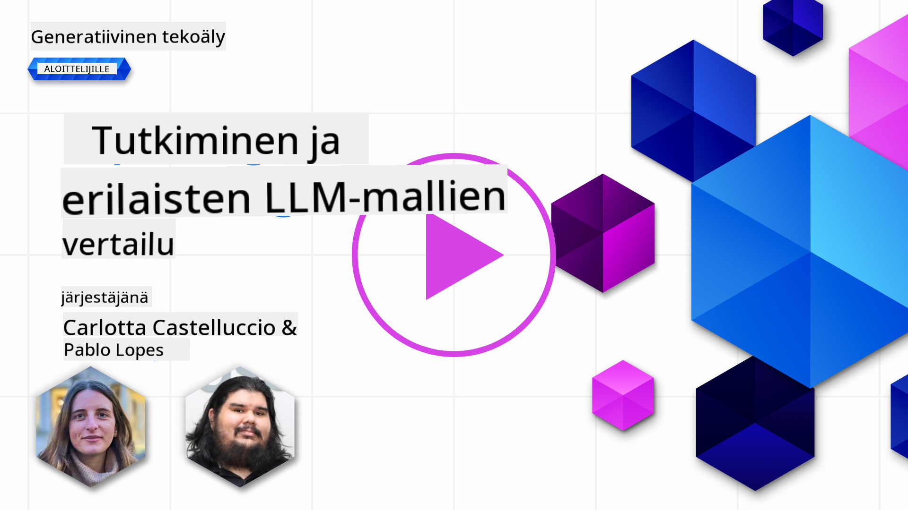](https://aka.ms/gen-ai-lesson2-gh?WT.mc_id=academic-105485-koreyst)

> _Klikkaa yllä olevaa kuvaa nähdäksesi tämän oppitunnin videon_

Edellisessä oppitunnissa näimme, miten Generatiivinen tekoäly muuttaa teknologia-alaa, miten Suuret Kielenmallit (LLM) toimivat ja miten yritys – kuten meidän startupimme – voi hyödyntää niitä omissa käyttötapauksissaan ja kasvaa! Tässä luvussa vertailemme eri tyyppisiä suuria kielenmalleja (LLM) ymmärtääksemme niiden vahvuudet ja heikkoudet.

Seuraava askel startupimme matkalla on tutkia nykyistä LLM-maisemaa ja ymmärtää, mitkä mallit sopivat parhaiten meidän käyttötapaukseemme.

## Johdanto

Tässä oppitunnissa käsitellään:

- Eri LLM-tyyppejä nykyisessä maisemassa.
- Mallien testaamista, iterointia ja vertailua käyttötapauksessasi Azuren ympäristössä.
- Miten LLM otetaan käyttöön.

## Oppimistavoitteet

Oppitunnin suorittamisen jälkeen osaat:

- Valita oikean mallin käyttötapaukseesi.
- Ymmärtää, miten mallia testataan, kehitetään ja suorituskykyä parannetaan.
- Tietää, miten yritykset ottavat malleja käyttöön.

## Ymmärrä eri LLM-tyypit

LLM-malleja voidaan luokitella monella tavalla arkkitehtuurin, koulutusdatan ja käyttötarkoituksen perusteella. Näiden erojen ymmärtäminen auttaa startupiamme valitsemaan oikean mallin tilanteeseen sekä ymmärtämään, miten mallia testataan, kehitetään ja suorituskykyä parannetaan.

LLM-malleja on monenlaisia, ja mallin valinta riippuu siitä, mihin aiot niitä käyttää, datastasi, budjetistasi ja muista tekijöistä.

Riippuen siitä, aiotko käyttää malleja tekstin, äänen, videon, kuvan generointiin tai muuhun, saatat valita eri mallityypin.

- **Ääni- ja puheentunnistus**. Tähän tarkoitukseen Whisper-tyyppiset mallit ovat erinomainen valinta, sillä ne ovat yleiskäyttöisiä ja suunniteltu puheentunnistukseen. Ne on koulutettu monipuolisella äänidatalla ja pystyvät monikieliseen puheentunnistukseen. Lue lisää [Whisper-tyyppisistä malleista täältä](https://platform.openai.com/docs/models/whisper?WT.mc_id=academic-105485-koreyst).

- **Kuvagenerointi**. Kuvagenerointiin DALL-E ja Midjourney ovat kaksi hyvin tunnettua vaihtoehtoa. DALL-E on saatavilla Azure OpenAI:n kautta. [Lue lisää DALL-E:stä täältä](https://platform.openai.com/docs/models/dall-e?WT.mc_id=academic-105485-koreyst) sekä tämän oppimateriaalin luvusta 9.

- **Tekstintuotanto**. Useimmat mallit on koulutettu tekstintuotantoon, ja valinnanvaraa on laajasti GPT-3.5:stä GPT-4:ään. Mallit eroavat hinnoiltaan, GPT-4 on kallein. Kannattaa tutustua [Azure OpenAI playgroundiin](https://oai.azure.com/portal/playground?WT.mc_id=academic-105485-koreyst) arvioidaksesi, mitkä mallit sopivat parhaiten tarpeisiisi ominaisuuksien ja kustannusten osalta.

- **Monimodaalisuus**. Jos haluat käsitellä useita datatyyppejä syötteissä ja tulosteissa, kannattaa tutustua malleihin kuten [gpt-4 turbo with vision tai gpt-4o](https://learn.microsoft.com/azure/ai-services/openai/concepts/models#gpt-4-and-gpt-4-turbo-models?WT.mc_id=academic-105485-koreyst) – OpenAI:n uusimpiin malleihin – jotka yhdistävät luonnollisen kielen käsittelyn visuaaliseen ymmärrykseen mahdollistaen vuorovaikutuksen monimodaalisilla käyttöliittymillä.

Mallin valinta tarkoittaa, että saat perusominaisuudet, jotka eivät välttämättä riitä. Usein yrityksellä on omaa dataa, josta LLM:lle täytyy jotenkin kertoa. Tähän on muutamia eri lähestymistapoja, joista lisää seuraavissa osioissa.

### Foundation-mallit vs. LLM:t

Termi Foundation Model (perusmalli) [määriteltiin Stanfordin tutkijoiden toimesta](https://arxiv.org/abs/2108.07258?WT.mc_id=academic-105485-koreyst) ja tarkoittaa tekoälymallia, joka täyttää tietyt kriteerit, kuten:

- **Ne on koulutettu valvomattomalla tai itsevalvotulla oppimisella**, eli ne on koulutettu merkitsemättömällä monimodaalisella datalla, eikä niiden koulutukseen tarvita ihmisen tekemää annotointia tai merkintöjä.
- **Ne ovat erittäin suuria malleja**, perustuen syviin neuroverkkoihin, jotka on koulutettu miljardeilla parametreilla.
- **Ne on yleensä tarkoitettu toimimaan ‘perustana’ muille malleille**, eli niitä voidaan käyttää lähtökohtana muiden mallien rakentamiselle hienosäätämällä.

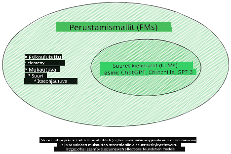

Kuvan lähde: [Essential Guide to Foundation Models and Large Language Models | by Babar M Bhatti | Medium](https://thebabar.medium.com/essential-guide-to-foundation-models-and-large-language-models-27dab58f7404)

Selkeyttääksemme tätä eroa, otetaan esimerkkinä ChatGPT. Ensimmäisen ChatGPT-version rakentamisessa GPT-3.5 toimi perustana. Tämä tarkoittaa, että OpenAI käytti chat-spesifistä dataa luodakseen hienosäädetyn version GPT-3.5:stä, joka on erikoistunut toimimaan hyvin keskustelutilanteissa, kuten chatbotteina.

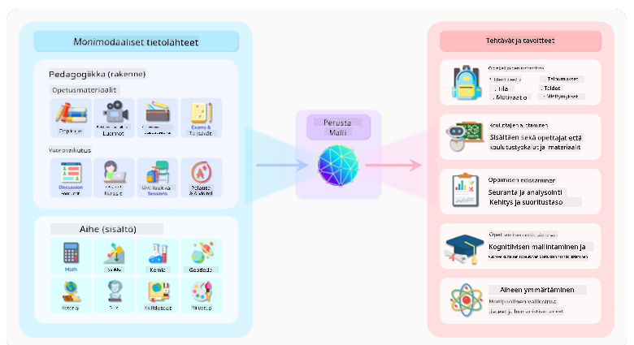

Kuvan lähde: [2108.07258.pdf (arxiv.org)](https://arxiv.org/pdf/2108.07258.pdf?WT.mc_id=academic-105485-koreyst)

### Avoimen lähdekoodin vs. omistettavat mallit

Toinen tapa luokitella LLM-malleja on se, ovatko ne avoimen lähdekoodin vai omistettuja.

Avoimen lähdekoodin mallit ovat julkisesti saatavilla ja niitä voi käyttää kuka tahansa. Ne julkaistaan usein niitä kehittäneen yrityksen tai tutkimusyhteisön toimesta. Näitä malleja saa tarkastella, muokata ja räätälöidä erilaisiin käyttötarkoituksiin. Ne eivät kuitenkaan aina ole optimoituja tuotantokäyttöön, eivätkä välttämättä ole yhtä suorituskykyisiä kuin omistettavat mallit. Lisäksi avoimen lähdekoodin malleilla voi olla rajoitettu rahoitus, ne eivät välttämättä ylläpidä pitkällä aikavälillä tai päivity uusimpaan tutkimukseen. Tunnettuja avoimen lähdekoodin malleja ovat esimerkiksi [Alpaca](https://crfm.stanford.edu/2023/03/13/alpaca.html?WT.mc_id=academic-105485-koreyst), [Bloom](https://huggingface.co/bigscience/bloom) ja [LLaMA](https://llama.meta.com).

Omistettavat mallit ovat yrityksen omistamia, eivätkä ne ole julkisesti saatavilla. Ne on usein optimoitu tuotantokäyttöön. Niitä ei saa tarkastella, muokata tai räätälöidä eri käyttötarkoituksiin. Lisäksi ne eivät aina ole ilmaisia, vaan niiden käyttö voi vaatia tilauksen tai maksun. Käyttäjät eivät myöskään hallitse mallin koulutuksessa käytettyä dataa, joten mallin omistajaan on luotettava tietosuojan ja vastuullisen tekoälyn käytön varmistamisessa. Tunnettuja omistettavia malleja ovat esimerkiksi [OpenAI:n mallit](https://platform.openai.com/docs/models/overview?WT.mc_id=academic-105485-koreyst), [Google Bard](https://sapling.ai/llm/bard?WT.mc_id=academic-105485-koreyst) ja [Claude 2](https://www.anthropic.com/index/claude-2?WT.mc_id=academic-105485-koreyst).

### Embedding vs. kuvagenerointi vs. teksti- ja koodigenerointi

LLM-mallit voidaan myös luokitella niiden tuottaman tulosteen perusteella.

Embedding-mallit muuntavat tekstin numeeriseen muotoon, jota kutsutaan embeddingiksi. Embedding on numeerinen esitys syötteestä. Embeddingit helpottavat koneiden ymmärtämään sanojen tai lauseiden välisiä suhteita, ja niitä voidaan käyttää muiden mallien syötteinä, kuten luokittelu- tai klusterointimalleissa, jotka toimivat paremmin numeerisen datan kanssa. Embedding-malleja käytetään usein siirto-oppimiseen, jossa malli rakennetaan korvaavaan tehtävään, johon on runsaasti dataa, ja mallin painoja (embeddingejä) hyödynnetään muissa tehtävissä. Esimerkki tästä kategoriasta on [OpenAI embeddings](https://platform.openai.com/docs/models/embeddings?WT.mc_id=academic-105485-koreyst).

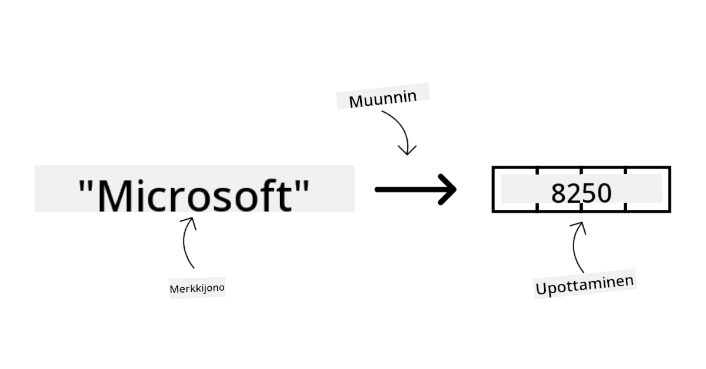

Kuvagenerointimallit tuottavat kuvia. Näitä malleja käytetään usein kuvan muokkaukseen, synteesiin ja käännökseen. Ne on koulutettu suurilla kuvadatoilla, kuten [LAION-5B](https://laion.ai/blog/laion-5b/?WT.mc_id=academic-105485-koreyst), ja niitä voidaan käyttää uusien kuvien luomiseen tai olemassa olevien kuvien muokkaamiseen esimerkiksi inpainting-, superresoluutio- ja väritysmenetelmillä. Esimerkkejä ovat [DALL-E-3](https://openai.com/dall-e-3?WT.mc_id=academic-105485-koreyst) ja [Stable Diffusion -mallit](https://github.com/Stability-AI/StableDiffusion?WT.mc_id=academic-105485-koreyst).

Teksti- ja koodigenerointimallit tuottavat tekstiä tai koodia. Näitä malleja käytetään usein tekstin tiivistämiseen, kääntämiseen ja kysymyksiin vastaamiseen. Tekstintuotantomallit on koulutettu suurilla tekstidatoilla, kuten [BookCorpus](https://www.cv-foundation.org/openaccess/content_iccv_2015/html/Zhu_Aligning_Books_and_ICCV_2015_paper.html?WT.mc_id=academic-105485-koreyst), ja niitä voidaan käyttää uuden tekstin luomiseen tai kysymyksiin vastaamiseen. Koodigenerointimallit, kuten [CodeParrot](https://huggingface.co/codeparrot?WT.mc_id=academic-105485-koreyst), on koulutettu suurilla koodidatoilla, kuten GitHubista, ja niitä voidaan käyttää uuden koodin luomiseen tai olemassa olevan koodin virheiden korjaamiseen.

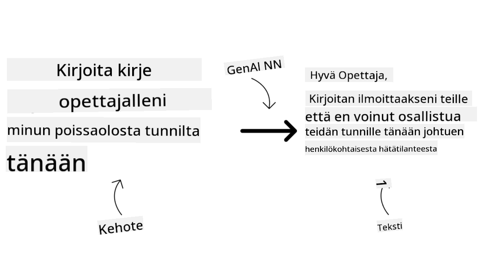

### Encoder-Decoder vs. pelkkä Decoder

Puhuttaessa eri LLM-arkkitehtuureista, käytetään vertauskuvaa.

Kuvittele, että esimiehesi antoi sinulle tehtäväksi laatia tietovisan opiskelijoille. Sinulla on kaksi kollegaa; toinen vastaa sisällön luomisesta ja toinen sen tarkistamisesta.

Sisällöntuottaja on kuin pelkkä Decoder-malli, hän katsoo aihetta ja mitä olet jo kirjoittanut, ja voi kirjoittaa kurssin sen pohjalta. He ovat hyviä kirjoittamaan kiinnostavaa ja informatiivista sisältöä, mutta eivät kovin hyviä ymmärtämään aihetta ja oppimistavoitteita. Esimerkkejä Decoder-malleista ovat GPT-perheen mallit, kuten GPT-3.

Tarkastaja on kuin pelkkä Encoder-malli, hän katsoo kirjoitetun kurssin ja vastaukset, huomaa niiden väliset suhteet ja ymmärtää kontekstin, mutta ei ole hyvä sisällön tuottamisessa. Esimerkki Encoder-mallista on BERT.

Kuvittele, että meillä olisi joku, joka voisi sekä luoda että tarkistaa visan, tämä on Encoder-Decoder-malli. Esimerkkejä ovat BART ja T5.

### Palvelu vs. malli

Keskustellaan nyt palvelun ja mallin erosta. Palvelu on pilvipalveluntarjoajan tarjoama tuote, joka on usein yhdistelmä malleja, dataa ja muita komponentteja. Malli on palvelun ydinosa, usein foundation-malli, kuten LLM.

Palvelut on usein optimoitu tuotantokäyttöön ja ne ovat usein helpompia käyttää kuin mallit, esimerkiksi graafisen käyttöliittymän kautta. Palvelut eivät kuitenkaan aina ole ilmaisia, ja niiden käyttö voi vaatia tilauksen tai maksun, jolloin käyttäjä hyödyntää palveluntarjoajan laitteistoa ja resursseja, optimoi kustannuksia ja skaalaa helposti. Esimerkki palvelusta on [Azure OpenAI Service](https://learn.microsoft.com/azure/ai-services/openai/overview?WT.mc_id=academic-105485-koreyst), joka tarjoaa käytön mukaan maksettavan hinnoittelumallin, eli käyttäjiltä veloitetaan käytön mukaan. Lisäksi Azure OpenAI Service tarjoaa yritystason tietoturvan ja vastuullisen tekoälyn kehykset mallien ominaisuuksien lisäksi.

Mallissa on pelkkä neuroverkko, parametrit, painot ja muut. Yritykset voivat ajaa mallia paikallisesti, mutta tällöin täytyy hankkia laitteisto, rakentaa skaalautuva infrastruktuuri ja ostaa lisenssi tai käyttää avoimen lähdekoodin mallia. Esimerkiksi LLaMA on saatavilla käytettäväksi, mutta sen ajamiseen tarvitaan laskentatehoa.

## Miten testata ja iteratiivisesti kehittää eri malleja suorituskyvyn ymmärtämiseksi Azurella

Kun tiimimme on tutkinut nykyisen LLM-maiseman ja löytänyt hyviä ehdokkaita omiin käyttötapauksiinsa, seuraava askel on testata niitä omalla datalla ja työkuormalla. Tämä on iteratiivinen prosessi, joka tehdään kokeilujen ja mittausten avulla.
Suurin osa aiemmissa kappaleissa mainituista malleista (OpenAI-mallit, avoimen lähdekoodin mallit kuten Llama2 ja Hugging Face -transformerit) on saatavilla [Model Catalogissa](https://learn.microsoft.com/azure/ai-studio/how-to/model-catalog-overview?WT.mc_id=academic-105485-koreyst) [Azure AI Studiossa](https://ai.azure.com/?WT.mc_id=academic-105485-koreyst).

[Azure AI Studio](https://learn.microsoft.com/azure/ai-studio/what-is-ai-studio?WT.mc_id=academic-105485-koreyst) on pilvialusta, joka on suunniteltu kehittäjille generatiivisten tekoälysovellusten rakentamiseen ja koko kehityssyklin hallintaan – kokeilusta arviointiin – yhdistämällä kaikki Azure AI -palvelut yhdeksi keskukseksi kätevällä käyttöliittymällä. Azure AI Studion Model Catalog mahdollistaa käyttäjälle:

- Löytää kiinnostavan Foundation Modelin katalogista – joko omistusoikeudellisen tai avoimen lähdekoodin, suodattaen tehtävän, lisenssin tai nimen mukaan. Hakemisen parantamiseksi mallit on järjestetty kokoelmiin, kuten Azure OpenAI -kokoelma, Hugging Face -kokoelma ja muita.

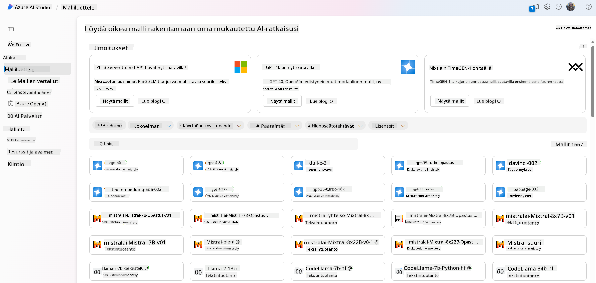

- Tarkastella mallikorttia, joka sisältää yksityiskohtaisen kuvauksen suunnitellusta käytöstä ja koulutusdatasta, koodiesimerkkejä sekä arviointituloksia sisäisestä arviointikirjastosta.

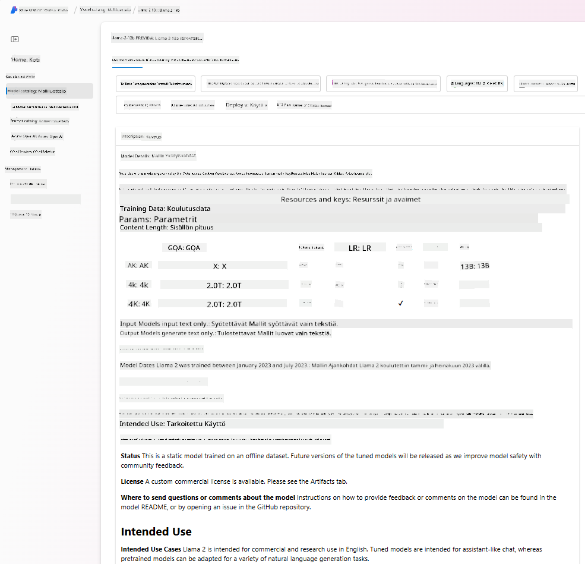

- Verrata suorituskykymittareita eri malleista ja teollisuudessa käytettävissä olevista dataseteistä arvioidakseen, mikä sopii parhaiten liiketoimintatilanteeseen, [Model Benchmarks](https://learn.microsoft.com/azure/ai-studio/how-to/model-benchmarks?WT.mc_id=academic-105485-koreyst) -välilehden kautta.

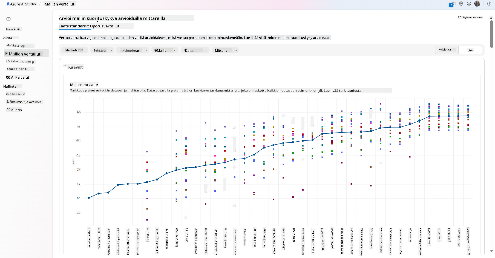

- Hienosäätää mallia omalla koulutusdatalla parantaakseen mallin suorituskykyä tietyssä työkuormassa hyödyntäen Azure AI Studion kokeilu- ja seurantamahdollisuuksia.

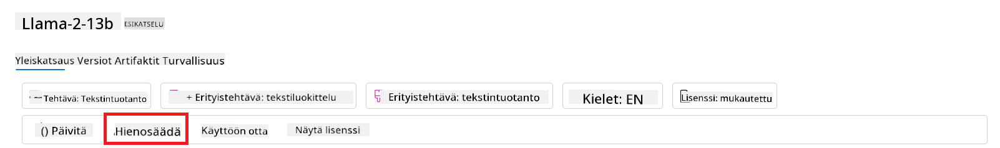

- Ota käyttöön alkuperäinen esikoulutettu malli tai hienosäädetty versio etäkäyttöön reaaliaikaiseen päättelyyn – hallinnoituun laskentaan – tai palvelimettomaan API-päätteeseen – [pay-as-you-go](https://learn.microsoft.com/azure/ai-studio/how-to/model-catalog-overview#model-deployment-managed-compute-and-serverless-api-pay-as-you-go?WT.mc_id=academic-105485-koreyst) – jotta sovellukset voivat käyttää sitä.

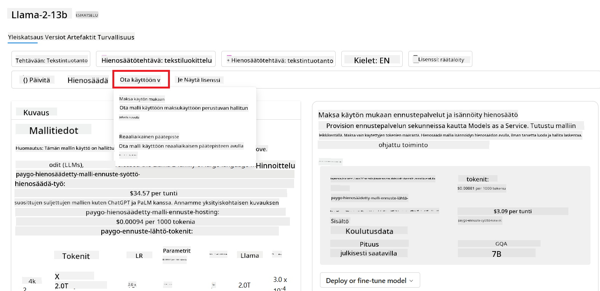

> [!NOTE]
> Kaikki katalogin mallit eivät ole tällä hetkellä saatavilla hienosäätöön ja/tai pay-as-you-go -käyttöönottoon. Tarkista mallikortista tiedot mallin ominaisuuksista ja rajoituksista.

## LLM-tulosten parantaminen

Olemme startup-tiimimme kanssa kokeilleet erilaisia LLM-malleja ja pilvialustaa (Azure Machine Learning), joka mahdollistaa eri mallien vertailun, arvioinnin testidatalla, suorituskyvyn parantamisen ja käyttöönoton päättelypisteissä.

Mutta milloin kannattaa harkita mallin hienosäätöä sen sijaan, että käyttäisi valmiiksi koulutettua mallia? Onko olemassa muita tapoja parantaa mallin suorituskykyä tietyissä työkuormissa?

Liiketoiminnalla on useita tapoja saada halutut tulokset LLM:stä. Voit valita eri tyyppisiä malleja eri koulutustasoilla, kun otat LLM:n käyttöön tuotannossa, eri monimutkaisuus-, kustannus- ja laatutasojen mukaan. Tässä muutamia eri lähestymistapoja:

- **Promptin suunnittelu kontekstin kanssa**. Ajatuksena on antaa riittävästi kontekstia promptissa, jotta saat tarvitsemasi vastaukset.

- **Retrieval Augmented Generation, RAG**. Data voi sijaita esimerkiksi tietokannassa tai web-päätepisteessä, ja varmistaaksesi, että tämä data tai sen osa sisältyy promptin aikaan, voit hakea relevantin datan ja liittää sen osaksi käyttäjän promptia.

- **Hienosäädetty malli**. Tässä mallia on koulutettu lisää omalla datallasi, mikä tekee mallista tarkemman ja paremmin tarpeisiisi vastaavan, mutta se voi olla kallista.

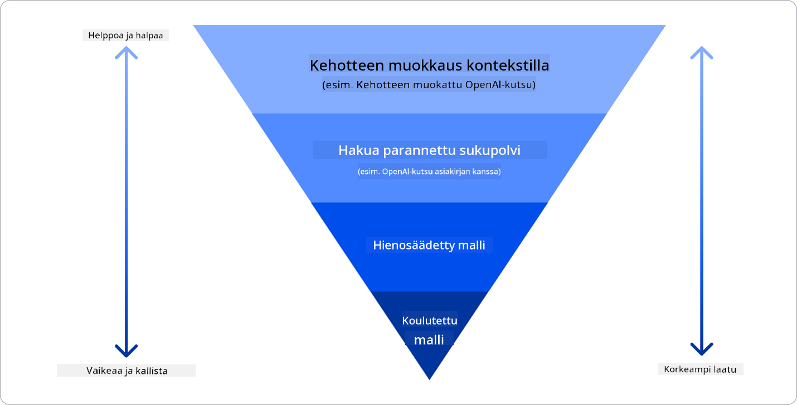

Kuvan lähde: [Four Ways that Enterprises Deploy LLMs | Fiddler AI Blog](https://www.fiddler.ai/blog/four-ways-that-enterprises-deploy-llms?WT.mc_id=academic-105485-koreyst)

### Promptin suunnittelu kontekstin kanssa

Esikoulutetut LLM-mallit toimivat erittäin hyvin yleisluontoisissa luonnollisen kielen tehtävissä, jopa lyhyellä promptilla, kuten lauseen täydentämisellä tai kysymyksellä – ns. “zero-shot” -oppiminen.

Mitä paremmin käyttäjä pystyy muotoilemaan kyselynsä yksityiskohtaisella pyynnöllä ja esimerkeillä – eli kontekstilla – sitä tarkempi ja käyttäjän odotuksia vastaavampi vastaus on. Tässä puhutaan “one-shot” -oppimisesta, jos promptissa on vain yksi esimerkki, ja “few-shot” -oppimisesta, jos esimerkkejä on useita.
Promptin suunnittelu kontekstin kanssa on kustannustehokkain tapa aloittaa.

### Retrieval Augmented Generation (RAG)

LLM-malleilla on rajoitus, että ne voivat käyttää vain koulutuksessaan käytettyä dataa vastauksen tuottamiseen. Tämä tarkoittaa, etteivät ne tiedä mitään koulutuksen jälkeisistä tapahtumista, eivätkä pääse käsiksi ei-julkiseen tietoon (kuten yritystietoihin).
Tämän voi kiertää RAG-tekniikalla, joka täydentää promptia ulkoisella datalla dokumenttien paloina, ottaen huomioon promptin pituusrajoitukset. Tätä tukevat vektoritietokantatyökalut (kuten [Azure Vector Search](https://learn.microsoft.com/azure/search/vector-search-overview?WT.mc_id=academic-105485-koreyst)), jotka hakevat hyödylliset palat eri ennalta määritellyistä tietolähteistä ja lisäävät ne promptin kontekstiin.

Tämä tekniikka on erittäin hyödyllinen, kun liiketoiminnalla ei ole tarpeeksi dataa, aikaa tai resursseja hienosäätää LLM:ää, mutta haluaa silti parantaa suorituskykyä tietyssä työkuormassa ja vähentää virheellisten tai haitallisten sisältöjen riskiä.

### Hienosäädetty malli

Hienosäätö on prosessi, jossa hyödynnetään siirto-oppimista mallin “sovittamiseksi” alatehtävään tai tietyn ongelman ratkaisuun. Toisin kuin few-shot-oppiminen ja RAG, hienosäätö tuottaa uuden mallin, jossa on päivitetyt painot ja vinot. Se vaatii joukon koulutusesimerkkejä, jotka koostuvat yhdestä syötteestä (promptista) ja siihen liittyvästä vastauksesta (täydennys).
Tämä on suositeltava lähestymistapa, jos:

- **Käytetään hienosäädettyjä malleja**. Liiketoiminta haluaa käyttää hienosäädettyjä vähemmän tehokkaita malleja (kuten upotusmalleja) korkean suorituskyvyn mallien sijaan, mikä johtaa kustannustehokkaampaan ja nopeampaan ratkaisuun.

- **Viive on tärkeä**. Viive on tärkeä tietylle käyttötapaukselle, joten ei ole mahdollista käyttää hyvin pitkiä prompteja tai esimerkkien määrää, joka pitäisi mallin oppia, ei mahdu promptin pituusrajoituksiin.

- **Pysyä ajan tasalla**. Liiketoiminnalla on paljon laadukasta dataa ja totuudenmukaisia tunnisteita sekä resurssit pitää data ajan tasalla ajan myötä.

### Koulutettu malli

LLM:n kouluttaminen alusta alkaen on kiistatta vaikein ja monimutkaisin lähestymistapa, joka vaatii valtavia määriä dataa, osaavia resursseja ja sopivaa laskentatehoa. Tätä vaihtoehtoa kannattaa harkita vain, jos liiketoiminnalla on toimialakohtainen käyttötapaus ja suuri määrä toimialakohtaista dataa.

## Tietovisa

Mikä voisi olla hyvä tapa parantaa LLM:n täydennystuloksia?

1. Promptin suunnittelu kontekstin kanssa  
1. RAG  
1. Hienosäädetty malli

V:3, jos sinulla on aikaa, resursseja ja laadukasta dataa, hienosäätö on parempi vaihtoehto pysyä ajan tasalla. Jos kuitenkin haluat parantaa asioita ja sinulla on vähän aikaa, kannattaa ensin harkita RAG:ia.

## 🚀 Haaste

Lue lisää siitä, miten voit [käyttää RAG:ia](https://learn.microsoft.com/azure/search/retrieval-augmented-generation-overview?WT.mc_id=academic-105485-koreyst) liiketoiminnassasi.

## Hienoa työtä, jatka oppimista

Kun olet suorittanut tämän oppitunnin, tutustu [Generative AI Learning -kokoelmaamme](https://aka.ms/genai-collection?WT.mc_id=academic-105485-koreyst) jatkaaksesi generatiivisen tekoälyn osaamisesi kehittämistä!

Siirry oppitunnille 3, jossa tarkastelemme, miten [rakentaa generatiivisella tekoälyllä vastuullisesti](../03-using-generative-ai-responsibly/README.md?WT.mc_id=academic-105485-koreyst)!

**Vastuuvapauslauseke**:  
Tämä asiakirja on käännetty käyttämällä tekoälypohjaista käännöspalvelua [Co-op Translator](https://github.com/Azure/co-op-translator). Vaikka pyrimme tarkkuuteen, huomioithan, että automaattikäännöksissä saattaa esiintyä virheitä tai epätarkkuuksia. Alkuperäistä asiakirjaa sen alkuperäiskielellä tulee pitää virallisena lähteenä. Tärkeissä asioissa suositellaan ammattimaista ihmiskäännöstä. Emme ole vastuussa tämän käännöksen käytöstä aiheutuvista väärinymmärryksistä tai tulkinnoista.