# Erilaisten LLM-mallien tutkiminen ja vertailu

[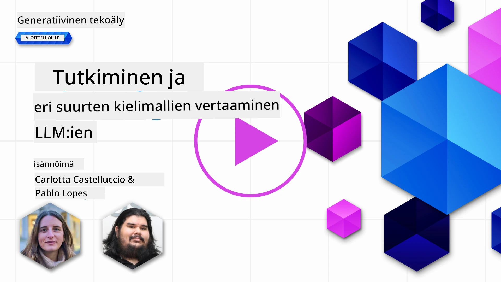](https://youtu.be/KIRUeDKscfI?si=8BHX1zvwzQBn-PlK)

> _Klikkaa yllä olevaa kuvaa nähdäksesi tämän oppitunnin videon_

Edellisessä oppitunnissa olemme nähneet, kuinka generatiivinen tekoäly muuttaa teknologiaympäristöä, miten suuret kielimallit (LLM) toimivat ja miten yritys - kuten meidän startupimme - voi soveltaa niitä omiin käyttötapauksiinsa ja kasvaa! Tässä luvussa vertailemme ja kontrastoimme erilaisia suuria kielimalleja (LLM), jotta ymmärrämme niiden hyvät ja huonot puolet.

Seuraava askel startupimme matkalla on tutkia nykyistä LLM-maisemaa ja ymmärtää, mitkä mallit sopivat parhaiten meidän käyttötapaukseemme.

## Johdanto

Tämä oppitunti kattaa:

- Erilaiset LLM-tyypit nykyisessä ympäristössä.
- Miten testata, iterointi ja vertailla malleja käyttötarkoituksessasi Azuren avulla.
- Miten ottaa LLM käyttöön.

## Oppimistavoitteet

Tämän oppitunnin jälkeen osaat:

- Valita oikean mallin käyttötarkoitukseesi.
- Ymmärtää, miten testata, iterointi ja parantaa mallin suorituskykyä.
- Tietää, miten yritykset ottavat malleja käyttöön.

## Ymmärrä erilaiset LLM-tyypit

LLM-malleja voidaan luokitella monin tavoin perustuen niiden arkkitehtuuriin, koulutusdataan ja käyttötarkoitukseen. Näiden erojen ymmärtäminen auttaa startupiamme valitsemaan oikean mallin tilanteeseen sekä ymmärtämään, miten mallia testataan, iteroidaan ja suorituskykyä parannetaan.

On monenlaisia LLM-malleja, ja mallin valinta riippuu siitä, mihin aiot käyttää sitä, datastasi, kuinka paljon olet valmis maksamaan ja muista tekijöistä.

Riippuen siitä, aiotko käyttää malleja tekstin, äänen, videon, kuvan generointiin tai muuhun, voit valita eri tyyppisen mallin.

- **Ääni- ja puheentunnistus**. Whisper-tyyppiset mallit ovat edelleen hyödyllisiä yleiskäyttöisiä puheentunnistusmalleja, mutta tuotantovalinnoissa on nyt myös uudempia puheesta tekstiksi -malleja, kuten `gpt-4o-transcribe`, `gpt-4o-mini-transcribe` ja diarisaatiovariaatiot. Arvioi kielten kattavuus, diarisaatio, reaaliaikainen tuki, latenssi ja kustannukset omaan käyttötapaukseesi sopiviksi. Lisätietoa [OpenAI puheesta tekstiksi -dokumentaatiossa](https://platform.openai.com/docs/guides/speech-to-text?WT.mc_id=academic-105485-koreyst).

- **Kuvagenerointi**. DALL-E ja Midjourney ovat tunnettuja kuvagenerointivaihtoehtoja, mutta nykyiset OpenAI-kuva-API:t keskittyvät GPT-kuvamalleihin, kuten `gpt-image-2`, kun taas Stable Diffusion, Imagen, Flux ja muut malliperheet ovat myös tavallisia vaihtoehtoja. Vertaa kehoteparannusten noudattamista, editointitukea, tyylin hallintaa, turvallisuusvaatimuksia ja lisensointia. Lisätietoa [OpenAI kuvagenerointiohjeessa](https://platform.openai.com/docs/guides/images?WT.mc_id=academic-105485-koreyst) ja tämän oppimateriaalin luvussa 9.

- **Tekstintuotanto**. Tekstimallit ulottuvat nyt huippumalleihin, päättelymalleihin, pienempiin matalaviiveisiin malleihin ja avoimen painon malleihin. Nykyisiä esimerkkejä ovat OpenAI GPT-5.x-mallit, Anthropic Claude 4.x -mallit, Google Gemini 3.x -mallit, Meta Llama 4 -mallit ja Mistral-mallit. Älä valitse vain julkaisupäivän tai hinnan perusteella; vertaa tehtävän laatua, latenssia, kontekstin ikkunaa, työkalujen käyttöä, turvallisuuskäyttäytymistä, alueellista saatavuutta ja kokonaiskustannuksia. [Microsoft Foundryn malliluettelo](https://ai.azure.com/catalog?WT.mc_id=academic-105485-koreyst) on hyvä paikka vertailla Azuren saatavilla olevia malleja.

- **Monimuotoisuus (Multi-modality)**. Monet nykyiset mallit voivat käsitellä muutakin kuin tekstiä. Jotkut hyväksyvät kuvia, ääntä tai videota syötteenä; jotkut voivat kutsua työkaluja; ja erikoistuneet mallit voivat generoida kuvia, ääntä tai videota. Esimerkiksi nykyiset OpenAI-mallit tukevat tekstin ja kuvan syötettä, Gemini-mallit voivat riippuen versiosta tukea tekstiä, koodia, kuvaa, ääntä ja videota, ja Llama 4 Scout ja Maverick ovat avoimen painon luontaisesti monimodaalisia malleja. Tarkista aina kunkin mallin kortista tuetut syöte- ja tulotavat ennen kuin rakennat työprosessia sen ympärille.

Mallin valinta tarkoittaa, että saat perustason kyvykkyydet, jotka eivät välttämättä riitä kuitenkaan. Usein sinulla on yrityskohtaisia tietoja, jotka sinun on jotenkin kerrottava LLM:lle. Tähän on muutamia eri lähestymistapoja, joista kerrotaan lisää seuraavissa osioissa.

### Foundation Models vs. LLM:t

Termi Foundation Model (perusmalli) [määriteltiin Stanfordin tutkijoiden toimesta](https://arxiv.org/abs/2108.07258?WT.mc_id=academic-105485-koreyst) ja se tarkoittaa tekoälymallia, joka täyttää tiettyjä kriteerejä, kuten:

- **Ne on koulutettu valvomattomalla tai itsevalvotulla oppimisella**, mikä tarkoittaa, että ne on koulutettu merkitsemättömällä multimodaalisella datalla eivätkä ne tarvitse ihmisen tekemää annotointia tai merkintää koulutusprosessissaan.
- **Ne ovat erittäin suuria malleja**, perustuen hyvin syviin neuroverkkoihin, joita on koulutettu miljardeilla parametreilla.
- **Ne on tarkoitettu yleensä toimimaan "perustana" muille malleille**, eli niitä voidaan käyttää lähtökohtana toisten mallien rakentamiselle, mitä voidaan tehdä hienosäädöllä.

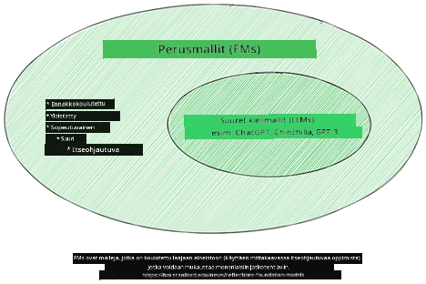

Kuvan lähde: [Essential Guide to Foundation Models and Large Language Models | kirjoittanut Babar M Bhatti | Medium
](https://thebabar.medium.com/essential-guide-to-foundation-models-and-large-language-models-27dab58f7404)

Selkeyttääksemme tätä eroa, käytetään esimerkkinä ChatGPT:tä historiallisesti. Varhaiset ChatGPT-versiot käyttivät GPT-3.5:tä perustana. OpenAI käytti chat-spesifistä dataa ja kohdistamistekniikoita luodakseen hienosäädetyn version, joka suoriutui paremmin keskustelutilanteissa, kuten chatbotit. Modernit tekoälypalvelut reitittävät usein useiden mallivarianttien välillä, joten palvelun nimi ja taustalla oleva mallin nimi eivät aina ole sama asia.

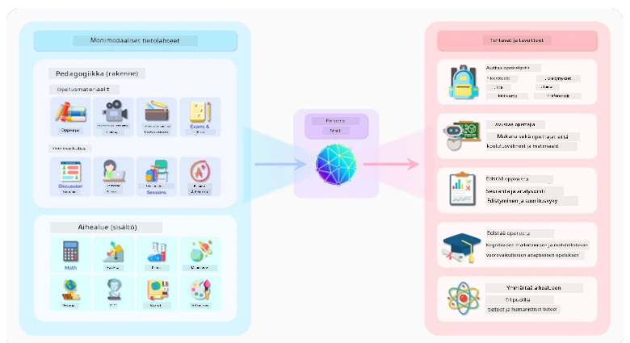

Kuvan lähde: [2108.07258.pdf (arxiv.org)](https://arxiv.org/pdf/2108.07258.pdf?WT.mc_id=academic-105485-koreyst)

### Avoimen painon/avoimen lähdekoodin vs. suljetut mallit

Toinen tapa kategorisoida LLM-malleja on se, ovatko ne avoimen painon, avoimen lähdekoodin vai suljettuja.

Avoimen lähdekoodin ja avoimen painon mallit tekevät mallin artefaktit saataville, kuten mallin parametrit ladattavaksi, tarkasteltavaksi tai muokattavaksi, mutta niiden lisenssit eroavat. Joitakin malleja on täysin avoimen lähdekoodin, kun taas toisia ovat avoimen painon malleja, joilla on käyttörajoituksia. Ne voivat olla hyödyllisiä, kun yritys haluaa enemmän kontrollia käyttöönottoon, datan sijaintiin, kustannuksiin tai räätälöintiin. Kuitenkin tiimien on silti tarkistettava lisenssiehdot, palvelukustannukset, ylläpito, tietoturvapäivitykset ja arviointilaatu ennen tuotantokäyttöä. Esimerkkejä ovat [Meta Llama 4](https://ai.meta.com/blog/llama-4-multimodal-intelligence/?WT.mc_id=academic-105485-koreyst), jotkin [Mistral-mallit](https://docs.mistral.ai/models/overview?WT.mc_id=academic-105485-koreyst) ja monet mallit, joita ylläpidetään [Hugging Face -palvelussa](https://huggingface.co/models?WT.mc_id=academic-105485-koreyst).

Suljetut mallit ovat palveluntarjoajan omistamia ja ylläpitämiä. Nämä mallit on usein optimoitu hallittuun tuotantokäyttöön, ja ne voivat tarjota vahvan tuen, turvallisuusjärjestelmät, työkalujen integraation ja skaalautuvuuden. Asiakkaat eivät yleensä voi tarkastella tai muuttaa mallin painoja, ja heidän tulee perehtyä tarjoajan ehtoihin yksityisyyden, säilytyksen, sääntelyn ja hyväksyttävän käytön osalta. Esimerkkejä ovat [OpenAI-mallit](https://platform.openai.com/docs/models?WT.mc_id=academic-105485-koreyst), [Google Gemini](https://deepmind.google/models/gemini/pro/?WT.mc_id=academic-105485-koreyst) ja [Anthropic Claude](https://platform.claude.com/docs/en/about-claude/models/overview?WT.mc_id=academic-105485-koreyst).

### Embeddingien, kuvageneroinnin sekä tekstin ja koodin generoinnin erot

LLM-mallit voidaan myös luokitella niiden tuottaman lopputuloksen perusteella.

Embedding-mallit ovat joukko malleja, jotka voivat muuttaa tekstin numeeriseen muotoon, nimeltään embedding, mikä on kielellisen tekstin numeerinen esitys. Embeddingit helpottavat koneiden ymmärtämään sanojen tai lauseiden suhdetta, ja niitä voivat käyttää syötteenä toiset mallit, kuten luokittelumallit tai ryhmittelymallit, jotka toimivat paremmin numeeristen tietojen kanssa. Embedding-malleja käytetään usein siirto-oppimiseen, jossa malli rakennetaan sairauden sijaistehtävään, josta on runsaasti dataa, ja sitten mallipainoja (embeddingejä) uudelleen käytetään muihin jälkitoimintoihin. Esimerkki tästä kategoriasta on [OpenAI embeddings](https://platform.openai.com/docs/models/embeddings?WT.mc_id=academic-105485-koreyst).

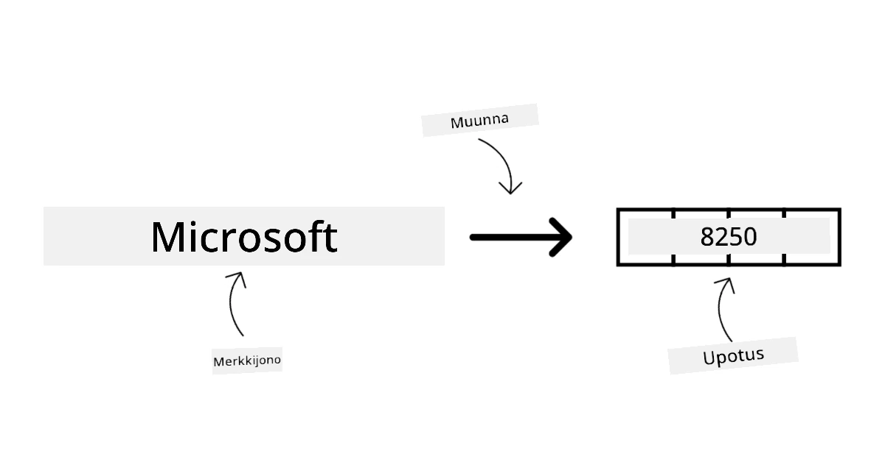

Kuvagenerointimallit ovat malleja, jotka generoivat kuvia. Näitä malleja käytetään usein kuvanmuokkaukseen, kuvasynteesiin ja kuvakäännökseen. Kuvagenerointimallit on usein koulutettu suurilla kuvadatoilla, kuten [LAION-5B](https://laion.ai/blog/laion-5b/?WT.mc_id=academic-105485-koreyst), ja ne voivat luoda uusia kuvia tai muokata olemassa olevia kuvia esimerkiksi inpainting-, superresolution- ja väritystekniikoilla. Esimerkkejä ovat [GPT Image -mallit](https://platform.openai.com/docs/guides/images?WT.mc_id=academic-105485-koreyst), [Stable Diffusion -mallit](https://github.com/Stability-AI/StableDiffusion?WT.mc_id=academic-105485-koreyst) ja Imagen-mallit.

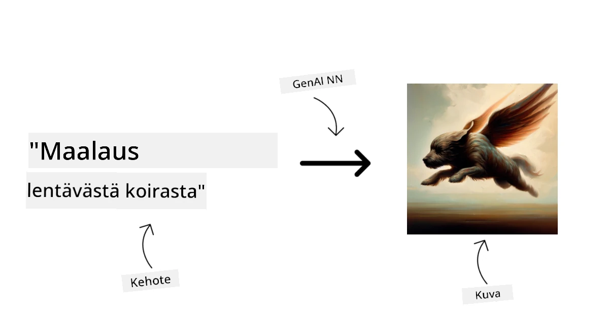

Teksti- ja koodigenerointimallit ovat malleja, jotka generoivat tekstiä tai koodia. Näitä malleja käytetään usein tekstin tiivistämiseen, kääntämiseen ja kysymyksiin vastaamiseen. Tekstigenerointimallit on usein koulutettu suurilla tekstidatoilla, kuten [BookCorpus](https://www.cv-foundation.org/openaccess/content_iccv_2015/html/Zhu_Aligning_Books_and_ICCV_2015_paper.html?WT.mc_id=academic-105485-koreyst), ja niitä voidaan käyttää uuden tekstin luomiseen tai kysymyksiin vastaamiseen. Koodigenerointimallit, kuten [CodeParrot](https://huggingface.co/codeparrot?WT.mc_id=academic-105485-koreyst), on usein koulutettu suurilla koodidatoilla, kuten GitHubista, ja niitä voidaan käyttää uuden koodin luomiseen tai olemassa olevan koodin virheiden korjaamiseen.

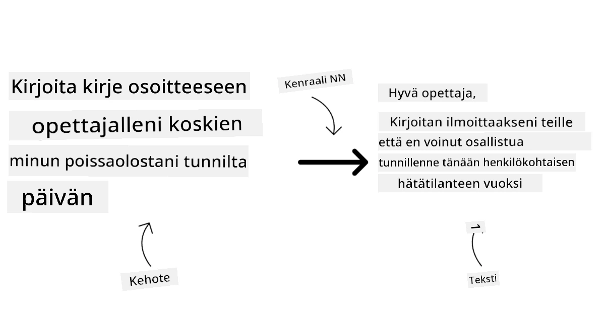

### Kooderin ja dekooderin ero verrattuna pelkkään dekooderiin

Puhuttaessa LLM-arkkitehtuurien tyypeistä, käytetään vertausta.

Kuvittele, että esimiehesi antoi sinulle tehtäväksi laatia tietovisan opiskelijoille. Sinulla on kaksi kollegaa; toinen huolehtii sisällön luomisesta ja toinen tarkistaa sen.

Sisällön luoja on kuin pelkkä dekooderimalli: hän voi katsoa aihetta, nähdä mitä olet jo kirjoittanut ja jatkaa sisällön tuottamista sen kontekstin pohjalta. Hän on erittäin hyvä kirjoittamaan kiinnostavaa ja informatiivista sisältöä, mutta ei aina paras valinta, kun tehtävänä on vain luokitella, hakea tai koodata tietoa. Esimerkkejä pelkistä dekooderimalliperheistä ovat GPT- ja Llama-mallit.

Tarkastaja on kuin kooderimalli, hän katsoo kirjoitettua kurssia ja vastauksia, huomaa niiden välisen suhteen ja ymmärtää kontekstin, mutta ei ole hyvä tuottamaan sisältöä. Esimerkki pelkästä kooderimallista olisi BERT.

Kuvittele, että voimme saada myös jonkun, joka sekä luo että tarkistaa tietovisan, tämä on kooderi-dekooderimalli. Joitakin esimerkkejä ovat BART ja T5.

### Palvelu vs. malli

Nyt puhutaan palvelun ja mallin erosta. Palvelu on pilvipalveluntarjoajan tarjoama tuote, ja se on usein yhdistelmä malleja, dataa ja muita komponentteja. Malli on palvelun ydinosa, ja se on usein perustamalli, kuten LLM.

Palvelut on usein optimoitu tuotantokäyttöön ja ne ovat usein helpompia käyttää kuin mallit graafisen käyttöliittymän kautta. Palvelut eivät kuitenkaan aina ole ilmaisia, vaan vaativat usein tilauksen tai maksun, jolla käyttäjä hyödyntää palvelun omistajan laitteita ja resursseja, optimoiden kustannuksia ja mahdollistaen helpon skaalauksen. Esimerkki palvelusta on [Azure OpenAI Service](https://learn.microsoft.com/azure/ai-foundry/openai/overview?WT.mc_id=academic-105485-koreyst), joka tarjoaa käytön mukaan maksettavan hinnoittelun eli käyttäjiltä veloitetaan käytön mukaan. Azure OpenAI Service tarjoaa myös yritystason tietoturvan ja vastuullisen tekoälyn kehyksen mallien kyvykkyyksien päällä.

Mallit ovat neuroverkkokokoonpanoja: parametreja, painoja, arkkitehtuuria, tokenisoijaa ja tukevia asetuksia. Mallin ajaminen paikallisesti tai yksityisessä ympäristössä vaatii sopivan laitteiston, palvelinarkkitehtuurin, seurannan sekä yhteensopivan avoimen lähdekoodin/avoinpainon lisenssin tai kaupallisen lisenssin. Avoimen painon mallit, kuten Llama 4 tai Mistral-mallit, voivat olla itse isännöityjä, mutta ne vaativat edelleen laskentatehoa ja operatiivista asiantuntemusta.

## Miten testata ja iteroida eri malleilla Azuren suorituskyvyn ymmärtämiseksi

Kun tiimimme on tutkinut nykyisen LLM-maiseman ja tunnistanut joitakin hyviä ehdokkaita heidän skenaarioihinsa, seuraava vaihe on testata niitä heidän omilla tiedoillaan ja työkuormallaan. Tämä on iteratiivinen prosessi, joka tehdään kokeiden ja mittausten avulla.
Suurin osa aiemmin mainitsemistamme malleista (OpenAI-mallit, avoimen painon mallit kuten Llama 4 ja Mistral sekä Hugging Face -mallit) ovat saatavilla [Microsoft Foundry Models](https://learn.microsoft.com/azure/foundry/concepts/foundry-models-overview?WT.mc_id=academic-105485-koreyst) -palvelussa.

[Microsoft Foundry](https://learn.microsoft.com/azure/foundry/what-is-foundry?WT.mc_id=academic-105485-koreyst), aiemmin Azure AI Studio/Azure AI Foundry, on yhtenäinen Azure-alusta tekoälysovellusten ja -agenttien rakentamiseen. Se auttaa kehittäjiä hallitsemaan koko elinkaaren kokeiluista ja arvioinnista käyttöönottoon, valvontaan ja hallintaan. Microsoft Foundryn malliluettelo mahdollistaa käyttäjän:

- Etsimään kiinnostavan perustamallin luettelosta, mukaan lukien Azure:n myymät mallit sekä kumppaneiden ja yhteisön tarjoamat mallit. Käyttäjät voivat suodattaa tehtävän, tarjoajan, lisenssin, käyttöönoton tai nimen mukaan.

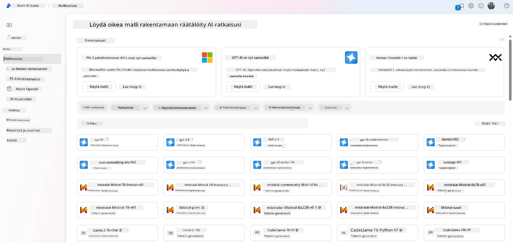

- Tarkastelemaan mallikorttia, joka sisältää yksityiskohtaisen kuvauksen tarkoitetusta käytöstä ja koulutusdatasta, koodiesimerkkejä ja arviointituloksia sisäisestä arviointikirjastosta.

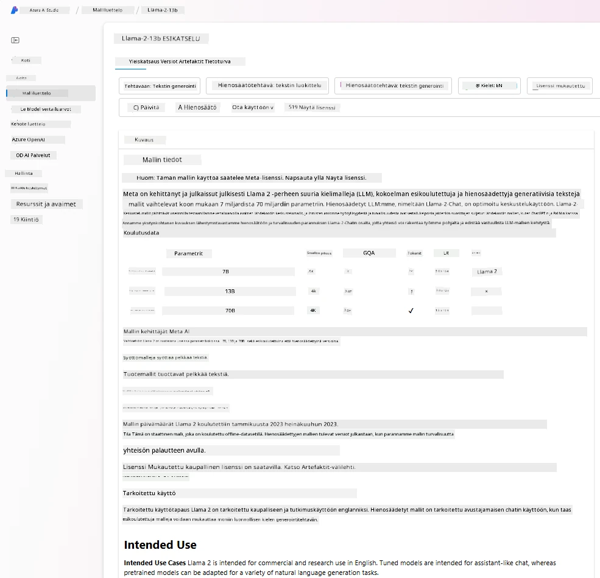

- Vertailemaan teollisuudessa saatavilla olevien mallien ja aineistojen vertailuarvoja arvioidakseen, mikä sopii liiketoimintaskenaarioon, [Model Benchmarks](https://learn.microsoft.com/azure/ai-foundry/concepts/model-benchmarks?WT.mc_id=academic-105485-koreyst) -paneelin kautta.

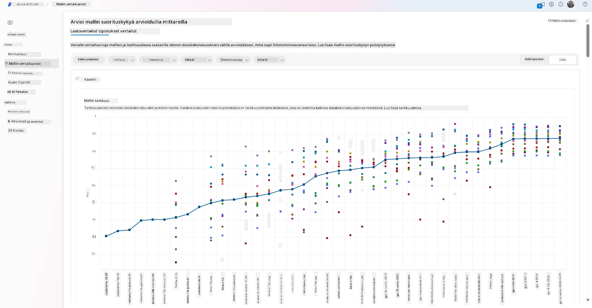

- Hienosäätämään tuettuja malleja omalla koulutusdatalla parantaakseen mallin suorituskykyä tiettyssä työkuormassa hyödyntäen Microsoft Foundryn kokeilu- ja seurantaominaisuuksia.

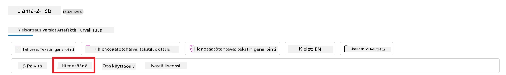

- Ottaamaan käyttöön alkuperäisen esikoulutetun mallin tai hienosäädetyn version etäkäytössä reaaliaikaisessa päätepisteessä, käyttäen hallittuja laskentaresursseja tai serverittömiä käyttöönottoasetuksia, jotta sovellukset voivat hyödyntää sitä.

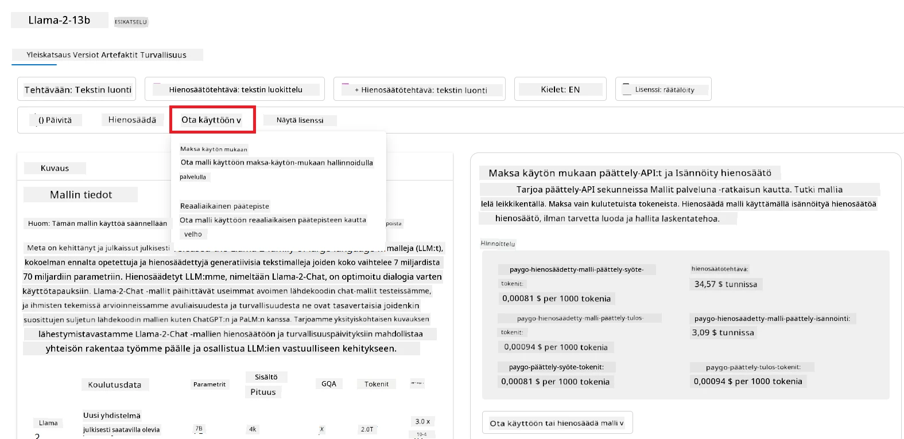

> [!NOTE]
> Kaikki luettelon mallit eivät ole tällä hetkellä saatavilla hienosäätöön ja/tai pay-as-you-go -käyttöönottoon. Tarkista mallikortista mallitiedot ja rajoitukset.

## LLM-tulosten parantaminen

Olemme startup-tiimimme kanssa tutkineet erilaisia LLM-malleja ja pilvialustaa (Microsoft Foundry), joka mahdollistaa eri mallien vertailun, testaamisen, suorituskyvyn parantamisen ja käyttöönoton ennusteisiin.

Mutta milloin heidän kannattaa harkita mallin hienosäätöä sen sijaan, että käyttäisivät esikoulutettua mallia? Onko muita tapoja parantaa mallin suorituskykyä tietyissä työkuormissa?

Liiketoiminnalla on useita keinoja saada tarvitsemansa tulokset LLM:stä. Voit valita eri mallityyppejä, joilla on erilaiset koulutusasteet, kun otat LLM:n tuotantoon erilaisilla vaikeustasoilla, kustannuksilla ja laadulla. Tässä joitakin eri lähestymistapoja:

- **Keinonhallinta kontekstin avulla**. Ajatus on tarjota riittävästi kontekstia kehotettaessa, jotta saat tarvitsemasi vastaukset.

- **Retrieval Augmented Generation, RAG**. Tietosi voivat sijaita tietokannassa tai verkkopäätepisteessä; varmistaaksesi, että nämä tiedot tai niiden osat sisältyvät kyselyyn, voit hakea relevantit tiedot ja liittää ne käyttäjän kehotteeseen.

- **Hienosäädetty malli**. Tässä olet kouluttanut mallia edelleen omilla tiedoillasi, mikä tekee mallista tarkemman ja vastaa tarpeitasi paremmin, mutta tämä voi olla kallista.

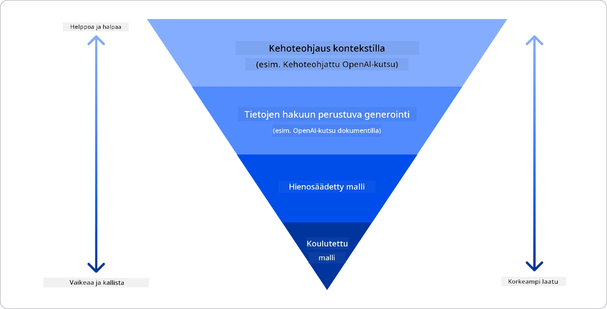

Kuvan lähde: [Four Ways that Enterprises Deploy LLMs | Fiddler AI Blog](https://www.fiddler.ai/blog/four-ways-that-enterprises-deploy-llms?WT.mc_id=academic-105485-koreyst)

### Keinonhallinta kontekstin avulla

Esikoulutetut LLM:t toimivat erittäin hyvin yleisluontoisissa luonnollisen kielen tehtävissä, jopa pelkällä lyhyellä kehotteella, kuten täydentämistä vaativalla lauseella tai kysymyksellä – ns. ”zero-shot” oppimisella.

Mitä paremmin käyttäjä voi jäsentää kyselynsä yksityiskohtaisella pyynnöllä ja esimerkeillä – eli kontekstilla – sitä tarkempi ja odotuksia vastaavampi vastaus on. Tässä puhutaankin ”one-shot” oppimisesta, jos kehotteessa on vain yksi esimerkki, ja ”few-shot” oppimisesta, jos esimerkkejä on useampia.
Keinonhallinta kontekstin avulla on kustannustehokkain tapa aloittaa.

### Retrieval Augmented Generation (RAG)

LLM:illä on rajoitus, että ne voivat käyttää vain koulutuksessaan käytettyjä tietoja vastauksen tuottamiseen. Tämä tarkoittaa, etteivät ne tiedä koulutuksen jälkeisistä tapahtumista eivätkä pääse käsiksi julkisten tietojen ulkopuoliseen dataan (esim. yritystietoihin).
Tämä rajoitus voidaan voittaa RAG-tekniikalla, jossa kehotteeseen lisätään ulkopuolista dataa dokumenttien osina ottaen huomioon kehotteen pituusrajoitukset. Tämä toteutetaan vektoritietokantatyökaluilla (kuten [Azure Vector Search](https://learn.microsoft.com/azure/search/vector-search-overview?WT.mc_id=academic-105485-koreyst)), jotka hakivat hyödylliset osat eri määritellyistä tietolähteistä ja lisäävät ne kehotteen kontekstiin.

Tämä tekniikka on erittäin hyödyllinen silloin, kun liiketoiminnalla ei ole riittävästi dataa, aikaa tai resursseja LLM:n hienosäätöön, mutta se haluaa silti parantaa suorituskykyä tietyssä työkuormassa ja vähentää harhaisten, vanhentuneiden tai tuettujen vastausten riskiä.

### Hienosäädetty malli

Hienosäätö on prosessi, joka hyödyntää siirtäjäoppimista mallin mukauttamiseen alatehtävään tai tietyn ongelman ratkaisemiseen. Toisin kuin few-shot-oppiminen ja RAG, siitä syntyy uusi malli päivitettyine painoineen ja harhoineen. Se vaatii joukon koulutusesimerkkejä, joista jokainen sisältää yksittäisen syötteen (kehotteen) ja siihen liittyvän tuloksen (valmiin vastauksen).
Tämä olisi suositeltava lähestymistapa, jos:

- **Käytetään pienempiä tehtäväkohtaisia malleja**. Liiketoiminta haluaa hienosäätää pienemmän mallin kapeaan tehtävään sen sijaan, että toistuvasti kehottaisi suurempaa rajamallia, jolloin ratkaisu on kustannustehokkaampi ja nopeampi.

- **Otetaan huomioon viive (latenssi)**. Viive on tärkeä tiettyä käyttötapausta varten, joten ei ole mahdollista käyttää erittäin pitkiä kehotteita tai mallin pitäisi oppia vain rajallinen määrä esimerkkejä, jotka eivät mahdu kehotteen pituusrajoihin.

- **Vakaan käyttäytymisen sopeuttaminen**. Yrityksellä on monia laadukkaita esimerkkejä, ja se haluaa mallin johdonmukaisesti noudattavan tehtävän kaavaa, tulosteformaattia, sävyä tai toimialakohtaista tyyliä. Jos pääasiallinen ongelma on tuoreet faktat tai usein muuttuva yksityinen tieto, käytä RAG-menetelmää pelkän hienosäädön sijaan.

### Koulutettu malli

Kielenmallin (LLM) opettaminen alusta asti on epäilemättä haastavin ja monimutkaisin lähestymistapa, joka vaatii valtavia määriä dataa, taitavia resursseja ja sopivaa laskentatehoa. Tätä vaihtoehtoa tulisi harkita vain tilanteessa, jossa yrityksellä on toimialakohtainen käyttötapaus ja suuri määrä toimialakeskeistä dataa.

## Tietovisa

Mikä voisi olla hyvä lähestymistapa LLM:n täydennystulosten parantamiseen?

1. Kehotteen suunnittelu kontekstilla
1. RAG
1. Hienosäädetty malli

V: Kaikki kolme voivat auttaa. Aloita kehotteen suunnittelulla ja kontekstilla nopeita parannuksia varten, ja käytä RAG:ia, kun malli tarvitsee ajan tasalla olevia faktoja tai yksityisiä yritystietoja. Valitse hienosäätö, kun sinulla on tarpeeksi laadukkaita esimerkkejä ja tarvitset mallin johdonmukaista toimintaa tehtävän, formaatin, sävyn tai toimialan kaavan mukaisesti.

## 🚀 Haaste

Lue lisää siitä, miten voit [käyttää RAG:ia](https://learn.microsoft.com/azure/search/retrieval-augmented-generation-overview?WT.mc_id=academic-105485-koreyst) liiketoiminnassasi.

## Hienoa työtä, jatka oppimista

Tämän oppitunnin jälkeen tutustu [Generatiivisen tekoälyn oppimiskokoelmaamme](https://aka.ms/genai-collection?WT.mc_id=academic-105485-koreyst) jatkaaksesi generatiivisen tekoälyn taitojesi kehittämistä!

Siirry oppitunnille 3, jossa tarkastelemme, kuinka [rakentaa generatiivisella tekoälyllä vastuullisesti](../03-using-generative-ai-responsibly/README.md?WT.mc_id=academic-105485-koreyst)!

---

<!-- CO-OP TRANSLATOR DISCLAIMER START -->
**Vastuuvapauslauseke**:
Tämä asiakirja on käännetty käyttämällä tekoälypohjaista käännöspalvelua [Co-op Translator](https://github.com/Azure/co-op-translator). Vaikka pyrimme tarkkuuteen, otathan huomioon, että automaattiset käännökset saattavat sisältää virheitä tai epätarkkuuksia. Alkuperäinen asiakirja sen alkuperäiskielellä on virallinen lähde. Tärkeissä asioissa suositellaan ammattimaista ihmiskäännöstä. Emme ole vastuussa tämän käännöksen käytöstä aiheutuvista väärinymmärryksistä tai tulkinnoista.
<!-- CO-OP TRANSLATOR DISCLAIMER END -->