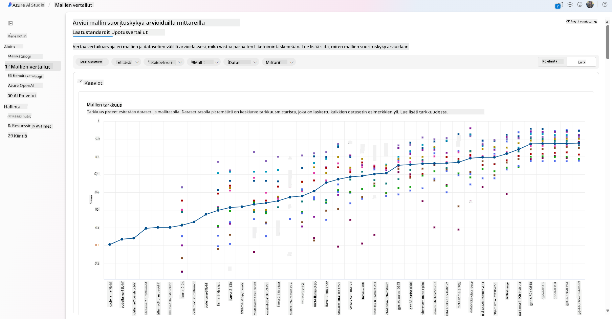
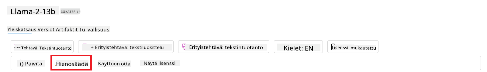
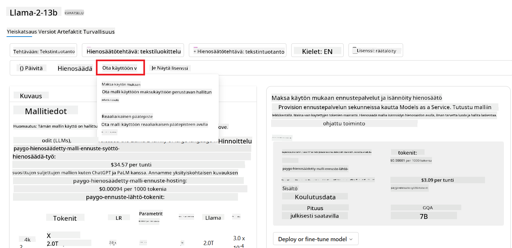
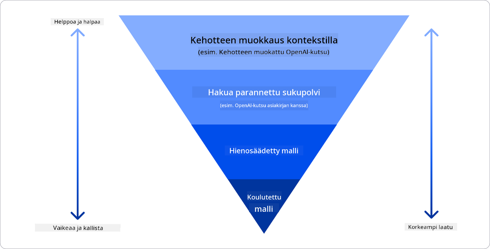

<!--
CO_OP_TRANSLATOR_METADATA:
{
  "original_hash": "e2f686f2eb794941761252ac5e8e090b",
  "translation_date": "2025-06-25T10:47:24+00:00",
  "source_file": "02-exploring-and-comparing-different-llms/README.md",
  "language_code": "fi"
}
-->
# Eri LLM:ien tutkiminen ja vertailu

> _Napsauta yllä olevaa kuvaa nähdäksesi tämän oppitunnin videon_

Edellisessä oppitunnissa näimme, miten generatiivinen tekoäly muuttaa teknologiakenttää, miten suurten kielimallien (LLM) toiminta perustuu ja miten yritys - kuten meidän startup - voi soveltaa niitä omiin käyttötapauksiinsa ja kasvaa! Tässä luvussa aiomme vertailla ja vastakkainasettaa erilaisia suuria kielimalleja (LLM) ymmärtääksemme niiden hyviä ja huonoja puolia.

Seuraava askel startupimme matkalla on tutkia nykyistä LLM-kenttää ja ymmärtää, mitkä niistä sopivat käyttötapaukseemme.

## Johdanto

Tämä oppitunti kattaa:

- Eri tyyppiset LLM:t nykyisessä kentässä.
- Eri mallien testaaminen, iterointi ja vertailu käyttötapaukseesi Azure-ympäristössä.
- Miten LLM otetaan käyttöön.

## Oppimistavoitteet

Oppitunnin suorittamisen jälkeen osaat:

- Valita oikean mallin käyttötapaukseesi.
- Ymmärtää, miten testata, iteroida ja parantaa mallisi suorituskykyä.
- Tietää, miten yritykset ottavat malleja käyttöön.

## Ymmärrä eri tyyppisiä LLM:iä

LLM:t voidaan luokitella useilla tavoilla arkkitehtuurin, koulutusdatan ja käyttötapauksen perusteella. Näiden erojen ymmärtäminen auttaa startupiamme valitsemaan oikean mallin tilanteeseen ja ymmärtämään, miten testata, iteroida ja parantaa suorituskykyä.

On monia erilaisia LLM-malleja, ja mallin valinta riippuu siitä, mihin aiot niitä käyttää, datastasi, kuinka paljon olet valmis maksamaan ja muista tekijöistä.

Riippuen siitä, aiotko käyttää malleja tekstin, äänen, videon, kuvien luomiseen jne., saatat valita eri tyyppisen mallin.

- **Ääni ja puheentunnistus**. Tähän tarkoitukseen Whisper-tyyppiset mallit ovat loistava valinta, sillä ne ovat yleiskäyttöisiä ja suunnattu puheentunnistukseen. Ne on koulutettu monipuolisella äänidatalla ja ne voivat suorittaa monikielistä puheentunnistusta. Lue lisää [Whisper-tyyppisistä malleista täältä](https://platform.openai.com/docs/models/whisper?WT.mc_id=academic-105485-koreyst).

- **Kuvien luominen**. Kuvien luomiseen DALL-E ja Midjourney ovat kaksi hyvin tunnettua vaihtoehtoa. DALL-E on saatavilla Azure OpenAI:n kautta. [Lue lisää DALL-E:stä täältä](https://platform.openai.com/docs/models/dall-e?WT.mc_id=academic-105485-koreyst) ja myös tämän opetussuunnitelman luvusta 9.

- **Tekstin luominen**. Useimmat mallit on koulutettu tekstin luomiseen, ja sinulla on laaja valikoima vaihtoehtoja GPT-3.5:stä GPT-4:ään. Ne tulevat eri hintaluokissa, joista GPT-4 on kallein. Kannattaa tutustua [Azure OpenAI -leikkikenttään](https://oai.azure.com/portal/playground?WT.mc_id=academic-105485-koreyst) arvioidaksesi, mitkä mallit parhaiten sopivat tarpeisiisi kyvykkyyden ja kustannusten osalta.

- **Monimodaliteetti**. Jos haluat käsitellä useita datatyyppejä syötteessä ja tulosteessa, saatat haluta tutustua malleihin kuten [gpt-4 turbo visionilla tai gpt-4o](https://learn.microsoft.com/azure/ai-services/openai/concepts/models#gpt-4-and-gpt-4-turbo-models?WT.mc_id=academic-105485-koreyst) - OpenAI-mallien uusimpiin julkaisuihin - jotka kykenevät yhdistämään luonnollisen kielen käsittelyn visuaaliseen ymmärtämiseen, mahdollistamalla vuorovaikutukset monimodaalisten käyttöliittymien kautta.

Mallin valitseminen tarkoittaa, että saat joitakin perusominaisuuksia, jotka eivät kuitenkaan välttämättä riitä. Usein sinulla on yrityskohtaisia tietoja, jotka sinun täytyy jotenkin kertoa LLM:lle. On muutamia eri vaihtoehtoja, miten lähestyä tätä, lisää tästä tulevissa osioissa.

### Perusmallit vs. LLM:t

Termin "Perusmalli" loivat [Stanfordin tutkijat](https://arxiv.org/abs/2108.07258?WT.mc_id=academic-105485-koreyst) ja se määritellään tekoälymalliksi, joka noudattaa tiettyjä kriteerejä, kuten:

- **Ne koulutetaan valvomattomalla oppimisella tai itsevalvotulla oppimisella**, mikä tarkoittaa, että ne koulutetaan merkkaamattomalla monimodaalisella datalla, eikä niiden koulutusprosessi vaadi ihmisen annotaatiota tai datan merkkausta.
- **Ne ovat erittäin suuria malleja**, perustuen erittäin syviin neuroverkkoihin, jotka on koulutettu miljardilla parametrilla.
- **Ne on yleensä tarkoitettu toimimaan 'perustana' muille malleille**, mikä tarkoittaa, että niitä voidaan käyttää lähtökohtana muille malleille, jotka voidaan rakentaa niiden päälle hienosäätämällä.

Kuvan lähde: [Essential Guide to Foundation Models and Large Language Models | by Babar M Bhatti | Medium](https://thebabar.medium.com/essential-guide-to-foundation-models-and-large-language-models-27dab58f7404)

Selventääksemme tätä erottelua tarkemmin, otetaan esimerkiksi ChatGPT. ChatGPT:n ensimmäisen version rakentamisessa mallina toimi GPT-3.5, joka toimi perustamallina. Tämä tarkoittaa, että OpenAI käytti joitakin keskusteluihin liittyviä tietoja luodakseen hienosäädetyn version GPT-3.5:stä, joka oli erikoistunut toimimaan hyvin keskusteluskenaarioissa, kuten chatboteissa.

### Avoimen lähdekoodin vs. omistetut mallit

Toinen tapa luokitella LLM:t on se, ovatko ne avoimen lähdekoodin vai omistettuja.

Avoimen lähdekoodin mallit ovat malleja, jotka ovat yleisön saatavilla ja joita kuka tahansa voi käyttää. Ne ovat usein yrityksen, joka ne loi, tai tutkimusyhteisön saatavilla. Näitä malleja voidaan tarkastella, muokata ja räätälöidä erilaisiin LLM-käyttötapauksiin. Ne eivät kuitenkaan aina ole optimoitu tuotantokäyttöön, ja ne eivät välttämättä ole yhtä suorituskykyisiä kuin omistetut mallit. Lisäksi avoimen lähdekoodin mallien rahoitus voi olla rajallista, ja niitä ei välttämättä ylläpidetä pitkällä aikavälillä tai päivitetä uusimmalla tutkimuksella. Suosittuja avoimen lähdekoodin malleja ovat esimerkiksi [Alpaca](https://crfm.stanford.edu/2023/03/13/alpaca.html?WT.mc_id=academic-105485-koreyst), [Bloom](https://huggingface.co/bigscience/bloom) ja [LLaMA](https://llama.meta.com).

Omistetut mallit ovat malleja, jotka ovat yrityksen omistamia ja joita ei ole saatavilla yleisölle. Nämä mallit ovat usein optimoitu tuotantokäyttöön. Ne eivät kuitenkaan ole sallittuja tarkasteltavaksi, muokattavaksi tai räätälöitäväksi eri käyttötapauksiin. Lisäksi ne eivät ole aina saatavilla ilmaiseksi, ja niiden käyttö saattaa vaatia tilauksen tai maksun. Käyttäjillä ei myöskään ole kontrollia mallin koulutuksessa käytettyyn dataan, mikä tarkoittaa, että heidän tulee luottaa mallin omistajaan tietosuojan ja tekoälyn vastuullisen käytön varmistamiseksi. Suosittuja omistettuja malleja ovat esimerkiksi [OpenAI-mallit](https://platform.openai.com/docs/models/overview?WT.mc_id=academic-105485-koreyst), [Google Bard](https://sapling.ai/llm/bard?WT.mc_id=academic-105485-koreyst) tai [Claude 2](https://www.anthropic.com/index/claude-2?WT.mc_id=academic-105485-koreyst).

### Upotukset vs. Kuvien luominen vs. Tekstin ja koodin luominen

LLM:t voidaan myös luokitella niiden tuottaman sisällön perusteella.

Upotukset ovat joukko malleja, jotka voivat muuntaa tekstin numeeriseen muotoon, jota kutsutaan upotukseksi. Upotukset helpottavat koneiden ymmärtää sanojen tai lauseiden välisiä suhteita ja niitä voidaan käyttää syötteinä muille malleille, kuten luokittelumalleille tai klusterointimalleille, jotka toimivat paremmin numeerisella datalla. Upotusmalleja käytetään usein siirto-oppimisessa, jossa malli rakennetaan korvaavalle tehtävälle, jolle on runsaasti dataa, ja sitten mallin painoja (upotuksia) käytetään uudelleen muihin tehtäviin. Esimerkki tästä kategoriasta on [OpenAI upotukset](https://platform.openai.com/docs/models/embeddings?WT.mc_id=academic-105485-koreyst).

Kuvien luomismallit ovat malleja, jotka luovat kuvia. Näitä malleja käytetään usein kuvien muokkaukseen, kuvasynteesiin ja kuvien kääntämiseen. Kuvien luomismallit koulutetaan usein suurilla kuvadatoilla, kuten [LAION-5B](https://laion.ai/blog/laion-5b/?WT.mc_id=academic-105485-koreyst), ja niitä voidaan käyttää uusien kuvien luomiseen tai olemassa olevien kuvien muokkaamiseen sisäänmaalaus-, superresoluutio- ja väritystekniikoilla. Esimerkkejä ovat [DALL-E-3](https://openai.com/dall-e-3?WT.mc_id=academic-105485-koreyst) ja [Stable Diffusion -mallit](https://github.com/Stability-AI/StableDiffusion?WT.mc_id=academic-105485-koreyst).

Tekstin ja koodin luomismallit ovat malleja, jotka luovat tekstiä tai koodia. Näitä malleja käytetään usein tekstin tiivistämiseen, kääntämiseen ja kysymyksiin vastaamiseen. Tekstin luomismallit koulutetaan usein suurilla tekstidatoilla, kuten [BookCorpus](https://www.cv-foundation.org/openaccess/content_iccv_2015/html/Zhu_Aligning_Books_and_ICCV_2015_paper.html?WT.mc_id=academic-105485-koreyst), ja niitä voidaan käyttää uuden tekstin luomiseen tai kysymyksiin vastaamiseen. Koodin luomismallit, kuten [CodeParrot](https://huggingface.co/codeparrot?WT.mc_id=academic-105485-koreyst), koulutetaan usein suurilla koodidatoilla, kuten GitHubilla, ja niitä voidaan käyttää uuden koodin luomiseen tai olemassa olevan koodin virheiden korjaamiseen.

### Koodaaja-dekooderi vs. Pelkkä dekooderi

Puhutaanpa LLM:ien eri arkkitehtuurityypeistä analogian avulla.

Kuvittele, että esimiehesi antoi sinulle tehtävän laatia tietovisa opiskelijoille. Sinulla on kaksi kollegaa; toinen vastaa sisällön luomisesta ja toinen niiden tarkistamisesta.

Sisällöntuottaja on kuin pelkkä dekooderimalli, hän voi katsoa aihetta ja nähdä, mitä olet jo kirjoittanut, ja sitten hän voi kirjoittaa kurssin sen perusteella. Hän on erittäin hyvä kirjoittamaan mukaansatempaavaa ja informatiivista sisältöä, mutta ei ole kovin hyvä ymmärtämään aihetta ja oppimistavoitteita. Esimerkkejä dekooderimalleista ovat GPT-perheen mallit, kuten GPT-3.

Tarkistaja on kuin pelkkä koodaajamalli, hän katsoo kirjoitettua kurssia ja vastauksia, huomaa niiden välisen suhteen ja ymmärtää kontekstin, mutta ei ole hyvä sisällön tuottamisessa. Esimerkki pelkästä koodaajamallista olisi BERT.

Kuvittele, että meillä voisi olla joku, joka voisi sekä luoda että tarkistaa visan, tämä on koodaaja-dekooderimalli. Esimerkkejä olisivat BART ja T5.

### Palvelu vs. malli

Puhutaan nyt palvelun ja mallin välisestä erosta. Palvelu on pilvipalveluntarjoajan tarjoama tuote, ja se on usein yhdistelmä malleja, dataa ja muita komponentteja. Malli on palvelun ydinosa, ja se on usein perustamalli, kuten LLM.

Palvelut ovat usein optimoitu tuotantokäyttöön ja ne ovat usein helpompia käyttää kuin mallit, graafisen käyttöliittymän kautta. Palvelut eivät kuitenkaan ole aina saatavilla ilmaiseksi, ja niiden käyttö saattaa vaatia tilauksen tai maksun, vastineeksi palvelun omistajan laitteiston ja resurssien hyödyntämisestä, kustannusten optimoinnista ja helppoa skaalaamista. Esimerkki palvelusta on [Azure OpenAI Service](https://learn.microsoft.com/azure/ai-services/openai/overview?WT.mc_id=academic-105485-koreyst), joka tarjoaa maksua käytön mukaan -suunnitelman, mikä tarkoittaa, että käyttäjiltä veloitetaan suhteellisesti sen mukaan, kuinka paljon he käyttävät palvelua. Lisäksi Azure OpenAI Service tarjoaa yritystason turvallisuuden ja vastuullisen tekoälykehyksen mallien kyvykkyyksien päälle.

Mallit ovat vain neuroverkko, parametreineen, painoineen ja muineen. Ne mahdollistavat yritysten ajon paikallisesti, mutta vaativat laitteiden hankintaa, rakenteen rakentamista skaalaamiseksi ja lisenssin ostamista tai avoimen lähdekoodin mallin käyttöä. LLaMA-malli on saatavilla käytettäväksi, ja sen ajamiseen vaaditaan laskentatehoa.

## Miten testata ja iterata eri malleilla suorituskyvyn ymmärtämiseksi Azure-ympäristössä

Kun tiimimme on tutkinut nykyistä LLM-kenttää ja tunnistanut hyviä ehdokkaita heidän skenaarioihinsa, seuraava askel on testata niitä heidän datallaan ja työkuormallaan. Tämä on iteratiivinen prosessi, joka tehdään kokeiden ja mittausten avulla. Useimmat aiemmissa kappaleissa mainitsemistamme malleista (OpenAI-mallit, avoimen lähdekoodin mallit kuten Llama2 ja Hugging Face -transformaattorit) ovat saatavilla [Model Catalogissa](https://learn.microsoft.com/azure/ai-studio/how-to/model-catalog-overview?WT.mc_id=academic-105485-koreyst) [Azure AI Studiossa](https://ai.azure.com/?WT.mc_id=academic-105485-koreyst).

[Azure AI Studio](https://learn.microsoft.com/azure/ai-studio/what-is-ai-studio?WT.mc_id=academic-105485-koreyst) on pilvialusta, joka on suunniteltu kehittäjille generatiivisten tekoälysovellusten rakentamiseen ja koko kehityselinkaaren hallintaan - kokeilusta arviointiin - yhdistämällä kaikki Azure AI -palvelut yhdeksi keskukseksi kätevällä käyttöliittymällä. Azure AI Studion Model Catalog mahdollistaa käyttäjän:

- Löytää kiinnostava perustamalli katalogista - joko omistettu tai avoimen lähdekoodin, suodattamalla tehtävän, lisenssin tai nimen perusteella. Hakukelpoisuuden parantamiseksi mallit on järjestetty kokoelmiin, kuten Azure OpenAI -kokoelma, Hugging Face -kokoelma ja enemmän.

- Tarkistaa mallikortti, mukaan lukien yksityiskohtainen kuvaus aiotusta käytöstä ja koulutusdatasta, koodiesimerkit ja arviointitulokset sisäisestä arviointikirjastosta.
- Vertaa alan eri mallien ja datojen vertailuarvoja arvioidaksesi, mikä niistä täyttää liiketoimintaskenaarion, [Model Benchmarks](https://learn.microsoft.com/azure/ai-studio/how-to/model-benchmarks?WT.mc_id=academic-105485-koreyst) -paneelin kautta.

- Hienosäädä mallia mukautetulla harjoitusdatalla parantaaksesi mallin suorituskykyä tietyssä työkuormassa hyödyntämällä Azure AI Studion kokeilu- ja seurantakykyjä.

- Ota alkuperäinen esikoulutettu malli tai hienosäädetty versio käyttöön etäkäytössä reaaliaikaisessa ennustelaskennassa - hallinnoitu laskenta - tai palvelimettomassa API-päätepisteessä - [pay-as-you-go](https://learn.microsoft.com/azure/ai-studio/how-to/model-catalog-overview#model-deployment-managed-compute-and-serverless-api-pay-as-you-go?WT.mc_id=academic-105485-koreyst) - jotta sovellukset voivat käyttää sitä.

> [!NOTE]
> Kaikkia malliston malleja ei tällä hetkellä voi hienosäätää ja/tai ottaa käyttöön pay-as-you-go-mallilla. Tarkista mallikortti saadaksesi lisätietoja mallin ominaisuuksista ja rajoituksista.

## LLM-tulosten parantaminen

Olemme startup-tiimimme kanssa tutkineet erilaisia LLM-malleja ja pilvialustaa (Azure Machine Learning), jotka mahdollistavat erilaisten mallien vertailun, niiden arvioinnin testidatalla, suorituskyvyn parantamisen ja käyttöönoton ennustepäätepisteissä.

Mutta milloin heidän tulisi harkita mallin hienosäätöä esikoulutetun mallin sijaan? Onko muita lähestymistapoja mallin suorituskyvyn parantamiseksi tietyissä työkuormissa?

On olemassa useita lähestymistapoja, joita yritys voi käyttää saadakseen tarvitsemansa tulokset LLM-mallista. Voit valita erilaisia malleja, joilla on eri koulutustaso, kun otat LLM:n käyttöön tuotannossa, eri monimutkaisuus-, kustannus- ja laatutasojen kanssa. Tässä muutamia eri lähestymistapoja:

- **Kehoteinsinöinti kontekstilla**. Ajatuksena on antaa riittävästi kontekstia, kun annat kehotteen, jotta saat tarvitsemasi vastaukset.

- **Hakupohjainen sukupolvi, RAG**. Datasi saattaa olla esimerkiksi tietokannassa tai verkkopäätepisteessä, jotta tämä data tai sen alijoukko sisältyy kehotteen aikana, voit hakea asiaankuuluvan datan ja tehdä siitä osan käyttäjän kehotetta.

- **Hienosäädetty malli**. Tässä koulutat mallia lisää omalla datallasi, mikä tekee mallista tarkemman ja vastaavan tarpeitasi, mutta se voi olla kallista.

Kuvan lähde: [Neljä tapaa, joilla yritykset ottavat käyttöön LLM-malleja | Fiddler AI Blog](https://www.fiddler.ai/blog/four-ways-that-enterprises-deploy-llms?WT.mc_id=academic-105485-koreyst)

### Kehoteinsinöinti kontekstilla

Esikoulutetut LLM-mallit toimivat erittäin hyvin yleisissä luonnollisen kielen tehtävissä, jopa lyhyellä kehotteella, kuten lauseen täydentämisellä tai kysymyksellä – niin sanottu "zero-shot" oppiminen.

Kuitenkin, mitä enemmän käyttäjä voi muotoilla kyselynsä, yksityiskohtaisella pyynnöllä ja esimerkeillä – konteksti – sitä tarkempi ja lähempänä käyttäjän odotuksia vastaus tulee olemaan. Tässä tapauksessa puhutaan "one-shot" oppimisesta, jos kehotteessa on vain yksi esimerkki, ja "few-shot oppimisesta", jos siinä on useita esimerkkejä.
Kehoteinsinöinti kontekstilla on kustannustehokkain lähestymistapa aloittaa.

### Hakupohjainen sukupolvi (RAG)

LLM-malleilla on rajoitus, että ne voivat käyttää vain dataa, joka on käytetty niiden koulutuksen aikana vastauksen luomiseen. Tämä tarkoittaa, että ne eivät tiedä mitään tosiasioista, jotka tapahtuivat koulutusprosessin jälkeen, eikä niillä ole pääsyä ei-julkiseen tietoon (kuten yritysdataan).
Tämä voidaan voittaa RAG:n avulla, tekniikalla, joka laajentaa kehotetta ulkoisella datalla dokumenttien palasina, ottaen huomioon kehotteen pituusrajoitukset. Tämä on mahdollista vektoripohjaisten tietokantatyökalujen avulla (kuten [Azure Vector Search](https://learn.microsoft.com/azure/search/vector-search-overview?WT.mc_id=academic-105485-koreyst)), jotka hakevat hyödylliset palaset erilaisista ennalta määritellyistä datalähteistä ja lisäävät ne kehotteen kontekstiin.

Tämä tekniikka on erittäin hyödyllinen, kun yrityksellä ei ole tarpeeksi dataa, aikaa tai resursseja hienosäätää LLM-mallia, mutta se haluaa silti parantaa suorituskykyä tietyssä työkuormassa ja vähentää vääristymien riskiä, eli todellisuuden vääristämistä tai haitallista sisältöä.

### Hienosäädetty malli

Hienosäätö on prosessi, joka hyödyntää siirto-oppimista "sopeuttamaan" mallia alaspäin suuntautuvaan tehtävään tai ratkaisemaan tietty ongelma. Eroaa muutaman esimerkin oppimisesta ja RAG:sta siinä, että se johtaa uuden mallin luomiseen, päivitettyjen painojen ja harhojen kanssa. Se vaatii joukon harjoitusesimerkkejä, jotka koostuvat yhdestä syötteestä (kehotteesta) ja sen liittyvästä tulosteesta (täydentämisestä).
Tämä olisi suosituin lähestymistapa, jos:

- **Hienosäädettyjen mallien käyttö**. Yritys haluaa käyttää hienosäädettyjä vähemmän kykeneviä malleja (kuten upotettuja malleja) korkean suorituskyvyn mallien sijaan, mikä johtaa kustannustehokkaampaan ja nopeampaan ratkaisuun.

- **Viiveen huomioon ottaminen**. Viive on tärkeä tietylle käyttötapaukselle, joten ei ole mahdollista käyttää erittäin pitkiä kehotteita tai esimerkkien määrää, jotka pitäisi oppia mallista, ei sovi kehotteen pituusrajaan.

- **Pysyminen ajan tasalla**. Yrityksellä on paljon korkealaatuista dataa ja totuudenmukaisia merkintöjä ja tarvittavat resurssit pitää tämä data ajan tasalla ajan myötä.

### Koulutettu malli

LLM-mallin kouluttaminen alusta alkaen on epäilemättä vaikein ja monimutkaisin lähestymistapa, joka vaatii valtavia määriä dataa, taitavia resursseja ja sopivaa laskentatehoa. Tätä vaihtoehtoa tulisi harkita vain tilanteessa, jossa yrityksellä on alakohtainen käyttötapaus ja suuri määrä alakohtaista dataa.

## Tietotesti

Mikä voisi olla hyvä lähestymistapa LLM-täydentämistulosten parantamiseksi?

1. Kehoteinsinöinti kontekstilla
1. RAG
1. Hienosäädetty malli

A:3, jos sinulla on aikaa ja resursseja sekä korkealaatuista dataa, hienosäätö on parempi vaihtoehto pysyä ajan tasalla. Kuitenkin, jos etsit parannusta ja sinulla on ajan puute, kannattaa harkita ensin RAG:ia.

## 🚀 Haaste

Lue lisää siitä, kuinka voit [käyttää RAG:ia](https://learn.microsoft.com/azure/search/retrieval-augmented-generation-overview?WT.mc_id=academic-105485-koreyst) yrityksellesi.

## Hienoa työtä, jatka oppimista

Tämän oppitunnin suorittamisen jälkeen tutustu [Generative AI Learning -kokoelmaamme](https://aka.ms/genai-collection?WT.mc_id=academic-105485-koreyst) jatkaaksesi Generative AI -tietosi kehittämistä!

Siirry oppituntiin 3, jossa tarkastelemme, kuinka [rakentaa vastuullisesti Generative AI:lla](../03-using-generative-ai-responsibly/README.md?WT.mc_id=academic-105485-koreyst)!

**Vastuuvapauslauseke**:  
Tämä asiakirja on käännetty käyttäen tekoälypohjaista käännöspalvelua [Co-op Translator](https://github.com/Azure/co-op-translator). Pyrimme tarkkuuteen, mutta huomioithan, että automaattiset käännökset voivat sisältää virheitä tai epätarkkuuksia. Alkuperäistä asiakirjaa sen alkuperäisellä kielellä tulisi pitää auktoritatiivisena lähteenä. Kriittisen tiedon osalta suositellaan ammattimaista ihmiskäännöstä. Emme ole vastuussa väärinkäsityksistä tai virhetulkinnoista, jotka johtuvat tämän käännöksen käytöstä.