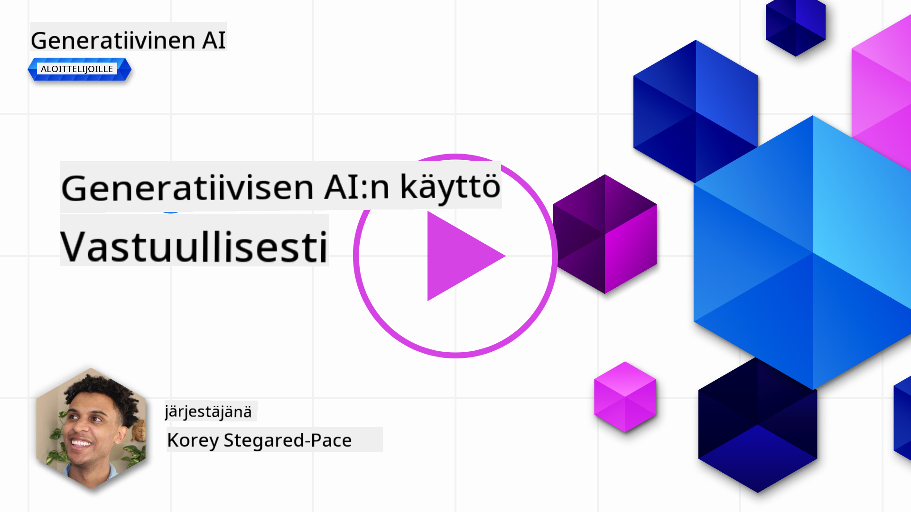
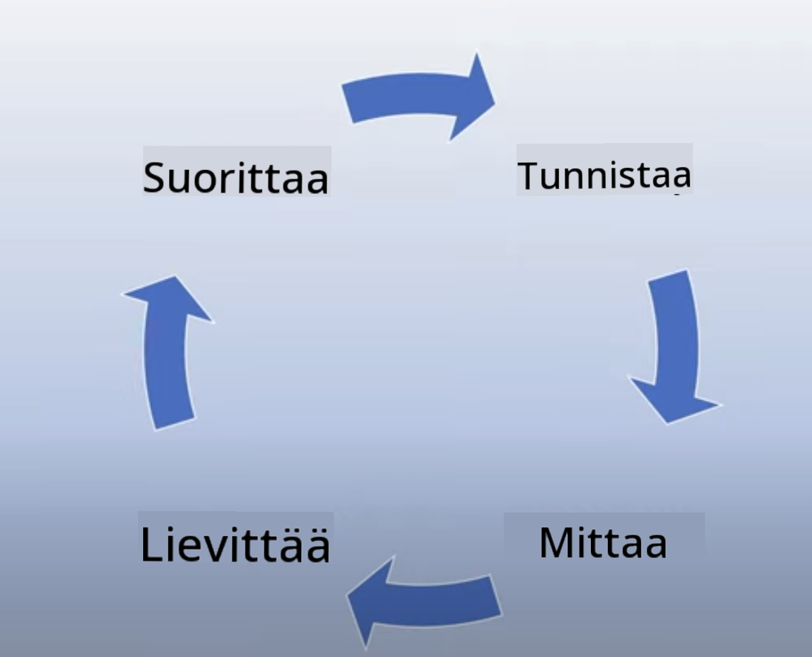
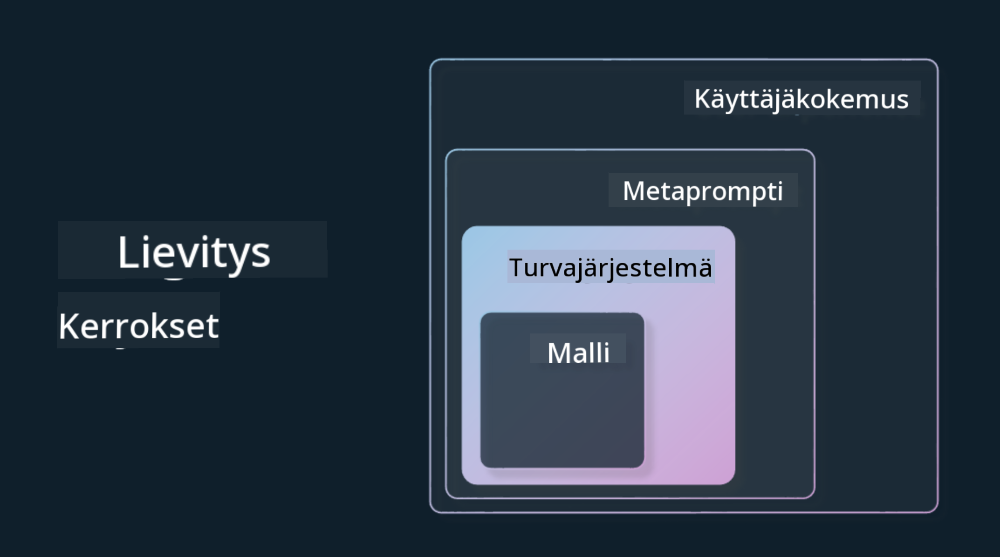

<!--
CO_OP_TRANSLATOR_METADATA:
{
  "original_hash": "7f8f4c11f8c1cb6e1794442dead414ea",
  "translation_date": "2025-07-09T08:58:23+00:00",
  "source_file": "03-using-generative-ai-responsibly/README.md",
  "language_code": "fi"
}
-->
# Generatiivisen tekoälyn vastuullinen käyttö

> _Klikkaa yllä olevaa kuvaa nähdäksesi tämän oppitunnin videon_

On helppo innostua tekoälystä, erityisesti generatiivisesta tekoälystä, mutta on tärkeää pohtia, miten käyttää sitä vastuullisesti. Täytyy miettiä esimerkiksi, miten varmistaa, että tulokset ovat oikeudenmukaisia, haitattomia ja muuta vastaavaa. Tässä luvussa annetaan tarvittava tausta, mitä ottaa huomioon ja miten ryhtyä aktiivisiin toimiin tekoälyn käytön parantamiseksi.

## Johdanto

Tässä oppitunnissa käsitellään:

- Miksi vastuullinen tekoäly tulisi asettaa etusijalle generatiivisia tekoälysovelluksia rakennettaessa.
- Vastuullisen tekoälyn keskeiset periaatteet ja niiden yhteys generatiiviseen tekoälyyn.
- Miten soveltaa näitä vastuullisen tekoälyn periaatteita käytännössä strategian ja työkalujen avulla.

## Oppimistavoitteet

Oppitunnin suorittamisen jälkeen osaat:

- Ymmärtää vastuullisen tekoälyn merkityksen generatiivisia tekoälysovelluksia rakennettaessa.
- Tietää, milloin ja miten soveltaa vastuullisen tekoälyn keskeisiä periaatteita generatiivisia tekoälysovelluksia rakentaessa.
- Tunnistaa käytettävissä olevat työkalut ja strategiat vastuullisen tekoälyn periaatteiden toteuttamiseksi.

## Vastuullisen tekoälyn periaatteet

Generatiivisen tekoälyn innostus on korkeimmillaan. Tämä innostus on tuonut alalle paljon uusia kehittäjiä, huomiota ja rahoitusta. Vaikka tämä on erittäin positiivista kaikille, jotka haluavat rakentaa tuotteita ja yrityksiä generatiivisen tekoälyn avulla, on myös tärkeää edetä vastuullisesti.

Tämän kurssin aikana keskitymme startupimme ja tekoälykoulutustuotteemme rakentamiseen. Käytämme vastuullisen tekoälyn periaatteita: oikeudenmukaisuus, osallisuus, luotettavuus/turvallisuus, tietoturva ja yksityisyys, läpinäkyvyys sekä vastuullisuus. Näiden periaatteiden avulla tarkastelemme, miten ne liittyvät generatiivisen tekoälyn käyttöön tuotteissamme.

## Miksi vastuullinen tekoäly tulisi asettaa etusijalle

Tuotetta rakentaessa ihmiskeskeinen lähestymistapa, jossa käyttäjän etu pidetään mielessä, johtaa parhaisiin tuloksiin.

Generatiivisen tekoälyn ainutlaatuisuus on sen kyvyssä luoda hyödyllisiä vastauksia, tietoa, ohjeita ja sisältöä käyttäjille. Tämä onnistuu ilman monia manuaalisia vaiheita, mikä voi johtaa vaikuttaviin tuloksiin. Ilman asianmukaista suunnittelua ja strategioita se voi valitettavasti johtaa haitallisiin seurauksiin käyttäjille, tuotteelle ja yhteiskunnalle kokonaisuutena.

Katsotaanpa joitakin (mutta ei kaikkia) näistä mahdollisista haitallisista seurauksista:

### Hallusinaatiot

Hallusinaatiot tarkoittavat tilannetta, jossa LLM tuottaa sisältöä, joka on joko täysin järjetöntä tai tiedetään olevan faktuaalisesti väärää muiden tietolähteiden perusteella.

Esimerkiksi rakennamme startupille ominaisuuden, joka antaa opiskelijoiden esittää historiallisia kysymyksiä mallille. Opiskelija kysyy: `Kuka oli Titanic-laivan ainoa selviytyjä?`

Malli tuottaa vastauksen, kuten alla:

> _(Lähde: [Flying bisons](https://flyingbisons.com?WT.mc_id=academic-105485-koreyst))_

Tämä on hyvin itsevarma ja perusteellinen vastaus. Valitettavasti se on väärä. Vähäiselläkin tutkimuksella huomataan, että Titanic-onnettomuudesta selviytyi useampi henkilö. Opiskelijalle, joka vasta aloittaa aiheen tutkimisen, vastaus voi olla tarpeeksi vakuuttava, ettei sitä kyseenalaisteta ja se otetaan faktana. Tämä voi johtaa siihen, että tekoälyjärjestelmästä tulee epäluotettava ja se vaikuttaa negatiivisesti startupimme maineeseen.

Jokaisen LLM:n päivityksen myötä olemme nähneet parannuksia hallusinaatioiden vähentämisessä. Vaikka parannuksia on tullut, meidän sovelluskehittäjinä ja käyttäjinä on silti tärkeää olla tietoisia näistä rajoituksista.

### Haitallinen sisältö

Edellisessä osiossa käsittelimme tilanteita, joissa LLM tuottaa virheellisiä tai järjettömiä vastauksia. Toinen riski on, että malli vastaa haitallisella sisällöllä.

Haitallinen sisältö voidaan määritellä seuraavasti:

- Ohjeiden antaminen tai kannustaminen itsetuhoon tai vahingoittamaan tiettyjä ryhmiä.
- Vihamielinen tai halventava sisältö.
- Ohjeiden antaminen hyökkäysten tai väkivaltaisten tekojen suunnitteluun.
- Ohjeiden antaminen laittoman sisällön löytämiseen tai laittomien tekojen tekemiseen.
- Seksuaalisesti eksplisiittisen sisällön näyttäminen.

Startupimme haluaa varmistaa, että meillä on oikeat työkalut ja strategiat estämään tämän tyyppisen sisällön pääsy opiskelijoiden nähtäväksi.

### Oikeudenmukaisuuden puute

Oikeudenmukaisuus tarkoittaa sitä, että tekoälyjärjestelmä on vapaa ennakkoluuloista ja syrjinnästä ja että se kohtelee kaikkia reilusti ja tasapuolisesti. Generatiivisen tekoälyn maailmassa haluamme varmistaa, ettei mallin tuottama sisältö vahvista syrjiviä maailmankuvia marginaaliryhmistä.

Tällaiset tulokset eivät ainoastaan tuhoa positiivisten käyttäjäkokemusten rakentamista, vaan ne aiheuttavat myös yhteiskunnallista haittaa. Sovelluskehittäjinä meidän tulisi aina pitää mielessä laaja ja monimuotoinen käyttäjäkunta generatiivista tekoälyä hyödyntäviä ratkaisuja rakentaessamme.

## Miten käyttää generatiivista tekoälyä vastuullisesti

Nyt kun olemme tunnistaneet vastuullisen generatiivisen tekoälyn merkityksen, katsotaan neljä askelta, joilla voimme rakentaa tekoälyratkaisumme vastuullisesti:

### Mittaa mahdolliset haitat

Ohjelmistotestauksessa testaamme käyttäjän odotettuja toimintoja sovelluksessa. Samoin on hyvä testata monipuolinen joukko kehotteita, joita käyttäjät todennäköisesti käyttävät, jotta voidaan arvioida mahdollisia haittoja.

Koska startupimme rakentaa koulutustuotetta, olisi hyvä valmistella lista koulutukseen liittyvistä kehotteista. Näitä voisivat olla esimerkiksi tietyn aiheen, historiallisten faktojen tai opiskelijaelämään liittyvät kysymykset.

### Vähennä mahdollisia haittoja

Nyt on aika löytää keinoja, joilla voimme estää tai rajoittaa mallin ja sen vastausten mahdollisesti aiheuttamia haittoja. Voimme tarkastella tätä neljällä eri tasolla:

- **Malli**. Valitaan oikea malli oikeaan käyttötarkoitukseen. Suuremmat ja monimutkaisemmat mallit, kuten GPT-4, voivat aiheuttaa suuremman riskin haitallisesta sisällöstä, kun niitä sovelletaan pienempiin ja tarkempiin käyttötapauksiin. Koulutusdatan käyttäminen hienosäätöön vähentää myös haitallisen sisällön riskiä.

- **Turvajärjestelmä**. Turvajärjestelmä on joukko työkaluja ja asetuksia mallia palvelevalla alustalla, jotka auttavat haittojen vähentämisessä. Esimerkkinä tästä on sisällön suodatusjärjestelmä Azure OpenAI -palvelussa. Järjestelmien tulisi myös havaita jailbreak-hyökkäykset ja ei-toivottu toiminta, kuten bottien tekemät pyynnöt.

- **Metakehote**. Metakehotteet ja grounding ovat tapoja ohjata tai rajoittaa mallia tiettyjen käyttäytymisten ja tietojen perusteella. Tämä voi tarkoittaa järjestelmäsyötteiden käyttöä mallin rajojen määrittämiseen. Lisäksi voidaan tuottaa vastauksia, jotka ovat paremmin linjassa järjestelmän laajuuden tai toimialan kanssa.

Voidaan myös käyttää tekniikoita kuten Retrieval Augmented Generation (RAG), jolloin malli hakee tietoa vain valikoiduista luotettavista lähteistä. Tästä on myöhemmin kurssilla oppitunti [hakusovellusten rakentamisesta](../08-building-search-applications/README.md?WT.mc_id=academic-105485-koreyst).

- **Käyttäjäkokemus**. Viimeinen taso on, jossa käyttäjä on suoraan vuorovaikutuksessa mallin kanssa sovelluksemme käyttöliittymän kautta. Tällä tavalla voimme suunnitella käyttöliittymän rajoittamaan käyttäjän syötteitä, joita he voivat lähettää mallille, sekä tekstiä tai kuvia, joita käyttäjälle näytetään. Kun otamme tekoälysovelluksen käyttöön, meidän on myös oltava läpinäkyviä siitä, mitä generatiivinen tekoälysovelluksemme voi ja ei voi tehdä.

Meillä on kokonainen oppitunti omistettuna [tekoälysovellusten UX-suunnittelulle](../12-designing-ux-for-ai-applications/README.md?WT.mc_id=academic-105485-koreyst).

- **Mallin arviointi**. LLM:ien kanssa työskentely voi olla haastavaa, koska meillä ei aina ole kontrollia mallin koulutusdataan. Siitä huolimatta meidän tulisi aina arvioida mallin suorituskykyä ja tuotoksia. On tärkeää mitata mallin tarkkuutta, samankaltaisuutta, groundednessia ja tuotoksen relevanssia. Tämä auttaa tarjoamaan läpinäkyvyyttä ja luottamusta sidosryhmille ja käyttäjille.

### Toimita vastuullinen generatiivinen tekoälyratkaisu

Toiminnallisen käytännön rakentaminen tekoälysovellusten ympärille on viimeinen vaihe. Tämä sisältää yhteistyön startupimme muiden osastojen, kuten lakiosaston ja tietoturvan kanssa, varmistaaksemme, että noudatamme kaikkia sääntelyvaatimuksia. Ennen julkaisua haluamme myös laatia suunnitelmat toimituksesta, poikkeustilanteiden käsittelystä ja palautuksista, jotta voimme estää haittojen kasvamisen käyttäjille.

## Työkalut

Vaikka vastuullisten tekoälyratkaisujen kehittäminen saattaa tuntua työläältä, se on vaivan arvoista. Generatiivisen tekoälyn alue kasvaa, ja yhä useammat työkalut auttavat kehittäjiä integroimaan vastuullisuuden tehokkaasti työprosesseihinsa. Esimerkiksi [Azure AI Content Safety](https://learn.microsoft.com/azure/ai-services/content-safety/overview?WT.mc_id=academic-105485-koreyst) voi auttaa havaitsemaan haitallista sisältöä ja kuvia API-kutsun avulla.

## Tietovisa

Mistä asioista sinun tulee huolehtia varmistaaksesi vastuullisen tekoälyn käytön?

1. Että vastaus on oikea.
1. Haitallisesta käytöstä, ettei tekoälyä käytetä rikollisiin tarkoituksiin.
1. Varmistamisesta, että tekoäly on vapaa ennakkoluuloista ja syrjinnästä.

Vastaus: 2 ja 3 ovat oikein. Vastuullinen tekoäly auttaa sinua pohtimaan, miten haitallisia vaikutuksia ja ennakkoluuloja voidaan vähentää ja muuta.

## 🚀 Haaste

Lue lisää [Azure AI Content Safetystä](https://learn.microsoft.com/azure/ai-services/content-safety/overview?WT.mc_id=academic-105485-koreyst) ja katso, mitä voit ottaa käyttöön omassa käytössäsi.

## Hienoa työtä, jatka oppimista

Oppitunnin suorittamisen jälkeen tutustu [Generatiivisen tekoälyn oppimiskokoelmaamme](https://aka.ms/genai-collection?WT.mc_id=academic-105485-koreyst) ja jatka generatiivisen tekoälyn osaamisesi kehittämistä!

Siirry oppitunnille 4, jossa käsittelemme [Prompt Engineeringin perusteita](../04-prompt-engineering-fundamentals/README.md?WT.mc_id=academic-105485-koreyst)!

**Vastuuvapauslauseke**:  
Tämä asiakirja on käännetty käyttämällä tekoälypohjaista käännöspalvelua [Co-op Translator](https://github.com/Azure/co-op-translator). Vaikka pyrimme tarkkuuteen, huomioithan, että automaattikäännöksissä saattaa esiintyä virheitä tai epätarkkuuksia. Alkuperäistä asiakirjaa sen alkuperäiskielellä tulee pitää virallisena lähteenä. Tärkeissä tiedoissa suositellaan ammattimaista ihmiskäännöstä. Emme ole vastuussa tämän käännöksen käytöstä aiheutuvista väärinymmärryksistä tai tulkinnoista.