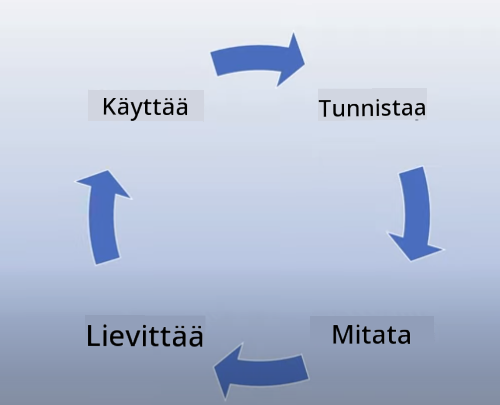

<!--
CO_OP_TRANSLATOR_METADATA:
{
  "original_hash": "13084c6321a2092841b9a081b29497ba",
  "translation_date": "2025-05-19T14:43:02+00:00",
  "source_file": "03-using-generative-ai-responsibly/README.md",
  "language_code": "fi"
}
-->
# Generatiivisen tekoälyn vastuullinen käyttö

> _Klikkaa yllä olevaa kuvaa nähdäksesi tämän oppitunnin videon_

On helppo innostua tekoälystä ja erityisesti generatiivisesta tekoälystä, mutta on tärkeää miettiä, miten sitä käytetään vastuullisesti. On otettava huomioon, miten varmistetaan, että tuotokset ovat reiluja, haitattomia ja muuta vastaavaa. Tämä luku pyrkii antamaan mainitun kontekstin, mitä huomioida ja miten ottaa aktiivisia askelia tekoälyn käytön parantamiseksi.

## Johdanto

Tämä oppitunti käsittelee:

- Miksi vastuullinen tekoäly tulisi priorisoida generatiivisia tekoälysovelluksia rakennettaessa.
- Vastuullisen tekoälyn periaatteet ja niiden suhde generatiiviseen tekoälyyn.
- Miten näitä vastuullisen tekoälyn periaatteita voidaan soveltaa käytännössä strategian ja työkalujen avulla.

## Oppimistavoitteet

Tämän oppitunnin jälkeen tiedät:

- Vastuullisen tekoälyn tärkeyden generatiivisia tekoälysovelluksia rakennettaessa.
- Milloin ajatella ja soveltaa vastuullisen tekoälyn periaatteita generatiivisia tekoälysovelluksia rakennettaessa.
- Mitä työkaluja ja strategioita on käytettävissä vastuullisen tekoälyn käsitteen soveltamiseksi.

## Vastuullisen tekoälyn periaatteet

Generatiivisen tekoälyn innostus ei ole koskaan ollut suurempi. Tämä innostus on tuonut paljon uusia kehittäjiä, huomiota ja rahoitusta tälle alalle. Vaikka tämä on erittäin positiivista kaikille, jotka haluavat rakentaa tuotteita ja yrityksiä generatiivisen tekoälyn avulla, on myös tärkeää edetä vastuullisesti.

Tämän kurssin aikana keskitymme startupimme ja tekoälyopetustuotteemme rakentamiseen. Käytämme vastuullisen tekoälyn periaatteita: Reiluus, Osallisuus, Luotettavuus/Turvallisuus, Tietoturva & Yksityisyys, Läpinäkyvyys ja Vastuuvelvollisuus. Näiden periaatteiden avulla tutkimme, miten ne liittyvät generatiivisen tekoälyn käyttöön tuotteissamme.

## Miksi sinun pitäisi priorisoida vastuullinen tekoäly

Tuotetta rakennettaessa ihmiskeskeinen lähestymistapa, jossa pidetään käyttäjän etu mielessä, johtaa parhaisiin tuloksiin.

Generatiivisen tekoälyn ainutlaatuisuus on sen kyky luoda hyödyllisiä vastauksia, tietoa, ohjeita ja sisältöä käyttäjille. Tämä voidaan tehdä ilman monia manuaalisia vaiheita, mikä voi johtaa erittäin vaikuttaviin tuloksiin. Ilman asianmukaista suunnittelua ja strategioita tämä voi valitettavasti johtaa myös haitallisiin tuloksiin käyttäjille, tuotteelle ja yhteiskunnalle kokonaisuudessaan.

Tarkastellaan joitakin (mutta ei kaikkia) näistä mahdollisesti haitallisista tuloksista:

### Harhat

Harhat ovat termi, jota käytetään kuvaamaan, kun LLM tuottaa sisältöä, joka on joko täysin järjetöntä tai jotain, jonka tiedämme olevan faktuaalisesti väärin muiden tietolähteiden perusteella.

Otetaan esimerkiksi, että rakennamme startupillemme ominaisuuden, joka sallii opiskelijoiden esittää historiallisia kysymyksiä mallille. Opiskelija kysyy kysymyksen `Who was the sole survivor of Titanic?`

Malli tuottaa vastauksen, kuten alla:

> _(Lähde: [Flying bisons](https://flyingbisons.com?WT.mc_id=academic-105485-koreyst))_

Tämä on erittäin itsevarma ja perusteellinen vastaus. Valitettavasti se on virheellinen. Jo pienellä määrällä tutkimusta huomaisi, että Titanicin katastrofista selviytyi useampi kuin yksi henkilö. Opiskelijalle, joka vasta aloittaa tämän aiheen tutkimisen, tämä vastaus voi olla tarpeeksi vakuuttava, ettei sitä kyseenalaisteta ja käsitellään faktana. Tämän seuraukset voivat johtaa tekoälyjärjestelmän epäluotettavuuteen ja vaikuttaa negatiivisesti startupimme maineeseen.

Jokaisen LLM:n iteraation myötä olemme nähneet suorituskyvyn parantumista harhojen minimoimisessa. Vaikka tämä parannus on tapahtunut, me sovellusten rakentajat ja käyttäjät meidän on edelleen oltava tietoisia näistä rajoituksista.

### Haitallinen sisältö

Käsittelimme aiemmassa osiossa, kun LLM tuottaa virheellisiä tai järjettömiä vastauksia. Toinen riski, josta meidän on oltava tietoisia, on, kun malli vastaa haitallisella sisällöllä.

Haitallinen sisältö voidaan määritellä seuraavasti:

- Antaa ohjeita tai kannustaa itsensä vahingoittamiseen tai tiettyjen ryhmien vahingoittamiseen.
- Vihamielinen tai halventava sisältö.
- Ohjeistaa minkä tahansa tyyppisen hyökkäyksen tai väkivaltaisen teon suunnittelussa.
- Antaa ohjeita laittoman sisällön löytämiseen tai laittomien tekojen tekemiseen.
- Näyttää seksuaalisesti eksplisiittistä sisältöä.

Startupillemme haluamme varmistaa, että meillä on oikeat työkalut ja strategiat käytössä estääksemme tämän tyyppisen sisällön näkymisen opiskelijoille.

### Reiluuden puute

Reiluus määritellään "varmistamaan, että tekoälyjärjestelmä on vapaa ennakkoluuloista ja syrjinnästä ja että se kohtelee kaikkia reilusti ja tasapuolisesti." Generatiivisen tekoälyn maailmassa haluamme varmistaa, että syrjäytyneiden ryhmien näkemyksiä ei vahvisteta mallin tuotoksilla.

Tämän tyyppiset tuotokset eivät ole ainoastaan tuhoisia positiivisten tuotekokemusten rakentamiselle käyttäjillemme, vaan ne aiheuttavat myös lisähaittaa yhteiskunnalle. Sovellusten rakentajina meidän tulisi aina pitää laaja ja monimuotoinen käyttäjäkunta mielessä ratkaisuja generatiivisen tekoälyn avulla rakennettaessa.

## Miten käyttää generatiivista tekoälyä vastuullisesti

Nyt kun olemme tunnistaneet vastuullisen generatiivisen tekoälyn tärkeyden, katsotaan neljä askelta, jotka voimme ottaa rakentaaksemme tekoälyratkaisumme vastuullisesti:

### Mittaa mahdolliset haitat

Ohjelmistotestauksessa testaamme käyttäjän odotettuja toimintoja sovelluksessa. Samoin käyttäjien todennäköisesti käyttämien monipuolisten kehotusten testaaminen on hyvä tapa mitata mahdollisia haittoja.

Koska startupimme rakentaa opetustuotetta, olisi hyvä valmistella lista opetukseen liittyvistä kehotuksista. Tämä voisi kattaa tietyn aiheen, historialliset faktat ja kehotukset opiskelijaelämästä.

### Vähennä mahdollisia haittoja

Nyt on aika löytää tapoja, joilla voimme estää tai rajoittaa mallin ja sen vastausten aiheuttamia mahdollisia haittoja. Voimme tarkastella tätä neljässä eri kerroksessa:

- **Malli**. Oikean mallin valitseminen oikeaan käyttötapaukseen. Suuremmat ja monimutkaisemmat mallit, kuten GPT-4, voivat aiheuttaa enemmän haitallisen sisällön riskiä, kun niitä sovelletaan pienempiin ja tarkempiin käyttötapauksiin. Koulutusaineiston käyttö hienosäätöön myös vähentää haitallisen sisällön riskiä.

- **Turvajärjestelmä**. Turvajärjestelmä on joukko työkaluja ja kokoonpanoja alustalla, joka palvelee mallia ja auttaa haittojen vähentämisessä. Esimerkkinä tästä on sisällön suodatusjärjestelmä Azure OpenAI -palvelussa. Järjestelmien tulisi myös havaita jailbreak-hyökkäykset ja ei-toivottu toiminta, kuten bottien pyynnöt.

- **Metakehote**. Metakehotteet ja pohjustus ovat tapoja, joilla voimme ohjata tai rajoittaa mallia tiettyjen käyttäytymisten ja tiedon perusteella. Tämä voisi olla järjestelmän syötteiden käyttö mallin tiettyjen rajojen määrittämiseen. Lisäksi tarjoamalla tuotoksia, jotka ovat enemmän relevantteja järjestelmän laajuudelle tai toimialalle.

Se voi myös olla tekniikoiden, kuten Retrieval Augmented Generation (RAG), käyttöä, jotta malli hakee tietoa vain valikoidusta luotettujen lähteiden joukosta. Kurssin myöhemmässä osassa on oppitunti [hakusovellusten rakentamisesta](../08-building-search-applications/README.md?WT.mc_id=academic-105485-koreyst)

- **Käyttäjäkokemus**. Viimeinen kerros on se, jossa käyttäjä on suorassa vuorovaikutuksessa mallin kanssa sovelluksemme käyttöliittymän kautta jollain tavalla. Näin voimme suunnitella käyttöliittymän/käyttökokemuksen rajoittaaksemme käyttäjää mallille lähetettävien syötteiden tyypeissä sekä käyttäjälle näytettävässä tekstissä tai kuvissa. Kun tekoälysovellus otetaan käyttöön, meidän on myös oltava läpinäkyviä siitä, mitä generatiivinen tekoälysovelluksemme voi ja ei voi tehdä.

Meillä on kokonainen oppitunti omistettu [tekoälysovellusten käyttöliittymän suunnittelulle](../12-designing-ux-for-ai-applications/README.md?WT.mc_id=academic-105485-koreyst)

- **Arvioi malli**. Työskentely LLM:ien kanssa voi olla haastavaa, koska meillä ei aina ole kontrollia datasta, johon malli on koulutettu. Siitä huolimatta meidän tulisi aina arvioida mallin suorituskykyä ja tuotoksia. On edelleen tärkeää mitata mallin tarkkuutta, samankaltaisuutta, pohjustusta ja tuotoksen relevanssia. Tämä auttaa tarjoamaan läpinäkyvyyttä ja luottamusta sidosryhmille ja käyttäjille.

### Toimi vastuullisen generatiivisen tekoälyratkaisun kanssa

Tekoälysovellusten ympärille operatiivisen käytännön rakentaminen on viimeinen vaihe. Tämä sisältää yhteistyön muiden startupimme osien, kuten lakiosaston ja tietoturvan, kanssa varmistaaksemme, että olemme kaikkien sääntelypolitiikkojen mukaisia. Ennen lanseerausta haluamme myös rakentaa suunnitelmia toimituksen, ongelmien käsittelyn ja peruutuksen ympärille estääksemme käyttäjillemme aiheutuvan haitan kasvamisen.

## Työkalut

Vaikka vastuullisten tekoälyratkaisujen kehittäminen saattaa vaikuttaa paljon työltä, se on työ, joka on vaivan arvoista. Generatiivisen tekoälyn alueen kasvaessa yhä enemmän työkaluja, jotka auttavat kehittäjiä tehokkaasti integroimaan vastuullisuutta työnkulkuihinsa, kehittyy. Esimerkiksi [Azure AI Content Safety](https://learn.microsoft.com/azure/ai-services/content-safety/overview?WT.mc_id=academic-105485-koreyst) voi auttaa havaitsemaan haitallista sisältöä ja kuvia API-pyynnön kautta.

## Tietotesti

Mitä asioita sinun tulee huomioida varmistaaksesi tekoälyn vastuullisen käytön?

1. Että vastaus on oikein.
1. Haitallinen käyttö, ettei tekoälyä käytetä rikollisiin tarkoituksiin.
1. Varmistaminen, että tekoäly on vapaa ennakkoluuloista ja syrjinnästä.

V: 2 ja 3 ovat oikein. Vastuullinen tekoäly auttaa sinua pohtimaan, miten haitallisia vaikutuksia ja ennakkoluuloja voidaan vähentää ja muuta.

## 🚀 Haaste

Lue [Azure AI Content Safety](https://learn.microsoft.com/azure/ai-services/content-safety/overview?WT.mc_id=academic-105485-koreyst) ja katso, mitä voit omaksua omaan käyttöön.

## Hienoa työtä, jatka oppimistasi

Tämän oppitunnin jälkeen tutustu [Generatiivisen tekoälyn oppimiskokoelmaamme](https://aka.ms/genai-collection?WT.mc_id=academic-105485-koreyst) jatkaaksesi generatiivisen tekoälyn tietämyksesi kehittämistä!

Siirry oppituntiin 4, jossa käsitellään [kehotetekniikan perusteita](../04-prompt-engineering-fundamentals/README.md?WT.mc_id=academic-105485-koreyst)!

**Vastuuvapauslauseke**:  
Tämä asiakirja on käännetty käyttämällä AI-käännöspalvelua [Co-op Translator](https://github.com/Azure/co-op-translator). Vaikka pyrimme tarkkuuteen, ole hyvä ja huomioi, että automaattiset käännökset saattavat sisältää virheitä tai epätarkkuuksia. Alkuperäistä asiakirjaa sen alkuperäisellä kielellä tulisi pitää auktoritatiivisena lähteenä. Tärkeää tietoa varten suositellaan ammattimaista ihmiskäännöstä. Emme ole vastuussa mahdollisista väärinkäsityksistä tai virhetulkinnoista, jotka johtuvat tämän käännöksen käytöstä.