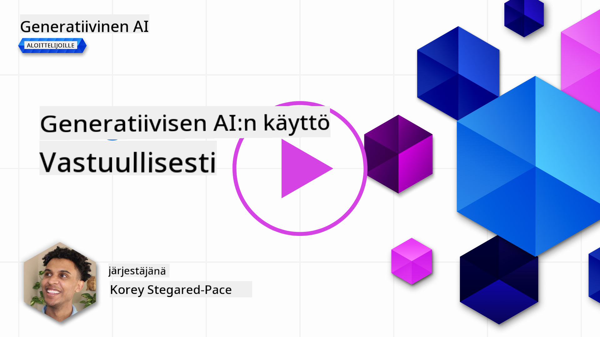
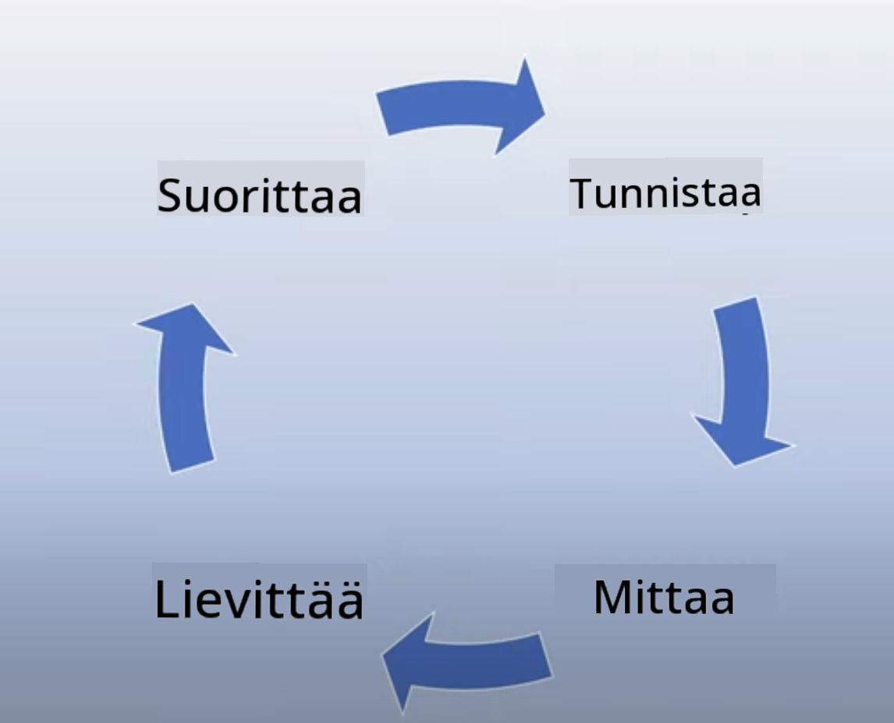
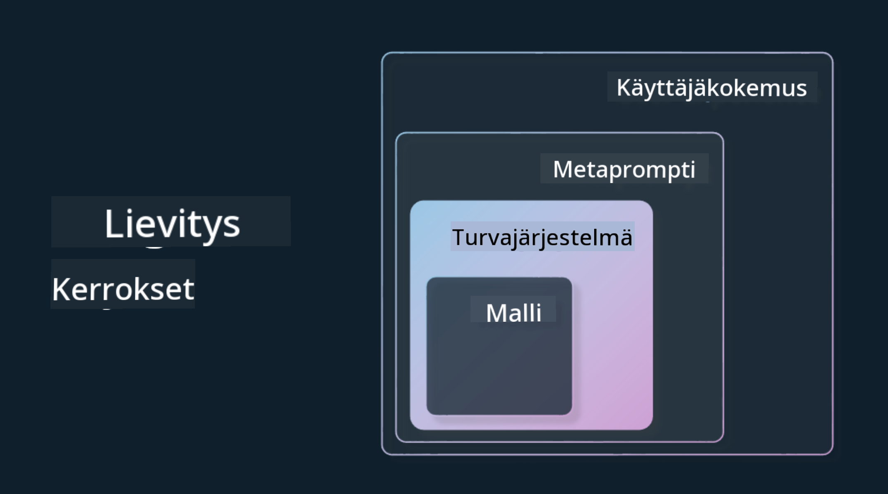

<!--
CO_OP_TRANSLATOR_METADATA:
{
  "original_hash": "13084c6321a2092841b9a081b29497ba",
  "translation_date": "2025-06-25T11:26:18+00:00",
  "source_file": "03-using-generative-ai-responsibly/README.md",
  "language_code": "fi"
}
-->
# Generatiivisen tekoälyn vastuullinen käyttö

> _Klikkaa yllä olevaa kuvaa nähdäksesi tämän oppitunnin videon_

On helppo innostua tekoälystä ja erityisesti generatiivisesta tekoälystä, mutta on tärkeää miettiä, miten käyttää sitä vastuullisesti. On otettava huomioon esimerkiksi, miten varmistaa, että tulokset ovat oikeudenmukaisia, vaarattomia ja muuta. Tämä luku pyrkii tarjoamaan sinulle mainitun kontekstin, mitä huomioida ja miten ottaa aktiivisia askelia tekoälyn käytön parantamiseksi.

## Johdanto

Tämä oppitunti käsittelee:

- Miksi vastuullinen tekoäly tulisi asettaa etusijalle generatiivisia tekoälysovelluksia rakennettaessa.
- Vastuullisen tekoälyn perusperiaatteet ja niiden suhde generatiiviseen tekoälyyn.
- Miten soveltaa näitä vastuullisen tekoälyn periaatteita strategian ja työkalujen avulla.

## Oppimistavoitteet

Tämän oppitunnin jälkeen tiedät:

- Vastuullisen tekoälyn merkityksen generatiivisia tekoälysovelluksia rakennettaessa.
- Milloin ajatella ja soveltaa vastuullisen tekoälyn perusperiaatteita generatiivisia tekoälysovelluksia rakennettaessa.
- Mitä työkaluja ja strategioita on käytettävissä vastuullisen tekoälyn konseptin toteuttamiseksi.

## Vastuullisen tekoälyn periaatteet

Generatiivisen tekoälyn innostus ei ole koskaan ollut korkeampi. Tämä innostus on tuonut paljon uusia kehittäjiä, huomiota ja rahoitusta tälle alalle. Vaikka tämä on erittäin positiivista kaikille, jotka haluavat rakentaa tuotteita ja yrityksiä generatiivisen tekoälyn avulla, on myös tärkeää edetä vastuullisesti.

Tämän kurssin aikana keskitymme startupimme ja tekoälykasvatusproduktimme rakentamiseen. Käytämme vastuullisen tekoälyn periaatteita: oikeudenmukaisuus, osallistavuus, luotettavuus/turvallisuus, tietosuoja ja yksityisyys, läpinäkyvyys ja vastuullisuus. Näiden periaatteiden avulla tutkimme, miten ne liittyvät generatiivisen tekoälyn käyttöömme tuotteissamme.

## Miksi sinun tulisi priorisoida vastuullinen tekoäly

Kun rakennat tuotetta, ihmiskeskeisen lähestymistavan ottaminen ja käyttäjän etujen pitäminen mielessä johtaa parhaisiin tuloksiin.

Generatiivisen tekoälyn ainutlaatuisuus on sen kyvyssä luoda hyödyllisiä vastauksia, tietoa, ohjeita ja sisältöä käyttäjille. Tämä voidaan tehdä ilman monia manuaalisia vaiheita, mikä voi johtaa erittäin vaikuttaviin tuloksiin. Ilman asianmukaista suunnittelua ja strategioita tämä voi kuitenkin valitettavasti johtaa haitallisiin tuloksiin käyttäjillesi, tuotteellesi ja yhteiskunnalle kokonaisuudessaan.

Tarkastellaan joitain (mutta ei kaikkia) näistä mahdollisesti haitallisista tuloksista:

### Hallusinaatiot

Hallusinaatiot on termi, jota käytetään kuvaamaan, kun LLM tuottaa sisältöä, joka on joko täysin järjetöntä tai jotain, jonka tiedämme olevan faktuaalisesti väärin muiden tietolähteiden perusteella.

Otetaan esimerkiksi, että rakennamme startupillemme ominaisuuden, jonka avulla opiskelijat voivat esittää historiallisia kysymyksiä mallille. Opiskelija kysyy kysymyksen `Who was the sole survivor of Titanic?`

Malli tuottaa vastauksen, kuten alla oleva:

> _(Lähde: [Flying bisons](https://flyingbisons.com?WT.mc_id=academic-105485-koreyst))_

Tämä on erittäin itsevarma ja perusteellinen vastaus. Valitettavasti se on virheellinen. Jo pienellä määrällä tutkimusta huomaisi, että Titanicin onnettomuudesta selvisi useampi kuin yksi henkilö. Opiskelijalle, joka vasta aloittaa aiheen tutkimisen, tämä vastaus voi olla riittävän vakuuttava, ettei sitä kyseenalaisteta ja se käsitellään faktana. Tämän seuraukset voivat johtaa siihen, että tekoälyjärjestelmä on epäluotettava ja vaikuttaa negatiivisesti startupimme maineeseen.

Jokaisella LLM:n iteraatiolla olemme nähneet suorituskyvyn parantuvan hallusinaatioiden minimoinnissa. Vaikka tämä parannus on tapahtunut, meidän sovellusten rakentajina ja käyttäjinä on silti oltava tietoisia näistä rajoituksista.

### Haitallinen sisältö

Käsittelimme aiemmassa osiossa, kun LLM tuottaa virheellisiä tai järjettömiä vastauksia. Toinen riski, josta meidän on oltava tietoisia, on, kun malli vastaa haitallisella sisällöllä.

Haitallinen sisältö voidaan määritellä seuraavasti:

- Ohjeiden antaminen tai kannustaminen itsensä vahingoittamiseen tai tiettyjen ryhmien vahingoittamiseen.
- Vihamielinen tai alentava sisältö.
- Suunnittelun ohjaaminen mihin tahansa hyökkäykseen tai väkivaltaisiin tekoihin.
- Ohjeiden antaminen laittoman sisällön löytämiseen tai laittomien tekojen tekemiseen.
- Seksuaalisesti eksplisiittisen sisällön näyttäminen.

Startupimme osalta haluamme varmistaa, että meillä on oikeat työkalut ja strategiat estääksemme tämän tyyppisen sisällön pääsyn opiskelijoiden nähtäville.

### Oikeudenmukaisuuden puute

Oikeudenmukaisuus määritellään "varmistamalla, että tekoälyjärjestelmä on vapaa ennakkoluuloista ja syrjinnästä ja että se kohtelee kaikkia oikeudenmukaisesti ja tasapuolisesti." Generatiivisen tekoälyn maailmassa haluamme varmistaa, että mallin tuotos ei vahvista syrjäytyneiden ryhmien poissulkevia maailmankatsomuksia.

Tämän tyyppiset tuotokset eivät ole ainoastaan tuhoisia rakentamaan positiivisia tuotekokemuksia käyttäjillemme, vaan ne aiheuttavat myös lisää yhteiskunnallista haittaa. Sovellusten rakentajina meidän tulisi aina pitää mielessä laaja ja monipuolinen käyttäjäkunta, kun rakennamme ratkaisuja generatiivisella tekoälyllä.

## Miten käyttää generatiivista tekoälyä vastuullisesti

Nyt kun olemme tunnistaneet vastuullisen generatiivisen tekoälyn merkityksen, katsotaan neljää askelta, joita voimme ottaa rakentaaksemme tekoälyratkaisumme vastuullisesti:

### Mittaa mahdolliset haitat

Ohjelmistotestauksessa testaamme käyttäjän odotettuja toimia sovelluksessa. Vastaavasti monipuolisen käyttäjien todennäköisesti käyttämien kehotteiden testaaminen on hyvä tapa mitata mahdollisia haittoja.

Koska startupimme rakentaa koulutustuotetta, olisi hyvä valmistella lista koulutukseen liittyvistä kehotteista. Tämä voisi kattaa tietyn aiheen, historialliset faktat ja kehotteet opiskelijaelämästä.

### Vähennä mahdollisia haittoja

On aika löytää keinoja, joilla voimme estää tai rajoittaa mallin ja sen vastausten aiheuttamia mahdollisia haittoja. Voimme tarkastella tätä neljällä eri tasolla:

- **Malli**. Oikean mallin valitseminen oikeaan käyttötapaukseen. Suuremmat ja monimutkaisemmat mallit, kuten GPT-4, voivat aiheuttaa enemmän haitallisen sisällön riskiä, kun niitä sovelletaan pienempiin ja tarkempiin käyttötapauksiin. Koulutusdatan käyttäminen hienosäätämiseen vähentää myös haitallisen sisällön riskiä.

- **Turvajärjestelmä**. Turvajärjestelmä on joukko työkaluja ja asetuksia alustalla, joka palvelee mallia ja auttaa vähentämään haittoja. Esimerkki tästä on sisällönsuodatusjärjestelmä Azure OpenAI -palvelussa. Järjestelmien tulisi myös havaita vankilapakojen hyökkäykset ja ei-toivottu toiminta, kuten botin tekemät pyynnöt.

- **Metaprompt**. Metapromptit ja pohjustaminen ovat tapoja, joilla voimme ohjata tai rajoittaa mallia tiettyjen käyttäytymisten ja tiedon perusteella. Tämä voisi olla järjestelmän syötteiden käyttö mallin tiettyjen rajojen määrittämiseksi. Lisäksi tarjoamalla tuloksia, jotka ovat merkityksellisempiä järjestelmän laajuuden tai alan kannalta.

Se voi myös käyttää tekniikoita, kuten Retrieval Augmented Generation (RAG), jotta malli hakee tietoa vain valikoiduista luotettavista lähteistä. Tästä on myöhemmin kurssilla oppitunti [hakusovellusten rakentaminen](../08-building-search-applications/README.md?WT.mc_id=academic-105485-koreyst)

- **Käyttäjäkokemus**. Viimeinen kerros on se, missä käyttäjä on suorassa vuorovaikutuksessa mallin kanssa sovelluksemme käyttöliittymän kautta jollain tavalla. Näin voimme suunnitella UI/UX:n rajoittamaan käyttäjää lähettämästä mallille tietynlaisia syötteitä sekä tekstiä tai kuvia, jotka näytetään käyttäjälle. Kun otamme tekoälysovelluksen käyttöön, meidän on myös oltava läpinäkyviä siitä, mitä generatiivinen tekoälysovelluksemme voi ja ei voi tehdä.

Meillä on kokonainen oppitunti omistettu [tekoälysovellusten UX:n suunnittelulle](../12-designing-ux-for-ai-applications/README.md?WT.mc_id=academic-105485-koreyst)

- **Arvioi malli**. LLM:ien kanssa työskentely voi olla haastavaa, koska meillä ei aina ole kontrollia mallin koulutukseen käytettyyn dataan. Tästä huolimatta meidän tulisi aina arvioida mallin suorituskykyä ja tuloksia. On edelleen tärkeää mitata mallin tarkkuutta, samankaltaisuutta, perusteltavuutta ja tulosten merkityksellisyyttä. Tämä auttaa tarjoamaan läpinäkyvyyttä ja luottamusta sidosryhmille ja käyttäjille.

### Toimi vastuullisena generatiivisena tekoälyratkaisuna

Operatiivisen käytännön rakentaminen tekoälysovellustesi ympärille on viimeinen vaihe. Tämä sisältää yhteistyön muiden startupimme osien, kuten juridisen ja turvallisuuden kanssa, varmistaaksemme, että noudatamme kaikkia sääntelykäytäntöjä. Ennen lanseerausta haluamme myös rakentaa suunnitelmia toimituksen, tapausten käsittelyn ja palautuksen ympärille estääksemme käyttäjiemme vahingoittumisen kasvamisen.

## Työkalut

Vaikka vastuullisten tekoälyratkaisujen kehittäminen voi tuntua paljolta työltä, se on vaivan arvoista. Generatiivisen tekoälyn alueen kasvaessa yhä enemmän työkaluja, jotka auttavat kehittäjiä integroimaan vastuullisuutta tehokkaasti työnkulkuihinsa, kypsyy. Esimerkiksi [Azure AI Content Safety](https://learn.microsoft.com/azure/ai-services/content-safety/overview?WT.mc_id=academic-105485-koreyst) voi auttaa havaitsemaan haitallista sisältöä ja kuvia API-pyynnön avulla.

## Tietojen tarkistus

Mitä asioita sinun tulee huomioida varmistaaksesi vastuullisen tekoälyn käytön?

1. Että vastaus on oikein.
2. Haitallinen käyttö, ettei tekoälyä käytetä rikollisiin tarkoituksiin.
3. Varmistetaan, että tekoäly on vapaa ennakkoluuloista ja syrjinnästä.

V: 2 ja 3 ovat oikein. Vastuullinen tekoäly auttaa sinua miettimään, miten vähentää haitallisia vaikutuksia ja ennakkoluuloja ja paljon muuta.

## 🚀 Haaste

Lue [Azure AI Content Safety](https://learn.microsoft.com/azure/ai-services/content-safety/overview?WT.mc_id=academic-105485-koreyst) ja katso, mitä voit ottaa käyttöön omassa käytössäsi.

## Hienoa työtä, jatka oppimista

Tämän oppitunnin jälkeen tutustu [Generatiivisen tekoälyn oppimiskokoelmaamme](https://aka.ms/genai-collection?WT.mc_id=academic-105485-koreyst) jatkaaksesi generatiivisen tekoälyn tietämyksesi kehittämistä!

Siirry oppituntiin 4, jossa käsittelemme [Kehotesuunnittelun perusteet](../04-prompt-engineering-fundamentals/README.md?WT.mc_id=academic-105485-koreyst)!

**Vastuuvapauslauseke**:  
Tämä asiakirja on käännetty käyttämällä tekoälypohjaista käännöspalvelua [Co-op Translator](https://github.com/Azure/co-op-translator). Pyrimme tarkkuuteen, mutta huomioithan, että automaattiset käännökset voivat sisältää virheitä tai epätarkkuuksia. Alkuperäistä asiakirjaa sen alkuperäisellä kielellä tulisi pitää auktoriteettina. Kriittisen tiedon osalta suositellaan ammattimaista ihmiskäännöstä. Emme ole vastuussa tämän käännöksen käytöstä johtuvista väärinkäsityksistä tai virhetulkinnoista.