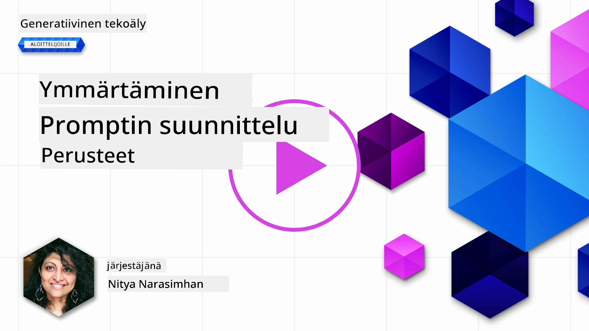
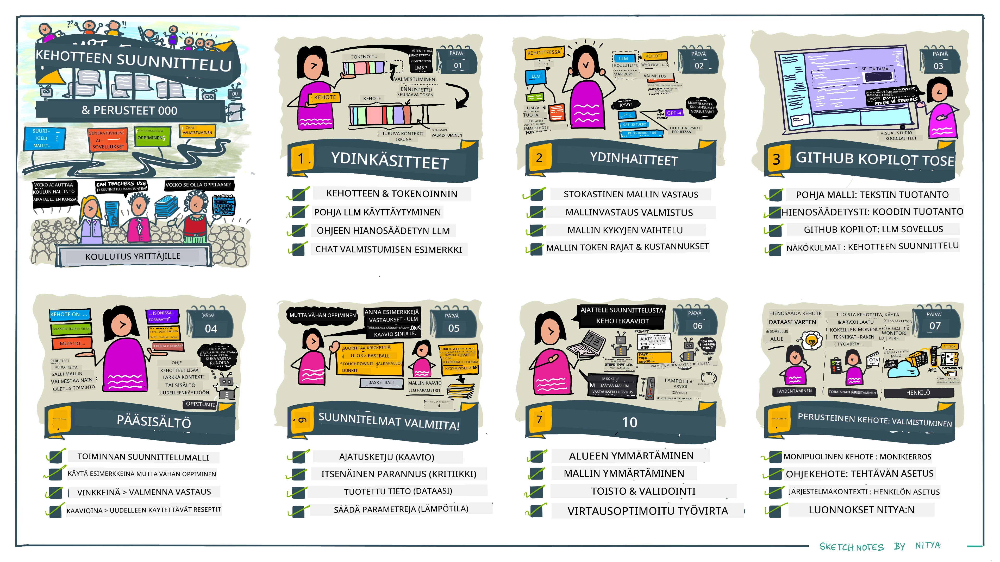
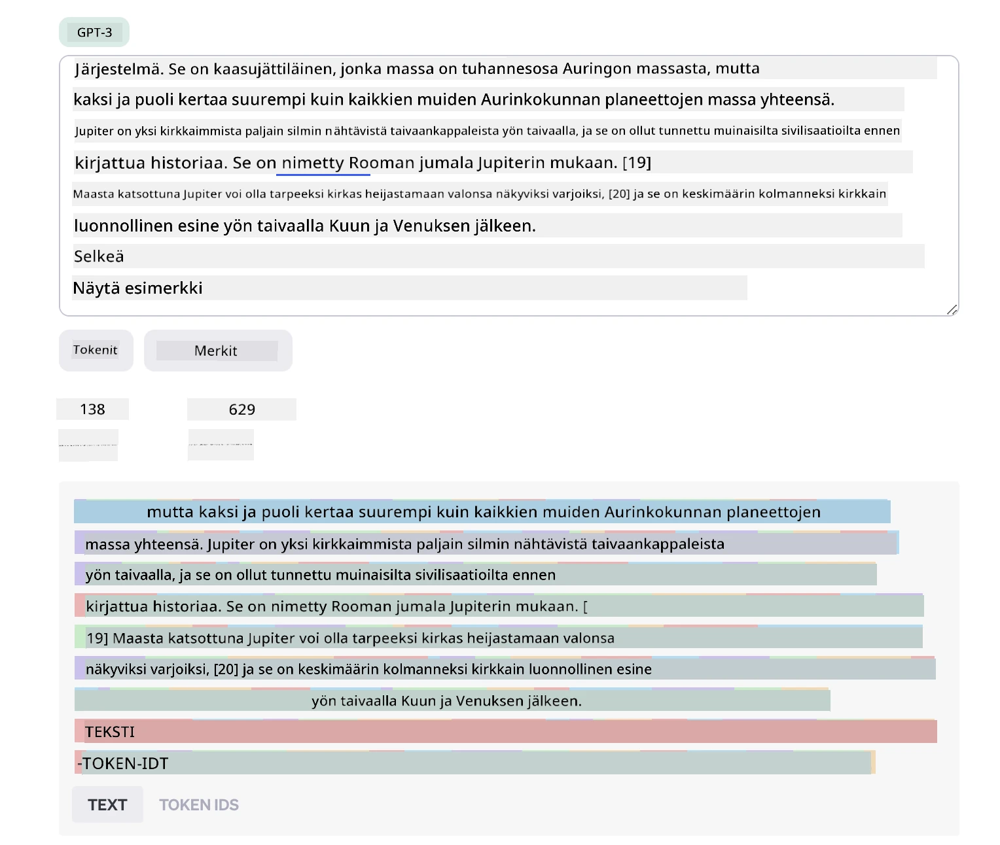
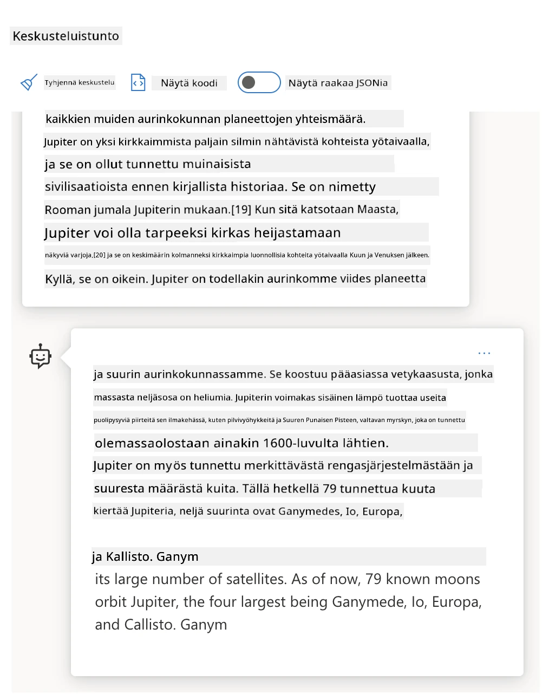
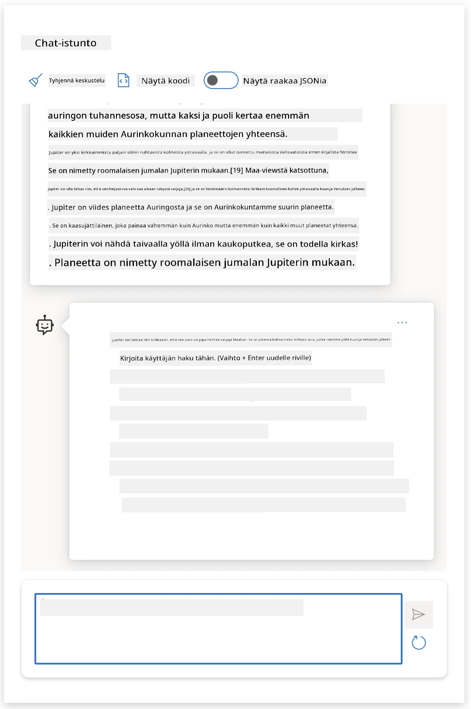
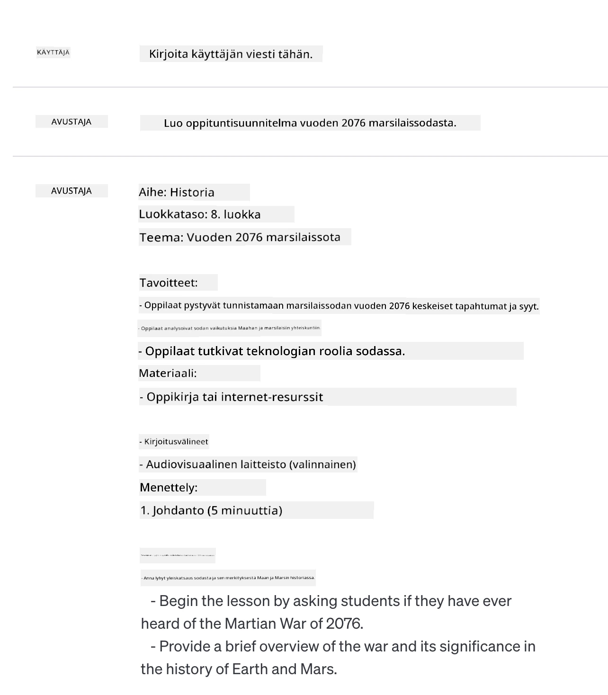
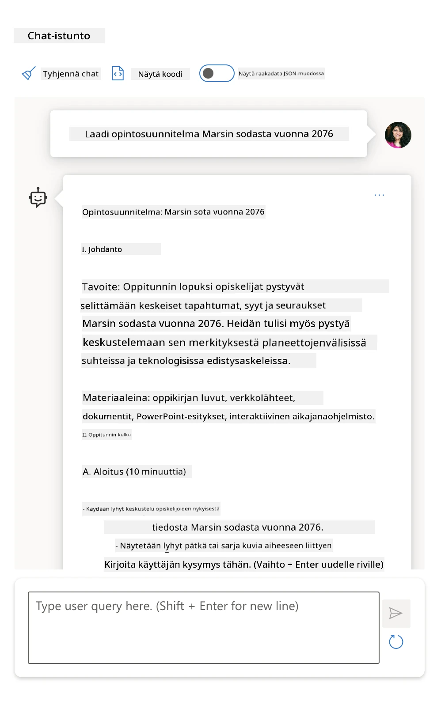
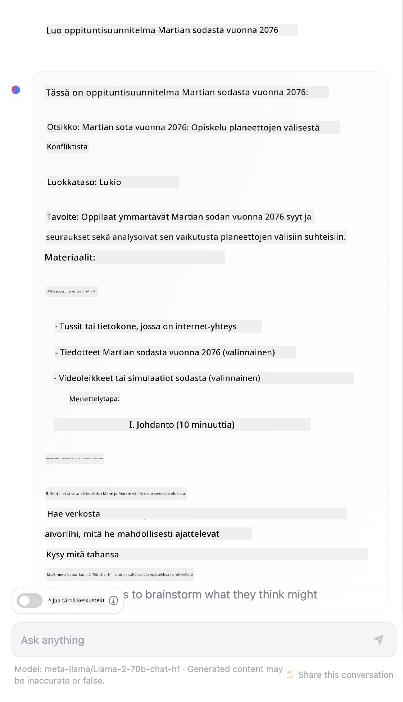

# Promptin suunnittelun perusteet

[](https://youtu.be/GElCu2kUlRs?si=qrXsBvXnCW12epb8)

## Johdanto
Tässä moduulissa käsitellään olennaisia käsitteitä ja tekniikoita tehokkaiden promptien luomiseksi generatiivisissa tekoälymalleissa. Tapa, jolla kirjoitat promptin LLM:lle, on myös tärkeä. Huolellisesti laadittu prompti voi saada aikaan laadukkaamman vastauksen. Mutta mitä tarkalleen termit _prompt_ ja _promptin suunnittelu_ tarkoittavat? Ja miten parannan promptin _syötettä_, jonka lähetän LLM:lle? Näihin kysymyksiin pyrimme vastaamaan tässä ja seuraavassa luvussa.

_Generatiivinen tekoäly_ pystyy luomaan uutta sisältöä (esim. tekstiä, kuvia, ääntä, koodia jne.) käyttäjän pyyntöjen perusteella. Se saavuttaa tämän käyttämällä _suuria kielimalleja_ kuten OpenAI:n GPT ("Generative Pre-trained Transformer") -sarjaa, jotka on koulutettu käyttämään luonnollista kieltä ja koodia.

Käyttäjät voivat nyt olla vuorovaikutuksessa näiden mallien kanssa tutun kaltaisilla paradigmailla kuten chat, ilman teknistä osaamista tai koulutusta. Mallit ovat _prompt-pohjaisia_ – käyttäjät lähettävät tekstisyötteen (promptin) ja saavat takaisin tekoälyn vastauksen (täydennyksen). He voivat sitten "keskustella tekoälyn kanssa" iteratiivisesti, monikertaisissa vuorovaikutuksissa, hiomalla promptiaan, kunnes vastaus vastaa heidän odotuksiaan.

"Promptit" muodostavat nyt generatiivisten tekoälysovellusten ensisijaisen _ohjelmointirajapinnan_, joka kertoo malleille, mitä tehdä, ja vaikuttaa palautettujen vastausten laatuun. "Promptin suunnittelu" on nopeasti kasvava tutkimusala, joka keskittyy promptien _suunnitteluun ja optimointiin_ tuottaakseen johdonmukaisia ja laadukkaita vastauksia suurissa määrin.

## Oppimistavoitteet

Tässä oppitunnissa opimme, mitä promptin suunnittelu on, miksi se on tärkeää ja miten voimme luoda tehokkaampia promptteja tietylle mallille ja sovellustavoitteelle. Ymmärrämme promptin suunnittelun keskeiset käsitteet ja parhaat käytännöt – sekä tutustumme interaktiiviseen Jupyter Notebook - "hiekkalaatikko"-ympäristöön, jossa voimme nähdä nämä käsitteet sovellettuna käytännön esimerkkeihin.

Oppitunnin lopussa osaat:

1. Selittää, mitä promptin suunnittelu on ja miksi se on tärkeää.
2. Kuvailla promptin osat ja niiden käyttötavat.
3. Oppia parhaat käytännöt ja tekniikat promptin suunnitteluun.
4. Soveltaa opittuja tekniikoita käytännön esimerkkeihin käyttäen OpenAI:n päätepistettä.

## Keskeiset termit

Promptin suunnittelu: Teksti-inputtien suunnittelu ja hionta, joilla ohjataan tekoälymalleja tuottamaan haluttuja tuloksia.  
Tokenisointi: Prosessi, jossa teksti muutetaan pienemmiksi yksiköiksi, ns. tokeneiksi, joita malli voi ymmärtää ja käsitellä.  
Ohjeistettu LLM (Instruction-Tuned LLM): Suuret kielimallit, jotka on hienosäädetty erityisillä ohjeilla parantamaan vastausten tarkkuutta ja merkityksellisyyttä.

## Oppimisen hiekkalaatikko

Promptin suunnittelu on tällä hetkellä enemmän taitolaji kuin tiede. Paras tapa parantaa intuitiota on _harjoitella enemmän_ ja käyttää kokeilu- ja erehdysmenetelmää, joka yhdistää sovellusalueen asiantuntemuksen suositeltuihin tekniikoihin ja mallikohtaisiin optimointeihin.

Tähän oppituntiin liittyvä Jupyter Notebook tarjoaa _hiekkalaatikko_-ympäristön, jossa voit kokeilla oppimaasi – joko matkan varrella tai lopun kooditehtävissä. Harjoitusten suorittamiseen tarvitset:

1. **Azure OpenAI API -avaimen** – palvelun päätepisteen käyttöön otettuun LLM:ään.  
2. **Python-ympäristön** – jossa Notebook voidaan suorittaa.  
3. **Paikalliset ympäristömuuttujat** – _viimeistele [ASENNUS](./../00-course-setup/02-setup-local.md?WT.mc_id=academic-105485-koreyst) -vaiheet nyt valmiiksi_.

Notebook sisältää _aloitus_ harjoituksia – mutta sinun odotetaan lisäävän omia _Markdown_ (kuvaus) ja _Code_ (prompt-pyynnöt) osioita kokeillaksesi lisää esimerkkejä tai ideoita – ja rakennat intuitiota promptin suunnitteluun.

## Kuvitettu opas

Haluatko saada kokonaiskuvan tästä oppitunnista ennen kuin sukellet syvemmälle? Tutustu tähän kuvitettuun oppaaseen, joka antaa sinistä pääaiheista ja avainkohdista mietittäväksi. Oppitunnin tiekartta johdattaa sinut keskeisten käsitteiden ja haasteiden ymmärtämisestä niiden ratkaisuihin relevanttien promptin suunnittelutekniikoiden ja parhaiden käytäntöjen avulla. Huomaa, että tässä oppaassa "Kehittyneet tekniikat" -osio viittaa tämän oppimateriaalin _seuraavan_ luvun sisältöön.



## Meidän startup

Käydään nyt läpi, miten _tämä aihe_ liittyy startup-yrityksemme missioon [tuoda tekoälyinnovaatio koulutukseen](https://educationblog.microsoft.com/2023/06/collaborating-to-bring-ai-innovation-to-education?WT.mc_id=academic-105485-koreyst). Haluamme rakentaa tekoälypohjaisia sovelluksia _persoonalliseen oppimiseen_ – joten pohditaan, miten eri sovelluksen käyttäjät voisivat "suunnitella" promptteja:

- **Ylläpitäjät** voivat pyytää tekoälyä _analysoimaan opetussuunnitelman tietoja löytääkseen aukkoja kattavuudesta_. Tekoäly voi tiivistää tulokset tai visualisoida niitä koodilla.  
- **Opettajat** voivat pyytää tekoälyä _luomaan oppituntisuunnitelman kohdeyleisölle ja aiheelle_. Tekoäly rakentaa persoonallisen suunnitelman määritellyssä muodossa.  
- **Oppilaat** voivat pyytää tekoälyä _ohjaamaan heitä vaikeassa aineessa_. Tekoäly voi nyt opastaa oppilaita oppitunneilla, vihjeillä ja esimerkeillä heidän tasonsa mukaan.

Tässä oli vasta pintaraapaisu. Tutustu [Prompts For Education](https://github.com/microsoft/prompts-for-edu/tree/main?WT.mc_id=academic-105485-koreyst) – avoimen lähdekoodin prompt-kokoelmaan, jota koulutusasiantuntijat ylläpitävät – saadaksesi laajemman kuvan mahdollisuuksista! _Kokeile ajamaan joitakin näistä prompteista hiekkalaatikossa tai OpenAI Playgroundissa nähdäksesi, mitä tapahtuu!_

<!--
LESSON TEMPLATE:
This unit should cover core concept #1.
Reinforce the concept with examples and references.

CONCEPT #1:
Prompt Engineering.
Define it and explain why it is needed.
-->

## Mitä on promptin suunnittelu?

Aloitimme tämän oppitunnin määrittelemällä **promptin suunnittelun** tekstisyötteiden (promptien) _suunnitteluksi ja optimoinniksi_, jotta voidaan tuottaa johdonmukaisia ja laadukkaita vastauksia (täydennyksiä) tietylle sovellustavoitteelle ja mallille. Voimme ajatella tätä kaksiportaisena prosessina:

- _suunnitella_ alkuperäinen prompti tietylle mallille ja tavoitteelle  
- _hioa_ promptia iteratiivisesti vastauksen laadun parantamiseksi

Tämä on välttämättä koe- ja virhe -prosessi, joka vaatii käyttäjän intuitiota ja vaivaa optimaalisten tulosten saavuttamiseksi. Miksi se sitten on tärkeää? Vastaus löytyy, kun ymmärrämme kolme käsitettä:

- _Tokenisointi_ = miten malli "näkee" promptin  
- _Perus-LLM:t_ = miten perustamalli "käsittelee" promptin  
- _Ohjeistettu LLM_ = miten malli voi nyt nähdä "tehtäviä"

### Tokenisointi

LLM näkee promptit _tokenien sekvenssinä_, ja eri mallit (tai malliversiot) voivat tokenisoida saman promptin eri tavoin. Koska LLM:t on koulutettu tokeneilla (eivät raakattekstillä), promptin tokenisointitavalla on suora vaikutus luodun vastauksen laatuun.

Saadaksesi intuitiota tokenisoinnista, kokeile työkaluja kuten [OpenAI Tokenizer](https://platform.openai.com/tokenizer?WT.mc_id=academic-105485-koreyst), joka näkyy alla. Kopioi promptisi – ja näet, miten se muunnetaan tokeneiksi, kiinnittäen huomiota välilyöntien ja välimerkkien käsittelyyn. Huomaa, että tämä esimerkki näyttää vanhemman LLM:n (GPT-3) – joten uuden mallin kanssa kokeileminen voi tuottaa erilaisen tuloksen.



### Käsite: Perusmallit

Kun prompti on tokenisoitu, ["Perus-LLM:n"](https://blog.gopenai.com/an-introduction-to-base-and-instruction-tuned-large-language-models-8de102c785a6?WT.mc_id=academic-105485-koreyst) (tai perusmallin) päätehtävä on ennustaa seuraava token sekvenssissä. Koska LLM:t on koulutettu valtavilla tekstidatamassoilla, niillä on hyvä käsitys tokenien tilastollisista suhteista, ja ne voivat tehdä ennusteen suhteellisen varmuudella. Huomaa, että ne eivät ymmärrä promptin sanojen _merkitystä_ tai tokenien sisältöä; ne vain näkevät mallin, jonka voivat "täydentää" seuraavalla ennusteellaan. Ne voivat jatkaa sekvenssin ennustamista, kunnes käyttäjä keskeyttää tai jokin ennalta määrätty ehto täyttyy.

Haluatko nähdä, miten prompt-pohjainen täydennys toimii? Syötä yllä oleva prompt Azure OpenAI Studioon [_Chat Playground_](https://oai.azure.com/playground?WT.mc_id=academic-105485-koreyst) oletusasetuksilla. Järjestelmä on konfiguroitu käsittelemään promptit tiedonpyynnöiksi – joten näet vastauksen, joka täyttää tämän kontekstin.

Mutta entä jos käyttäjä haluaisi nähdä jotain erityistä, joka täyttää jonkin kriteerin tai tehtävän tavoitteen? Tässä tulevat kuvaan _ohjeistetut_ LLM:t.



### Käsite: Ohjeistetut LLM:t

[Ohjeistettu LLM](https://blog.gopenai.com/an-introduction-to-base-and-instruction-tuned-large-language-models-8de102c785a6?WT.mc_id=academic-105485-koreyst) perustuu perusmalliin, jota hienosäädetään esimerkkien tai syöte–vastaus -pareilla (esim. monikertaiset "viestit"), jotka sisältävät selkeitä ohjeita – ja tekoälyn vastaus pyrkii noudattamaan kyseistä ohjetta.

Tässä käytetään tekniikoita kuten vahvistusoppimista ihmispalautteen kanssa (RLHF), joka voi opetuttaa mallin _noudattamaan ohjeita_ ja _oppimaan palautteesta_, jotta malli tuottaa vastauksia, jotka soveltuvat paremmin käytännön sovelluksiin ja ovat merkityksellisempiä käyttäjän tavoitteille.

Kokeillaanpa – palaa yllä olevaan promptiin, mutta muuta nyt _järjestelmäviestiä_ antamaan seuraava ohje kontekstiksi:

> _Tiivistä annetun sisällön pääkohdat toisen luokan oppilaalle. Pidä tulos yhdessä kappaleessa ja 3–5 luettelokohdassa._

Näetkö, miten tulos on nyt viritetty vastaamaan haluttua tavoitetta ja muotoa? Opettaja voi nyt käyttää tätä vastausta suoraan tunnin dioissaan.



## Miksi tarvitsemme promptin suunnittelua?

Kun tiedämme, miten LLM:t käsittelevät prompteja, keskustellaan _miksi_ promptin suunnittelu on tarpeen. Vastaus löytyy siitä, että nykyiset LLM:t aiheuttavat haasteita, jotka tekevät _luotettavien ja johdonmukaisten vastausten_ saavuttamisesta haastavampaa ilman vaivannäköä promptien laadinnassa ja optimoinnissa. Esimerkiksi:

1. **Mallin vastaukset ovat stokastisia.** _Sama prompti_ tuottaa todennäköisesti erilaisia vastauksia eri malleissa tai malliversioissa. Ja se saattaa tuottaa eri tuloksia _samalla mallilla_ eri aikoina. _Promptin suunnittelun tekniikat voivat auttaa minimoimaan näitä vaihteluita tarjoamalla parempia suojakaiteita_.

2. **Mallien vastaukset voivat olla keksittyjä.** Mallit on esikoulutettu _suurella mutta rajallisella_ aineistolla, mikä tarkoittaa, etteivät ne tunne käsitteitä koulutusdatansa ulkopuolelta. Tämän seurauksena ne voivat tuottaa vastauksia, jotka ovat epätarkkoja, kuvitteellisia tai suoraan ristiriidassa tunnetun tiedon kanssa. _Promptin suunnittelun tekniikat auttavat käyttäjiä tunnistamaan ja lieventämään tällaisia keksintöjä, esim. pyytämällä tekoälyltä lähdeviitteitä tai perusteluja_.

3. **Mallien kyvykkyydet vaihtelevat.** Uudemmat mallit tai mallisukupolvet tarjoavat monipuolisempia kykyjä, mutta samalla myös erityisiä luonteenpiirteitä ja kompromisseja kustannuksissa ja monimutkaisuudessa. _Promptin suunnittelu voi auttaa kehittämään parhaita käytäntöjä ja työnkulkuja, jotka abstrahoivat erot ja sopeutuvat mallikohtaisiin vaatimuksiin skaalautuvasti ja saumattomasti_.

Kokeillaan tätä käytännössä OpenAI:n tai Azure OpenAI Playgroundissa:

- Käytä samaa promptia eri LLM-julkaisuissa (esim. OpenAI, Azure OpenAI, Hugging Face) – huomasitko vaihteluita?  
- Käytä samaa promptia toistuvasti _samassa_ LLM-julkaisussa (esim. Azure OpenAI Playground) – kuinka nämä vaihtelut erosivat?

### Keksinnöt – esimerkki

Tässä kurssissa käytämme termiä **"keksintö"** kuvaamaan ilmiötä, jossa LLM:t joskus luovat totuudenmukaisesti virheellistä tietoa koulutuksensa rajoitusten tai muiden syiden takia. Olet saattanut kuulla tätä kutsuttavan _"harhoiksi"_ suosituissa artikkeleissa tai tutkimuspapereissa. Suosittelemme kuitenkin käyttämään termiä _"keksintö"_, jotta emme vahingossa ihmisellistäisi käyttäytymistä antamalla koneohjatulle tulokselle ihmismäisiä piirteitä. Tämä myös vahvistaa [Vastuullisen tekoälyn ohjeita](https://www.microsoft.com/ai/responsible-ai?WT.mc_id=academic-105485-koreyst) terminologian näkökulmasta, poistamalla termejä, jotka voivat joissain konteksteissa olla loukkaavia tai ei-inklusiivisia.

Haluatko saada käsityksen siitä, miten keksinnöt toimivat? Ajattele promptia, joka ohjeistaa tekoälyä tuottamaan sisältöä olemattomasta aiheesta (varmistaakseen, ettei sitä löydy koulutusdatasta). Esimerkiksi – kokeilin tätä promptia:

> **Prompt:** luo oppituntisuunnitelma Marsin sodasta vuonna 2076.
Verkkohaku näytti, että Marsin sodista oli olemassa kuvitteellisia kertomuksia (esim. televisiosarjoja tai kirjoja) – mutta ei vuonna 2076. Terve järki myös kertoo, että vuosi 2076 on _tulevaisuudessa_, eikä sitä siten voi liittää todelliseen tapahtumaan.

Mitä siis tapahtuu, kun tätä kehotetta kokeillaan eri LLM-palveluntarjoajilla?

> **Vastaus 1**: OpenAI Playground (GPT-35)



> **Vastaus 2**: Azure OpenAI Playground (GPT-35)



> **Vastaus 3**: : Hugging Face Chat Playground (LLama-2)



Kuten odotettua, kukin malli (tai malliversio) tuottaa hieman erilaisia vastauksia stokastisen käyttäytymisen ja mallin kyvykkyyserojen vuoksi. Esimerkiksi eräs malli kohdistaa vastauksen 8. luokan tasolle, kun taas toinen olettaa lukioikäisen. Kaikki kolme mallia kuitenkin tuottivat vastauksia, jotka voisivat saada tietämättömän käyttäjän uskomaan, että tapahtuma oli todellinen.

Kehoteinsinöörauksen tekniikat kuten _metakehotteet_ ja _lämpötilan säätö_ voivat jossain määrin vähentää mallien keksimiä tietoja. Uudet kehotteiden suunnittelu _arkkitehtuurit_ myös yhdistävät saumattomasti uusia työkaluja ja tekniikoita kehotteen kulkuun, lieventäen tai vähentäen näitä ilmiöitä.

## Tapaustutkimus: GitHub Copilot

Katsotaan lopuksi, miten kehotteiden suunnittelua hyödynnetään todellisissa ratkaisuissa, tarkastelemalla yhtä tapaustutkimusta: [GitHub Copilot](https://github.com/features/copilot?WT.mc_id=academic-105485-koreyst).

GitHub Copilot on sinun "tekoälypari-ohjelmoijasi" – se muuntaa tekstikehotteet koodin täydentämisiksi ja on integroitu kehitysympäristöösi (esim. Visual Studio Code) sujuvan käyttökokemuksen takaamiseksi. Kuten alla olevissa blogisarjoissa dokumentoidaan, varhaisin versio perustui OpenAI Codex -malliin – ja insinöörit ymmärsivät nopeasti mallin hienosäädön ja parempien kehotteiden suunnittelutekniikoiden tarpeen parantaakseen koodin laatua. Heinäkuussa he [julkaisivat parannetun tekoälymallin, joka menee Codexin ohi](https://github.blog/2023-07-28-smarter-more-efficient-coding-github-copilot-goes-beyond-codex-with-improved-ai-model/?WT.mc_id=academic-105485-koreyst) tarjoten vielä nopeampia ehdotuksia.

Lue postaukset järjestyksessä heidän oppimisprosessinsa seuraamiseksi.

- **Toukokuu 2023** | [GitHub Copilot ymmärtää koodiasi paremmin](https://github.blog/2023-05-17-how-github-copilot-is-getting-better-at-understanding-your-code/?WT.mc_id=academic-105485-koreyst)
- **Toukokuu 2023** | [GitHubin sisäpiirissä: Työskentely GitHub Copilotin taustalla olevien LLM-mallien kanssa](https://github.blog/2023-05-17-inside-github-working-with-the-llms-behind-github-copilot/?WT.mc_id=academic-105485-koreyst)
- **Kesäkuu 2023** | [Miten kirjoittaa parempia kehotteita GitHub Copilotille](https://github.blog/2023-06-20-how-to-write-better-prompts-for-github-copilot/?WT.mc_id=academic-105485-koreyst)
- **Heinäkuu 2023** | [GitHub Copilot menee Codexin ohi parannetun tekoälymallin avulla](https://github.blog/2023-07-28-smarter-more-efficient-coding-github-copilot-goes-beyond-codex-with-improved-ai-model/?WT.mc_id=academic-105485-koreyst)
- **Heinäkuu 2023** | [Kehittäjän opas kehotteiden suunnitteluun ja LLM-malleihin](https://github.blog/2023-07-17-prompt-engineering-guide-generative-ai-llms/?WT.mc_id=academic-105485-koreyst)
- **Syyskuu 2023** | [Miten rakentaa yritystason LLM-sovellus: Oppeja GitHub Copilotista](https://github.blog/2023-09-06-how-to-build-an-enterprise-llm-application-lessons-from-github-copilot/?WT.mc_id=academic-105485-koreyst)

Voit myös selata heidän [Insinööriblogiaan](https://github.blog/category/engineering/?WT.mc_id=academic-105485-koreyst) löytääksesi lisää kirjoituksia, kuten [tämän](https://github.blog/2023-09-27-how-i-used-github-copilot-chat-to-build-a-reactjs-gallery-prototype/?WT.mc_id=academic-105485-koreyst), joka näyttää, miten näitä malleja ja tekniikoita _sovelletaan_ todellisten sovellusten luomisessa.

---

<!--
LESSON TEMPLATE:
This unit should cover core concept #2.
Reinforce the concept with examples and references.

CONCEPT #2:
Prompt Design.
Illustrated with examples.
-->

## Kehotteen rakentaminen

Olemme nähneet, miksi kehotteiden suunnittelu on tärkeää – nyt ymmärretään, miten kehotteet _rakennetaan_, jotta voimme arvioida erilaisia tekniikoita tehokkaamman kehotesuunnittelun hyväksi.

### Peruskehotteet

Aloitetaan peruskehotteesta: teksti, joka lähetetään mallille ilman muuta kontekstia. Tässä esimerkki – kun lähetämme Yhdysvaltojen kansallislaulun ensimmäiset sanat OpenAI:n [Completion API:lle](https://platform.openai.com/docs/api-reference/completions?WT.mc_id=academic-105485-koreyst), se täydentää vastauksen heti seuraavilla riveillä, ilmaisten perusennustekäyttäytymisen.

| Kehote (syöte)    | Täydennys (tuotos)                                                                                                                        |
| :---------------- | :----------------------------------------------------------------------------------------------------------------------------------------- |
| Oh say can you see | Näyttää siltä, että olet aloittamassa "The Star-Spangled Banner" -kansallislaulun sanoja. Laulu menee näin ... |

### Monimutkainen kehotteet

Lisätään nyt peruskehotteeseen konteksti ja ohjeet. [Chat Completion API](https://learn.microsoft.com/azure/ai-services/openai/how-to/chatgpt?WT.mc_id=academic-105485-koreyst) antaa meidän rakentaa monimutkaisen kehotteen kokoelmana _viestejä_, joissa on

- Tulot/menot -parit, jotka heijastavat _käyttäjän_ syötettä ja _avustajan_ vastausta.
- Järjestelmäviesti, joka asettaa kontekstin avustajan käyttäytymiselle tai persoonalle.

Pyyntö on nyt muotoa, jossa _tokenisointi_ vangitsee tehokkaasti olennaisen tiedon kontekstista ja keskustelusta. Järjestelmäkontekstin muuttaminen voi vaikuttaa yhtä paljon lopputuloksen laatuun kuin käyttäjältä saadut syötteet.

```python
response = openai.chat.completions.create(
    model="gpt-3.5-turbo",
    messages=[
        {"role": "system", "content": "You are a helpful assistant."},
        {"role": "user", "content": "Who won the world series in 2020?"},
        {"role": "assistant", "content": "The Los Angeles Dodgers won the World Series in 2020."},
        {"role": "user", "content": "Where was it played?"}
    ]
)
```

### Ohjeistuskehotteet

Edellä esimerkeissä käyttäjän kehotteena oli yksinkertainen tekstikysely, joka voidaan tulkita tietopyyntönä. _Ohjeistus_kehotteilla voimme käyttää tekstiä tehtävän tarkempaan määrittelyyn ja antaa tekoälylle parempia ohjeita. Tässä esimerkki:

| Kehote (Syöte)                                                                                                                                                                                                                         | Täydennys (Tuotos)                                                                                                        | Ohjetyyppi          |
| :------------------------------------------------------------------------------------------------------------------------------------------------------------------------------------------------------------------------------------- | :------------------------------------------------------------------------------------------------------------------------- | :------------------ |
| Kirjoita kuvaus sisällissodasta                                                                                                                                                                                                       | _palauttaa yksinkertaisen kappaleen_                                                                                       | Yksinkertainen      |
| Kirjoita kuvaus sisällissodasta. Anna keskeiset päivämäärät ja tapahtumat ja kuvaa niiden merkitys                                                                                                                                     | _palauttaa kappaleen, jota seuraa luettelo tärkeistä päivämääristä ja tapahtumista kuvauksineen_                           | Monimutkainen       |
| Kirjoita kuvaus sisällissodasta yhdessä kappaleessa. Anna 3 luettelokohtaa, joissa on tärkeät päivämäärät ja niiden merkitys. Anna 3 lisää luettelokohtaa tärkeistä historiallisista henkilöistä ja heidän panoksistaan. Palauta tulos JSON-tiedostona | _palauttaa yksityiskohtaisemman tekstikentän, joka on JSON-muodossa, jonka voi kopioida ja tarvittaessa validoida_          | Monimutkainen. Muotoiltu. |

## Pääasiallinen sisältö

Edellä esimerkeissä kehotteet olivat melko avoimia, jolloin LLM päätti itse, mikä osa sen esikoulutetusta aineistosta oli relevanttia. _Pääasiallinen sisältö_ -suunnittelumallissa syöteteksti jaetaan kahteen osaan:

- ohje (toiminto)
- relevantti sisältö (joka ohjaa toimintaa)

Tässä esimerkki, jossa ohjeena on "tiivistä tämä kahteen lauseeseen".

| Kehote (Syöte)                                                                                                                                                                                                                                                                                                                                                                                                                                                                                                                                                                                                                                                                                   | Täydennys (Tuotos)                                                                                                                                                                                                                                                                             |
| :------------------------------------------------------------------------------------------------------------------------------------------------------------------------------------------------------------------------------------------------------------------------------------------------------------------------------------------------------------------------------------------------------------------------------------------------------------------------------------------------------------------------------------------------------------------------------------------------------------------------------------------------------------------------------------------------- | :---------------------------------------------------------------------------------------------------------------------------------------------------------------------------------------------------------------------------------------------------------------------------------------------- |
| Jupiter on aurinkoa lähin viides planeetta ja aurinkokunnan suurin. Se on kaasujättiläinen, jonka massa on tuhannesosa Auringon massasta, mutta kaksi ja puoli kertaa kaikkien muiden aurinkokunnan planeettojen massojen summa. Jupiter on yksi paljain silmin näkyvistä kirkkaimmista taivaankappaleista ja sitä on tunnettu muinaisista sivilisaatioista ennen kirjoitettua historiaa. Se on nimetty roomalaisen jumalan Jupiterin mukaan.[19] Maasta katsottuna Jupiter voi olla riittävän kirkas, jotta sen heijastama valo voi heittää näkyviä varjoja,[20] ja on keskimäärin kolmanneksi kirkain luonnollinen kohde yötaivaalla Kuun ja Venuksen jälkeen. <br/> **Tiivistä tämä kahteen lyhyeen lauseeseen** | Jupiter on aurinkokunnan suurin kaukokävely ja viides planeetta Auringosta. Se on kaasujättiläinen, jonka massa on kaksi ja puoli kertaa kaikkien muiden planeettojen yhteismassa, ja se on nimetty roomalaisen jumalan Jupiterin mukaan. |

Pääasiallista sisältöä voidaan käyttää monin tavoin tehokkaampien ohjeiden antamiseksi:

- **Esimerkit** – sen sijaan, että kerrotaan mallille eksplisiittisesti, mitä tehdä, annetaan esimerkkejä ja mallin annetaan päätellä kaava.
- **Vihjeet** – ohjeen perään annetaan "vihje" ensimmäisestä vastauksesta, joka ohjaa mallia kohti relevantimpia vastauksia.
- **Mallit** – toistettavia 'resepti'-tyylisiä kehotteita, joissa on paikkoja (muuttujia) datalle, jota voidaan räätälöidä eri käyttötarkoituksiin.

Tutkitaan näitä konkreettisesti.

### Esimerkkien käyttö

Tässä lähestymistavassa käytetään pääasiallista sisältöä "ruokkimaan mallia" esimerkeillä halutusta lopputuloksesta annetulle ohjeelle, jolloin malli voi päätellä halutun lopputuloksen kaavan. Annettujen esimerkkien määrän perusteella voidaan erottaa nolla-, yhden- ja muutaman esimerkin kehotteet.

Kehote koostuu nyt kolmesta osasta:

- Tehtävän kuvaus
- Muutama esimerkki halutusta lopputuloksesta
- Uuden esimerkin alku (josta tulee implisiittinen tehtävän kuvaus)

| Oppiminen    | Kehote (Syöte)                                                                                                                                        | Täydennys (Tuotos)         |
| :----------- | :---------------------------------------------------------------------------------------------------------------------------------------------------- | :-------------------------- |
| Nolla-esimerkkiä | "The Sun is Shining". Käännä espanjaksi                                                                                                            | "El Sol está brillando".    |
| Yksi esimerkki  | "The Sun is Shining" => "El Sol está brillando". <br> "It's a Cold and Windy Day" =>                                                                 | "Es un día frío y ventoso". |
| Muutamia esimerkkejä | Pelaaja juoksi pesät => Pesäpallo <br/> Pelaaja teki ässän => Tennis <br/> Pelaaja teki kuutosen => Kriketti <br/> Pelaaja teki donkin => Koripallo | Koripallo                  |
|                |                                                                                                                                                       |                             |

Huomaa, että nolla-esimerkkitapauksessa piti antaa eksplisiittinen ohje ("Käännä espanjaksi"), mutta yhden esimerkin kehotteessa se pääteltiin. Muutama esimerkin esimerkki havainnollistaa, kuinka lisäämällä esimerkkejä mallit voivat tehdä tarkempia päätelmiä ilman lisäohjeita.

### Kehotevihjeet

Toinen tapa käyttää pääasiallista sisältöä on antaa _vihjeitä_ esimerkkien sijaan. Tässä annamme mallille pienen sysäyksen oikeaan suuntaan antamalla aloituksen, joka kuvastaa haluttua vastausmuotoa. Malli "ottaa vihjeestä kiinni" ja jatkaa samalla tyylillä.

| Vihjeiden määrä | Kehote (Syöte)                                                                                                                                                                                                                                                                                                                                                                                                                                               | Täydennys (Tuotos)                                                                                                                                                                                                                                                                                       |
| :-------------- | :----------------------------------------------------------------------------------------------------------------------------------------------------------------------------------------------------------------------------------------------------------------------------------------------------------------------------------------------------------------------------------------------------------------------------------------------------------- | :-------------------------------------------------------------------------------------------------------------------------------------------------------------------------------------------------------------------------------------------------------------------------------------------------------- |
| 0               | Jupiter on Aurinkoa lähin viides planeetta ja aurinkokunnan suurin. Se on kaasujättiläinen, jonka massa on tuhannesosa Auringosta, mutta kaksi ja puoli kertaa kaikkien muiden aurinkokunnan planeettojen massojen summa. Jupiter on yksi kirkkaimmista paljain silmin nähtävistä taivaankappaleista ja sitä on tunnettu muinaisista sivilisaatioista ennen kirjoitettua historiaa. <br/>**Tiivistä tämä**                                       | Jupiter on aurinkokunnan suurin planeetta ja viides Auringosta. Se on kaasujättiläinen, jonka massa on 1/1000 osa Auringon massasta, mutta se painaa enemmän kuin kaikkien muiden planeettojen massa yhteensä. Muinaiset sivilisaatiot ovat tunteneet Jupiterin kauan, ja se on helposti nähtävissä yötaivaalla.. |
| 1              | Jupiter on aurinkoa lähinnä viides planeetta ja aurinkokunnan suurin planeetta. Se on kaasujättiläinen, jonka massa on tuhannesosa Auringon massasta, mutta kaksi ja puoli kertaa kaikkien muiden aurinkokunnan planeettojen massan yhteismäärä. Jupiter on yksi kirkkaimmista paljain silmin nähtävistä kohteista yötaivaalla, ja se on ollut tunnettu muinaisista sivilisaatioista ennen kirjoitettua historiaa. <br/>**Tiivistä tämä** <br/> Mitä opimme, on että Jupiter | on aurinkoa lähinnä viides planeetta ja aurinkokunnan suurin planeetta. Se on kaasujättiläinen, jonka massa on tuhannesosa Auringon massasta, mutta kaksi ja puoli kertaa kaikkien muiden planeettojen yhteismäärä. Se näkyy helposti paljain silmin ja se on tunnettu jo muinaisajoilta.                        |
| 2              | Jupiter on aurinkoa lähinnä viides planeetta ja aurinkokunnan suurin planeetta. Se on kaasujättiläinen, jonka massa on tuhannesosa Auringon massasta, mutta kaksi ja puoli kertaa kaikkien muiden aurinkokunnan planeettojen massan yhteismäärä. Jupiter on yksi kirkkaimmista paljain silmin nähtävistä kohteista yötaivaalla, ja se on ollut tunnettu muinaisista sivilisaatioista ennen kirjoitettua historiaa. <br/>**Tiivistä tämä** <br/> Kolme tärkeintä faktaa, jotka opimme:         | 1. Jupiter on aurinkoa lähinnä viides planeetta ja suurin aurinkokunnassa. <br/> 2. Se on kaasujättiläinen, jonka massa on tuhannesosa Auringosta...<br/> 3. Jupiter on ollut paljain silmin nähtävissä jo muinaisajoista lähtien ...                                                                       |
|                |                                                                                                                                                                                                                                                                                                                                                                                                                                                              |                                                                                                                                                                                                                                                                                                           |

### Kehotekstimalleja

Kehotekstimalli on _ennalta määritelty kaava kehotteelle_, jota voidaan tallentaa ja käyttää uudelleen tarpeen mukaan, tarjoten tasaisempia käyttäjäkokemuksia suuremmassa mittakaavassa. Yksinkertaisimmillaan se on kokoelma kehotteiden esimerkkejä kuten [tämä OpenAI:n esimerkki](https://platform.openai.com/examples?WT.mc_id=academic-105485-koreyst), joka sisältää interaktiiviset kehotteet (käyttäjä- ja järjestelmäviestit) sekä API-pohjaisen pyyntömuodon uudelleenkäyttöä varten.

Monimutkaisemmassa muodossaan, kuten [tämä LangChainin esimerkki](https://python.langchain.com/docs/concepts/prompt_templates/?WT.mc_id=academic-105485-koreyst), se sisältää _paikkamerkkejä_, jotka voidaan korvata eri lähteistä saaduilla tiedoilla (käyttäjän syöttö, järjestelmän konteksti, ulkoiset tietolähteet jne.) dynaamisen kehotteen luomiseksi. Tämä mahdollistaa uudelleenkäytettävien kehotteiden kirjaston luomisen, joita voidaan käyttää ohjelmallisesti yhtenäisten käyttäjäkokemusten aikaansaamisessa suuressa mittakaavassa.

Lopuksi, mallien todellinen arvo on kyvyssä luoda ja julkaista _kehotekstejä_ vertikaalisiin sovellusalueisiin – missä kehotekstimalli on nyt _optimoitu_ heijastamaan sovelluskohtaisia konteksteja tai esimerkkejä, jotka tekevät vastauksista relevantimpia ja tarkempia kohdeyleisölle. [Prompts For Edu](https://github.com/microsoft/prompts-for-edu?WT.mc_id=academic-105485-koreyst) -arkisto on tästä hyvä esimerkki, se kokoaa koulutusalueen kehotekstikirjaston painottaen keskeisiä tavoitteita kuten oppituntisuunnittelua, opetussuunnitelman suunnittelua, opiskelijan ohjausta jne.

## Tue materiaali

Jos ajatellaan kehotteiden rakennetta ohjeena (tehtävä) ja kohteena (ensisijainen sisältö), niin _toissijainen sisältö_ on kuin lisäkonteksti, jota annamme **vaikuttaaksemme tavalla tai toisella vastaukseen**. Se voi olla säätöparametreja, muotoiluohjeita, aiheiden taksonomioita jne., jotka auttavat mallia _räätälöimään_ vastauksensa käyttäjän haluttujen tavoitteiden tai odotusten mukaisiksi.

Esimerkiksi: Kun käytössämme on kurssiluettelo, jossa on laajat metatiedot (nimi, kuvaus, taso, metatunnisteet, opettaja jne.) kaikista saatavilla olevista kursseista opetussuunnitelmassa:

- voimme määrittää ohjeen "tiivistä syksyn 2023 kurssiluettelo"
- voimme käyttää ensisijaista sisältöä muutamina esimerkkeinä halutusta vastauksesta
- voimme käyttää toissijaista sisältöä tunnistaaksemme kiinnostavimmat 5 "tunnistetta".

Nyt malli voi antaa yhteenvedon esimerkkien mukaisessa muodossa – mutta jos tuloksessa on useita tunnisteita, se priorisoi toissijaisessa sisällössä määritellyt 5 tunnistetta.

---

<!--
OPPITUNNIN MALLI:
Tämän osion tulisi kattaa ydinajatus #1.
Vahvista ajatus esimerkeillä ja viitteillä.

KÄSITTEEN #3:
Kehotekstin suunnittelutekniikat.
Mitkä ovat joitakin perusmenetelmiä kehotekstin suunnittelussa?
Havainnollista harjoituksilla.
-->

## Kehotekstin parhaat käytännöt

Nyt kun tiedämme, miten kehotteet voidaan _rakentaa_, voimme alkaa miettiä, miten ne _suunnitella_ parhaiden käytäntöjen mukaisesti. Voimme ajatella tätä kahdessa osassa – oikean _ajattelutavan_ omaksuminen ja oikeiden _tekniikoiden_ käyttäminen.

### Kehotekstin suunnittelun ajattelutapa

Kehotekstin suunnittelu on kokeiluprosessi, joten pidä mielessä kolme laajaa ohjaavaa tekijää:

1. **Alueen ymmärrys on tärkeää.** Vastausten tarkkuus ja relevanssi riippuvat siitä _alueesta_, jolla sovellus tai käyttäjä toimii. Käytä intuitiotasi ja alan asiantuntemustasi _räätälöidäksesi tekniikoita_ edelleen. Esimerkiksi määritä _aluekohtaisia persoonia_ järjestelmäkehotteissasi tai käytä _aluekohtaisia malleja_ käyttäjäkehotteissa. Tarjoa toissijaista sisältöä, joka heijastaa alakohtaisia konteksteja, tai käytä _aluekohtaisia vihjeitä ja esimerkkejä_ ohjaamaan mallia tuttuun käyttötapaan.

2. **Mallin ymmärrys on tärkeää.** Tiedämme, että mallit ovat luonteeltaan satunnaisia. Mallien toteutukset voivat myös vaihdella käyttämänsä opetusdatan (ennakkoon opetettu tieto), tarjoamiensa ominaisuuksien (API:n tai SDK:n kautta) ja niiden optimoiman sisällön tyypin (esim. koodi vs. kuvat vs. teksti) suhteen. Ymmärrä käyttämäsi mallin vahvuudet ja heikkoudet ja käytä tätä tietoa _priorisoidaksesi tehtäviä_ tai rakentaaksesi _räätälöityjä malleja_, jotka on optimoitu mallin ominaisuuksille.

3. **Iteraatio ja validointi ovat tärkeitä.** Mallit kehittyvät nopeasti, samoin kehotteen suunnittelutekniikat. Alan asiantuntijana sinulla saattaa olla muuta kontekstia tai kriteereitä _sinun_ sovelluksellesi, jotka eivät päde laajemmassa yhteisössä. Käytä kehotteen suunnittelun työkaluja ja tekniikoita aloittaaksesi kehotteen rakentamisen, sitten iteroi ja validoi tulokset omalla intuitiollasi ja asiantuntemuksellasi. Tallenna oivalluksesi ja luo **tietopohja** (esim. kehotekirjastoja), jota muut voivat käyttää uutena lähtökohtana nopeampiin iterointeihin tulevaisuudessa.

## Parhaat käytännöt

Katsotaanpa nyt yleisiä parhaita käytäntöjä, joita suosittelevat [OpenAI](https://help.openai.com/en/articles/6654000-best-practices-for-prompt-engineering-with-openai-api?WT.mc_id=academic-105485-koreyst) ja [Azure OpenAI](https://learn.microsoft.com/azure/ai-services/openai/concepts/prompt-engineering#best-practices?WT.mc_id=academic-105485-koreyst) -asiantuntijat.

| Mikä                              | Miksi                                                                                                                                                                                                                                               |
| :-------------------------------- | :------------------------------------------------------------------------------------------------------------------------------------------------------------------------------------------------------------------------------------------------ |
| Arvioi uusin malli.               | Uudet mallisukupolvet sisältävät todennäköisesti parannettuja ominaisuuksia ja laatua – mutta ne saattavat myös nostaa kustannuksia. Arvioi niiden vaikutusta, ja tee siirtymispäätökset.                                                               |
| Erota ohjeet ja konteksti         | Tarkista, määritteleekö mallisi/tarjoajasi _erottimet_, jotka selkeyttävät ohjeiden, ensisijaisen ja toissijaisen sisällön välistä rajaa. Tämä auttaa mallia asettamaan oikeammat painotukset sanoille.                                              |
| Ole tarkka ja selkeä              | Anna enemmän tietoa halutusta kontekstista, lopputuloksesta, pituudesta, formaatista, tyylistä jne. Tämä parantaa vastausten laatua ja johdonmukaisuutta. Tallenna kaavat uudelleenkäytettäviksi malleiksi.                                            |
| Ole kuvaileva, käytä esimerkkejä  | Mallit saattavat vastata paremmin "näytä ja kerro" -lähestymistapaan. Aloita `zero-shot`-menetelmällä, jossa annat ohjeen (mutta et esimerkkejä) ja kokeile sitten `few-shot` -menetelmää hienosäädönä, antaen muutaman esimerkin halutusta tuloksesta. Käytä analogioita. |
| Käytä vihjeitä käynnistämään vastauksia | Tue vastausta antamalla ennakkosanoja tai lauseita, joita se voi käyttää vastauksen aloituspisteenä.                                                                                                            |
| Toista tarvittaessa                | Joskus sinun täytyy toistaa tila mallille. Anna ohjeet ennen ja jälkeen ensisijaisen sisällön, käytä ohjetta ja vihjettä, jne. Iteroi ja validoi, mitä menetelmää malli parhaiten ymmärtää.                                                            |
| Järjestyksellä on merkitystä      | Se, missä järjestyksessä esität tiedon mallille, voi vaikuttaa tulokseen, jopa oppimisesimerkeissä ajan vaikutuksen vuoksi. Kokeile erilaisia vaihtoehtoja parhaan lopputuloksen löytämiseksi.                                                           |
| Anna mallille ”uloskäynti”        | Tarjoa mallille _varavastaus_, jonka se voi antaa jos se ei syystä tai toisesta saa tehtävää valmiiksi. Tämä vähentää mallin tuottamien epäluotettavien tai tekaistujen vastausten riskiä.                                                            |
|                                   |                                                                                                                                                                                                                                                   |

Kuten kaikissa parhaissa käytännöissä, muista että _kokemuksesi voi vaihdella_ mallin, tehtävän ja toimialan mukaan. Käytä näitä lähtökohtina ja iteroi löytääksesi sinulle parhaiten sopivan tavan. Arvioi jatkuvasti kehotteen suunnitteluprosessia uusien mallien ja työkalujen myötä, keskittyen prosessin skaalaavuuteen ja vastausten laatuun.

<!--
OPPITUNNIN MALLI:
Tämän osion tulisi tarjota koodiharjoitus, jos se on sovellettavissa.

HAASTE:
Linkki Jupyter-kirjanmerkkiin, jossa on vain koodikommentit ohjeissa (koodiosat ovat tyhjiä).

RATKAISU:
Linkki kopioon kyseisestä kirjanmerkistä, jossa kehotteet on täytetty ja suoritettu, näyttää yhden esimerkkituloksen.
-->

## Tehtävä

Onneksi olkoon! Pääsit oppitunnin loppuun! Nyt on aika kokeilla joitakin opittuja käsitteitä ja tekniikoita käytännön esimerkkien avulla!

Tehtävänämme on käyttää Jupyter Notebook -tiedostoa, jossa on harjoituksia, jotka voit suorittaa interaktiivisesti. Voit myös laajentaa Notebookia omilla Markdown- ja koodisoluillasi tutkiaksesi ideoita ja tekniikoita itseksesi.

### Aloittaaksesi haarauta repo, sitten

- (Suositeltu) Käynnistä GitHub Codespaces
- (Vaihtoehtoisesti) Kloonaa repo paikalliselle laitteellesi ja käytä sitä Docker Desktopin kanssa
- (Vaihtoehtoisesti) Avaa Notebook haluamassasi ajoympäristössä.

### Seuraavaksi määritä ympäristömuuttujat

- Kopioi repohakemistosta `.env.copy` tiedosto nimeksi `.env` ja täytä `AZURE_OPENAI_API_KEY`, `AZURE_OPENAI_ENDPOINT` ja `AZURE_OPENAI_DEPLOYMENT` arvot. Palaa [Learning Sandbox -osioon](../../../04-prompt-engineering-fundamentals) oppiaksesi miten.

### Avaa sitten Jupyter Notebook

- Valitse ajoympäristön ydin. Jos käytät vaihtoehtoja 1 tai 2, valitse kehityssäiliössä oletuksena oleva Python 3.10.x -ydin.

Olet valmis suorittamaan harjoitukset. Huomaa, että täällä ei ole varsinaisia _oikeita tai vääriä_ vastauksia – kyse on eri vaihtoehtojen kokeilemisesta ja intuitiosta sen löytämiseksi, mikä toimii parhaiten tietyssä mallissa ja sovellusalueessa.

_Tämän vuoksi tähän oppituntiin ei sisälly koodiratkaisujen osioita. Sen sijaan Notebookissa on Markdown-soluja otsikolla "My Solution:", jotka esittävät yhden esimerkkituloksen vertailua varten._

 <!--
OPPITUNNIN MALLI:
Kokoa osio yhteenvedolla ja resurssilinkeillä itsenäiseen opiskeluun.
-->

## Tietotarkistus

Mikä seuraavista on hyvä kehotus, joka noudattaa kohtuullisia parhaita käytäntöjä?

1. Näytä minulle kuva punaisesta autosta
2. Näytä minulle kuva punaisesta Volvo-merkkisestä XC90-mallista, joka on pysäköity kallion reunalle auringonlaskun aikaan
3. Näytä minulle kuva punaisesta Volvo-merkkisestä XC90-mallista

Vastaus: 2, koska se on paras kehotus, jossa annetaan tietoja "mistä" ja mennään tarkkuuksiin (ei vain mikä tahansa auto, vaan tietty merkki ja malli) ja kuvaillaan myös koko tilanne. Seuraavaksi paras on 3, koska se sisältää myös paljon kuvausta.

## 🚀 Haaste

Kokeile "vihje" -tekniikkaa kehotteella: Täydennä lause "Näytä minulle kuva punaisesta Volvo-merkkisestä autosta, joka on ". Miten malli vastaa, ja miten parantaisit sitä?

## Hienoa työtä! Jatka oppimista

Haluatko oppia lisää erilaisista kehotekstin suunnittelun käsitteistä? Mene [jatko-opiskelusivulle](https://aka.ms/genai-collection?WT.mc_id=academic-105485-koreyst), josta löydät muita hyviä resursseja aiheesta.

Siirry oppitunnille 5, jossa käsittelemme [kehittyneitä kehotetekniikoita](../05-advanced-prompts/README.md?WT.mc_id=academic-105485-koreyst)!

---

<!-- CO-OP TRANSLATOR DISCLAIMER START -->
**Vastuuvapauslauseke**:
Tämä asiakirja on käännetty käyttäen tekoälypohjaista käännöspalvelua [Co-op Translator](https://github.com/Azure/co-op-translator). Pyrimme tarkkuuteen, mutta automatisoidut käännökset saattavat sisältää virheitä tai epätarkkuuksia. Alkuperäistä asiakirjaa sen alkuperäiskielellä tulee pitää virallisena lähteenä. Tärkeissä tiedoissa suositellaan ammattimaista ihmiskäännöstä. Emme ole vastuussa tämän käännöksen käytöstä aiheutuvista väärinymmärryksistä tai tulkinnoista.
<!-- CO-OP TRANSLATOR DISCLAIMER END -->