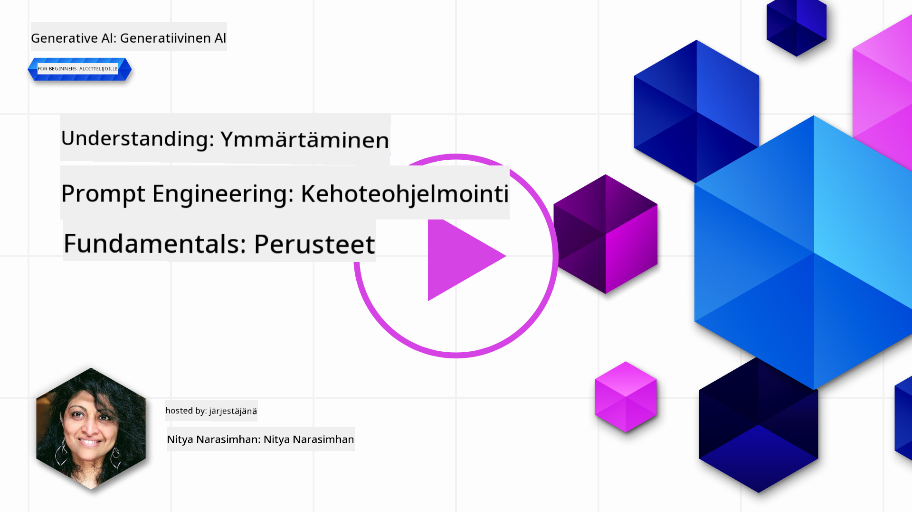
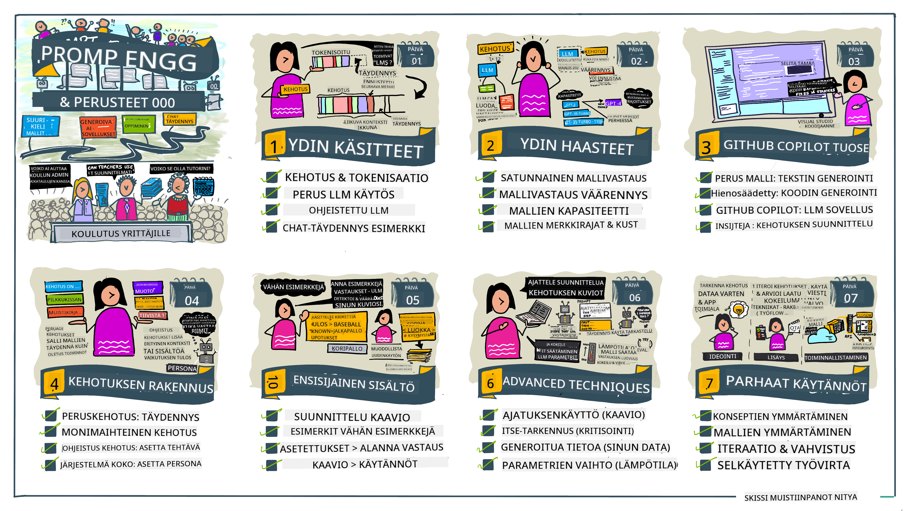
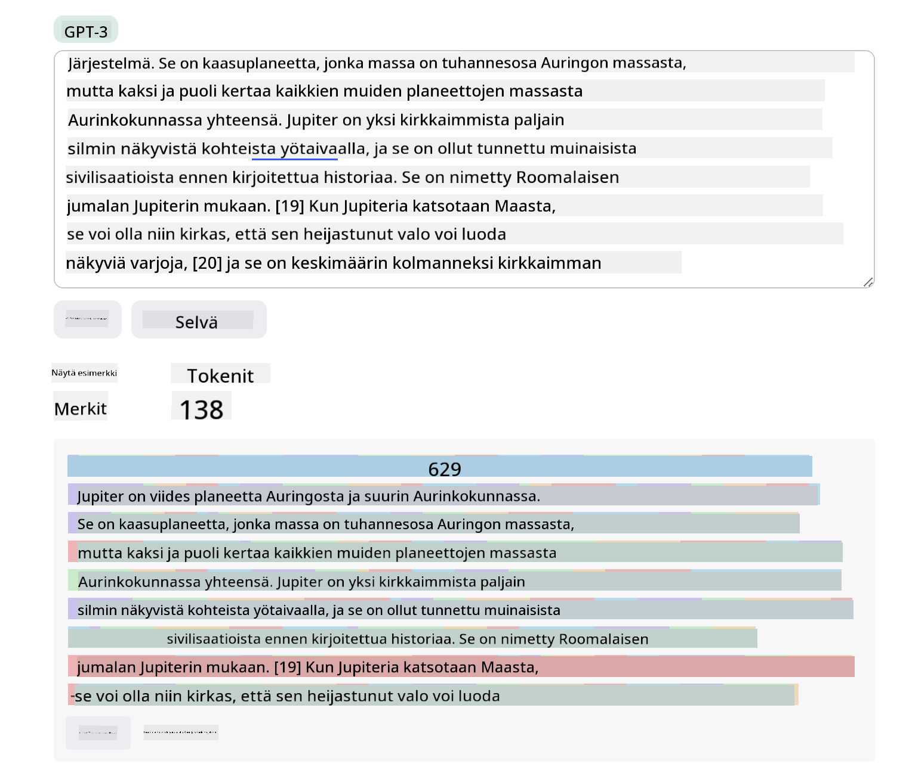
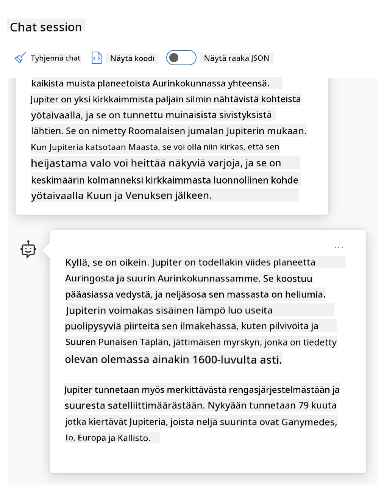
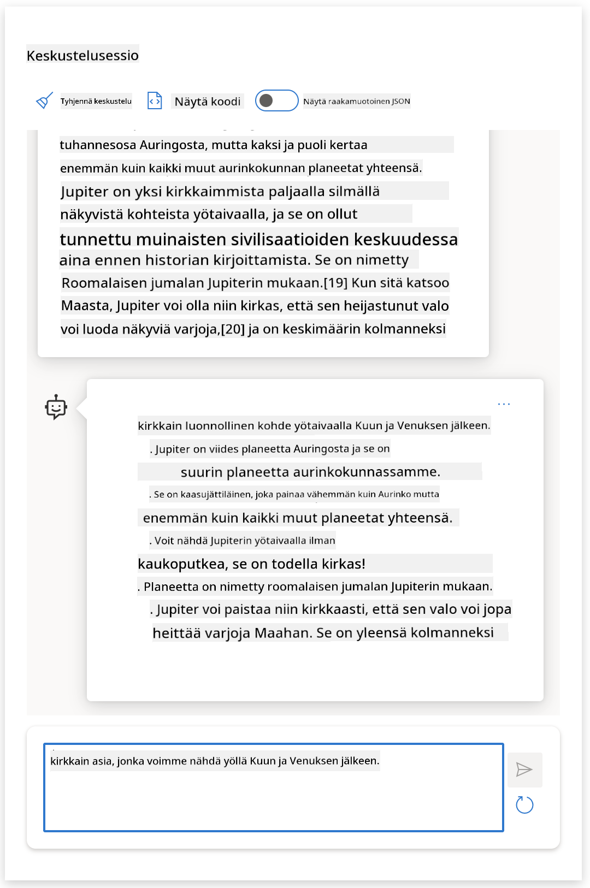
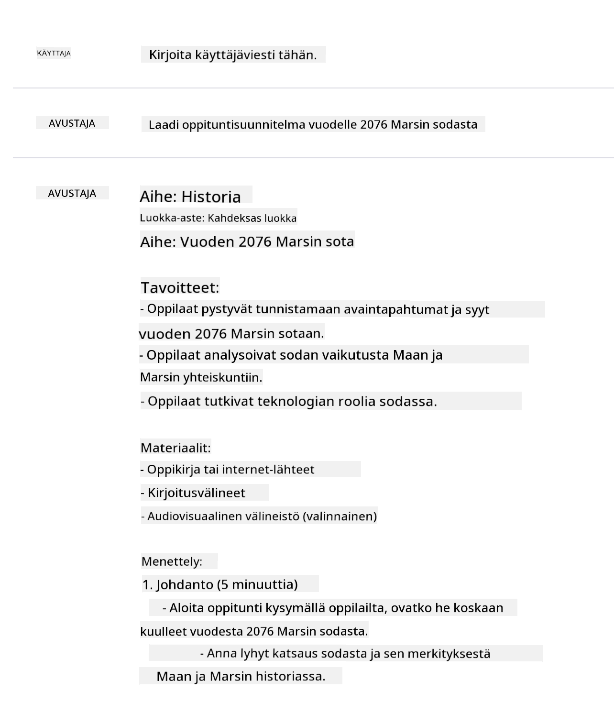
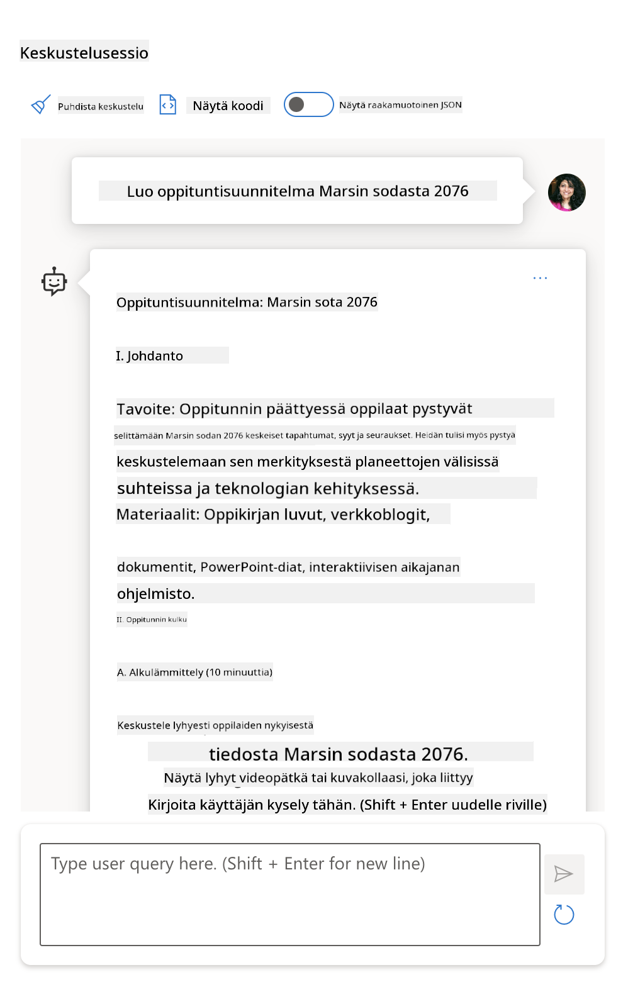
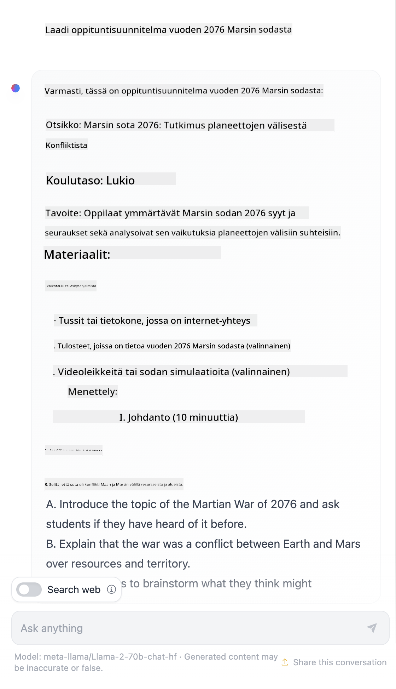

<!--
CO_OP_TRANSLATOR_METADATA:
{
  "original_hash": "dcbaaae026cb50fee071e690685b5843",
  "translation_date": "2025-08-26T17:45:22+00:00",
  "source_file": "04-prompt-engineering-fundamentals/README.md",
  "language_code": "fi"
}
-->
# Prompt Engineeringin perusteet

[](https://aka.ms/gen-ai-lesson4-gh?WT.mc_id=academic-105485-koreyst)

## Johdanto
Tässä osiossa käydään läpi keskeisiä käsitteitä ja tekniikoita, joiden avulla voidaan luoda tehokkaita kehotteita generatiivisille tekoälymalleille. Myös sillä, miten kirjoitat kehotteesi LLM:lle, on merkitystä. Huolellisesti laadittu kehotus voi tuottaa laadukkaamman vastauksen. Mutta mitä oikeastaan tarkoittavat termit _kehotus_ ja _prompt engineering_? Ja miten voin parantaa kehotteen _syötettä_, jonka lähetän LLM:lle? Näihin kysymyksiin pyrimme vastaamaan tässä ja seuraavassa luvussa.

_Generatiivinen tekoäly_ pystyy tuottamaan uutta sisältöä (esim. tekstiä, kuvia, ääntä, koodia jne.) käyttäjän pyynnöstä. Tämä onnistuu _suurten kielimallien_ avulla, kuten OpenAI:n GPT-sarja ("Generative Pre-trained Transformer"), jotka on koulutettu käyttämään luonnollista kieltä ja koodia.

Käyttäjät voivat nyt keskustella näiden mallien kanssa tutulla tavalla, kuten chatissa, ilman teknistä osaamista tai koulutusta. Mallit ovat _kehotepohjaisia_ – käyttäjä lähettää tekstisyötteen (kehotteen) ja saa tekoälyn vastauksen (completion). Keskustelua voi jatkaa useilla kierroksilla, tarkentaen kehotetta, kunnes vastaus vastaa odotuksia.

"Kehotteista" on tullut generatiivisten tekoälysovellusten _ohjelmointirajapinta_, joka ohjaa malleja ja vaikuttaa vastausten laatuun. "Prompt Engineering" on nopeasti kasvava tutkimusala, joka keskittyy kehotteiden _suunnitteluun ja optimointiin_ laadukkaiden ja johdonmukaisten vastausten tuottamiseksi laajassa mittakaavassa.

## Oppimistavoitteet

Tässä luvussa opimme, mitä Prompt Engineering tarkoittaa, miksi se on tärkeää ja miten voimme laatia tehokkaampia kehotteita tietylle mallille ja sovellustavoitteelle. Käymme läpi keskeiset käsitteet ja parhaat käytännöt – sekä tutustumme interaktiiviseen Jupyter Notebook -ympäristöön, jossa näemme nämä asiat käytännössä.

Luvun lopussa osaamme:

1. Selittää, mitä prompt engineering on ja miksi se on tärkeää.
2. Kuvata kehotteen osat ja niiden käyttötavat.
3. Oppia parhaat käytännöt ja tekniikat kehotteiden suunnitteluun.
4. Soveltaa opittuja tekniikoita oikeisiin esimerkkeihin OpenAI-päätepisteen avulla.

## Keskeiset käsitteet

Prompt Engineering: Käytäntö, jossa suunnitellaan ja hiotaan syötteitä, jotta tekoälymallit tuottaisivat toivottuja tuloksia.
Tokenisaatio: Prosessi, jossa teksti muutetaan pienemmiksi yksiköiksi eli tokeneiksi, joita malli pystyy käsittelemään.
Ohjeistuksella hienosäädetyt LLM:t: Suuret kielimallit (LLM), joita on hienosäädetty erityisillä ohjeilla, jotta niiden vastaukset olisivat tarkempia ja osuvampia.

## Oppimisen hiekkalaatikko

Prompt engineering on tällä hetkellä enemmän taidetta kuin tiedettä. Paras tapa kehittää omaa intuitiota on _harjoitella_ ja käyttää kokeilun ja erehdyksen menetelmää, jossa yhdistetään sovellusalueen asiantuntemus suositeltuihin tekniikoihin ja mallikohtaisiin optimointeihin.

Tämän luvun mukana tuleva Jupyter Notebook tarjoaa _hiekkalaatikko_-ympäristön, jossa voit kokeilla oppimaasi – joko heti tai luvun lopun kooditehtävissä. Harjoitusten suorittamiseen tarvitset:

1. **Azure OpenAI API -avaimen** – palvelupäätepisteen käyttöön otetulle LLM:lle.
2. **Python-ympäristön** – jossa Notebook voidaan ajaa.
3. **Paikalliset ympäristömuuttujat** – _tee [SETUP](./../00-course-setup/02-setup-local.md?WT.mc_id=academic-105485-koreyst) -vaiheet nyt, jotta olet valmis_.

Notebook sisältää _aloitusharjoituksia_ – mutta sinua kannustetaan lisäämään omia _Markdown_- (kuvaus) ja _Code_- (kehotepyynnöt) osioita, jotta voit kokeilla lisää esimerkkejä ja ideoita – ja kehittää omaa näkemystäsi kehotteiden suunnittelusta.

## Kuvitettu opas

Haluatko saada yleiskuvan luvun sisällöstä ennen kuin sukellat yksityiskohtiin? Tutustu tähän kuvitettuun oppaaseen, joka esittelee pääaiheet ja tärkeimmät asiat, joita kannattaa pohtia. Luvun etenemispolku vie sinut ydinkäsitteiden ja haasteiden ymmärtämisestä niiden ratkaisemiseen kehotteiden suunnittelun tekniikoilla ja parhailla käytännöillä. Huomaa, että oppaan "Edistyneet tekniikat" -osio viittaa seuraavan luvun sisältöön.



## Meidän startup

Katsotaanpa, miten _tämä aihe_ liittyy startupimme tavoitteeseen [tuoda tekoälyinnovaatioita opetukseen](https://educationblog.microsoft.com/2023/06/collaborating-to-bring-ai-innovation-to-education?WT.mc_id=academic-105485-koreyst). Haluamme rakentaa tekoälypohjaisia _yksilöllisen oppimisen_ sovelluksia – joten pohditaan, miten eri käyttäjät voisivat "suunnitella" kehotteita:

- **Ylläpitäjät** voivat pyytää tekoälyä _analysoimaan opetussuunnitelman dataa ja tunnistamaan puutteita_. Tekoäly voi tiivistää tulokset tai visualisoida ne koodin avulla.
- **Opettajat** voivat pyytää tekoälyä _luomaan oppituntisuunnitelman tietylle kohderyhmälle ja aiheelle_. Tekoäly voi rakentaa yksilöllisen suunnitelman halutussa muodossa.
- **Opiskelijat** voivat pyytää tekoälyä _auttamaan vaikeassa oppiaineessa_. Tekoäly voi ohjata opiskelijaa oppitunneilla, vihjeillä ja esimerkeillä, jotka on räätälöity heidän tasolleen.

Tämä on vasta alkua. Tutustu [Prompts For Education](https://github.com/microsoft/prompts-for-edu/tree/main?WT.mc_id=academic-105485-koreyst) -kirjastoon, joka on avoimen lähdekoodin kehotekirjasto opetuksen asiantuntijoiden kokoamana – saat laajemman käsityksen mahdollisuuksista! _Kokeile joitakin kehotteita hiekkalaatikossa tai OpenAI Playgroundissa ja katso, mitä tapahtuu!_

<!--
OPPITUNNIN POHJA:
Tässä yksikössä käsitellään ydinkäsite #1.
Vahvista käsitettä esimerkeillä ja viitteillä.

KÄSITE #1:
Prompt Engineering.
Määrittele ja selitä, miksi sitä tarvitaan.
-->

## Mitä Prompt Engineering on?

Aloitimme tämän luvun määrittelemällä **Prompt Engineeringin** prosessiksi, jossa _suunnitellaan ja optimoidaan_ tekstisyötteitä (kehotteita), jotta saadaan johdonmukaisia ja laadukkaita vastauksia (completions) tiettyyn sovellustavoitteeseen ja malliin. Voimme ajatella tätä kaksivaiheisena prosessina:

- _suunnitellaan_ alkuperäinen kehotus tietylle mallille ja tavoitteelle
- _hiotaan_ kehotetta vaiheittain, jotta vastauksen laatu paranee

Tämä on väistämättä kokeiluun perustuva prosessi, joka vaatii käyttäjän intuitiota ja vaivannäköä parhaan tuloksen saavuttamiseksi. Miksi tämä on tärkeää? Vastausta varten täytyy ensin ymmärtää kolme käsitettä:

- _Tokenisaatio_ = miten malli "näkee" kehotteen
- _Perus-LLM:t_ = miten perustamalli "käsittelee" kehotteen
- _Ohjeistuksella hienosäädetyt LLM:t_ = miten malli näkee "tehtävät"

### Tokenisaatio

LLM näkee kehotteet _tokenien jonoina_, ja eri mallit (tai malliversiot) voivat tokenisoida saman kehotteen eri tavoin. Koska LLM:t on koulutettu tokeneilla (eivätkä raakatiedolla), kehotteen tokenisointi vaikuttaa suoraan tuotetun vastauksen laatuun.

Jos haluat ymmärtää tokenisaatiota, kokeile esimerkiksi [OpenAI Tokenizer](https://platform.openai.com/tokenizer?WT.mc_id=academic-105485-koreyst) -työkalua. Kopioi kehotteesi ja katso, miten se muuttuu tokeneiksi – kiinnitä huomiota välilyönteihin ja välimerkkeihin. Huomaa, että esimerkki näyttää vanhemman LLM:n (GPT-3) – uudemmalla mallilla tulos voi olla erilainen.



### Käsite: Perustamallit

Kun kehotus on tokenisoitu, ["Base LLM"](https://blog.gopenai.com/an-introduction-to-base-and-instruction-tuned-large-language-models-8de102c785a6?WT.mc_id=academic-105485-koreyst) (tai perustamalli) pyrkii ennustamaan seuraavan tokenin jonossa. Koska LLM:t on koulutettu valtavilla tekstiaineistoilla, ne osaavat arvioida tokenien tilastollisia yhteyksiä ja tehdä ennustuksen varsin luotettavasti. Ne eivät kuitenkaan ymmärrä sanojen _merkitystä_ – ne näkevät vain kuvion, jonka voivat "jatkaa" seuraavalla ennustuksella. Malli jatkaa tokenien ennustamista, kunnes käyttäjä keskeyttää tai jokin ennalta määritelty ehto täyttyy.

Haluatko nähdä, miten kehotepohjainen vastaus toimii? Syötä yllä oleva kehotus Azure OpenAI Studion [_Chat Playgroundiin_](https://oai.azure.com/playground?WT.mc_id=academic-105485-koreyst) oletusasetuksilla. Järjestelmä käsittelee kehotteet tietopyyntöinä – saat vastauksen, joka sopii tähän kontekstiin.

Mutta entä jos käyttäjä haluaa nähdä jotain tiettyä, joka täyttää tietyt kriteerit tai tehtävätavoitteen? Tässä _ohjeistuksella hienosäädetyt_ LLM:t astuvat kuvaan.



### Käsite: Ohjeistuksella hienosäädetyt LLM:t

[Ohjeistuksella hienosäädetty LLM](https://blog.gopenai.com/an-introduction-to-base-and-instruction-tuned-large-language-models-8de102c785a6?WT.mc_id=academic-105485-koreyst) lähtee perustamallista ja hienosäädetään esimerkeillä tai syöte/vastaus-pareilla (esim. monikierroksiset "viestit"), jotka sisältävät selkeitä ohjeita – ja tekoäly yrittää noudattaa annettua ohjetta.

Tässä käytetään esimerkiksi Reinforcement Learning with Human Feedback (RLHF) -tekniikoita, joiden avulla malli _noudattaa ohjeita_ ja _oppii palautteesta_, jolloin se tuottaa käytännön sovelluksiin sopivampia ja käyttäjän tavoitteisiin osuvampia vastauksia.

Kokeillaan – käytä yllä olevaa kehotetta, mutta vaihda nyt _järjestelmäviesti_ antamaan seuraava ohje kontekstiksi:

> _Tiivistä sinulle annettu sisältö toisluokkalaiselle. Pidä tulos yhdessä kappaleessa ja 3–5 bulletissa._

Huomaatko, miten tulos on nyt muotoiltu halutun tavoitteen ja muodon mukaan? Opettaja voi käyttää tätä vastausta suoraan luokan dioissa.



## Miksi Prompt Engineeringiä tarvitaan?

Nyt kun tiedämme, miten kehotteet käsitellään LLM:ssä, pohditaan _miksi_ prompt engineering on tarpeen. Syynä on se, että nykyiset LLM:t tuovat mukanaan haasteita, jotka tekevät _luotettavien ja johdonmukaisten vastausten_ tuottamisesta vaikeampaa ilman panostusta kehotteiden suunnitteluun ja optimointiin. Esimerkiksi:

1. **Mallien vastaukset ovat satunnaisia.** _Sama kehotus_ voi tuottaa eri vastauksia eri malleilla tai malliversioilla. Ja jopa _sama malli_ voi antaa eri tuloksen eri kerroilla. _Prompt engineeringin tekniikat auttavat vähentämään näitä vaihteluita antamalla parempia rajoja._

1. **Mallit voivat keksiä vastauksia.** Mallit on koulutettu _laajoilla mutta rajallisilla_ aineistoilla, joten niiltä puuttuu tietoa aineiston ulkopuolisista asioista. Siksi ne voivat tuottaa vastauksia, jotka ovat epätarkkoja, kuvitteellisia tai ristiriidassa tunnetun tiedon kanssa. _Prompt engineeringin tekniikat auttavat tunnistamaan ja vähentämään tällaisia keksittyjä vastauksia, esim. pyytämällä tekoälyltä lähteitä tai perusteluja._

1. **Mallien kyvyt vaihtelevat.** Uudemmat mallit tai mallisukupolvet tarjoavat laajempia ominaisuuksia, mutta tuovat myös omat erityispiirteensä ja kompromissinsa kustannuksissa ja monimutkaisuudessa. _Prompt engineering auttaa kehittämään parhaita käytäntöjä ja työnkulkuja, jotka abstrahoivat erot ja mukautuvat mallikohtaisiin vaatimuksiin skaalautuvasti ja joustavasti._

Kokeile tätä käytännössä OpenAI- tai Azure OpenAI Playgroundissa:

- Käytä samaa kehotetta eri LLM-toteutuksilla (esim. OpenAI, Azure OpenAI, Hugging Face) – huomasitko vaihtelut?
- Käytä samaa kehotetta toistuvasti _samalla_ LLM-toteutuksella (esim. Azure OpenAI playground) – miten tulokset erosivat toisistaan?

### Keksityt vastaukset

Tässä kurssissa käytämme termiä **"fabrication"** ilmiöstä, jossa LLM:t tuottavat joskus faktuaalisesti virheellistä tietoa johtuen koulutuksen rajoituksista tai muista syistä. Olet ehkä kuullut tästä myös nimitystä _"hallucination"_ artikkeleissa tai tutkimuksissa. Suosittelemme kuitenkin käyttämään termiä _"fabrication"_, jotta emme inhimillistäisi ilmiötä antamalla koneelle ihmismäisiä piirteitä. Tämä tukee myös [Vastuullisen tekoälyn periaatteita](https://www.microsoft.com/ai/responsible-ai?WT.mc_id=academic-105485-koreyst) terminologian näkökulmasta, poistamalla termejä, joita voidaan pitää loukkaavina tai ei-sisällyttävinä joissain yhteyksissä.

Haluatko nähdä, miten keksityt vastaukset syntyvät? Mieti kehotetta, jossa pyydetään tekoälyä tuottamaan sisältöä olemattomasta aiheesta (jotta sitä ei löydy koulutusaineistosta). Esimerkiksi – kokeilin tätä kehotetta:
# Oppituntisuunnitelma: Marsin sota vuonna 2076

## Tavoite

Tämän oppitunnin tarkoituksena on tutustua Marsin sotaan vuonna 2076, sen taustoihin, tärkeimpiin tapahtumiin ja vaikutuksiin ihmiskunnan tulevaisuudelle.

## Johdanto

- Lyhyt katsaus Marsin kolonisaatioon ennen vuotta 2076
- Syyt, jotka johtivat jännitteisiin Marsin ja Maan välillä
- Tärkeimmät osapuolet konfliktissa

## Oppimistehtävät

1. **Marsin sodan taustat**
   - Miksi Marsin asukkaat halusivat itsenäisyyttä?
   - Miten Maan hallinto reagoi Marsin vaatimuksiin?

2. **Sodan kulku**
   - Tärkeimmät taistelut ja strategiat
   - Uudet teknologiat, joita sodassa käytettiin
   - Sodan vaikutus Marsin ja Maan infrastruktuuriin

3. **Sodan seuraukset**
   - Poliittiset muutokset Marsissa ja Maassa
   - Vaikutukset avaruusmatkailuun ja tuleviin kolonisaatioihin
   - Rauhanneuvottelut ja niiden tulokset

## Keskustelukysymyksiä

- Olisiko Marsin sota voitu välttää? Miten?
- Miten teknologian kehitys vaikutti sodan kulkuun?
- Mitä voimme oppia Marsin sodasta tulevaisuuden konflikteja ajatellen?

## Tehtävä

Kirjoita lyhyt essee siitä, miten Marsin sota muutti ihmiskunnan käsitystä avaruuden valloituksesta ja itsenäisyydestä.

## Lisämateriaali

- Linkkejä artikkeleihin ja dokumentteihin Marsin sodasta
- Aikajana sodan tärkeimmistä tapahtumista
- Kartta Marsin tärkeimmistä kaupungeista ja taistelupaikoista

## Yhteenveto

Oppitunnin lopuksi käydään läpi tärkeimmät opit Marsin sodasta ja pohditaan, miten ne vaikuttavat tulevaisuuden avaruuspolitiikkaan.
Verkkohaku osoitti, että Marsin sodista on olemassa fiktiivisiä kertomuksia (esim. televisiosarjoja tai kirjoja) – mutta ei vuodelta 2076. Järki sanoo myös, että vuosi 2076 on _tulevaisuudessa_, joten sitä ei voi liittää todelliseen tapahtumaan.

Mitä siis tapahtuu, kun annamme tämän kehotteen eri LLM-palveluntarjoajille?

> **Vastaus 1**: OpenAI Playground (GPT-35)



> **Vastaus 2**: Azure OpenAI Playground (GPT-35)



> **Vastaus 3**: Hugging Face Chat Playground (LLama-2)



Kuten odotettua, jokainen malli (tai malliversio) tuottaa hieman erilaisia vastauksia johtuen stokastisesta käyttäytymisestä ja mallien kyvykkyyksien eroista. Esimerkiksi yksi malli kohdistaa vastauksensa kahdeksasluokkalaisille, kun taas toinen olettaa käyttäjän olevan lukiolainen. Kaikki kolme mallia kuitenkin tuottivat vastauksia, jotka voisivat vakuuttaa tietämättömän käyttäjän siitä, että tapahtuma oli todellinen.

Kehotteen suunnittelun tekniikat, kuten _metaprompting_ ja _lämpötilan säätö_, voivat vähentää mallin sepityksiä jossain määrin. Uudet kehotteiden suunnittelun _arkkitehtuurit_ myös tuovat uusia työkaluja ja tekniikoita saumattomasti kehotteiden kulkuun, lieventäen tai vähentäen näitä vaikutuksia.

## Tapaustutkimus: GitHub Copilot

Päätetään tämä osio tarkastelemalla, miten kehotteiden suunnittelua käytetään oikeissa ratkaisuissa yhden tapaustutkimuksen kautta: [GitHub Copilot](https://github.com/features/copilot?WT.mc_id=academic-105485-koreyst).

GitHub Copilot on "tekoälypariohjelmoijasi" – se muuntaa tekstikehotteet koodiehdotuksiksi ja on integroitu kehitysympäristöösi (esim. Visual Studio Code) sujuvaa käyttökokemusta varten. Alla olevien blogien mukaan varhaisin versio perustui OpenAI Codex -malliin – insinöörit huomasivat nopeasti tarpeen hienosäätää mallia ja kehittää parempia kehotteiden suunnittelun tekniikoita koodin laadun parantamiseksi. Heinäkuussa [esiteltiin parannettu tekoälymalli, joka menee Codexin ohi](https://github.blog/2023-07-28-smarter-more-efficient-coding-github-copilot-goes-beyond-codex-with-improved-ai-model/?WT.mc_id=academic-105485-koreyst) entistä nopeampia ehdotuksia varten.

Lue julkaisut järjestyksessä, jotta voit seurata heidän oppimismatkaansa.

- **Toukokuu 2023** | [GitHub Copilot ymmärtää koodiasi yhä paremmin](https://github.blog/2023-05-17-how-github-copilot-is-getting-better-at-understanding-your-code/?WT.mc_id=academic-105485-koreyst)
- **Toukokuu 2023** | [Kulissien takana: Työskentely GitHub Copilotin LLM-mallien kanssa](https://github.blog/2023-05-17-inside-github-working-with-the-llms-behind-github-copilot/?WT.mc_id=academic-105485-koreyst).
- **Kesäkuu 2023** | [Näin kirjoitat parempia kehotteita GitHub Copilotille](https://github.blog/2023-06-20-how-to-write-better-prompts-for-github-copilot/?WT.mc_id=academic-105485-koreyst).
- **Heinäkuu 2023** | [.. GitHub Copilot menee Codexin ohi parannetulla tekoälymallilla](https://github.blog/2023-07-28-smarter-more-efficient-coding-github-copilot-goes-beyond-codex-with-improved-ai-model/?WT.mc_id=academic-105485-koreyst)
- **Heinäkuu 2023** | [Kehittäjän opas kehotteiden suunnitteluun ja LLM-malleihin](https://github.blog/2023-07-17-prompt-engineering-guide-generative-ai-llms/?WT.mc_id=academic-105485-koreyst)
- **Syyskuu 2023** | [Näin rakennat yritystason LLM-sovelluksen: Oppeja GitHub Copilotilta](https://github.blog/2023-09-06-how-to-build-an-enterprise-llm-application-lessons-from-github-copilot/?WT.mc_id=academic-105485-koreyst)

Voit myös selata heidän [Engineering-blogiaan](https://github.blog/category/engineering/?WT.mc_id=academic-105485-koreyst) löytääksesi lisää julkaisuja, kuten [tämän](https://github.blog/2023-09-27-how-i-used-github-copilot-chat-to-build-a-reactjs-gallery-prototype/?WT.mc_id=academic-105485-koreyst), jossa näytetään, miten näitä malleja ja tekniikoita _sovelletaan_ oikeiden sovellusten rakentamiseen.

---

## Kehotteen rakentaminen

Olemme nähneet, miksi kehotteiden suunnittelu on tärkeää – nyt ymmärretään, miten kehotteet _rakennetaan_, jotta voimme arvioida erilaisia tekniikoita tehokkaampaan kehotteiden suunnitteluun.

### Peruskehotus

Aloitetaan peruskehotteella: tekstisyöte, joka lähetetään mallille ilman muuta kontekstia. Tässä esimerkki – kun lähetämme Yhdysvaltain kansallislaulun ensimmäiset sanat OpenAI:n [Completion API:lle](https://platform.openai.com/docs/api-reference/completions?WT.mc_id=academic-105485-koreyst), se _täydentää_ vastauksen välittömästi seuraavilla riveillä, mikä havainnollistaa perusennusteen toimintaa.

| Kehotus (Syöte)     | Täydennys (Vastaus)                                                                                                                        |
| :------------------ | :----------------------------------------------------------------------------------------------------------------------------------------- |
| Oh say can you see  | Kuulostaa siltä, että aloitat "The Star-Spangled Banner" -laulun sanat, joka on Yhdysvaltojen kansallislaulu. Täydet sanat ovat ...        |

### Monimutkainen kehotus

Lisätään nyt konteksti ja ohjeet peruskehotteeseen. [Chat Completion API](https://learn.microsoft.com/azure/ai-services/openai/how-to/chatgpt?WT.mc_id=academic-105485-koreyst) mahdollistaa monimutkaisen kehotteen rakentamisen _viestien_ kokoelmana, joissa on:

- Syöte/vastaus-parit, jotka heijastavat _käyttäjän_ syötettä ja _avustajan_ vastausta.
- Järjestelmäviesti, joka asettaa avustajan käyttäytymisen tai persoonallisuuden kontekstin.

Pyyntö on nyt alla olevan muotoinen, jossa _tokenisointi_ poimii olennaisen tiedon kontekstista ja keskustelusta. Nyt järjestelmän kontekstin muuttaminen voi vaikuttaa täydennysten laatuun yhtä paljon kuin käyttäjän syötteet.

```python
response = openai.chat.completions.create(
    model="gpt-3.5-turbo",
    messages=[
        {"role": "system", "content": "You are a helpful assistant."},
        {"role": "user", "content": "Who won the world series in 2020?"},
        {"role": "assistant", "content": "The Los Angeles Dodgers won the World Series in 2020."},
        {"role": "user", "content": "Where was it played?"}
    ]
)
```

### Ohjekehotus

Yllä olevissa esimerkeissä käyttäjän kehotus oli yksinkertainen tekstikysely, joka voidaan tulkita tiedonpyynnöksi. _Ohjekehotuksilla_ voimme käyttää tekstiä tehtävän tarkempaan määrittelyyn ja antaa tekoälylle parempia ohjeita. Tässä esimerkki:

| Kehotus (Syöte)                                                                                                                                                                                                                         | Täydennys (Vastaus)                                                                                                        | Ohjetyyppi          |
| :-------------------------------------------------------------------------------------------------------------------------------------------------------------------------------------------------------------------------------------- | :------------------------------------------------------------------------------------------------------------------------- | :------------------ |
| Kirjoita kuvaus sisällissodasta                                                                                                                                                                                                         | _palautti yksinkertaisen kappaleen_                                                                                        | Yksinkertainen      |
| Kirjoita kuvaus sisällissodasta. Anna tärkeimmät päivämäärät ja tapahtumat sekä kuvaile niiden merkitys                                                                                          | _palautti kappaleen ja listan tärkeistä tapahtumapäivistä kuvauksineen_                                                    | Monimutkainen       |
| Kirjoita kuvaus sisällissodasta yhdessä kappaleessa. Anna 3 luetelmakohtaa tärkeimmistä päivämääristä ja niiden merkityksestä. Anna 3 luetelmakohtaa tärkeimmistä historiallisista henkilöistä ja heidän panoksestaan. Palauta tulos JSON-tiedostona | _palauttaa laajemmat tiedot tekstilaatikossa, muotoiltuna JSONiksi, jonka voi kopioida tiedostoon ja tarkistaa tarvittaessa_ | Monimutkainen. Muotoiltu. |

## Ensisijainen sisältö

Yllä olevissa esimerkeissä kehotus oli vielä melko avoin, jolloin LLM päätti itse, mikä osa sen esikoulutetusta aineistosta oli olennaista. _Ensisijaisen sisällön_ suunnittelumallissa syöte jaetaan kahteen osaan:

- ohje (toiminta)
- olennainen sisältö (joka vaikuttaa toimintaan)

Tässä esimerkissä ohjeena on "tiivistä tämä kahteen lauseeseen".

| Kehotus (Syöte)                                                                                                                                                                                                                                                                                                                                                                                                                                                                                                                                                                                                                                                                                      | Täydennys (Vastaus)                                                                                                                                                                                                                                                                             |
| :-------------------------------------------------------------------------------------------------------------------------------------------------------------------------------------------------------------------------------------------------------------------------------------------------------------------------------------------------------------------------------------------------------------------------------------------------------------------------------------------------------------------------------------------------------------------------------------------------------------------------------------------------------------------------------------------------- | :---------------------------------------------------------------------------------------------------------------------------------------------------------------------------------------------------------------------------------------------------------------------------------------------- |
| Jupiter on viides planeetta Auringosta ja suurin aurinkokunnassa. Se on kaasuplaneetta, jonka massa on tuhannesosa Auringon massasta, mutta kaksi ja puoli kertaa kaikkien muiden aurinkokunnan planeettojen yhteenlasketusta massasta. Jupiter on yksi kirkkaimmista paljain silmin näkyvistä kohteista yötaivaalla, ja se on tunnettu muinaisista ajoista lähtien. Se on nimetty roomalaisen jumala Jupiterin mukaan.[19] Maasta katsottuna Jupiter voi olla niin kirkas, että sen heijastama valo luo näkyviä varjoja,[20] ja se on keskimäärin kolmanneksi kirkkain luonnollinen kohde yötaivaalla Kuun ja Venuksen jälkeen. <br/> **Tiivistä tämä kahteen lyhyeen lauseeseen** | Jupiter, viides planeetta Auringosta, on suurin aurinkokunnassa ja tunnetaan yhtenä yötaivaan kirkkaimmista kohteista. Se on nimetty roomalaisen jumala Jupiterin mukaan ja on kaasuplaneetta, jonka massa on kaksi ja puoli kertaa muiden planeettojen yhteismassasta. |

Ensisijaisen sisällön osuutta voi käyttää monin tavoin tehokkaampien ohjeiden antamiseen:

- **Esimerkit** – sen sijaan, että kerrot mallille suoraan, mitä tehdä, anna sille esimerkkejä halutusta lopputuloksesta ja anna sen päätellä kaava.
- **Vihjeet** – seuraa ohjetta "vihjeellä", joka ohjaa täydennystä ja ohjaa mallia kohti olennaisempia vastauksia.
- **Pohjat** – nämä ovat toistettavia "reseptipohjia" kehotteille, joissa on paikkamerkkejä (muuttujia), joita voi räätälöidä tiettyihin käyttötarkoituksiin.

Katsotaan näitä käytännössä.

### Esimerkkien käyttö

Tässä lähestymistavassa käytät ensisijaista sisältöä "syöttääksesi mallille" esimerkkejä halutusta lopputuloksesta annetulle ohjeelle ja annat sen päätellä halutun lopputuloksen kaavan. Esimerkkien määrän mukaan puhutaan zero-shot-, one-shot-, few-shot-kehotteista jne.

Kehotus koostuu nyt kolmesta osasta:

- Tehtävän kuvaus
- Muutama esimerkki halutusta lopputuloksesta
- Uuden esimerkin alku (joka toimii implisiittisenä tehtävän kuvauksena)

| Oppimistyyppi | Kehotus (Syöte)                                                                                                                                        | Täydennys (Vastaus)         |
| :------------ | :------------------------------------------------------------------------------------------------------------------------------------------------------ | :-------------------------- |
| Zero-shot     | "The Sun is Shining". Käännä espanjaksi                                                                                                                | "El Sol está brillando".    |
| One-shot      | "The Sun is Shining" => ""El Sol está brillando". <br> "It's a Cold and Windy Day" =>                                                                 | "Es un día frío y ventoso". |
| Few-shot      | Pelaaja juoksi pesät ympäri => Baseball <br/> Pelaaja löi ässän => Tennis <br/> Pelaaja löi kuutosen => Kriketti <br/> Pelaaja teki donkin =>         | Koripallo                   |
|               |                                                                                                                                                        |                             |

Huomaa, että zero-shot-kehotteessa piti antaa selkeä ohje ("Käännä espanjaksi"), mutta one-shot-esimerkissä se päätellään. Few-shot-esimerkki osoittaa, miten useamman esimerkin lisääminen mahdollistaa mallille tarkemmat päätelmät ilman lisäohjeita.

### Kehotevihjeet

Toinen tapa käyttää ensisijaista sisältöä on antaa _vihjeitä_ esimerkkien sijaan. Tässä annamme mallille pienen sysäyksen oikeaan suuntaan _aloittamalla_ halutun vastausmuodon mukaisella katkelmalla. Malli "ottaa vihjeestä kiinni" ja jatkaa samalla linjalla.

| Vihjeiden määrä | Kehotus (Syöte)                                                                                                                                                                                                                                                                                                                                                                                                                                               | Täydennys (Vastaus)                                                                                                                                                                                                                                                                                       |
| :-------------- | :----------------------------------------------------------------------------------------------------------------------------------------------------------------------------------------------------------------------------------------------------------------------------------------------------------------------------------------------------------------------------------------------------------------------------------------------------------- | :-------------------------------------------------------------------------------------------------------------------------------------------------------------------------------------------------------------------------------------------------------------------------------------------------------- |
| 0               | Jupiter on viides planeetta Auringosta ja suurin aurinkokunnassa. Se on kaasuplaneetta, jonka massa on tuhannesosa Auringon massasta, mutta kaksi ja puoli kertaa kaikkien muiden aurinkokunnan planeettojen yhteenlasketusta massasta. Jupiter on yksi kirkkaimmista paljain silmin näkyvistä kohteista yötaivaalla, ja se on tunnettu muinaisista ajoista lähtien.

**Tiivistä tämä**                                       | Jupiter on aurinkokuntamme suurin planeetta ja viides aurinkoon nähden. Se on kaasujättiläinen, jonka massa on 1/1000 Auringon massasta, mutta se on silti painavampi kuin kaikki muut planeetat yhteensä. Muinaiset sivilisaatiot ovat tunteneet Jupiterin jo pitkään, ja se näkyy helposti yötaivaalla. |
| 1              | Jupiter on viides planeetta auringosta ja suurin aurinkokunnassa. Se on kaasujättiläinen, jonka massa on tuhannesosa Auringon massasta, mutta kaksi ja puoli kertaa enemmän kuin kaikkien muiden planeettojen yhteismassa. Jupiter on yksi kirkkaimmista paljain silmin näkyvistä kohteista yötaivaalla, ja se on ollut tunnettu jo ennen kirjoitettua historiaa. <br/>**Tiivistä tämä** <br/> Opimme, että Jupiter | on viides planeetta auringosta ja suurin aurinkokunnassa. Se on kaasujättiläinen, jonka massa on tuhannesosa Auringon massasta, mutta kaksi ja puoli kertaa enemmän kuin kaikkien muiden planeettojen yhteismassa. Se näkyy helposti paljain silmin ja on ollut tunnettu jo muinaisista ajoista lähtien.                        |
| 2              | Jupiter on viides planeetta auringosta ja suurin aurinkokunnassa. Se on kaasujättiläinen, jonka massa on tuhannesosa Auringon massasta, mutta kaksi ja puoli kertaa enemmän kuin kaikkien muiden planeettojen yhteismassa. Jupiter on yksi kirkkaimmista paljain silmin näkyvistä kohteista yötaivaalla, ja se on ollut tunnettu jo ennen kirjoitettua historiaa. <br/>**Tiivistä tämä** <br/> 3 tärkeintä asiaa, jotka opimme:         | 1. Jupiter on viides planeetta auringosta ja suurin aurinkokunnassa. <br/> 2. Se on kaasujättiläinen, jonka massa on tuhannesosa Auringon massasta...<br/> 3. Jupiter on ollut näkyvissä paljain silmin jo muinaisista ajoista lähtien ...                                                                       |
|                |                                                                                                                                                                                                                                                                                                                                                                                                                                                              |                                                                                                                                                                                                                                                                                                           |

### Kehyspohjat

Kehyspohja on _ennalta määritelty resepti kehotteelle_, jonka voi tallentaa ja käyttää uudelleen tarpeen mukaan, jotta käyttäjäkokemukset pysyvät johdonmukaisina laajassa mittakaavassa. Yksinkertaisimmillaan se on kokoelma kehotteiden esimerkkejä kuten [tämä OpenAI:lta](https://platform.openai.com/examples?WT.mc_id=academic-105485-koreyst), joka sisältää sekä interaktiiviset kehotteet (käyttäjän ja järjestelmän viestit) että API-pyynnön muodon – mahdollistaen uudelleenkäytön.

Monimutkaisemmassa muodossa, kuten [tässä LangChainin esimerkissä](https://python.langchain.com/docs/concepts/prompt_templates/?WT.mc_id=academic-105485-koreyst), se sisältää _paikkamerkkejä_, jotka voidaan korvata tiedoilla eri lähteistä (käyttäjän syöte, järjestelmän konteksti, ulkoiset tietolähteet jne.) kehotteen dynaamiseen luomiseen. Näin voidaan rakentaa uudelleenkäytettäviä kehotekirjastoja, joilla johdonmukaiset käyttäjäkokemukset voidaan tuottaa **ohjelmallisesti** laajassa mittakaavassa.

Lopulta kehyspohjien todellinen arvo on siinä, että voidaan luoda ja julkaista _kehotekirjastoja_ eri sovellusalueille – jolloin kehyspohja on _optimoitu_ sovelluskohtaisella kontekstilla tai esimerkeillä, jotka tekevät vastauksista osuvampia ja tarkempia kohdeyleisölle. [Prompts For Edu](https://github.com/microsoft/prompts-for-edu?WT.mc_id=academic-105485-koreyst) -repo on hyvä esimerkki tästä lähestymistavasta, sillä se kokoaa kehotekirjaston opetusalalle painottaen tärkeitä tavoitteita kuten tuntisuunnittelu, opetussuunnitelman muotoilu, opiskelijoiden ohjaus jne.

## Tukisisältö

Jos ajattelemme kehotteen rakentamista niin, että siinä on ohje (tehtävä) ja kohde (ensisijainen sisältö), niin _toissijainen sisältö_ on lisäkontekstia, jolla **vaikutetaan lopputulokseen jollain tavalla**. Se voi olla säätöparametreja, muotoiluohjeita, aiheiden luokitteluja jne., jotka auttavat mallia _räätälöimään_ vastauksensa haluttuihin tavoitteisiin tai odotuksiin.

Esimerkki: Jos meillä on kurssikatalogi, jossa on laajat metatiedot (nimi, kuvaus, taso, metatunnisteet, opettaja jne.) kaikista opetussuunnitelman kursseista:

- voimme antaa ohjeen "tiivistä kurssikatalogi syksylle 2023"
- voimme käyttää ensisijaista sisältöä antamaan muutamia esimerkkejä halutusta lopputuloksesta
- voimme käyttää toissijaista sisältöä tunnistamaan 5 tärkeintä "tunnistetta"

Nyt malli voi antaa yhteenvedon esimerkkien mukaisessa muodossa – mutta jos tuloksessa on useita tunnisteita, se voi priorisoida ne 5, jotka toissijainen sisältö määritteli.

---

<!--
OPETUSPOHJA:
Tässä osiossa tulisi käsitellä ydinkäsite #1.
Vahvista käsitettä esimerkeillä ja viittauksilla.

KÄSITE #3:
Kehotetekniikat.
Mitkä ovat perusmenetelmät kehotteiden suunnittelussa?
Havainnollista harjoituksilla.
-->

## Kehottamisen parhaat käytännöt

Nyt kun tiedämme, miten kehotteita voidaan _rakentaa_, voimme alkaa miettiä, miten ne _suunnitellaan_ parhaiden käytäntöjen mukaisesti. Voimme jakaa tämän kahteen osaan – oikean _ajattelutavan_ omaksumiseen ja oikeiden _tekniikoiden_ soveltamiseen.

### Kehotetekniikan ajattelutapa

Kehotetekniikka on kokeiluun perustuva prosessi, joten pidä mielessä kolme laajaa ohjaavaa tekijää:

1. **Alueen ymmärrys on tärkeää.** Vastausten tarkkuus ja osuvuus riippuvat _alueesta_, jossa sovellus tai käyttäjä toimii. Hyödynnä omaa intuitiotasi ja asiantuntemustasi **räätälöidäksesi tekniikoita**. Esimerkiksi määrittele _aluekohtaisia persoonallisuuksia_ järjestelmäkehotteissa tai käytä _aluekohtaisia pohjia_ käyttäjäkehotteissa. Tarjoa toissijaista sisältöä, joka heijastaa alueen kontekstia, tai käytä _aluekohtaisia vihjeitä ja esimerkkejä_ ohjataksesi mallia tutumpiin käyttötapoihin.

2. **Mallin ymmärrys on tärkeää.** Tiedämme, että mallit ovat luonteeltaan satunnaisia. Mutta mallien toteutukset voivat myös vaihdella sen mukaan, millä aineistolla ne on koulutettu (ennakkotieto), mitä ominaisuuksia ne tarjoavat (esim. API tai SDK) ja minkä tyyppiseen sisältöön ne on optimoitu (esim. koodi vs. kuvat vs. teksti). Ymmärrä käyttämäsi mallin vahvuudet ja rajoitukset, ja hyödynnä tätä tietoa _priorisoidaksesi tehtäviä_ tai rakentaaksesi _räätälöityjä pohjia_, jotka on optimoitu mallin ominaisuuksille.

3. **Iterointi ja validointi ovat tärkeitä.** Mallit kehittyvät nopeasti, samoin kehotetekniikat. Alueasiantuntijana sinulla voi olla muuta kontekstia tai kriteerejä _omalle_ sovelluksellesi, jotka eivät päde laajemmin. Käytä kehotetekniikan työkaluja ja menetelmiä "aloittaaksesi" kehotteen rakentamisen, sitten iteroi ja validoi tulokset oman intuitiosi ja asiantuntemuksesi avulla. Tallenna havaintosi ja luo **tietopohja** (esim. kehotekirjastoja), joita muut voivat käyttää uutena lähtökohtana nopeampaan iterointiin jatkossa.

## Parhaat käytännöt

Tarkastellaan nyt yleisiä parhaita käytäntöjä, joita suosittelevat [OpenAI](https://help.openai.com/en/articles/6654000-best-practices-for-prompt-engineering-with-openai-api?WT.mc_id=academic-105485-koreyst) ja [Azure OpenAI](https://learn.microsoft.com/azure/ai-services/openai/concepts/prompt-engineering#best-practices?WT.mc_id=academic-105485-koreyst) -asiantuntijat.

| Mitä                              | Miksi                                                                                                                                                                                                                                               |
| :-------------------------------- | :------------------------------------------------------------------------------------------------------------------------------------------------------------------------------------------------------------------------------------------------ |
| Arvioi uusimmat mallit.       | Uusissa mallisukupolvissa on todennäköisesti parempia ominaisuuksia ja laatua – mutta ne voivat myös olla kalliimpia. Arvioi niiden vaikutus ja tee siirtymispäätökset sen mukaan.                                                                                |
| Erottele ohjeet ja konteksti   | Tarkista, määritteleekö mallisi/toimittajasi _erottimia_, joilla ohjeet, ensisijainen ja toissijainen sisältö erotellaan selkeämmin. Tämä voi auttaa mallia painottamaan sanoja tarkemmin.                                                         |
| Ole tarkka ja selkeä             | Anna yksityiskohtia halutusta kontekstista, lopputuloksesta, pituudesta, muodosta, tyylistä jne. Tämä parantaa vastausten laatua ja johdonmukaisuutta. Tallenna reseptit uudelleenkäytettäviin pohjiin.                                                          |
| Ole kuvaileva, käytä esimerkkejä      | Mallit voivat reagoida paremmin "näytä ja kerro" -lähestymistapaan. Aloita `zero-shot`-menetelmällä, jossa annat ohjeen (ilman esimerkkejä), ja kokeile sitten `few-shot`-menetelmää, jossa annat muutamia esimerkkejä halutusta lopputuloksesta. Käytä analogioita. |
| Käytä vihjeitä käynnistämään vastauksia | Ohjaa mallia haluttuun lopputulokseen antamalla sille alkusanoja tai lauseita, joita se voi käyttää vastauksen lähtökohtana.                                                                                                               |
| Toista tarvittaessa                       | Joskus mallille täytyy toistaa ohjeita. Anna ohjeet ennen ja jälkeen ensisijaisen sisällön, käytä ohjetta ja vihjettä jne. Iteroi ja validoi, mikä toimii.                                                         |
| Järjestyksellä on väliä                     | Tiedon esittämisjärjestys mallille voi vaikuttaa lopputulokseen, myös oppimisesimerkeissä, kiitos tuoreusvaikutuksen. Kokeile eri vaihtoehtoja ja katso, mikä toimii parhaiten.                                                               |
| Anna mallille "varasuunnitelma"           | Anna mallille _varavastaus_, jonka se voi antaa, jos se ei pysty suorittamaan tehtävää. Tämä voi vähentää virheellisten tai keksittyjen vastausten riskiä.                                                         |
|                                   |                                                                                                                                                                                                                                                   |

Kuten kaikissa parhaissa käytännöissä, muista että _tulokset voivat vaihdella_ mallin, tehtävän ja alueen mukaan. Käytä näitä lähtökohtana ja iteroi löytääksesi itsellesi parhaan tavan. Arvioi kehotetekniikan prosessiasi jatkuvasti, kun uusia malleja ja työkaluja tulee saataville, keskittyen prosessin skaalautuvuuteen ja vastausten laatuun.

<!--
OPETUSPOHJA:
Tässä osiossa tulisi olla kooditehtävä, jos soveltuu

TEHTÄVÄ:
Linkki Jupyter Notebookiin, jossa vain koodikommentit ohjeissa (koodiosiot tyhjiä).

RATKAISU:
Linkki kopioon Notebookista, jossa kehotteet täytetty ja ajettu, esimerkkinä yhdestä ratkaisusta.
-->

## Tehtävä

Onnittelut! Olet päässyt oppitunnin loppuun! Nyt on aika testata opittuja käsitteitä ja tekniikoita oikeilla esimerkeillä!

Tehtävässä käytämme Jupyter Notebookia, jossa voit tehdä harjoituksia interaktiivisesti. Voit myös laajentaa Notebookia omilla Markdown- ja koodisoluilla tutkiaksesi ideoita ja tekniikoita itsenäisesti.

### Aloittaaksesi haarukoi repo, sitten

- (Suositus) Käynnistä GitHub Codespaces
- (Vaihtoehto) Kloonaa repo omalle laitteellesi ja käytä sitä Docker Desktopin kanssa
- (Vaihtoehto) Avaa Notebook haluamallasi Notebook-ympäristöllä.

### Seuraavaksi määritä ympäristömuuttujat

- Kopioi `.env.copy` tiedosto reposta nimellä `.env` ja täytä `AZURE_OPENAI_API_KEY`, `AZURE_OPENAI_ENDPOINT` ja `AZURE_OPENAI_DEPLOYMENT` arvot. Palaa [Learning Sandbox -osioon](../../../04-prompt-engineering-fundamentals/04-prompt-engineering-fundamentals) oppiaksesi lisää.

### Seuraavaksi avaa Jupyter Notebook

- Valitse ajoympäristön ydin. Jos käytät vaihtoehtoja 1 tai 2, valitse vain oletus Python 3.10.x -ydin, jonka kehityskontti tarjoaa.

Nyt voit suorittaa harjoitukset. Huomaa, että tässä ei ole _oikeita tai vääriä_ vastauksia – tarkoitus on kokeilla eri vaihtoehtoja ja kehittää intuitiota siitä, mikä toimii kullakin mallilla ja sovellusalueella.

_Tämän vuoksi tässä oppitunnissa ei ole koodiratkaisuosioita. Sen sijaan Notebookissa on Markdown-solut otsikolla "Oma ratkaisuni:", joissa näytetään yksi esimerkkivastaus viitteeksi._

 <!--
OPETUSPOHJA:
Päätä osio yhteenvedolla ja resursseilla omaehtoiseen oppimiseen.
-->

## Tietotesti

Mikä seuraavista on hyvä kehotteiden esimerkki, joka noudattaa järkeviä parhaita käytäntöjä?

1. Näytä kuva punaisesta autosta
2. Näytä kuva punaisesta Volvo XC90 -autosta, joka on pysäköity kallion viereen auringonlaskussa
3. Näytä kuva punaisesta Volvo XC90 -autosta

Vastaus: 2, se on paras kehotteista, koska se kertoo tarkasti "mitä" ja menee yksityiskohtiin (ei vain mikä tahansa auto, vaan tietty merkki ja malli) ja kuvailee myös ympäristön. 3 on seuraavaksi paras, koska siinäkin on paljon kuvausta.

## 🚀 Haaste

Kokeile, voitko hyödyntää "vihje"-tekniikkaa kehotteella: Täydennä lause "Näytä kuva punaisesta Volvo-merkkisestä autosta ja ". Mitä malli vastaa, ja miten parantaisit sitä?

## Hienoa työtä! Jatka oppimista

Haluatko oppia lisää kehotetekniikan eri käsitteistä? Siirry [jatko-opiskelusivulle](https://aka.ms/genai-collection?WT.mc_id=academic-105485-koreyst) löytääksesi lisää hyviä resursseja aiheesta.

Siirry oppituntiin 5, jossa käsittelemme [kehittyneitä kehotetekniikoita](../05-advanced-prompts/README.md?WT.mc_id=academic-105485-koreyst)!

---

**Vastuuvapauslauseke**:  
Tämä asiakirja on käännetty käyttämällä tekoälypohjaista käännöspalvelua [Co-op Translator](https://github.com/Azure/co-op-translator). Vaikka pyrimme tarkkuuteen, automaattiset käännökset saattavat sisältää virheitä tai epätarkkuuksia. Alkuperäistä asiakirjaa sen omalla kielellä tulee pitää ensisijaisena lähteenä. Tärkeissä asioissa suositellaan ammattimaista ihmiskääntäjää. Emme ole vastuussa tämän käännöksen käytöstä mahdollisesti aiheutuvista väärinkäsityksistä tai tulkintavirheistä.