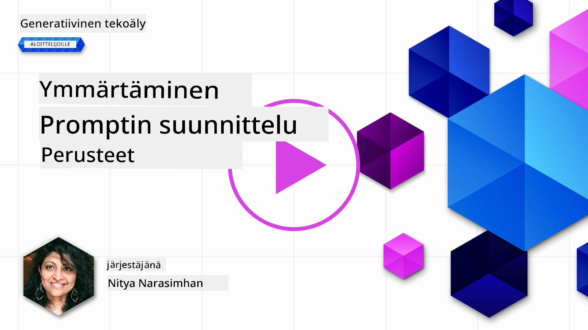
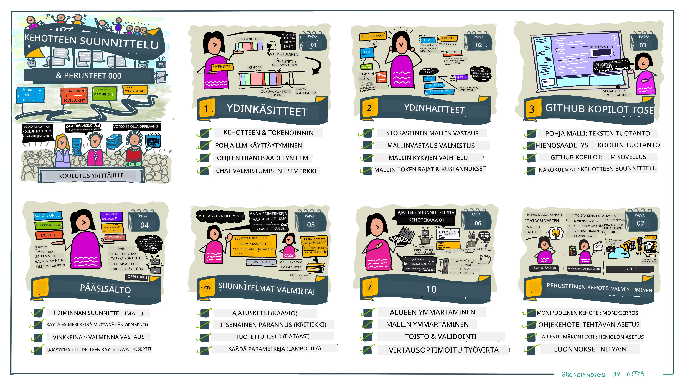
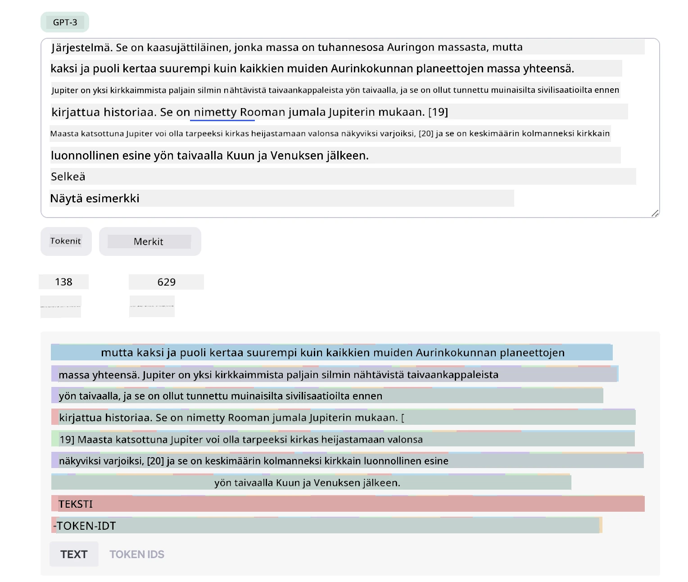
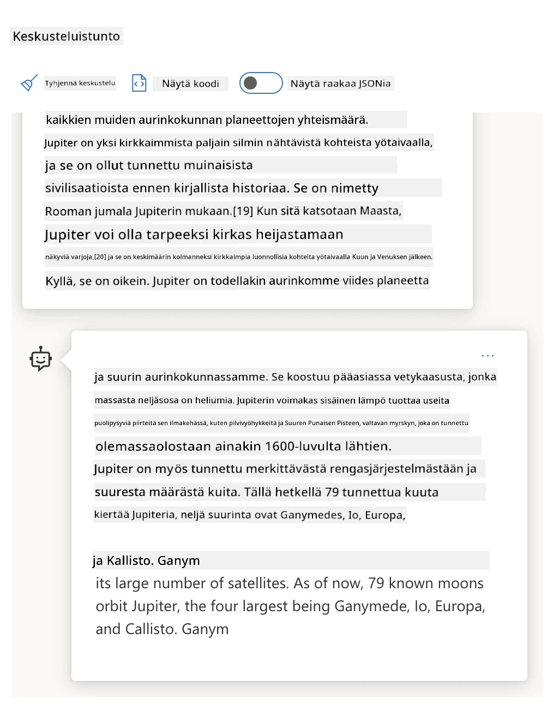
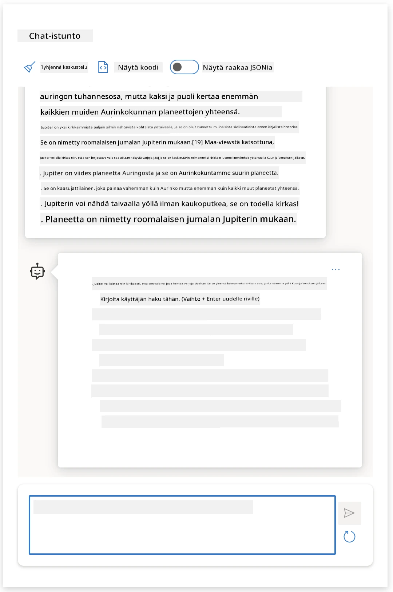
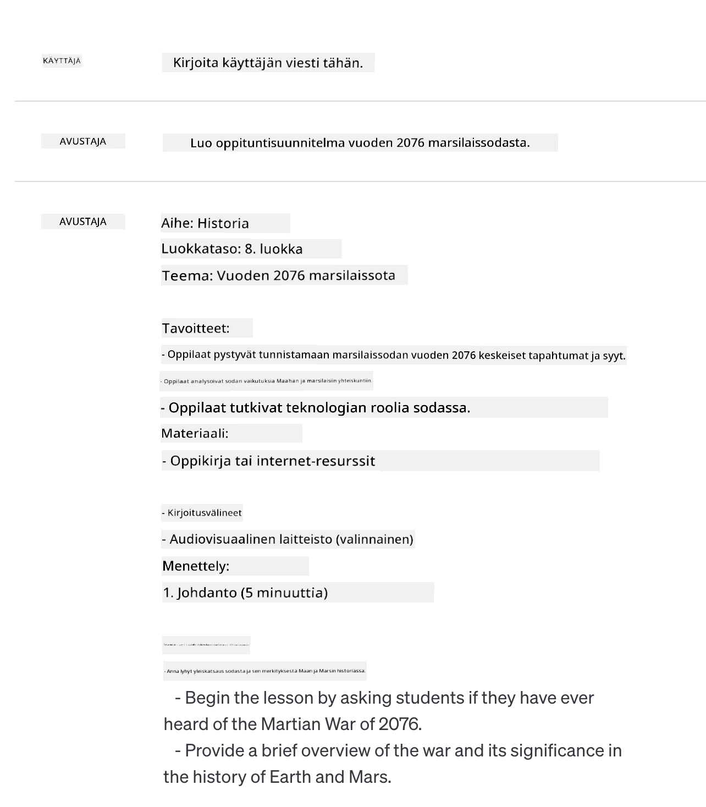
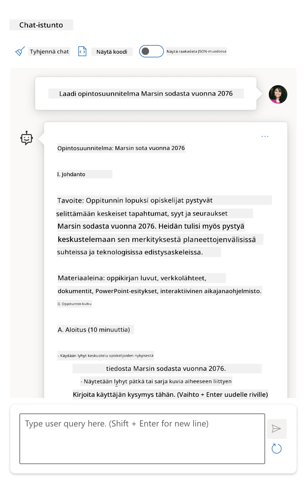
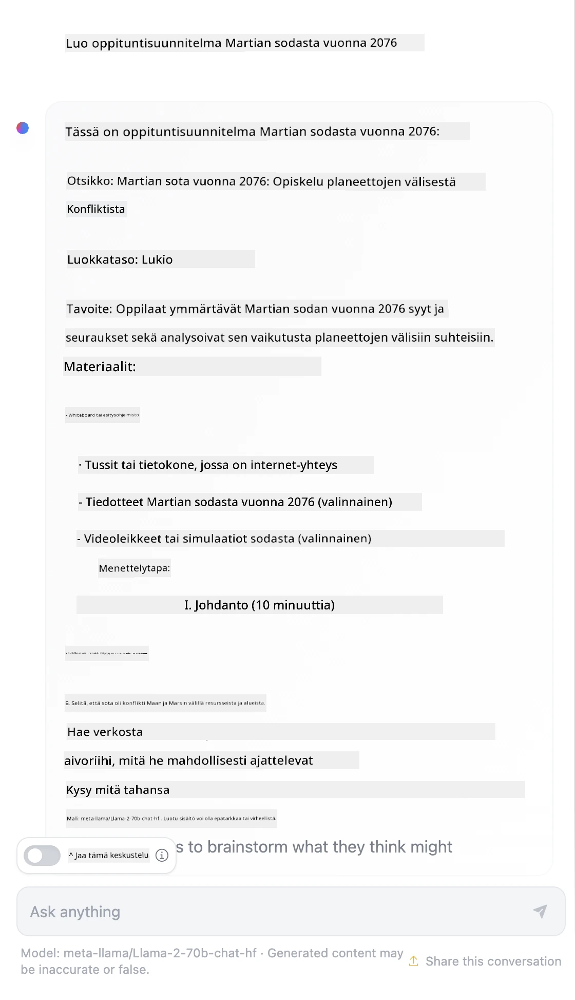

# Promptin suunnittelun perusteet

[](https://youtu.be/GElCu2kUlRs?si=qrXsBvXnCW12epb8)

## Johdanto
Tämä moduuli kattaa olennaiset käsitteet ja tekniikat tehokkaiden kehotteiden luomiseksi generatiivisissa tekoälymalleissa. Tapa, jolla kirjoitat kehotteen LLM:lle, on myös tärkeä. Huolellisesti laadittu kehotus voi saavuttaa parempilaatuisen vastauksen. Mutta mitä tarkalleen ottaen termit _prompt_ ja _prompt engineering_ tarkoittavat? Ja miten parannan kehotteen _syötettä_, jonka lähetän LLM:lle? Näihin kysymyksiin yritämme vastata tässä ja seuraavassa luvussa.

_Generatiivinen tekoäly_ kykenee luomaan uutta sisältöä (esim. tekstiä, kuvia, ääntä, koodia jne.) käyttäjän pyyntöihin vastaten. Tämä tapahtuu käyttämällä _suuria kielimalleja_ kuten OpenAI:n GPT ("Generative Pre-trained Transformer") sarjaa, jotka on koulutettu käyttämään luonnollista kieltä ja koodia.

Käyttäjät voivat nyt olla vuorovaikutuksessa näiden mallien kanssa tutuilla paradigmoilla, kuten chatilla, ilman teknistä asiantuntemusta tai koulutusta. Mallit ovat _kehotepohjaisia_ - käyttäjät lähettävät tekstisyötteen (kehotteen) ja saavat takaisin tekoälyn vastauksen (valmiin tekstin). He voivat sitten "jutella tekoälyn kanssa" toistuvasti, monivaiheisissa keskusteluissa, hienosäätäen kehotettaan, kunnes vastaus vastaa odotuksia.

"Kehotteet" ovat nyt tärkein _ohjelmointirajapinta_ generatiivisissa tekoälysovelluksissa, jotka kertovat malleille, mitä tehdä, ja vaikuttavat palautettujen vastausten laatuun. "Prompt Engineering" on nopeasti kasvava tutkimusala, joka keskittyy kehotteiden _suunnitteluun ja optimointiin_, jotta vastaukset olisivat johdonmukaisia ja laadukkaita mittakaavassa.

## Oppimistavoitteet

Tässä oppitunnissa opimme, mitä prompt engineering on, miksi se on tärkeää, ja miten voimme laatia tehokkaampia kehotteita tietylle mallille ja sovellustavoitteelle. Ymmärrämme ydinkäsitteet ja parhaat käytännöt promptin suunnittelusta – ja tutustumme interaktiiviseen Jupyter-muistikirjan "hiekkalaatikko" -ympäristöön, jossa voimme nähdä nämä käsitteet käytännössä.

Oppitunnin lopussa osaat:

1. Selittää, mitä prompt engineering on ja miksi se on tärkeää.
2. Kuvailla kehotteen osat ja miten niitä käytetään.
3. Oppia parhaat käytännöt ja tekniikat prompt engineeringiin.
4. Soveltaa opittuja tekniikoita käytännön esimerkkeihin käyttäen OpenAI:n päätepistettä.

## Keskeiset käsitteet

Prompt Engineering: Käytäntö suunnitella ja hioa syötteitä ohjaamaan tekoälymalleja tuottamaan haluttuja tuloksia.
Tokenisointi: Prosessi, jossa teksti muunnetaan pienemmiksi yksiköiksi eli tokeneiksi, joita malli voi ymmärtää ja käsitellä.
Ohjeistettu LLM: Suuret kielimallit, jotka on hienosäädetty tietyillä ohjeilla parantamaan vastauksen tarkkuutta ja relevanssia.

## Oppimishiekkalaatikko

Prompt engineering on tällä hetkellä enemmän taidetta kuin tiedettä. Paras tapa parantaa intuitiota on _harjoitella enemmän_ ja omaksua kokeilu-erehdys-lähestymistapa, joka yhdistää sovellusalueen asiantuntemuksen suositeltuihin tekniikoihin ja mallikohtaisiin optimointeihin.

Tätä oppituntua tukevassa Jupyter Notebookissa on _hiekkalaatikko_-ympäristö, jossa voit kokeilla oppimaasi - joko matkan aikana tai lopun kooditehtävän osana. Harjoitusten suorittamiseen tarvitset:

1. **Azure OpenAI API -avaimen** - palvelun päätepisteen käyttöönotetulle LLM:lle.
2. **Python-ympäristön** - jossa muistiinpanojasi voidaan suorittaa.
3. **Paikalliset ympäristömuuttujat** - _suorita [ASENNUS](./../00-course-setup/02-setup-local.md?WT.mc_id=academic-105485-koreyst) nyt valmiiksi_.

Muistikirja sisältää _aloitus_ harjoituksia - mutta sinua rohkaistaan lisäämään omia _Markdown_ (kuvaus) ja _Code_ (kehotepyynnöt) osioita kokeillaksesi lisää esimerkkejä tai ideoita - ja kehittääksesi intuitiotasi kehotteiden suunnitteluun.

## Kuvitettu opas

Haluatko saada kokonaiskuvan siitä, mitä tämä oppitunti kattaa ennen syventymistä? Tutustu tähän kuvitettuun oppaaseen, joka antaa käsityksen keskeisistä aiheista ja tärkeimmistä opittavista asioista. Oppitunnin tiekartta vie sinut ydinkäsitteiden ja haasteiden ymmärtämisestä niiden ratkaisemiseen sopivilla prompt engineering -tekniikoilla ja parhailla käytännöillä. Huomaa, että tämän oppaan "Edistyneet tekniikat" -osio viittaa seuraavan luvun sisältöön tässä kurssissa.



## Startupimme

Nyt, puhutaanpa siitä, miten _tämä aihe_ liittyy startupimme missioon [tuoda tekoälyinnovaatio koulutukseen](https://educationblog.microsoft.com/2023/06/collaborating-to-bring-ai-innovation-to-education?WT.mc_id=academic-105485-koreyst). Haluamme rakentaa tekoälyllä tehostettuja _henkilökohtaisen oppimisen_ sovelluksia – pohditaanpa, miten eri käyttäjät sovelluksessamme voisivat "suunnitella" kehotteita:

- **Ylläpitäjät** saattavat pyytää tekoälyltä _analysoimaan opetussuunnitelmadataa kattavuuden aukkojen tunnistamiseksi_. Tekoäly voi tiivistää tulokset tai visualisoida ne koodin avulla.
- **Opettajat** saattavat pyytää tekoälyä _luomaan oppituntisuunnitelman kohdeyleisölle ja aiheelle_. Tekoäly voi rakentaa henkilökohtaisen suunnitelman annetussa formaatissa.
- **Oppilaat** voivat pyytää tekoälyä _ohjaamaan heitä vaikeassa aineessa_. Tekoäly voi nyt tarjota oppitunteja, vihjeitä ja esimerkkejä, jotka on räätälöity heidän tasolleen.

Tämä on vasta jäävuoren huippu. Tutustu [Prompts For Education](https://github.com/microsoft/prompts-for-edu/tree/main?WT.mc_id=academic-105485-koreyst) - avoimen lähdekoodin kehotekirjastoon, jonka ovat koonneet koulutusasiantuntijat - saadaksesi laajemman kuvan mahdollisuuksista! _Kokeile ajamaan joitakin noista kehotteista hiekkalaatikossa tai OpenAI Playgroundissa nähdäksesi mitä tapahtuu!_

<!--
OPPITUNNIN MALLI:
Tämä yksikkö kattaa ydinkäsitteen #1.
Vahvista käsitettä esimerkein ja viittein.

KÄSITTE #1:
Prompt Engineering.
Määrittele se ja selitä miksi sitä tarvitaan.
-->

## Mikä on Prompt Engineering?

Aloitimme tämän oppitunnin määrittelemällä **Prompt Engineering** prosessiksi, jossa _suunnitellaan ja optimoidaan_ tekstisyötteitä (kehotteita) tuottamaan johdonmukaisia ja laadukkaita vastauksia (completioneja) tietylle sovellustavoitteelle ja mallille. Voimme ajatella tätä kaksivaiheisena prosessina:

- _suunnitella_ alkuperäinen kehotus tietylle mallille ja tavoitteelle
- _hioa_ kehotetta iteratiivisesti parantaen vastauksen laatua

Tämä on väistämättä kokeilu-erehdys-prosessi, joka vaatii käyttäjän intuitiota ja vaivaa optimaalisien tulosten saavuttamiseksi. Miksi se on sitten tärkeää? Vastataksemme siihen, meidän täytyy ensin ymmärtää kolme käsitettä:

- _Tokenisointi_ = miten malli "näkee" kehotteen
- _Perustason LLM:t_ = miten perustamalli "käsittelee" kehotteen
- _Ohjeistettu LLM_ = miten malli nyt näkee "tehtävät"

### Tokenisointi

LLM näkee kehotteet _tokenien_ sekvenssinä, ja eri mallit (tai saman mallin eri versiot) voivat tokenisoida saman kehotteen eri tavoin. Koska LLM:t on koulutettu tokeneilla (eivät raakatekstillä), tapa, jolla kehotteet tokenisoidaan, vaikuttaa suoraan tuotetun vastauksen laatuun.

Saadaksesi käsityksen tokenisoinnista, kokeile työkaluja, kuten alla oleva [OpenAI Tokenizer](https://platform.openai.com/tokenizer?WT.mc_id=academic-105485-koreyst). Kopioi kehotteesi sinne – ja näe miten se muunnetaan tokeneiksi, kiinnittäen huomiota välilyöntien ja välimerkkien käsittelyyn. Huomaa, että tämä esimerkki näyttää vanhemman LLM:n (GPT-3) – joten kokeilu uudella mallilla voi antaa erilaisen tuloksen.



### Käsite: Perustason mallit (Foundation Models)

Kun kehotus on tokenisoitu, ["Perustason LLM:n"](https://blog.gopenai.com/an-introduction-to-base-and-instruction-tuned-large-language-models-8de102c785a6?WT.mc_id=academic-105485-koreyst) (tai perustumalli) päätehtävä on ennustaa tokenin seuraava elementti sekvenssissä. Koska LLM:t on koulutettu valtaviin tekstiaineistoihin, niillä on hyvä ymmärrys tokenien välisistä tilastollisista suhteista ja ne voivat tehdä tämän ennusteen melko luotettavasti. Huomaa, että ne eivät ymmärrä kehotteen tai tokenin sanojen _merkitystä_; ne näkevät vain kuviota, jonka voivat "täydentää" seuraavalla arvauksellaan. Ne voivat jatkaa sekvenssin ennustamista, kunnes käyttäjä keskeyttää tai jokin ennalta määritelty ehto täyttyy.

Haluatko nähdä miten kehotepohjainen täydentäminen toimii? Syötä yllä oleva kehotus [Microsoft Foundry playgroundiin](https://ai.azure.com?WT.mc_id=academic-105485-koreyst) oletusasetuksilla. Järjestelmä on konfiguroitu käsittelemään kehotteita tiedonpyyntöinä – joten sinun pitäisi nähdä vastaus, joka tyydyttää tämän kontekstin.

Mutta entä jos käyttäjä haluaa nähdä jotain tiettyä, joka täyttää jonkin kriteerin tai tehtävän tavoitteen? Tähän kohtaan tulevat _ohjeistettu_ LLM:t.



### Käsite: Ohjeistettu LLM

[Ohjeistettu LLM](https://blog.gopenai.com/an-introduction-to-base-and-instruction-tuned-large-language-models-8de102c785a6?WT.mc_id=academic-105485-koreyst) alkaa perustamallista ja hienosäätää sitä esimerkkien tai syöte-/tulosparien (esim. monivaiheinen "viestejä") avulla, jotka voivat sisältää selkeitä ohjeita – ja tekoälyn vastaus pyrkii noudattamaan kyseistä ohjetta.

Tämä käyttää tekniikoita kuten Vahvistusoppiminen ihmispalautteella (RLHF), joka voi kouluttaa mallin _noudattamaan ohjeita_ ja _oppimaan palautteesta_, jotta se tuottaa vastauksia, jotka soveltuvat paremmin käytännön sovelluksiin ja vastaavat käyttäjän tavoitteita.

Kokeillaanpa - palaa yllä olevaan kehotteeseen, mutta muokkaa nyt _järjestelmäviesti_ seuraavalla ohjeella kontekstina:

> _Tiivistä annetun sisällön pääkohdat toisen luokan oppilaalle. Pidä tulos yhdessä kappaleessa, jossa on 3-5 luettelokohtaa._

Näetkö, miten tulos on nyt säädetty heijastamaan haluttua tavoitetta ja muotoa? Opettaja voi nyt käyttää tätä vastausta suoraan luokan esityksissä.



## Miksi tarvitsemme Prompt Engineeringia?

Nyt kun tiedämme, miten kehotteet käsitellään LLM:issä, puhutaanpa siitä, _miksi_ tarvitsemme prompt engineeringia. Vastaus löytyy siitä, että nykyiset LLM:t aiheuttavat useita haasteita, jotka tekevät _luotettavien ja johdonmukaisten vastausten_ saavuttamisesta vaikeampaa ilman vaivaa kehotteiden rakentamiseen ja optimointiin. Esimerkiksi:

1. **Mallien vastaukset ovat satunnaisia.** _Sama kehotus_ tuottaa todennäköisesti eri vastauksia eri malleilla tai malliversioilla. Ja se voi tuottaa erilaisia tuloksia myös _samalla mallilla_ eri aikoina. _Prompt engineering -tekniikat auttavat minimoimaan näitä vaihteluita tarjoamalla parempia suoja-aitoja_.

1. **Mallien vastaukset voivat olla keksittyjä.** Mallit on esikoulutettu _suuriin mutta rajallisiin_ tietoaineistoihin, mikä tarkoittaa, että niiltä puuttuu tietoa aineistoalueiden ulkopuolisista käsitteistä. Tämän seurauksena ne voivat tuottaa vastauksia, jotka ovat epätarkkoja, kuvitteellisia tai suoraan ristiriidassa tunnettujen faktojen kanssa. _Prompt engineering -tekniikat auttavat käyttäjiä tunnistamaan ja lieventämään tällaisia keksintöjä, esimerkiksi pyytämällä tekoälyä lähdeviitteisiin tai perusteluihin_.

1. **Mallien kyvyt vaihtelevat.** Uudemmat mallit tai sukupolvet tarjoavat monipuolisempia kykyjä, mutta myös ainutlaatuisia erikoisuuksia ja kustannus- & monimutkaisuustradeoffeja. _Prompt engineering voi auttaa kehittämään parhaita käytäntöjä ja työnkulkuja, jotka abstrahoivat erot ja mukautuvat mallikohtaisiin vaatimuksiin skaalautuvasti ja saumattomasti_.

Katsotaanpa tätä käytännössä OpenAI- tai Azure OpenAI Playgroundissa:

- Käytä samaa kehotetta eri LLM-julkaisuilla (esim. OpenAI, Azure OpenAI, Hugging Face) – huomasitko vaihteluita?
- Käytä samaa kehotetta toistuvasti samalla LLM-julkaisulla (esim. Azure OpenAI playground) – miten nämä vaihtelut erosivat?

### Keksittyjen vastausten esimerkki

Tässä kurssissa käytämme termiä **"fabrication"** kuvaamaan ilmiötä, jossa LLM:t joskus tuottavat tosiasiallisesti virheellistä tietoa koulutuksen rajoitusten tai muiden tekijöiden vuoksi. Olet ehkä kuullut tästä myös nimellä _"hallusinaatiot"_ suosituissa artikkeleissa tai tutkimuspapereissa. Suosittelemme kuitenkin käyttämään _"fabrication"_ termiä, jotta emme vahingossa antropomorfisoisi toimintaa antamalla koneohjatulle lopputulokselle ihmisille ominaisen piirteen. Tämä myös tukee [Vastuullisen tekoälyn ohjeita](https://www.microsoft.com/ai/responsible-ai?WT.mc_id=academic-105485-koreyst) terminologiasta, poistamalla termejä, jotka voivat jossakin kontekstissa olla loukkaavia tai ei-sisältäviä.

Haluatko ymmärtää, miten keksityt vastaukset toimivat? Ajattele kehotetta, joka ohjeistaa tekoälyä luomaan sisältöä olemattomasta aiheesta (varmistaaksemme, ettei sitä löydy koulutusdatasta). Esimerkiksi – kokeilin tätä kehotetta:

> **Kehote:** luo oppituntisuunnitelma Marsin sodasta vuonna 2076.

Verkkohaku näytti, että Marsin sodista on olleita fiktiivisiä kuvauksia (esim. tv-sarjat tai kirjat) – mutta ei vuoden 2076 ajalta. Terve järki myös kertoo, että vuosi 2076 on _tulevaisuudessa_ eikä sitä siten voida yhdistää todelliseen tapahtumaan.


Mitä tapahtuu, kun ajoimme tämän kehotteen eri LLM-palveluntarjoajilla?

> **Vastaus 1**: OpenAI Playground (GPT-35)



> **Vastaus 2**: Azure OpenAI Playground (GPT-35)



> **Vastaus 3**: : Hugging Face Chat Playground (LLama-2)



Ennakoidusti jokainen malli (tai malliversio) tuottaa hieman erilaisia vastauksia stokastisen käyttäytymisen ja mallin kyvykkyyksien eroavaisuuksien ansiosta. Esimerkiksi yksi malli on suunnattu 8. luokan yleisölle, kun taas toinen olettaa käyttäjän olevan lukiolainen. Mutta kaikki kolme mallia loivat vastauksia, jotka voisivat saada tiedottoman käyttäjän uskomaan, että tapahtuma oli todellinen.

Kehoteinsinöörin tekniikat, kuten _metaprompting_ ja _lämpötilan säätö_, voivat jonkin verran vähentää mallien keksittyjä vastauksia. Uudet kehotetekniikoiden _arkkitehtuurit_ integroivat myös sujuvasti uusia työkaluja ja menetelmiä kehotteen kulkuun, lievittääkseen tai vähentääkseen näitä vaikutuksia.

## Tapaustutkimus: GitHub Copilot

Päätetään tämä osio katsomalla, miten kehotteiden suunnittelua käytetään oikeissa ratkaisuissa, tarkastelemalla yhtä tapaustutkimusta: [GitHub Copilot](https://github.com/features/copilot?WT.mc_id=academic-105485-koreyst).

GitHub Copilot on sinun "tekoälypariohjelmoijasi" – se muuntaa tekstikehotteet koodin täydennyksiksi ja on integroitu kehitysympäristöösi (esim. Visual Studio Code) saumattoman käyttökokemuksen takaamiseksi. Alta löytyvän blogisarjan dokumenttien mukaan varhaisin versio perustui OpenAI Codex -malliin – insinöörit ymmärsivät nopeasti mallin hienosäätötarpeen ja paremman kehotetekniikan kehittämisen koodin laadun parantamiseksi. Heinäkuussa he [lanseerasivat parannetun tekoälymallin, joka menee Codexin ohi](https://github.blog/2023-07-28-smarter-more-efficient-coding-github-copilot-goes-beyond-codex-with-improved-ai-model/?WT.mc_id=academic-105485-koreyst) entistä nopeampia ehdotuksia varten.

Lue viestit järjestyksessä, seuraten heidän oppimismatkaansa.

- **Toukokuu 2023** | [GitHub Copilot paranee koodisi ymmärtämisessä](https://github.blog/2023-05-17-how-github-copilot-is-getting-better-at-understanding-your-code/?WT.mc_id=academic-105485-koreyst)
- **Toukokuu 2023** | [Sisältä GitHubista: työskentely GitHub Copilotin takana olevien LLM:ien kanssa](https://github.blog/2023-05-17-inside-github-working-with-the-llms-behind-github-copilot/?WT.mc_id=academic-105485-koreyst).
- **Kesäkuu 2023** | [Kuinka kirjoittaa parempia kehotteita GitHub Copilotille](https://github.blog/2023-06-20-how-to-write-better-prompts-for-github-copilot/?WT.mc_id=academic-105485-koreyst).
- **Heinäkuu 2023** | [.. GitHub Copilot menee Codexin ohi parannetulla tekoälymallilla](https://github.blog/2023-07-28-smarter-more-efficient-coding-github-copilot-goes-beyond-codex-with-improved-ai-model/?WT.mc_id=academic-105485-koreyst)
- **Heinäkuu 2023** | [Ohjelmoijan opas kehotetekniikkaan ja LLM:iin](https://github.blog/2023-07-17-prompt-engineering-guide-generative-ai-llms/?WT.mc_id=academic-105485-koreyst)
- **Syyskuu 2023** | [Kuinka rakentaa yritystason LLM-sovellus: oppeja GitHub Copilotilta](https://github.blog/2023-09-06-how-to-build-an-enterprise-llm-application-lessons-from-github-copilot/?WT.mc_id=academic-105485-koreyst)

Voit myös selata heidän [Tekniikkablogiaan](https://github.blog/category/engineering/?WT.mc_id=academic-105485-koreyst) löytääksesi lisää kirjoituksia, kuten [tämä](https://github.blog/2023-09-27-how-i-used-github-copilot-chat-to-build-a-reactjs-gallery-prototype/?WT.mc_id=academic-105485-koreyst), joka näyttää, miten näitä malleja ja tekniikoita _sovelletaan_ todellisten sovellusten ajamiseen.

---

<!--
OPETUKSEN MALLI:
Tämä yksikkö kattaa ydinkäsitteen #2.
Vahvista käsitettä esimerkkien ja viitteiden avulla.

KÄSITTEEN #2:
Kehotteen suunnittelu.
Havainnollistettu esimerkein.
-->

## Kehotteen rakentaminen

Olemme nähneet, miksi kehotetekniikka on tärkeää – nyt ymmärretään, miten kehotteet _rakennetaan_, jotta voimme arvioida erilaisia tekniikoita tehokkaamman kehotteen suunnittelussa.

### Peruskehotteet

Aloitetaan peruskehotteella: teksti, joka lähetetään mallille ilman muuta kontekstia. Tässä esimerkki – kun lähetämme Yhdysvaltojen kansallislaulun ensimmäiset sanat OpenAI:n [Completion API:lle](https://platform.openai.com/docs/api-reference/completions?WT.mc_id=academic-105485-koreyst), se heti _täydentää_ vastauksen seuraavilla riveillä, havainnollistaen perusanalyysin käyttäytymistä.

| Kehote (syöte)   | Täydennys (tulos)                                                                                                                        |
| :----------------- | :----------------------------------------------------------------------------------------------------------------------------------------- |
| Oh say can you see | Kuulostaa siltä, että aloitat "The Star-Spangled Banner" -kansallislaulun sanoituksia. Koko teksti on ...                                       |

### Monimutkainen kehotus

Lisätään nyt konteksti ja ohjeet tähän peruskehotteeseen. [Chat Completion API](https://learn.microsoft.com/azure/ai-services/openai/how-to/chatgpt?WT.mc_id=academic-105485-koreyst) antaa rakentaa monimutkaisen kehotteen kokoelmana _viestejä_, joissa on:

- Syöte/vastaus-parit, jotka heijastavat _käyttäjän_ syötettä ja _avustajan_ vastausta.
- Järjestelmäviesti, joka asettaa kontekstin avustajan käyttäytymiselle tai persoonallisuudelle.

Pyyntö on nyt alla olevan muotoinen, jossa _tokenisaatio_ tehokkaasti sieppaa oleellisen tiedon kontekstista ja keskustelusta. Järjestelmäkontekstin muuttaminen voi vaikuttaa täydennysten laatuun yhtä paljon kuin annetut käyttäjän syötteet.

```python
response = client.responses.create(
    model="gpt-4o-mini",
    input=[
        {"role": "system", "content": "You are a helpful assistant."},
        {"role": "user", "content": "Who won the world series in 2020?"},
        {"role": "assistant", "content": "The Los Angeles Dodgers won the World Series in 2020."},
        {"role": "user", "content": "Where was it played?"}
    ]
)
```

### Ohjeiden kehotus

Edellisissä esimerkeissä käyttäjän kehotteena oli yksinkertainen tekstikysely, joka voidaan tulkita tiedonpyyntönä. Ohjeiden kehotteilla (_instruction prompts_) voimme käyttää tekstiä tehtävän tarkempaan määrittelyyn ja antaa paremmat ohjeistukset tekoälylle. Tässä esimerkki:

| Kehote (syöte)                                                                                                                                                                                                                         | Täydennys (tulos)                                                                                                        | Ohjetyyppi          |
| :------------------------------------------------------------------------------------------------------------------------------------------------------------------------------------------------------------------------------------- | :------------------------------------------------------------------------------------------------------------------------- | :------------------ |
| Kirjoita kuvaus sisällissodasta                                                                                                                                                                                                      | _palautti yksinkertaisen kappaleen_                                                                                       | Yksinkertainen       |
| Kirjoita kuvaus sisällissodasta. Anna tärkeät päivämäärät ja tapahtumat, sekä kuvaa niiden merkitys                                                                                                                                   | _palautti kappaleen, jota seurasi lista tärkeistä päivämääristä ja niiden kuvauksista_                                    | Monimutkainen        |
| Kirjoita kuvaus sisällissodasta yhdessä kappaleessa. Anna 3 luettelokohtaa tärkeistä päivämääristä ja niiden merkityksestä. Anna 3 luettelokohtaa historiallisista henkilöistä ja heidän panoksistaan. Palauta tulos JSON-tiedostona                | _palauttaa laajemmat tiedot tekstikentässä, muotoiltuna JSON:na, jonka voi kopioida ja tallentaa tiedostoksi ja validoida tarvittaessa_  | Monimutkainen. Muotoiltu. |

## Pääsisältö

Edellisissä esimerkeissä kehotteet olivat edelleen varsin avoimia, antaen LLM:n päättää, mikä osa sen esikoulutusdatasta on relevantti. _Pääsisältö_-suunnittelumallissa syötteessä on kaksi osaa:

- ohje (toiminto)
- oleellinen sisältö (joka vaikuttaa toimintaan)

Tässä esimerkissä ohjeena on "tiivistä tämä kahteen lauseeseen".

| Kehote (syöte)                                                                                                                                                                                                                                                                                                                                                                                                                                                                                                                                                                                                                                                      | Täydennys (tulos)                                                                                                                                                                                                                                                                             |
| :-------------------------------------------------------------------------------------------------------------------------------------------------------------------------------------------------------------------------------------------------------------------------------------------------------------------------------------------------------------------------------------------------------------------------------------------------------------------------------------------------------------------------------------------------------------------------------------------------------------------------------------------------------------- | :------------------------------------------------------------------------------------------------------------------------------------------------------------------------------------------------------------------------------------------------------------------------------------------ |
| Jupiter on aurinkoa lähinnä viidentenä planeettana ja aurinkokunnan suurin. Se on kaasujättiläinen, jonka massa on tuhannesosa auringon massasta, mutta kaksin ja puolin niin suuri kuin kaikkien muiden planeettojen massojen summa. Jupiter on yksi kirkkaimmista paljain silmin näkyvistä taivaankappaleista ja tunnettu muinaisista sivilisaatioista jo ennen kirjoitettua historiaa. Se on nimetty roomalaisen jumalan Jupiterin mukaan.[19] Maasta katsottuna Jupiter voi olla tarpeeksi kirkas heijastaakseen varjoja näkyviin,[20] ja se on keskimäärin kolmanneksi kirkkain luonnonvalonlähde yöllä kuun ja Venuksen jälkeen.<br/> **Tiivistä tämä kahteen lyhyeen lauseeseen** | Jupiter, aurinkoa lähinnä viidentenä planeettana, on aurinkokunnan suurin ja tunnettu yhtenä kirkkaimmista taivaankappaleista. Roomalaisen jumalan Jupiterin mukaan nimetty kaasujättiläinen on massaltaan kaksin ja puolin kaikkia muita planeettoja suurempi yhteensä. |

Pääsisältöosaa voi käyttää monella tavalla tehokkaampien ohjeiden antamiseen:

- **Esimerkit** - sen sijaan että kerrot mallille suoran ohjeen, anna sille esimerkkejä mitä tehdä ja anna sen päätellä malli.
- **Vihjeet** - seuraa ohjetta "vihjeellä", joka käynnistää täydennyksen ja ohjaa mallin kohti osuvampia vastauksia.
- **Mallipohjat** - nämä ovat toistettavia "resepti"-kehotteita paikkamerkkeineen (muuttujineen), jotka voi räätälöidä datalla tiettyihin käyttötarkoituksiin.

Tutkitaan näitä käytännössä.

### Esimerkkien käyttäminen

Tämä on lähestymistapa, jossa käytät pääsisältöä "syöttääksesi mallille" esimerkkejä halutusta tuloksesta annetulle ohjeelle ja annat sen päätellä halutun tuloksen kaavan. Esimerkkien lukumäärän perusteella voidaan tehdä zero-shot-, one-shot- tai few-shot-kehotteita jne.

Kehote koostuu nyt kolmesta komponentista:

- Tehtävän kuvaus
- Muutama esimerkki halutusta tuloksesta
- Uuden esimerkin alku (josta tulee implisiittinen tehtävänkuvaus)

| Oppimisen tyyppi | Kehote (syöte)                                                                                                                                        | Täydennys (tulos)         |
| :---------------- | :--------------------------------------------------------------------------------------------------------------------------------------------------- | :------------------------- |
| Zero-shot         | "The Sun is Shining". Käännä espanjaksi                                                                                                            | "El Sol está brillando".    |
| One-shot          | "The Sun is Shining" => "El Sol está brillando". <br> "It's a Cold and Windy Day" =>                                                                 | "Es un día frío y ventoso". |
| Few-shot          | Pelaaja juoksi pesiltä => Baseball <br/> Pelaaja teki ässän => Tennis <br/> Pelaaja teki kuutoslyönnin => Kriketti <br/> Pelaaja teki donkin => | Koripallo                  |
|                   |                                                                                                                                                     |                           |

Huomaa, että zero-shot-kehotteessa piti antaa suora ohje ("Käännä espanjaksi"), mutta one-shot-esimerkissä se pääteltiin. Few-shot-esimerkki näyttää, miten useampien esimerkkien lisääminen antaa malleille mahdollisuuden tehdä tarkempia päätelmiä ilman lisäohjeita.

### Kehotteen vihjeet

Toinen tapa käyttää pääsisältöä on antaa _vihjeitä_ esimerkkien sijaan. Tässä tapauksessa annamme mallille pienen sysäyksen suuntaan _aloittamalla_ pätkällä, joka heijastaa haluttua vastausformaatia. Malli sitten "ottaa vihjeen" ja jatkaa samalla linjalla.

| Vihjeiden määrä | Kehote (syöte)                                                                                                                                                                                                                                                                                                                                                                                                                                                | Täydennys (tulos)                                                                                                                                                                                                                                                                                     |
| :-------------- | :---------------------------------------------------------------------------------------------------------------------------------------------------------------------------------------------------------------------------------------------------------------------------------------------------------------------------------------------------------------------------------------------------------------------------------------------------------- | :-------------------------------------------------------------------------------------------------------------------------------------------------------------------------------------------------------------------------------------------------------------------------------------------------- |
| 0               | Jupiter on aurinkoa lähinnä viidentenä planeettana ja aurinkokunnan suurin. Se on kaasujättiläinen, jonka massa on tuhannesosa auringon massasta, mutta kaksin ja puolin niin suuri kuin kaikkien muiden planeettojen massojen summa. Jupiter on yksi kirkkaimmista paljain silmin näkyvistä taivaankappaleista ja tunnettu muinaisista sivilisaatioista jo ennen kirjoitettua historiaa.<br/>**Tiivistä tämä**                                             | Jupiter on suurin planeetta aurinkokunnassamme ja aurinkoa lähinnä viidentenä. Se on kaasujättiläinen, jonka massa on 1/1000 auringon massasta, mutta se painaa enemmän kuin kaikki muut planeetat yhteensä. Muinaiset sivilisaatiot ovat tunteneet Jupiterin pitkään, ja se on helposti nähtävissä taivaalla yöllä. |
| 1               | Jupiter on aurinkoa lähinnä viidentenä planeettana ja aurinkokunnan suurin. Se on kaasujättiläinen, jonka massa on tuhannesosa auringon massasta, mutta kaksin ja puolin niin suuri kuin kaikkien muiden planeettojen massojen summa. Jupiter on yksi kirkkaimmista paljain silmin näkyvistä taivaankappaleista ja tunnettu muinaisista sivilisaatioista jo ennen kirjoitettua historiaa.<br/>**Tiivistä tämä** <br/> Oppimamme mukaan Jupiter | on aurinkoa lähinnä viidentenä planeettana ja aurinkokunnan suurin. Se on kaasujättiläinen, jonka massa on tuhannesosa auringon massasta, mutta kaksin ja puolin niin suuri kuin kaikkien muiden planeettojen summa. Se on helposti paljain silmin nähtävissä ja tunnettu muinaisista ajoista lähtien.   |

| 2              | Jupiter on Aurinkoa viides planeetta ja suurin Aurinkokunnassa. Se on kaasujättiläinen, jonka massa on tuhannesosa Auringon massasta, mutta kaksikymmentäviisi kertaa kaikkien muiden Aurinkokunnan planeettojen yhteenlaskettu massa. Jupiter on yksi kirkkaimmista paljain silmin nähtävistä kohteista yötaivaalla, ja sitä ovat tunteneet muinaiset sivilisaatiot jo ennen kirjoitettua historiaa. <br/>**Tiivistä tämä** <br/> Opitut kolme tärkeintä asiaa:         | 1. Jupiter on Aurinkoa viides planeetta ja suurin Aurinkokunnassa. <br/> 2. Se on kaasujättiläinen, jonka massa on tuhannesosa Aurinkoa...<br/> 3. Jupiter on ollut paljain silmin nähtävissä muinaisista ajoista lähtien ...                                                                       |
|                |                                                                                                                                                                                                                                                                                                                                                                                                                                                              |                                                                                                                                                                                                                                                                                                           |

### Kehote-pohjat

Kehote-pohja on _ennakkoon määritelty ohje kehoteelle_, joka voidaan tallentaa ja käyttää uudelleen tarpeen mukaan, jotta käyttäjäkokemukset olisivat johdonmukaisempia suuressa mittakaavassa. Yksinkertaisimmillaan se on kokoelma kehote-esimerkkejä kuten [tämä OpenAI:lta](https://cookbook.openai.com/examples/gpt4-1_prompting_guide?WT.mc_id=academic-105485-koreyst), joka tarjoaa sekä interaktiiviset kehote-komponentit (käyttäjä- ja järjestelmäviestit) että API:n vaatiman pyyntöformaatin - uudelleenkäytön tukemiseksi.

Monimutkaisemmassa muodossaan, kuten [tämä esimerkki LangChainilta](https://python.langchain.com/docs/concepts/prompt_templates/?WT.mc_id=academic-105485-koreyst), se sisältää _paikkamerkkejä_, jotka voidaan korvata datalla eri lähteistä (käyttäjän syöte, järjestelmän konteksti, ulkoiset tietolähteet jne.) kehote dynaamisesti luomiseksi. Tämä mahdollistaa uudelleenkäytettävien kehote-pohjien kirjaston luomisen, joita voidaan käyttää johdonmukaisten käyttäjäkokemusten ohjaamiseen **ohjelmallisesti** suuressa mittakaavassa.

Lopuksi pohjien todellinen arvo on kyvyssä luoda ja julkaista _kehotekirjastoja_ pystysuuntaisille sovellusalustoille - missä kehote-pohja on nyt _optimoitu_ heijastamaan sovelluskohtaisia konteksteja tai esimerkkejä, jotka tekevät vastauksista osuvampia ja tarkempia kohderyhmälle. [Prompts For Edu](https://github.com/microsoft/prompts-for-edu?WT.mc_id=academic-105485-koreyst) -repositorio on erinomainen esimerkki tästä lähestymistavasta, kuratoimalla opetusalalle kehote-kirjasto, joka korostaa tärkeitä tavoitteita kuten oppituntisuunnittelu, opetussuunnitelman valmistelu, opiskelijatuki jne.

## Tukisisältö

Jos ajatellaan kehote rakentuvan ohjeesta (tehtävästä) ja kohteesta (ensisijainen sisältö), niin _toissijainen sisältö_ on kuin lisäkonteksti, jonka annamme **vaikuttaaksemme vasteeseen jollakin tavalla**. Se voi olla säätöparametreja, muotoiluohjeita, aihealueen taksonomioita jne., jotka auttavat mallia _räätälöimään_ vastauksensa haluttujen käyttäjätavoitteiden tai odotusten mukaisiksi.

Esimerkiksi: Kun käytettävissä on laaja metadata (nimi, kuvaus, taso, metatunnisteet, opettaja jne.) kurssiluettelosta kaikista opetussuunnitelman kursseista:

- voimme määritellä ohjeeksi "tiivistä syksyn 2023 kurssiluettelo"
- voimme käyttää ensisijaista sisältöä antaaksemme muutaman esimerkin halutusta tuloksesta
- voimme käyttää toissijaista sisältöä tunnistamaan viisi kiinnostavinta "tunnistetta"

Nyt malli voi tuottaa yhteenvedon esimerkkien mukaisessa muodossa - mutta jos tuloksessa on useita tunnisteita, se voi priorisoida toissijaisessa sisällössä tunnistetut viisi tärkeintä tunnistetta.

---

<!--
OPPITUNNIN POHJA:
Tämän yksikön tulisi käsitellä ydinkäsite #1.
Vahvista käsitettä esimerkeillä ja lähteillä.

KÄSITTEEN #3:
Kehote-tekniikat.
Mitkä ovat joitakin perustekniikoita kehote-insinööritaitoon?
Havainnollista niitä harjoituksilla.
-->

## Kehotteen laadinnan parhaat käytännöt

Nyt kun tiedämme, miten kehote voidaan _rakentaa_, voimme alkaa miettiä, miten _suunnitella_ niitä parhaiden käytäntöjen mukaisesti. Voimme ajatella tätä kahdessa osassa – oikean _ajattelutavan_ omaksumisessa ja oikeiden _tekniikoiden_ soveltamisessa.

### Kehote-insinöörin ajattelutapa

Kehote-insinöörityö on kokeilemista ja virheiden korjaamista, joten pidä mielessä kolme laajaa ohjenuoraa:

1. **Alueen ymmärtäminen on tärkeää.** Vastauksen tarkkuus ja osuvuus riippuu sovelluksen tai käyttäjän _alueesta_. Käytä intuitiotasi ja alan asiantuntemustasi **muokataksesi tekniikoita** edelleen. Määritä esim. _alan erityisiä persoonallisuuksia_ järjestelmän kehotteissa tai käytä _alan erityisiä pohjia_ käyttäjän kehotteissa. Tarjoa toissijaista sisältöä, joka heijastaa alan erityisiä konteksteja, tai käytä _alan erityisiä vihjeitä ja esimerkkejä_ opastaaksesi mallia kohti tuttuja käyttötapoja.

2. **Mallin ymmärtäminen on tärkeää.** Tiedämme, että mallit ovat luonteeltaan stokastisia. Mutta mallin toteutukset voivat myös vaihdella käyttämänsä koulutusdatan (ennalta opetettu tieto), tarjoamiensa kykyjen (esim. API:n tai SDK:n kautta) ja optimoidun sisältötyypin (esim. koodi vs. kuvat vs. teksti) suhteen. Ymmärrä mallisi vahvuudet ja rajoitukset, ja käytä tätä tietoa _priorisoidaksesi tehtäviä_ tai rakentaaksesi _muokattuja pohjia_, jotka on optimoitu mallin kykyjä varten.

3. **Iterointi ja validointi ovat tärkeitä.** Mallit kehittyvät nopeasti ja niin tekevät myös kehote-insinöörityön tekniikat. Alan asiantuntijana sinulla saattaa olla oma konteksti tai kriteerit _oman_ sovelluksesi osalta, jotka eivät ehkä koske laajempaa yhteisöä. Käytä kehote-insinöörityön työkaluja ja tekniikoita "aloittaaksesi" kehotteen rakentamisen, sitten iteratoi ja validoi tuloksia oman intuitiosi ja asiantuntemuksesi pohjalta. Tallenna oivalluksesi ja luo **tietopohja** (esim. kehotekirjastoja), joita muut voivat käyttää uutena lähtökohtana nopeammille iteraatioille tulevaisuudessa.

## Parhaat käytännöt

Tarkastellaan nyt yleisiä parhaiden käytäntöjen ohjeita, joita suosittelevat [OpenAI](https://help.openai.com/en/articles/6654000-best-practices-for-prompt-engineering-with-openai-api?WT.mc_id=academic-105485-koreyst) ja [Azure OpenAI](https://learn.microsoft.com/azure/ai-services/openai/concepts/prompt-engineering#best-practices?WT.mc_id=academic-105485-koreyst) ammattilaiset.

| Miksi                              | Miksi                                                                                                                                                                                                                                               |
| :-------------------------------- | :------------------------------------------------------------------------------------------------------------------------------------------------------------------------------------------------------------------------------------------------ |
| Arvioi uusimmat mallit.       | Uusilla mallisukupolvilla on todennäköisesti parannettuja ominaisuuksia ja laatua – mutta ne voivat myös aiheuttaa korkeampia kustannuksia. Arvioi vaikutukset ja tee sitten siirtymäpäätökset.                                                                                |
| Erottele ohjeet ja konteksti   | Tarkista, määritteleekö mallisi/toimittajasi _erotinmerkit_, joilla ohjeet, ensisijainen ja toissijainen sisältö erotetaan selkeämmin. Tämä voi auttaa malleja antamaan tarkempia painoarvoja tokeneille.                                                         |
| Ole täsmällinen ja selkeä             | Anna enemmän tietoa halutusta kontekstista, lopputuloksesta, pituudesta, muodosta, tyylistä jne. Tämä parantaa sekä vastauksen laatua että johdonmukaisuutta. Tallenna ohjeet uudelleenkäytettäviin pohjiin.                                                          |
| Ole kuvaileva, käytä esimerkkejä      | Mallit voivat vastata paremmin "näytä ja kerro" -menetelmään. Aloita `zero-shot`-tavalla, jossa annat ohjeen (mutta et esimerkkejä), sitten kokeile `few-shot`-tapaa tarkennuksena antamalla muutama esimerkki halutusta tuloksesta. Käytä analogeja. |
| Käytä vihjeitä käynnistämään täydennykset | Tohduta malli haluttuun lopputulokseen antamalla joitakin johdantasanontoja tai lauseita, joita se voi käyttää vastauksen lähtökohtana.                                                                                                               |
| Toista tarvittaessa                       | Joskus sinun täytyy toistaa sama asia mallille. Anna ohjeita ennen ja jälkeen ensisijaisen sisällön, käytä ohjetta ja vihjettä jne. Iteroi ja validoi, mikä toimii parhaiten.                                                         |
| Järjestyksellä on merkitystä                     | Tiedon esittämisjärjestys mallille voi vaikuttaa tulokseen, jopa oppimisesimerkeissä, tuoreuden harhan vuoksi. Kokeile eri vaihtoehtoja löytääksesi toimivimman.                                                               |
| Anna mallille “uloskäynti”           | Anna mallille _varavastauksena_ vaihtoehto, jonka se voi antaa, jos se ei jostain syystä pysty suorittamaan tehtävää. Tämä voi vähentää väärien tai tekaistujen vastausten riskiä.                                                         |
|                                   |                                                                                                                                                                                                                                                   |

Kuten kaikissa parhaissa käytännöissä, muista että _kokemuksesi voi vaihdella_ mallin, tehtävän ja alan mukaan. Käytä näitä lähtökohtana ja iteratoi löytääksesi parhaan tavan itsellesi. Arvioi jatkuvasti kehote-insinööritaitojasi uusien mallien ja työkalujen myötä, keskittyen prosessin laajennettavuuteen ja vastauksen laatuun.

<!--
OPPITUNNIN POHJA:
Tämä yksikkö pitäisi sisältää tarvittaessa kooditehtävän

TEHTÄVÄ:
Linkki Jupyter-muistikirjaan, jossa on vain koodikommentit ohjeissa (koodiosiot ovat tyhjiä).

RATKAISU:
Linkki kyseisen muistikirjan kopioon, jossa kehote on täytetty ja suoritettu, esimerkkinä mitä voi saada.
-->

## Tehtävä

Onnittelut! Pääsit oppitunnin loppuun! Nyt on aika testata joitakin näistä käsitteistä ja tekniikoista oikeilla esimerkeillä!

Tehtävässä käytämme Jupyter-muistikirjaa, jossa harjoitukset voi suorittaa interaktiivisesti. Voit myös laajentaa muistikirjaa omilla Markdown- ja Koodisoluilla tutkiaksesi ideoita ja tekniikoita itse.

### Aloittaaksesi, tee repo haaraksi ja

- (Suositeltava) Käynnistä GitHub Codespaces
- (Vaihtoehtoisesti) Kloonaa repo paikalliselle laitteelle ja käytä sitä Docker Desktopin kanssa
- (Vaihtoehtoisesti) Avaa Muistikirja suosimassasi muistikirja-ajoympäristössä.

### Seuraavaksi määritä ympäristömuuttujat

- Kopioi `.env.copy` tiedosto repositorion juuressa nimellä `.env` ja täytä `AZURE_OPENAI_API_KEY`, `AZURE_OPENAI_ENDPOINT` ja `AZURE_OPENAI_DEPLOYMENT` arvot. Palaa sitten [Learning Sandbox -osioon](#oppimishiekkalaatikko) oppiaksesi miten.

### Seuraavaksi avaa Jupyter-muistikirja

- Valitse ajoympäristön ydin. Jos käytät vaihtoehtoja 1 tai 2, valitse vain dev-kontin tarjoama oletus Python 3.10.x -ydin.

Olet valmis suorittamaan harjoitukset. Huomaa, että tässä ei ole _oikeita tai vääriä_ vastauksia – kyse on kokeilemisesta ja intuitiivisen ymmärryksen rakentamisesta siitä, mikä toimii tietylle mallille ja sovellusalueelle.

_Tästä syystä tässä oppitunnissa ei ole Koodiratkaisu-osioita. Sen sijaan muistikirjassa on Markdown-soluja nimeltä "Oma Ratkaisuni:", jotka näyttävät yhden esimerkkituloksen viitteeksi._

 <!--
OPPITUNNIN POHJA:
Päätä osio yhteenvetoon ja itseohjautuvan oppimisen resursseihin.
-->

## Tietotesti

Mikä seuraavista on hyvä kehotus, joka noudattaa kohtuullisia parhaita käytäntöjä?

1. Näytä minulle kuva punaisesta autosta
2. Näytä minulle kuva punaisesta autosta, merkki Volvo ja malli XC90, parkissa kallion reunalla auringon laskiessa
3. Näytä minulle kuva punaisesta autosta, merkki Volvo ja malli XC90

Vastaus: 2, se on paras kehotus, koska se antaa yksityiskohtia "mistä" ja selventää erityistä asetelmaa (ei mikään auto, vaan tietty merkki ja malli), ja kuvaa myös ympäristön. 3 on seuraavaksi paras, koska sekin sisältää paljon kuvausta.

## 🚀 Haaste

Kokeile käyttää "vihje" -tekniikkaa kehotteella: Täydennä lause "Näytä minulle kuva punaisesta autosta, merkki Volvo ja ". Mitä se vastaa, ja miten parantaisit sitä?

## Hienoa työtä! Jatka oppimista

Haluatko oppia lisää eri kehote-insinöörin käsitteistä? Mene [jatko-oppimissivulle](https://aka.ms/genai-collection?WT.mc_id=academic-105485-koreyst) löytääksesi muita hyviä resursseja tästä aiheesta.

Siirry Oppitunnille 5, jossa tarkastelemme [edistyneitä kehotetekniikoita](../05-advanced-prompts/README.md?WT.mc_id=academic-105485-koreyst)!

---

<!-- CO-OP TRANSLATOR DISCLAIMER START -->
**Vastuuvapauslauseke**:
Tämä asiakirja on käännetty käyttämällä tekoälypohjaista käännöspalvelua [Co-op Translator](https://github.com/Azure/co-op-translator). Vaikka pyrimme tarkkuuteen, otathan huomioon, että automaattiset käännökset saattavat sisältää virheitä tai epätarkkuuksia. Alkuperäinen asiakirja sen alkuperäiskielellä on virallinen lähde. Tärkeissä asioissa suositellaan ammattimaista ihmiskäännöstä. Emme ole vastuussa tämän käännöksen käytöstä aiheutuvista väärinymmärryksistä tai tulkinnoista.
<!-- CO-OP TRANSLATOR DISCLAIMER END -->