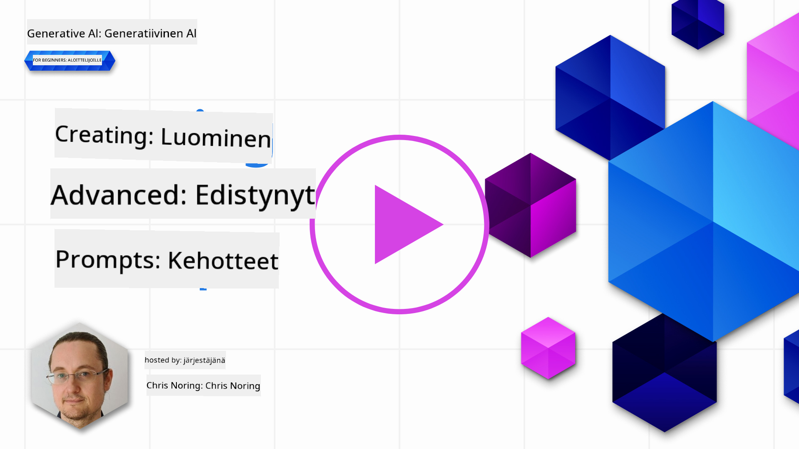

<!--
CO_OP_TRANSLATOR_METADATA:
{
  "original_hash": "b2651fb16bcfbc62b8e518751ed90fdb",
  "translation_date": "2025-10-17T19:37:49+00:00",
  "source_file": "05-advanced-prompts/README.md",
  "language_code": "fi"
}
-->
# Kehittyneiden kehotteiden luominen

[](https://youtu.be/BAjzkaCdRok?si=NmUIyRf7-cDgbjtt)

Kerrataanpa edellisen luvun oppeja:

> Kehotetekniikka on prosessi, jossa **ohjaamme mallia kohti relevantimpia vastauksia** antamalla hyödyllisempiä ohjeita tai kontekstia.

Kehotteiden kirjoittamisessa on myös kaksi vaihetta: kehotteen rakentaminen antamalla relevanttia kontekstia ja _optimointi_, eli kehotteen asteittainen parantaminen.

Tässä vaiheessa meillä on perustiedot kehotteiden kirjoittamisesta, mutta meidän täytyy syventyä aiheeseen. Tässä luvussa siirrytään kokeilemasta erilaisia kehotteita siihen, että ymmärretään, miksi yksi kehotus on parempi kuin toinen. Opit rakentamaan kehotteita käyttämällä perusmenetelmiä, joita voi soveltaa mihin tahansa LLM:ään.

## Johdanto

Tässä luvussa käsitellään seuraavia aiheita:

- Laajenna kehotetekniikan osaamistasi soveltamalla erilaisia tekniikoita kehotteisiisi.
- Määritä kehotteesi tuottamaan vaihtelevaa tai ennustettavaa sisältöä.

## Oppimistavoitteet

Tämän luvun jälkeen osaat:

- Soveltaa kehotetekniikoita, jotka parantavat kehotteidesi tuloksia.
- Suorittaa kehotuksia, jotka ovat joko vaihtelevia tai deterministisiä.

## Kehotetekniikka

Kehotetekniikka on prosessi, jossa luodaan kehotteita, jotka tuottavat halutun lopputuloksen. Kehotetekniikka ei ole insinööritiede, vaan pikemminkin joukko tekniikoita, joita voit soveltaa saadaksesi halutun lopputuloksen.

### Esimerkki kehotteesta

Otetaan yksinkertainen kehotus, kuten tämä:

> Luo 10 kysymystä maantiedosta.

Tässä kehotteessa sovelletaan itse asiassa useita erilaisia kehotetekniikoita.

Puretaanpa tämä osiin.

- **Konteksti**, määrität, että sen tulisi koskea "maantietoa".
- **Tuloksen rajoittaminen**, haluat enintään 10 kysymystä.

### Yksinkertaisten kehotteiden rajoitukset

Saatat saada tai olla saamatta haluttua lopputulosta. Saat kysymyksesi luotua, mutta maantieto on laaja aihe, eikä lopputulos välttämättä vastaa toiveitasi seuraavista syistä:

- **Laaja aihe**, et tiedä, koskeeko se maita, pääkaupunkeja, jokia ja niin edelleen.
- **Muoto**, entä jos halusit kysymysten olevan tietyssä muodossa?

Kuten näet, kehotteiden luomisessa on paljon huomioitavaa.

Olemme tähän mennessä nähneet yksinkertaisen kehotteen esimerkin, mutta generatiivinen tekoäly pystyy paljon muuhunkin auttaakseen ihmisiä eri rooleissa ja toimialoilla. Tutustutaan seuraavaksi joihinkin perusmenetelmiin.

### Kehotetekniikat

Ensinnäkin meidän täytyy ymmärtää, että kehotus on LLM:n _emergentti_ ominaisuus, mikä tarkoittaa, että se ei ole malliin sisäänrakennettu ominaisuus, vaan jotain, jonka huomaamme mallia käyttäessämme.

On olemassa joitakin perusmenetelmiä, joita voimme käyttää LLM:n kehotteisiin. Tutustutaan niihin.

- **Zero-shot-kehotus**, tämä on kehotustekniikoista yksinkertaisin. Se on yksittäinen kehotus, joka pyytää vastausta LLM:ltä pelkästään sen koulutusdatan perusteella.
- **Few-shot-kehotus**, tämä kehotustyyppi ohjaa LLM:ää antamalla 1 tai useampia esimerkkejä, joihin se voi tukeutua vastauksensa luomisessa.
- **Ajatusketju**, tämä kehotustyyppi opastaa LLM:ää pilkkomaan ongelman vaiheiksi.
- **Luotu tieto**, kehotteen vastausta voi parantaa antamalla kehotteen lisäksi luotuja faktoja tai tietoa.
- **Vähimmästä enimmäiseen**, kuten ajatusketju, tämä tekniikka koskee ongelman pilkkomista sarjaksi vaiheita ja pyytää näitä vaiheita suoritettavaksi järjestyksessä.
- **Itseparannus**, tämä tekniikka koskee LLM:n vastauksen arviointia ja sen parantamista pyytämällä.
- **Maieuttinen kehotus**, tässä halutaan varmistaa, että LLM:n vastaus on oikea, ja pyydetään sitä selittämään vastauksen eri osia. Tämä on eräänlainen itseparannus.

### Zero-shot-kehotus

Tämä kehotustyyli on hyvin yksinkertainen, se koostuu yhdestä kehotuksesta. Tämä tekniikka on todennäköisesti se, jota käytät aloittaessasi LLM:ien opettelun. Tässä esimerkki:

- Kehotus: "Mitä on algebra?"
- Vastaus: "Algebra on matematiikan haara, joka tutkii matemaattisia symboleja ja sääntöjä niiden käsittelemiseksi."

### Few-shot-kehotus

Tämä kehotustyyli auttaa mallia antamalla muutamia esimerkkejä pyynnön ohella. Se koostuu yhdestä kehotuksesta, jossa on lisätietoa tehtävästä. Tässä esimerkki:

- Kehotus: "Kirjoita runo Shakespearen tyyliin. Tässä muutamia esimerkkejä Shakespearen soneteista:
  Sonetti 18: 'Vertaisinko sinua kesäpäivään? Olet kauniimpi ja tasaisempi...'
  Sonetti 116: 'Älkäämme salliko todellisten mielten liittoon esteitä. Rakkaus ei ole rakkautta, joka muuttuu, kun muutos sen kohtaa...'
  Sonetti 132: 'Silmiäsi rakastan, ja ne, ikään kuin sääliä minut, Tietäen sydämesi kiduttavan minua halveksunnalla,...'
  Nyt kirjoita sonetti kuun kauneudesta."
- Vastaus: "Taivaan yllä kuu lempeästi loistaa, Hopeisessa valossa, joka heittää hellän armonsa,..."

Esimerkit antavat LLM:lle kontekstin, muodon tai tyylin halutusta lopputuloksesta. Ne auttavat mallia ymmärtämään tietyn tehtävän ja tuottamaan tarkempia ja relevantimpia vastauksia.

### Ajatusketju

Ajatusketju on erittäin mielenkiintoinen tekniikka, sillä siinä LLM viedään läpi sarjan vaiheita. Ideana on ohjeistaa LLM:ää siten, että se ymmärtää, miten tehdä jotain. Tarkastellaan seuraavaa esimerkkiä, ensin ilman ajatusketjua:

    - Kehotus: "Alice'lla on 5 omenaa, hän heittää 3 omenaa, antaa 2 Bobille ja Bob antaa yhden takaisin, kuinka monta omenaa Alice'lla on?"
    - Vastaus: 5

LLM vastaa 5, mikä on väärin. Oikea vastaus on 1 omena, laskennan mukaan (5 -3 -2 + 1 = 1).

Kuinka voimme opettaa LLM:ää tekemään tämä oikein?

Kokeillaan ajatusketjua. Ajatusketjun soveltaminen tarkoittaa:

1. Anna LLM:lle vastaava esimerkki.
1. Näytä laskenta ja miten se lasketaan oikein.
1. Anna alkuperäinen kehotus.

Näin:

- Kehotus: "Lisalla on 7 omenaa, hän heittää 1 omenan, antaa 4 omenaa Bartille ja Bart antaa yhden takaisin:
  7 -1 = 6
  6 -4 = 2
  2 +1 = 3  
  Alice'lla on 5 omenaa, hän heittää 3 omenaa, antaa 2 Bobille ja Bob antaa yhden takaisin, kuinka monta omenaa Alice'lla on?"
  Vastaus: 1

Huomaa, kuinka kirjoitamme huomattavasti pidemmän kehotteen, jossa on toinen esimerkki, laskenta ja sitten alkuperäinen kehotus, ja päädymme oikeaan vastaukseen 1.

Kuten näet, ajatusketju on erittäin tehokas tekniikka.

### Luotu tieto

Monesti, kun haluat rakentaa kehotteen, haluat tehdä sen käyttäen oman yrityksesi dataa. Haluat osan kehotteesta olevan yritykseltä ja toisen osan olevan varsinainen kehotus, joka sinua kiinnostaa.

Esimerkiksi, jos työskentelet vakuutusalalla, kehotteesi voisi näyttää tältä:

```text
{{company}}: {{company_name}}
{{products}}:
{{products_list}}
Please suggest an insurance given the following budget and requirements:
Budget: {{budget}}
Requirements: {{requirements}}
```

Yllä näet, kuinka kehotus on rakennettu mallipohjaa käyttäen. Mallipohjassa on useita muuttujia, jotka on merkitty `{{variable}}`, ja ne korvataan todellisilla arvoilla yrityksen API:sta.

Tässä esimerkki siitä, miltä kehotus voisi näyttää, kun muuttujat on korvattu yrityksesi sisällöllä:

```text
Insurance company: ACME Insurance
Insurance products (cost per month):
- Car, cheap, 500 USD
- Car, expensive, 1100 USD
- Home, cheap, 600 USD
- Home, expensive, 1200 USD
- Life, cheap, 100 USD

Please suggest an insurance given the following budget and requirements:
Budget: $1000
Requirements: Car, Home, and Life insurance
```

Kun tämä kehotus ajetaan LLM:n läpi, se tuottaa vastauksen, kuten tämä:

```output
Given the budget and requirements, we suggest the following insurance package from ACME Insurance:
- Car, cheap, 500 USD
- Home, cheap, 600 USD
- Life, cheap, 100 USD
Total cost: $1,200 USD
```

Kuten näet, se ehdottaa myös henkivakuutusta, mitä sen ei pitäisi tehdä. Tämä tulos osoittaa, että meidän täytyy optimoida kehotetta tekemällä siitä selkeämpi sen suhteen, mitä se voi sallia. Muutaman _yrityksen ja erehdyksen_ jälkeen päädymme seuraavaan kehotteeseen:

```text
Insurance company: ACME Insurance
Insurance products (cost per month):
- type: Car, cheap, cost: 500 USD
- type: Car, expensive, cost: 1100 USD
- type: Home, cheap, cost: 600 USD
- type: Home, expensive, cost: 1200 USD
- type: Life, cheap, cost: 100 USD

Please suggest an insurance given the following budget and requirements:
Budget: $1000 restrict choice to types: Car, Home
```

Huomaa, kuinka _tyypin_ ja _kustannuksen_ lisääminen sekä avainsanan _rajoita_ käyttö auttavat LLM:ää ymmärtämään, mitä haluamme.

Nyt saamme seuraavan vastauksen:

```output
Given the budget and requirements, we suggest the Car, Cheap insurance product which costs 500 USD per month.
```

Tämän esimerkin tarkoitus oli osoittaa, että vaikka käytämme perusmenetelmää, kuten _luotua tietoa_, meidän täytyy silti optimoida kehotetta useimmissa tapauksissa saadaksemme halutun lopputuloksen.

### Vähimmästä enimmäiseen

Vähimmästä enimmäiseen -kehotuksen idea on pilkkoa suurempi ongelma osaprobleemeiksi. Näin autat LLM:ää "valloittamaan" suuremman ongelman. Hyvä esimerkki voisi olla datatiede, jossa voit pyytää LLM:ää jakamaan ongelman seuraavasti:

> Kehotus: Kuinka suorittaa datatiedettä 5 vaiheessa?

AI-avustaja vastaa:

1. Kerää dataa
1. Puhdista data
1. Analysoi data
1. Visualisoi data
1. Esitä data

### Itseparannus, arvioi tulokset

Generatiivisten tekoälyjen ja LLM:ien kanssa et voi luottaa sokeasti niiden tuottamaan sisältöön. Sinun täytyy varmistaa sen oikeellisuus. Loppujen lopuksi LLM vain esittää, mikä on todennäköisin seuraava asia sanoa, ei välttämättä mikä on oikein. Siksi hyvä idea on pyytää LLM:ää arvioimaan itseään, mikä johtaa itseparannustekniikkaan.

Näin se toimii:

1. Alkuperäinen kehotus, jossa LLM:ää pyydetään ratkaisemaan ongelma
1. LLM vastaa
1. Arvioit vastauksen ja pyydät tekoälyä parantamaan sitä
1. LLM vastaa uudelleen, tällä kertaa huomioiden arvion ja ehdottaa parannuksia

Voit toistaa tätä prosessia niin monta kertaa kuin haluat.

Tässä esimerkki tämän tekniikan käytöstä:

> Kehotus: "Luo Python Web API, jossa on reitit tuotteille ja asiakkaille"

AI-vastaus:

```python
import flask
app = Flask(__name__)

@app.route('/products')
def products():
    return 'Products'

@app.route('/customers')
def customers():
    return 'Customers'
```

> Kehotus: ehdota 3 parannusta yllä olevaan koodiin

AI-vastaus:

```text
Sure, here are three suggestions to improve the code:

Import the correct module: The first line should import Flask instead of flask. The correct import statement should be from flask import Flask.

Add a main function: Add a if __name__ == '__main__': block to the end of the file to run the application when the file is executed.

Use f-strings: Use f-strings to format the return statements in the route functions. For example, return 'Products' can be changed to return f'This is the {request.path} page'.
```

```python
from flask import Flask, request

app = Flask(__name__)

@app.route('/products')
def products():
    return f'This is the {request.path} page'

@app.route('/customers')
def customers():
    return f'This is the {request.path} page'

if __name__ == '__main__':
    app.run()
```

Kuten näet, yllä oleva AI-vastaus parantaa ensimmäistä ehdotettua koodia arvioimalla ensimmäistä vastausta.

### Maieuttinen kehotus

Maieuttinen kehotus on tekniikka, joka on samanlainen kuin itseparannus, mutta siinä pyydetään LLM:ää selittämään itseään. Tavoitteena on vähentää LLM:n vastauksen epäjohdonmukaisuuksia ja varmistaa, että se päätyy oikeaan vastaukseen. Työskentelytapa on seuraava:

1. Pyydä LLM:ää vastaamaan kysymykseen
1. Pyydä LLM:ää selittämään jokainen vastausosa tarkemmin.
1. Jos havaitset epäjohdonmukaisuuksia, hylkää epäjohdonmukaiset osat.

Toista kohdat 2 ja 3, kunnes olet käynyt läpi kaikki osat ja olet tyytyväinen vastaukseen.

Tässä esimerkki kehotuksesta:

> Kehotus: Kuinka voin luoda kriisisuunnitelman pandemian lieventämiseksi 5 vaiheessa?
> LLM-vastaus:

```text
1. Identify the risks
1. Identify the stakeholders
1. Identify the resources
1. Identify the actions
1. Identify the communication channels
```

Se on tunnistanut 5 vaihetta, mutta voimmeko määrittää, onko tämä oikein? Pyydetään LLM:ää selittämään jokainen vaihe tarkemmin:

> Kehotus: Selitä ensimmäinen vaihe tarkemmin, mitkä ovat pandemian riskit yksityiskohtaisesti?

```text
The risks are the following:

- Loss of life
- Loss of business
- Loss of reputation
- Loss of customers
- Loss of employees
```

Tässä vaiheessa haluamme varmistaa, että LLM on oikeassa, joten pyydämme sitä selittämään ensimmäisen riskin tarkemmin ja toivomme, että se on johdonmukainen yllä olevan vastauksen kanssa:

> Kehotus: Pandemiassa, mikä on suurin riski ja miksi?

```text
The biggest risk is loss of life because it's the most important thing to protect.
```

> Mitkä ovat pandemian kaksi suurinta riskiä?

```text
The two biggest risks are loss of life and loss of business.
```

Tässä vaiheessa LLM on johdonmukainen ja mainitsee "elämän" ja "liiketoiminnan" suurimpina riskeinä. Voimme nyt jatkaa seuraavaan vaiheeseen ja tuntea olomme melko varmaksi. Kuitenkin meidän ei pitäisi luottaa LLM:ään sokeasti, vaan meidän tulisi aina varmistaa sen tuottama sisältö.

## Vaihtele tuotostasi

LLM:t ovat luonteeltaan ei-deterministisiä, mikä tarkoittaa, että saat eri tuloksia joka kerta, kun suoritat saman kehotteen. Kokeile esimerkiksi seuraavaa kehotusta:

> "Luo koodi Python Web API:lle"

```python
# Import necessary modules
import flask
from flask import request, jsonify

# Create a Flask app
app = flask.Flask(__name__)

# Create a route for the API
@app.route('/api', methods=['GET'])
def api():
    # Get the data from the request
    data = request.args

    # Process the data
    result = process_data(data)

    # Return the result as JSON
    return jsonify(result)

# Function to process the data
def process_data(data):
    # Do something with the data
    result = data + 1

    # Return the result
    return result

# Run the app
if __name__ == '__main__':
    app.run()

```

Saman kehotuksen suorittaminen uudelleen tuottaa hieman erilaisen vastauksen:

```python
#import necessary packages
import flask
from flask import request, jsonify

#create the Flask application
app = flask.Flask(__name__)
app.config["DEBUG"] = True

#create a list of books
books = [
    {'id': 0,
     'title': 'A Fire Upon the Deep',
     'author': 'Vernor Vinge',
     'first_sentence': 'The coldsleep itself was dreamless.',
     'year_published': '1992'},
    {'id': 1,
     'title': 'The Ones Who Walk Away From Omelas',
     'author': 'Ursula K. Le Guin',
     'first_sentence': 'With a clamor of bells that set the swallows soaring, the Festival of Summer came to the city Omelas, bright-towered by the sea.',
     'published': '1973'},
    {'id': 2,
     'title': 'Dhalgren',
     'author': 'Samuel R. Delany',
     'first_sentence': 'to wound the autumnal city.',
     'published': '1975'}
]

#create an endpoint for the API
@app.route('/', methods=['GET'])
def home():
    return '''<h1>Books API</h1>
<p>A prototype API for retrieving books.</p>'''

#create an endpoint to return all books
@app.route('/api/v1/resources/books/all', methods=['GET'])
def api_all():
    return jsonify(books)

#create an endpoint to return a single book
@app.route('/api/v1/resources/books', methods=['GET'])
def api_id():
    #check if an ID was provided as part of the URL
    #if ID is provided, assign it to a variable
    #if no ID is provided, display an error
    if 'id' in request.args:
        id = int(request.args['id'])
    else:
        return "Error: No id field provided. Please specify an id."

    #create an empty list for our results
    results = []

    #loop through the data and match results that fit the requested ID
    #IDs are unique, but other fields might return many results
    for book in books:
        if book['id'] == id:
            results.append(book)

    #use the jsonify function from Flask to convert our list of
    #Python dictionaries to the JSON format
    return jsonify(results)

app.run()
```

> Onko vaihteleva tuotos ongelma?

Riippuu siitä, mitä yrität tehdä. Jos haluat tietyn vastauksen, se on ongelma. Jos olet ok vaihtelevan tuotoksen kanssa, kuten "Luo mitkä tahansa 3 kysymystä maantiedosta", se ei ole ongelma.

### Käytä lämpötilaa tuotoksen vaihteluun

Okei, olemme päättäneet, että haluamme rajoittaa tuotosta ennustettavammaksi, eli deterministisemmäksi. Kuinka teemme sen?

Lämpötila on arvo välillä 0 ja 1, jossa 0 on kaikkein deterministisin ja 1 kaikkein vaihtelevin. Oletusarvo on 0.7. Katsotaanpa, mitä tapahtuu kahdella saman kehotuksen suorittamisella, kun lämpötila asetetaan arvoon 0.1:

> "Luo koodi Python Web API:lle"

```python
#import necessary libraries
import flask
from flask import request, jsonify

#create an instance of the Flask class
app = flask.Flask(__name__)

#create an endpoint for the API
@app.route('/api/v1/endpoint', methods=['GET'])
def api_endpoint():
    #get the request data
    data = request.get_json()

    #process the data
    result = process_data(data)

    #return the result
    return jsonify(result)

#function to process the data
def process_data(data):
    #process the data
    result = {'result': 'success'}

    #return the result
    return result

#run the Flask app
if __name__ == '__main__':
    app.run()

```

Kehotuksen suorittaminen uudelleen tuottaa tämän tuloksen:

```python
#import necessary libraries
import flask
from flask import request, jsonify

#create a Flask app
app = flask.Flask(__name__)

#create a route for the API
@app.route('/api', methods=['GET'])
def api_call():
    #get the data from the request
    data = request.get_json()

    #process the data
    result = process_data(data)

    #return the result
    return jsonify(result)

#define the process_data function
def process_data(data):
    #do something with the data
    result = data + 1

    #return the result
    return result

#run the app
if __name__ == '__main__':
    app.run()

```

Näiden kahden tuotoksen välillä on vain pieni ero. Tehdäänpä päinvastoin tällä kertaa, asetetaan lämpötila arvoon 0.9:

```python
# Import necessary libraries
import flask
from flask import request, jsonify

# Create a Flask app
app = flask.Flask(__name__)

# Create a route for the API
@app.route('/api', methods=['GET'])
def api_call():
    # Get the data from the request
    data = request.args

    # Process the data
    result = process_data(data)

    # Return the result
    return jsonify(result)

# Function to process the data
def process_data(data):
    # Do something with the data
    result = data + 1

    # Return the result
    return result

# Run the app
if __name__ == '__main__':
    app.run()

```

ja toinen yritys lämpötilan arvolla 0.9:

```python
import flask
from flask import request, jsonify

# create the Flask app
app = flask.Flask(__name__)
app.config['DEBUG'] = True

# create some test data
books = [
    {'id': 0, 'title': 'A Fire Upon The Deep', 'author': 'Vernor Vinge', 'first_sentence': 'The coldsleep itself was dreamless.', 'year_published': '1992'},
    {'id': 1, 'title': 'The Ones Who Walk Away From Omelas', 'author': 'Ursula K. Le Guin', 'first_sentence': 'With a clamor of bells that set the swallows soaring, the Festival of Summer came to the city Omelas, bright-towered by the sea.', 'published': '1973'},
    {'id': 2, 'title': 'Dhalgren', 'author': 'Samuel R. Delany', 'first_sentence': 'to wound the autumnal city.', 'published': '1975'}
]

# create an endpoint
@app.route('/', methods=['GET'])
def home():
    return '''<h1>Welcome to our book API!</h1>'''

@app.route('/api/v1/resources/books

```

Kuten näet, tulokset eivät voisi olla monimuotoisempia.

> Huomaa, että on olemassa enemmän parametreja, joita voit muuttaa saadaksesi vaihtelevia tuloksia, kuten top-k, top-p, toistopenaltiot, pituuspenaltiot ja monimuotoisuuspenaltiot, mutta nämä ovat tämän oppimateriaalin ulkopuolella.

## Hyvät käytännöt

On olemassa monia käytäntöjä, joita voit soveltaa saadaksesi haluamasi tulokset. Löydät oman tyylisi, kun käytät kehotteita yhä enemmän.

Lisäksi niihin tekniikoihin, joita olemme käsitelleet, on joitakin hyviä käytäntöjä, joita kannattaa harkita LLM:n kehotteita luodessa.

Tässä joitakin hyviä käytäntöjä:

- **Määrittele konteksti**. Konteksti on tärkeä, mitä tarkemmin voit määritellä esimerkiksi alan, aiheen jne., sitä parempi.
- Rajaa tulos. Jos haluat tietyn määrän kohteita tai tietyn pituuden, määrittele se.
- **Määrittele sekä mitä että miten**. Muista mainita sekä mitä haluat että miten haluat sen, esimerkiksi "Luo Python Web API, jossa on reitit tuotteille ja asiakkaille, jaa se kolmeen tiedostoon".
- **Käytä malleja**. Usein haluat rikastaa kehotteitasi yrityksesi datalla. Käytä malleja tähän. Mallit voivat sisältää muuttujia, jotka korvaat todellisella datalla.
- **Kirjoita oikein**. LLM:t voivat antaa sinulle oikean vastauksen, mutta jos kirjoitat oikein, saat paremman vastauksen.

## Tehtävä

Tässä on Python-koodi, joka näyttää, kuinka rakentaa yksinkertainen API Flaskin avulla:

```python
from flask import Flask, request

app = Flask(__name__)

@app.route('/')
def hello():
    name = request.args.get('name', 'World')
    return f'Hello, {name}!'

if __name__ == '__main__':
    app.run()
```
  
Käytä tekoälyavustajaa, kuten GitHub Copilotia tai ChatGPT:tä, ja sovella "itseparannus"-tekniikkaa koodin parantamiseksi.

## Ratkaisu

Yritä ratkaista tehtävä lisäämällä sopivia kehotteita koodiin.

> [!TIP]  
> Muotoile kehotus pyytääksesi parannuksia, on hyvä idea rajata parannusten määrä. Voit myös pyytää parannuksia tietyllä tavalla, esimerkiksi arkkitehtuurin, suorituskyvyn, turvallisuuden jne. osalta.

[Ratkaisu](../../../05-advanced-prompts/python/aoai-solution.py)

## Tietotesti

Miksi käyttäisin chain-of-thought-kehotteita? Näytä yksi oikea vastaus ja kaksi väärää vastausta.

1. Opettaakseni LLM:lle, kuinka ratkaista ongelma.  
1. B, Opettaakseni LLM:lle, kuinka löytää virheitä koodista.  
1. C, Ohjeistaakseni LLM:ää keksimään erilaisia ratkaisuja.  

A: 1, koska chain-of-thought tarkoittaa LLM:n opettamista ratkaisemaan ongelma tarjoamalla sille sarjan vaiheita, samankaltaisia ongelmia ja niiden ratkaisuja.

## 🚀 Haaste

Käytit juuri itseparannus-tekniikkaa tehtävässä. Ota mikä tahansa ohjelma, jonka olet rakentanut, ja mieti, mitä parannuksia haluaisit tehdä siihen. Käytä nyt itseparannus-tekniikkaa ehdotettujen muutosten toteuttamiseen. Mitä mieltä olit tuloksesta, parempi vai huonompi?

## Hienoa työtä! Jatka oppimistasi

Tämän oppitunnin jälkeen tutustu [Generative AI Learning -kokoelmaamme](https://aka.ms/genai-collection?WT.mc_id=academic-105485-koreyst) jatkaaksesi Generative AI -tietämyksesi kehittämistä!

Siirry oppituntiin 6, jossa sovellamme kehotetekniikan osaamistamme [rakentamalla tekstin generointisovelluksia](../06-text-generation-apps/README.md?WT.mc_id=academic-105485-koreyst).

---

**Vastuuvapauslauseke**:  
Tämä asiakirja on käännetty käyttämällä tekoälypohjaista käännöspalvelua [Co-op Translator](https://github.com/Azure/co-op-translator). Vaikka pyrimme tarkkuuteen, huomioithan, että automaattiset käännökset voivat sisältää virheitä tai epätarkkuuksia. Alkuperäinen asiakirja sen alkuperäisellä kielellä tulisi pitää ensisijaisena lähteenä. Kriittisen tiedon osalta suositellaan ammattimaista ihmiskäännöstä. Emme ole vastuussa väärinkäsityksistä tai virhetulkinnoista, jotka johtuvat tämän käännöksen käytöstä.