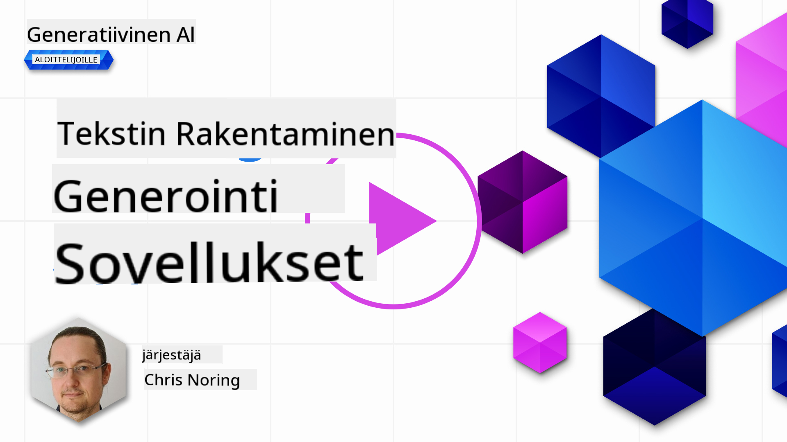

<!--
CO_OP_TRANSLATOR_METADATA:
{
  "original_hash": "5ec6c92b629564538ef397c550adb73e",
  "translation_date": "2025-05-19T17:03:44+00:00",
  "source_file": "06-text-generation-apps/README.md",
  "language_code": "fi"
}
-->
# Tekstintuotantosovellusten rakentaminen

[](https://aka.ms/gen-ai-lesson6-gh?WT.mc_id=academic-105485-koreyst)

> _(Napsauta yllä olevaa kuvaa nähdäksesi tämän oppitunnin videon)_

Olet tähän mennessä nähnyt, että on olemassa keskeisiä käsitteitä kuten kehotteet ja jopa kokonainen ala nimeltä "kehotetekniikka". Monet työkalut, kuten ChatGPT, Office 365, Microsoft Power Platform ja muut, tukevat kehotteiden käyttöä jonkin asian saavuttamiseksi.

Jotta voisit lisätä tällaisen kokemuksen sovellukseen, sinun on ymmärrettävä käsitteet kuten kehotteet, täydennykset ja valittava kirjasto, jonka kanssa työskennellä. Juuri tämän opit tässä luvussa.

## Johdanto

Tässä luvussa opit:

- openai-kirjastosta ja sen keskeisistä käsitteistä.
- Rakentamaan tekstintuotantosovelluksen käyttäen openai-kirjastoa.
- Ymmärtämään, miten käyttää käsitteitä kuten kehotteet, lämpötila ja tokenit tekstintuotantosovelluksen rakentamiseen.

## Oppimistavoitteet

Tämän oppitunnin lopussa osaat:

- Selittää, mikä tekstintuotantosovellus on.
- Rakentaa tekstintuotantosovelluksen käyttäen openai-kirjastoa.
- Määrittää sovelluksesi käyttämään enemmän tai vähemmän tokeneita ja myös muuttaa lämpötilaa saadaksesi vaihtelevan lopputuloksen.

## Mikä on tekstintuotantosovellus?

Normaalisti kun rakennat sovelluksen, sillä on jonkinlainen käyttöliittymä, kuten seuraavat:

- Komentopohjainen. Konsolisovellukset ovat tyypillisiä sovelluksia, joissa kirjoitat komennon ja se suorittaa tehtävän. Esimerkiksi `git` on komentopohjainen sovellus.
- Käyttöliittymä (UI). Joillakin sovelluksilla on graafiset käyttöliittymät (GUI), joissa voit napsauttaa painikkeita, syöttää tekstiä, valita vaihtoehtoja ja muuta.

### Konsoli- ja käyttöliittymäsovellukset ovat rajallisia

Vertaa sitä komentopohjaiseen sovellukseen, jossa kirjoitat komennon:

- **Se on rajallinen**. Et voi vain kirjoittaa mitä tahansa komentoa, vain niitä, joita sovellus tukee.
- **Kielikohtainen**. Jotkut sovellukset tukevat monia kieliä, mutta oletusarvoisesti sovellus on rakennettu tietylle kielelle, vaikka voitkin lisätä lisää kielitukea.

### Tekstintuotantosovellusten edut

Miten tekstintuotantosovellus sitten eroaa?

Tekstintuotantosovelluksessa sinulla on enemmän joustavuutta, et ole rajoitettu tiettyihin komentoihin tai tiettyyn syöttökieleen. Sen sijaan voit käyttää luonnollista kieltä vuorovaikutuksessa sovelluksen kanssa. Toinen etu on, että koska olet jo vuorovaikutuksessa tietolähteen kanssa, joka on koulutettu laajalla tietokorpuksella, perinteinen sovellus saattaa olla rajoitettu siihen, mitä tietokannassa on.

### Mitä voin rakentaa tekstintuotantosovelluksella?

Voit rakentaa monia asioita. Esimerkiksi:

- **Chatbot**. Chatbot, joka vastaa kysymyksiin aiheista, kuten yrityksestäsi ja sen tuotteista, voisi olla hyvä valinta.
- **Apuväline**. LLM:t ovat erinomaisia esimerkiksi tekstin tiivistämisessä, tekstistä oivallusten saamisessa, tekstin tuottamisessa kuten ansioluetteloissa ja muussa.
- **Koodiassistentti**. Riippuen käyttämästäsi kielimallista, voit rakentaa koodiassistentin, joka auttaa sinua kirjoittamaan koodia. Esimerkiksi voit käyttää tuotetta kuten GitHub Copilot sekä ChatGPT auttaaksesi sinua koodin kirjoittamisessa.

## Miten voin aloittaa?

Sinun on löydettävä tapa integroitua LLM:ään, mikä yleensä sisältää seuraavat kaksi lähestymistapaa:

- Käytä API:a. Tässä rakennat verkkopyyntöjä kehotteellasi ja saat takaisin tuotettua tekstiä.
- Käytä kirjastoa. Kirjastot auttavat kapseloimaan API-kutsut ja tekevät niistä helpompia käyttää.

## Kirjastot/SDK:t

On muutamia tunnettuja kirjastoja, jotka toimivat LLM:ien kanssa, kuten:

- **openai**, tämä kirjasto tekee malliin yhdistämisestä ja kehotteiden lähettämisestä helppoa.

Sitten on kirjastoja, jotka toimivat korkeammalla tasolla, kuten:

- **Langchain**. Langchain on hyvin tunnettu ja tukee Pythonia.
- **Semantic Kernel**. Semantic Kernel on Microsoftin kirjasto, joka tukee kieliä kuten C#, Python ja Java.

## Ensimmäinen sovellus käyttäen openai

Katsotaan, miten voimme rakentaa ensimmäisen sovelluksemme, mitä kirjastoja tarvitsemme, kuinka paljon on tarpeen ja niin edelleen.

### Asenna openai

On monia kirjastoja, jotka mahdollistavat OpenAI:n tai Azure OpenAI:n kanssa vuorovaikutuksen. On mahdollista käyttää useita ohjelmointikieliä kuten C#, Python, JavaScript, Java ja muita. Olemme valinneet käyttää `openai` Python-kirjastoa, joten käytämme `pip` sen asentamiseen.

```bash
pip install openai
```

### Luo resurssi

Sinun on suoritettava seuraavat vaiheet:

- Luo tili Azuren palvelussa [https://azure.microsoft.com/free/](https://azure.microsoft.com/free/?WT.mc_id=academic-105485-koreyst).
- Hanki pääsy Azure OpenAI:hin. Mene osoitteeseen [https://learn.microsoft.com/azure/ai-services/openai/overview#how-do-i-get-access-to-azure-openai](https://learn.microsoft.com/azure/ai-services/openai/overview#how-do-i-get-access-to-azure-openai?WT.mc_id=academic-105485-koreyst) ja pyydä pääsyä.

  > [!NOTE]
  > Kirjoitushetkellä sinun on haettava pääsyä Azure OpenAI:hin.

- Asenna Python <https://www.python.org/>
- Luo Azure OpenAI Service -resurssi. Katso tämä opas, miten [luodaan resurssi](https://learn.microsoft.com/azure/ai-services/openai/how-to/create-resource?pivots=web-portal?WT.mc_id=academic-105485-koreyst).

### Paikanna API-avain ja päätepiste

Tässä vaiheessa sinun on kerrottava `openai` kirjastolle, mitä API-avainta käyttää. Löytääksesi API-avaimesi, mene "Avaimet ja päätepiste" osioon Azure OpenAI -resurssissasi ja kopioi "Avain 1" arvo.


Nyt kun olet kopioinut tämän tiedon, annetaan kirjastojen käyttää sitä.

> [!NOTE]
> On suositeltavaa erottaa API-avain koodistasi. Voit tehdä tämän käyttämällä ympäristömuuttujia.
>
> - Aseta ympäristömuuttuja `OPENAI_API_KEY` to your API key.
>   `export OPENAI_API_KEY='sk-...'`

### Määritä konfiguraatio Azurelle

Jos käytät Azure OpenAI:ta, tässä on ohjeet konfiguraation asettamiseen:

```python
openai.api_type = 'azure'
openai.api_key = os.environ["OPENAI_API_KEY"]
openai.api_version = '2023-05-15'
openai.api_base = os.getenv("API_BASE")
```

Yllä asetamme seuraavat:

- `api_type` to `azure`. This tells the library to use Azure OpenAI and not OpenAI.
- `api_key`, this is your API key found in the Azure Portal.
- `api_version`, this is the version of the API you want to use. At the time of writing, the latest version is `2023-05-15`.
- `api_base`, this is the endpoint of the API. You can find it in the Azure Portal next to your API key.

> [!NOTE] > `os.getenv` is a function that reads environment variables. You can use it to read environment variables like `OPENAI_API_KEY` and `API_BASE`. Set these environment variables in your terminal or by using a library like `dotenv`.

## Generate text

The way to generate text is to use the `Completion` luokka. Tässä on esimerkki:

```python
prompt = "Complete the following: Once upon a time there was a"

completion = openai.Completion.create(model="davinci-002", prompt=prompt)
print(completion.choices[0].text)
```

Yllä olevassa koodissa luomme täydennysobjektin ja annamme sille mallin, jota haluamme käyttää, sekä kehotteen. Sitten tulostamme tuotetun tekstin.

### Keskustelutäydennykset

Tähän mennessä olet nähnyt, kuinka olemme käyttäneet `Completion` to generate text. But there's another class called `ChatCompletion`, joka sopii paremmin chatboteille. Tässä on esimerkki sen käytöstä:

```python
import openai

openai.api_key = "sk-..."

completion = openai.ChatCompletion.create(model="gpt-3.5-turbo", messages=[{"role": "user", "content": "Hello world"}])
print(completion.choices[0].message.content)
```

Lisää tästä toiminnallisuudesta tulevassa luvussa.

## Harjoitus - ensimmäinen tekstintuotantosovelluksesi

Nyt kun olemme oppineet, miten openai asennetaan ja konfiguroidaan, on aika rakentaa ensimmäinen tekstintuotantosovelluksesi. Rakenna sovelluksesi seuraamalla näitä vaiheita:

1. Luo virtuaaliympäristö ja asenna openai:

   ```bash
   python -m venv venv
   source venv/bin/activate
   pip install openai
   ```

   > [!NOTE]
   > Jos käytät Windowsia, kirjoita `venv\Scripts\activate` instead of `source venv/bin/activate`.

   > [!NOTE]
   > Locate your Azure OpenAI key by going to [https://portal.azure.com/](https://portal.azure.com/?WT.mc_id=academic-105485-koreyst) and search for `Open AI` and select the `Open AI resource` and then select `Keys and Endpoint` and copy the `Key 1` arvo.

1. Luo _app.py_ tiedosto ja anna sille seuraava koodi:

   ```python
   import openai

   openai.api_key = "<replace this value with your open ai key or Azure OpenAI key>"

   openai.api_type = 'azure'
   openai.api_version = '2023-05-15'
   openai.api_base = "<endpoint found in Azure Portal where your API key is>"
   deployment_name = "<deployment name>"

   # add your completion code
   prompt = "Complete the following: Once upon a time there was a"
   messages = [{"role": "user", "content": prompt}]

   # make completion
   completion = openai.chat.completions.create(model=deployment_name, messages=messages)

   # print response
   print(completion.choices[0].message.content)
   ```

   > [!NOTE]
   > Jos käytät Azure OpenAI:ta, sinun on asetettava `api_type` to `azure` and set the `api_key` Azure OpenAI -avaimeesi.

   Sinun pitäisi nähdä tuloste, joka näyttää seuraavalta:

   ```output
    very unhappy _____.

   Once upon a time there was a very unhappy mermaid.
   ```

## Erilaiset kehotteet, erilaisiin asioihin

Nyt olet nähnyt, miten tekstiä voidaan tuottaa kehotteella. Sinulla on jopa ohjelma käynnissä, jota voit muokata ja muuttaa tuottamaan erilaisia tekstejä.

Kehotteita voidaan käyttää kaikenlaisiin tehtäviin. Esimerkiksi:

- **Tuottaa tietynlaista tekstiä**. Voit esimerkiksi tuottaa runon, kysymyksiä tietovisaan jne.
- **Etsiä tietoa**. Voit käyttää kehotteita etsimään tietoa, kuten seuraava esimerkki 'Mitä CORS tarkoittaa web-kehityksessä?'.
- **Tuottaa koodia**. Voit käyttää kehotteita tuottamaan koodia, esimerkiksi kehittää säännöllinen lauseke sähköpostien validointiin tai miksei tuottaa kokonainen ohjelma, kuten web-sovellus?

## Käytännöllisempi käyttötapaus: reseptigeneraattori

Kuvittele, että sinulla on aineksia kotona ja haluat kokata jotain. Tarvitset siihen reseptin. Yksi tapa löytää reseptejä on käyttää hakukonetta tai voit käyttää LLM:ää siihen.

Voit kirjoittaa kehotteen seuraavasti:

> "Näytä minulle 5 reseptiä ruoalle, jossa on seuraavat ainekset: kana, perunat ja porkkanat. Listaa per resepti kaikki käytetyt ainekset"

Annetun kehotteen perusteella saatat saada vastauksen, joka näyttää tältä:

```output
1. Roasted Chicken and Vegetables:
Ingredients:
- 4 chicken thighs
- 2 potatoes, cut into cubes
- 2 carrots, cut into cubes
- 2 tablespoons olive oil
- 2 cloves garlic, minced
- 1 teaspoon dried thyme
- 1 teaspoon dried oregano
- Salt and pepper, to taste

2. Chicken and Potato Stew:
Ingredients:
- 2 tablespoons olive oil
- 1 onion, diced
- 2 cloves garlic, minced
- 2 chicken breasts, cut into cubes
- 2 potatoes, cut into cubes
- 2 carrots, cut into cubes
- 1 teaspoon dried oregano
- 1 teaspoon dried thyme
- 1 cup chicken broth
- Salt and pepper, to taste

3. Chicken and Potato Bake:
Ingredients:
- 2 tablespoons olive oil
- 2 chicken breasts, cut into cubes
- 2 potatoes, cut into cubes
- 2 carrots, cut into cubes
- 1 onion, diced
- 2 cloves garlic, minced
- 1 teaspoon dried oregano
- 1 teaspoon dried thyme
- 1 cup chicken broth
- Salt and pepper, to taste

4. Chicken and Potato Soup:
Ingredients:
- 2 tablespoons olive oil
- 1 onion, diced
- 2 cloves garlic, minced
- 2 chicken breasts, cut into cubes
- 2 potatoes, cut into cubes
- 2 carrots, cut into cubes
- 1 teaspoon dried oregano
- 1 teaspoon dried thyme
- 4 cups chicken broth
- Salt and pepper, to taste

5. Chicken and Potato Hash:
Ingredients:
- 2 tablespoons olive oil
- 2 chicken breasts, cut into cubes
- 2 potatoes, cut into cubes
- 2 carrots, cut into cubes
- 1 onion, diced
- 2 cloves garlic, minced
- 1 teaspoon dried oregano
```

Tämä lopputulos on hieno, tiedän mitä kokata. Tässä vaiheessa hyödyllisiä parannuksia voisivat olla:

- Suodattaa pois ainekset, joista en pidä tai joille olen allerginen.
- Tuottaa ostoslista, jos minulla ei ole kaikkia aineksia kotona.

Yllä oleviin tapauksiin lisätään lisäkehotus:

> "Poista reseptit, joissa on valkosipulia, sillä olen allerginen ja korvaa se jollakin muulla. Tuota myös ostoslista resepteille, huomioiden että minulla on jo kana, perunat ja porkkanat kotona."

Nyt sinulla on uusi tulos, nimittäin:

```output
1. Roasted Chicken and Vegetables:
Ingredients:
- 4 chicken thighs
- 2 potatoes, cut into cubes
- 2 carrots, cut into cubes
- 2 tablespoons olive oil
- 1 teaspoon dried thyme
- 1 teaspoon dried oregano
- Salt and pepper, to taste

2. Chicken and Potato Stew:
Ingredients:
- 2 tablespoons olive oil
- 1 onion, diced
- 2 chicken breasts, cut into cubes
- 2 potatoes, cut into cubes
- 2 carrots, cut into cubes
- 1 teaspoon dried oregano
- 1 teaspoon dried thyme
- 1 cup chicken broth
- Salt and pepper, to taste

3. Chicken and Potato Bake:
Ingredients:
- 2 tablespoons olive oil
- 2 chicken breasts, cut into cubes
- 2 potatoes, cut into cubes
- 2 carrots, cut into cubes
- 1 onion, diced
- 1 teaspoon dried oregano
- 1 teaspoon dried thyme
- 1 cup chicken broth
- Salt and pepper, to taste

4. Chicken and Potato Soup:
Ingredients:
- 2 tablespoons olive oil
- 1 onion, diced
- 2 chicken breasts, cut into cubes
- 2 potatoes, cut into cubes
- 2 carrots, cut into cubes
- 1 teaspoon dried oregano
- 1 teaspoon dried thyme
- 4 cups chicken broth
- Salt and pepper, to taste

5. Chicken and Potato Hash:
Ingredients:
- 2 tablespoons olive oil
- 2 chicken breasts, cut into cubes
- 2 potatoes, cut into cubes
- 2 carrots, cut into cubes
- 1 onion, diced
- 1 teaspoon dried oregano

Shopping List:
- Olive oil
- Onion
- Thyme
- Oregano
- Salt
- Pepper
```

Siinä on viisi reseptiäsi ilman valkosipulia ja sinulla on myös ostoslista huomioiden mitä sinulla on jo kotona.

## Harjoitus - rakenna reseptigeneraattori

Nyt kun olemme käyneet läpi skenaarion, kirjoitetaan koodi vastaamaan esitettyä skenaariota. Tee niin seuraamalla näitä vaiheita:

1. Käytä olemassa olevaa _app.py_ tiedostoa lähtökohtana
1. Paikanna `prompt` muuttuja ja muuta sen koodi seuraavaksi:

   ```python
   prompt = "Show me 5 recipes for a dish with the following ingredients: chicken, potatoes, and carrots. Per recipe, list all the ingredients used"
   ```

   Jos ajat koodin nyt, sinun pitäisi nähdä tuloste, joka näyttää tältä:

   ```output
   -Chicken Stew with Potatoes and Carrots: 3 tablespoons oil, 1 onion, chopped, 2 cloves garlic, minced, 1 carrot, peeled and chopped, 1 potato, peeled and chopped, 1 bay leaf, 1 thyme sprig, 1/2 teaspoon salt, 1/4 teaspoon black pepper, 1 1/2 cups chicken broth, 1/2 cup dry white wine, 2 tablespoons chopped fresh parsley, 2 tablespoons unsalted butter, 1 1/2 pounds boneless, skinless chicken thighs, cut into 1-inch pieces
   -Oven-Roasted Chicken with Potatoes and Carrots: 3 tablespoons extra-virgin olive oil, 1 tablespoon Dijon mustard, 1 tablespoon chopped fresh rosemary, 1 tablespoon chopped fresh thyme, 4 cloves garlic, minced, 1 1/2 pounds small red potatoes, quartered, 1 1/2 pounds carrots, quartered lengthwise, 1/2 teaspoon salt, 1/4 teaspoon black pepper, 1 (4-pound) whole chicken
   -Chicken, Potato, and Carrot Casserole: cooking spray, 1 large onion, chopped, 2 cloves garlic, minced, 1 carrot, peeled and shredded, 1 potato, peeled and shredded, 1/2 teaspoon dried thyme leaves, 1/4 teaspoon salt, 1/4 teaspoon black pepper, 2 cups fat-free, low-sodium chicken broth, 1 cup frozen peas, 1/4 cup all-purpose flour, 1 cup 2% reduced-fat milk, 1/4 cup grated Parmesan cheese

   -One Pot Chicken and Potato Dinner: 2 tablespoons olive oil, 1 pound boneless, skinless chicken thighs, cut into 1-inch pieces, 1 large onion, chopped, 3 cloves garlic, minced, 1 carrot, peeled and chopped, 1 potato, peeled and chopped, 1 bay leaf, 1 thyme sprig, 1/2 teaspoon salt, 1/4 teaspoon black pepper, 2 cups chicken broth, 1/2 cup dry white wine

   -Chicken, Potato, and Carrot Curry: 1 tablespoon vegetable oil, 1 large onion, chopped, 2 cloves garlic, minced, 1 carrot, peeled and chopped, 1 potato, peeled and chopped, 1 teaspoon ground coriander, 1 teaspoon ground cumin, 1/2 teaspoon ground turmeric, 1/2 teaspoon ground ginger, 1/4 teaspoon cayenne pepper, 2 cups chicken broth, 1/2 cup dry white wine, 1 (15-ounce) can chickpeas, drained and rinsed, 1/2 cup raisins, 1/2 cup chopped fresh cilantro
   ```

   > HUOMIO, LLM on epädeterministinen, joten saatat saada erilaisia tuloksia joka kerta, kun suoritat ohjelman.

   Hienoa, katsotaanpa miten voimme parantaa asioita. Parantaaksemme asioita, haluamme varmistaa, että koodi on joustava, joten ainesosia ja reseptien määrää voidaan parantaa ja muuttaa.

1. Muutetaan koodi seuraavasti:

   ```python
   no_recipes = input("No of recipes (for example, 5): ")

   ingredients = input("List of ingredients (for example, chicken, potatoes, and carrots): ")

   # interpolate the number of recipes into the prompt an ingredients
   prompt = f"Show me {no_recipes} recipes for a dish with the following ingredients: {ingredients}. Per recipe, list all the ingredients used"
   ```

   Koodin testaaminen voisi näyttää tältä:

   ```output
   No of recipes (for example, 5): 3
   List of ingredients (for example, chicken, potatoes, and carrots): milk,strawberries

   -Strawberry milk shake: milk, strawberries, sugar, vanilla extract, ice cubes
   -Strawberry shortcake: milk, flour, baking powder, sugar, salt, unsalted butter, strawberries, whipped cream
   -Strawberry milk: milk, strawberries, sugar, vanilla extract
   ```

### Paranna lisäämällä suodatin ja ostoslista

Nyt meillä on toimiva sovellus, joka pystyy tuottamaan reseptejä ja se on joustava, koska se perustuu käyttäjän syötteisiin, sekä reseptien määrään että käytettyihin aineksiin.

Parantaaksemme sitä edelleen, haluamme lisätä seuraavat:

- **Suodata ainekset pois**. Haluamme pystyä suodattamaan pois ainekset, joista emme pidä tai joille olemme allergisia. Tämän muutoksen saavuttamiseksi voimme muokata olemassa olevaa kehotettamme ja lisätä suodatin ehto sen loppuun seuraavasti:

  ```python
  filter = input("Filter (for example, vegetarian, vegan, or gluten-free): ")

  prompt = f"Show me {no_recipes} recipes for a dish with the following ingredients: {ingredients}. Per recipe, list all the ingredients used, no {filter}"
  ```

  Yllä, lisäämme `{filter}` kehotteen loppuun ja otamme myös suodatin arvon käyttäjältä.

  Esimerkki ohjelman ajamisesta voisi nyt näyttää tältä:

  ```output
  No of recipes (for example, 5): 3
  List of ingredients (for example, chicken, potatoes, and carrots): onion,milk
  Filter (for example, vegetarian, vegan, or gluten-free): no milk

  1. French Onion Soup

  Ingredients:

  -1 large onion, sliced
  -3 cups beef broth
  -1 cup milk
  -6 slices french bread
  -1/4 cup shredded Parmesan cheese
  -1 tablespoon butter
  -1 teaspoon dried thyme
  -1/4 teaspoon salt
  -1/4 teaspoon black pepper

  Instructions:

  1. In a large pot, sauté onions in butter until golden brown.
  2. Add beef broth, milk, thyme, salt, and pepper. Bring to a boil.
  3. Reduce heat and simmer for 10 minutes.
  4. Place french bread slices on soup bowls.
  5. Ladle soup over bread.
  6. Sprinkle with Parmesan cheese.

  2. Onion and Potato Soup

  Ingredients:

  -1 large onion, chopped
  -2 cups potatoes, diced
  -3 cups vegetable broth
  -1 cup milk
  -1/4 teaspoon black pepper

  Instructions:

  1. In a large pot, sauté onions in butter until golden brown.
  2. Add potatoes, vegetable broth, milk, and pepper. Bring to a boil.
  3. Reduce heat and simmer for 10 minutes.
  4. Serve hot.

  3. Creamy Onion Soup

  Ingredients:

  -1 large onion, chopped
  -3 cups vegetable broth
  -1 cup milk
  -1/4 teaspoon black pepper
  -1/4 cup all-purpose flour
  -1/2 cup shredded Parmesan cheese

  Instructions:

  1. In a large pot, sauté onions in butter until golden brown.
  2. Add vegetable broth, milk, and pepper. Bring to a boil.
  3. Reduce heat and simmer for 10 minutes.
  4. In a small bowl, whisk together flour and Parmesan cheese until smooth.
  5. Add to soup and simmer for an additional 5 minutes, or until soup has thickened.
  ```

  Kuten näet, kaikki reseptit, joissa on maitoa, on suodatettu pois. Mutta jos olet laktoosi-intolerantti, saatat haluta suodattaa pois myös reseptit, joissa on juustoa, joten on tarpeen olla selkeä.

- **Tuottaa ostoslista**. Haluamme tuottaa ostoslistan, huomioiden mitä meillä jo on kotona.

  Tämän toiminnallisuuden osalta voisimme joko yrittää ratkaista kaiken yhdellä kehotteella tai voisimme jakaa sen kahteen kehotteeseen. Kokeillaan jälkimmäistä lähestymistapaa. Tässä ehdotamme lisäkehotteen lisäämistä, mutta jotta se toimisi, meidän on lisättävä ensimmäisen kehotteen tulos kontekstiksi toiselle kehotteelle.

  Paikanna koodissa osa, joka tulostaa ensimmäisen kehotteen tuloksen ja lisää seuraava koodi sen alle:

  ```python
  old_prompt_result = completion.choices[0].message.content
  prompt = "Produce a shopping list for the generated recipes and please don't include ingredients that I already have."

  new_prompt = f"{old_prompt_result} {prompt}"
  messages = [{"role": "user", "content": new_prompt}]
  completion = openai.Completion.create(engine=deployment_name, messages=messages, max_tokens=1200)

  # print response
  print("Shopping list:")
  print(completion.choices[0].message.content)
  ```

  Huomaa seuraavat:

  1. Rakennamme uuden kehotteen lisäämällä ensimmäisen kehotteen tuloksen uuteen kehotteeseen:

     ```python
     new_prompt = f"{old_prompt_result} {prompt}"
     ```

  1. Teemme uuden pyynnön, mutta huomioimme myös ensimmäisessä kehotteessa pyydettyjen tokenien määrän, joten tällä kertaa sanomme `max_tokens` olevan 1200.

     ```python
     completion = openai.Completion.create(engine=deployment_name, prompt=new_prompt, max_tokens=1200)
     ```

     Kun otamme tämän koodin testiin, saamme seuraavan tuloksen:

     ```output
     No of recipes (for example, 5): 2
     List of ingredients (for example, chicken, potatoes, and carrots): apple,flour
     Filter (for example, vegetarian, vegan, or gluten-free): sugar


     -Apple and flour pancakes: 1 cup flour, 1/2 tsp baking powder, 1/2 tsp baking soda, 1/4 tsp salt, 1 tbsp sugar, 1 egg, 1 cup buttermilk or sour milk, 1/4 cup melted butter, 1 Granny Smith apple, peeled and grated
     -Apple fritters: 1-1/2 cups flour, 1 tsp baking powder, 1/4 tsp salt, 1/4 tsp baking soda, 1/4 tsp nutmeg, 1/4 tsp cinnamon, 1/4 tsp allspice, 1/4 cup sugar, 1/4 cup vegetable shortening, 1/4 cup milk, 1 egg, 2 cups shredded, peeled apples
     Shopping list:
     -Flour, baking powder, baking soda, salt, sugar, egg, buttermilk, butter, apple, nutmeg, cinnamon, allspice
     ```

## Paranna asennustasi

Mitä meillä on tähän mennessä, on koodi, joka toimii, mutta on joitain hienosäätöjä, jotka meidän pitäisi tehdä parantaaksemme asioita edelleen. Joitakin asioita, joita meidän pitäisi tehdä, ovat:

- **Erota salaisuudet koodista**, kuten API-avain. Salaisuudet eivät kuulu koodiin ja ne tulisi tallentaa turvalliseen paikkaan. Erottaa salaisuudet koodista, voimme käyttää ympäristömuuttujia ja kirjastoja kuten `python-dotenv` to load them from a file. Here's how that would look like in code:

  1. Create a `.env` tiedosto seuraavalla sisällöllä:

     ```bash
     OPENAI_API_KEY=sk-...
     ```

     > Huomaa, että Azurea varten sinun on asetettava seuraavat ympäristömuuttujat:

     ```bash
     OPENAI_API_TYPE=azure
     OPENAI_API_VERSION=2023-05-15
     OPENAI_API_BASE=<replace>
     ```

     Koodissa lataisit ympäristömuuttujat seuraavasti:

     ```python
     from dotenv import load_dotenv

     load_dotenv()

     openai.api_key = os.environ["OPENAI_API_KEY"]
     ```

- **Sana tokenien pituudesta**. Meidän tulisi harkita, kuinka monta tokenia tarvitsemme tekstin tuottamiseen. Tokenit maksavat rahaa, joten missä mahdollista, meidän tulisi yrittää olla taloudellisia käyttämämme tokenien määrän suhteen. Esimerkiksi, voimmeko muotoilla kehotteen niin, että voimme käyttää vähemmän tokeneita?

  Muuttaaksesi käytettyjä tokeneita, voit käyttää `max_tokens` parametriä. Esimerkiksi, jos haluat käyttää 100 tokenia, tekisit seuraavasti:

  ```python
  completion = client.chat.completions.create(model=deployment, messages=messages, max_tokens=100)
  ```

- **Kokeile lämpötilan kanssa**. Lämpötila on jotain, jota emme ole tähän mennessä maininneet, mutta se on tärkeä konteksti sille, miten ohjelmamme toimii. Mitä korkeampi lämpötila-arvo on, sitä satunna

**Vastuuvapauslauseke**:  
Tämä asiakirja on käännetty käyttämällä tekoälypohjaista käännöspalvelua [Co-op Translator](https://github.com/Azure/co-op-translator). Vaikka pyrimme tarkkuuteen, huomioithan, että automaattiset käännökset voivat sisältää virheitä tai epätarkkuuksia. Alkuperäistä asiakirjaa sen alkuperäisellä kielellä tulee pitää auktoritatiivisena lähteenä. Kriittisen tiedon osalta suositellaan ammattimaista ihmiskäännöstä. Emme ole vastuussa tämän käännöksen käytöstä aiheutuvista väärinkäsityksistä tai virheellisistä tulkinnoista.