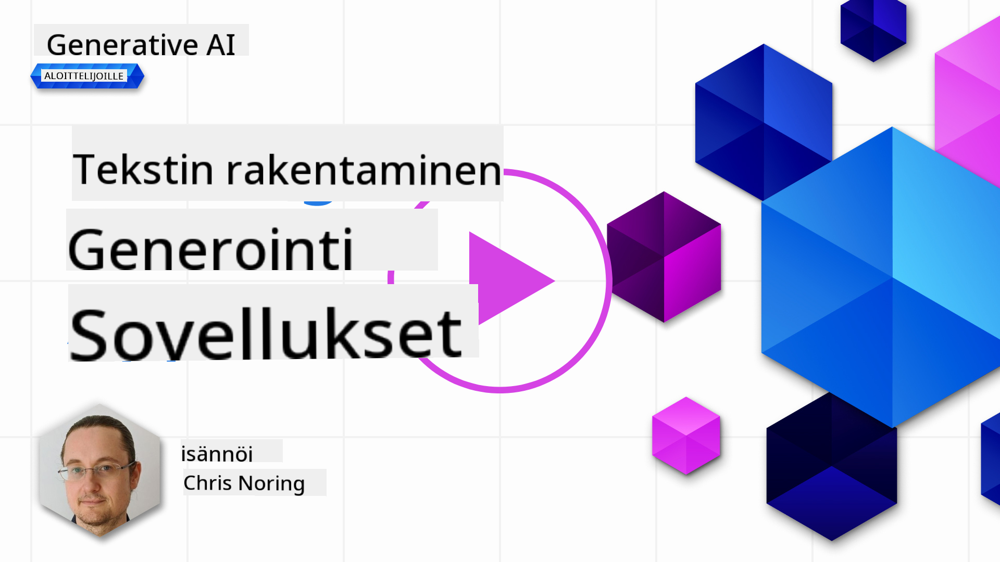

<!--
CO_OP_TRANSLATOR_METADATA:
{
  "original_hash": "5ec6c92b629564538ef397c550adb73e",
  "translation_date": "2025-06-25T14:32:31+00:00",
  "source_file": "06-text-generation-apps/README.md",
  "language_code": "fi"
}
-->
# Tekstintuotantosovellusten rakentaminen

[](https://aka.ms/gen-ai-lesson6-gh?WT.mc_id=academic-105485-koreyst)

> _(Napsauta yllä olevaa kuvaa nähdäksesi tämän oppitunnin videon)_

Tässä opetussuunnitelmassa olet tähän mennessä nähnyt, että on olemassa keskeisiä käsitteitä kuten kehotteet ja jopa kokonainen ala nimeltään "kehotetekniikka". Monet työkalut, kuten ChatGPT, Office 365, Microsoft Power Platform ja muut, tukevat sinua kehotteiden avulla saavuttamaan jotain.

Jos haluat lisätä tällaisen kokemuksen sovellukseen, sinun on ymmärrettävä käsitteitä kuten kehotteet, täydennykset ja valittava kirjasto, jonka kanssa työskennellä. Juuri tämän opit tässä luvussa.

## Johdanto

Tässä luvussa opit:

- openai-kirjastosta ja sen keskeisistä käsitteistä.
- Rakentamaan tekstintuotantosovelluksen käyttäen openai:ta.
- Ymmärtämään, kuinka käyttää käsitteitä kuten kehotteet, lämpötila ja tokenit rakentaaksesi tekstintuotantosovelluksen.

## Oppimistavoitteet

Tämän oppitunnin lopussa osaat:

- Selittää, mikä tekstintuotantosovellus on.
- Rakentaa tekstintuotantosovelluksen käyttäen openai:ta.
- Konfiguroida sovelluksesi käyttämään enemmän tai vähemmän tokeneita ja myös muuttamaan lämpötilaa, jotta saat monipuolisia tuloksia.

## Mikä on tekstintuotantosovellus?

Normaalisti, kun rakennat sovelluksen, siinä on jonkinlainen käyttöliittymä, kuten seuraavat:

- Komentopohjainen. Konsolisovellukset ovat tyypillisiä sovelluksia, joissa kirjoitat komennon ja se suorittaa tehtävän. Esimerkiksi `git` on komentopohjainen sovellus.
- Käyttöliittymä (UI). Joissakin sovelluksissa on graafisia käyttöliittymiä (GUI), joissa napsautat painikkeita, syötät tekstiä, valitset vaihtoehtoja ja muuta.

### Konsoli- ja käyttöliittymäsovellusten rajoitukset

Vertaa sitä komentopohjaiseen sovellukseen, jossa kirjoitat komennon:

- **Se on rajallinen**. Et voi kirjoittaa mitä tahansa komentoa, vaan vain niitä, joita sovellus tukee.
- **Kielispesifinen**. Jotkut sovellukset tukevat monia kieliä, mutta oletuksena sovellus on rakennettu tietylle kielelle, vaikka voitkin lisätä enemmän kielitukea.

### Tekstintuotantosovellusten edut

Miten tekstintuotantosovellus sitten eroaa?

Tekstintuotantosovelluksessa sinulla on enemmän joustavuutta, et ole rajoittunut joukkoon komentoja tai tiettyyn syöttökieleen. Sen sijaan voit käyttää luonnollista kieltä vuorovaikutukseen sovelluksen kanssa. Toinen etu on, että koska olet jo vuorovaikutuksessa tietolähteen kanssa, joka on koulutettu laajalla tietomäärällä, perinteinen sovellus saattaa olla rajoittunut siihen, mitä tietokannassa on.

### Mitä voin rakentaa tekstintuotantosovelluksella?

On monia asioita, joita voit rakentaa. Esimerkiksi:

- **Chatbot**. Chatbot, joka vastaa kysymyksiin aiheista, kuten yrityksesi ja sen tuotteet, voisi olla hyvä valinta.
- **Apuväline**. LLM:t ovat erinomaisia asioissa kuten tekstin tiivistäminen, oivallusten saaminen tekstistä, tekstin tuottaminen kuten ansioluetteloiden luominen ja paljon muuta.
- **Koodiassistentti**. Riippuen käyttämästäsi kielimallista, voit rakentaa koodiassistentin, joka auttaa sinua kirjoittamaan koodia. Esimerkiksi voit käyttää tuotetta kuten GitHub Copilot sekä ChatGPT:tä auttamaan sinua koodin kirjoittamisessa.

## Miten pääsen alkuun?

Sinun on löydettävä tapa integroitua LLM:ään, mikä yleensä sisältää seuraavat kaksi lähestymistapaa:

- Käytä API:ta. Tässä rakennat verkkopyyntöjä kehotteesi kanssa ja saat takaisin tuotettua tekstiä.
- Käytä kirjastoa. Kirjastot auttavat kapseloimaan API-kutsut ja tekevät niistä helpommin käytettäviä.

## Kirjastot/SDK:t

On muutamia tunnettuja kirjastoja, joiden kanssa voi työskennellä LLM:ien kanssa, kuten:

- **openai**, tämä kirjasto tekee malliin yhdistämisestä ja kehotteiden lähettämisestä helppoa.

Sitten on kirjastoja, jotka toimivat korkeammalla tasolla, kuten:

- **Langchain**. Langchain on hyvin tunnettu ja tukee Pythonia.
- **Semantic Kernel**. Semantic Kernel on Microsoftin kirjasto, joka tukee kieliä kuten C#, Python ja Java.

## Ensimmäinen sovellus käyttäen openai:ta

Katsotaanpa, miten voimme rakentaa ensimmäisen sovelluksemme, mitä kirjastoja tarvitsemme, kuinka paljon tarvitaan ja niin edelleen.

### Asenna openai

On olemassa monia kirjastoja OpenAI:n tai Azure OpenAI:n kanssa vuorovaikutukseen. On mahdollista käyttää lukuisia ohjelmointikieliä kuten C#, Python, JavaScript, Java ja paljon muuta. Olemme valinneet käyttää `openai` Python-kirjastoa, joten käytämme `pip` asentaaksemme sen.

```bash
pip install openai
```

### Luo resurssi

Sinun on suoritettava seuraavat vaiheet:

- Luo tili Azuren [https://azure.microsoft.com/free/](https://azure.microsoft.com/free/?WT.mc_id=academic-105485-koreyst) kautta.
- Hanki pääsy Azure OpenAI:hin. Mene [https://learn.microsoft.com/azure/ai-services/openai/overview#how-do-i-get-access-to-azure-openai](https://learn.microsoft.com/azure/ai-services/openai/overview#how-do-i-get-access-to-azure-openai?WT.mc_id=academic-105485-koreyst) ja pyydä pääsyä.

  > [!NOTE]
  > Tämän kirjoittamisen aikaan sinun on haettava pääsyä Azure OpenAI:hin.

- Asenna Python <https://www.python.org/>
- Luo Azure OpenAI Service -resurssi. Katso tämä opas siitä, miten [luoda resurssi](https://learn.microsoft.com/azure/ai-services/openai/how-to/create-resource?pivots=web-portal?WT.mc_id=academic-105485-koreyst).

### Paikanna API-avain ja päätepiste

Tässä vaiheessa sinun on kerrottava `openai` kirjastollesi, mitä API-avainta käyttää. Löytääksesi API-avaimesi, mene "Avaimet ja päätepiste" -osioon Azure OpenAI -resurssissasi ja kopioi "Avain 1" arvo.


Nyt kun olet kopioinut tämän tiedon, ohjeistetaan kirjastoja käyttämään sitä.

> [!NOTE]
> On syytä erottaa API-avain koodistasi. Voit tehdä tämän käyttämällä ympäristömuuttujia.
>
> - Aseta ympäristömuuttuja `OPENAI_API_KEY` to your API key.
>   `export OPENAI_API_KEY='sk-...'`

### Azure-konfiguraation asetus

Jos käytät Azure OpenAI:ta, tässä on, miten asetat konfiguraation:

```python
openai.api_type = 'azure'
openai.api_key = os.environ["OPENAI_API_KEY"]
openai.api_version = '2023-05-15'
openai.api_base = os.getenv("API_BASE")
```

Yllä asetamme seuraavat:

- `api_type` to `azure`. This tells the library to use Azure OpenAI and not OpenAI.
- `api_key`, this is your API key found in the Azure Portal.
- `api_version`, this is the version of the API you want to use. At the time of writing, the latest version is `2023-05-15`.
- `api_base`, this is the endpoint of the API. You can find it in the Azure Portal next to your API key.

> [!NOTE] > `os.getenv` is a function that reads environment variables. You can use it to read environment variables like `OPENAI_API_KEY` and `API_BASE`. Set these environment variables in your terminal or by using a library like `dotenv`.

## Generate text

The way to generate text is to use the `Completion`-luokka. Tässä on esimerkki:

```python
prompt = "Complete the following: Once upon a time there was a"

completion = openai.Completion.create(model="davinci-002", prompt=prompt)
print(completion.choices[0].text)
```

Yllä olevassa koodissa luomme täydennysobjektin ja välitämme mallin, jota haluamme käyttää, sekä kehotteen. Sitten tulostamme tuotetun tekstin.

### Chat-täydennykset

Tähän mennessä olet nähnyt, kuinka olemme käyttäneet `Completion` to generate text. But there's another class called `ChatCompletion`, joka soveltuu paremmin chatboteille. Tässä on esimerkki sen käytöstä:

```python
import openai

openai.api_key = "sk-..."

completion = openai.ChatCompletion.create(model="gpt-3.5-turbo", messages=[{"role": "user", "content": "Hello world"}])
print(completion.choices[0].message.content)
```

Lisää tästä toiminnallisuudesta tulevassa luvussa.

## Harjoitus - ensimmäinen tekstintuotantosovelluksesi

Nyt kun olemme oppineet, kuinka openai asennetaan ja konfiguroidaan, on aika rakentaa ensimmäinen tekstintuotantosovelluksesi. Rakenna sovelluksesi seuraamalla näitä vaiheita:

1. Luo virtuaaliympäristö ja asenna openai:

   ```bash
   python -m venv venv
   source venv/bin/activate
   pip install openai
   ```

   > [!NOTE]
   > Jos käytät Windowsia, kirjoita `venv\Scripts\activate` instead of `source venv/bin/activate`.

   > [!NOTE]
   > Locate your Azure OpenAI key by going to [https://portal.azure.com/](https://portal.azure.com/?WT.mc_id=academic-105485-koreyst) and search for `Open AI` and select the `Open AI resource` and then select `Keys and Endpoint` and copy the `Key 1` arvo.

1. Luo _app.py_-tiedosto ja anna sille seuraava koodi:

   ```python
   import openai

   openai.api_key = "<replace this value with your open ai key or Azure OpenAI key>"

   openai.api_type = 'azure'
   openai.api_version = '2023-05-15'
   openai.api_base = "<endpoint found in Azure Portal where your API key is>"
   deployment_name = "<deployment name>"

   # add your completion code
   prompt = "Complete the following: Once upon a time there was a"
   messages = [{"role": "user", "content": prompt}]

   # make completion
   completion = openai.chat.completions.create(model=deployment_name, messages=messages)

   # print response
   print(completion.choices[0].message.content)
   ```

   > [!NOTE]
   > Jos käytät Azure OpenAI:ta, sinun on asetettava `api_type` to `azure` and set the `api_key` Azure OpenAI -avaimeesi.

   Sinun pitäisi nähdä seuraavanlainen tulos:

   ```output
    very unhappy _____.

   Once upon a time there was a very unhappy mermaid.
   ```

## Eri tyyppisiä kehotteita eri asioihin

Nyt olet nähnyt, kuinka tuottaa tekstiä käyttämällä kehotetta. Sinulla on jopa toimiva ohjelma, jota voit muokata ja muuttaa tuottaaksesi erilaista tekstiä.

Kehotteita voidaan käyttää monenlaisiin tehtäviin. Esimerkiksi:

- **Tuota tietyn tyyppistä tekstiä**. Esimerkiksi voit tuottaa runon, kysymyksiä visaan jne.
- **Etsi tietoa**. Voit käyttää kehotteita etsimään tietoa, kuten seuraavassa esimerkissä 'Mitä CORS tarkoittaa web-kehityksessä?'.
- **Tuota koodia**. Voit käyttää kehotteita tuottamaan koodia, esimerkiksi kehittämään säännöllisen lausekkeen, jota käytetään sähköpostien validointiin tai miksei tuottamaan kokonaisen ohjelman, kuten verkkosovelluksen?

## Käytännöllisempi käyttötapaus: reseptigeneraattori

Kuvittele, että sinulla on ainesosia kotona ja haluat kokata jotain. Tarvitset siihen reseptin. Yksi tapa löytää reseptejä on käyttää hakukonetta tai voisit käyttää LLM:ää tähän.

Voisit kirjoittaa kehotteen seuraavasti:

> "Näytä minulle 5 reseptiä ruokalajille, jossa on seuraavat ainesosat: kana, perunat ja porkkanat. Per resepti, listaa kaikki käytetyt ainesosat"

Yllä olevan kehotteen perusteella saatat saada vastauksen, joka on samanlainen kuin:

```output
1. Roasted Chicken and Vegetables:
Ingredients:
- 4 chicken thighs
- 2 potatoes, cut into cubes
- 2 carrots, cut into cubes
- 2 tablespoons olive oil
- 2 cloves garlic, minced
- 1 teaspoon dried thyme
- 1 teaspoon dried oregano
- Salt and pepper, to taste

2. Chicken and Potato Stew:
Ingredients:
- 2 tablespoons olive oil
- 1 onion, diced
- 2 cloves garlic, minced
- 2 chicken breasts, cut into cubes
- 2 potatoes, cut into cubes
- 2 carrots, cut into cubes
- 1 teaspoon dried oregano
- 1 teaspoon dried thyme
- 1 cup chicken broth
- Salt and pepper, to taste

3. Chicken and Potato Bake:
Ingredients:
- 2 tablespoons olive oil
- 2 chicken breasts, cut into cubes
- 2 potatoes, cut into cubes
- 2 carrots, cut into cubes
- 1 onion, diced
- 2 cloves garlic, minced
- 1 teaspoon dried oregano
- 1 teaspoon dried thyme
- 1 cup chicken broth
- Salt and pepper, to taste

4. Chicken and Potato Soup:
Ingredients:
- 2 tablespoons olive oil
- 1 onion, diced
- 2 cloves garlic, minced
- 2 chicken breasts, cut into cubes
- 2 potatoes, cut into cubes
- 2 carrots, cut into cubes
- 1 teaspoon dried oregano
- 1 teaspoon dried thyme
- 4 cups chicken broth
- Salt and pepper, to taste

5. Chicken and Potato Hash:
Ingredients:
- 2 tablespoons olive oil
- 2 chicken breasts, cut into cubes
- 2 potatoes, cut into cubes
- 2 carrots, cut into cubes
- 1 onion, diced
- 2 cloves garlic, minced
- 1 teaspoon dried oregano
```

Tämä tulos on loistava, tiedän mitä kokata. Tässä vaiheessa, mikä voisi olla hyödyllisiä parannuksia, ovat:

- Poista ainesosat, joista en pidä tai joille olen allerginen.
- Tuota ostoslista, jos minulla ei ole kaikkia ainesosia kotona.

Yllä olevissa tapauksissa lisätään lisäkehotus:

> "Poista reseptit, joissa on valkosipulia, koska olen allerginen, ja korvaa se jollain muulla. Myös, tuota ostoslista resepteille, ottaen huomioon, että minulla on jo kanaa, perunoita ja porkkanoita kotona."

Nyt sinulla on uusi tulos, nimittäin:

```output
1. Roasted Chicken and Vegetables:
Ingredients:
- 4 chicken thighs
- 2 potatoes, cut into cubes
- 2 carrots, cut into cubes
- 2 tablespoons olive oil
- 1 teaspoon dried thyme
- 1 teaspoon dried oregano
- Salt and pepper, to taste

2. Chicken and Potato Stew:
Ingredients:
- 2 tablespoons olive oil
- 1 onion, diced
- 2 chicken breasts, cut into cubes
- 2 potatoes, cut into cubes
- 2 carrots, cut into cubes
- 1 teaspoon dried oregano
- 1 teaspoon dried thyme
- 1 cup chicken broth
- Salt and pepper, to taste

3. Chicken and Potato Bake:
Ingredients:
- 2 tablespoons olive oil
- 2 chicken breasts, cut into cubes
- 2 potatoes, cut into cubes
- 2 carrots, cut into cubes
- 1 onion, diced
- 1 teaspoon dried oregano
- 1 teaspoon dried thyme
- 1 cup chicken broth
- Salt and pepper, to taste

4. Chicken and Potato Soup:
Ingredients:
- 2 tablespoons olive oil
- 1 onion, diced
- 2 chicken breasts, cut into cubes
- 2 potatoes, cut into cubes
- 2 carrots, cut into cubes
- 1 teaspoon dried oregano
- 1 teaspoon dried thyme
- 4 cups chicken broth
- Salt and pepper, to taste

5. Chicken and Potato Hash:
Ingredients:
- 2 tablespoons olive oil
- 2 chicken breasts, cut into cubes
- 2 potatoes, cut into cubes
- 2 carrots, cut into cubes
- 1 onion, diced
- 1 teaspoon dried oregano

Shopping List:
- Olive oil
- Onion
- Thyme
- Oregano
- Salt
- Pepper
```

Siinä on viisi reseptiäsi, joissa ei mainita valkosipulia, ja sinulla on myös ostoslista ottaen huomioon, mitä sinulla on jo kotona.

## Harjoitus - rakenna reseptigeneraattori

Nyt kun olemme käyneet läpi skenaarion, kirjoitetaan koodi vastaamaan esitettyä skenaariota. Tee näin seuraavat vaiheet:

1. Käytä olemassa olevaa _app.py_-tiedostoa lähtökohtana
1. Paikanna `prompt`-muuttuja ja muuta sen koodi seuraavaksi:

   ```python
   prompt = "Show me 5 recipes for a dish with the following ingredients: chicken, potatoes, and carrots. Per recipe, list all the ingredients used"
   ```

   Jos ajat koodin nyt, sinun pitäisi nähdä tulos, joka on samanlainen kuin:

   ```output
   -Chicken Stew with Potatoes and Carrots: 3 tablespoons oil, 1 onion, chopped, 2 cloves garlic, minced, 1 carrot, peeled and chopped, 1 potato, peeled and chopped, 1 bay leaf, 1 thyme sprig, 1/2 teaspoon salt, 1/4 teaspoon black pepper, 1 1/2 cups chicken broth, 1/2 cup dry white wine, 2 tablespoons chopped fresh parsley, 2 tablespoons unsalted butter, 1 1/2 pounds boneless, skinless chicken thighs, cut into 1-inch pieces
   -Oven-Roasted Chicken with Potatoes and Carrots: 3 tablespoons extra-virgin olive oil, 1 tablespoon Dijon mustard, 1 tablespoon chopped fresh rosemary, 1 tablespoon chopped fresh thyme, 4 cloves garlic, minced, 1 1/2 pounds small red potatoes, quartered, 1 1/2 pounds carrots, quartered lengthwise, 1/2 teaspoon salt, 1/4 teaspoon black pepper, 1 (4-pound) whole chicken
   -Chicken, Potato, and Carrot Casserole: cooking spray, 1 large onion, chopped, 2 cloves garlic, minced, 1 carrot, peeled and shredded, 1 potato, peeled and shredded, 1/2 teaspoon dried thyme leaves, 1/4 teaspoon salt, 1/4 teaspoon black pepper, 2 cups fat-free, low-sodium chicken broth, 1 cup frozen peas, 1/4 cup all-purpose flour, 1 cup 2% reduced-fat milk, 1/4 cup grated Parmesan cheese

   -One Pot Chicken and Potato Dinner: 2 tablespoons olive oil, 1 pound boneless, skinless chicken thighs, cut into 1-inch pieces, 1 large onion, chopped, 3 cloves garlic, minced, 1 carrot, peeled and chopped, 1 potato, peeled and chopped, 1 bay leaf, 1 thyme sprig, 1/2 teaspoon salt, 1/4 teaspoon black pepper, 2 cups chicken broth, 1/2 cup dry white wine

   -Chicken, Potato, and Carrot Curry: 1 tablespoon vegetable oil, 1 large onion, chopped, 2 cloves garlic, minced, 1 carrot, peeled and chopped, 1 potato, peeled and chopped, 1 teaspoon ground coriander, 1 teaspoon ground cumin, 1/2 teaspoon ground turmeric, 1/2 teaspoon ground ginger, 1/4 teaspoon cayenne pepper, 2 cups chicken broth, 1/2 cup dry white wine, 1 (15-ounce) can chickpeas, drained and rinsed, 1/2 cup raisins, 1/2 cup chopped fresh cilantro
   ```

   > HUOM, LLM:si on epädeterministinen, joten saatat saada erilaisia tuloksia joka kerta, kun ajat ohjelman.

   Hienoa, katsotaanpa, kuinka voimme parantaa asioita. Parantaaksemme asioita, haluamme varmistaa, että koodi on joustava, jotta ainesosia ja reseptien määrää voidaan parantaa ja muuttaa.

1. Muutetaan koodia seuraavalla tavalla:

   ```python
   no_recipes = input("No of recipes (for example, 5): ")

   ingredients = input("List of ingredients (for example, chicken, potatoes, and carrots): ")

   # interpolate the number of recipes into the prompt an ingredients
   prompt = f"Show me {no_recipes} recipes for a dish with the following ingredients: {ingredients}. Per recipe, list all the ingredients used"
   ```

   Koodin testiajo voisi näyttää tältä:

   ```output
   No of recipes (for example, 5): 3
   List of ingredients (for example, chicken, potatoes, and carrots): milk,strawberries

   -Strawberry milk shake: milk, strawberries, sugar, vanilla extract, ice cubes
   -Strawberry shortcake: milk, flour, baking powder, sugar, salt, unsalted butter, strawberries, whipped cream
   -Strawberry milk: milk, strawberries, sugar, vanilla extract
   ```

### Paranna lisäämällä suodatin ja ostoslista

Meillä on nyt toimiva sovellus, joka pystyy tuottamaan reseptejä ja se on joustava, koska se perustuu käyttäjän antamiin syötteisiin, sekä reseptien määrän että käytettyjen ainesosien osalta.

Parantaaksemme sitä edelleen, haluamme lisätä seuraavat:

- **Suodata ainesosat**. Haluamme voida suodattaa ainesosia, joista emme pidä tai joille olemme allergisia. Tämän muutoksen toteuttamiseksi voimme muokata olemassa olevaa kehotettamme ja lisätä suodatusehdon sen loppuun seuraavasti:

  ```python
  filter = input("Filter (for example, vegetarian, vegan, or gluten-free): ")

  prompt = f"Show me {no_recipes} recipes for a dish with the following ingredients: {ingredients}. Per recipe, list all the ingredients used, no {filter}"
  ```

  Yllä, lisäämme `{filter}` kehotteen loppuun ja myös otamme suodatinarvon käyttäjältä.

  Esimerkkisyöte ohjelman suorittamisesta voi nyt näyttää tältä:

  ```output
  No of recipes (for example, 5): 3
  List of ingredients (for example, chicken, potatoes, and carrots): onion,milk
  Filter (for example, vegetarian, vegan, or gluten-free): no milk

  1. French Onion Soup

  Ingredients:

  -1 large onion, sliced
  -3 cups beef broth
  -1 cup milk
  -6 slices french bread
  -1/4 cup shredded Parmesan cheese
  -1 tablespoon butter
  -1 teaspoon dried thyme
  -1/4 teaspoon salt
  -1/4 teaspoon black pepper

  Instructions:

  1. In a large pot, sauté onions in butter until golden brown.
  2. Add beef broth, milk, thyme, salt, and pepper. Bring to a boil.
  3. Reduce heat and simmer for 10 minutes.
  4. Place french bread slices on soup bowls.
  5. Ladle soup over bread.
  6. Sprinkle with Parmesan cheese.

  2. Onion and Potato Soup

  Ingredients:

  -1 large onion, chopped
  -2 cups potatoes, diced
  -3 cups vegetable broth
  -1 cup milk
  -1/4 teaspoon black pepper

  Instructions:

  1. In a large pot, sauté onions in butter until golden brown.
  2. Add potatoes, vegetable broth, milk, and pepper. Bring to a boil.
  3. Reduce heat and simmer for 10 minutes.
  4. Serve hot.

  3. Creamy Onion Soup

  Ingredients:

  -1 large onion, chopped
  -3 cups vegetable broth
  -1 cup milk
  -1/4 teaspoon black pepper
  -1/4 cup all-purpose flour
  -1/2 cup shredded Parmesan cheese

  Instructions:

  1. In a large pot, sauté onions in butter until golden brown.
  2. Add vegetable broth, milk, and pepper. Bring to a boil.
  3. Reduce heat and simmer for 10 minutes.
  4. In a small bowl, whisk together flour and Parmesan cheese until smooth.
  5. Add to soup and simmer for an additional 5 minutes, or until soup has thickened.
  ```

  Kuten näet, kaikki reseptit, joissa on maitoa, on suodatettu pois. Mutta jos olet laktoosi-intolerantti, saatat haluta suodattaa myös reseptit, joissa on juustoa, joten on tarpeen olla selkeä.

- **Tuota ostoslista**. Haluamme tuottaa ostoslistan, ottaen huomioon, mitä meillä jo on kotona.

  Tämän toiminnallisuuden osalta voisimme joko yrittää ratkaista kaiken yhdessä kehotteessa tai voisimme jakaa sen kahteen kehotteeseen. Kokeillaan jälkimmäistä lähestymistapaa. Tässä ehdotamme lisäämään lisäkehotteen, mutta jotta se toimisi, meidän on lisättävä ensimmäisen kehotteen tulos kontekstina toiselle kehotteelle.

  Paikanna koodin osa, joka tulostaa ensimmäisen kehotteen tuloksen, ja lisää seuraava koodi sen alapuolelle:

  ```python
  old_prompt_result = completion.choices[0].message.content
  prompt = "Produce a shopping list for the generated recipes and please don't include ingredients that I already have."

  new_prompt = f"{old_prompt_result} {prompt}"
  messages = [{"role": "user", "content": new_prompt}]
  completion = openai.Completion.create(engine=deployment_name, messages=messages, max_tokens=1200)

  # print response
  print("Shopping list:")
  print(completion.choices[0].message.content)
  ```

  Huomaa seuraavat asiat:

  1. Rakennamme uuden kehotteen lisäämällä ensimmäisen kehotteen tuloksen uuteen kehotteeseen:

     ```python
     new_prompt = f"{old_prompt_result} {prompt}"
     ```

  1. Teemme uuden pyynnön, mutta myös ottaen huomioon ensimmäisessä kehotteessa pyytämämme tokenien määrän, joten tällä kertaa sanomme, että `max_tokens` on 1200.

     ```python
     completion = openai.Completion.create(engine=deployment_name, prompt=new_prompt, max_tokens=1200)
     ```

     Testaamalla tätä koodia saamme nyt seuraavan tuloksen:

     ```output
     No of recipes (for example, 5): 2
     List of ingredients (for example, chicken, potatoes, and carrots): apple,flour
     Filter (for example, vegetarian, vegan, or gluten-free): sugar


     -Apple and flour pancakes: 1 cup flour, 1/2 tsp baking powder, 1/2 tsp baking soda, 1/4 tsp salt, 1 tbsp sugar, 1 egg, 1 cup buttermilk or sour milk, 1/4 cup melted butter, 1 Granny Smith apple, peeled and grated
     -Apple fritters: 1-1/2 cups flour, 1 tsp baking powder, 1/4 tsp salt, 1/4 tsp baking soda, 1/4 tsp nutmeg, 1/4 tsp cinnamon, 1/4 tsp allspice, 1/4 cup sugar, 1/4 cup vegetable shortening, 1/4 cup milk, 1 egg, 2 cups shredded, peeled apples
     Shopping list:
     -Flour, baking powder, baking soda, salt, sugar, egg, buttermilk, butter, apple, nutmeg, cinnamon, allspice
     ```

## Paranna asennustasi

Mitä meillä on tähän mennessä, on koodi, joka toimii, mutta on joitakin säätöjä, joita meidän pitäisi tehdä parantaaksemme asioita edelleen. Jotkut asiat, jotka meidän pitäisi tehdä, ovat:

- **Erottele salaisuudet koodista**, kuten API-avain. Salaisuudet eivät kuulu koodiin ja ne tulisi tallentaa turvalliseen paikkaan. Salaisuuksien erottamiseksi koodista voimme käyttää ympäristömuuttujia ja kirjastoja kuten `python-dotenv` to load them from a file. Here's how that would look like in code:

  1. Create a `.env`-tiedostoa seuraavalla sisällöllä:

     ```bash
     OPENAI_API_KEY=sk-...
     ```

     > Huomaa, että Azurea varten sinun on asetettava seuraavat ympäristömuuttujat:

     ```bash
     OPENAI_API_TYPE=azure
     OPENAI_API_VERSION=2023-05-15
     OPENAI_API_BASE=<replace>
     ```

     Koodissa lataisit ympäristömuuttujat seuraavasti:

     ```python
     from dotenv import load_dotenv

     load_dotenv()

     openai.api_key = os.environ["OPENAI_API_KEY"]
     ```

- **Sana token-pituudesta**. Meidän tulisi harkita, kuinka monta tokenia tarvitsemme tuottaaksemme haluamamme tekstin. Tokenit maksavat rahaa, joten mahdollisuuksien mukaan meidän tulisi yrittää olla säästäväisiä käyttämissämme tokeneissa. Esimerkiksi, voimmeko muotoilla kehotteen niin, että voimme käyttää vähemmän tokeneita?

  Muuttaaksesi käytettyjä tokeneita, voit käyttää `max_tokens`-parametria. Esimerkiksi, jos haluat käyttää 100 tokenia, tekisit:

  @@CODE

**Vastuuvapauslauseke**:  
Tämä asiakirja on käännetty käyttämällä tekoälyyn perustuvaa käännöspalvelua [Co-op Translator](https://github.com/Azure/co-op-translator). Pyrimme tarkkuuteen, mutta huomioithan, että automaattiset käännökset saattavat sisältää virheitä tai epätarkkuuksia. Alkuperäistä asiakirjaa sen alkuperäisellä kielellä tulisi pitää ensisijaisena lähteenä. Kriittisen tiedon osalta suositellaan ammattimaista ihmiskäännöstä. Emme ole vastuussa tämän käännöksen käytöstä aiheutuvista väärinkäsityksistä tai virhetulkinnoista.