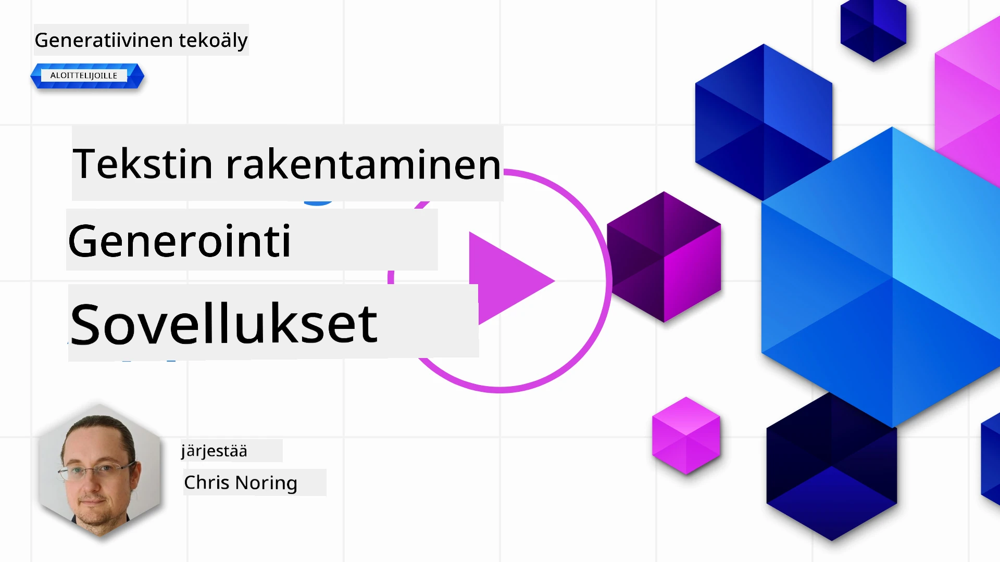

# Tekstintuotantosovellusten rakentaminen

[](https://youtu.be/0Y5Luf5sRQA?si=t_xVg0clnAI4oUFZ)

> _(Napsauta yllä olevaa kuvaa nähdäksesi tämän oppitunnin videon)_

Olet tähän mennessä nähnyt tämän opetussuunnitelman kautta, että on olemassa ydinkäsitteitä kuten kehotteet ja jopa kokonainen ala nimeltä "prompt engineering". Monet työkalut, joiden kanssa voit olla vuorovaikutuksessa kuten ChatGPT, Office 365, Microsoft Power Platform ja muut, tukevat sinua käyttämään kehotteita jonkin saavuttamiseksi.

Jotta voit lisätä tällaisen kokemuksen sovellukseen, sinun täytyy ymmärtää käsitteitä kuten kehotteet, täydennykset ja valita kirjasto, jonka kanssa työskennellä. Juuri tämän opit tässä luvussa.

## Johdanto

Tässä luvussa sinä:

- Opit openai-kirjastosta ja sen ydinkäsitteistä.
- Rakennat tekstintuotantosovelluksen käyttäen openai:ta.
- Ymmärrät, miten käyttää käsitteitä kuten kehotteet, lämpötila (temperature) ja tokenit tekstintuotantosovelluksen rakentamiseen.

## Oppimistavoitteet

Oppitunnin lopussa osaat:

- Selittää, mitä tekstintuotantosovellus on.
- Rakentaa tekstintuotantosovelluksen käyttäen openai:ta.
- Määrittää sovelluksesi käyttämään enemmän tai vähemmän tokeneita ja muuttaa myös lämpötilaa vaihtelevamman tuloksen saavuttamiseksi.

## Mikä on tekstintuotantosovellus?

Yleensä kun rakennat sovelluksen, siinä on jonkinlainen käyttöliittymä, kuten seuraava:

- Komentopohjainen. Konsolisovellukset ovat tyypillisiä sovelluksia, joissa kirjoitat komennon ja se suorittaa tehtävän. Esimerkiksi `git` on komentopohjainen sovellus.
- Käyttöliittymä (UI). Joissakin sovelluksissa on graafiset käyttöliittymät (GUI), joissa klikkaat painikkeita, syötät tekstiä, valitset vaihtoehtoja ja muuta.

### Konsoli- ja käyttöliittymäsovellukset ovat rajallisia

Vertaa sitä komentopohjaiseen sovellukseen, jossa kirjoitat komennon:

- **Se on rajallinen.** Et voi kirjoittaa mitä tahansa komentoa, vain ne, joita sovellus tukee.
- **Kielikohtainen.** Joissakin sovelluksissa tuetaan monia kieliä, mutta oletuksena sovellus on rakennettu tietylle kielelle, vaikka voit lisätä tukea useammille kielille.

### Tekstintuotantosovellusten edut

Miten tekstintuotantosovellus sitten eroaa?

Tekstintuotantosovelluksessa sinulla on enemmän joustavuutta, et ole rajoitettu joukkoon komentoja tai tiettyyn syötekieleen. Sen sijaan voit käyttää luonnollista kieltä vuorovaikutukseen sovelluksen kanssa. Toinen etu on, että olet jo vuorovaikutuksessa tietolähteen kanssa, joka on koulutettu valtavalla informaatioaineistolla, kun taas perinteinen sovellus voi olla rajoittunut tietokannan sisältöön.

### Mitä voin rakentaa tekstintuotantosovelluksella?

Voit rakentaa monenlaisia asioita. Esimerkiksi:

- **Chatbotin.** Chatbot, joka vastaa kysymyksiin aiheista kuten yrityksestäsi ja sen tuotteista, voisi olla hyvä sovellus.
- **Avustajan.** LLM:t ovat erinomaisia tehtävissä kuten tekstin tiivistäminen, tekstistä saatavien tietojen poimiminen, tekstin tuottaminen kuten CV:t ja muuta.
- **Koodiavustajan.** Riippuen käyttämästäsi kielimallista, voit rakentaa koodiavustajan, joka auttaa sinua kirjoittamaan koodia. Voit esimerkiksi käyttää GitHub Copilot -tuotetta sekä ChatGPT:tä koodin kirjoittamisen avuksi.

## Kuinka pääsen alkuun?

Sinun täytyy löytää tapa integroitua LLM:ään, mikä yleensä tarkoittaa kahta tapaa:

- Käyttää API:a. Tässä rakennat web-pyyntöjä kehotteesi kanssa ja saat takaisin tuotettua tekstiä.
- Käyttää kirjastoa. Kirjastot auttavat kapseloimaan API-kutsut ja tekevät niistä helpompia käyttää.

## Kirjastot/SDK:t

On olemassa muutama tunnettu kirjasto, joilla työskennellä LLM:ien kanssa, kuten:

- **openai**, tämä kirjasto tekee malliin yhdistämisestä ja kehotteiden lähettämisestä helppoa.

Sitten on kirjastoja, jotka toimivat korkeamalla tasolla, kuten:

- **Langchain**. Langchain on tunnettu ja tukee Pythonia.
- **Semantic Kernel**. Semantic Kernel on Microsoftin kirjasto, joka tukee kieliä C#, Python ja Java.

## Ensimmäinen sovellus käyttäen openai:ta

Katsotaan, miten rakennamme ensimmäisen sovelluksemme, mitä kirjastoja tarvitsemme, kuinka paljon tarvitaan ja niin edelleen.

### Asenna openai

On monia kirjastoja OpenAI:n tai Azure OpenAI:n kanssa vuorovaikutukseen. On mahdollista käyttää lukuisia ohjelmointikieliä, kuten C#, Python, JavaScript, Java ja muut. Me olemme päättäneet käyttää `openai` Python-kirjastoa, joten käytämme `pip`-paketinhallintaa sen asentamiseen.

```bash
pip install openai
```

### Luo resurssi

Sinun pitää suorittaa seuraavat vaiheet:

- Luo tili Azureen osoitteessa [https://azure.microsoft.com/free/](https://azure.microsoft.com/free/?WT.mc_id=academic-105485-koreyst).
- Hanki pääsy Azure OpenAI:hin. Mene osoitteeseen [https://learn.microsoft.com/azure/ai-foundry/openai/overview#how-do-i-get-access-to-azure-openai](https://learn.microsoft.com/azure/ai-foundry/openai/overview#how-do-i-get-access-to-azure-openai?WT.mc_id=academic-105485-koreyst) ja pyydä pääsyä.

  > [!NOTE]
  > Kirjoitushetkellä sinun tulee hakea pääsyä Azure OpenAI:hin.

- Asenna Python <https://www.python.org/>
- Luo Azure OpenAI Service -resurssi. Katso ohjeesta, kuinka [luoda resurssi](https://learn.microsoft.com/azure/ai-foundry/openai/how-to/create-resource?pivots=web-portal?WT.mc_id=academic-105485-koreyst).

### Löydä API-avain ja päätepiste

Tällä hetkellä sinun täytyy kertoa `openai`-kirjastolle, mikä API-avain käytetään. Löytääksesi API-avaimesi, mene Azure OpenAI -resurssisi "Avain ja päätepiste" -osioon ja kopioi "Avain 1" arvo.


Nyt kun sinulla on tämä tieto kopioituna, ohjataan kirjastot käyttämään sitä.

> [!NOTE]
> On suositeltavaa erottaa API-avain koodista. Voit tehdä niin käyttämällä ympäristömuuttujia.
>
> - Aseta ympäristömuuttuja `OPENAI_API_KEY` API-avaimeksi.
>   `export OPENAI_API_KEY='sk-...'`

### Azure-konfiguraation asettaminen

Jos käytät Azure OpenAI:ta (nyt osa Microsoft Foundrya), näin asetat konfiguraation. Käytämme standardia `OpenAI`-asiakasta osoitettuna Azure OpenAI `/openai/v1/` -päätepisteeseen, joka toimii Responses API:n kanssa eikä tarvitse `api_version`-asetusta:

```python
import os
from openai import OpenAI

client = OpenAI(
    api_key=os.environ["AZURE_OPENAI_API_KEY"],
    base_url=f"{os.environ['AZURE_OPENAI_ENDPOINT'].rstrip('/')}/openai/v1/",
)
```

Yllä asetamme seuraavat:

- `api_key`, tämä on API-avaimesi, joka löytyy Azure-portaalista tai Microsoft Foundry -portaalista.
- `base_url`, tämä on Foundry-resurssisi päätepiste, johon on lisätty `/openai/v1/`. Vakaa v1-päätepiste toimii OpenAI:n ja Azure OpenAI:n kanssa ilman `api_version`-hallintaa.

> [!NOTE] > `os.environ` lukee ympäristömuuttujia. Voit käyttää sitä lukemaan esimerkiksi ympäristömuuttujia `AZURE_OPENAI_API_KEY` ja `AZURE_OPENAI_ENDPOINT`. Aseta nämä ympäristömuuttujat terminaalissasi tai käytä kirjastoa kuten `dotenv`.

## Tekstin generointi

Tekstin generoiminen tapahtuu Responses API:lla metodin `responses.create` avulla. Tässä esimerkki:

```python
prompt = "Complete the following: Once upon a time there was a"

response = client.responses.create(
    model="gpt-5-mini",  # tämä on mallisi käyttöönoton nimi
    input=prompt,
    store=False,
)
print(response.output_text)
```

Yllä olevassa koodissa luomme vastauksen ja annamme käytettävän mallin sekä kehotteen. Sitten tulostamme tuotetun tekstin `response.output_text` kautta.

### Monikierroskeskustelut

Responses API sopii hyvin sekä yksikkökierroksen tekstintuotantoon että monikierroksisiin chatbotteihin — annat `input`-kenttään viestilistan keskustelun rakentamiseksi:

```python
from openai import OpenAI

client = OpenAI(api_key="sk-...")

response = client.responses.create(model="gpt-5-mini", input="Hello world", store=False)
print(response.output_text)
```

Lisää tästä toiminnallisuudesta seuraavassa luvussa.

## Harjoitus - ensimmäinen tekstintuotantosovelluksesi

Nyt kun olemme oppineet asentamaan ja konfiguroimaan openai:n, on aika rakentaa ensimmäinen tekstintuotantosovelluksesi. Rakentaaksesi sovelluksen, seuraa näitä vaiheita:

1. Luo virtuaaliympäristö ja asenna openai:

   ```bash
   python -m venv venv
   source venv/bin/activate
   pip install openai
   ```

   > [!NOTE]
   > Jos käytät Windowsia, kirjoita `venv\Scripts\activate` sen sijaan, että käytät `source venv/bin/activate`.

   > [!NOTE]
   > Löydä Azure OpenAI -avaimesi siirtymällä osoitteeseen [https://portal.azure.com/](https://portal.azure.com/?WT.mc_id=academic-105485-koreyst), etsi `Open AI`, valitse `Open AI resource` ja sitten `Keys and Endpoint` ja kopioi `Key 1` arvo.

1. Luo _app.py_-tiedosto ja lisää siihen seuraava koodi:

   ```python
   import os
   from openai import OpenAI

   client = OpenAI(
       api_key="<replace this value with your Azure OpenAI key>",
       base_url="<endpoint found in Azure Portal>/openai/v1/",
   )
   deployment_name = "<deployment name>"

   # lisää lopetuskoodisi
   prompt = "Complete the following: Once upon a time there was a"

   # tee pyyntö Responses API:lla
   response = client.responses.create(model=deployment_name, input=prompt, store=False)

   # tulosta vastaus
   print(response.output_text)
   ```

   > [!NOTE]
   > Jos käytät tavallista OpenAI:ta (et Azurea), käytä `client = OpenAI(api_key="<korvaa tämä OpenAI-avaimellasi>")` (ei `base_url`) ja anna mallin nimeksi esimerkiksi `gpt-5-mini` käyttöönoton nimen sijaan.

   Näet tulosteen, joka on esimerkiksi seuraava:

   ```output
    very unhappy _____.

   Once upon a time there was a very unhappy mermaid.
   ```

## Erilaisia kehotteita eri asioihin

Nyt kun tiedät, miten generoida tekstiä kehotteen avulla. Sinulla on jopa ohjelma käynnissä, jota voit muuttaa ja säätää tuottamaan erilaisia tekstityyppejä.

Kehotteita voi käyttää monenlaisiin tehtäviin. Esimerkiksi:

- **Tuottaa tietyn tyyppistä tekstiä.** Voit esimerkiksi tuottaa runon, kysymyksiä visaan jne.
- **Hakea tietoa.** Voit käyttää kehotteita tiedon hakemiseen, kuten esimerkissä 'Mitä CORS tarkoittaa web-kehityksessä?'.
- **Tuottaa koodia.** Voit käyttää kehotteita koodin tuottamiseen, esimerkiksi säännöllisen lausekkeen kehittämiseen sähköpostien validointiin tai miksei tuottaa koko ohjelma, kuten web-sovellus?

## Käytännöllisempi käyttötapaus: reseptin luoja

Kuvittele, että sinulla on aineksia kotona ja haluat kokata jotakin. Tarvitset siihen reseptin. Tavan löytää reseptejä on käyttää hakukonetta tai voit käyttää LLM:ää siihen.

Voisit kirjoittaa kehotteen näin:

> "Näytä minulle 5 reseptiä ruualle, jossa on seuraavat ainekset: kana, perunat ja porkkanat. Listaa jokaisen reseptin kaikki käytetyt ainekset"

Edellä mainitun kehotteen perusteella saatat saada vastauksen, joka näyttää tältä:

```output
1. Roasted Chicken and Vegetables:
Ingredients:
- 4 chicken thighs
- 2 potatoes, cut into cubes
- 2 carrots, cut into cubes
- 2 tablespoons olive oil
- 2 cloves garlic, minced
- 1 teaspoon dried thyme
- 1 teaspoon dried oregano
- Salt and pepper, to taste

2. Chicken and Potato Stew:
Ingredients:
- 2 tablespoons olive oil
- 1 onion, diced
- 2 cloves garlic, minced
- 2 chicken breasts, cut into cubes
- 2 potatoes, cut into cubes
- 2 carrots, cut into cubes
- 1 teaspoon dried oregano
- 1 teaspoon dried thyme
- 1 cup chicken broth
- Salt and pepper, to taste

3. Chicken and Potato Bake:
Ingredients:
- 2 tablespoons olive oil
- 2 chicken breasts, cut into cubes
- 2 potatoes, cut into cubes
- 2 carrots, cut into cubes
- 1 onion, diced
- 2 cloves garlic, minced
- 1 teaspoon dried oregano
- 1 teaspoon dried thyme
- 1 cup chicken broth
- Salt and pepper, to taste

4. Chicken and Potato Soup:
Ingredients:
- 2 tablespoons olive oil
- 1 onion, diced
- 2 cloves garlic, minced
- 2 chicken breasts, cut into cubes
- 2 potatoes, cut into cubes
- 2 carrots, cut into cubes
- 1 teaspoon dried oregano
- 1 teaspoon dried thyme
- 4 cups chicken broth
- Salt and pepper, to taste

5. Chicken and Potato Hash:
Ingredients:
- 2 tablespoons olive oil
- 2 chicken breasts, cut into cubes
- 2 potatoes, cut into cubes
- 2 carrots, cut into cubes
- 1 onion, diced
- 2 cloves garlic, minced
- 1 teaspoon dried oregano
```

Tämä tulos on loistava, tiedän mitä kokata. Tässä vaiheessa hyödyllisiä parannuksia voisivat olla:

- Suodattaa pois aineksia, joista en pidä tai joille olen allerginen.
- Tuottaa ostoslista, jos en omista kaikkia aineksia kotona.

Edellä mainitut tapaukset huomioiden lisäämme lisäkehotteen:

> "Poista receptit, joissa on valkosipulia, sillä olen allerginen, ja korvaa ne jollakin muulla. Lisäksi tee ostoslista resepteistä, ottaen huomioon, että minulla on jo kanaa, perunoita ja porkkanoita kotona."

Nyt sinulla on uusi tulos, nimittäin:

```output
1. Roasted Chicken and Vegetables:
Ingredients:
- 4 chicken thighs
- 2 potatoes, cut into cubes
- 2 carrots, cut into cubes
- 2 tablespoons olive oil
- 1 teaspoon dried thyme
- 1 teaspoon dried oregano
- Salt and pepper, to taste

2. Chicken and Potato Stew:
Ingredients:
- 2 tablespoons olive oil
- 1 onion, diced
- 2 chicken breasts, cut into cubes
- 2 potatoes, cut into cubes
- 2 carrots, cut into cubes
- 1 teaspoon dried oregano
- 1 teaspoon dried thyme
- 1 cup chicken broth
- Salt and pepper, to taste

3. Chicken and Potato Bake:
Ingredients:
- 2 tablespoons olive oil
- 2 chicken breasts, cut into cubes
- 2 potatoes, cut into cubes
- 2 carrots, cut into cubes
- 1 onion, diced
- 1 teaspoon dried oregano
- 1 teaspoon dried thyme
- 1 cup chicken broth
- Salt and pepper, to taste

4. Chicken and Potato Soup:
Ingredients:
- 2 tablespoons olive oil
- 1 onion, diced
- 2 chicken breasts, cut into cubes
- 2 potatoes, cut into cubes
- 2 carrots, cut into cubes
- 1 teaspoon dried oregano
- 1 teaspoon dried thyme
- 4 cups chicken broth
- Salt and pepper, to taste

5. Chicken and Potato Hash:
Ingredients:
- 2 tablespoons olive oil
- 2 chicken breasts, cut into cubes
- 2 potatoes, cut into cubes
- 2 carrots, cut into cubes
- 1 onion, diced
- 1 teaspoon dried oregano

Shopping List:
- Olive oil
- Onion
- Thyme
- Oregano
- Salt
- Pepper
```

Siinä ovat viisi reseptiäsi ilman valkosipulia ja myös ostoslista ottaen huomioon jo olemassa olevat kotitarvikkeet.

## Harjoitus - rakenna reseptin luoja

Nyt kun olemme käyneet skenaarion läpi, kirjoitetaan koodi vastaamaan tätä esimerkkitapausta. Toimi seuraavasti:

1. Käytä olemassa olevaa _app.py_-tiedostoa lähtökohtana
1. Etsi muuttuja `prompt` ja muuta sen koodi seuraavaan:

   ```python
   prompt = "Show me 5 recipes for a dish with the following ingredients: chicken, potatoes, and carrots. Per recipe, list all the ingredients used"
   ```

   Jos ajat koodia nyt, sinun tulisi nähdä tuloste, joka näyttää tältä:

   ```output
   -Chicken Stew with Potatoes and Carrots: 3 tablespoons oil, 1 onion, chopped, 2 cloves garlic, minced, 1 carrot, peeled and chopped, 1 potato, peeled and chopped, 1 bay leaf, 1 thyme sprig, 1/2 teaspoon salt, 1/4 teaspoon black pepper, 1 1/2 cups chicken broth, 1/2 cup dry white wine, 2 tablespoons chopped fresh parsley, 2 tablespoons unsalted butter, 1 1/2 pounds boneless, skinless chicken thighs, cut into 1-inch pieces
   -Oven-Roasted Chicken with Potatoes and Carrots: 3 tablespoons extra-virgin olive oil, 1 tablespoon Dijon mustard, 1 tablespoon chopped fresh rosemary, 1 tablespoon chopped fresh thyme, 4 cloves garlic, minced, 1 1/2 pounds small red potatoes, quartered, 1 1/2 pounds carrots, quartered lengthwise, 1/2 teaspoon salt, 1/4 teaspoon black pepper, 1 (4-pound) whole chicken
   -Chicken, Potato, and Carrot Casserole: cooking spray, 1 large onion, chopped, 2 cloves garlic, minced, 1 carrot, peeled and shredded, 1 potato, peeled and shredded, 1/2 teaspoon dried thyme leaves, 1/4 teaspoon salt, 1/4 teaspoon black pepper, 2 cups fat-free, low-sodium chicken broth, 1 cup frozen peas, 1/4 cup all-purpose flour, 1 cup 2% reduced-fat milk, 1/4 cup grated Parmesan cheese

   -One Pot Chicken and Potato Dinner: 2 tablespoons olive oil, 1 pound boneless, skinless chicken thighs, cut into 1-inch pieces, 1 large onion, chopped, 3 cloves garlic, minced, 1 carrot, peeled and chopped, 1 potato, peeled and chopped, 1 bay leaf, 1 thyme sprig, 1/2 teaspoon salt, 1/4 teaspoon black pepper, 2 cups chicken broth, 1/2 cup dry white wine

   -Chicken, Potato, and Carrot Curry: 1 tablespoon vegetable oil, 1 large onion, chopped, 2 cloves garlic, minced, 1 carrot, peeled and chopped, 1 potato, peeled and chopped, 1 teaspoon ground coriander, 1 teaspoon ground cumin, 1/2 teaspoon ground turmeric, 1/2 teaspoon ground ginger, 1/4 teaspoon cayenne pepper, 2 cups chicken broth, 1/2 cup dry white wine, 1 (15-ounce) can chickpeas, drained and rinsed, 1/2 cup raisins, 1/2 cup chopped fresh cilantro
   ```

   > HUOM, LLM:si ei ole deterministinen, joten voit saada eri tuloksia joka kerta kun ajat ohjelmaa.

   Hienoa, katsotaan miten voimme parantaa asioita. Parantaaksemme haluamme tehdä koodista joustavan, jotta aineksia ja reseptien määrää voi muuttaa ja säätää.

1. Muutetaan koodia seuraavasti:

   ```python
   no_recipes = input("No of recipes (for example, 5): ")

   ingredients = input("List of ingredients (for example, chicken, potatoes, and carrots): ")

   # interpoloida reseptien määrä kehotteeseen ja ainesosiin
   prompt = f"Show me {no_recipes} recipes for a dish with the following ingredients: {ingredients}. Per recipe, list all the ingredients used"
   ```

   Koekäyttö voisi näyttää tältä:

   ```output
   No of recipes (for example, 5): 3
   List of ingredients (for example, chicken, potatoes, and carrots): milk,strawberries

   -Strawberry milk shake: milk, strawberries, sugar, vanilla extract, ice cubes
   -Strawberry shortcake: milk, flour, baking powder, sugar, salt, unsalted butter, strawberries, whipped cream
   -Strawberry milk: milk, strawberries, sugar, vanilla extract
   ```

### Paranna lisäämällä suodatus ja ostoslista

Meillä on nyt toimiva sovellus, joka pystyy tuottamaan reseptejä, ja se on joustava, koska se perustuu käyttäjän syötteisiin, sekä reseptien määrään että käytettyihin aineksiin.

Jatko-ominaisuutena haluamme lisätä:

- **Suodattaa pois ainekset.** Haluamme pystyä suodattamaan pois aineksia, joista emme pidä tai joille olemme allergisia. Tämän muutoksen tekemiseksi voimme muokata nykyistä kehotettamme lisäämällä loppuun suodatusehdon näin:

  ```python
  filter = input("Filter (for example, vegetarian, vegan, or gluten-free): ")

  prompt = f"Show me {no_recipes} recipes for a dish with the following ingredients: {ingredients}. Per recipe, list all the ingredients used, no {filter}"
  ```

  Yllä lisäämme `{filter}` kehotteen loppuun ja otamme myös talteen suodatusarvon käyttäjältä.

  Ohjelman ajon esimerkkisyöte voi nyt näyttää tältä:

  ```output
  No of recipes (for example, 5): 3
  List of ingredients (for example, chicken, potatoes, and carrots): onion,milk
  Filter (for example, vegetarian, vegan, or gluten-free): no milk

  1. French Onion Soup

  Ingredients:

  -1 large onion, sliced
  -3 cups beef broth
  -1 cup milk
  -6 slices french bread
  -1/4 cup shredded Parmesan cheese
  -1 tablespoon butter
  -1 teaspoon dried thyme
  -1/4 teaspoon salt
  -1/4 teaspoon black pepper

  Instructions:

  1. In a large pot, sauté onions in butter until golden brown.
  2. Add beef broth, milk, thyme, salt, and pepper. Bring to a boil.
  3. Reduce heat and simmer for 10 minutes.
  4. Place french bread slices on soup bowls.
  5. Ladle soup over bread.
  6. Sprinkle with Parmesan cheese.

  2. Onion and Potato Soup

  Ingredients:

  -1 large onion, chopped
  -2 cups potatoes, diced
  -3 cups vegetable broth
  -1 cup milk
  -1/4 teaspoon black pepper

  Instructions:

  1. In a large pot, sauté onions in butter until golden brown.
  2. Add potatoes, vegetable broth, milk, and pepper. Bring to a boil.
  3. Reduce heat and simmer for 10 minutes.
  4. Serve hot.

  3. Creamy Onion Soup

  Ingredients:

  -1 large onion, chopped
  -3 cups vegetable broth
  -1 cup milk
  -1/4 teaspoon black pepper
  -1/4 cup all-purpose flour
  -1/2 cup shredded Parmesan cheese

  Instructions:

  1. In a large pot, sauté onions in butter until golden brown.
  2. Add vegetable broth, milk, and pepper. Bring to a boil.
  3. Reduce heat and simmer for 10 minutes.
  4. In a small bowl, whisk together flour and Parmesan cheese until smooth.
  5. Add to soup and simmer for an additional 5 minutes, or until soup has thickened.
  ```

  Kuten näet, kaikki reseptit, joissa on maito, on suodatettu pois. Mutta jos olet laktoosi-intolerantti, saatat haluta myös suodattaa juustoa sisältävät reseptit, joten asian pitää olla selkeä.


- **Tee ostoslista**. Haluamme tehdä ostoslistan ottaen huomioon, mitä meillä jo on kotona.

  Tätä toimintoa varten voisimme joko yrittää ratkaista kaiken yhdellä kehotteella tai voisimme jakaa sen kahteen kehotteeseen. Kokeillaan jälkimmäistä lähestymistapaa. Tässä ehdotamme lisättyä kehotetta, mutta sen toimimiseksi meidän täytyy lisätä ensimmäisen kehotteen tulos toisen kehotteen kontekstiksi.

  Etsi koodista kohta, joka tulostaa ensimmäisen kehotteen tuloksen, ja lisää seuraava koodi sen alle:

  ```python
  old_prompt_result = response.output_text
  prompt = "Produce a shopping list for the generated recipes and please don't include ingredients that I already have."

  new_prompt = f"{old_prompt_result} {prompt}"
  response = client.responses.create(model=deployment_name, input=new_prompt, max_output_tokens=1200, store=False)

  # tulosta vastaus
  print("Shopping list:")
  print(response.output_text)
  ```

  Huomioi seuraavat asiat:

  1. Rakennamme uuden kehotteen lisäämällä ensimmäisen kehotteen tuloksen uuteen kehotteeseen:

     ```python
     new_prompt = f"{old_prompt_result} {prompt}"
     ```

  1. Teemme uuden pyynnön, mutta otamme myös huomioon ensimmäisessä kehotteessa pyytämämme tokenien määrän, joten tällä kertaa asetamme `max_output_tokens` arvoksi 1200.

     ```python
     response = client.responses.create(model=deployment_name, input=new_prompt, max_output_tokens=1200, store=False)
     ```

     Kun kokeilemme tätä koodia, saamme nyt seuraavan tulosteen:

     ```output
     No of recipes (for example, 5): 2
     List of ingredients (for example, chicken, potatoes, and carrots): apple,flour
     Filter (for example, vegetarian, vegan, or gluten-free): sugar


     -Apple and flour pancakes: 1 cup flour, 1/2 tsp baking powder, 1/2 tsp baking soda, 1/4 tsp salt, 1 tbsp sugar, 1 egg, 1 cup buttermilk or sour milk, 1/4 cup melted butter, 1 Granny Smith apple, peeled and grated
     -Apple fritters: 1-1/2 cups flour, 1 tsp baking powder, 1/4 tsp salt, 1/4 tsp baking soda, 1/4 tsp nutmeg, 1/4 tsp cinnamon, 1/4 tsp allspice, 1/4 cup sugar, 1/4 cup vegetable shortening, 1/4 cup milk, 1 egg, 2 cups shredded, peeled apples
     Shopping list:
     -Flour, baking powder, baking soda, salt, sugar, egg, buttermilk, butter, apple, nutmeg, cinnamon, allspice
     ```

## Paranna asennustasi

Tähän asti meillä on toimiva koodi, mutta on joitain säätöjä, joita meidän pitäisi tehdä parantaaksemme tilannetta entisestään. Joitakin asioita, jotka meidän tulisi tehdä, ovat:

- **Erottele salaisuudet koodista**, kuten API-avain. Salaisuudet eivät kuulu koodiin ja ne pitäisi säilyttää turvallisessa paikassa. Erotellaksemme salaisuudet koodista, voimme käyttää ympäristömuuttujia ja kirjastoja kuten `python-dotenv` ladata ne tiedostosta. Tässä on esimerkki koodista:

  1. Luo `.env` -tiedosto seuraavalla sisällöllä:

     ```bash
     OPENAI_API_KEY=sk-...
     ```

     > Huomaa, että Azure OpenAI:ssa Microsoft Foundryssa sinun täytyy asettaa seuraavat ympäristömuuttujat sijaan:

     ```bash
     AZURE_OPENAI_API_KEY=<replace>
     AZURE_OPENAI_ENDPOINT=<replace>
     AZURE_OPENAI_API_VERSION=2024-10-21
     ```

     Koodissa lataat ympäristömuuttujat näin:

     ```python
     import os
     from dotenv import load_dotenv
     from openai import OpenAI

     load_dotenv()

     client = OpenAI(api_key=os.environ["OPENAI_API_KEY"])
     ```

- **Sana token-pituudesta**. Meidän tulisi harkita, kuinka monta tokenia tarvitsemme halutun tekstin luomiseen. Tokenit maksavat rahaa, joten missä mahdollista meidän tulisi olla säästäväisiä käyttämissämme tokeneissa. Voimmeko esimerkiksi muotoilla kehotteen niin, että voimme käyttää vähemmän tokeneja?

  Muuttaaksesi käytettyjen tokenien määrää, voit käyttää `max_output_tokens` parametriä. Esimerkiksi, jos haluat käyttää 100 tokenia, teet näin:

  ```python
  response = client.responses.create(model=deployment, input=prompt, max_output_tokens=100, store=False)
  ```

- **Kokeile lämpötilaa**. Lämpötila on jotain, mitä emme ole tähän asti maininneet, mutta se on tärkeä konteksti ohjelmamme toiminnalle. Mitä korkeampi lämpötilan arvo on, sitä satunnaisempi tuloste on. Päinvastoin, mitä matalampi lämpötila on, sitä ennakoitavampi tulos on. Mieti haluatko vaihtelua tulosteeseesi vai et.

  Muuttaaksesi lämpötilaa, voit käyttää `temperature` parametria. Esimerkiksi, jos haluat käyttää lämpötilaa 0.5, teet näin:

  ```python
  response = client.responses.create(model=deployment, input=prompt, temperature=0.5, store=False)
  ```

  > Huomaa, mitä lähempänä arvo on 1.0, sitä moninaisempi tuloste on.

- **Päättelymallit eivät käytä `temperature`-parametria**. Tämä on tärkeä muutos vuodelle 2026. Nykyiset ei-vanhentuneet Microsoft Foundryn mallit ovat **päättelymalleja** (GPT-5 perhe, o-sarja) - ja ne **eivät tue `temperature`- tai `top_p`-parametreja** (eivätkä `max_tokens`; käytä `max_output_tokens`). Jos lähetät `temperature`-parametrin mallille `gpt-5-mini`, saat virheilmoituksen "parameter not supported". Joten kokeillaksesi yllä olevaa lämpötilaesimerkkiä, osoita se mallille, joka vielä tukee otantakontrolleja - esimerkiksi avoimelle **Llama**-mallille kuten `Llama-3.3-70B-Instruct` Microsoft Foundryn malliluettelosta ([Microsoft Foundry model catalog](https://ai.azure.com/catalog/models?WT.mc_id=academic-105485-koreyst)), jota kutsutaan Foundry Models / Azure AI Inference rajapinnan kautta (kuten `githubmodels-*` esimerkeissä). Päättelymalleilla kuten GPT-5 ohjaat tulosta eri tavalla:
  - **Kehoteoptimointi** - selkeät ohjeet, esimerkit ja jäsennelty tuloste (katso oppitunti [04 - Prompt Engineering](../04-prompt-engineering-fundamentals/README.md?WT.mc_id=academic-105485-koreyst)) tekevät työn, jota otantapolkimet aiemmin tekivät.
  - **Päättelykontrollit** - parametrit kuten päättelyponnistus/puhdas ilmaisu käyvät kauppaa päättelyn syvyyden ja viiveen sekä kustannusten kesken.

  Lyhyesti: `temperature`/`top_p` ovat edelleen käytössä monissa malleissa (Llama, Mistral, Phi ja GPT-4.x perhe - vaikka GPT-4.x on vanhentumassa), mutta suunta on kohti kehotteiden optimointia + päättelykontrolleja päättelymalleissa kuten GPT-5.

## Tehtävä

Tässä tehtävässä voit valita mitä rakennat.

Tässä on joitakin ehdotuksia:

- Muokkaa reseptigeneraattorisovellusta parantaaksesi sitä edelleen. Kokeile lämpötila-arvoja ja kehotteita nähdäksesi, mitä saat aikaiseksi.
- Rakenna "opiskeluystävä". Tämän sovelluksen tulisi pystyä vastaamaan kysymyksiin jostakin aiheesta, esimerkiksi Pythonista. Voisit käyttää kehotteita kuten "Mikä on tietty aihe Pythonissa?", tai kehotetta, joka sanoo, näytä minulle koodi tietystä aiheesta yms.
- Historia-botti, herätä historia eloon, ohjaa bottia esiintymään tiettynä historiallisena hahmona ja kysy siitä kysymyksiä sen elämästä ja ajoista.

## Ratkaisu

### Opiskeluystävä

Alla on aloituskehotus, katso miten voit käyttää sitä ja muokata mieleiseksesi.

```text
- "You're an expert on the Python language

    Suggest a beginner lesson for Python in the following format:

    Format:
    - concepts:
    - brief explanation of the lesson:
    - exercise in code with solutions"
```

### Historia-botti

Tässä muutamia kehotteita, joita voisit käyttää:

```text
- "You are Abe Lincoln, tell me about yourself in 3 sentences, and respond using grammar and words like Abe would have used"
- "You are Abe Lincoln, respond using grammar and words like Abe would have used:

   Tell me about your greatest accomplishments, in 300 words"
```

## Tietotarkastus

Mitä lämpötila-konsepti tekee?

1. Se ohjaa, kuinka satunnainen tulos on.
1. Se ohjaa, kuinka iso vastaus on.
1. Se ohjaa, kuinka monta tokenia käytetään.

## 🚀 Haaste

Työskennellessäsi tehtävän parissa, yritä vaihdella lämpötilaa, kokeile asettaa se arvoihin 0, 0.5 ja 1. Muista, että 0 on vähiten vaihteleva ja 1 eniten. Mikä arvo sopii parhaiten sovellukseesi?

## Hienoa työtä! Jatka oppimista

Kun olet suorittanut tämän oppitunnin, tutustu [Generative AI Learning -kokoelmaamme](https://aka.ms/genai-collection?WT.mc_id=academic-105485-koreyst) kehittääksesi generatiivisen tekoälyn osaamistasi edelleen!

Siirry oppitunnille 7, jossa tarkastelemme, kuinka [rakentaa chat-sovelluksia](../07-building-chat-applications/README.md?WT.mc_id=academic-105485-koreyst)!

---

<!-- CO-OP TRANSLATOR DISCLAIMER START -->
**Vastuuvapauslauseke**:
Tämä asiakirja on käännetty käyttämällä tekoälypohjaista käännöspalvelua [Co-op Translator](https://github.com/Azure/co-op-translator). Vaikka pyrimme tarkkuuteen, otathan huomioon, että automaattiset käännökset saattavat sisältää virheitä tai epätarkkuuksia. Alkuperäinen asiakirja sen alkuperäiskielellä on virallinen lähde. Tärkeissä asioissa suositellaan ammattimaista ihmiskäännöstä. Emme ole vastuussa tämän käännöksen käytöstä aiheutuvista väärinymmärryksistä tai tulkinnoista.
<!-- CO-OP TRANSLATOR DISCLAIMER END -->