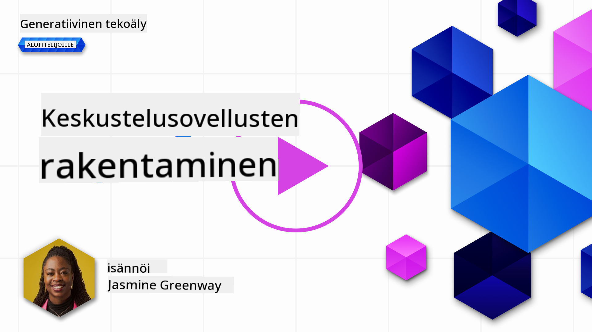
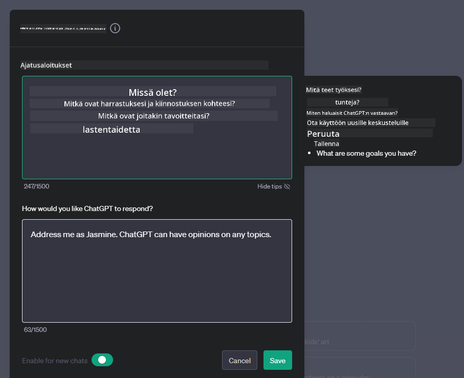
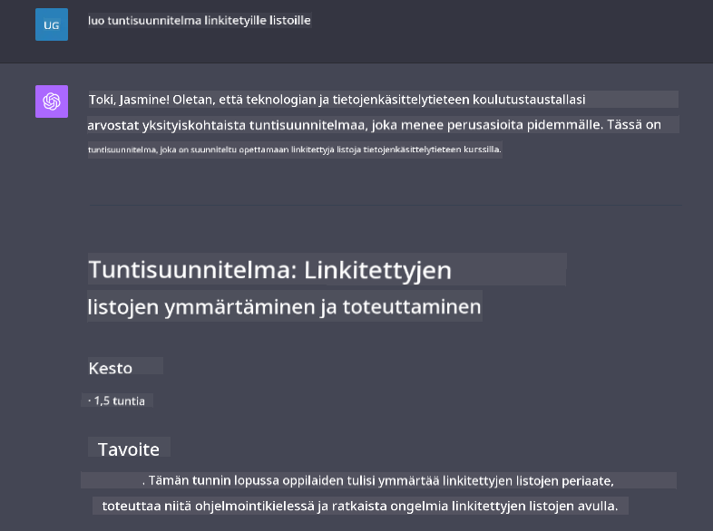

<!--
CO_OP_TRANSLATOR_METADATA:
{
  "original_hash": "ea4bbe640847aafbbba14dae4625e9af",
  "translation_date": "2025-05-19T17:56:55+00:00",
  "source_file": "07-building-chat-applications/README.md",
  "language_code": "fi"
}
-->
# Generatiiviseen tekoälyyn perustuvien chat-sovellusten rakentaminen

[](https://aka.ms/gen-ai-lessons7-gh?WT.mc_id=academic-105485-koreyst)

> _(Klikkaa yllä olevaa kuvaa nähdäksesi videon tästä oppitunnista)_

Nyt kun olemme nähneet, miten voimme rakentaa tekstin generointisovelluksia, tarkastellaan chat-sovelluksia.

Chat-sovellukset ovat tulleet osaksi päivittäistä elämäämme, ja ne tarjoavat enemmän kuin vain keinoja rentoon keskusteluun. Ne ovat keskeisiä osia asiakaspalvelussa, teknisessä tuessa ja jopa kehittyneissä neuvontajärjestelmissä. On todennäköistä, että olet saanut apua chat-sovelluksesta melko hiljattain. Kun integroimme edistyneempiä teknologioita, kuten generatiivista tekoälyä näille alustoille, monimutkaisuus kasvaa ja haasteet lisääntyvät.

Joitakin kysymyksiä, joihin meidän on vastattava:

- **Sovelluksen rakentaminen**. Miten voimme rakentaa ja saumattomasti integroida nämä tekoälyyn perustuvat sovellukset tiettyihin käyttötarkoituksiin tehokkaasti?
- **Seuranta**. Kun sovellus on otettu käyttöön, miten voimme seurata ja varmistaa, että sovellukset toimivat korkeimmalla laatutasolla sekä toiminnallisuuden että [vastuullisen tekoälyn kuuden periaatteen](https://www.microsoft.com/ai/responsible-ai?WT.mc_id=academic-105485-koreyst) noudattamisen osalta?

Kun siirrymme kohti aikaa, joka määritellään automaation ja saumattomien ihmisen ja koneen välisten vuorovaikutusten kautta, on välttämätöntä ymmärtää, miten generatiivinen tekoäly muuttaa chat-sovellusten laajuutta, syvyyttä ja mukautuvuutta. Tämä oppitunti tutkii arkkitehtuurin näkökohtia, jotka tukevat näitä monimutkaisia järjestelmiä, syventyy menetelmiin niiden hienosäätämiseksi alakohtaisiin tehtäviin ja arvioi mittareita ja näkökulmia, jotka ovat tärkeitä vastuullisen tekoälyn käyttöönoton varmistamiseksi.

## Johdanto

Tämä oppitunti kattaa:

- Tekniikoita chat-sovellusten tehokkaaseen rakentamiseen ja integrointiin.
- Miten soveltaa räätälöintiä ja hienosäätöä sovelluksiin.
- Strategiat ja näkökohdat chat-sovellusten tehokkaaseen seurantaan.

## Oppimistavoitteet

Oppitunnin lopussa pystyt:

- Kuvailemaan huomioita chat-sovellusten rakentamisessa ja integroimisessa olemassa oleviin järjestelmiin.
- Räätälöimään chat-sovelluksia tiettyihin käyttötarkoituksiin.
- Tunnistamaan keskeiset mittarit ja näkökohdat tekoälyyn perustuvien chat-sovellusten laadun tehokkaaseen seurantaan ja ylläpitoon.
- Varmistamaan, että chat-sovellukset hyödyntävät tekoälyä vastuullisesti.

## Generatiivisen tekoälyn integroiminen chat-sovelluksiin

Chat-sovellusten nostaminen generatiivisen tekoälyn avulla ei keskity pelkästään niiden älykkäämmäksi tekemiseen; kyse on niiden arkkitehtuurin, suorituskyvyn ja käyttöliittymän optimoinnista laadukkaan käyttäjäkokemuksen tarjoamiseksi. Tämä edellyttää arkkitehtuurin perusteiden, API-integraatioiden ja käyttöliittymän huomioiden tutkimista. Tämä osio pyrkii tarjoamaan sinulle kattavan tiekartan näiden monimutkaisten maisemien navigoimiseen, olipa kyseessä niiden liittäminen olemassa oleviin järjestelmiin tai niiden rakentaminen itsenäisinä alustoina.

Tämän osion lopussa sinulla on asiantuntemusta chat-sovellusten tehokkaaseen rakentamiseen ja integroimiseen.

### Chatbot vai chat-sovellus?

Ennen kuin sukellamme chat-sovellusten rakentamiseen, verrataan 'chatbotteja' ja 'tekoälyyn perustuvia chat-sovelluksia', jotka palvelevat erillisiä rooleja ja toimintoja. Chatbotin pääasiallinen tarkoitus on automatisoida tiettyjä keskustelutehtäviä, kuten usein kysyttyihin kysymyksiin vastaaminen tai paketin seuranta. Sitä ohjaa tyypillisesti sääntöihin perustuva logiikka tai monimutkaiset tekoälyalgoritmit. Sen sijaan tekoälyyn perustuva chat-sovellus on paljon laajempi ympäristö, joka on suunniteltu helpottamaan erilaisia digitaalisia viestintätapoja, kuten teksti-, ääni- ja videokeskusteluja ihmiskäyttäjien kesken. Sen määrittelevä ominaisuus on generatiivisen tekoälymallin integrointi, joka simuloi vivahteikkaita, ihmismäisiä keskusteluja ja tuottaa vastauksia monenlaisten syötteiden ja kontekstuaalisten vihjeiden perusteella. Generatiiviseen tekoälyyn perustuva chat-sovellus voi osallistua avoimen aiheen keskusteluihin, mukautua kehittyviin keskustelukonteksteihin ja jopa tuottaa luovia tai monimutkaisia dialogeja.

Alla oleva taulukko esittelee keskeiset erot ja yhtäläisyydet, jotka auttavat meitä ymmärtämään niiden ainutlaatuiset roolit digitaalisessa viestinnässä.

| Chatbot                               | Generatiiviseen tekoälyyn perustuva chat-sovellus |
| ------------------------------------- | ------------------------------------------------- |
| Tehtäväkeskeinen ja sääntöihin perustuva | Kontekstuaalinen                                  |
| Usein integroitu suurempiin järjestelmiin | Voi isännöidä yhtä tai useampaa chatbotia          |
| Rajoittuu ohjelmoituihin toimintoihin  | Sisältää generatiivisia tekoälymalleja             |
| Erikoistuneet & jäsennellyt vuorovaikutukset | Pystyy avoimen aiheen keskusteluihin               |

### Valmiiden toimintojen hyödyntäminen SDK:iden ja API:iden avulla

Chat-sovelluksen rakentamisessa hyvä ensimmäinen askel on arvioida, mitä on jo olemassa. SDK:iden ja API:iden käyttö chat-sovellusten rakentamiseen on hyödyllinen strategia monista syistä. Hyvin dokumentoitujen SDK:iden ja API:iden integroiminen asettaa sovelluksesi strategisesti pitkän aikavälin menestykseen, käsittelemällä skaalautuvuus- ja ylläpitohuolia.

- **Kehitysprosessin nopeuttaminen ja yläkulujen vähentäminen**: Valmiiden toimintojen hyödyntäminen kalliiden itse rakentamisen sijaan antaa sinun keskittyä muihin sovelluksesi näkökohtiin, joita pidät tärkeämpinä, kuten liiketoimintalogiikkaan.
- **Parempi suorituskyky**: Kun rakennat toiminnallisuutta alusta alkaen, kysyt lopulta itseltäsi "Miten tämä skaalautuu? Onko tämä sovellus kykenevä käsittelemään äkillistä käyttäjien tulvaa?" Hyvin ylläpidetyt SDK:t ja API:t sisältävät usein sisäänrakennettuja ratkaisuja näihin huoliin.
- **Helpompi ylläpito**: Päivitykset ja parannukset ovat helpommin hallittavissa, koska useimmat API:t ja SDK:t vaativat yksinkertaisesti kirjaston päivittämisen, kun uudempi versio julkaistaan.
- **Pääsy huipputeknologiaan**: Hyödyntämällä malleja, jotka on hienosäädetty ja koulutettu laajoilla tietojoukoilla, tarjoat sovelluksellesi luonnollisen kielen ominaisuudet.

SDK:n tai API:n toiminnallisuuden käyttöönotto edellyttää yleensä lupaa tarjottujen palveluiden käyttämiseen, mikä tapahtuu usein käyttämällä yksilöllistä avainta tai tunnistusmerkkiä. Käytämme OpenAI Python-kirjastoa tutkiaksemme, miltä tämä näyttää. Voit myös kokeilla sitä itse seuraavassa [OpenAI-muistikirjassa](../../../07-building-chat-applications/python/oai-assignment.ipynb) tai [Azure OpenAI Services -muistikirjassa](../../../07-building-chat-applications/python/aoai-assignment.ipynb) tämän oppitunnin osalta.

```python
import os
from openai import OpenAI

API_KEY = os.getenv("OPENAI_API_KEY","")

client = OpenAI(
    api_key=API_KEY
    )

chat_completion = client.chat.completions.create(model="gpt-3.5-turbo", messages=[{"role": "user", "content": "Suggest two titles for an instructional lesson on chat applications for generative AI."}])
```

Yllä oleva esimerkki käyttää GPT-3.5 Turbo -mallia suorittamaan kehotteen, mutta huomaa, että API-avain on asetettu ennen sen tekemistä. Saat virheen, jos et asettaisi avainta.

## Käyttäjäkokemus (UX)

Yleiset UX-periaatteet pätevät chat-sovelluksiin, mutta tässä on joitakin lisähuomioita, jotka tulevat erityisen tärkeiksi koneoppimisen komponenttien vuoksi.

- **Epämääräisyyden käsittelymekanismi**: Generatiiviset tekoälymallit tuottavat toisinaan epämääräisiä vastauksia. Ominaisuus, joka antaa käyttäjille mahdollisuuden pyytää tarkennusta, voi olla hyödyllinen, jos he kohtaavat tämän ongelman.
- **Kontekstin säilyttäminen**: Edistyneillä generatiivisilla tekoälymalleilla on kyky muistaa konteksti keskustelun aikana, mikä voi olla tarpeellinen etu käyttäjäkokemukselle. Käyttäjien mahdollisuus hallita ja hallinnoida kontekstia parantaa käyttäjäkokemusta, mutta tuo mukanaan riskin säilyttää arkaluonteista käyttäjätietoa. Harkinnat siitä, kuinka kauan tämä tieto säilytetään, kuten säilytyspolitiikan käyttöönotto, voivat tasapainottaa kontekstin tarpeen yksityisyyden kanssa.
- **Personointi**: Kyky oppia ja mukautua tarjoaa tekoälymalleille yksilöllisen kokemuksen käyttäjälle. Käyttäjäprofiilien kaltaisten ominaisuuksien avulla käyttäjä tuntee itsensä ymmärretyksi, ja se auttaa heitä löytämään erityisiä vastauksia, luoden tehokkaamman ja tyydyttävämmän vuorovaikutuksen.

Yksi esimerkki personoinnista on OpenAI:n ChatGPT:n "Custom instructions" -asetukset. Sen avulla voit antaa tietoja itsestäsi, jotka voivat olla tärkeä konteksti kehotteillesi. Tässä on esimerkki mukautetusta ohjeesta.



Tämä "profiili" kehottaa ChatGPT:tä luomaan oppituntisuunnitelman linkkilistoista. Huomaa, että ChatGPT ottaa huomioon, että käyttäjä saattaa haluta syvällisemmän oppituntisuunnitelman hänen kokemuksensa perusteella.



### Microsoftin järjestelmäviestikehys suurille kielimalleille

[Microsoft on tarjonnut ohjeita](https://learn.microsoft.com/azure/ai-services/openai/concepts/system-message#define-the-models-output-format?WT.mc_id=academic-105485-koreyst) tehokkaiden järjestelmäviestien kirjoittamiseen LLM:ien vastausten tuottamisessa, jaettuna neljään osa-alueeseen:

1. Määritellään, kenelle malli on tarkoitettu, sekä sen kyvyt ja rajoitukset.
2. Määritellään mallin tulostusmuoto.
3. Tarjotaan erityisiä esimerkkejä, jotka osoittavat mallin aiottua käyttäytymistä.
4. Tarjotaan lisäkäyttäytymisen turvatoimia.

### Esteettömyys

Olipa käyttäjällä näkö-, kuulo-, motorisia tai kognitiivisia heikkouksia, hyvin suunnitellun chat-sovelluksen tulisi olla kaikkien käytettävissä. Seuraava lista jakaa erityisiä ominaisuuksia, joiden tarkoituksena on parantaa esteettömyyttä eri käyttäjäheikkouksien osalta.

- **Ominaisuudet näkövammaisille**: Korkean kontrastin teemat ja muokattava teksti, ruudunlukijan yhteensopivuus.
- **Ominaisuudet kuulovammaisille**: Teksti-puhe- ja puhe-teksti-toiminnot, visuaaliset vihjeet ääni-ilmoituksista.
- **Ominaisuudet motorisille heikkouksille**: Näppäimistön navigointituki, äänikomennot.
- **Ominaisuudet kognitiivisille heikkouksille**: Yksinkertaistetut kielivaihtoehdot.

## Räätälöinti ja hienosäätö alakohtaisille kielimalleille

Kuvittele chat-sovellus, joka ymmärtää yrityksesi jargonia ja ennakoi sen käyttäjäkunnan yleisesti esittämiä erityisiä kyselyjä. On muutamia lähestymistapoja, jotka ovat mainitsemisen arvoisia:

- **DSL-mallien hyödyntäminen**. DSL tarkoittaa alakohtaista kieltä. Voit hyödyntää niin sanottua DSL-mallia, joka on koulutettu tiettyyn alaan ymmärtämään sen käsitteitä ja skenaarioita.
- **Hienosäätö**. Hienosäätö on prosessi, jossa malliasi koulutetaan edelleen erityisillä tiedoilla.

## Räätälöinti: DSL:n käyttö

Alakohtaisten kielimallien (DSL-mallit) hyödyntäminen voi parantaa käyttäjien sitoutumista tarjoamalla erikoistuneita, kontekstuaalisesti merkityksellisiä vuorovaikutuksia. Se on malli, joka on koulutettu tai hienosäädetty ymmärtämään ja tuottamaan tekstiä, joka liittyy tiettyyn alaan, teollisuuteen tai aiheeseen. DSL-mallin käyttöön liittyvät vaihtoehdot voivat vaihdella sellaisen kouluttamisesta alusta alkaen valmiiden mallien käyttämiseen SDK:iden ja API:iden kautta. Toinen vaihtoehto on hienosäätö, joka tarkoittaa olemassa olevan esikoulutetun mallin ottamista ja mukauttamista tiettyyn alaan.

## Räätälöinti: Hienosäätö

Hienosäätöä harkitaan usein, kun esikoulutettu malli ei riitä erikoistuneessa alassa tai erityisessä tehtävässä.

Esimerkiksi lääketieteelliset kyselyt ovat monimutkaisia ja vaativat paljon kontekstia. Kun lääketieteen ammattilainen diagnosoi potilaan, se perustuu monenlaisiin tekijöihin, kuten elämäntapaan tai olemassa oleviin sairauksiin, ja saattaa jopa nojautua viimeaikaisiin lääketieteellisiin julkaisuihin diagnoosin vahvistamiseksi. Tällaisissa hienovaraisissa skenaarioissa yleiskäyttöinen tekoäly-chat-sovellus ei voi olla luotettava lähde.

### Skenaario: lääketieteellinen sovellus

Harkitse chat-sovellusta, joka on suunniteltu auttamaan lääketieteen ammattilaisia tarjoamalla nopeita viittauksia hoitosuosituksiin, lääkeinteraktioihin tai viimeaikaisiin tutkimuslöydöksiin.

Yleiskäyttöinen malli saattaa olla riittävä vastaamaan peruslääketieteellisiin kysymyksiin tai antamaan yleisiä neuvoja, mutta se saattaa kamppailla seuraavien kanssa:

- **Erittäin erityiset tai monimutkaiset tapaukset**. Esimerkiksi neurologi saattaa kysyä sovellukselta: "Mitkä ovat nykyiset parhaat käytännöt lääkkeelle resistentin epilepsian hoidossa pediatrisilla potilailla?"
- **Viimeaikaisten edistysaskeleiden puuttuminen**. Yleiskäyttöinen malli voisi kamppailla tarjotakseen ajankohtaisen vastauksen, joka sisältää viimeisimmät edistysaskeleet neurologiassa ja farmakologiassa.

Tällaisissa tapauksissa mallin hienosäätö erikoistuneella lääketieteellisellä tietojoukolla voi merkittävästi parantaa sen kykyä käsitellä näitä monimutkaisia lääketieteellisiä kyselyjä tarkemmin ja luotettavammin. Tämä edellyttää pääsyä suureen ja merkitykselliseen tietojoukkoon, joka edustaa alakohtaisia haasteita ja kysymyksiä, joihin on puututtava.

## Näkökohdat korkealaatuiselle tekoälyyn perustuvan chat-kokemuksen saavuttamiseksi

Tässä osiossa kuvataan "korkealaatuisten" chat-sovellusten kriteerit, jotka sisältävät toiminnallisten mittareiden keräämisen ja kehyksen noudattamisen, joka hyödyntää tekoälyteknologiaa vastuullisesti.

### Keskeiset mittarit

Sovelluksen korkealaatuisen suoritusky

**Vastuuvapauslauseke**:  
Tämä asiakirja on käännetty käyttämällä tekoälypohjaista käännöspalvelua [Co-op Translator](https://github.com/Azure/co-op-translator). Vaikka pyrimme tarkkuuteen, huomaa, että automaattiset käännökset saattavat sisältää virheitä tai epätarkkuuksia. Alkuperäistä asiakirjaa sen alkuperäisellä kielellä tulee pitää auktoriteettina. Kriittistä tietoa varten suositellaan ammattimaista ihmiskäännöstä. Emme ole vastuussa tämän käännöksen käytöstä johtuvista väärinkäsityksistä tai virhetulkinnoista.