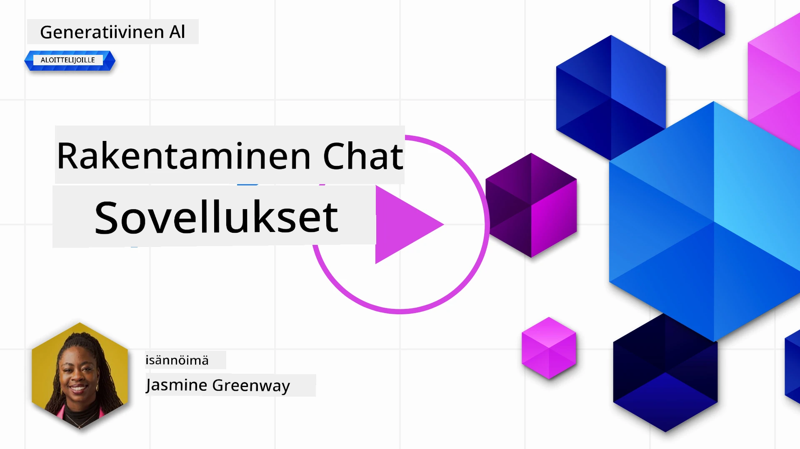
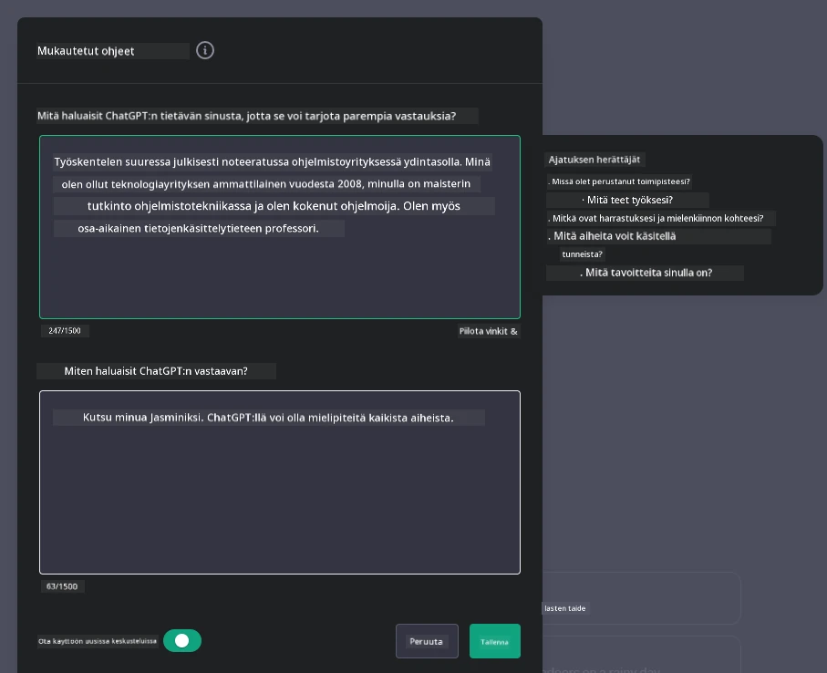
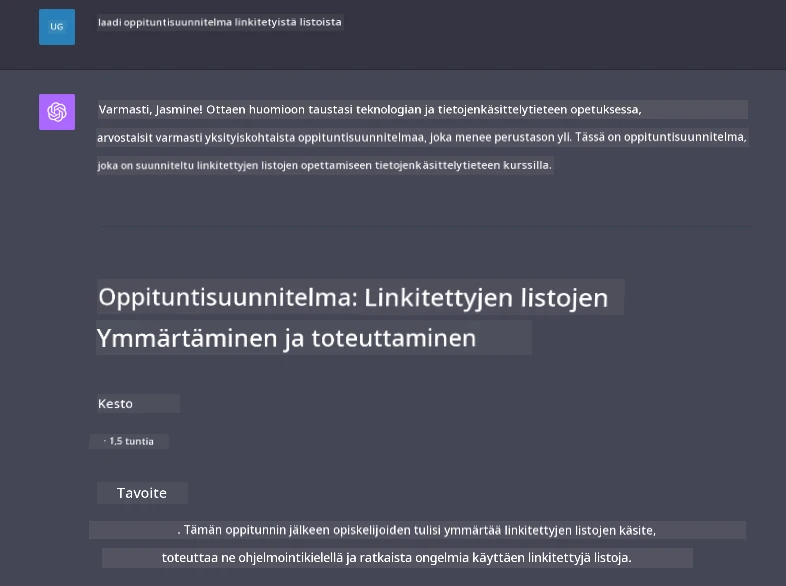

# Generatiivista tekoälyä hyödyntävien chat-sovellusten rakentaminen

[](https://youtu.be/R9V0ZY1BEQo?si=IHuU-fS9YWT8s4sA)

> _(Klikkaa yllä olevaa kuvaa katsoaksesi tämän oppitunnin videon)_

Nyt kun olemme nähneet, miten voimme rakentaa tekstinluontisovelluksia, tarkastellaan chat-sovelluksia.

Chat-sovelluksista on tullut osa jokapäiväistä elämäämme, ja ne tarjoavat enemmän kuin vain mahdollisuuden rentoon keskusteluun. Ne ovat olennainen osa asiakaspalvelua, teknistä tukea ja jopa kehittyneitä neuvontajärjestelmiä. On todennäköistä, että olet saanut apua chat-sovellukselta äskettäin. Kun integroimme näihin alustoihin edistyneempiä teknologioita kuten generatiivista tekoälyä, monimutkaisuus kasvaa ja samoin haasteet.

Joitakin kysymyksiä, joihin meidän on vastattava, ovat:

- **Sovelluksen rakentaminen**. Miten rakennamme tehokkaasti ja saumattomasti integroimme nämä tekoälyllä varustetut sovellukset tiettyihin käyttötarkoituksiin?
- **Valvonta**. Kun sovellukset on otettu käyttöön, miten voimme seurata ja varmistaa, että ne toimivat parhaalla mahdollisella laadulla niin toiminnallisuuden kuin [vastuullisen tekoälyn kuuden periaatteen](https://www.microsoft.com/ai/responsible-ai?WT.mc_id=academic-105485-koreyst) noudattamisen osalta?

Kun siirrymme yhä enemmän automaation ja saumattoman ihmisen ja koneen vuorovaikutuksen aikakauteen, on olennaista ymmärtää, miten generatiivinen tekoäly muuttaa chat-sovellusten laajuutta, syvyyttä ja sopeutumiskykyä. Tässä oppitunnissa tutkitaan arkkitehtuurisia näkökulmia, jotka tukevat näitä monimutkaisia järjestelmiä, käsitellään menetelmiä niiden hienosäätöön toimialakohtaisia tehtäviä varten ja arvioidaan mittareita ja näkökulmia, jotka ovat olennaisia vastuullisen tekoälyn käyttöönotossa.

## Johdanto

Tämä oppitunti kattaa:

- Tekniikat chat-sovellusten tehokkaaseen rakentamiseen ja integrointiin.
- Sovellusten räätälöinnin ja hienosäädön käytännöt.
- Strategiat ja näkökohdat chat-sovellusten tehokkaaseen valvontaan.

## Oppimistavoitteet

Oppitunnin lopuksi pystyt:

- Kuvaamaan näkökulmia chat-sovellusten rakentamiseen ja integrointiin olemassa oleviin järjestelmiin.
- Räätälöimään chat-sovelluksia tiettyihin käyttötarkoituksiin.
- Tunnistamaan keskeiset mittarit ja näkökulmat tekoälyllä varustettujen chat-sovellusten laadun tehokkaaseen seuranaan ja ylläpitoon.
- Varmistamaan, että chat-sovellukset hyödyntävät tekoälyä vastuullisesti.

## Generatiivisen tekoälyn integrointi chat-sovelluksiin

Chat-sovellusten parantaminen generatiivisella tekoälyllä ei koske pelkästään niiden älykkäämmäksi tekemistä, vaan myös arkkitehtuurin, suorituskyvyn ja käyttöliittymän optimointia laadukkaan käyttökokemuksen tarjoamiseksi. Tämä tarkoittaa arkkitehtuuriperusteiden, API-integraatioiden ja käyttöliittymän näkökulmien tutkimista. Tämä osio pyrkii tarjoamaan sinulle kokonaisvaltaisen tiekartan monimutkaisten ympäristöjen hallintaan, olitpa sitten liittämässä ne olemassa oleviin järjestelmiin tai rakentamassa itsenäisiä alustoja.

Tämän osion lopuksi olet varustautunut taidoilla, joita tarvitset rakentaaksesi ja integroidaksesi chat-sovelluksia tehokkaasti.

### Chatbot vai chat-sovellus?

Ennen kuin sukellamme chat-sovellusten rakentamiseen, vertaillaan 'chatbotteja' ja 'tekoälyllä varustettuja chat-sovelluksia', sillä niillä on erilaiset roolit ja toiminnallisuudet. Chatbotin päätarkoitus on automatisoida tiettyjä keskustelutehtäviä, kuten vastata usein kysyttyihin kysymyksiin tai seurata paketin kulkua. Se toimii yleensä sääntöpohjaisesti tai monimutkaisten tekoälyalgoritmien avulla. Sen sijaan tekoälyllä varustettu chat-sovellus on paljon laajempi ympäristö, joka mahdollistaa monenlaiset digitaaliset viestintämuodot, kuten teksti-, ääni- ja videokeskustelut ihmiskäyttäjien välillä. Sen määrittelevä piirre on generatiivisen tekoälymallin integrointi, joka simuloi vivahteikkaita, ihmismäisiä keskusteluja ja luo vastauksia laajan syötteen ja kontekstuaalisten vihjeiden perusteella. Generatiivisella tekoälyllä toimiva chat-sovellus voi käydä avoimen alan keskusteluja, sopeutua muuttuvaan keskustelukontekstiin ja jopa tuottaa luovaa tai monimutkaista vuoropuhelua.

Alla oleva taulukko hahmottaa keskeiset erot ja yhtäläisyydet, jotka auttavat ymmärtämään niiden ainutlaatuisia rooleja digitaalisessa viestinnässä.

| Chatbot                               | Generatiivista tekoälyä hyödyntävä chat-sovellus              |
| ------------------------------------- | -------------------------------------- |
| Tehtäväkeskeinen ja sääntöpohjainen  | Kontekstin huomioiva                           |
| Usein integroitu suurempiin järjestelmiin  | Voi isännöidä yhtä tai useampaa chatbotia      |
| Rajattu ohjelmoituihin toimintoihin   | Sisältää generatiivisia tekoälymalleja           |
| Erikoistuneet ja rakenteelliset vuorovaikutukset | Pystyy käymään avoimen alan keskusteluja      |

### Valmiiden toimintojen hyödyntäminen SDK:ien ja API:en avulla

Chat-sovellusta rakentaessa hyvä ensimmäinen askel on arvioida, mitä jo on tarjolla. SDK:iden ja API:en käyttäminen chat-sovellusten rakentamiseen on hyödyllinen strategia monista syistä. Integroimalla hyvin dokumentoidut SDK:t ja API:t sijoitat sovelluksesi strategisesti pitkän aikavälin menestykseen huolehtien skaalautuvuudesta ja ylläpidon vaatimuksista.

- **Kehitysprosessin nopeuttaminen ja kuormituksen vähentäminen**: Luottamalla valmiisiin toimintoihin sen sijaan, että rakentaisit kaiken itse, voit keskittyä muihin sovelluksesi osa-alueisiin, kuten liiketoimintalogiikkaan.
- **Parempi suorituskyky**: Rakentaessasi toiminnallisuutta alusta alkaen kysyt lopulta itseltäsi ”Miten tämä skaalautuu? Pystyykö sovellus käsittelemään äkillisen käyttäjämäärän kasvun?” Hyvin ylläpidetyillä SDK:illa ja API:eilla on usein nämä asiat huomioituina.
- **Helpompi ylläpito**: Päivitykset ja parannukset on helpompaa hallita, koska useimmat API:t ja SDK:t vaativat vain kirjaston päivityksen uudemman version ilmestyessä.
- **Pääsy huipputeknologiaan**: Mallien hyödyntäminen, joita on hienosäädetty ja koulutettu laajoilla tietoaineistoilla, tarjoaa sovelluksellesi luonnollisen kielen kyvykkyyksiä.

SDK:n tai API:n toiminnallisuuteen pääseminen sisältää yleensä luvan hankkimisen palvelun käyttämiseen, joka tapahtuu tyypillisesti ainutlaatuisen avaimen tai tunnistautumistunnuksen avulla. Tutustumme OpenAI Python -kirjaston avulla, miltä tämä käytännössä näyttää. Voit myös kokeilla itse seuraavissa [OpenAI:n notebookissa](./python/oai-assignment.ipynb?WT.mc_id=academic-105485-koreyst) tai [Azure OpenAI -palveluiden notebookissa](./python/aoai-assignment.ipynb?WT.mc_id=academic-105485-koreys) tälle oppitunnille.

```python
import os
from openai import OpenAI

API_KEY = os.getenv("OPENAI_API_KEY","")

client = OpenAI(
    api_key=API_KEY
    )

response = client.responses.create(model="gpt-5-mini", input="Suggest two titles for an instructional lesson on chat applications for generative AI.", store=False)
print(response.output_text)
```

Yllä olevassa esimerkissä käytetään GPT-5 mini -mallia Responses API:n kanssa kehotteen täydentämiseen, mutta huomaa, että API-avain on asetettu ennen tätä. Ilman avainta saisit virheen.

## Käyttäjäkokemus (UX)

Yleiset UX-periaatteet pätevät chat-sovelluksiin, mutta tässä on joitakin lisänäkökulmia, jotka korostuvat koneoppimisen komponenttien mukanaollessa.

- **Epätarkkuuksien käsittelymekanismi**: Generatiiviset tekoälymallit tuottavat toisinaan epäselviä vastauksia. Ominaisuus, joka antaa käyttäjille mahdollisuuden pyytää tarkennusta, voi olla hyödyllinen tällaisissa tilanteissa.
- **Kontekstin säilyttäminen**: Kehittyneillä generatiivisilla tekoälymalleilla on kyky muistaa keskustelun konteksti, mikä voi olla välttämätön osa käyttökokemusta. Käyttäjille annettu mahdollisuus hallita ja säädellä kontekstia parantaa käyttökokemusta, mutta tuo mukanaan riskin arkaluontoisten tietojen säilyttämisestä. Tietojen säilyttämisen pituutta koskevat näkökohdat, kuten säilytyskäytännön käyttöönotto, voivat tasapainottaa kontekstitarvetta ja yksityisyyttä.
- **Personalisointi**: Mallien kyky oppia ja sopeutua tarjoaa yksilöllisen kokemuksen käyttäjälle. Käyttäjäprofiilien kaltaisten ominaisuuksien avulla räätälöity käyttökokemus saa käyttäjän tuntemaan itsensä ymmärretyksi ja auttaa häntä löytämään tarkat vastaukset tehokkaammin ja miellyttävämmin.

Yksi esimerkki personalisoinnista on OpenAI:n ChatGPT:n “Custom instructions” -asetukset. Niillä voit antaa tietoja itsestäsi, jotka voivat olla olennaista kontekstia kehotteillesi. Tässä esimerkki mukautetusta ohjeesta.



Tämä "profiili" ohjaa ChatGPT:tä laatimaan oppitunnin linkitetyistä listoista. Huomaa, että ChatGPT ottaa huomioon käyttäjän aikaisemman kokemuksen ja halun saada syvällisempi oppitunti.



### Microsoftin järjestelmäviestikehys suurille kielimalleille

[Microsoft on antanut ohjeistuksen](https://learn.microsoft.com/azure/ai-foundry/openai/concepts/system-message#define-the-models-output-format?WT.mc_id=academic-105485-koreyst) tehokkaiden järjestelmäviestien kirjoittamisesta LLM-mallien vastausten tuottamiseen neljällä osa-alueella:

1. Mallin käyttötarkoituksen ja sen kykyjen sekä rajoitusten määrittely.
2. Mallin tuottaman vastausformaatin määrittely.
3. Tarkkojen esimerkkien tarjoaminen, jotka demonstroivat mallin toivottua käyttäytymistä.
4. Lisäkäyttäytymisen suojautumiskeinojen tarjoaminen.

### Esteettömyys

Olipa käyttäjällä visuaalisia, kuulo-, motorisia tai kognitiivisia rajoitteita, hyvin suunnitellun chat-sovelluksen tulee olla kaikkien käyttäjien saavutettavissa. Seuraava lista hahmottaa erityisiä ominaisuuksia, jotka on suunniteltu lisäämään saavutettavuutta erilaisille käyttäjävammaryhmille.

- **Visuaalisen vamman ominaisuudet**: Korkean kontrastin teemat ja skaalautuva teksti, ruudunlukijan yhteensopivuus.
- **Kuulovamman ominaisuudet**: Tekstin puheeksi ja puheen tekstiksi muuntotoiminnot, visuaaliset merkit äänisignaaleille.
- **Motorisen vamman ominaisuudet**: Näppäimistönavigoinnin tuki, äänikomennot.
- **Kognitiivisen vamman ominaisuudet**: Yksinkertaistetun kielen vaihtoehdot.

## Räätälöinti ja hienosäätö toimialakohtaisille kielimalleille

Kuvittele chat-sovellus, joka ymmärtää yrityksesi ammattisanaston ja ennakoi käyttäjän yleiset kysymykset. Mainittavia lähestymistapoja on pari:

- **DSL-mallien hyödyntäminen**. DSL tarkoittaa toimialakohtaista kieltä. Voit hyödyntää niin kutsuttua DSL-mallia, joka on koulutettu tietyn toimialan käsitteiden ja tilanteiden ymmärtämiseen.
- **Hienosäännä mallia**. Hienosäätö tarkoittaa mallin jatkokouluttamista spesifisellä aineistolla.

## Räätälöinti: DSL:n käyttäminen

Toimialakohtaisten kielimallien (DSL-mallien) hyödyntäminen voi lisätä käyttäjävuorovaikutusta tarjoamalla erikoistuneita, kontekstuaalisesti merkityksellisiä vuorovaikutuksia. Se on malli, joka on koulutettu tai hienosäädetty ymmärtämään ja tuottamaan tekstiä tiettyyn alaan, teollisuuteen tai aiheeseen liittyen. DSL-mallin käyttäminen voi vaihdella mallin kouluttamisesta alusta alkaen valmiiden SDK:en ja API:en kautta tapahtuvaan hyödyntämiseen. Toinen vaihtoehto on hienosäätö, jossa olemassaolevaa ennalta koulutettua mallia mukautetaan tietylle toimialalle.

## Räätälöinti: Hienosäädön soveltaminen

Hienosäätö on usein harkittava, kun ennalta koulutettu malli ei riitä erikoistuneessa toimialassa tai tiettyyn tehtävään.

Esimerkiksi lääketieteelliset kyselyt ovat monimutkaisia ja vaativat paljon kontekstia. Kun lääkäri tekee diagnoosin, se perustuu moniin tekijöihin, kuten elämäntapaan tai aiemmin esiintyneisiin sairauksiin, ja saattaa lisäksi nojautua viimeaikaisiin lääketieteellisiin tutkimusjulkaisuihin diagnosin vahvistamiseksi. Näissä hienovaraisissa tilanteissa yleiskäyttöinen tekoälysovellus ei voi olla luotettava lähde.

### Tilanne: lääketieteellinen sovellus

Kuvittele chat-sovellus, joka on suunniteltu auttamaan lääketieteen ammattilaisia tarjoamalla nopeita viitteitä hoito-ohjeisiin, lääkkeiden yhteisvaikutuksiin tai viimeisimpiin tutkimustuloksiin.

Yleiskäyttöinen malli saattaa riittää peruslääketieteellisten kysymysten vastaamiseen tai yleisten neuvojen antamiseen, mutta siinä voi olla vaikeuksia seuraavissa tilanteissa:

- **Erittäin spesifit tai monimutkaiset tapaukset**. Esimerkiksi neurologi saattaa kysyä sovellukselta: ”Mitkä ovat nykyiset parhaat käytännöt lääkkeille vastustuskykyisen epilepsian hoitamiseksi lapsipotilailla?”
- **Puuttuvat viimeisimmät edistysaskeleet**. Yleiskäyttöinen malli voi vaikeuksissa tarjota ajankohtaisen vastauksen, joka sisältää neurotieteen ja farmakologian viimeisimmät saavutukset.

Tällaisissa tapauksissa mallin hienosäätö erikoistuneella lääketieteellisellä aineistolla voi merkittävästi parantaa sen kykyä käsitellä monimutkaisia lääketieteellisiä kyselyjä tarkemmin ja luotettavammin. Tämä edellyttää pääsyä suureen ja aiheeseen liittyvään tietoaineistoon, joka kattaa toimialakohtaiset haasteet ja kysymykset, jotka on käsiteltävä.

## Laadukkaan tekoälypohjaisen chat-kokemuksen näkökohdat

Tässä osiossa esitellään "laadukkaiden" chat-sovellusten kriteerit, joihin kuuluu käyttökelpoisten mittareiden kerääminen ja vastuullisesti tekoälyteknologiaa hyödyntävän kehysmallin noudattaminen.

### Keskeiset mittarit

Laadukkaan sovelluksen suorituskyvyn ylläpitämiseksi on tärkeää seurata keskeisiä mittareita ja näkökulmia. Nämä mittaukset varmistavat sovelluksen toimivuuden lisäksi myös tekoälymallin ja käyttökokemuksen laadun. Alla on luettelo perus-, tekoäly- ja käyttökokemukseen liittyvistä mittareista, jotka kannattaa ottaa huomioon.

| Mittari                       | Määritelmä                                                                                                          | Kehittäjän huomioitavat seikat                                |
| ----------------------------- | ------------------------------------------------------------------------------------------------------------------ | -------------------------------------------------------------- |
| **Käyttöaika**                | Mittaa ajan, jolloin sovellus on toiminnassa ja käyttäjien saavutettavissa.                                        | Miten minimoit käyttökatkokset?                              |
| **Vastausaika**               | Aika, jonka sovellus käyttää vastatakseen käyttäjän kyselyyn.                                                     | Miten optimoit kyselyn käsittelyn parantaaksesi vastausaikaa? |
| **Tarkkuus**                  | Tosien positiivisten ennusteiden suhde kaikkien positiivisten ennusteiden määrään.                                 | Miten validoit mallisi tarkkuuden?                             |
| **Havaitsevuus (sensitiivisyys)** | Tosien positiivisten ennusteiden suhde todelliseen positiivisten määrään.                                        | Miten mittaat ja parannat havaitsevuutta?                     |
| **F1-pisteet**                | Tarkkuuden ja havaitsevyyden harmoninen keskiarvo, joka tasapainottaa molemmat.                                   | Mikä on tavoittelemasi F1-pistemäärä? Miten tasapainotat tarkkuutta ja havaitsevyyttä? |
| **Hämmentyneisyys (perplexity)** | Mittaa, kuinka hyvin mallin ennustama todennäköisyysjakauma vastaa datan todellista jakaumaa.                     | Miten minimoit hämmentyneisyyden?                              |
| **Käyttäjätyytyväisyysmittarit** | Mittaa käyttäjän käsitystä sovelluksesta. Usein kerätään kyselyillä.                                              | Kuinka usein keräät käyttäjäpalautetta? Miten mukautat sen perusteella? |
| **Virheiden määrä**            | Mallin tekemien virheiden määrä ymmärtämisessä tai vastauksissa.                                                 | Mitä strategioita sinulla on virheiden vähentämiseksi?       |
| **Uudelleenkoulutussyklit**   | Kuinka usein mallia päivitetään uusilla tiedoilla ja näkemyksillä.                                               | Kuinka usein uudelleenkoulutat mallin? Mikä käynnistää uudelleenkoulutussyklin? |

| **Poikkeavuuksien tunnistus** | Työkaluja ja tekniikoita epätavallisten mallien tunnistamiseen, jotka eivät vastaa odotettua käyttäytymistä.                  | Kuinka vastaat poikkeavuuksiin?                                          |

### Vastuullisten tekoälykäytäntöjen toteuttaminen chat-sovelluksissa

Microsoftin lähestymistapa vastuulliseen tekoälyyn on tunnistanut kuusi periaatetta, joiden tulisi ohjata tekoälyn kehitystä ja käyttöä. Alla ovat periaatteet, niiden määritelmät sekä huomioita chat-kehittäjälle ja miksi niitä tulisi ottaa vakavasti.

| Periaatteet           | Microsoftin määritelmä                                | Huomioitavaa chat-kehittäjälle                                       | Miksi se on tärkeää                                                                    |
| ---------------------- | ----------------------------------------------------- | ---------------------------------------------------------------------- | -------------------------------------------------------------------------------------- |
| Oikeudenmukaisuus      | Tekoälyjärjestelmien tulisi kohdella kaikkia ihmisiä oikeudenmukaisesti. | Varmista, ettei chat-sovellus diskriminoi käyttäjätietojen perusteella. | Luottamuksen ja inklusiivisuuden rakentamiseksi käyttäjien keskuudessa; välttää oikeudellisia seuraamuksia. |
| Luotettavuus ja turvallisuus | Tekoälyjärjestelmien tulisi toimia luotettavasti ja turvallisesti. | Toteuta testauksia ja varajärjestelmiä virheiden ja riskien minimoimiseksi. | Varmistaa käyttäjien tyytyväisyyden ja ehkäisee mahdollisia vahinkoja.                  |
| Yksityisyys ja turvallisuus | Tekoälyjärjestelmien tulisi olla turvallisia ja kunnioittaa yksityisyyttä. | Toteuta vahvaa salakirjoitusta ja tietosuojatoimia.                  | Herkkien käyttäjätietojen suojelemiseksi ja tietosuojalakien noudattamiseksi.          |
| Osallisuus           | Tekoälyjärjestelmien tulisi valtuuttaa kaikkia ja sitouttaa ihmisiä.   | Suunnittele käyttöliittymä/UX, joka on saavutettava ja helppokäyttöinen moninaisille yleisöille. | Varmistaa, että laajempi joukko ihmisiä voi käyttää sovellusta tehokkaasti.              |
| Läpinäkyvyys         | Tekoälyjärjestelmien tulisi olla ymmärrettäviä.        | Tarjoa selkeää dokumentaatiota ja perusteluja tekoälyn vastauksille.  | Käyttäjät luottavat järjestelmään todennäköisemmin, jos he voivat ymmärtää päätöksenteon perusteet. |
| Vastuuvelvollisuus   | Ihmisten tulisi olla vastuussa tekoälyjärjestelmistä.  | Perusta selkeä prosessi tekoälypäätösten tarkastamiseen ja parantamiseen. | Mahdollistaa jatkuvan parantamisen ja oikaisutoimet virhetilanteissa.                  |

## Tehtävä

Katso [tehtävä](../../../07-building-chat-applications/python). Se ohjaa sinut sarjan harjoitusten läpi ensimmäisistä chat-kehotteistasi tekstin luokitteluun ja tiivistämiseen sekä muuta. Huomaa, että tehtävät ovat saatavilla eri ohjelmointikielillä!

## Hienoa työtä! Jatka matkaa

Tämän oppitunnin suorittamisen jälkeen tutustu [Generatiivisen tekoälyn oppimiskokoelmaamme](https://aka.ms/genai-collection?WT.mc_id=academic-105485-koreyst), ja jatka generatiivisen tekoälyn taitojesi kehittämistä!

Siirry Oppitunnille 8 nähdäksesi, kuinka voit aloittaa [hakusovellusten rakentamisen](../08-building-search-applications/README.md?WT.mc_id=academic-105485-koreyst)!

---

<!-- CO-OP TRANSLATOR DISCLAIMER START -->
**Vastuuvapauslauseke**:
Tämä asiakirja on käännetty käyttämällä tekoälypohjaista käännöspalvelua [Co-op Translator](https://github.com/Azure/co-op-translator). Vaikka pyrimme tarkkuuteen, otathan huomioon, että automaattiset käännökset saattavat sisältää virheitä tai epätarkkuuksia. Alkuperäinen asiakirja sen alkuperäiskielellä on virallinen lähde. Tärkeissä asioissa suositellaan ammattimaista ihmiskäännöstä. Emme ole vastuussa tämän käännöksen käytöstä aiheutuvista väärinymmärryksistä tai tulkinnoista.
<!-- CO-OP TRANSLATOR DISCLAIMER END -->