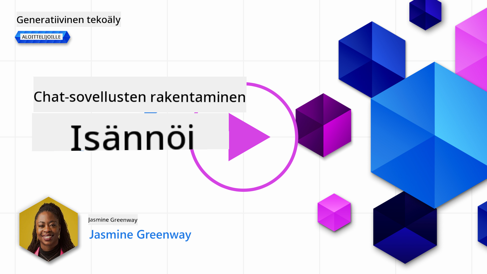

<!--
CO_OP_TRANSLATOR_METADATA:
{
  "original_hash": "a5308963a56cfbad2d73b0fa99fe84b3",
  "translation_date": "2025-10-17T19:45:42+00:00",
  "source_file": "07-building-chat-applications/README.md",
  "language_code": "fi"
}
-->
# Generatiiviseen tekoälyyn perustuvien chat-sovellusten rakentaminen

[](https://youtu.be/R9V0ZY1BEQo?si=IHuU-fS9YWT8s4sA)

> _(Klikkaa yllä olevaa kuvaa nähdäksesi tämän oppitunnin videon)_

Nyt kun olemme nähneet, miten tekstin generointisovelluksia voidaan rakentaa, tarkastellaan chat-sovelluksia.

Chat-sovellukset ovat osa jokapäiväistä elämäämme ja tarjoavat paljon enemmän kuin vain keinoja rentoon keskusteluun. Ne ovat keskeisiä asiakaspalvelussa, teknisessä tuessa ja jopa kehittyneissä neuvontajärjestelmissä. On todennäköistä, että olet saanut apua chat-sovelluksesta melko hiljattain. Kun integroimme kehittyneempiä teknologioita, kuten generatiivista tekoälyä, näihin alustoihin, niiden monimutkaisuus kasvaa, samoin kuin haasteet.

Muutamia kysymyksiä, joihin meidän on vastattava:

- **Sovelluksen rakentaminen**. Miten voimme rakentaa ja integroida nämä tekoälypohjaiset sovellukset tehokkaasti tiettyihin käyttötarkoituksiin?
- **Seuranta**. Kun sovellus on otettu käyttöön, miten voimme seurata ja varmistaa, että sovellus toimii korkealaatuisesti sekä toiminnallisuuden että [vastuullisen tekoälyn kuuden periaatteen](https://www.microsoft.com/ai/responsible-ai?WT.mc_id=academic-105485-koreyst) mukaisesti?

Kun siirrymme kohti automaation ja saumattoman ihmisen ja koneen vuorovaikutuksen aikakautta, generatiivisen tekoälyn vaikutusten ymmärtäminen chat-sovellusten laajuuteen, syvyyteen ja mukautuvuuteen tulee välttämättömäksi. Tässä oppitunnissa tarkastellaan näitä monimutkaisia järjestelmiä tukevia arkkitehtuurin osa-alueita, perehdytään menetelmiin niiden hienosäätämiseksi alakohtaisiin tehtäviin ja arvioidaan vastuullisen tekoälyn käyttöönottoon liittyviä mittareita ja näkökohtia.

## Johdanto

Tämä oppitunti kattaa:

- Tekniikat chat-sovellusten tehokkaaseen rakentamiseen ja integrointiin.
- Miten sovelluksia voidaan mukauttaa ja hienosäätää.
- Strategiat ja näkökohdat chat-sovellusten tehokkaaseen seurantaan.

## Oppimistavoitteet

Oppitunnin lopussa osaat:

- Kuvata chat-sovellusten rakentamiseen ja integrointiin liittyviä näkökohtia olemassa oleviin järjestelmiin.
- Mukauttaa chat-sovelluksia tiettyihin käyttötarkoituksiin.
- Tunnistaa keskeiset mittarit ja näkökohdat tekoälypohjaisten chat-sovellusten laadun tehokkaaseen seurantaan ja ylläpitoon.
- Varmistaa, että chat-sovellukset hyödyntävät tekoälyä vastuullisesti.

## Generatiivisen tekoälyn integrointi chat-sovelluksiin

Chat-sovellusten parantaminen generatiivisen tekoälyn avulla ei keskity pelkästään niiden älykkäämmäksi tekemiseen; kyse on myös niiden arkkitehtuurin, suorituskyvyn ja käyttöliittymän optimoinnista laadukkaan käyttäjäkokemuksen tarjoamiseksi. Tämä sisältää arkkitehtuurin perusteiden, API-integraatioiden ja käyttöliittymän näkökohtien tutkimisen. Tämä osio tarjoaa kattavan tiekartan näiden monimutkaisten kokonaisuuksien navigointiin, olipa kyseessä olemassa oleviin järjestelmiin liittäminen tai itsenäisten alustojen rakentaminen.

Tämän osion lopussa sinulla on asiantuntemusta chat-sovellusten tehokkaaseen rakentamiseen ja integrointiin.

### Chatbot vai chat-sovellus?

Ennen kuin sukellamme chat-sovellusten rakentamiseen, vertaillaan "chatbotteja" ja "tekoälypohjaisia chat-sovelluksia", jotka palvelevat erilaisia rooleja ja toimintoja. Chatbotin pääasiallinen tarkoitus on automatisoida tiettyjä keskustelutehtäviä, kuten vastata usein kysyttyihin kysymyksiin tai seurata pakettia. Se toimii yleensä sääntöpohjaisen logiikan tai monimutkaisten tekoälyalgoritmien avulla. Tekoälypohjainen chat-sovellus sen sijaan on paljon laajempi ympäristö, joka on suunniteltu mahdollistamaan erilaisia digitaalisia viestintätapoja, kuten teksti-, ääni- ja videokeskusteluja ihmiskäyttäjien välillä. Sen määrittelevä ominaisuus on generatiivisen tekoälymallin integrointi, joka simuloi vivahteikkaita, ihmismäisiä keskusteluja ja tuottaa vastauksia monenlaisten syötteiden ja kontekstivihjeiden perusteella. Generatiiviseen tekoälyyn perustuva chat-sovellus voi käydä avoimen aiheen keskusteluja, mukautua kehittyviin keskustelukonteksteihin ja jopa tuottaa luovia tai monimutkaisia dialogeja.

Alla oleva taulukko esittelee keskeiset erot ja yhtäläisyydet, jotka auttavat ymmärtämään niiden ainutlaatuisia rooleja digitaalisessa viestinnässä.

| Chatbot                               | Generatiiviseen tekoälyyn perustuva chat-sovellus |
| ------------------------------------- | ------------------------------------------------ |
| Tehtäväkeskeinen ja sääntöpohjainen   | Kontekstia ymmärtävä                            |
| Usein integroitu suurempiin järjestelmiin | Voi sisältää yhden tai useita chatbotteja       |
| Rajoittuu ohjelmoituihin toimintoihin | Sisältää generatiivisia tekoälymalleja          |
| Erikoistuneet ja rakenteelliset vuorovaikutukset | Pystyy avoimen aiheen keskusteluihin           |

### Valmiiden toimintojen hyödyntäminen SDK:iden ja API:iden avulla

Chat-sovellusta rakentaessa hyvä ensimmäinen askel on arvioida, mitä on jo saatavilla. SDK:iden ja API:iden käyttö chat-sovellusten rakentamisessa on hyödyllinen strategia monista syistä. Hyvin dokumentoitujen SDK:iden ja API:iden integroiminen asettaa sovelluksesi strategisesti pitkän aikavälin menestykseen, käsitellen skaalautuvuuteen ja ylläpitoon liittyviä huolenaiheita.

- **Nopeuttaa kehitysprosessia ja vähentää kustannuksia**: Valmiiden toimintojen hyödyntäminen kalliiden omien ratkaisujen sijaan antaa mahdollisuuden keskittyä sovelluksen muihin tärkeisiin osa-alueisiin, kuten liiketoimintalogiikkaan.
- **Parempi suorituskyky**: Kun toimintoja rakennetaan alusta alkaen, tulee kysymys "Miten tämä skaalautuu? Onko sovellus valmis käsittelemään äkillistä käyttäjien määrän kasvua?" Hyvin ylläpidetyt SDK:t ja API:t sisältävät usein ratkaisuja näihin huolenaiheisiin.
- **Helpompi ylläpito**: Päivitykset ja parannukset ovat helpommin hallittavissa, sillä useimmat API:t ja SDK:t vaativat vain kirjaston päivittämisen, kun uudempi versio julkaistaan.
- **Pääsy huipputeknologiaan**: Mallien hyödyntäminen, jotka on hienosäädetty ja koulutettu laajoilla tietoaineistoilla, tarjoaa sovelluksellesi luonnollisen kielen käsittelykyvyt.

SDK:n tai API:n toiminnallisuuden käyttö edellyttää yleensä lupaa käyttää tarjottuja palveluita, mikä tapahtuu usein ainutlaatuisen avaimen tai autentikointitunnuksen avulla. Käytämme OpenAI Python -kirjastoa tutkiaksemme, miltä tämä näyttää. Voit myös kokeilla sitä itse seuraavassa [OpenAI-muistikirjassa](./python/oai-assignment.ipynb?WT.mc_id=academic-105485-koreyst) tai [Azure OpenAI Services -muistikirjassa](./python/aoai-assignment.ipynb?WT.mc_id=academic-105485-koreys) tämän oppitunnin yhteydessä.

```python
import os
from openai import OpenAI

API_KEY = os.getenv("OPENAI_API_KEY","")

client = OpenAI(
    api_key=API_KEY
    )

chat_completion = client.chat.completions.create(model="gpt-3.5-turbo", messages=[{"role": "user", "content": "Suggest two titles for an instructional lesson on chat applications for generative AI."}])
```

Yllä oleva esimerkki käyttää GPT-3.5 Turbo -mallia kehotteen täydentämiseen, mutta huomaa, että API-avain asetetaan ennen sitä. Saat virheen, jos et aseta avainta.

## Käyttäjäkokemus (UX)

Yleiset UX-periaatteet pätevät chat-sovelluksiin, mutta koneoppimiseen liittyvien komponenttien vuoksi on joitakin lisänäkökohtia, jotka ovat erityisen tärkeitä.

- **Keino epäselvyyksien käsittelyyn**: Generatiiviset tekoälymallit tuottavat toisinaan epäselviä vastauksia. Ominaisuus, joka antaa käyttäjille mahdollisuuden pyytää tarkennusta, voi olla hyödyllinen, jos he kohtaavat tämän ongelman.
- **Kontekstin säilyttäminen**: Kehittyneet generatiiviset tekoälymallit pystyvät muistamaan keskustelun kontekstin, mikä voi olla välttämätön etu käyttäjäkokemukselle. Käyttäjille annettu mahdollisuus hallita ja hallinnoida kontekstia parantaa käyttäjäkokemusta, mutta tuo mukanaan riskin säilyttää arkaluonteisia käyttäjätietoja. Näkökohtia, kuten tietojen säilytyspolitiikan käyttöönotto, voivat tasapainottaa kontekstin tarpeen ja yksityisyyden välillä.
- **Personointi**: Oppimisen ja mukautumisen kyvyn ansiosta tekoälymallit tarjoavat yksilöllisen kokemuksen käyttäjälle. Käyttäjäkokemuksen räätälöinti ominaisuuksilla, kuten käyttäjäprofiileilla, ei ainoastaan saa käyttäjän tuntemaan itsensä ymmärretyksi, vaan myös auttaa häntä löytämään tiettyjä vastauksia tehokkaammin ja tyydyttävämmin.

Yksi esimerkki personoinnista on "Mukautetut ohjeet" -asetukset OpenAI:n ChatGPT:ssä. Sen avulla voit antaa tietoja itsestäsi, jotka voivat olla tärkeitä kontekstia kehotteillesi. Tässä on esimerkki mukautetusta ohjeesta.


Tämä "profiili" kehottaa ChatGPT:tä luomaan oppituntisuunnitelman linkkijonoista. Huomaa, että ChatGPT ottaa huomioon, että käyttäjä saattaa haluta syvällisemmän oppituntisuunnitelman kokemuksensa perusteella.


### Microsoftin järjestelmäviestikehys suurille kielimalleille

[Microsoft on tarjonnut ohjeita](https://learn.microsoft.com/azure/ai-services/openai/concepts/system-message#define-the-models-output-format?WT.mc_id=academic-105485-koreyst) tehokkaiden järjestelmäviestien kirjoittamiseen LLM-vastauksia generoitaessa, ja ne on jaettu neljään osa-alueeseen:

1. Määrittele, kenelle malli on tarkoitettu, sekä sen kyvyt ja rajoitukset.
2. Määrittele mallin ulostulon muoto.
3. Tarjoa erityisiä esimerkkejä, jotka osoittavat mallin toivotun käyttäytymisen.
4. Tarjoa lisäkäyttäytymisen suojamekanismeja.

### Esteettömyys

Olipa käyttäjällä näkö-, kuulo-, motorisia tai kognitiivisia rajoitteita, hyvin suunnitellun chat-sovelluksen tulisi olla kaikkien käytettävissä. Alla oleva lista jakaa erityisiä ominaisuuksia, jotka on suunniteltu parantamaan esteettömyyttä eri käyttäjärajoitteille.

- **Ominaisuudet näkörajoitteisille**: Korkean kontrastin teemat ja säädettävä teksti, näytönlukijan yhteensopivuus.
- **Ominaisuudet kuulorajoitteisille**: Teksti-puheeksi ja puhe-tekstiksi -toiminnot, visuaaliset vihjeet äänimuistutuksille.
- **Ominaisuudet motorisille rajoitteille**: Näppäimistön navigointituki, äänikomennot.
- **Ominaisuudet kognitiivisille rajoitteille**: Yksinkertaistetut kielivaihtoehdot.

## Mukauttaminen ja hienosäätö alakohtaisille kielimalleille

Kuvittele chat-sovellus, joka ymmärtää yrityksesi ammattikieltä ja ennakoi käyttäjäkunnan yleiset kysymykset. On olemassa muutamia lähestymistapoja, jotka kannattaa mainita:

- **DSL-mallien hyödyntäminen**. DSL tarkoittaa alakohtaista kieltä. Voit hyödyntää niin sanottua DSL-mallia, joka on koulutettu tiettyyn alaan ymmärtämään sen käsitteitä ja skenaarioita.
- **Hienosäätö**. Hienosäätö tarkoittaa mallin lisäkouluttamista erityisellä datalla.

## Mukauttaminen: DSL:n käyttö

Alakohtaisten kielimallien (DSL-mallien) hyödyntäminen voi parantaa käyttäjien sitoutumista tarjoamalla erikoistuneita, kontekstuaalisesti merkityksellisiä vuorovaikutuksia. Se on malli, joka on koulutettu tai hienosäädetty ymmärtämään ja tuottamaan tekstiä, joka liittyy tiettyyn alaan, teollisuuteen tai aiheeseen. DSL-mallin käyttömahdollisuudet vaihtelevat sellaisen kouluttamisesta alusta alkaen valmiiden mallien käyttöön SDK:iden ja API:iden kautta. Toinen vaihtoehto on hienosäätö, joka tarkoittaa olemassa olevan esikoulutetun mallin mukauttamista tiettyyn alaan.

## Mukauttaminen: Hienosäätö

Hienosäätöä harkitaan usein, kun esikoulutettu malli ei riitä erikoistuneessa alassa tai tietyssä tehtävässä.

Esimerkiksi lääketieteelliset kysymykset ovat monimutkaisia ja vaativat paljon kontekstia. Kun lääketieteen ammattilainen diagnosoi potilaan, se perustuu monenlaisiin tekijöihin, kuten elämäntapaan tai olemassa oleviin sairauksiin, ja saattaa jopa nojata tuoreisiin lääketieteellisiin julkaisuihin diagnoosin vahvistamiseksi. Tällaisissa vivahteikkaissa tilanteissa yleiskäyttöinen tekoälypohjainen chat-sovellus ei voi olla luotettava lähde.

### Skenaario: lääketieteellinen sovellus

Kuvittele chat-sovellus, joka on suunniteltu auttamaan lääketieteen ammattilaisia tarjoamalla nopeita viittauksia hoito-ohjeisiin, lääkeaineiden yhteisvaikutuksiin tai tuoreisiin tutkimustuloksiin.

Yleiskäyttöinen malli saattaa riittää vastaamaan peruslääketieteellisiin kysymyksiin tai antamaan yleisiä neuvoja, mutta se voi kohdata seuraavia haasteita:

- **Erittäin spesifiset tai monimutkaiset tapaukset**. Esimerkiksi neurologi saattaa kysyä sovellukselta: "Mitkä ovat nykyiset parhaat käytännöt lääkeresistentin epilepsian hoidossa lapsipotilailla?"
- **Tuoreiden edistysaskeleiden puute**. Yleiskäyttöinen malli voi kamppailla tarjotakseen ajankohtaisen vastauksen, joka sisältää uusimmat edistysaskeleet neurologiassa ja farmakologiassa.

Tällaisissa tapauksissa mallin hienosäätö erikoistuneella lääketieteellisellä tietoaineistolla voi merkittävästi parantaa sen kykyä käsitellä näitä monimutkaisia lääketieteellisiä kyselyitä tarkemmin ja luotettavammin. Tämä vaatii pääsyn laajaan ja relevanttiin tietoaineistoon, joka edustaa alakohtaisia haasteita ja kysymyksiä, joihin on vastattava.

## Näkökohtia korkealaatuisen tekoälypohjaisen chat-kokemuksen luomiseksi

Tässä osiossa hahmotellaan "korkealaatuisten" chat-sovellusten kriteerit, jotka sisältävät toimivien mittareiden keräämisen ja vastuullisen tekoälyteknologian hyödyntämisen.

### Keskeiset mittarit

Sovelluksen korkealaatuisen suorituskyvyn ylläpitämiseksi on tärkeää seurata keskeisiä mittareita ja näkökohtia. Nämä mittaukset eivät ainoastaan varmistaa sovelluksen toiminnallisuutta, vaan myös arvioivat tekoälymallin ja käyttäjäkokemuksen laatua. Alla on lista, joka kattaa perus-, tekoäly- ja käyttäjäkokemuksen mittarit, joita kannattaa harkita.

| Mittari                        | Mää
| **Poikkeavuuksien tunnistaminen** | Työkalut ja tekniikat epätavallisten mallien tunnistamiseen, jotka eivät vastaa odotettua käyttäytymistä. | Kuinka reagoit poikkeavuuksiin? |

### Vastuullisen tekoälyn käytäntöjen toteuttaminen chat-sovelluksissa

Microsoftin lähestymistapa vastuulliseen tekoälyyn on tunnistanut kuusi periaatetta, jotka ohjaavat tekoälyn kehitystä ja käyttöä. Alla ovat periaatteet, niiden määritelmät sekä asiat, joita chat-sovelluksen kehittäjän tulisi ottaa huomioon ja miksi ne ovat tärkeitä.

| Periaatteet            | Microsoftin määritelmä                                | Huomioitavat asiat chat-sovelluksen kehittäjälle                      | Miksi se on tärkeää                                                                     |
| ---------------------- | ----------------------------------------------------- | ---------------------------------------------------------------------- | -------------------------------------------------------------------------------------- |
| Reiluus                | Tekoälyjärjestelmien tulisi kohdella kaikkia ihmisiä reilusti. | Varmista, että chat-sovellus ei syrji käyttäjätietojen perusteella.   | Rakentaa luottamusta ja osallisuutta käyttäjien keskuudessa; välttää oikeudelliset seuraamukset. |
| Luotettavuus ja turvallisuus | Tekoälyjärjestelmien tulisi toimia luotettavasti ja turvallisesti. | Toteuta testaus ja varajärjestelmät virheiden ja riskien minimoimiseksi. | Varmistaa käyttäjätyytyväisyyden ja estää mahdolliset haitat.                          |
| Yksityisyys ja turvallisuus | Tekoälyjärjestelmien tulisi olla turvallisia ja kunnioittaa yksityisyyttä. | Toteuta vahva salaus ja tietosuojatoimenpiteet.                       | Suojaa arkaluontoiset käyttäjätiedot ja noudattaa yksityisyyslakeja.                   |
| Osallisuus             | Tekoälyjärjestelmien tulisi voimaannuttaa kaikkia ja osallistaa ihmisiä. | Suunnittele käyttöliittymä ja käyttökokemus, jotka ovat saavutettavia ja helppokäyttöisiä monipuolisille käyttäjäryhmille. | Varmistaa, että laaja joukko ihmisiä voi käyttää sovellusta tehokkaasti.               |
| Läpinäkyvyys           | Tekoälyjärjestelmien tulisi olla ymmärrettäviä.       | Tarjoa selkeää dokumentaatiota ja perusteluja tekoälyn vastauksille.  | Käyttäjät luottavat järjestelmään enemmän, jos he ymmärtävät, miten päätökset tehdään. |
| Vastuuvelvollisuus     | Ihmisten tulisi olla vastuussa tekoälyjärjestelmistä. | Luo selkeä prosessi tekoälypäätösten tarkastamiselle ja parantamiselle. | Mahdollistaa jatkuvan kehityksen ja korjaavat toimenpiteet virheiden sattuessa.        |

## Tehtävä

Katso [tehtävä](../../../07-building-chat-applications/python). Se vie sinut läpi sarjan harjoituksia, alkaen ensimmäisten chat-kehotteiden suorittamisesta, tekstin luokitteluun ja tiivistämiseen ja paljon muuta. Huomaa, että tehtävät ovat saatavilla eri ohjelmointikielillä!

## Hienoa työtä! Jatka matkaasi

Kun olet suorittanut tämän oppitunnin, tutustu [Generative AI Learning -kokoelmaan](https://aka.ms/genai-collection?WT.mc_id=academic-105485-koreyst) jatkaaksesi Generative AI -osaamisesi kehittämistä!

Siirry oppituntiin 8 ja katso, kuinka voit aloittaa [hakusovellusten rakentamisen](../08-building-search-applications/README.md?WT.mc_id=academic-105485-koreyst)!

---

**Vastuuvapauslauseke**:  
Tämä asiakirja on käännetty käyttämällä tekoälypohjaista käännöspalvelua [Co-op Translator](https://github.com/Azure/co-op-translator). Vaikka pyrimme tarkkuuteen, huomioithan, että automaattiset käännökset voivat sisältää virheitä tai epätarkkuuksia. Alkuperäinen asiakirja sen alkuperäisellä kielellä tulisi pitää ensisijaisena lähteenä. Tärkeissä tiedoissa suositellaan ammattimaista ihmiskäännöstä. Emme ole vastuussa väärinkäsityksistä tai virhetulkinnoista, jotka johtuvat tämän käännöksen käytöstä.