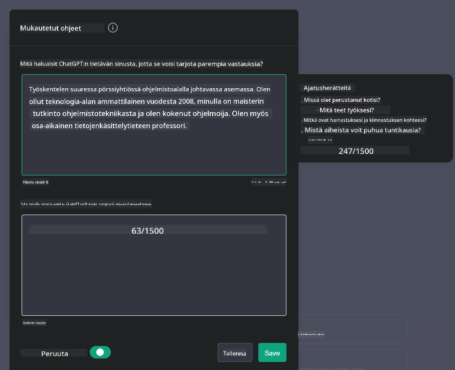
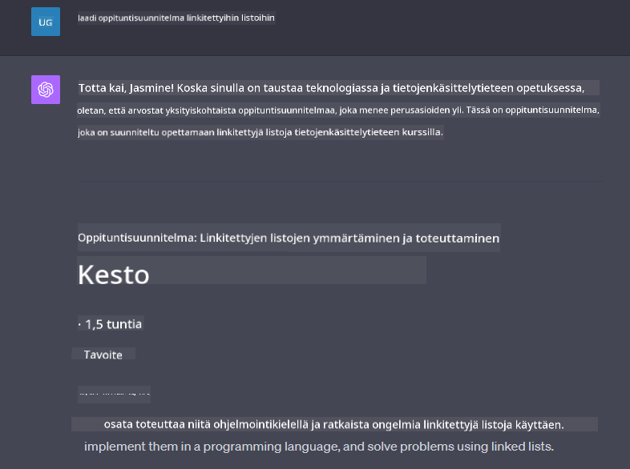

<!--
CO_OP_TRANSLATOR_METADATA:
{
  "original_hash": "ea4bbe640847aafbbba14dae4625e9af",
  "translation_date": "2025-07-09T12:32:29+00:00",
  "source_file": "07-building-chat-applications/README.md",
  "language_code": "fi"
}
-->
# Generatiivista tekoälyä hyödyntävien chat-sovellusten rakentaminen

[](https://aka.ms/gen-ai-lessons7-gh?WT.mc_id=academic-105485-koreyst)

> _(Klikkaa yllä olevaa kuvaa nähdäksesi tämän oppitunnin videon)_

Nyt kun olemme nähneet, miten tekstin generointisovelluksia voidaan rakentaa, tarkastellaanpa chat-sovelluksia.

Chat-sovellukset ovat integroituneet osaksi arkeamme tarjoten muutakin kuin vain kevyttä keskustelukanavaa. Ne ovat olennainen osa asiakaspalvelua, teknistä tukea ja jopa kehittyneitä neuvontajärjestelmiä. On hyvin todennäköistä, että olet saanut apua chat-sovellukselta äskettäin. Kun integroimme näihin alustoihin yhä kehittyneempiä teknologioita, kuten generatiivista tekoälyä, monimutkaisuus kasvaa – samoin haasteet.

Joihinkin kysymyksiin tarvitsemme vastauksia:

- **Sovelluksen rakentaminen**. Miten rakennamme tehokkaasti ja saumattomasti integroimme nämä tekoälyllä tehostetut sovellukset tiettyihin käyttötarkoituksiin?
- **Valvonta**. Kun sovellus on otettu käyttöön, miten voimme valvoa ja varmistaa, että se toimii korkeimmalla mahdollisella laadulla sekä toiminnallisuuden että [vastuullisen tekoälyn kuuden periaatteen](https://www.microsoft.com/ai/responsible-ai?WT.mc_id=academic-105485-koreyst) mukaisesti?

Kun siirrymme yhä enemmän automaation ja saumattoman ihmisen ja koneen vuorovaikutuksen aikakauteen, on tärkeää ymmärtää, miten generatiivinen tekoäly muuttaa chat-sovellusten laajuutta, syvyyttä ja mukautuvuutta. Tässä oppitunnissa tarkastelemme arkkitehtuurin osa-alueita, jotka tukevat näitä monimutkaisia järjestelmiä, perehdymme menetelmiin, joilla niitä hienosäädetään toimialakohtaisiin tehtäviin, ja arvioimme mittareita sekä näkökulmia, jotka liittyvät vastuulliseen tekoälyn käyttöönottoon.

## Johdanto

Tässä oppitunnissa käsitellään:

- Tekniikoita chat-sovellusten tehokkaaseen rakentamiseen ja integrointiin.
- Sovellusten räätälöintiä ja hienosäätöä.
- Strategioita ja näkökulmia chat-sovellusten tehokkaaseen valvontaan.

## Oppimistavoitteet

Oppitunnin lopuksi osaat:

- Kuvailla huomioitavia seikkoja chat-sovellusten rakentamisessa ja integroinnissa olemassa oleviin järjestelmiin.
- Räätälöidä chat-sovelluksia tiettyihin käyttötarkoituksiin.
- Tunnistaa keskeiset mittarit ja näkökulmat tekoälyllä tehostettujen chat-sovellusten laadun valvontaan ja ylläpitoon.
- Varmistaa, että chat-sovellukset hyödyntävät tekoälyä vastuullisesti.

## Generatiivisen tekoälyn integroiminen chat-sovelluksiin

Chat-sovellusten kehittäminen generatiivisen tekoälyn avulla ei tarkoita pelkästään älykkyyden lisäämistä, vaan myös arkkitehtuurin, suorituskyvyn ja käyttöliittymän optimointia laadukkaan käyttökokemuksen tarjoamiseksi. Tämä tarkoittaa arkkitehtuurin perusteiden, API-integraatioiden ja käyttöliittymään liittyvien seikkojen tutkimista. Tämä osio tarjoaa sinulle kattavan tiekartan näiden monimutkaisten kokonaisuuksien hallintaan, olitpa sitten liittämässä niitä olemassa oleviin järjestelmiin tai rakentamassa niitä itsenäisiksi alustoiksi.

Tämän osion lopussa sinulla on tarvittava osaaminen chat-sovellusten tehokkaaseen rakentamiseen ja integrointiin.

### Chatbot vai chat-sovellus?

Ennen kuin ryhdymme rakentamaan chat-sovelluksia, vertaillaan 'chatbotteja' ja 'tekoälyllä tehostettuja chat-sovelluksia', jotka palvelevat erilaisia rooleja ja toimintoja. Chatbotin päätehtävä on automatisoida tiettyjä keskustelutehtäviä, kuten usein kysyttyihin kysymyksiin vastaaminen tai paketin seuranta. Se toimii tyypillisesti sääntöpohjaisen logiikan tai monimutkaisten tekoälyalgoritmien ohjaamana. Sen sijaan tekoälyllä tehostettu chat-sovellus on paljon laajempi ympäristö, joka mahdollistaa erilaiset digitaaliset viestintämuodot, kuten tekstin, äänen ja videokeskustelut ihmiskäyttäjien välillä. Sen keskeinen ominaisuus on generatiivisen tekoälymallin integrointi, joka simuloi vivahteikkaita, ihmismäisiä keskusteluja ja tuottaa vastauksia monipuolisen syötteen ja kontekstin perusteella. Generatiivista tekoälyä hyödyntävä chat-sovellus pystyy käymään avoimen alan keskusteluja, mukautumaan muuttuvaan keskustelukontekstiin ja jopa luomaan luovia tai monimutkaisia dialogeja.

Alla oleva taulukko hahmottaa keskeiset erot ja yhtäläisyydet, jotka auttavat ymmärtämään niiden ainutlaatuisia rooleja digitaalisessa viestinnässä.

| Chatbot                               | Generatiivista tekoälyä hyödyntävä chat-sovellus |
| ------------------------------------- | ----------------------------------------------- |
| Tehtäväkeskeinen ja sääntöpohjainen  | Kontekstia ymmärtävä                            |
| Usein osa suurempia järjestelmiä      | Voi isännöidä yhtä tai useampaa chatbotia       |
| Rajoittuu ohjelmoituihin toimintoihin | Sisältää generatiivisia tekoälymalleja          |
| Erikoistuneet ja rakenteelliset vuorovaikutukset | Pystyy avoimen alan keskusteluihin               |

### Valmiiden toimintojen hyödyntäminen SDK:illa ja API:lla

Chat-sovellusta rakentaessa hyvä ensimmäinen askel on kartoittaa, mitä valmiita ratkaisuja on jo tarjolla. SDK:iden ja API:en käyttö chat-sovellusten rakentamisessa on hyödyllinen strategia monesta syystä. Integroimalla hyvin dokumentoituja SDK:ita ja API:ita asetat sovelluksesi strategisesti pitkän aikavälin menestykseen, huomioiden skaalautuvuuden ja ylläpidon.

- **Kehitysprosessin nopeuttaminen ja hallinnan keventäminen**: Valmiiden toimintojen hyödyntäminen säästää aikaa ja kustannuksia verrattuna niiden rakentamiseen alusta asti, jolloin voit keskittyä sovelluksesi muihin tärkeisiin osa-alueisiin, kuten liiketoimintalogiikkaan.
- **Parempi suorituskyky**: Kun rakennat toiminnallisuuksia itse, kysyt lopulta "Miten tämä skaalautuu? Pystyykö sovellus käsittelemään äkillisen käyttäjämäärän kasvun?" Hyvin ylläpidetyissä SDK:issa ja API:eissa on usein valmiita ratkaisuja näihin haasteisiin.
- **Helpompi ylläpito**: Päivitykset ja parannukset ovat helpompia hallita, sillä useimmat API:t ja SDK:t vaativat vain kirjaston päivittämisen, kun uudempi versio julkaistaan.
- **Pääsy huipputeknologiaan**: Mallien hyödyntäminen, jotka on hienosäädetty ja koulutettu laajoilla aineistoilla, antaa sovelluksellesi luonnollisen kielen käsittelykyvyt.

SDK:n tai API:n toiminnallisuuksiin pääsy edellyttää yleensä käyttöoikeuden saamista, joka tapahtuu usein ainutlaatuisen avaimen tai tunnistautumistunnuksen avulla. Käytämme OpenAI Python Librarya havainnollistamaan, miltä tämä näyttää. Voit myös kokeilla itse seuraavissa [OpenAI:n notebookissa](python/oai-assignment.ipynb) tai [Azure OpenAI Servicesin notebookissa](python/aoai-assignment.ipynb) tätä oppituntia varten.

```python
import os
from openai import OpenAI

API_KEY = os.getenv("OPENAI_API_KEY","")

client = OpenAI(
    api_key=API_KEY
    )

chat_completion = client.chat.completions.create(model="gpt-3.5-turbo", messages=[{"role": "user", "content": "Suggest two titles for an instructional lesson on chat applications for generative AI."}])
```

Yllä oleva esimerkki käyttää GPT-3.5 Turbo -mallia kehotteen täydentämiseen, mutta huomaa, että API-avain on asetettu ennen sitä. Ilman avainta saat virheilmoituksen.

## Käyttäjäkokemus (UX)

Yleiset UX-periaatteet pätevät chat-sovelluksiin, mutta tässä on joitakin lisähuomioita, jotka korostuvat koneoppimisen osien vuoksi.

- **Epätarkkuuden käsittely**: Generatiiviset tekoälymallit saattavat toisinaan tuottaa epäselviä vastauksia. Ominaisuus, joka antaa käyttäjälle mahdollisuuden pyytää tarkennusta, voi olla hyödyllinen tällaisissa tilanteissa.
- **Kontekstin säilyttäminen**: Kehittyneet generatiiviset mallit pystyvät muistamaan keskustelun kontekstin, mikä voi olla tärkeä käyttäjäkokemuksen kannalta. Käyttäjille annettava mahdollisuus hallita ja kontrolloida kontekstia parantaa käyttökokemusta, mutta tuo mukanaan riskin arkaluonteisten tietojen säilyttämisestä. Tietojen säilytysaikaa koskevat käytännöt, kuten säilytysaikapolitiikka, voivat tasapainottaa kontekstin tarpeen ja yksityisyyden.
- **Personalisointi**: Kyky oppia ja mukautua tarjoaa käyttäjälle yksilöllisen kokemuksen. Käyttäjäprofiilien kaltaiset ominaisuudet eivät ainoastaan saa käyttäjää tuntemaan itsensä ymmärretyksi, vaan myös auttavat löytämään tarkempia vastauksia, mikä tekee vuorovaikutuksesta tehokkaamman ja miellyttävämmän.

Yksi esimerkki personoinnista on OpenAI:n ChatGPT:n "Custom instructions" -asetukset. Niiden avulla voit antaa tietoja itsestäsi, jotka voivat olla tärkeitä kehotteidesi kontekstissa. Tässä esimerkki mukautetusta ohjeesta.



Tämä "profiili" ohjaa ChatGPT:tä laatimaan oppituntisuunnitelman linkitetyistä listoista. Huomaa, että ChatGPT ottaa huomioon käyttäjän kokemuksen ja laatii syvällisemmän suunnitelman sen perusteella.



### Microsoftin System Message Framework suurille kielimalleille

[Microsoft on antanut ohjeita](https://learn.microsoft.com/azure/ai-services/openai/concepts/system-message#define-the-models-output-format?WT.mc_id=academic-105485-koreyst) tehokkaiden järjestelmäviestien kirjoittamiseen LLM-mallien vastausten generoinnissa, jaotteluna neljään osa-alueeseen:

1. Mallin kohderyhmän, kykyjen ja rajoitusten määrittely.
2. Mallin tuottaman vastauksen muodon määrittely.
3. Tarkkojen esimerkkien antaminen, jotka havainnollistavat mallin toivottua käyttäytymistä.
4. Lisäkäyttäytymisen ohjausmekanismien tarjoaminen.

### Saavutettavuus

Olipa käyttäjällä näkö-, kuulo-, motorisia tai kognitiivisia rajoitteita, hyvin suunnitellun chat-sovelluksen tulee olla kaikkien käytettävissä. Seuraava lista kuvaa erityisiä ominaisuuksia, jotka parantavat saavutettavuutta eri käyttäjäryhmille.

- **Näkövammaiset**: Korkean kontrastin teemat ja muokattava tekstikoko, ruudunlukijan tuki.
- **Kuulovammaiset**: Teksti puheeksi ja puhe tekstiksi -toiminnot, visuaaliset ilmoitukset äänivaroituksista.
- **Motoriset rajoitteet**: Näppäimistönavigoinnin tuki, äänikomentojen käyttö.
- **Kognitiiviset rajoitteet**: Yksinkertaistettu kieli.

## Räätälöinti ja hienosäätö toimialakohtaisille kielimalleille

Kuvittele chat-sovellus, joka ymmärtää yrityksesi ammattisanaston ja osaa ennakoida käyttäjien yleisimmät kysymykset. Tässä on muutama lähestymistapa:

- **Toimialakohtaisten kielimallien hyödyntäminen (DSL)**. DSL tarkoittaa domain specific languagea eli toimialakohtaista kieltä. Voit hyödyntää DSL-mallia, joka on koulutettu tietyn toimialan käsitteiden ja tilanteiden ymmärtämiseen.
- **Hienosäätö**. Hienosäätö tarkoittaa mallin jatkokouluttamista erityisellä aineistolla.

## Räätälöinti: DSL:n käyttö

Toimialakohtaisten kielimallien (DSL-mallit) hyödyntäminen voi parantaa käyttäjien sitoutumista tarjoamalla erikoistuneita ja kontekstuaalisesti merkityksellisiä vuorovaikutuksia. DSL-malli on koulutettu tai hienosäädetty ymmärtämään ja tuottamaan tekstiä tietystä alasta, teollisuudesta tai aiheesta. DSL-mallin käyttömahdollisuudet vaihtelevat mallin kouluttamisesta alusta asti valmiiden mallien hyödyntämiseen SDK:iden ja API:en kautta. Toinen vaihtoehto on hienosäätö, jossa olemassa olevaa esikoulutettua mallia mukautetaan tietylle toimialalle.

## Räätälöinti: Hienosäätö

Hienosäätöä harkitaan usein, kun esikoulutettu malli ei riitä erikoistuneessa toimialassa tai tiettyyn tehtävään.

Esimerkiksi lääketieteelliset kysymykset ovat monimutkaisia ja vaativat paljon kontekstia. Kun lääkäri tekee diagnoosin, se perustuu moniin tekijöihin, kuten elämäntapaan tai aiempiin sairauksiin, ja saattaa nojata myös tuoreisiin lääketieteellisiin julkaisuihin diagnoosin varmistamiseksi. Tällaisissa hienovaraisissa tilanteissa yleiskäyttöinen tekoälychat-sovellus ei voi olla luotettava lähde.

### Tapaus: lääketieteellinen sovellus

Kuvitellaan chat-sovellus, joka auttaa lääkäreitä tarjoamalla nopeita viitteitä hoito-ohjeisiin, lääkeaineiden yhteisvaikutuksiin tai tuoreisiin tutkimustuloksiin.

Yleiskäyttöinen malli saattaa riittää peruskysymyksiin vastaamiseen tai yleisen neuvonnan antamiseen, mutta se voi kohdata vaikeuksia seuraavissa:

- **Erittäin spesifit tai monimutkaiset tapaukset**. Esimerkiksi neurologi saattaa kysyä sovellukselta: "Mitkä ovat nykyiset parhaat käytännöt lääkeresistentin epilepsian hoidossa lapsipotilailla?"
- **Viimeisimpien edistysaskeleiden puute**. Yleiskäyttöinen malli voi olla vaikeuksissa tarjota ajantasaista vastausta, joka sisältää uusimmat neurologian ja farmakologian edistysaskeleet.

Näissä tilanteissa mallin hienosäätö erikoistuneella lääketieteellisellä aineistolla voi merkittävästi parantaa sen kykyä käsitellä monimutkaisia lääketieteellisiä kysymyksiä tarkemmin ja luotettavammin. Tämä edellyttää pääsyä laajaan ja relevanttiin aineistoon, joka kuvaa toimialakohtaisia haasteita ja kysymyksiä.

## Laadukkaan tekoälypohjaisen chat-kokemuksen huomioitavat seikat

Tässä osiossa käydään läpi kriteerejä "laadukkaille" chat-sovelluksille, jotka sisältävät toiminnallisten mittareiden keräämisen ja vastuullisen tekoälyn hyödyntämisen puitteet.

### Keskeiset mittarit

Sovelluksen korkean laadun ylläpitämiseksi on tärkeää seurata keskeisiä mittareita ja huomioitavia seikkoja. Nämä mittarit varmistavat paitsi sovelluksen toimivuuden, myös arvioivat tekoälymallin ja käyttäjäkokemuksen laatua. Alla on lista perus-, tekoäly- ja käyttäjäkokemuksen mittareista, jotka kannattaa ottaa huomioon.

| Mittari                      | Määritelmä                                                                                                            | Huomioitavaa chat-kehittäjälle                                      |
| ---------------------------- | --------------------------------------------------------------------------------------------------------------------- | ------------------------------------------------------------------ |
| **Käyttöaika (Uptime)**      | Mittaa ajan, jonka sovellus on toiminnassa ja käyttäjien saavutettavissa.                                             | Miten minimoit käyttökatkokset?                                    |
| **Vastausaika**              | Aika, joka sovellukselta kuluu vastata käyttäjän kyselyyn.                                                            | Miten optimoit kyselyiden käsittelyn nopeutta?                     |
| **Tarkkuus (Precision)**     | Oikeiden positiivisten ennusteiden
| **Poikkeavuuksien tunnistus** | Työkaluja ja tekniikoita epätavallisten mallien tunnistamiseen, jotka eivät vastaa odotettua käyttäytymistä. | Miten aiot reagoida poikkeavuuksiin? |

### Vastuullisen tekoälyn käytäntöjen toteuttaminen chat-sovelluksissa

Microsoftin lähestymistapa vastuulliseen tekoälyyn perustuu kuuteen periaatteeseen, jotka ohjaavat tekoälyn kehitystä ja käyttöä. Alla ovat periaatteet, niiden määritelmät sekä seikat, joita chat-kehittäjän tulisi ottaa huomioon ja miksi ne ovat tärkeitä.

| Periaatteet           | Microsoftin määritelmä                                | Huomioitavaa chat-kehittäjälle                                      | Miksi se on tärkeää                                                                    |
| --------------------- | ----------------------------------------------------- | ------------------------------------------------------------------ | -------------------------------------------------------------------------------------- |
| Oikeudenmukaisuus     | Tekoälyjärjestelmien tulee kohdella kaikkia ihmisiä tasapuolisesti. | Varmista, ettei chat-sovellus syrji käyttäjiä heidän tietojensa perusteella. | Luodaan luottamusta ja osallisuutta käyttäjien keskuudessa; vältetään oikeudelliset seuraamukset. |
| Luotettavuus ja turvallisuus | Tekoälyjärjestelmien tulee toimia luotettavasti ja turvallisesti. | Toteuta testaus ja varajärjestelmät virheiden ja riskien minimoimiseksi. | Varmistaa käyttäjien tyytyväisyyden ja estää mahdolliset vahingot.                      |
| Yksityisyys ja tietoturva | Tekoälyjärjestelmien tulee olla turvallisia ja kunnioittaa yksityisyyttä. | Käytä vahvaa salausta ja tietosuojatoimia.                         | Suojaa arkaluonteiset käyttäjätiedot ja varmistaa tietosuojalakien noudattamisen.       |
| Osallisuus            | Tekoälyjärjestelmien tulee voimaannuttaa kaikkia ja sitouttaa ihmisiä. | Suunnittele käyttöliittymä, joka on saavutettava ja helppokäyttöinen monipuolisille käyttäjille. | Varmistaa, että laajempi joukko ihmisiä voi käyttää sovellusta tehokkaasti.             |
| Läpinäkyvyys          | Tekoälyjärjestelmien tulee olla ymmärrettäviä.        | Tarjoa selkeää dokumentaatiota ja perusteluja tekoälyn vastauksille. | Käyttäjät luottavat järjestelmään enemmän, kun he ymmärtävät päätösten taustat.       |
| Vastuu                | Ihmisten tulee olla vastuussa tekoälyjärjestelmistä.  | Perusta selkeä prosessi tekoälypäätösten auditointiin ja parantamiseen. | Mahdollistaa jatkuvan kehityksen ja korjaavat toimenpiteet virhetilanteissa.           |

## Tehtävä

Katso [assignment](../../../07-building-chat-applications/python), joka ohjaa sinut läpi sarjan harjoituksia ensimmäisistä chat-kehotteista tekstin luokitteluun, tiivistämiseen ja muuhun. Huomaa, että tehtävät ovat saatavilla eri ohjelmointikielillä!

## Hienoa työtä! Jatka matkaa

Kun olet suorittanut tämän oppitunnin, tutustu [Generative AI Learning collection](https://aka.ms/genai-collection?WT.mc_id=academic-105485-koreyst) -kokoelmaamme ja kehitä Generative AI -osaamistasi edelleen!

Siirry Oppitunnille 8 nähdäksesi, miten voit alkaa [rakentaa hakusovelluksia](../08-building-search-applications/README.md?WT.mc_id=academic-105485-koreyst)!

**Vastuuvapauslauseke**:  
Tämä asiakirja on käännetty käyttämällä tekoälypohjaista käännöspalvelua [Co-op Translator](https://github.com/Azure/co-op-translator). Vaikka pyrimme tarkkuuteen, huomioithan, että automaattikäännöksissä saattaa esiintyä virheitä tai epätarkkuuksia. Alkuperäistä asiakirjaa sen alkuperäiskielellä tulee pitää virallisena lähteenä. Tärkeissä asioissa suositellaan ammattimaista ihmiskäännöstä. Emme ole vastuussa tämän käännöksen käytöstä aiheutuvista väärinymmärryksistä tai tulkinnoista.