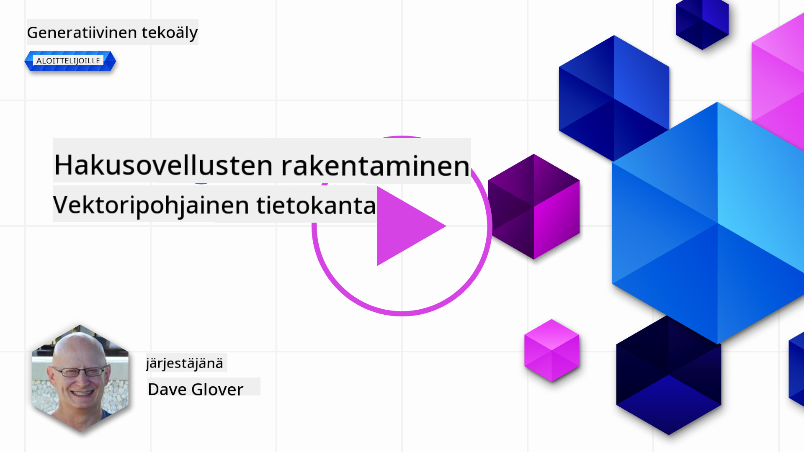
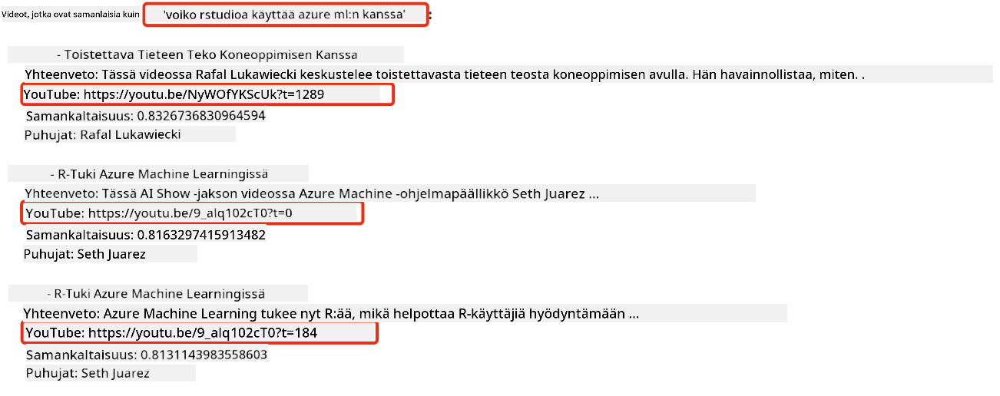
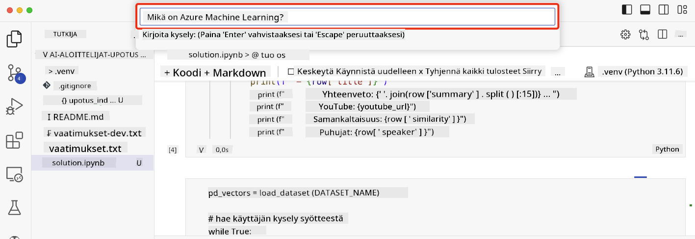

<!--
CO_OP_TRANSLATOR_METADATA:
{
  "original_hash": "d46aad0917a1a342d613e2c13d457da5",
  "translation_date": "2025-05-19T18:34:32+00:00",
  "source_file": "08-building-search-applications/README.md",
  "language_code": "fi"
}
-->
# Hakusovellusten rakentaminen

[](https://aka.ms/gen-ai-lesson8-gh?WT.mc_id=academic-105485-koreyst)

> > _Klikkaa yllä olevaa kuvaa nähdäksesi tämän oppitunnin videon_

Suuret kielimallit (LLM) tarjoavat enemmän kuin chatbotit ja tekstin luomisen. On myös mahdollista rakentaa hakusovelluksia käyttämällä upotuksia. Upotukset ovat datan numeerisia esityksiä, tunnetaan myös vektoreina, ja niitä voidaan käyttää semanttiseen datan hakuun.

Tässä oppitunnissa rakennat hakusovelluksen koulutusstartupillemme. Startupimme on voittoa tavoittelematon organisaatio, joka tarjoaa ilmaista koulutusta opiskelijoille kehittyvissä maissa. Startupillamme on suuri määrä YouTube-videoita, joita opiskelijat voivat käyttää oppiakseen tekoälystä. Startupimme haluaa rakentaa hakusovelluksen, jonka avulla opiskelijat voivat etsiä YouTube-videota kirjoittamalla kysymyksen.

Esimerkiksi opiskelija saattaa kirjoittaa 'Mitä ovat Jupyter-muistikirjat?' tai 'Mikä on Azure ML' ja hakusovellus palauttaa listan YouTube-videoista, jotka ovat relevantteja kysymykselle, ja vielä parempaa, hakusovellus palauttaa linkin siihen kohtaan videosta, jossa kysymyksen vastaus sijaitsee.

## Johdanto

Tässä oppitunnissa käsitellään:

- Semanttinen vs avainsanahaku.
- Mitä ovat tekstin upotukset.
- Tekstin upotusindeksin luominen.
- Tekstin upotusindeksin hakeminen.

## Oppimistavoitteet

Oppitunnin jälkeen osaat:

- Erottaa semanttisen ja avainsanahaun toisistaan.
- Selittää, mitä tekstin upotukset ovat.
- Luoda sovelluksen, joka käyttää upotuksia datan hakemiseen.

## Miksi rakentaa hakusovellus?

Hakusovelluksen luominen auttaa sinua ymmärtämään, kuinka käyttää upotuksia datan hakemiseen. Opit myös, kuinka rakentaa hakusovelluksen, jota opiskelijat voivat käyttää tiedon nopeaan löytämiseen.

Oppitunnissa on mukana YouTube-transkriptien upotusindeksi Microsoftin [AI Show](https://www.youtube.com/playlist?list=PLlrxD0HtieHi0mwteKBOfEeOYf0LJU4O1) YouTube-kanavalle. AI Show on YouTube-kanava, joka opettaa tekoälystä ja koneoppimisesta. Upotusindeksi sisältää upotukset kullekin YouTube-transkriptille lokakuuhun 2023 asti. Käytät upotusindeksiä rakentaaksesi hakusovelluksen startupillemme. Hakusovellus palauttaa linkin siihen kohtaan videosta, jossa kysymyksen vastaus sijaitsee. Tämä on loistava tapa opiskelijoille löytää tarvitsemaansa tietoa nopeasti.

Seuraavassa on esimerkki semanttisesta kyselystä kysymykselle 'voiko rstudioa käyttää azure ml:n kanssa?'. Katso YouTube-url, näet, että url sisältää aikaleiman, joka vie sinut siihen kohtaan videosta, jossa kysymyksen vastaus sijaitsee.



## Mitä on semanttinen haku?

Saatat nyt ihmetellä, mitä semanttinen haku on? Semanttinen haku on hakutekniikka, joka käyttää kyselyn sanojen semantiikkaa eli merkitystä palauttaakseen relevantteja tuloksia.

Tässä on esimerkki semanttisesta hausta. Oletetaan, että etsit autoa ostettavaksi, saatat hakea 'unelma-autoni', semanttinen haku ymmärtää, että et ole `dreaming` autosta, vaan etsit ostettavaksi `ideal` autoa. Semanttinen haku ymmärtää aikomuksesi ja palauttaa relevantteja tuloksia. Vaihtoehtona on `keyword search`, joka kirjaimellisesti hakisi unelmia autoista ja usein palauttaisi epäolennaisia tuloksia.

## Mitä ovat tekstin upotukset?

[Tekstin upotukset](https://en.wikipedia.org/wiki/Word_embedding?WT.mc_id=academic-105485-koreyst) ovat tekstin esitystekniikka, jota käytetään [luonnollisen kielen prosessoinnissa](https://en.wikipedia.org/wiki/Natural_language_processing?WT.mc_id=academic-105485-koreyst). Tekstin upotukset ovat tekstin semanttisia numeerisia esityksiä. Upotuksia käytetään esittämään dataa tavalla, joka on koneelle helppo ymmärtää. On monia malleja tekstin upotusten rakentamiseen, tässä oppitunnissa keskitymme upotusten luomiseen käyttämällä OpenAI:n upotusmallia.

Tässä on esimerkki, kuvittele seuraavan tekstin olevan transkriptissä yhdestä AI Show YouTube-kanavan jaksosta:

```text
Today we are going to learn about Azure Machine Learning.
```

Lähetämme tekstin OpenAI:n upotus-API:lle ja se palauttaa seuraavan upotuksen, joka koostuu 1536 numerosta eli vektorista. Jokainen numero vektorissa edustaa eri aspektia tekstistä. Lyhyyden vuoksi tässä ovat vektorin ensimmäiset 10 numeroa.

```python
[-0.006655829958617687, 0.0026128944009542465, 0.008792596869170666, -0.02446001023054123, -0.008540431968867779, 0.022071078419685364, -0.010703742504119873, 0.003311325330287218, -0.011632772162556648, -0.02187200076878071, ...]
```

## Kuinka upotusindeksi luodaan?

Tämän oppitunnin upotusindeksi luotiin sarjalla Python-skriptejä. Löydät skriptit ja ohjeet [README](./scripts/README.md?WT.mc_id=academic-105485-koreyst) -tiedostosta 'scripts' -kansiosta tälle oppitunnille. Sinun ei tarvitse suorittaa näitä skriptejä suorittaaksesi tämän oppitunnin, sillä upotusindeksi on tarjottu sinulle.

Skriptit suorittavat seuraavat toiminnot:

1. Transkripti kustakin YouTube-videosta [AI Show](https://www.youtube.com/playlist?list=PLlrxD0HtieHi0mwteKBOfEeOYf0LJU4O1) -soittolistalla ladataan.
2. Käyttäen [OpenAI:n funktioita](https://learn.microsoft.com/azure/ai-services/openai/how-to/function-calling?WT.mc_id=academic-105485-koreyst), yritetään poimia puhujan nimi YouTube-transkriptin ensimmäisiltä 3 minuutilta. Kunkin videon puhujan nimi tallennetaan upotusindeksiin nimeltä `embedding_index_3m.json`.
3. Transkriptiteksti jaetaan **3 minuutin tekstisegmentteihin**. Segmentti sisältää noin 20 sanaa päällekkäin seuraavasta segmentistä varmistaakseen, että segmentin upotus ei katkea ja tarjotakseen paremman hakukontekstin.
4. Kukin tekstisegmentti lähetetään OpenAI:n chat-API:lle tiivistettäväksi 60 sanaan. Tiivistelmä tallennetaan myös upotusindeksiin `embedding_index_3m.json`.
5. Lopuksi segmenttiteksti lähetetään OpenAI:n upotus-API:lle. Upotus-API palauttaa vektorin, joka koostuu 1536 numerosta, jotka edustavat segmentin semanttista merkitystä. Segmentti yhdessä OpenAI:n upotusvektorin kanssa tallennetaan upotusindeksiin `embedding_index_3m.json`.

### Vektoripohjaiset tietokannat

Oppitunnin yksinkertaisuuden vuoksi upotusindeksi tallennetaan JSON-tiedostoon nimeltä `embedding_index_3m.json` ja ladataan Pandas DataFrameen. Kuitenkin tuotannossa upotusindeksi tallennettaisiin vektoripohjaiseen tietokantaan, kuten [Azure Cognitive Search](https://learn.microsoft.com/training/modules/improve-search-results-vector-search?WT.mc_id=academic-105485-koreyst), [Redis](https://cookbook.openai.com/examples/vector_databases/redis/readme?WT.mc_id=academic-105485-koreyst), [Pinecone](https://cookbook.openai.com/examples/vector_databases/pinecone/readme?WT.mc_id=academic-105485-koreyst), [Weaviate](https://cookbook.openai.com/examples/vector_databases/weaviate/readme?WT.mc_id=academic-105485-koreyst), vain muutamia mainitakseni.

## Kosinissamankaltaisuuden ymmärtäminen

Olemme oppineet tekstin upotuksista, seuraava askel on oppia käyttämään tekstin upotuksia datan hakemiseen ja erityisesti löytämään samankaltaisimmat upotukset annetulle kyselylle kosinissamankaltaisuuden avulla.

### Mitä on kosinissamankaltaisuus?

Kosinissamankaltaisuus on kahden vektorin samankaltaisuuden mittari, tätä kutsutaan myös `nearest neighbor search`. Kosinissamankaltaisuushaku suoritetaan _vektorisoimalla_ kyselyteksti OpenAI:n upotus-API:n avulla. Sitten lasketaan _kosinissamankaltaisuus_ kyselyvektorin ja kunkin vektorin välillä upotusindeksissä. Muista, että upotusindeksissä on vektori kullekin YouTube-transkriptin tekstisegmentille. Lopuksi järjestä tulokset kosinissamankaltaisuuden mukaan, ja tekstisegmentit, joilla on korkeimmat kosinissamankaltaisuudet, ovat samankaltaisimpia kyselyyn nähden.

Matemaattisesta näkökulmasta kosinissamankaltaisuus mittaa kulman kosinia kahden vektorin välillä, jotka on projisoitu monidimensionaaliseen tilaan. Tämä mittaus on hyödyllinen, koska vaikka kaksi dokumenttia olisivat kaukana toisistaan euklidisella etäisyydellä koon vuoksi, niillä voisi silti olla pienempi kulma niiden välillä ja siten korkeampi kosinissamankaltaisuus. Lisätietoja kosinissamankaltaisuusyhtälöistä, katso [Kosinissamankaltaisuus](https://en.wikipedia.org/wiki/Cosine_similarity?WT.mc_id=academic-105485-koreyst).

## Ensimmäisen hakusovelluksen rakentaminen

Seuraavaksi opimme rakentamaan hakusovelluksen käyttäen upotuksia. Hakusovellus sallii opiskelijoiden hakea videota kirjoittamalla kysymyksen. Hakusovellus palauttaa listan videoista, jotka ovat relevantteja kysymykselle. Hakusovellus palauttaa myös linkin siihen kohtaan videosta, jossa kysymyksen vastaus sijaitsee.

Tämä ratkaisu on rakennettu ja testattu Windows 11, macOS ja Ubuntu 22.04 -käyttöjärjestelmissä käyttäen Python 3.10 tai uudempi. Voit ladata Pythonin [python.org](https://www.python.org/downloads/?WT.mc_id=academic-105485-koreyst) -sivustolta.

## Tehtävä - hakusovelluksen rakentaminen, opiskelijoiden mahdollistamiseksi

Esittelimme startupimme tämän oppitunnin alussa. Nyt on aika mahdollistaa opiskelijoiden rakentaa hakusovellus heidän arviointeihinsa.

Tässä tehtävässä luot Azure OpenAI -palvelut, joita käytetään hakusovelluksen rakentamiseen. Luot seuraavat Azure OpenAI -palvelut. Tarvitset Azure-tilauksen suorittaaksesi tämän tehtävän.

### Azure Cloud Shellin käynnistäminen

1. Kirjaudu sisään [Azure-portaaliin](https://portal.azure.com/?WT.mc_id=academic-105485-koreyst).
2. Valitse Cloud Shell -kuvake Azure-portaalin oikeasta yläkulmasta.
3. Valitse **Bash** ympäristötyypiksi.

#### Luo resurssiryhmä

> Näissä ohjeissa käytämme resurssiryhmää nimeltä "semantic-video-search" Itä-Yhdysvalloissa.
> Voit muuttaa resurssiryhmän nimeä, mutta kun muutat resurssien sijaintia,
> tarkista [mallin saatavuustaulukko](https://aka.ms/oai/models?WT.mc_id=academic-105485-koreyst).

```shell
az group create --name semantic-video-search --location eastus
```

#### Luo Azure OpenAI -palveluresurssi

Suorita Azure Cloud Shellistä seuraava komento luodaksesi Azure OpenAI -palveluresurssi.

```shell
az cognitiveservices account create --name semantic-video-openai --resource-group semantic-video-search \
    --location eastus --kind OpenAI --sku s0
```

#### Hanki päätepiste ja avaimet tämän sovelluksen käyttöä varten

Suorita Azure Cloud Shellistä seuraavat komennot saadaksesi päätepisteen ja avaimet Azure OpenAI -palveluresurssille.

```shell
az cognitiveservices account show --name semantic-video-openai \
   --resource-group  semantic-video-search | jq -r .properties.endpoint
az cognitiveservices account keys list --name semantic-video-openai \
   --resource-group semantic-video-search | jq -r .key1
```

#### Ota käyttöön OpenAI:n upotusmalli

Suorita Azure Cloud Shellistä seuraava komento ottaaksesi käyttöön OpenAI:n upotusmalli.

```shell
az cognitiveservices account deployment create \
    --name semantic-video-openai \
    --resource-group  semantic-video-search \
    --deployment-name text-embedding-ada-002 \
    --model-name text-embedding-ada-002 \
    --model-version "2"  \
    --model-format OpenAI \
    --sku-capacity 100 --sku-name "Standard"
```

## Ratkaisu

Avaa [ratkaisuvihko](../../../08-building-search-applications/python/aoai-solution.ipynb) GitHub Codespacesissa ja seuraa ohjeita Jupyter-muistikirjassa.

Kun suoritat muistikirjan, sinua pyydetään syöttämään kysely. Syöttöruutu näyttää tältä:



## Hienoa työtä! Jatka oppimista

Oppitunnin suorittamisen jälkeen tutustu [Generatiivisen tekoälyn oppimiskokoelmaan](https://aka.ms/genai-collection?WT.mc_id=academic-105485-koreyst) jatkaaksesi generatiivisen tekoälyosaamisen kehittämistä!

Siirry oppituntiin 9, jossa tarkastelemme kuinka [rakentaa kuvien luomissovelluksia](../09-building-image-applications/README.md?WT.mc_id=academic-105485-koreyst)!

**Vastuuvapauslauseke**:  
Tämä asiakirja on käännetty käyttämällä tekoälypohjaista käännöspalvelua [Co-op Translator](https://github.com/Azure/co-op-translator). Vaikka pyrimme tarkkuuteen, on hyvä huomata, että automaattiset käännökset voivat sisältää virheitä tai epätarkkuuksia. Alkuperäistä asiakirjaa sen alkuperäisellä kielellä tulisi pitää ensisijaisena lähteenä. Tärkeissä tiedoissa suositellaan ammattimaisen ihmiskääntäjän käyttöä. Emme ole vastuussa väärinkäsityksistä tai virheellisistä tulkinnoista, jotka johtuvat tämän käännöksen käytöstä.