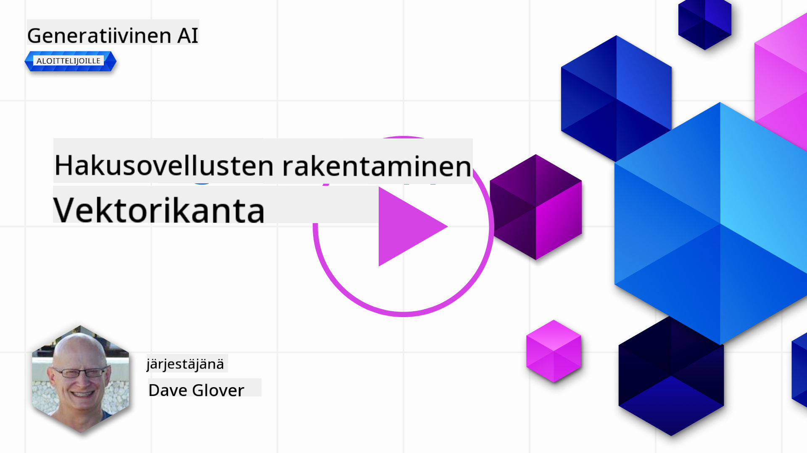
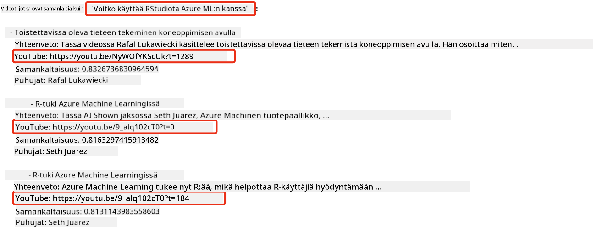
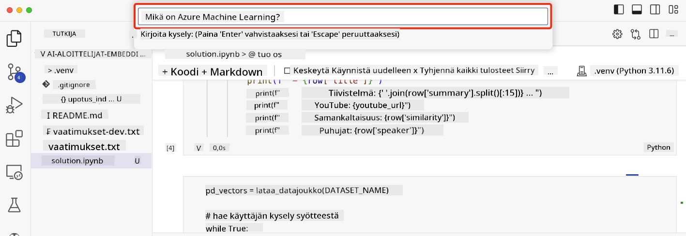

<!--
CO_OP_TRANSLATOR_METADATA:
{
  "original_hash": "d46aad0917a1a342d613e2c13d457da5",
  "translation_date": "2025-06-25T16:33:09+00:00",
  "source_file": "08-building-search-applications/README.md",
  "language_code": "fi"
}
-->
# Hakusovelluksen rakentaminen

[](https://aka.ms/gen-ai-lesson8-gh?WT.mc_id=academic-105485-koreyst)

> > _Klikkaa yllä olevaa kuvaa nähdäksesi tämän oppitunnin videon_

LLM:t ovat muutakin kuin chatbotteja ja tekstin generointia. On myös mahdollista rakentaa hakusovelluksia käyttämällä upotuksia. Upotukset ovat datan numeerisia esityksiä, joita kutsutaan myös vektoreiksi, ja niitä voidaan käyttää semanttiseen hakuun.

Tässä oppitunnissa rakennat hakusovelluksen koulutuskäynnistysyrityksellemme. Käynnistysyrityksemme on voittoa tavoittelematon organisaatio, joka tarjoaa ilmaista koulutusta opiskelijoille kehitysmaissa. Käynnistysyrityksellämme on suuri määrä YouTube-videoita, joita opiskelijat voivat käyttää oppiakseen tekoälystä. Käynnistysyrityksemme haluaa rakentaa hakusovelluksen, jonka avulla opiskelijat voivat etsiä YouTube-videota kirjoittamalla kysymyksen.

Esimerkiksi opiskelija saattaa kirjoittaa 'Mitä ovat Jupyter-muistikirjat?' tai 'Mitä on Azure ML', ja hakusovellus palauttaa luettelon YouTube-videoista, jotka liittyvät kysymykseen, ja vielä parempi, hakusovellus palauttaa linkin kohtaan videossa, jossa kysymykseen annetaan vastaus.

## Johdanto

Tässä oppitunnissa käsittelemme:

- Semanttinen vs avainsanahaku.
- Mitä ovat tekstin upotukset.
- Tekstin upotusten indeksin luominen.
- Tekstin upotusten indeksin hakeminen.

## Oppimistavoitteet

Tämän oppitunnin jälkeen pystyt:

- Erottamaan semanttisen ja avainsanahaun.
- Selittämään, mitä tekstin upotukset ovat.
- Luomaan sovelluksen, joka käyttää upotuksia datan hakemiseen.

## Miksi rakentaa hakusovellus?

Hakusovelluksen luominen auttaa sinua ymmärtämään, miten käyttää upotuksia datan hakemiseen. Opit myös rakentamaan hakusovelluksen, jota opiskelijat voivat käyttää löytääkseen tietoa nopeasti.

Oppitunnissa on upotusten indeksi Microsoft [AI Show](https://www.youtube.com/playlist?list=PLlrxD0HtieHi0mwteKBOfEeOYf0LJU4O1) YouTube-kanavan transkriptioista. AI Show on YouTube-kanava, joka opettaa tekoälystä ja koneoppimisesta. Upotusten indeksi sisältää upotukset kaikista YouTube-transkriptioista lokakuuhun 2023 asti. Käytät upotusten indeksiä rakentaaksesi hakusovelluksen käynnistysyrityksellemme. Hakusovellus palauttaa linkin kohtaan videossa, jossa kysymykseen annetaan vastaus. Tämä on loistava tapa opiskelijoille löytää tarvitsemansa tieto nopeasti.

Seuraava on esimerkki semanttisesta kyselystä kysymykseen 'Voiko rstudioa käyttää Azure ML:n kanssa?'. Tarkista YouTube-URL, näet, että URL sisältää aikaleiman, joka vie sinut kohtaan videossa, jossa kysymykseen annetaan vastaus.



## Mitä on semanttinen haku?

Nyt saatat miettiä, mitä on semanttinen haku? Semanttinen haku on hakutekniikka, joka käyttää kyselyn sanojen semantiikkaa tai merkitystä palauttaakseen olennaisia tuloksia.

Tässä on esimerkki semanttisesta hausta. Sanotaan, että halusit ostaa auton, saatat etsiä 'unelma-autoni', semanttinen haku ymmärtää, että et `dreaming` autoa, vaan haluat ostaa `ideal` autosi. Semanttinen haku ymmärtää aikomuksesi ja palauttaa olennaisia tuloksia. Vaihtoehtona on `keyword search`, joka kirjaimellisesti etsisi unelmia autoista ja usein palauttaisi epäolennaisia tuloksia.

## Mitä ovat tekstin upotukset?

[Tekstin upotukset](https://en.wikipedia.org/wiki/Word_embedding?WT.mc_id=academic-105485-koreyst) ovat tekstin esitystekniikka, jota käytetään [luonnollisen kielen käsittelyssä](https://en.wikipedia.org/wiki/Natural_language_processing?WT.mc_id=academic-105485-koreyst). Tekstin upotukset ovat tekstin semanttisia numeerisia esityksiä. Upotuksia käytetään datan esittämiseen tavalla, joka on helppo koneen ymmärtää. On monia malleja tekstin upotusten rakentamiseen, tässä oppitunnissa keskitymme upotusten generointiin käyttämällä OpenAI Upotusmallia.

Tässä on esimerkki, kuvittele, että seuraava teksti on transkriptiossa yhdestä AI Show YouTube-kanavan jaksoista:

```text
Today we are going to learn about Azure Machine Learning.
```

Lähetämme tekstin OpenAI Upotus-API:lle, ja se palauttaa seuraavan upotuksen, joka koostuu 1536 numerosta eli vektorista. Jokainen numero vektorissa edustaa eri aspektia tekstistä. Tässä lyhyesti vektorin ensimmäiset 10 numeroa.

```python
[-0.006655829958617687, 0.0026128944009542465, 0.008792596869170666, -0.02446001023054123, -0.008540431968867779, 0.022071078419685364, -0.010703742504119873, 0.003311325330287218, -0.011632772162556648, -0.02187200076878071, ...]
```

## Miten upotusten indeksi luodaan?

Tämän oppitunnin upotusten indeksi luotiin sarjalla Python-skriptejä. Löydät skriptit ja ohjeet [README](./scripts/README.md?WT.mc_id=academic-105485-koreyst) tiedostosta tämän oppitunnin 'scripts' kansiossa. Sinun ei tarvitse suorittaa näitä skriptejä oppitunnin suorittamiseksi, sillä upotusten indeksi on tarjolla sinulle.

Skriptit suorittavat seuraavat toiminnot:

1. Kunkin YouTube-videon transkriptio [AI Show](https://www.youtube.com/playlist?list=PLlrxD0HtieHi0mwteKBOfEeOYf0LJU4O1) soittolistassa ladataan.
2. Käyttämällä [OpenAI-toimintoja](https://learn.microsoft.com/azure/ai-services/openai/how-to/function-calling?WT.mc_id=academic-105485-koreyst), yritetään saada puhujan nimi YouTube-transkription ensimmäisistä 3 minuutista. Kunkin videon puhujan nimi tallennetaan upotusten indeksiin nimeltä `embedding_index_3m.json`.
3. Transkriptioteksti jaetaan **3 minuutin tekstisegmentteihin**. Segmentti sisältää noin 20 sanaa seuraavasta segmentistä varmistaakseen, että segmentin upotus ei katkea ja tarjoaa paremman hakukontekstin.
4. Kukin tekstisegmentti lähetetään OpenAI Chat API:lle, joka tiivistää tekstin 60 sanaan. Tiivistelmä tallennetaan myös upotusten indeksiin `embedding_index_3m.json`.
5. Lopuksi segmenttiteksti lähetetään OpenAI Upotus-API:lle. Upotus-API palauttaa vektorin, jossa on 1536 numeroa, jotka edustavat segmentin semanttista merkitystä. Segmentti yhdessä OpenAI Upotusvektorin kanssa tallennetaan upotusten indeksiin `embedding_index_3m.json`.

### Vektoripohjaiset tietokannat

Oppitunnin yksinkertaisuuden vuoksi upotusten indeksi tallennetaan JSON-tiedostoon nimeltä `embedding_index_3m.json` ja ladataan Pandas DataFrameen. Kuitenkin tuotannossa upotusten indeksi tallennettaisiin vektoripohjaiseen tietokantaan kuten [Azure Cognitive Search](https://learn.microsoft.com/training/modules/improve-search-results-vector-search?WT.mc_id=academic-105485-koreyst), [Redis](https://cookbook.openai.com/examples/vector_databases/redis/readme?WT.mc_id=academic-105485-koreyst), [Pinecone](https://cookbook.openai.com/examples/vector_databases/pinecone/readme?WT.mc_id=academic-105485-koreyst), [Weaviate](https://cookbook.openai.com/examples/vector_databases/weaviate/readme?WT.mc_id=academic-105485-koreyst), muutamia mainitakseni.

## Ymmärtäminen kosinisen samankaltaisuuden

Olemme oppineet tekstin upotuksista, seuraava askel on oppia käyttämään tekstin upotuksia datan hakemiseen ja erityisesti löytämään samankaltaisimmat upotukset tietylle kyselylle käyttämällä kosinisen samankaltaisuutta.

### Mitä on kosininen samankaltaisuus?

Kosininen samankaltaisuus on kahden vektorin samankaltaisuuden mitta, jota kutsutaan myös `nearest neighbor search`. Kosinisen samankaltaisuuden hakuun sinun täytyy _vektorisoida_ _kysely_teksti käyttäen OpenAI Upotus-API:ta. Sitten laskea _kosininen samankaltaisuus_ kyselyvektorin ja kunkin vektorin välillä upotusten indeksissä. Muista, että upotusten indeksissä on vektori kullekin YouTube-transkriptio tekstisegmentille. Lopuksi, lajittele tulokset kosinisen samankaltaisuuden mukaan, ja tekstisegmentit, joilla on korkein kosininen samankaltaisuus, ovat samankaltaisimpia kyselyn kanssa.

Matemaattisesta näkökulmasta kosininen samankaltaisuus mittaa kahden vektorin välisen kulman kosinia monidimensioisessa tilassa. Tämä mittaus on hyödyllinen, koska jos kaksi dokumenttia ovat kaukana toisistaan Euklidisella etäisyydellä koon vuoksi, niillä voi silti olla pienempi kulma niiden välillä ja siten korkeampi kosininen samankaltaisuus. Lisätietoja kosinisen samankaltaisuuden yhtälöistä löytyy [Kosininen samankaltaisuus](https://en.wikipedia.org/wiki/Cosine_similarity?WT.mc_id=academic-105485-koreyst).

## Ensimmäisen hakusovelluksen rakentaminen

Seuraavaksi opimme, miten rakentaa hakusovellus käyttämällä upotuksia. Hakusovellus sallii opiskelijoiden etsiä videota kirjoittamalla kysymyksen. Hakusovellus palauttaa luettelon videoista, jotka ovat olennaisia kysymykselle. Hakusovellus palauttaa myös linkin kohtaan videossa, jossa kysymykseen annetaan vastaus.

Tämä ratkaisu rakennettiin ja testattiin Windows 11:llä, macOS:llä ja Ubuntu 22.04:llä käyttäen Python 3.10 tai uudempi. Voit ladata Pythonin [python.org](https://www.python.org/downloads/?WT.mc_id=academic-105485-koreyst).

## Tehtävä - hakusovelluksen rakentaminen, opiskelijoiden tukeminen

Esittelimme käynnistysyrityksemme oppitunnin alussa. Nyt on aika mahdollistaa opiskelijoiden rakentaa hakusovellus arviointejaan varten.

Tässä tehtävässä luot Azure OpenAI -palvelut, joita käytetään hakusovelluksen rakentamiseen. Luot seuraavat Azure OpenAI -palvelut. Tarvitset Azure-tilauksen tämän tehtävän suorittamiseen.

### Aloita Azure Cloud Shell

1. Kirjaudu sisään [Azure-portaaliin](https://portal.azure.com/?WT.mc_id=academic-105485-koreyst).
2. Valitse Cloud Shell -kuvake Azure-portaalin oikeassa yläkulmassa.
3. Valitse **Bash** ympäristötyypiksi.

#### Luo resurssiryhmä

> Näissä ohjeissa käytämme resurssiryhmää nimeltä "semantic-video-search" East US:ssa.
> Voit muuttaa resurssiryhmän nimeä, mutta kun muutat resurssien sijaintia,
> tarkista [mallin saatavuustaulukko](https://aka.ms/oai/models?WT.mc_id=academic-105485-koreyst).

```shell
az group create --name semantic-video-search --location eastus
```

#### Luo Azure OpenAI Service -resurssi

Azure Cloud Shellissä suorita seuraava komento luodaksesi Azure OpenAI Service -resurssi.

```shell
az cognitiveservices account create --name semantic-video-openai --resource-group semantic-video-search \
    --location eastus --kind OpenAI --sku s0
```

#### Hanki päätepiste ja avaimet tämän sovelluksen käyttöä varten

Azure Cloud Shellissä suorita seuraavat komennot saadaksesi päätepisteen ja avaimet Azure OpenAI Service -resurssille.

```shell
az cognitiveservices account show --name semantic-video-openai \
   --resource-group  semantic-video-search | jq -r .properties.endpoint
az cognitiveservices account keys list --name semantic-video-openai \
   --resource-group semantic-video-search | jq -r .key1
```

#### Ota OpenAI Upotusmalli käyttöön

Azure Cloud Shellissä suorita seuraava komento ottaaksesi OpenAI Upotusmallin käyttöön.

```shell
az cognitiveservices account deployment create \
    --name semantic-video-openai \
    --resource-group  semantic-video-search \
    --deployment-name text-embedding-ada-002 \
    --model-name text-embedding-ada-002 \
    --model-version "2"  \
    --model-format OpenAI \
    --sku-capacity 100 --sku-name "Standard"
```

## Ratkaisu

Avaa [ratkaisuvihko](../../../08-building-search-applications/python/aoai-solution.ipynb) GitHub Codespacesissa ja seuraa ohjeita Jupyter Notebookissa.

Kun suoritat vihkoa, sinua kehotetaan syöttämään kysely. Syöttölaatikko näyttää tältä:



## Hienoa työtä! Jatka oppimistasi

Tämän oppitunnin jälkeen tutustu [Generatiivisen tekoälyn oppimiskokoelmaan](https://aka.ms/genai-collection?WT.mc_id=academic-105485-koreyst) jatkaaksesi generatiivisen tekoälyn tietämyksen kartuttamista!

Siirry oppituntiin 9, jossa tarkastelemme, miten [rakentaa kuvan generointisovelluksia](../09-building-image-applications/README.md?WT.mc_id=academic-105485-koreyst)!

**Vastuuvapauslauseke**:  
Tämä asiakirja on käännetty käyttämällä tekoälykäännöspalvelua [Co-op Translator](https://github.com/Azure/co-op-translator). Vaikka pyrimme tarkkuuteen, huomioithan, että automaattiset käännökset saattavat sisältää virheitä tai epätarkkuuksia. Alkuperäistä asiakirjaa sen alkuperäisellä kielellä tulisi pitää auktoritatiivisena lähteenä. Kriittisen tiedon kohdalla suositellaan ammattimaista ihmiskäännöstä. Emme ole vastuussa mahdollisista väärinkäsityksistä tai virhetulkinnoista, jotka johtuvat tämän käännöksen käytöstä.